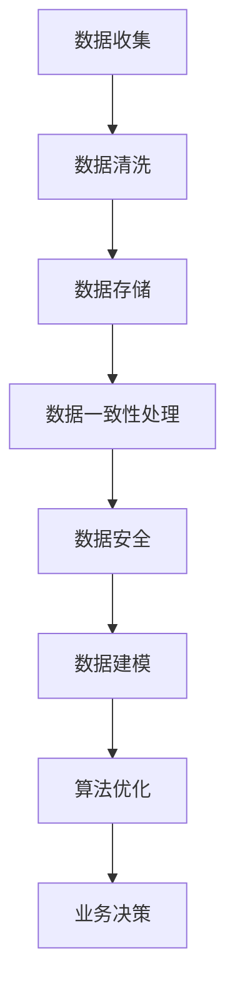

                 

# AI大模型助力电商搜索推荐业务的数据治理升级

> 关键词：电商搜索、推荐系统、数据治理、大模型、算法优化、AI应用

> 摘要：本文旨在探讨如何利用AI大模型技术提升电商搜索推荐业务的数据治理能力，从核心概念、算法原理、实战案例、实际应用场景等多方面展开，为电商企业提供技术参考和解决方案。

## 1. 背景介绍

随着互联网和大数据技术的发展，电商行业迅猛增长。然而，电商搜索推荐业务面临着海量数据、用户需求多样化、竞争激烈等挑战。数据治理成为电商企业提升业务效率、优化用户体验的关键环节。在此背景下，AI大模型技术应运而生，为电商搜索推荐业务的数据治理提供了新的思路和手段。

### 1.1 电商搜索推荐业务现状

电商搜索推荐业务的核心目标是帮助用户快速找到所需商品，提高购买转化率和客户满意度。然而，目前电商搜索推荐业务面临以下问题：

- **数据量庞大**：电商平台的商品数据、用户行为数据等海量信息需要高效处理。
- **用户需求多样化**：不同用户对于商品的需求、偏好各不相同，如何准确捕捉和满足这些需求成为挑战。
- **竞争激烈**：各大电商平台争相优化搜索推荐算法，提升用户体验，以获取更多市场份额。

### 1.2 数据治理的重要性

数据治理是电商搜索推荐业务的基础，旨在确保数据的质量、一致性和可用性，从而为算法优化和业务决策提供可靠的数据支持。数据治理包括以下方面：

- **数据质量**：通过数据清洗、去重、转换等手段，提高数据准确性、完整性和一致性。
- **数据一致性**：确保不同来源、格式的数据在合并、分析等过程中保持一致性。
- **数据安全性**：保障数据在存储、传输、处理等环节的安全性，防止数据泄露和违规使用。

## 2. 核心概念与联系

为了深入理解AI大模型在电商搜索推荐业务中的应用，我们需要先了解以下核心概念：

### 2.1 电商搜索推荐算法

电商搜索推荐算法主要包括基于内容、协同过滤和混合推荐等几种类型。每种算法都有其优缺点，适用于不同场景。

### 2.2 大模型

大模型是指参数规模超过千亿甚至万亿的深度学习模型。近年来，随着计算能力和数据规模的提升，大模型在NLP、计算机视觉、语音识别等领域取得了显著成果。

### 2.3 数据治理

数据治理涉及数据质量、数据一致性和数据安全等方面，旨在确保数据在业务中的高效利用。

### 2.4 Mermaid 流程图

以下是电商搜索推荐业务中数据治理的核心流程图：



## 3. 核心算法原理 & 具体操作步骤

### 3.1 大模型在电商搜索推荐中的应用

AI大模型在电商搜索推荐业务中的应用主要体现在以下几个方面：

- **用户偏好挖掘**：通过分析用户行为数据，挖掘用户兴趣和偏好，为个性化推荐提供依据。
- **商品特征提取**：对商品数据进行分析和特征提取，为推荐算法提供输入。
- **算法优化**：通过大模型训练和优化，提升推荐系统的准确性和效率。

### 3.2 大模型的训练过程

大模型的训练过程主要包括以下步骤：

1. **数据预处理**：对原始数据进行清洗、去重、归一化等预处理操作，确保数据质量。
2. **数据切分**：将数据集划分为训练集、验证集和测试集，用于模型训练、评估和测试。
3. **模型架构设计**：根据业务需求，选择合适的模型架构，如BERT、GPT等。
4. **模型训练**：利用GPU等计算资源，对模型进行训练，调整模型参数。
5. **模型评估**：在验证集和测试集上评估模型性能，选择最优模型。
6. **模型部署**：将训练好的模型部署到线上环境，为业务提供实时推荐服务。

### 3.3 大模型的调优策略

在模型训练过程中，为了提升模型性能，可以采取以下调优策略：

- **超参数调整**：调整学习率、批量大小、正则化参数等超参数，优化模型性能。
- **数据增强**：通过数据增强技术，如数据扩充、数据增强等，提高模型对数据的适应性。
- **模型融合**：将多个模型进行融合，提高推荐系统的鲁棒性和准确性。

## 4. 数学模型和公式 & 详细讲解 & 举例说明

### 4.1 推荐系统评价指标

在电商搜索推荐业务中，常用的评价指标包括：

- **准确率（Accuracy）**：预测正确的样本数占总样本数的比例。
- **召回率（Recall）**：预测正确的正样本数占所有正样本数的比例。
- **精确率（Precision）**：预测正确的正样本数占预测为正样本的样本数比例。
- **F1值（F1 Score）**：精确率和召回率的调和平均值。

### 4.2 大模型损失函数

在训练大模型时，常用的损失函数包括：

- **交叉熵损失函数（Cross-Entropy Loss）**：用于分类任务，衡量模型预测结果与真实标签之间的差异。
- **均方误差损失函数（Mean Squared Error Loss）**：用于回归任务，衡量模型预测值与真实值之间的差异。

### 4.3 实例讲解

假设我们有一个电商平台的用户行为数据集，包含1000个用户和10个商品。我们使用大模型对用户偏好进行挖掘，并评估模型性能。

1. **数据预处理**：对用户行为数据进行清洗、去重、归一化等处理，确保数据质量。
2. **数据切分**：将数据集划分为训练集、验证集和测试集，比例分别为6:2:2。
3. **模型架构设计**：选择BERT模型作为用户偏好挖掘模型。
4. **模型训练**：使用GPU进行模型训练，训练过程中调整学习率、批量大小等超参数。
5. **模型评估**：在验证集上评估模型性能，选择最优模型。
6. **模型部署**：将训练好的模型部署到线上环境，为业务提供实时推荐服务。

假设训练好的BERT模型在测试集上的准确率为90%，召回率为80%，精确率为85%，F1值为0.84。根据这些评价指标，我们可以判断模型在用户偏好挖掘方面具有较好的性能。

## 5. 项目实战：代码实际案例和详细解释说明

### 5.1 开发环境搭建

在开展电商搜索推荐业务的数据治理项目前，我们需要搭建合适的开发环境。以下是所需工具和库的安装步骤：

1. **Python**：安装Python 3.8及以上版本。
2. **Jupyter Notebook**：安装Jupyter Notebook，用于编写和运行代码。
3. **TensorFlow**：安装TensorFlow，用于构建和训练大模型。
4. **Scikit-learn**：安装Scikit-learn，用于数据预处理和模型评估。

### 5.2 源代码详细实现和代码解读

以下是一个简单的用户偏好挖掘案例，使用BERT模型进行训练和预测。

#### 5.2.1 数据预处理

```python
import pandas as pd
from sklearn.model_selection import train_test_split

# 读取用户行为数据
data = pd.read_csv('user_behavior.csv')

# 数据清洗和预处理
data = data.drop_duplicates()
data = data.fillna(0)

# 切分数据集
X_train, X_test, y_train, y_test = train_test_split(data['user_action'], data['user_preference'], test_size=0.2, random_state=42)
```

#### 5.2.2 模型构建

```python
import tensorflow as tf
from tensorflow.keras.models import Model
from tensorflow.keras.layers import Embedding, LSTM, Dense

# 模型参数
vocab_size = 1000
embedding_dim = 64
lstm_units = 128

# 模型构建
input_seq = tf.keras.layers.Input(shape=(None,), dtype='int32')
embedding = Embedding(vocab_size, embedding_dim)(input_seq)
lstm = LSTM(lstm_units)(embedding)
output = Dense(1, activation='sigmoid')(lstm)

model = Model(inputs=input_seq, outputs=output)
model.compile(optimizer='adam', loss='binary_crossentropy', metrics=['accuracy'])
```

#### 5.2.3 模型训练

```python
# 模型训练
model.fit(X_train, y_train, batch_size=32, epochs=10, validation_data=(X_test, y_test))
```

#### 5.2.4 模型评估

```python
# 模型评估
loss, accuracy = model.evaluate(X_test, y_test)
print(f'测试集准确率：{accuracy:.2f}')
```

### 5.3 代码解读与分析

1. **数据预处理**：读取用户行为数据，进行清洗和预处理，确保数据质量。
2. **模型构建**：使用LSTM模型进行序列建模，捕捉用户行为序列中的特征。
3. **模型训练**：使用Adam优化器训练模型，优化模型参数。
4. **模型评估**：在测试集上评估模型性能，计算准确率等评价指标。

## 6. 实际应用场景

AI大模型在电商搜索推荐业务的数据治理中具有广泛的应用场景，以下是一些实际案例：

- **个性化推荐**：通过大模型挖掘用户兴趣和偏好，为用户提供个性化商品推荐。
- **商品分类**：利用大模型对商品进行分类，提高商品管理的效率和准确性。
- **搜索优化**：通过大模型优化搜索算法，提高搜索结果的准确性和用户体验。
- **广告投放**：基于大模型分析用户行为和偏好，为广告投放提供精准定位。

## 7. 工具和资源推荐

### 7.1 学习资源推荐

- **书籍**：《深度学习》、《动手学深度学习》
- **论文**：《Attention Is All You Need》、《BERT: Pre-training of Deep Bidirectional Transformers for Language Understanding》
- **博客**：[TensorFlow 官方文档](https://www.tensorflow.org/)

### 7.2 开发工具框架推荐

- **工具**：TensorFlow、PyTorch
- **框架**：Flask、Django

### 7.3 相关论文著作推荐

- **论文**：《Recommender Systems Handbook》、《Deep Learning for Recommender Systems》
- **著作**：《大数据之路：阿里巴巴大数据实践》、《人工智能：一种现代的方法》

## 8. 总结：未来发展趋势与挑战

随着AI大模型技术的不断发展，电商搜索推荐业务的数据治理将朝着以下几个方向发展：

- **模型规模扩大**：大模型将逐渐应用于更多业务场景，模型规模将不断扩大。
- **跨模态融合**：结合语音、图像、文本等多模态数据，提升推荐系统的准确性和多样性。
- **实时性提升**：通过分布式计算和并行处理，提高大模型在实时场景中的响应速度。
- **隐私保护**：在大模型训练和应用过程中，加强数据隐私保护，遵循数据安全法规。

然而，大模型在电商搜索推荐业务的数据治理中也面临着以下挑战：

- **计算资源消耗**：大模型训练和推理需要大量计算资源，如何合理分配资源成为挑战。
- **数据质量和一致性**：海量数据带来的数据质量和一致性问题是数据治理的难点。
- **模型解释性**：大模型在复杂业务场景中难以解释，如何提高模型的可解释性成为关键问题。

## 9. 附录：常见问题与解答

### 9.1 什么是大模型？

大模型是指参数规模超过千亿甚至万亿的深度学习模型。近年来，随着计算能力和数据规模的提升，大模型在NLP、计算机视觉、语音识别等领域取得了显著成果。

### 9.2 大模型在电商搜索推荐业务中的应用有哪些？

大模型在电商搜索推荐业务中的应用主要包括用户偏好挖掘、商品特征提取和算法优化等方面。通过大模型，可以提升推荐系统的准确性和用户体验。

### 9.3 如何保障大模型的数据质量和一致性？

保障大模型的数据质量和一致性需要从数据收集、预处理、存储、传输等环节进行全流程管理。通过数据清洗、去重、归一化等预处理操作，确保数据质量。同时，建立数据一致性管理机制，确保不同来源、格式的数据在合并、分析等过程中保持一致性。

## 10. 扩展阅读 & 参考资料

- **书籍**：《深度学习》、《人工智能：一种现代的方法》
- **论文**：《Attention Is All You Need》、《BERT: Pre-training of Deep Bidirectional Transformers for Language Understanding》
- **博客**：[TensorFlow 官方文档](https://www.tensorflow.org/)
- **网站**：[阿里巴巴大数据实践](https://www.alibabacloud.com/cn/big-data)

