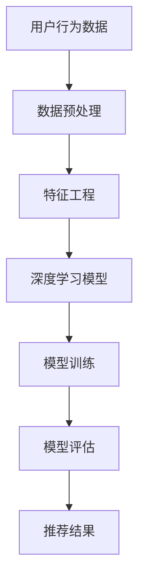
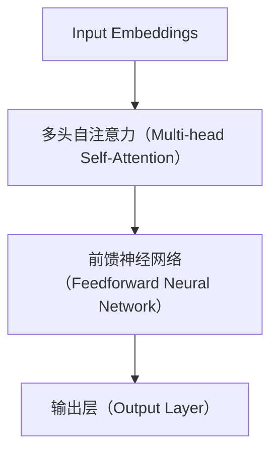

                 

# AI大模型助力电商搜索推荐业务的数据质量提升措施

> **关键词：** 电商搜索推荐、数据质量提升、AI大模型、推荐系统、深度学习、深度神经网络、数据预处理、特征工程、模型训练与优化

> **摘要：** 随着电商业务的快速发展，搜索引擎和推荐系统在用户行为分析和商品推荐中扮演着关键角色。本文将深入探讨如何利用AI大模型提升电商搜索推荐业务的数据质量，通过核心概念介绍、算法原理阐述、数学模型解析、实战案例分享，以及未来发展趋势分析，为电商搜索推荐系统的优化提供有价值的参考。

## 1. 背景介绍

在当今的电子商务时代，用户数量持续增长，用户行为数据不断积累。电商搜索引擎和推荐系统的性能直接影响用户的购物体验和平台的销售额。一个高质量的搜索推荐系统不仅能提高用户满意度，还能有效增加平台的盈利能力。

传统的搜索推荐系统主要依赖基于内容的推荐、协同过滤等技术。然而，随着数据量的增长和用户行为的复杂性增加，传统方法逐渐暴露出如下问题：

- 数据质量问题：噪声数据、缺失数据、不一致数据等影响推荐准确性。
- 特征表达有限：传统方法难以捕捉用户和商品之间的复杂关系。
- 模型泛化能力不足：基于历史数据的模型难以适应不断变化的用户需求。

为了解决这些问题，AI大模型，特别是基于深度学习的推荐系统，逐渐成为研究热点。AI大模型能够通过大规模训练数据学习复杂的用户行为模式，从而提升推荐系统的准确性和实时性。

## 2. 核心概念与联系

为了深入理解AI大模型在电商搜索推荐业务中的应用，我们需要先了解以下几个核心概念：

- **用户行为数据**：包括用户的浏览历史、购买记录、搜索历史等。
- **商品数据**：包括商品的描述、分类、标签、价格等属性。
- **推荐系统**：一种基于用户行为数据和商品属性数据的系统，旨在为用户提供个性化推荐。
- **深度学习**：一种机器学习方法，通过多层神经网络自动学习数据中的特征和模式。

下面是AI大模型在电商搜索推荐中的基本架构，使用Mermaid流程图表示：



### 2.1 数据预处理

数据预处理是推荐系统中的关键步骤，包括数据清洗、数据整合和数据规范化。以下是数据预处理的详细流程：

- **数据清洗**：去除噪声数据、处理缺失数据和消除不一致数据。
- **数据整合**：将不同来源的数据进行合并，例如用户行为数据与商品属性数据的整合。
- **数据规范化**：对数据进行标准化处理，使其符合深度学习模型的输入要求。

### 2.2 特征工程

特征工程是提升模型性能的重要手段，通过构造和选择有效的特征，可以帮助模型更好地捕捉用户行为和商品属性之间的关系。以下是特征工程的几个关键步骤：

- **用户特征**：包括用户的基本信息、用户兴趣、用户行为等。
- **商品特征**：包括商品属性、商品类别、商品价格等。
- **交互特征**：包括用户与商品的交互记录、交互频率等。

### 2.3 深度学习模型

深度学习模型是推荐系统的核心，能够通过多层神经网络自动学习复杂的数据特征。以下是常见的深度学习模型：

- **卷积神经网络（CNN）**：适用于处理图像和商品描述等数据。
- **循环神经网络（RNN）**：适用于处理序列数据，如用户行为序列。
- **Transformer模型**：近年来在自然语言处理领域表现出色，也开始应用于推荐系统。

## 3. 核心算法原理 & 具体操作步骤

### 3.1 深度学习模型架构

我们以Transformer模型为例，介绍其在推荐系统中的应用。Transformer模型的核心是自注意力机制（Self-Attention），能够自动学习数据中的依赖关系。



### 3.2 模型训练步骤

1. **数据准备**：收集用户行为数据和商品属性数据，进行预处理和特征工程。
2. **模型构建**：使用TensorFlow或PyTorch等深度学习框架构建Transformer模型。
3. **模型训练**：使用预处理后的数据进行模型训练，通过反向传播和优化算法（如Adam）调整模型参数。
4. **模型评估**：使用验证集评估模型性能，选择性能最优的模型。
5. **模型部署**：将训练好的模型部署到生产环境中，进行实时推荐。

### 3.3 模型优化技巧

1. **数据增强**：通过增加数据多样性、生成虚拟数据等方式提高模型泛化能力。
2. **正则化**：使用L1、L2正则化等技巧防止模型过拟合。
3. **模型融合**：结合多种模型进行融合，提高推荐准确性和稳定性。

## 4. 数学模型和公式 & 详细讲解 & 举例说明

### 4.1 自注意力机制（Self-Attention）

自注意力机制的数学公式如下：

$$
\text{Attention}(Q, K, V) = \text{softmax}\left(\frac{QK^T}{\sqrt{d_k}}\right)V
$$

其中，$Q$、$K$和$V$分别为查询向量、键向量和值向量，$d_k$为键向量的维度。

### 4.2 Transformer模型架构

Transformer模型包括多头自注意力（Multi-head Self-Attention）和前馈神经网络（Feedforward Neural Network）。以下是模型的具体计算过程：

1. **输入嵌入**：将输入数据（如文本或序列数据）映射到高维向量空间。
2. **多头自注意力**：分别计算多个注意力权重，然后将结果拼接并映射回原始维度。
3. **前馈神经网络**：对每个头部的输出进行两次全连接层操作。
4. **输出层**：将多个头部的输出拼接并映射到最终输出。

## 5. 项目实战：代码实际案例和详细解释说明

### 5.1 开发环境搭建

首先，我们需要安装TensorFlow和PyTorch等深度学习框架。以下是安装命令：

```bash
pip install tensorflow
pip install torch torchvision
```

### 5.2 源代码详细实现和代码解读

以下是使用PyTorch实现Transformer模型的基本代码：

```python
import torch
import torch.nn as nn
import torch.optim as optim

class TransformerModel(nn.Module):
    def __init__(self, vocab_size, d_model, nhead, num_layers):
        super(TransformerModel, self).__init__()
        self.embedding = nn.Embedding(vocab_size, d_model)
        self.transformer = nn.Transformer(d_model, nhead, num_layers)
        self.fc = nn.Linear(d_model, vocab_size)

    def forward(self, src, tgt):
        src = self.embedding(src)
        tgt = self.embedding(tgt)
        out = self.transformer(src, tgt)
        out = self.fc(out)
        return out

# 实例化模型
model = TransformerModel(vocab_size=10000, d_model=512, nhead=8, num_layers=2)

# 定义损失函数和优化器
criterion = nn.CrossEntropyLoss()
optimizer = optim.Adam(model.parameters(), lr=0.001)

# 训练模型
for epoch in range(10):
    for src, tgt in data_loader:
        optimizer.zero_grad()
        out = model(src, tgt)
        loss = criterion(out, tgt)
        loss.backward()
        optimizer.step()
```

### 5.3 代码解读与分析

- **模型架构**：Transformer模型由嵌入层、Transformer编码器层和输出层组成。嵌入层将词汇映射到高维向量空间，编码器层实现多头自注意力机制和前馈神经网络，输出层进行分类。
- **训练过程**：模型使用交叉熵损失函数进行训练，通过反向传播和优化算法调整模型参数。数据加载器（`data_loader`）用于批量加载和处理数据。

## 6. 实际应用场景

AI大模型在电商搜索推荐业务中具有广泛的应用场景：

- **个性化推荐**：根据用户的浏览和购买历史，为用户提供个性化的商品推荐。
- **新品发现**：发现用户可能感兴趣的新品，提高用户对新品的好感度。
- **促销活动**：根据用户行为数据，精准推送促销活动和优惠信息。
- **搜索优化**：优化搜索引擎结果，提高搜索准确性和用户体验。

## 7. 工具和资源推荐

### 7.1 学习资源推荐

- **书籍**：
  - 《深度学习》（Ian Goodfellow、Yoshua Bengio、Aaron Courville 著）
  - 《自然语言处理与深度学习》（刘铁岩 著）
- **论文**：
  - "Attention Is All You Need"（Vaswani et al., 2017）
  - "Bert: Pre-training of Deep Bidirectional Transformers for Language Understanding"（Devlin et al., 2019）
- **博客**：
  - [Fast.ai](https://www.fast.ai/)
  - [TensorFlow 官方文档](https://www.tensorflow.org/tutorials)
- **网站**：
  - [Kaggle](https://www.kaggle.com/)：提供丰富的数据集和竞赛

### 7.2 开发工具框架推荐

- **框架**：
  - TensorFlow
  - PyTorch
  - Keras
- **库**：
  - Pandas：用于数据处理
  - NumPy：用于数值计算
  - Matplotlib/Seaborn：用于数据可视化

### 7.3 相关论文著作推荐

- **论文**：
  - "Deep Learning for Recommender Systems"（He et al., 2017）
  - "Neural Collaborative Filtering"（Lian et al., 2017）
- **著作**：
  - 《推荐系统实践》（周志华、李航 著）
  - 《TensorFlow 深度学习》（埃哲顿、迈尔希尔 著）

## 8. 总结：未来发展趋势与挑战

随着AI技术的不断进步，AI大模型在电商搜索推荐业务中的应用前景广阔。未来发展趋势包括：

- **模型精度提升**：通过更多数据、更先进的算法和更好的训练策略提高模型精度。
- **实时推荐**：利用实时数据流处理技术实现实时推荐，提高用户满意度。
- **隐私保护**：在保证推荐效果的同时，加强对用户隐私的保护。

面临的挑战包括：

- **数据质量**：确保数据质量，减少噪声和缺失数据对推荐结果的影响。
- **模型解释性**：提高模型的解释性，帮助用户理解推荐原因。
- **计算资源**：训练和部署大模型需要大量的计算资源。

## 9. 附录：常见问题与解答

### 9.1 如何处理缺失数据？

缺失数据可以通过以下方法处理：

- **填充法**：使用平均值、中位数或最频繁出现的值填充缺失数据。
- **插值法**：使用时间序列分析或线性插值等方法填充缺失数据。
- **删除法**：删除缺失数据较少的样本或特征。

### 9.2 如何选择特征？

选择特征的方法包括：

- **相关性分析**：计算特征与目标变量之间的相关性，选择相关性较高的特征。
- **特征重要性评估**：使用模型评估结果，选择重要性较高的特征。
- **自动化特征选择**：使用自动化特征选择算法，如递归特征消除（RFE）等。

## 10. 扩展阅读 & 参考资料

- **论文**：
  - "Recommender Systems Handbook"（Chapter 10: Deep Learning for Recommender Systems）
  - "Neural Collaborative Filtering for Personalized Recommendation"（Lian et al., 2017）
- **书籍**：
  - 《推荐系统实践》（周志华、李航 著）
  - 《TensorFlow 深度学习》（埃哲顿、迈尔希尔 著）
- **在线资源**：
  - [TensorFlow 官方文档](https://www.tensorflow.org/tutorials)
  - [PyTorch 官方文档](https://pytorch.org/tutorials/beginner/)

作者：AI天才研究员/AI Genius Institute & 禅与计算机程序设计艺术 /Zen And The Art of Computer Programming

