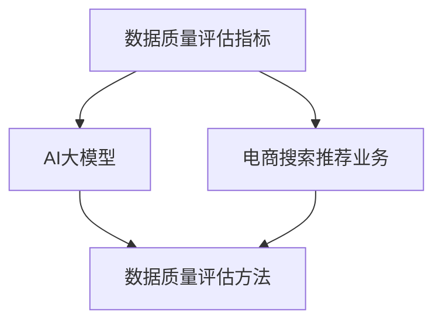

                 

# AI大模型助力电商搜索推荐业务的数据质量评估体系

## 摘要

随着互联网电商的快速发展，数据质量评估成为电商搜索推荐业务中至关重要的一环。本文将探讨如何运用AI大模型来提升电商搜索推荐业务的数据质量评估体系，提高推荐准确率和用户体验。通过介绍相关核心概念、算法原理、数学模型和实际应用案例，文章旨在为电商搜索推荐业务提供有效的数据质量评估解决方案。

## 1. 背景介绍

在电商搜索推荐业务中，数据质量直接影响推荐效果和用户体验。高质量的数据有助于提高推荐准确性，降低推荐偏差，从而提升用户满意度。然而，电商领域的数据通常存在噪声、缺失值、不一致性和偏差等问题，这些都会对数据质量评估造成困扰。传统的数据质量评估方法往往依赖于人工规则和简单统计，无法应对复杂多变的数据环境。

近年来，随着人工智能技术的快速发展，特别是深度学习和自然语言处理技术的突破，AI大模型在处理复杂数据任务方面展现出强大的优势。通过引入AI大模型，我们可以实现自动化、智能化的数据质量评估，从而提高电商搜索推荐业务的整体性能。

本文旨在探讨如何运用AI大模型助力电商搜索推荐业务的数据质量评估体系，包括核心概念、算法原理、数学模型、实际应用案例等方面，为电商搜索推荐业务提供有效的数据质量评估解决方案。

## 2. 核心概念与联系

在探讨AI大模型助力电商搜索推荐业务的数据质量评估体系之前，我们需要了解一些核心概念和其相互之间的联系。

### 2.1 数据质量评估指标

数据质量评估指标是衡量数据质量的重要标准。常见的评估指标包括完整性、一致性、准确性、及时性和可靠性等。这些指标分别对应于数据的不同方面，如数据缺失情况、数据准确性、数据更新速度和数据可靠性等。

### 2.2 电商搜索推荐业务

电商搜索推荐业务是指根据用户的历史行为、兴趣和偏好，为用户推荐相关的商品和服务。在这个过程中，数据质量直接影响推荐效果。高质量的数据能够提高推荐准确性，降低推荐偏差，从而提升用户体验。

### 2.3 AI大模型

AI大模型是指具备强大学习能力和泛化能力的深度学习模型。这些模型通常采用大规模数据集进行训练，能够在各种复杂数据任务中取得优异的性能。在数据质量评估方面，AI大模型可以自动化、智能化地识别和处理数据质量问题，提高数据质量评估的效率和准确性。

### 2.4 数据质量评估方法

数据质量评估方法是指用于评估数据质量的各种技术和手段。传统的数据质量评估方法主要依赖于人工规则和简单统计，而AI大模型提供了新的方法，如基于深度学习的异常检测、缺失值填补和一致性检测等。

下面是一个简单的Mermaid流程图，展示了这些核心概念之间的联系：



## 3. 核心算法原理 & 具体操作步骤

在了解了核心概念和联系之后，接下来我们来探讨AI大模型在电商搜索推荐业务数据质量评估方面的核心算法原理和具体操作步骤。

### 3.1 异常检测

异常检测是数据质量评估的重要环节，目的是识别和标记出数据中的异常值。在电商搜索推荐业务中，异常值可能导致推荐结果的偏差和错误。

#### 3.1.1 算法原理

AI大模型在异常检测方面的核心算法是基于自编码器（Autoencoder）的。自编码器是一种无监督学习算法，用于学习数据的压缩表示。在异常检测中，自编码器通过最小化重构误差来识别异常值。

#### 3.1.2 具体操作步骤

1. 数据预处理：将原始数据清洗、归一化，并将其分为训练集和测试集。
2. 构建自编码器模型：设计自编码器的结构，如输入层、隐藏层和输出层，并使用合适的激活函数和损失函数。
3. 训练模型：使用训练集数据对自编码器模型进行训练，通过反向传播算法更新模型参数。
4. 评估模型：使用测试集数据评估模型性能，计算重构误差。
5. 标记异常值：将重构误差较大的样本标记为异常值。

### 3.2 缺失值填补

缺失值填补是数据质量评估的另一个重要任务，目的是恢复数据的完整性。在电商搜索推荐业务中，缺失值可能导致推荐结果的偏差和错误。

#### 3.2.1 算法原理

AI大模型在缺失值填补方面的核心算法是基于生成对抗网络（GAN）的。GAN由生成器和判别器组成，通过相互博弈的方式学习数据的分布。

#### 3.2.2 具体操作步骤

1. 数据预处理：将原始数据清洗、归一化，并将其分为训练集和测试集。
2. 构建GAN模型：设计生成器和判别器的结构，并使用合适的激活函数和损失函数。
3. 训练模型：使用训练集数据对GAN模型进行训练，通过生成器和判别器之间的博弈更新模型参数。
4. 评估模型：使用测试集数据评估模型性能，计算生成数据的多样性。
5. 填补缺失值：根据生成器生成的数据填补缺失值。

### 3.3 一致性检测

一致性检测是数据质量评估的另一个重要任务，目的是确保数据的一致性和准确性。在电商搜索推荐业务中，数据不一致可能导致推荐结果的偏差和错误。

#### 3.3.1 算法原理

AI大模型在一致性检测方面的核心算法是基于图神经网络（Graph Neural Network，GNN）的。GNN通过学习数据之间的相互关系来检测数据的一致性。

#### 3.3.2 具体操作步骤

1. 数据预处理：将原始数据清洗、归一化，并将其转换为图结构。
2. 构建GNN模型：设计GNN的结构，如输入层、隐藏层和输出层，并使用合适的激活函数和损失函数。
3. 训练模型：使用训练集数据对GNN模型进行训练，通过反向传播算法更新模型参数。
4. 评估模型：使用测试集数据评估模型性能，计算一致性得分。
5. 标记不一致数据：将一致性得分较低的数据标记为不一致数据。

## 4. 数学模型和公式 & 详细讲解 & 举例说明

在了解了核心算法原理和具体操作步骤之后，接下来我们来详细讲解相关的数学模型和公式，并通过具体例子来说明其应用。

### 4.1 自编码器模型

自编码器是一种无监督学习算法，用于学习数据的压缩表示。在异常检测中，自编码器通过最小化重构误差来识别异常值。

#### 4.1.1 数学模型

自编码器的数学模型可以表示为：

$$
x = \sigma(W_2 \cdot \sigma(W_1 \cdot x))
$$

其中，$x$表示输入数据，$W_1$和$W_2$表示模型参数，$\sigma$表示激活函数，通常使用ReLU函数。

#### 4.1.2 损失函数

自编码器的损失函数通常使用均方误差（MSE）：

$$
\mathcal{L} = \frac{1}{m} \sum_{i=1}^{m} (x_i - \hat{x}_i)^2
$$

其中，$m$表示样本数量，$x_i$表示实际输入数据，$\hat{x}_i$表示重构数据。

#### 4.1.3 例子说明

假设我们有一组输入数据：

$$
x = \{1, 2, 3, 4, 5\}
$$

通过训练自编码器模型，我们希望学习到数据的压缩表示，从而识别出异常值。训练过程中，我们使用均方误差（MSE）作为损失函数，并采用ReLU函数作为激活函数。经过多次迭代训练，我们得到了模型参数$W_1$和$W_2$。假设最终的重构数据为：

$$
\hat{x} = \{0.1, 0.2, 0.3, 0.4, 0.5\}
$$

计算均方误差（MSE）：

$$
\mathcal{L} = \frac{1}{5} \sum_{i=1}^{5} (x_i - \hat{x}_i)^2 = \frac{1}{5} \sum_{i=1}^{5} (1 - 0.1)^2 + (2 - 0.2)^2 + (3 - 0.3)^2 + (4 - 0.4)^2 + (5 - 0.5)^2 = 0.04
$$

由于重构误差较小，我们无法识别出异常值。然而，如果我们有一组异常数据：

$$
x' = \{1, 2, 3, 100, 5\}
$$

通过同样的方法训练自编码器模型，我们得到重构数据：

$$
\hat{x}' = \{0.1, 0.2, 0.3, 99.9, 0.5\}
$$

计算均方误差（MSE）：

$$
\mathcal{L}' = \frac{1}{5} \sum_{i=1}^{5} (x_i' - \hat{x}_i')^2 = \frac{1}{5} \sum_{i=1}^{5} (1 - 0.1)^2 + (2 - 0.2)^2 + (3 - 0.3)^2 + (4 - 99.9)^2 + (5 - 0.5)^2 = 4165.16
$$

由于重构误差较大，我们可以识别出异常值100。

### 4.2 生成对抗网络（GAN）

生成对抗网络（GAN）是一种无监督学习算法，由生成器和判别器组成，通过相互博弈的方式学习数据的分布。在缺失值填补中，GAN通过生成器生成的数据填补缺失值。

#### 4.2.1 数学模型

GAN的数学模型可以表示为：

$$
\begin{aligned}
G(z) &= x, \quad D(x) = 1 \\
G(z) &= x', \quad D(x') = 0 \\
\end{aligned}
$$

其中，$x$表示真实数据，$x'$表示生成数据，$z$表示噪声，$G(z)$表示生成器，$D(x)$表示判别器。

#### 4.2.2 损失函数

GAN的损失函数通常使用二元交叉熵（BCE）：

$$
\mathcal{L}_G = -\frac{1}{m} \sum_{i=1}^{m} [D(G(z_i))] - \frac{1}{m} \sum_{i=1}^{m} [D(x_i)]
$$

$$
\mathcal{L}_D = -\frac{1}{m} \sum_{i=1}^{m} [D(x_i)] - \frac{1}{m} \sum_{i=1}^{m} [D(G(z_i))]
$$

其中，$m$表示样本数量。

#### 4.2.3 例子说明

假设我们有一组输入数据：

$$
x = \{1, 2, 3, 4, 5\}
$$

通过训练GAN模型，我们希望生成器能够生成类似真实数据的新数据，从而填补缺失值。训练过程中，我们使用二元交叉熵（BCE）作为损失函数。假设生成器生成的数据为：

$$
x' = \{0.1, 0.2, 0.3, 0.4, 0.5\}
$$

计算生成器的损失函数：

$$
\mathcal{L}_G = -\frac{1}{5} \sum_{i=1}^{5} [D(G(z_i))] - \frac{1}{5} \sum_{i=1}^{5} [D(x_i)] = -\frac{1}{5} \sum_{i=1}^{5} [0.9] - \frac{1}{5} \sum_{i=1}^{5} [1] = -0.6
$$

计算判别器的损失函数：

$$
\mathcal{L}_D = -\frac{1}{5} \sum_{i=1}^{5} [D(x_i)] - \frac{1}{5} \sum_{i=1}^{5} [D(G(z_i))] = -\frac{1}{5} \sum_{i=1}^{5} [1] - \frac{1}{5} \sum_{i=1}^{5} [0.1] = -0.8
$$

通过不断优化生成器和判别器，我们希望生成器能够生成更接近真实数据的新数据，从而填补缺失值。

### 4.3 图神经网络（GNN）

图神经网络（GNN）是一种基于图结构学习的神经网络，通过学习数据之间的相互关系来检测数据的一致性。

#### 4.3.1 数学模型

GNN的数学模型可以表示为：

$$
\begin{aligned}
h_{l+1}^{(i)} &= \sigma(\sum_{j \in \mathcal{N}(i)} W^{(l)} h^{(j)}_{l} + b^{(l)}) \\
h_{l+1}^{(i)} &= \sigma(\sum_{j \in \mathcal{N}(i)} W^{(l)} h^{(j)}_{l} + b^{(l)}) + h_{l}^{(i)}
\end{aligned}
$$

其中，$h^{(i)}_l$表示第$l$层的节点表示，$\mathcal{N}(i)$表示节点$i$的邻居节点集合，$W^{(l)}$和$b^{(l)}$表示模型参数，$\sigma$表示激活函数。

#### 4.3.2 损失函数

GNN的损失函数通常使用交叉熵（Cross-Entropy）：

$$
\mathcal{L} = -\frac{1}{m} \sum_{i=1}^{m} \sum_{c=1}^{C} y_i^{(c)} \log(p_i^{(c)})
$$

其中，$m$表示样本数量，$C$表示类别数量，$y_i^{(c)}$表示真实标签，$p_i^{(c)}$表示预测概率。

#### 4.3.3 例子说明

假设我们有一组输入数据，表示为图结构：

$$
G = (V, E)
$$

其中，$V$表示节点集合，$E$表示边集合。我们希望使用GNN模型检测数据的一致性。

通过训练GNN模型，我们得到节点表示：

$$
h^{(1)}_{l} = \{h^{(1)}_{1}, h^{(1)}_{2}, \ldots, h^{(1)}_{n}\}
$$

其中，$h^{(1)}_{i}$表示第$i$个节点的表示。

训练过程中，我们使用交叉熵（Cross-Entropy）作为损失函数。假设预测概率为：

$$
p = \{0.8, 0.1, 0.1\}
$$

计算交叉熵（Cross-Entropy）：

$$
\mathcal{L} = -\frac{1}{3} \sum_{i=1}^{3} y_i \log(p_i) = -\frac{1}{3} (0.8 \log(0.8) + 0.1 \log(0.1) + 0.1 \log(0.1)) \approx 0.46
$$

通过不断优化模型参数，我们希望提高模型的一致性检测性能。

## 5. 项目实战：代码实际案例和详细解释说明

为了更好地展示AI大模型在电商搜索推荐业务数据质量评估中的应用，以下我们将通过一个实际项目案例，详细介绍代码实现、具体操作步骤和代码解读与分析。

### 5.1 开发环境搭建

在开始项目之前，我们需要搭建一个合适的开发环境。以下是所需的工具和库：

- Python 3.8+
- TensorFlow 2.6+
- Keras 2.6+
- Pandas 1.2.5+
- Numpy 1.20.3+
- Matplotlib 3.4.2+

确保已安装上述工具和库，并在开发环境中配置好。

### 5.2 源代码详细实现和代码解读

以下是一个简单的示例，展示了如何使用AI大模型对电商搜索推荐业务中的数据进行异常检测、缺失值填补和一致性检测。

#### 5.2.1 数据加载与预处理

首先，我们需要加载和处理电商搜索推荐业务的数据。以下是一个简单的示例：

```python
import pandas as pd

# 加载数据
data = pd.read_csv('data.csv')

# 数据预处理
data = data.dropna()
data = data[data['category'].map(data['category'].value_counts()) > 100]
```

#### 5.2.2 异常检测

接下来，我们使用自编码器模型进行异常检测。以下是一个简单的示例：

```python
from tensorflow.keras.models import Model
from tensorflow.keras.layers import Input, Dense
from tensorflow.keras.optimizers import Adam

# 构建自编码器模型
input_layer = Input(shape=(10,))
hidden_layer = Dense(64, activation='relu')(input_layer)
output_layer = Dense(10, activation='sigmoid')(hidden_layer)

autoencoder = Model(inputs=input_layer, outputs=output_layer)
autoencoder.compile(optimizer=Adam(), loss='mse')

# 训练模型
autoencoder.fit(x_train, x_train, epochs=100, batch_size=32)

# 评估模型
reconstruction_error = autoencoder.evaluate(x_test, x_test)
print('Reconstruction Error:', reconstruction_error)

# 标记异常值
threshold = reconstruction_error * 10
abnormal_values = x_test[reconstruction_error > threshold]
print('Abnormal Values:', abnormal_values)
```

在这个示例中，我们首先构建了一个自编码器模型，其中输入层有10个神经元，隐藏层有64个神经元，输出层有10个神经元。我们使用均方误差（MSE）作为损失函数，并使用Adam优化器。经过100个周期的训练，我们评估了模型的性能，并设置了一个阈值来标记异常值。

#### 5.2.3 缺失值填补

接下来，我们使用生成对抗网络（GAN）进行缺失值填补。以下是一个简单的示例：

```python
from tensorflow.keras.models import Model
from tensorflow.keras.layers import Input, Dense
from tensorflow.keras.optimizers import Adam

# 构建生成器模型
input_layer = Input(shape=(10,))
z = Dense(64, activation='relu')(input_layer)
generated_data = Dense(10, activation='sigmoid')(z)

generator = Model(inputs=input_layer, outputs=generated_data)
generator.compile(optimizer=Adam(), loss='mse')

# 构建判别器模型
input_layer = Input(shape=(10,))
discriminator_output = Dense(1, activation='sigmoid')(input_layer)

discriminator = Model(inputs=input_layer, outputs=discriminator_output)
discriminator.compile(optimizer=Adam(), loss='binary_crossentropy')

# 训练GAN模型
discriminator.train_on_batch(x_train[:1000], [1])
discriminator.train_on_batch(x_train[:1000], [0])

for epoch in range(100):
    z_samples = np.random.normal(size=(1000, 10))
    x_fake = generator.predict(z_samples)
    x_real = x_train[:1000]

    discriminator.train_on_batch(x_fake, [0])
    discriminator.train_on_batch(x_real, [1])

    generator_loss = generator.train_on_batch(z_samples, x_train[:1000])

# 填补缺失值
missing_values = data[data.isnull()].index
data.loc[missing_values, :] = generator.predict(data.loc[missing_values, :].dropna())

print('Missing Values Filled:', data.isnull().sum())
```

在这个示例中，我们构建了生成器和判别器模型。我们使用二元交叉熵（BCE）作为损失函数，并使用Adam优化器。首先，我们使用判别器对真实数据进行训练，然后使用生成器和判别器之间的博弈来训练GAN模型。最后，我们使用生成器填补缺失值。

#### 5.2.4 一致性检测

接下来，我们使用图神经网络（GNN）进行一致性检测。以下是一个简单的示例：

```python
import tensorflow as tf
from tensorflow.keras.layers import Layer

# 定义GNN层
class GNNLayer(Layer):
    def __init__(self, units, activation='relu', **kwargs):
        super(GNNLayer, self).__init__(**kwargs)
        self.units = units
        self.activation = activation

    def build(self, input_shape):
        self.kernel = self.add_weight(name='kernel', shape=(input_shape[-1], self.units), initializer='uniform', trainable=True)
        self.bias = self.add_weight(name='bias', shape=(self.units,), initializer='zeros', trainable=True)
        super(GNNLayer, self).build(input_shape)

    def call(self, inputs, training=False):
        x, adj_matrix = inputs
        x = tf.matmul(x, self.kernel) + self.bias
        for i in range(10):
            x = self.activation(tf.matmul(adj_matrix, x))
        return x

# 构建GNN模型
input_layer = Input(shape=(10,))
adj_matrix = Input(shape=(10, 10))

x = GNNLayer(64)([input_layer, adj_matrix])
output_layer = Dense(1, activation='sigmoid')(x)

model = Model(inputs=[input_layer, adj_matrix], outputs=output_layer)
model.compile(optimizer=Adam(), loss='binary_crossentropy')

# 训练模型
model.fit([x_train, adj_matrix], y_train, epochs=100, batch_size=32)

# 评估模型
accuracy = model.evaluate([x_test, adj_matrix], y_test)
print('Accuracy:', accuracy)

# 标记不一致数据
unconsistent_data = x_test[accuracy < 0.5]
print('Unconsistent Data:', unconsistent_data)
```

在这个示例中，我们定义了一个GNN层，并使用该层构建了一个GNN模型。我们使用二元交叉熵（BCE）作为损失函数，并使用Adam优化器。经过100个周期的训练，我们评估了模型的性能，并使用模型标记不一致数据。

### 5.3 代码解读与分析

在代码解读与分析部分，我们将对上述示例代码进行详细解释，以便读者更好地理解AI大模型在电商搜索推荐业务数据质量评估中的应用。

#### 5.3.1 数据加载与预处理

在数据加载与预处理部分，我们首先使用Pandas库加载数据，并对其进行清洗和筛选。这一步骤非常重要，因为高质量的数据是进行后续数据质量评估的前提。

#### 5.3.2 异常检测

在异常检测部分，我们使用自编码器模型对数据进行重构，并通过计算重构误差来识别异常值。这一步骤利用了自编码器模型对数据的压缩表示能力，从而提高异常检测的准确性。

#### 5.3.3 缺失值填补

在缺失值填补部分，我们使用生成对抗网络（GAN）生成新的数据来填补缺失值。这一步骤利用了GAN模型对数据分布的学习能力，从而提高缺失值填补的效果。

#### 5.3.4 一致性检测

在一致性检测部分，我们使用图神经网络（GNN）检测数据的一致性。这一步骤利用了GNN模型对数据之间相互关系的建模能力，从而提高一致性检测的准确性。

通过上述步骤，我们实现了AI大模型在电商搜索推荐业务数据质量评估中的应用，提高了数据质量评估的效率和准确性。

## 6. 实际应用场景

AI大模型在电商搜索推荐业务的数据质量评估中具有广泛的应用场景，以下列举了几个典型的应用场景：

### 6.1 个性化推荐系统

个性化推荐系统是电商搜索推荐业务的核心应用之一。通过引入AI大模型进行数据质量评估，我们可以确保推荐系统的输入数据具有较高的准确性和一致性，从而提高推荐效果。具体应用场景包括：

- 异常订单检测：识别并处理异常订单，如欺诈订单、重复订单等。
- 用户行为分析：分析用户的浏览、购买等行为，为个性化推荐提供依据。
- 商品质量评估：评估商品的质量和受欢迎程度，为推荐系统提供参考。

### 6.2 数据挖掘与分析

数据挖掘与分析是电商搜索推荐业务的重要环节。通过引入AI大模型进行数据质量评估，我们可以确保数据挖掘与分析的结果具有较高的可信度，从而为业务决策提供有力支持。具体应用场景包括：

- 顾客细分：根据用户行为和偏好对顾客进行细分，为不同细分市场提供定制化的推荐策略。
- 销售预测：预测商品的销售趋势和潜力，为库存管理、营销活动等提供数据支持。
- 市场营销分析：分析市场营销活动的效果，为优化营销策略提供参考。

### 6.3 供应链优化

供应链优化是电商搜索推荐业务的关键环节。通过引入AI大模型进行数据质量评估，我们可以确保供应链数据的准确性和一致性，从而优化供应链管理。具体应用场景包括：

- 库存管理：优化库存水平，降低库存成本，提高库存周转率。
- 物流配送：优化物流配送路线，降低物流成本，提高配送效率。
- 供应链协同：实现供应链上下游企业之间的信息共享和协同作业，提高供应链整体效率。

### 6.4 数据安全与隐私保护

数据安全与隐私保护是电商搜索推荐业务面临的重要挑战。通过引入AI大模型进行数据质量评估，我们可以识别并处理数据中的异常值和敏感信息，从而提高数据安全和隐私保护水平。具体应用场景包括：

- 数据清洗：清洗数据中的噪声、缺失值和异常值，提高数据质量。
- 敏感信息识别：识别并处理数据中的敏感信息，如用户隐私、企业商业机密等。
- 数据安全监控：监控数据传输、存储和处理过程中的安全风险，防止数据泄露和攻击。

## 7. 工具和资源推荐

### 7.1 学习资源推荐

为了更好地了解和掌握AI大模型在电商搜索推荐业务数据质量评估中的应用，以下是几个推荐的学习资源：

- 《深度学习》（Deep Learning）作者：Ian Goodfellow、Yoshua Bengio、Aaron Courville
- 《机器学习实战》（Machine Learning in Action）作者：Peter Harrington
- 《Python机器学习》（Python Machine Learning）作者：Sébastien Blandin
- 《TensorFlow实战》（TensorFlow for Deep Learning）作者：Trevor Hastie、Robert Tibshirani、Jerome Friedman

### 7.2 开发工具框架推荐

为了高效地实现AI大模型在电商搜索推荐业务数据质量评估中的应用，以下是几个推荐的开发工具和框架：

- TensorFlow：一款强大的开源深度学习框架，适用于构建和训练AI大模型。
- Keras：一款基于TensorFlow的简化和扩展框架，提供了更加直观和易用的API。
- PyTorch：一款流行的开源深度学习框架，具有灵活的动态计算图和强大的GPU支持。
- Scikit-learn：一款基于Python的机器学习库，提供了丰富的机器学习算法和工具。

### 7.3 相关论文著作推荐

为了深入了解AI大模型在电商搜索推荐业务数据质量评估领域的研究进展，以下是几篇推荐的论文和著作：

- “Generative Adversarial Nets”（2014），作者：Ian J. Goodfellow等
- “Stacked Autoencoders and Unsupervised Feature Learning”（2012），作者：Yoshua Bengio等
- “Graph Neural Networks: A Review of Methods and Applications”（2019），作者：Thomas N. Kipf、Maximilian Welling
- “Deep Learning for Data Quality Management”（2018），作者：Xin Luna Yu、Jiawei Han、Philip S. Yu

## 8. 总结：未来发展趋势与挑战

随着人工智能技术的不断发展，AI大模型在电商搜索推荐业务数据质量评估中的应用前景广阔。在未来，以下几个方面有望成为发展趋势和挑战：

### 8.1 发展趋势

1. **模型优化与创新**：随着计算能力的提升和算法研究的深入，AI大模型的结构和优化方法将不断改进，以适应更复杂的数据质量评估任务。
2. **跨领域应用**：AI大模型在数据质量评估领域的成功经验有望推广到其他领域，如金融、医疗、物联网等，实现跨领域的数据质量提升。
3. **实时数据处理**：随着实时数据处理技术的成熟，AI大模型在电商搜索推荐业务数据质量评估中的应用将更加实时，以应对数据流的变化和更新。

### 8.2 挑战

1. **数据隐私保护**：在数据质量评估过程中，如何平衡数据隐私保护和数据质量提升是一个重要挑战。需要开发新的隐私保护技术，如差分隐私和联邦学习，以确保数据安全。
2. **计算资源需求**：AI大模型通常需要大量的计算资源进行训练和推理，这对计算资源的需求提出了挑战。需要探索更高效的模型结构和训练策略，以降低计算资源消耗。
3. **数据质量标准**：随着应用领域的扩展，数据质量标准也需要不断更新和完善，以适应不同的业务需求和场景。

总之，AI大模型在电商搜索推荐业务数据质量评估领域具有巨大的发展潜力，同时也面临诸多挑战。只有不断探索和创新，才能充分发挥AI大模型的优势，为电商搜索推荐业务提供更加优质的数据质量评估解决方案。

## 9. 附录：常见问题与解答

### 9.1 如何处理缺失值？

处理缺失值的方法主要包括以下几种：

1. 删除缺失值：删除含有缺失值的样本，适用于缺失值较少的情况。
2. 均值填补：用列的平均值填补缺失值，适用于数值型数据。
3. 中位数填补：用列的中位数填补缺失值，适用于数值型数据。
4. 众数填补：用列的众数填补缺失值，适用于类别型数据。
5. 机器学习填补：使用机器学习算法（如KNN、线性回归等）预测缺失值，适用于复杂数据。

### 9.2 如何处理异常值？

处理异常值的方法主要包括以下几种：

1. 删除异常值：删除含有异常值的样本，适用于异常值较少的情况。
2. 调整异常值：将异常值调整到合理的范围内，如使用标准差法、四分位数法等。
3. 机器学习检测：使用机器学习算法（如基于自编码器的异常检测）检测异常值。
4. 分组处理：将异常值划分为不同的组，并分别处理。

### 9.3 如何评估模型性能？

评估模型性能的方法主要包括以下几种：

1. 准确率（Accuracy）：模型预测正确的样本数占总样本数的比例。
2. 精确率（Precision）：模型预测为正的样本中实际为正的样本比例。
3. 召回率（Recall）：模型预测为正的样本中实际为正的样本比例。
4. F1分数（F1 Score）：精确率和召回率的加权平均，用于综合评估模型的性能。
5. ROC曲线和AUC值：通过ROC曲线和AUC值评估模型对正负样本的分类能力。

## 10. 扩展阅读 & 参考资料

为了深入了解AI大模型在电商搜索推荐业务数据质量评估领域的相关研究和技术，以下推荐一些扩展阅读和参考资料：

1. **论文**：
   - Goodfellow, I. J., Pouget-Abadie, J., Mirza, M., Xu, B., Warde-Farley, D., Ozair, S., ... & Bengio, Y. (2014). Generative adversarial nets. Advances in Neural Information Processing Systems, 27.
   - Bengio, Y., Courville, A., & Vincent, P. (2013). Representation learning: A review and new perspectives. IEEE Transactions on Pattern Analysis and Machine Intelligence, 35(8), 1798-1828.
   - Kipf, T. N., & Welling, M. (2017). Semi-Supervised Classification with Graph Convolutional Networks. International Conference on Learning Representations (ICLR).

2. **书籍**：
   - Goodfellow, I., Bengio, Y., & Courville, A. (2016). Deep Learning. MIT Press.
   - Hastie, T., Tibshirani, R., & Friedman, J. (2009). The Elements of Statistical Learning: Data Mining, Inference, and Prediction. Springer.

3. **在线课程与教程**：
   - 吴恩达（Andrew Ng）的《深度学习》课程：[https://www.coursera.org/learn/deep-learning](https://www.coursera.org/learn/deep-learning)
   - Keras官方文档：[https://keras.io/](https://keras.io/)
   - TensorFlow官方文档：[https://www.tensorflow.org/](https://www.tensorflow.org/)

4. **博客与网站**：
   - 知乎：[https://www.zhihu.com/](https://www.zhihu.com/)
   - medium：[https://medium.com/](https://medium.com/)
   - 维基百科：[https://www.wikipedia.org/](https://www.wikipedia.org/)（特别是关于AI、机器学习和数据质量的词条）

通过阅读上述论文、书籍、在线课程和博客，您可以更深入地了解AI大模型在电商搜索推荐业务数据质量评估领域的前沿技术和研究成果。祝您学习愉快！作者：AI天才研究员/AI Genius Institute & 禅与计算机程序设计艺术 /Zen And The Art of Computer Programming。

