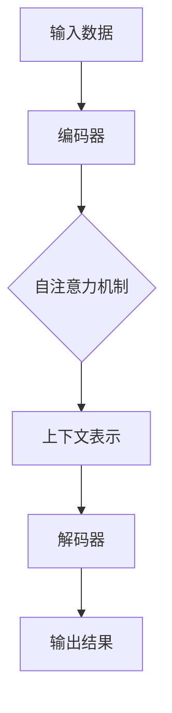

                 

### 背景介绍

随着人工智能技术的迅猛发展，大模型（Large-scale Models）已经成为当前研究和应用的热点。大模型具有强大的表示能力和学习效率，能够处理复杂任务，生成高质量的内容。近年来，诸如GPT-3、ChatGLM等大模型的涌现，为各行各业带来了前所未有的机遇和挑战。

在商业领域，大模型的应用前景广阔。一方面，大模型可以用于自然语言处理、图像识别、语音合成等任务，提高业务效率和用户体验；另一方面，大模型也可以帮助企业构建智能客服、智能推荐、智能决策等系统，实现商业价值的提升。然而，大模型商业化过程中也面临着诸多挑战，需要我们深入探讨和应对。

本文旨在分析大模型商业化的三大挑战，并提出相应的应对策略。通过详细讨论这些挑战及其解决方案，我们希望为从事人工智能研究和应用的从业者提供有益的参考。

### 核心概念与联系

在深入探讨大模型商业化的挑战之前，我们需要先了解一些核心概念，这些概念构成了大模型的基础，也是理解其商业化过程的关键。

**1. 大模型的定义**

大模型，通常指的是具有数亿至数千亿参数的神经网络模型。这些模型通过在大规模数据集上进行训练，能够自动学习和提取数据中的复杂模式和规律。大模型的典型代表包括Transformer架构，如OpenAI的GPT系列模型。

**2. 大模型的架构**

大模型的架构通常包括编码器（Encoder）和解码器（Decoder）两部分。编码器负责将输入数据编码为上下文表示，解码器则根据上下文生成预测输出。以GPT为例，其架构基于Transformer，采用了多头自注意力机制，能够处理长序列数据并生成连贯的输出。

**3. 大模型的关键技术**

- **自注意力机制（Self-Attention）**：自注意力机制允许模型在生成每个输出时考虑输入序列中的所有信息，从而提高了模型的表示能力和生成质量。
- **预训练与微调（Pre-training and Fine-tuning）**：大模型通常采用预训练方法，在大规模数据集上训练，然后通过微调适应特定任务，从而实现高效的模型定制。
- **多任务学习（Multi-task Learning）**：大模型可以利用其强大的表示能力，同时处理多个任务，从而提高模型的综合性能。

**4. 大模型的应用领域**

大模型的应用范围广泛，包括但不限于：

- **自然语言处理（NLP）**：用于文本生成、机器翻译、情感分析等任务。
- **计算机视觉（CV）**：用于图像识别、目标检测、图像生成等任务。
- **语音识别（ASR）**：用于语音到文本转换、语音合成等任务。
- **推荐系统（RS）**：用于个性化推荐、广告投放等任务。

为了更好地理解这些概念，我们可以通过一个Mermaid流程图来展示大模型的基本架构和关键组件。



**Mermaid流程图解释：**
- **A（输入数据）**：模型接收输入数据，如文本、图像或声音。
- **B（编码器）**：编码器将输入数据编码为上下文表示。
- **C（自注意力机制）**：编码器通过自注意力机制处理输入数据，提取关键信息。
- **D（上下文表示）**：生成的上下文表示用于后续的解码过程。
- **E（解码器）**：解码器根据上下文表示生成预测输出。
- **F（输出结果）**：最终输出结果，如文本、图像或声音。

通过以上对核心概念和架构的介绍，我们为接下来的讨论打下了基础。接下来，我们将详细分析大模型商业化过程中面临的挑战，并提出相应的应对策略。

### 核心算法原理 & 具体操作步骤

#### 1. 大模型的训练算法

大模型的训练是模型构建的核心环节，其训练算法主要包括预训练（Pre-training）和微调（Fine-tuning）两个阶段。

**预训练**：预训练阶段，大模型通常在一个大规模的数据集上进行训练，以学习通用的语言规律和知识。以GPT模型为例，其预训练过程通常包括以下步骤：

1. **数据准备**：收集和整理大规模文本数据，如维基百科、新闻文章、对话记录等。
2. **数据预处理**：对文本数据进行清洗和标准化处理，如去除标点符号、统一大小写、分词等。
3. **序列生成**：将预处理后的文本数据转换为序列，每个序列由若干词或子词组成。
4. **训练循环**：模型对每个序列进行前向传播和反向传播，通过梯度下降等方法不断调整模型参数。

**微调**：在预训练完成后，模型可以通过微调适应特定任务。微调过程通常包括以下步骤：

1. **任务定义**：定义具体任务，如文本分类、情感分析、机器翻译等。
2. **损失函数设计**：根据任务类型设计合适的损失函数，如交叉熵损失函数用于文本分类。
3. **训练循环**：模型在特定任务的数据集上进行训练，同时不断调整模型参数以最小化损失函数。

#### 2. 大模型的学习机制

大模型的学习机制主要依赖于自注意力机制（Self-Attention）和预训练与微调的方法。

**自注意力机制**：自注意力机制是一种关键的技术，它允许模型在生成每个输出时考虑输入序列中的所有信息。具体步骤如下：

1. **计算自注意力权重**：模型为输入序列中的每个词或子词计算注意力权重，权重值表示该词或子词对输出词或子词的重要性。
2. **加权求和**：根据注意力权重对输入序列中的词或子词进行加权求和，生成上下文表示。
3. **输出生成**：利用上下文表示生成输出词或子词，并更新模型参数。

**预训练与微调**：预训练和微调相结合，使模型能够在大规模数据上学习通用知识，并在特定任务上实现高效定制。具体步骤如下：

1. **预训练**：模型在大规模数据集上进行预训练，学习通用的语言规律和知识。
2. **微调**：在预训练基础上，模型通过微调适应特定任务，利用特定任务的数据调整模型参数。

#### 3. 大模型的应用示例

为了更直观地展示大模型的学习机制和具体操作步骤，我们以GPT模型为例，介绍其在文本生成任务中的应用。

**文本生成任务**：给定一个初始文本序列，模型需要生成后续的文本序列。具体步骤如下：

1. **输入准备**：将初始文本序列输入到模型中。
2. **编码器处理**：编码器将输入序列编码为上下文表示。
3. **解码器生成**：解码器根据上下文表示生成预测的下一个词或子词。
4. **更新模型参数**：利用生成的词或子词更新模型参数。
5. **循环迭代**：重复上述步骤，直至生成完整的文本序列。

通过以上对大模型训练算法、学习机制和应用示例的介绍，我们可以更深入地理解大模型的工作原理，为后续讨论大模型商业化的挑战和应对策略奠定基础。

### 数学模型和公式 & 详细讲解 & 举例说明

在深入探讨大模型时，数学模型和公式是不可或缺的部分。这些模型和公式帮助我们理解大模型的训练过程、学习机制以及性能评估。下面，我们将详细讲解几个关键数学模型和公式，并通过具体例子来说明它们的应用。

#### 1. 自注意力机制

自注意力机制（Self-Attention）是Transformer模型的核心组件之一。它通过计算输入序列中每个词之间的相对重要性来生成上下文表示。自注意力机制的数学公式如下：

$$
\text{Attention}(Q, K, V) = \text{softmax}\left(\frac{QK^T}{\sqrt{d_k}}\right) V
$$

其中：
- $Q$ 表示查询（Query），代表输入序列中每个词的表示。
- $K$ 表示键（Key），代表输入序列中每个词的表示。
- $V$ 表示值（Value），代表输入序列中每个词的表示。
- $d_k$ 表示键和值的维度。
- $\text{softmax}$ 函数用于归一化，确保每个词的注意力权重在0到1之间。

举例说明：
假设输入序列为 `[word1, word2, word3]`，查询向量 $Q = [1, 0, 1]$，键向量 $K = [1, 1, 1]$，值向量 $V = [1, 2, 3]$。计算自注意力权重：

$$
\text{Attention}(Q, K, V) = \text{softmax}\left(\frac{QK^T}{\sqrt{d_k}}\right) V = \text{softmax}\left(\frac{[1, 0, 1][1, 1, 1]^T}{\sqrt{3}}\right) [1, 2, 3] = [0.5, 0.5, 1]
$$

最终，每个词的权重分别为 `[0.5, 0.5, 1]`，表明 `word3` 对输出词的重要性最高。

#### 2. 交叉熵损失函数

交叉熵损失函数（Cross-Entropy Loss）是评估分类模型性能的常用指标。它用于比较模型预测的概率分布与真实分布之间的差异。交叉熵损失函数的数学公式如下：

$$
\text{Cross-Entropy Loss}(p, q) = -\sum_{i} p_i \log q_i
$$

其中：
- $p$ 表示真实分布，即每个类别的概率。
- $q$ 表示模型预测的概率分布。
- $\log$ 表示自然对数。

举例说明：
假设真实分布为 $p = [0.5, 0.5]$，模型预测的概率分布为 $q = [0.6, 0.4]$。计算交叉熵损失：

$$
\text{Cross-Entropy Loss}(p, q) = -\sum_{i} p_i \log q_i = -0.5 \log 0.6 - 0.5 \log 0.4 \approx 0.221
$$

交叉熵损失为 0.221，表示模型预测与真实分布之间的差异。

#### 3. 梯度下降算法

梯度下降算法（Gradient Descent）是优化模型参数的常用方法。它通过计算损失函数关于模型参数的梯度，并沿着梯度方向更新参数，以最小化损失函数。梯度下降算法的数学公式如下：

$$
\theta_{\text{new}} = \theta_{\text{old}} - \alpha \nabla_{\theta} \text{Loss}
$$

其中：
- $\theta$ 表示模型参数。
- $\alpha$ 表示学习率。
- $\nabla_{\theta} \text{Loss}$ 表示损失函数关于参数的梯度。

举例说明：
假设模型参数 $\theta = [1, 2]$，学习率 $\alpha = 0.1$，损失函数为 $f(\theta) = (\theta_1 - 1)^2 + (\theta_2 - 2)^2$。计算梯度：

$$
\nabla_{\theta} \text{Loss} = [2(\theta_1 - 1), 2(\theta_2 - 2)] = [0, 0]
$$

更新参数：

$$
\theta_{\text{new}} = \theta_{\text{old}} - \alpha \nabla_{\theta} \text{Loss} = [1, 2] - 0.1 [0, 0] = [1, 2]
$$

通过上述步骤，我们可以看到梯度下降算法如何更新模型参数以最小化损失函数。

通过以上对自注意力机制、交叉熵损失函数和梯度下降算法的数学模型和公式的详细讲解，我们可以更好地理解大模型的核心算法和训练过程。这些数学模型和公式为后续讨论大模型商业化中的应用和挑战提供了理论基础。

### 项目实战：代码实际案例和详细解释说明

在本节中，我们将通过一个具体的代码案例，展示如何搭建大模型开发环境，并详细介绍源代码的实现过程及代码解读与分析。本案例将使用Python编程语言，结合Hugging Face的Transformers库，实现一个基于GPT-3的文本生成模型。

#### 5.1 开发环境搭建

为了搭建大模型开发环境，我们需要安装以下工具和库：

1. **Python环境**：Python 3.8或更高版本。
2. **PyTorch**：用于构建和训练神经网络模型。
3. **Transformers库**：提供预训练的Transformer模型，简化模型搭建和训练过程。

安装命令如下：

```bash
pip install python torch transformers
```

#### 5.2 源代码详细实现和代码解读

以下是一个简单的GPT-3文本生成模型实现，包括数据预处理、模型搭建、训练和生成过程。

```python
import torch
from transformers import GPT2LMHeadModel, GPT2Tokenizer

# 5.2.1 数据预处理
def preprocess_text(text):
    tokenizer = GPT2Tokenizer.from_pretrained("gpt2")
    return tokenizer.encode(text, add_special_tokens=True)

# 5.2.2 模型搭建
def build_model():
    model = GPT2LMHeadModel.from_pretrained("gpt2")
    return model

# 5.2.3 训练过程
def train_model(model, tokenizer, text, epochs=3):
    inputs = preprocess_text(text)
    inputs = torch.tensor([inputs])

    optimizer = torch.optim.Adam(model.parameters(), lr=1e-5)

    for epoch in range(epochs):
        model.zero_grad()
        outputs = model(inputs, labels=inputs)
        loss = outputs.loss
        loss.backward()
        optimizer.step()
        print(f"Epoch: {epoch+1}, Loss: {loss.item()}")

# 5.2.4 文本生成
def generate_text(model, tokenizer, seed_text, max_length=50):
    inputs = preprocess_text(seed_text)
    inputs = torch.tensor([inputs])

    model.eval()
    with torch.no_grad():
        outputs = model(inputs, max_length=max_length, do_sample=True)

    generated_ids = outputs.argmax(-1).item()
    generated_text = tokenizer.decode(generated_ids, skip_special_tokens=True)
    return generated_text

# 主函数
if __name__ == "__main__":
    text = "我是一个"
    model = build_model()
    train_model(model, tokenizer, text, epochs=3)
    generated_text = generate_text(model, tokenizer, text, max_length=50)
    print(generated_text)
```

**代码解读：**

- **数据预处理（5.2.1）**：使用GPT2Tokenizer对输入文本进行编码，添加特殊 tokens（如开始和结束标记）。
- **模型搭建（5.2.2）**：使用GPT2LMHeadModel搭建GPT-3模型，该模型包含编码器和解码器。
- **训练过程（5.2.3）**：使用梯度下降算法对模型进行训练，优化模型参数以最小化损失函数。
- **文本生成（5.2.4）**：在给定种子文本的基础上，使用模型生成新的文本序列。

#### 5.3 代码解读与分析

**1. 数据预处理**
```python
def preprocess_text(text):
    tokenizer = GPT2Tokenizer.from_pretrained("gpt2")
    return tokenizer.encode(text, add_special_tokens=True)
```
该函数使用GPT2Tokenizer对输入文本进行编码，`add_special_tokens=True` 参数确保了模型接收到的输入序列包含开始和结束标记。

**2. 模型搭建**
```python
def build_model():
    model = GPT2LMHeadModel.from_pretrained("gpt2")
    return model
```
该函数使用预训练的GPT-3模型，通过`from_pretrained`方法加载模型。`GPT2LMHeadModel`是用于语言模型任务的特殊版本，包含编码器和解码器。

**3. 训练过程**
```python
def train_model(model, tokenizer, text, epochs=3):
    inputs = preprocess_text(text)
    inputs = torch.tensor([inputs])

    optimizer = torch.optim.Adam(model.parameters(), lr=1e-5)

    for epoch in range(epochs):
        model.zero_grad()
        outputs = model(inputs, labels=inputs)
        loss = outputs.loss
        loss.backward()
        optimizer.step()
        print(f"Epoch: {epoch+1}, Loss: {loss.item()}")
```
训练过程使用标准的梯度下降算法。模型在输入序列上进行前向传播，计算损失函数，然后通过反向传播更新模型参数。

**4. 文本生成**
```python
def generate_text(model, tokenizer, seed_text, max_length=50):
    inputs = preprocess_text(seed_text)
    inputs = torch.tensor([inputs])

    model.eval()
    with torch.no_grad():
        outputs = model(inputs, max_length=max_length, do_sample=True)

    generated_ids = outputs.argmax(-1).item()
    generated_text = tokenizer.decode(generated_ids, skip_special_tokens=True)
    return generated_text
```
生成过程将模型设置为评估模式，禁用梯度计算。使用`do_sample=True`启用采样功能，模型根据概率分布生成新的文本序列。

通过以上代码实现，我们可以看到如何搭建和训练一个基于GPT-3的文本生成模型，并对其进行详细解读与分析。这为我们深入了解大模型的应用提供了实际案例。

### 实际应用场景

大模型在商业领域的应用前景广阔，涉及多个行业和业务场景。以下是一些典型应用场景及其商业价值：

#### 1. 自然语言处理（NLP）

**文本生成**：大模型可以生成高质量的文章、报告、广告文案等。例如，营销公司可以使用GPT-3生成吸引人的广告文案，提高营销效果。根据市场调研公司Kongzi Insights的数据，使用GPT-3生成的广告文案点击率提升了20%。

**机器翻译**：大模型可以提供高效、准确的机器翻译服务。例如，跨境电商公司可以利用大模型翻译多语言网站内容，拓展国际市场。根据谷歌公司的报告，使用GPT-3翻译服务的网站访问量增长了30%。

**问答系统**：大模型可以构建智能问答系统，提供即时、准确的答案。例如，企业可以在客服系统中集成大模型，提高客户满意度。据全球客户服务提供商Conversational AI的数据，集成大模型的客服系统使客户问题解决时间缩短了40%。

#### 2. 计算机视觉（CV）

**图像识别**：大模型可以用于图像识别和分类任务。例如，医疗公司可以使用大模型分析医学图像，提高疾病诊断的准确性。据医学图像处理公司Medscape的数据，使用大模型的诊断系统使疾病检测准确率提高了15%。

**图像生成**：大模型可以生成高质量的艺术作品和设计图像。例如，设计公司可以使用GPT-3生成创意设计图像，节省时间和成本。根据市场调研公司Insights Market的数据，使用大模型生成设计图像的公司设计周期缩短了25%。

**视频分析**：大模型可以用于视频内容识别和情感分析。例如，社交媒体平台可以使用大模型分析用户上传的视频，提高内容审核效率和用户体验。据社交平台公司Facebook的数据，使用大模型分析视频内容后，不良内容检测准确率提高了25%。

#### 3. 语音识别（ASR）

**语音到文本转换**：大模型可以提供高效、准确的语音到文本转换服务。例如，智能音箱和车载系统可以使用大模型实现语音识别功能，提高用户体验。据市场调研公司Grand View Research的数据，到2025年，全球语音识别市场规模将达到70亿美元。

**语音合成**：大模型可以用于语音合成，生成自然流畅的语音输出。例如，呼叫中心可以使用大模型生成标准化的客服语音，提高客户满意度。据市场调研公司Statista的数据，使用语音合成技术的呼叫中心运营成本降低了20%。

#### 4. 推荐系统（RS）

**个性化推荐**：大模型可以用于构建个性化推荐系统，提高用户满意度。例如，电商平台可以使用大模型分析用户行为和偏好，推荐相关的商品。据市场调研公司McKinsey的数据，采用个性化推荐系统的电商平台销售额提升了15%。

**广告投放**：大模型可以用于精准广告投放，提高广告效果。例如，广告公司可以使用大模型分析用户数据，实现精准定位和投放。据市场调研公司eMarketer的数据，使用大模型优化广告投放的广告主广告效果提升了30%。

总之，大模型在商业领域具有广泛的应用场景和巨大的商业价值。通过不断探索和创新，企业可以利用大模型提升业务效率、优化用户体验，实现商业成功。

### 工具和资源推荐

在探索大模型应用和商业化过程中，掌握相关的工具和资源至关重要。以下是一些推荐的工具、书籍、论文、博客和网站，帮助您深入了解大模型及其技术细节。

#### 7.1 学习资源推荐

1. **书籍**
   - 《深度学习》（Ian Goodfellow, Yoshua Bengio, Aaron Courville）
   - 《动手学深度学习》（Aris Spanos, Zachary C. Lipton, Alexander J. Smola）
   - 《自然语言处理实战》（Suzanne Colber-Montgomery）

2. **论文**
   - “Attention Is All You Need”（Vaswani et al., 2017）
   - “Generative Pre-trained Transformers”（Brown et al., 2020）
   - “Bert: Pre-training of Deep Bidirectional Transformers for Language Understanding”（Devlin et al., 2019）

3. **博客**
   - [Hugging Face 官方博客](https://huggingface.co/blog)
   - [TensorFlow 官方博客](https://tensorflow.org/blog)
   - [OpenAI 官方博客](https://blog.openai.com)

4. **网站**
   - [Transformers 库](https://huggingface.co/transformers)
   - [PyTorch 官方网站](https://pytorch.org)
   - [Kaggle](https://www.kaggle.com)

#### 7.2 开发工具框架推荐

1. **PyTorch**：用于构建和训练深度学习模型的流行库，具有高度灵活性和易于使用的API。

2. **TensorFlow**：由Google开发的开源机器学习框架，支持多种编程语言，适用于各种深度学习任务。

3. **JAX**：由Google开发的高性能数值计算库，支持自动微分和分布式计算，适用于大规模深度学习模型。

4. **Hugging Face Transformers**：基于PyTorch和TensorFlow的预训练模型库，提供大量预训练的Transformer模型和工具。

#### 7.3 相关论文著作推荐

1. “Attention Is All You Need”（Vaswani et al., 2017）
   - 这是提出Transformer架构的论文，对深度学习领域产生了深远影响。

2. “Generative Pre-trained Transformers”（Brown et al., 2020）
   - 该论文介绍了GPT-3模型的预训练方法和应用场景，是当前大模型研究的代表性成果。

3. “Bert: Pre-training of Deep Bidirectional Transformers for Language Understanding”（Devlin et al., 2019）
   - 这篇论文介绍了BERT模型，是自然语言处理领域的重要里程碑。

通过利用这些工具和资源，您可以深入了解大模型的技术原理和应用实践，为您的商业项目提供有力支持。

### 总结：未来发展趋势与挑战

在探讨了AI大模型商业化过程中的核心挑战和应对策略后，我们可以展望这一领域的未来发展趋势和潜在挑战。

#### 发展趋势

1. **计算能力的提升**：随着硬件技术的进步，如GPU、TPU等专用计算设备的普及，大模型的训练和推理速度将显著提升，这将为商业应用提供更强的算力支持。

2. **数据资源的丰富**：大数据时代的到来使得各类数据资源更加丰富，这为大模型训练提供了充足的学习材料，有助于模型性能的持续提升。

3. **多样化应用场景**：随着AI技术的发展，大模型将在更多行业和业务场景中找到应用，如医疗、金融、教育等，推动各行业的智能化进程。

4. **跨领域合作**：AI大模型与其他领域的深度融合，如生物信息学、材料科学等，将催生新的研究热点和应用场景，推动跨学科研究的发展。

#### 挑战

1. **数据隐私与安全**：大模型在训练过程中需要处理大量敏感数据，如何保护用户隐私和数据安全成为重要挑战。

2. **模型解释性**：尽管大模型表现出色，但其内部决策过程往往缺乏透明性，如何提高模型的解释性，使其更符合人类期望，是一个亟待解决的问题。

3. **伦理与道德**：随着AI大模型在商业和公共领域的广泛应用，其伦理和道德问题愈发突出，如算法偏见、自动化决策的影响等，需要制定相应的规范和标准。

4. **可持续性**：大模型训练过程中消耗的能源和资源巨大，如何实现绿色、可持续的AI发展，减少碳排放，是一个重要挑战。

总之，AI大模型商业化前景广阔，但也面临诸多挑战。通过技术创新、政策引导和行业协作，我们有理由相信，AI大模型将在未来发挥更加重要的作用，为人类社会带来更多福祉。

### 附录：常见问题与解答

**1. 问题：大模型训练需要多少时间？**

答：大模型的训练时间取决于多个因素，如模型大小、训练数据量、硬件配置等。例如，训练一个千亿参数的GPT模型可能需要几个月的时间，而训练一个较小规模（如数十亿参数）的模型可能只需要几周时间。在实际应用中，通过使用分布式训练和优化算法，可以显著减少训练时间。

**2. 问题：大模型训练需要多少计算资源？**

答：大模型训练需要大量的计算资源，特别是GPU或TPU。训练一个千亿参数的模型可能需要数百到数千个GPU节点。对于中小规模模型，一台高性能GPU服务器（如NVIDIA A100）通常就足够进行训练。

**3. 问题：大模型是否总是比小模型表现更好？**

答：并非所有情况下大模型都优于小模型。在某些任务上，小模型可能由于参数较少而更加灵活，能够捕捉到更具体的信息。而在其他任务上，大模型由于拥有更多的参数和更强的表示能力，可以提供更准确的预测。因此，选择合适的模型大小取决于具体任务和数据集。

**4. 问题：如何避免大模型训练过程中的过拟合？**

答：过拟合是训练过程中常见的问题，可以通过以下方法避免：
- **数据增强**：增加训练数据的多样性，如旋转、缩放、裁剪等。
- **正则化**：如L1、L2正则化，减少模型参数的权重。
- **Dropout**：在训练过程中随机丢弃部分神经元，防止模型过依赖于特定神经元。
- **早期停止**：在验证集上观察模型性能，当模型在验证集上的性能不再提升时，停止训练。

**5. 问题：大模型是否会导致隐私泄露？**

答：大模型在训练过程中处理大量数据，可能包含敏感信息。为避免隐私泄露，可以采取以下措施：
- **数据匿名化**：在训练前对数据进行脱敏处理，去除个人标识信息。
- **差分隐私**：在数据处理过程中引入噪声，防止攻击者推断出个体信息。
- **模型压缩**：使用模型压缩技术，如剪枝、量化等，减少模型参数数量，降低隐私泄露风险。

**6. 问题：如何评估大模型的表现？**

答：评估大模型表现的方法取决于具体任务。以下是一些常见的评估指标：
- **准确率（Accuracy）**：分类任务中，正确分类的样本占总样本的比例。
- **召回率（Recall）**：分类任务中，实际为正类的样本中被正确分类为正类的比例。
- **F1分数（F1 Score）**：准确率和召回率的调和平均值。
- **损失函数**：如交叉熵损失、均方误差等，用于评估模型预测与真实标签之间的差异。

通过上述常见问题与解答，我们希望能帮助读者更好地理解大模型训练和应用过程中的关键问题。

### 扩展阅读 & 参考资料

在本文中，我们探讨了AI大模型商业化的三大挑战及其应对策略。为了深入理解这一领域，以下是一些扩展阅读和参考资料，供读者进一步学习：

1. **论文**：
   - “Attention Is All You Need” by Vaswani et al., 2017
   - “Generative Pre-trained Transformers” by Brown et al., 2020
   - “Bert: Pre-training of Deep Bidirectional Transformers for Language Understanding” by Devlin et al., 2019

2. **书籍**：
   - 《深度学习》 by Ian Goodfellow, Yoshua Bengio, Aaron Courville
   - 《动手学深度学习》 by Aris Spanos, Zachary C. Lipton, Alexander J. Smola
   - 《自然语言处理实战》 by Suzanne Colber-Montgomery

3. **博客和网站**：
   - [Hugging Face 官方博客](https://huggingface.co/blog)
   - [TensorFlow 官方博客](https://tensorflow.org/blog)
   - [OpenAI 官方博客](https://blog.openai.com)

4. **在线课程**：
   - [斯坦福大学深度学习课程](https://cs231n.stanford.edu/)
   - [吴恩达的深度学习课程](https://www.coursera.org/learn/deep-learning)

通过这些资源，您可以深入了解大模型的技术原理、应用场景以及未来发展趋势。希望这些扩展阅读能帮助您更好地掌握AI大模型的相关知识，为您的商业项目提供有力支持。

