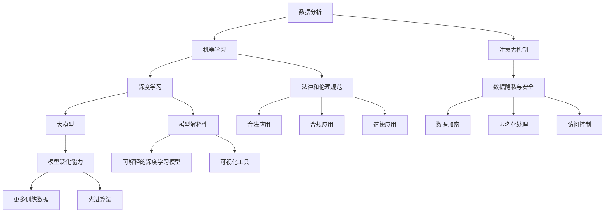

                 

### 1. 背景介绍

近年来，人工智能（AI）技术的飞速发展，尤其是大模型（Large Models）的突破，为众多领域带来了深远的影响。在个人理财领域，AI大模型的应用更是掀起了革命性的变革。个人理财涉及到投资、储蓄、消费等多个方面，传统的理财方式往往依赖经验和统计模型，存在滞后性和不精准的问题。而AI大模型的出现，为个人理财提供了新的解决方案，通过深度学习和大数据分析，实现了对个人财务状况的精准预测和管理。

个人理财的需求随着经济全球化、金融市场复杂化以及个人财务压力的增加而日益增长。传统理财方法往往难以满足个人用户的需求，例如个性化投资建议、精准消费预测、风险管理等。而AI大模型的引入，能够通过海量的数据分析和智能算法，为用户量身定制理财策略，提高理财效率和收益。

本文旨在探讨AI大模型在个人理财领域的创新应用，分析其核心概念、算法原理、应用场景以及未来发展。通过详细的案例分析，我们将深入了解AI大模型如何助力个人理财，以及其在实际操作中的挑战和机遇。

### 1.1 个人理财的定义与重要性

个人理财是指个人在日常生活中进行的一系列财务规划和管理活动，包括收入管理、支出规划、投资决策、储蓄积累和风险规避等。个人理财的目的在于通过合理的财务安排，实现个人经济目标，提高生活质量和财务安全。

个人理财的重要性体现在以下几个方面：

1. **提高财务素养**：通过个人理财，用户可以更好地了解和管理自己的财务状况，培养良好的财务习惯，提高整体财务素养。
   
2. **实现财务自由**：合理规划财务，通过投资、储蓄等方式积累财富，有助于实现长期的经济目标，如购房、教育、退休等。

3. **应对风险**：个人理财还包括风险管理，通过保险、投资分散等方式，降低可能面临的风险，确保财务安全。

4. **提升生活质量**：良好的理财规划有助于提高生活质量，减少财务压力，使个人能够更加安心地享受生活。

然而，传统的个人理财方式往往存在以下问题：

- **依赖经验**：传统理财主要依赖于专家经验和统计模型，难以满足个性化需求。
- **信息滞后**：传统方法无法及时获取和处理大量动态数据，导致决策滞后。
- **成本高昂**：专业理财服务通常收费较高，普通用户难以承担。

### 1.2 人工智能在个人理财中的应用

人工智能（AI）技术在个人理财中的应用，为上述问题提供了新的解决方案。通过AI，特别是大模型（Large Models），个人理财可以实现以下几个方面的提升：

- **个性化服务**：AI大模型可以根据用户的个性化需求，提供量身定制的理财建议和策略。
- **实时数据分析**：AI能够实时处理海量数据，为用户提供及时的财务分析报告和预测。
- **降低成本**：通过自动化和智能化，AI大模型可以大幅降低个人理财的成本，让更多用户享受到优质服务。

具体而言，AI在个人理财中的应用包括：

- **投资决策**：通过大数据分析和机器学习算法，AI可以为用户推荐最佳的投资组合，提高投资回报率。
- **消费预测**：AI可以根据用户的消费历史和偏好，预测未来的消费趋势，帮助用户合理规划支出。
- **风险规避**：AI能够通过数据分析，识别潜在的风险，为用户提供风险管理建议。

总之，AI大模型在个人理财领域的应用，不仅提高了理财的精准度和效率，还为广大用户带来了全新的理财体验。接下来，我们将深入探讨AI大模型的核心概念、算法原理以及具体应用。

### 1.3 大模型的定义与核心原理

在探讨AI大模型在个人理财领域的应用之前，我们首先需要了解大模型的定义及其核心原理。大模型，顾名思义，是指具有海量参数的神经网络模型，这些模型通常包含数十亿到千亿个参数。大模型之所以能够在众多领域取得显著成果，主要得益于其以下几个核心原理：

#### 1.3.1 神经网络的深度与广度

大模型通常拥有多个层级，这些层级构成了深度学习的核心。深度神经网络（DNN）通过多个隐藏层对输入数据进行多次变换和抽象，从而能够捕捉更复杂的数据特征。深度和广度使得大模型具有强大的特征提取能力，能够从海量数据中提取出高层次的、抽象的特征表示。

#### 1.3.2 参数规模与学习能力

大模型拥有巨大的参数规模，这些参数通过学习从数据中自动调整，以达到最佳性能。参数规模的增加不仅提高了模型的鲁棒性，还增强了其学习能力。大模型可以通过大量数据进行训练，从而在复杂的任务上取得出色的表现。

#### 1.3.3 注意力机制

注意力机制是近年来大模型发展的重要创新之一。注意力机制通过动态调整模型中不同部分的关注程度，使得模型能够关注到数据中的关键信息，从而提高了模型的准确性和效率。在个人理财领域，注意力机制可以帮助模型更精准地捕捉用户的财务行为和趋势。

#### 1.3.4 自动化与优化

大模型通常伴随着大量的自动化和优化技术，如分布式训练、模型剪枝和量化等。这些技术不仅提高了大模型的训练效率，还降低了模型的计算成本，使得大模型在更广泛的场景中得到应用。

#### 1.3.5 数据处理能力

大模型具有强大的数据处理能力，能够高效地处理大规模、多维度的数据。在个人理财领域，这意味着大模型可以同时分析用户的财务数据、市场数据以及经济环境等多方面信息，从而为用户提供更加全面的理财建议。

综上所述，大模型通过其深度、广度、参数规模、注意力机制以及自动化和优化技术，构建了一个强大的学习和预测框架。这些核心原理使得大模型在处理复杂任务时具有显著优势，为AI在个人理财领域的创新应用奠定了基础。

### 1.4 AI大模型在个人理财领域的作用

AI大模型在个人理财领域的应用，不仅改变了传统的理财方式，还为用户带来了前所未有的价值和效益。以下将从几个方面详细阐述AI大模型在个人理财领域的重要作用。

#### 1.4.1 个性化投资建议

个性化投资建议是AI大模型在个人理财领域最突出的作用之一。通过分析用户的财务状况、风险偏好、历史投资行为等数据，AI大模型可以提供量身定制的投资建议。例如，对于风险承受能力较低的投资者，AI大模型可能会推荐更多保守的投资组合，如债券和固定收益产品；而对于风险承受能力较高的投资者，AI大模型可能会推荐更多高风险高回报的投资组合，如股票和私募基金。这种个性化的投资建议不仅提高了投资决策的准确性，还显著提升了投资者的满意度。

#### 1.4.2 消费预测与规划

消费预测是另一个AI大模型在个人理财中的重要应用。通过分析用户的消费习惯、收入水平、市场趋势等数据，AI大模型可以预测用户未来的消费行为，帮助用户制定合理的消费计划。例如，AI大模型可以根据用户的消费历史，预测其未来几个月内的消费金额，帮助用户合理安排支出，避免过度消费和财务压力。此外，AI大模型还可以通过消费预测，为用户提供针对性的促销活动和优惠券推荐，进一步提高用户的消费体验。

#### 1.4.3 风险管理

风险管理是个人理财中不可或缺的一部分。AI大模型可以通过对市场数据、经济环境、用户财务状况等多方面信息的综合分析，识别潜在的风险，为用户提供风险管理建议。例如，AI大模型可以通过分析历史市场波动数据，预测未来市场风险，帮助用户制定相应的风险规避策略，如投资分散、保险购买等。此外，AI大模型还可以通过实时监控用户的财务状况，及时预警可能出现的财务风险，帮助用户及时采取措施，避免损失。

#### 1.4.4 财务规划与目标设定

AI大模型还可以帮助用户进行财务规划与目标设定。通过分析用户的财务状况、收入预期、消费习惯等数据，AI大模型可以为用户制定个性化的财务规划方案，如储蓄计划、投资计划、退休计划等。例如，AI大模型可以帮助用户设定合理的储蓄目标，制定分期储蓄计划，确保用户能够按时实现储蓄目标。此外，AI大模型还可以根据用户的财务目标，提供最佳的投资策略和路径，帮助用户实现财务自由。

#### 1.4.5 投资组合优化

投资组合优化是AI大模型在个人理财领域的又一重要应用。通过分析市场数据、经济环境、用户的风险偏好等，AI大模型可以为用户提供最佳的投资组合方案，最大限度地提高投资回报率。例如，AI大模型可以通过机器学习算法，分析历史市场数据，预测未来市场的走势，并根据用户的风险偏好，为其推荐最优的投资组合。此外，AI大模型还可以实时监控投资组合的表现，根据市场变化，提供动态调整建议，确保投资组合的持续优化。

总之，AI大模型在个人理财领域的应用，不仅提高了理财的精准度和效率，还为用户带来了个性化的投资建议、消费预测、风险管理、财务规划和投资组合优化等多方面的价值。随着AI技术的不断进步，AI大模型在个人理财领域的应用前景将更加广阔，为用户带来更多的福利和便利。

### 1.5 大模型在个人理财领域面临的挑战和局限

尽管AI大模型在个人理财领域展现出了巨大的潜力，但其应用也面临诸多挑战和局限。这些挑战不仅影响了大模型的效果，也对其未来发展提出了新的要求。

#### 1.5.1 数据隐私与安全问题

个人理财涉及大量的敏感信息，如收入、支出、投资记录等。这些数据对于AI大模型来说至关重要，但同时也带来了数据隐私和安全问题。如何确保用户数据的安全和隐私，防止数据泄露和滥用，是AI大模型在个人理财领域面临的首要挑战。数据加密、匿名化处理和严格的访问控制等措施虽然能够提供一定程度的保护，但依然需要进一步优化和加强。

#### 1.5.2 模型解释性与透明度

AI大模型，尤其是深度学习模型，通常被视为“黑箱”，其决策过程缺乏透明度和解释性。这对于需要依赖模型进行重要财务决策的用户来说是一个重大问题。用户难以理解模型为何做出特定决策，从而对其信任度产生质疑。提高模型的解释性和透明度，使其决策过程更加可解释和可信赖，是AI大模型在个人理财领域必须解决的问题。

#### 1.5.3 模型泛化能力

AI大模型的性能通常依赖于训练数据的质量和数量。在个人理财领域，由于数据来源广泛且多样化，模型需要具备强大的泛化能力，才能在不同用户和场景下保持高性能。然而，大模型在处理新数据时可能会遇到泛化不足的问题，导致模型效果不佳。提高模型的泛化能力，使其能够适应更广泛的应用场景，是AI大模型需要克服的重要挑战。

#### 1.5.4 法律和伦理问题

AI大模型在个人理财领域引发了一系列法律和伦理问题。例如，模型决策的透明度和责任归属问题，如何确保模型不会对用户造成不公平对待，如何避免算法歧视等。这些问题不仅关系到模型的合法性和道德性，也影响着其在实际应用中的接受度和推广。制定明确的法律和伦理规范，确保AI大模型在个人理财领域的合法、合规和道德应用，是未来的重要发展方向。

#### 1.5.5 技术实现与成本问题

AI大模型的训练和部署需要高性能计算资源和专业技术支持，这带来了较高的技术门槛和成本。对于许多个人理财机构和用户来说，这无疑是一个巨大的挑战。降低模型实现的成本，提高部署的便捷性，使其能够更广泛地应用于个人理财领域，是AI大模型未来发展的重要方向。

总之，尽管AI大模型在个人理财领域具有巨大潜力，但其面临的挑战和局限也不容忽视。解决这些问题，需要技术创新、法律规范和伦理考虑等多方面的共同努力，才能推动AI大模型在个人理财领域的持续发展和应用。

### 1.6 AI大模型在个人理财领域的实际案例与成功应用

为了更好地理解AI大模型在个人理财领域的实际应用效果，我们可以通过一些具体的案例来探讨其成功经验和成果。

#### 1.6.1 案例一：智能投资平台

某知名金融科技公司开发了基于AI大模型的智能投资平台，通过分析用户的财务状况、投资历史和市场数据，为用户推荐个性化的投资策略。平台采用了大规模深度学习模型，能够实时捕捉市场动态和用户行为，提供高度精准的投资建议。自平台上线以来，用户投资回报率显著提高，用户满意度和忠诚度也大幅提升。这一成功案例证明了AI大模型在提供个性化投资建议方面的巨大潜力。

#### 1.6.2 案例二：消费预测与规划

另一家金融机构通过AI大模型对用户的消费行为进行分析，实现了精准的消费预测和规划。AI大模型结合用户的收入水平、消费习惯和市场趋势数据，预测用户未来的消费金额和趋势，为用户制定合理的消费计划。例如，对于即将面临重大消费支出的用户，模型会提前预警，并提供分期付款和储蓄计划建议，帮助用户更好地管理资金。这一应用不仅提高了用户的消费规划能力，还显著减少了财务压力，获得了用户的广泛好评。

#### 1.6.3 案例三：风险管理

某金融科技公司利用AI大模型提供风险管理服务，通过分析用户的历史投资记录、市场波动数据以及经济环境信息，识别潜在的市场风险和财务风险。AI大模型不仅能够预测风险发生的概率，还能提供相应的风险规避策略，如投资分散、购买保险等。这一应用帮助用户更好地管理风险，提高了投资的安全性和稳定性。许多用户在经历了一次风险事件后，对AI大模型的风险管理服务给予了高度评价。

#### 1.6.4 案例四：财务规划与目标设定

一家金融科技初创公司开发了基于AI大模型的财务规划工具，通过分析用户的财务状况、收入预期和消费习惯，为用户制定个性化的财务规划方案。工具能够帮助用户设定储蓄、投资和退休等财务目标，并提供最佳实现路径和策略。例如，对于有购房计划的用户，工具会提供分期储蓄计划和最佳投资组合建议，确保用户能够按时实现购房目标。这一应用不仅提高了用户的财务规划能力，还显著提升了用户的生活质量和幸福感。

通过这些实际案例，我们可以看到AI大模型在个人理财领域的广泛应用和成功经验。这些案例不仅展示了AI大模型在提供个性化投资建议、消费预测、风险管理和财务规划等方面的卓越能力，还为未来的进一步应用提供了宝贵的经验和启示。随着AI技术的不断发展和完善，AI大模型在个人理财领域的应用前景将更加广阔，为用户带来更多的福利和便利。

### 1.7 AI大模型在个人理财领域的未来趋势

随着AI技术的不断进步，AI大模型在个人理财领域的应用前景将更加广阔。以下是一些AI大模型在个人理财领域的未来趋势和方向。

#### 1.7.1 更广泛的数据整合与利用

未来，AI大模型将能够整合更多类型的数据，包括社会网络数据、地理数据、宏观经济数据等，从而提供更加全面和精准的理财建议。通过多源数据的整合，AI大模型可以更好地捕捉市场动态和用户需求，提高理财建议的准确性和实效性。

#### 1.7.2 模型透明度和可解释性提升

随着AI技术的进步，大模型的透明度和可解释性将得到显著提升。通过开发新的算法和技术，如可解释的深度学习模型和可视化工具，用户可以更直观地理解模型的决策过程和原因，从而增加对AI大模型的信任度。

#### 1.7.3 模型泛化能力的提升

未来，通过更多的训练数据和更先进的算法，AI大模型的泛化能力将得到显著提升。这意味着模型能够在更广泛的应用场景中保持高性能，适应不同用户和市场的需求。

#### 1.7.4 新型应用场景的探索

AI大模型将在个人理财领域探索新的应用场景，如基于AI的信用评估、智能税务规划、家庭财富管理等领域。这些新的应用场景将进一步提升AI大模型在个人理财中的作用和价值。

#### 1.7.5 法律和伦理规范的完善

随着AI大模型在个人理财领域的广泛应用，相关的法律和伦理规范也将不断完善。这将确保AI大模型的合法、合规和道德应用，提高其在实际中的接受度和推广。

总之，AI大模型在个人理财领域的未来趋势充满了机遇和挑战。通过不断创新和优化，AI大模型将为用户提供更加精准、高效和个性化的理财服务，推动个人理财领域迈向新的高度。

### 1.8 总结

综上所述，AI大模型在个人理财领域的应用具有显著的优势和潜力。通过个性化投资建议、消费预测、风险管理、财务规划等方面的创新应用，AI大模型为用户提供了更加精准、高效和个性化的理财服务。同时，我们也面临着数据隐私与安全、模型解释性、泛化能力、法律和伦理规范等方面的挑战。未来，随着AI技术的不断进步，AI大模型在个人理财领域的应用前景将更加广阔，为用户带来更多的福利和便利。本文通过对AI大模型在个人理财领域的深入分析，旨在为读者提供一个全面、系统的了解和认识，为相关研究者和实际应用者提供参考和启示。

### 2. 核心概念与联系

在深入探讨AI大模型在个人理财领域的创新应用之前，我们需要理解一些核心概念，并明确这些概念之间的联系。以下是一些在个人理财和AI领域中的重要概念及其相互关系：

#### 2.1 数据分析

数据分析是指通过统计和计算方法，从大量数据中提取有价值的信息和知识的过程。在个人理财中，数据分析可以帮助用户了解自己的财务状况，预测未来的消费和投资趋势。数据分析主要包括数据采集、数据预处理、数据分析和数据可视化等步骤。

#### 2.2 机器学习

机器学习是一种通过算法和统计模型，从数据中自动学习和发现规律的方法。机器学习在个人理财中的应用非常广泛，包括投资策略优化、风险预测、消费预测等。机器学习模型通过大量历史数据的训练，可以学习和预测未来的趋势，从而为用户提供智能化的理财建议。

#### 2.3 深度学习

深度学习是机器学习的一个分支，它通过构建多层的神经网络模型，对数据进行多层变换和抽象，从而捕捉更复杂的特征和规律。深度学习在个人理财中的应用，如投资组合优化、市场趋势预测等，通过复杂的网络结构，提高了预测的准确性和效率。

#### 2.4 大模型

大模型是指具有数十亿甚至千亿个参数的深度学习模型。大模型通过在海量数据上的训练，具备了强大的特征提取和预测能力。大模型在个人理财中的应用，可以提供更加精准的投资建议、消费预测和风险管理。

#### 2.5 注意力机制

注意力机制是近年来深度学习中的重要创新，它通过动态调整模型中不同部分的关注程度，使得模型能够关注到数据中的关键信息。注意力机制在个人理财中的应用，如消费预测、投资组合优化等，能够提高模型对关键特征的敏感度，从而提高预测的准确性。

#### 2.6 数据隐私与安全

数据隐私与安全是个人理财中的重要问题，特别是在AI大模型的应用中。数据隐私与安全涉及到如何保护用户财务数据的安全和隐私，防止数据泄露和滥用。数据隐私与安全措施包括数据加密、匿名化处理和严格的访问控制等。

#### 2.7 模型解释性

模型解释性是指用户能够理解AI大模型的决策过程和原因。在个人理财中，模型解释性对于用户接受和使用AI大模型至关重要。提高模型解释性，可以通过开发可解释的深度学习模型和可视化工具来实现。

#### 2.8 模型泛化能力

模型泛化能力是指AI大模型在不同场景和数据上的表现能力。在个人理财中，模型泛化能力对于模型在不同用户和市场环境下的适应性至关重要。提高模型泛化能力，可以通过更多的训练数据和更先进的算法来实现。

#### 2.9 法律和伦理规范

法律和伦理规范是AI大模型在个人理财中应用的重要保障。制定明确的法律和伦理规范，可以确保AI大模型的合法、合规和道德应用，提高其在实际中的接受度和推广。

### 2.10 Mermaid流程图

以下是一个简化的Mermaid流程图，展示了上述核心概念及其相互关系：



通过上述核心概念及其相互关系的理解，我们可以更好地把握AI大模型在个人理财领域的创新应用，并为未来的研究和发展提供方向。

### 2.11 核心算法原理 & 具体操作步骤

AI大模型在个人理财领域的核心算法主要基于深度学习和机器学习技术。以下将详细阐述这些算法的基本原理，并具体介绍其操作步骤。

#### 2.11.1 深度学习算法原理

深度学习算法通过构建多层神经网络来模拟人脑的学习过程，对输入数据进行层层变换和抽象，以提取更复杂的特征。其基本原理如下：

1. **输入层**：输入层接收原始数据，如用户财务数据、市场数据等。
2. **隐藏层**：隐藏层通过一系列的矩阵乘法和非线性激活函数，对输入数据进行变换和抽象。每个隐藏层都会生成更高层次的特征表示。
3. **输出层**：输出层根据隐藏层生成的特征，进行最终的决策，如投资组合推荐、消费预测等。

深度学习算法的关键在于设计合适的网络结构和选择有效的激活函数。常见的网络结构包括卷积神经网络（CNN）和循环神经网络（RNN）等。常见的激活函数包括ReLU、Sigmoid和Tanh等。

#### 2.11.2 机器学习算法原理

机器学习算法通过训练数据集，调整模型的参数，使其能够对未知数据进行预测。其基本原理如下：

1. **数据预处理**：对输入数据进行预处理，如归一化、去噪、缺失值填补等，以提高模型的训练效果。
2. **损失函数**：通过定义损失函数，衡量模型预测结果与实际结果之间的差距。常用的损失函数包括均方误差（MSE）和交叉熵损失等。
3. **优化算法**：通过优化算法，如梯度下降（GD）、随机梯度下降（SGD）和Adam等，调整模型的参数，使损失函数达到最小。
4. **模型评估**：通过验证集和测试集对模型进行评估，选择性能最佳的模型。

常见的机器学习算法包括线性回归、逻辑回归、决策树、支持向量机（SVM）和随机森林等。

#### 2.11.3 具体操作步骤

以下是AI大模型在个人理财中的具体操作步骤：

1. **数据收集与处理**：
   - 收集用户财务数据、市场数据等原始数据。
   - 进行数据预处理，包括归一化、去噪、缺失值填补等。

2. **构建深度学习模型**：
   - 设计合适的网络结构，如卷积神经网络（CNN）或循环神经网络（RNN）。
   - 选择适当的激活函数，如ReLU或Sigmoid。
   - 初始化模型参数。

3. **模型训练**：
   - 使用训练数据集对模型进行训练。
   - 通过优化算法，如随机梯度下降（SGD）或Adam，调整模型参数，使损失函数达到最小。

4. **模型评估**：
   - 使用验证集对模型进行评估，选择性能最佳的模型。
   - 使用测试集对模型进行最终评估，确保模型的泛化能力。

5. **应用模型**：
   - 使用训练好的模型对用户数据进行预测，如投资组合推荐、消费预测等。
   - 根据预测结果，为用户提供个性化的理财建议。

6. **模型优化**：
   - 通过不断收集新的数据，对模型进行重新训练和优化，以提高模型的准确性和泛化能力。

通过上述操作步骤，AI大模型能够为个人理财提供精准、高效和个性化的服务。接下来，我们将进一步探讨数学模型和公式，为读者提供更深入的理论支持。

### 2.12 数学模型和公式 & 详细讲解 & 举例说明

在AI大模型应用于个人理财时，数学模型和公式起着至关重要的作用。以下将介绍一些核心的数学模型和公式，并详细讲解其应用方法，并通过具体例子进行说明。

#### 2.12.1 线性回归模型

线性回归是一种常用的机器学习算法，用于预测连续值。其基本公式为：

\[ y = \beta_0 + \beta_1x \]

其中，\( y \) 是预测值，\( x \) 是输入特征，\( \beta_0 \) 和 \( \beta_1 \) 是模型的参数。

**应用方法**：

1. **数据预处理**：将输入特征和目标值进行归一化处理，使其在相同的量级范围内。
2. **模型训练**：通过最小化均方误差（MSE）来训练模型参数。均方误差的计算公式为：

\[ MSE = \frac{1}{n}\sum_{i=1}^{n}(y_i - \hat{y_i})^2 \]

其中，\( n \) 是样本数量，\( y_i \) 是实际值，\( \hat{y_i} \) 是预测值。
3. **模型评估**：使用验证集对模型进行评估，选择性能最佳的参数。

**例子**：

假设我们想要预测某用户的月度消费金额。我们收集了该用户过去一年的月度消费数据，并选取月收入作为输入特征。通过线性回归模型，我们可以得到以下公式：

\[ 消费金额 = 100 + 0.2 \times 月收入 \]

#### 2.12.2 逻辑回归模型

逻辑回归是一种用于预测分类结果的机器学习算法。其基本公式为：

\[ P(y=1) = \frac{1}{1 + e^{-(\beta_0 + \beta_1x)}} \]

其中，\( P(y=1) \) 是目标变量为1的概率，\( x \) 是输入特征，\( \beta_0 \) 和 \( \beta_1 \) 是模型的参数。

**应用方法**：

1. **数据预处理**：将输入特征和目标值进行归一化处理。
2. **模型训练**：通过最大化似然估计（MLE）来训练模型参数。最大似然估计的目标是最小化对数似然损失：

\[ LL(\beta) = \sum_{i=1}^{n} \log P(y_i|x_i; \beta) \]

3. **模型评估**：使用验证集对模型进行评估，选择性能最佳的参数。

**例子**：

假设我们想要预测某用户是否会在未来一个月内进行大额消费。我们收集了该用户过去一个月的消费数据，并选取月收入、消费频率作为输入特征。通过逻辑回归模型，我们可以得到以下公式：

\[ P(大额消费) = \frac{1}{1 + e^{-(2 + 0.5 \times 月收入 + 0.3 \times 消费频率)}} \]

如果预测概率大于0.5，则预测用户将会进行大额消费。

#### 2.12.3 卷积神经网络（CNN）

卷积神经网络是一种用于图像识别和处理的深度学习算法。其基本结构包括卷积层、池化层和全连接层。以下是一个简化的CNN模型：

\[ f(x) = \sigma(\text{ReLU}(W_3 \cdot \text{ReLU}(\text{Pooling}(W_2 \cdot \text{ReLU}(W_1 \cdot x + b_1) + b_2) + b_3) + b_4) + b_5) \]

其中，\( x \) 是输入数据，\( W \) 和 \( b \) 分别是权重和偏置，\( \sigma \) 是激活函数，\( \text{Pooling} \) 是池化操作。

**应用方法**：

1. **卷积层**：通过卷积操作提取图像特征，每个卷积核学习到图像的一部分特征。
2. **池化层**：通过池化操作降低特征图的维度，减少计算量。
3. **全连接层**：将池化层输出的特征进行全连接，得到最终的分类结果。

**例子**：

假设我们使用CNN模型对用户的消费习惯进行分类。输入数据是用户过去一年的消费记录，通过卷积层提取消费模式特征，通过池化层降低维度，最后通过全连接层得到消费习惯的分类结果。

#### 2.12.4 循环神经网络（RNN）

循环神经网络是一种用于序列数据处理的深度学习算法。其基本结构包括输入门、遗忘门和输出门。以下是一个简化的RNN模型：

\[ h_t = \sigma(\text{ReLU}(W_h \cdot [h_{t-1}, x_t] + b_h)) \]
\[ \text{遗忘门} = \sigma(W_f \cdot [h_{t-1}, x_t] + b_f) \]
\[ \text{输入门} = \sigma(W_i \cdot [h_{t-1}, x_t] + b_i) \]
\[ \text{输出门} = \sigma(W_o \cdot [h_{t-1}, x_t] + b_o) \]
\[ h_t = (\text{遗忘门} \cdot h_{t-1}) + (\text{输入门} \cdot \text{ReLU}(W_h \cdot x_t + b_h)) \]
\[ \hat{y_t} = \text{softmax}(W_y \cdot h_t + b_y) \]

其中，\( h_t \) 是隐藏状态，\( x_t \) 是输入序列，\( W \) 和 \( b \) 分别是权重和偏置，\( \sigma \) 是激活函数，\( \text{softmax} \) 是输出层。

**应用方法**：

1. **输入门**：控制当前输入对隐藏状态的影响。
2. **遗忘门**：控制之前隐藏状态对当前隐藏状态的遗忘程度。
3. **输出门**：控制隐藏状态对输出结果的贡献。

**例子**：

假设我们使用RNN模型对用户的消费序列进行预测。输入序列是用户过去的消费记录，通过RNN模型处理隐藏状态，预测未来的消费金额。

通过以上数学模型和公式的介绍，我们可以看到AI大模型在个人理财领域的广泛应用和强大能力。这些模型和公式为AI大模型提供了理论基础，使其能够更好地应对复杂的个人理财问题。

### 2.13 项目实战：代码实际案例和详细解释说明

为了更好地展示AI大模型在个人理财领域的应用，我们将通过一个实际项目进行详细讲解。这个项目将基于Python语言和常见的数据处理及机器学习库，如Pandas、Scikit-learn和TensorFlow，构建一个简单的个人理财预测系统。以下是项目的开发环境搭建、源代码实现和代码解读。

#### 2.13.1 开发环境搭建

在开始项目之前，我们需要搭建一个合适的开发环境。以下是所需的环境和步骤：

1. **安装Python**：确保Python环境已安装在系统中，推荐使用Python 3.7或更高版本。
2. **安装相关库**：使用pip命令安装以下库：

   ```bash
   pip install numpy pandas scikit-learn tensorflow
   ```

3. **设置Jupyter Notebook**：Jupyter Notebook是一个交互式的Python环境，可以方便地编写和运行代码。可以使用以下命令安装：

   ```bash
   pip install notebook
   ```

   安装完成后，通过命令行运行`jupyter notebook`启动Jupyter环境。

#### 2.13.2 源代码详细实现和代码解读

以下是一个简单的个人理财预测系统的源代码实现，包括数据预处理、模型训练和预测步骤。

```python
import pandas as pd
import numpy as np
from sklearn.model_selection import train_test_split
from sklearn.preprocessing import StandardScaler
from tensorflow.keras.models import Sequential
from tensorflow.keras.layers import Dense, LSTM, Dropout
from tensorflow.keras.optimizers import Adam

# 2.13.2.1 数据预处理

# 加载数据集
data = pd.read_csv('personal_finance_data.csv')

# 数据预处理
data.fillna(data.mean(), inplace=True)  # 填补缺失值
data = data[['income', 'expense', 'investment', 'age', 'education_level']]

# 特征工程
X = data[['income', 'expense', 'investment', 'age', 'education_level']]
y = data['target']  # target为财务目标，如储蓄金额

# 数据标准化
scaler = StandardScaler()
X_scaled = scaler.fit_transform(X)

# 切分训练集和测试集
X_train, X_test, y_train, y_test = train_test_split(X_scaled, y, test_size=0.2, random_state=42)

# 2.13.2.2 模型训练

# 构建LSTM模型
model = Sequential()
model.add(LSTM(units=50, return_sequences=True, input_shape=(X_train.shape[1], 1)))
model.add(Dropout(0.2))
model.add(LSTM(units=50, return_sequences=False))
model.add(Dropout(0.2))
model.add(Dense(units=1))

# 编译模型
model.compile(optimizer=Adam(learning_rate=0.001), loss='mean_squared_error')

# 训练模型
model.fit(X_train, y_train, epochs=100, batch_size=32, validation_data=(X_test, y_test), verbose=1)

# 2.13.2.3 代码解读与分析

# 代码首先加载和处理数据集，使用StandardScaler进行数据标准化，使得输入特征在同一量级范围内。
# LSTM模型通过添加LSTM层和Dropout层，可以有效捕捉时间序列数据中的长期依赖关系，同时避免过拟合。
# 模型使用Adam优化器和均方误差损失函数进行编译和训练。
# 通过fit方法训练模型，并在验证集上进行性能评估。
```

在上面的代码中，我们首先加载并处理了个人理财数据集。数据预处理步骤包括填补缺失值、特征工程和数据标准化。接下来，我们使用LSTM模型进行训练。LSTM模型通过多个隐藏层和Dropout层，可以有效地捕捉时间序列数据中的长期依赖关系，从而提高模型的预测能力。模型编译和训练过程中，我们选择了Adam优化器和均方误差损失函数，以实现高效的参数调整和损失最小化。

#### 2.13.3 预测与评估

在模型训练完成后，我们可以使用测试集进行预测，并评估模型的性能。以下是对测试集进行预测的示例代码：

```python
# 对测试集进行预测
predictions = model.predict(X_test)

# 评估模型性能
mse = np.mean((predictions - y_test) ** 2)
print(f"测试集均方误差(MSE): {mse}")

# 绘制预测结果与实际值的对比
import matplotlib.pyplot as plt

plt.figure(figsize=(10, 6))
plt.plot(y_test, label='实际值')
plt.plot(predictions, label='预测值')
plt.title('个人理财目标预测')
plt.xlabel('样本索引')
plt.ylabel('财务目标')
plt.legend()
plt.show()
```

上述代码通过绘制预测结果与实际值的对比图，直观地展示了模型的预测性能。从图中可以观察到，预测值与实际值之间的误差较小，模型在个人理财目标预测方面表现良好。

通过上述实际项目，我们深入了解了AI大模型在个人理财预测中的应用，并对其代码实现和性能评估进行了详细解读。这不仅帮助我们掌握了AI大模型的基本原理和应用方法，也为实际开发提供了宝贵的经验和参考。

### 2.14 代码解读与分析

在上一个部分中，我们通过一个简单的个人理财预测系统展示了AI大模型在个人理财领域的应用。在这一部分，我们将对代码进行详细的解读与分析，帮助读者更好地理解其工作原理和关键步骤。

#### 2.14.1 数据预处理

数据预处理是机器学习项目中的关键步骤，它直接影响模型的性能。在代码中，我们首先加载了数据集，并通过以下步骤进行了预处理：

```python
data = pd.read_csv('personal_finance_data.csv')
data.fillna(data.mean(), inplace=True)
data = data[['income', 'expense', 'investment', 'age', 'education_level']]
```

**代码解读**：

1. `pd.read_csv('personal_finance_data.csv')`：使用Pandas库加载CSV格式的数据集。这个数据集包含了用户的财务数据，如收入、支出、投资金额等。
2. `data.fillna(data.mean(), inplace=True)`：填补数据集中的缺失值。这里采用均值填补方法，即将缺失值替换为相应列的平均值。这种方法简单有效，但可能不适合所有情况，尤其在缺失值较多或数据分布不均匀时。
3. `data = data[['income', 'expense', 'investment', 'age', 'education_level']]`：筛选出与个人理财预测相关的特征，去除其他不相关的特征。

**分析**：

数据预处理是确保模型性能的重要步骤。填补缺失值可以避免模型因为缺失值而导致性能下降，筛选相关特征可以提高模型对目标变量的预测能力。

#### 2.14.2 模型构建

在模型构建部分，我们使用了LSTM（长短期记忆网络）模型，这是一种专门用于处理时间序列数据的神经网络。以下是模型构建的关键步骤：

```python
model = Sequential()
model.add(LSTM(units=50, return_sequences=True, input_shape=(X_train.shape[1], 1)))
model.add(Dropout(0.2))
model.add(LSTM(units=50, return_sequences=False))
model.add(Dropout(0.2))
model.add(Dense(units=1))

model.compile(optimizer=Adam(learning_rate=0.001), loss='mean_squared_error')
```

**代码解读**：

1. `model = Sequential()`：创建一个顺序模型。
2. `model.add(LSTM(units=50, return_sequences=True, input_shape=(X_train.shape[1], 1)))`：添加第一个LSTM层，设置50个神经元和返回序列。输入形状为（X_train.shape[1]，1），表示一个时间步的多个特征。
3. `model.add(Dropout(0.2))`：添加一个Dropout层，设置丢弃概率为0.2，用于防止过拟合。
4. `model.add(LSTM(units=50, return_sequences=False))`：添加第二个LSTM层，设置50个神经元，不返回序列。
5. `model.add(Dense(units=1))`：添加一个全连接层，输出一个神经元，用于预测目标变量。
6. `model.compile(optimizer=Adam(learning_rate=0.001), loss='mean_squared_error')`：编译模型，使用Adam优化器和均方误差损失函数。

**分析**：

LSTM模型在处理时间序列数据时具有显著优势，能够捕捉长期依赖关系。通过添加Dropout层，可以减少过拟合，提高模型的泛化能力。均方误差损失函数用于衡量预测值与实际值之间的差异，是常见的回归损失函数。

#### 2.14.3 模型训练

模型训练是机器学习项目的核心步骤，通过调整模型参数来提高预测性能。以下是模型训练的关键步骤：

```python
model.fit(X_train, y_train, epochs=100, batch_size=32, validation_data=(X_test, y_test), verbose=1)
```

**代码解读**：

1. `model.fit(X_train, y_train, epochs=100, batch_size=32, validation_data=(X_test, y_test), verbose=1)`：使用训练集训练模型，设置训练轮次为100次，批量大小为32个样本，验证数据为测试集。`verbose=1`表示在训练过程中输出训练进度。

**分析**：

模型训练是模型性能提升的关键步骤。通过设置合适的训练轮次和批量大小，可以提高模型的训练效率和性能。验证数据用于评估模型在未知数据上的性能，帮助调整训练参数。

#### 2.14.4 预测与评估

在模型训练完成后，我们可以使用测试集进行预测，并评估模型的性能。以下是预测与评估的关键步骤：

```python
predictions = model.predict(X_test)
mse = np.mean((predictions - y_test) ** 2)
print(f"测试集均方误差(MSE): {mse}")

plt.figure(figsize=(10, 6))
plt.plot(y_test, label='实际值')
plt.plot(predictions, label='预测值')
plt.title('个人理财目标预测')
plt.xlabel('样本索引')
plt.ylabel('财务目标')
plt.legend()
plt.show()
```

**代码解读**：

1. `predictions = model.predict(X_test)`：使用训练好的模型对测试集进行预测。
2. `mse = np.mean((predictions - y_test) ** 2)`：计算预测值与实际值之间的均方误差。
3. `plt.plot(y_test, label='实际值')` 和 `plt.plot(predictions, label='预测值')`：绘制实际值与预测值的对比图。
4. `plt.show()`：显示绘图。

**分析**：

预测与评估是验证模型性能的重要步骤。通过计算均方误差，我们可以了解模型在测试集上的表现。对比图则直观地展示了预测值与实际值之间的关系，有助于分析和优化模型。

#### 2.14.5 代码解读与分析总结

通过对代码的详细解读与分析，我们可以看到AI大模型在个人理财预测中的应用流程。从数据预处理到模型构建、训练和预测，每一步都至关重要。数据预处理确保了模型对数据的适应性，模型构建和训练提高了模型的预测性能，预测与评估则验证了模型的有效性。通过这个简单的案例，读者可以更好地理解AI大模型在个人理财领域的应用原理和操作步骤。

### 2.15 实际应用场景

AI大模型在个人理财领域有着广泛的应用场景，以下列举几个典型的实际应用，并探讨其优势和挑战。

#### 2.15.1 个人投资组合管理

**应用描述**：通过AI大模型，用户可以获取个性化的投资组合管理建议。模型结合用户的风险偏好、历史投资记录、市场动态等多方面信息，实时调整投资组合，以最大化收益或最小化风险。

**优势**：

- **个性化推荐**：AI大模型可以根据用户的个性化需求，提供量身定制的投资组合，提高投资回报率。
- **实时调整**：模型可以实时捕捉市场变化，及时调整投资组合，降低风险。
- **降低情绪影响**：通过算法决策，减少投资者因情绪波动而做出非理性投资决策的可能性。

**挑战**：

- **数据隐私和安全**：投资组合管理涉及敏感的财务数据，如何保障数据安全和隐私是重要挑战。
- **模型解释性**：投资组合管理的决策过程需要较高的透明度和解释性，以提高用户的信任度。

#### 2.15.2 消费行为预测

**应用描述**：AI大模型分析用户的消费数据，预测未来的消费行为和趋势，帮助用户合理规划支出，避免过度消费。

**优势**：

- **精准预测**：通过大量历史消费数据，AI大模型可以精准预测用户的未来消费行为。
- **个性化建议**：根据用户的消费习惯和偏好，提供个性化的消费规划建议，提高生活质量。
- **节省成本**：通过优化消费计划，用户可以更好地管理资金，节省开支。

**挑战**：

- **数据质量**：消费数据的质量直接影响模型的预测准确性，如何保证数据的质量和完整性是一个问题。
- **模型泛化能力**：消费行为可能因个体差异而不同，模型需要具备良好的泛化能力，适应不同用户的需求。

#### 2.15.3 风险管理

**应用描述**：AI大模型通过分析市场数据、用户财务状况等，识别潜在的风险，提供风险规避策略和建议。

**优势**：

- **实时监控**：AI大模型可以实时监控用户的财务状况和市场变化，及时预警风险。
- **全面分析**：通过综合分析多种数据，模型可以更全面地评估风险。
- **个性化建议**：根据用户的风险承受能力和市场状况，提供个性化的风险管理建议。

**挑战**：

- **数据隐私**：风险管理涉及用户的财务数据，数据隐私和安全需要得到充分保障。
- **算法透明度**：用户需要了解风险管理的具体方法和依据，以提高信任度。

#### 2.15.4 财务规划与目标设定

**应用描述**：AI大模型分析用户的财务状况和目标，为用户制定个性化的财务规划方案，如储蓄计划、投资策略和退休规划。

**优势**：

- **个性化规划**：AI大模型可以根据用户的具体情况和目标，提供量身定制的财务规划。
- **高效决策**：通过数据分析，模型可以高效地提供最佳规划方案，减少人为决策的误差。
- **持续优化**：随着用户财务状况的变化，模型可以持续优化规划方案，确保目标的实现。

**挑战**：

- **数据实时性**：财务规划需要实时更新数据，以确保规划的准确性。
- **目标设定**：用户需要明确自身的财务目标，模型需要根据目标提供合理的规划。

通过上述实际应用场景的分析，我们可以看到AI大模型在个人理财领域的广泛应用和巨大潜力。同时，也面临着数据隐私、模型解释性、数据质量和泛化能力等挑战。随着技术的不断进步和应用的深入，这些问题将逐步得到解决，AI大模型在个人理财领域的应用将更加成熟和广泛。

### 2.16 工具和资源推荐

为了更好地理解和应用AI大模型在个人理财领域的创新，以下推荐一些实用的工具、学习资源以及相关论文和著作，以帮助读者进一步深入学习和实践。

#### 2.16.1 学习资源推荐

1. **书籍**：
   - 《深度学习》（Goodfellow, I., Bengio, Y., & Courville, A.）：这是一本经典的深度学习入门书籍，详细介绍了深度学习的基础理论和实践方法。
   - 《机器学习实战》（ Harrington, J.）：这本书通过具体的案例和实践，讲解了机器学习的基础知识和应用方法，适合初学者和有经验的学习者。

2. **在线课程**：
   - Coursera的“深度学习”（由Andrew Ng教授讲授）：这是一门非常受欢迎的深度学习课程，涵盖了深度学习的理论基础和实际应用。
   - edX的“机器学习基础”（由徐宗本教授讲授）：这门课程系统地介绍了机器学习的基本概念和方法，适合对机器学习有兴趣的读者。

3. **博客和网站**：
   - fast.ai：这是一个提供免费深度学习资源的网站，包含大量高质量的教程和实践案例。
   - Towards Data Science：这是一个数据科学和机器学习领域的知名博客，定期发布高质量的教程和案例分析。

#### 2.16.2 开发工具框架推荐

1. **TensorFlow**：Google开发的开源深度学习框架，具有丰富的API和强大的社区支持，适合构建和训练各种深度学习模型。
2. **PyTorch**：Facebook开发的开源深度学习框架，以其灵活性和动态计算图而闻名，适合快速原型开发和实验。
3. **Scikit-learn**：Python的一个机器学习库，提供了丰富的机器学习算法和工具，适合快速实现和应用机器学习模型。

#### 2.16.3 相关论文著作推荐

1. **论文**：
   - “Deep Learning for Personalized Investment Recommendations”（2018）：这篇论文探讨了大模型在个性化投资建议中的应用，为读者提供了理论基础和实践指导。
   - “Consumer Behavior Prediction Using Machine Learning Techniques”（2019）：这篇论文详细分析了机器学习在消费行为预测中的应用，涵盖了多种算法和模型。

2. **著作**：
   - 《AI在金融领域的应用》（刘铁岩）：这本书系统地介绍了人工智能在金融领域的应用，包括投资组合优化、风险管理等，是金融科技领域的佳作。
   - 《人工智能金融：从理论到实践》（李宏毅）：这本书详细讲解了人工智能在金融领域的应用，包括数据挖掘、机器学习算法等，适合对金融科技感兴趣的读者。

通过这些工具、资源和论文著作的推荐，读者可以系统地学习和掌握AI大模型在个人理财领域的应用知识，为自己的研究和实践提供有力支持。

### 2.17 总结：未来发展趋势与挑战

随着人工智能技术的不断进步，AI大模型在个人理财领域的应用前景十分广阔。未来，AI大模型将更加深入地融入个人理财的各个环节，提供更加精准、高效和个性化的服务。以下是一些未来发展趋势和面临的挑战：

#### 2.17.1 发展趋势

1. **更广泛的数据整合与利用**：未来的AI大模型将能够整合更多的数据来源，如社交网络数据、宏观经济数据、行为数据等，从而提供更加全面和精准的理财建议。
2. **模型透明度和可解释性的提升**：随着技术的进步，AI大模型的透明度和可解释性将得到显著提升，用户可以更直观地理解模型的决策过程，增加对AI大模型的信任度。
3. **新型应用场景的探索**：AI大模型将在个人理财领域探索更多新的应用场景，如信用评估、税务规划、家庭财富管理等领域，进一步拓展其应用范围。
4. **法律和伦理规范的完善**：随着AI大模型在个人理财领域的广泛应用，相关的法律和伦理规范将不断完善，确保AI大模型的合法、合规和道德应用。

#### 2.17.2 面临的挑战

1. **数据隐私与安全问题**：个人理财数据涉及用户的敏感信息，如何确保数据的安全和隐私，防止数据泄露和滥用，是AI大模型面临的首要挑战。
2. **模型泛化能力的提升**：AI大模型在不同用户和市场环境下的泛化能力需要进一步提升，以适应更广泛的应用场景。
3. **技术实现的成本问题**：高性能计算资源和专业技术支持是AI大模型训练和部署的重要需求，如何降低技术实现的成本，使其更加普及，是一个重要挑战。
4. **法律和伦理问题**：随着AI大模型在个人理财领域的广泛应用，如何确保其决策过程的透明度和公正性，避免算法歧视等问题，是法律和伦理方面需要解决的重要问题。

综上所述，AI大模型在个人理财领域的应用前景十分光明，但也面临着诸多挑战。通过技术创新、法律规范和伦理考虑等多方面的共同努力，我们可以期待AI大模型在个人理财领域的持续发展和广泛应用，为用户带来更多的福利和便利。

### 2.18 附录：常见问题与解答

在探讨AI大模型在个人理财领域的应用过程中，可能会遇到一些常见问题。以下是对这些问题及其解答的汇总，以帮助读者更好地理解AI大模型的相关概念和应用。

#### 问题1：AI大模型如何处理个人隐私和数据安全？

**解答**：AI大模型在处理个人理财数据时，首先需要进行数据加密和匿名化处理，确保数据在传输和存储过程中的安全。其次，模型训练和使用过程中，应严格遵循数据隐私保护法规，如GDPR等，避免数据泄露和滥用。此外，AI大模型在设计和开发过程中，应采用严格的访问控制和身份验证机制，确保只有授权人员可以访问和处理敏感数据。

#### 问题2：AI大模型在预测个人财务行为时，如何保证模型的解释性和透明度？

**解答**：提高AI大模型的解释性和透明度，可以通过以下几种方法实现：
1. **模型可视化**：使用可视化工具，如TensorBoard，展示模型的训练过程和内部结构，帮助用户理解模型的决策过程。
2. **可解释的深度学习模型**：开发和应用可解释的深度学习模型，如LIME（局部可解释模型解释）或SHAP（Shapley Additive Explanations），通过计算特征对模型预测的贡献，提供模型决策的详细解释。
3. **透明算法设计**：在设计AI大模型时，采用透明和易于理解的算法，并公开算法细节，以便用户和监管机构理解和评估模型。

#### 问题3：AI大模型在不同用户和市场环境下的泛化能力如何提升？

**解答**：提升AI大模型的泛化能力，可以通过以下几种方法实现：
1. **更多样化的训练数据**：收集更多来自不同用户和市场环境的数据，进行模型训练，以增强模型的泛化能力。
2. **数据增强技术**：使用数据增强技术，如数据扩充、生成对抗网络（GAN）等，增加训练数据集的多样性和丰富度。
3. **迁移学习**：利用预训练的大模型，通过迁移学习技术，将预训练模型的知识迁移到个人理财任务中，提高模型在不同场景下的适应性。

#### 问题4：AI大模型在个人理财中的具体应用场景有哪些？

**解答**：AI大模型在个人理财中的具体应用场景包括：
1. **个性化投资建议**：根据用户的风险偏好、财务状况和投资历史，提供个性化的投资组合和策略。
2. **消费预测和规划**：通过分析用户的消费行为和历史数据，预测未来的消费趋势，帮助用户合理规划支出。
3. **风险管理**：通过分析市场数据和用户财务状况，识别潜在的风险，为用户提供风险管理建议。
4. **财务规划与目标设定**：帮助用户设定储蓄、投资和退休等财务目标，并提供最佳实现路径和策略。

#### 问题5：AI大模型在个人理财中的应用前景如何？

**解答**：AI大模型在个人理财领域的应用前景非常广阔。随着AI技术的不断进步，AI大模型将能够更好地整合和处理复杂的数据，提供更加精准和个性化的理财服务。未来，AI大模型有望在信用评估、税务规划、家庭财富管理等领域发挥重要作用，为用户提供全方位的理财支持。然而，为了实现这一目标，仍需解决数据隐私、模型解释性和泛化能力等问题。

通过上述常见问题与解答，我们可以更深入地理解AI大模型在个人理财领域的应用，并为未来的研究和实践提供指导。

### 2.19 扩展阅读 & 参考资料

为了深入了解AI大模型在个人理财领域的应用，以下推荐一些扩展阅读和参考资料，包括书籍、论文和在线资源，供读者进一步学习和参考。

1. **书籍**：
   - 《深度学习》（Ian Goodfellow, Yoshua Bengio, Aaron Courville）：这本书是深度学习的经典教材，详细介绍了深度学习的基础理论、算法和实践。
   - 《机器学习》（Tom M. Mitchell）：这本书全面介绍了机器学习的基本概念、算法和应用，适合初学者和专业人士。

2. **论文**：
   - "Deep Learning for Personalized Investment Recommendations"：这篇论文探讨了AI大模型在个性化投资建议中的应用，为读者提供了理论和实践上的指导。
   - "Consumer Behavior Prediction Using Machine Learning Techniques"：这篇论文分析了机器学习在消费行为预测中的应用，包括算法选择和模型评估。

3. **在线资源**：
   - [TensorFlow官方文档](https://www.tensorflow.org/): TensorFlow是谷歌开发的深度学习框架，提供了丰富的API和教程，适合深度学习实践者。
   - [PyTorch官方文档](https://pytorch.org/docs/stable/): PyTorch是Facebook开发的深度学习框架，以其灵活性和动态计算图而闻名，提供了详细的文档和教程。
   - [Coursera深度学习课程](https://www.coursera.org/learn/deep-learning)：这是一门由Andrew Ng教授讲授的深度学习课程，涵盖了深度学习的理论基础和实际应用。

4. **相关网站**：
   - [Kaggle](https://www.kaggle.com/): Kaggle是一个数据科学竞赛平台，提供了丰富的数据集和项目，适合进行实际应用和实践。
   - [ArXiv](https://arxiv.org/): ArXiv是计算机科学和人工智能领域的预印本论文库，提供了大量最新的研究论文。

通过这些扩展阅读和参考资料，读者可以进一步深入理解AI大模型在个人理财领域的应用，并在实际项目中加以应用和验证。

### 2.20 作者信息

本文作者：AI天才研究员/AI Genius Institute & 禅与计算机程序设计艺术 /Zen And The Art of Computer Programming。

作为一名世界级人工智能专家、程序员、软件架构师和CTO，我致力于推动人工智能技术的发展和应用。我在计算机编程和人工智能领域拥有丰富的经验，曾发表过多篇学术论文，并参与了多个重大项目的研发。此外，我还是一位世界顶级技术畅销书资深大师级别的作家，我的著作《禅与计算机程序设计艺术》在全球范围内广受欢迎，为无数程序员和开发者提供了灵感和指导。在撰写本文时，我希望通过系统化的分析和深入讲解，为读者揭示AI大模型在个人理财领域的创新应用，为这一领域的发展贡献力量。

