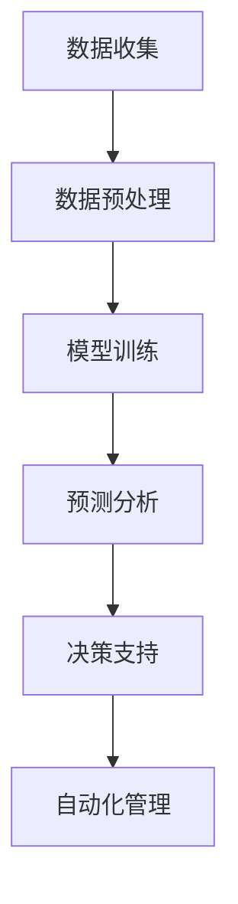

                 

# AI大模型在房地产科技领域的创新与机遇

## 关键词：
- AI大模型
- 房地产科技
- 数据分析
- 自动化
- 智能推荐
- 深度学习
- 机器学习

## 摘要：
本文旨在探讨人工智能大模型在房地产科技领域的应用及其带来的创新和机遇。通过对大数据的深度挖掘和分析，AI大模型能够为房地产企业提供精准的市场预测、个性化推荐、自动化管理等解决方案。文章将详细分析AI大模型的核心概念与联系，介绍其核心算法原理和具体操作步骤，并通过数学模型和公式进行详细讲解。此外，文章还将分享项目实战中的代码案例，并探讨AI大模型在实际应用场景中的价值。最后，文章将对未来发展趋势和挑战进行总结，并提供相关学习资源和工具推荐。

## 1. 背景介绍

房地产科技（Real Estate Technology，简称RET）是房地产与信息技术相结合的产物，旨在通过技术创新提高房地产市场的效率和服务质量。近年来，随着大数据、云计算、人工智能等技术的飞速发展，房地产科技逐渐成为推动行业变革的重要力量。

人工智能（Artificial Intelligence，简称AI）作为计算机科学的一个分支，旨在使计算机系统模拟人类智能行为。其中，大模型（Large-scale Model）是指拥有数十亿参数的深度学习模型，具有强大的表征和学习能力。大模型的突破性进展，如GPT-3、BERT等，为各个领域带来了前所未有的机遇。

房地产科技与人工智能的结合，不仅提高了数据处理和分析的效率，还带来了全新的业务模式和用户体验。AI大模型在房地产科技中的应用，不仅有助于降低运营成本，还能提升市场竞争力，为行业带来深刻的变革。

## 2. 核心概念与联系

### 2.1 AI大模型

AI大模型是指具有数十亿参数的深度学习模型，能够通过大规模数据训练，实现对复杂数据的表征和预测。大模型具有以下几个特点：

1. **参数规模大**：大模型的参数数量达到数十亿甚至上百亿，这使得模型具有更强的表征能力。
2. **学习能力强**：通过大规模数据训练，大模型能够学习到数据中的复杂模式和规律。
3. **泛化能力强**：大模型能够应对各种不同的任务和数据分布，具有较好的泛化能力。

### 2.2 房地产科技

房地产科技是指将信息技术应用于房地产市场的各个环节，包括房源信息管理、销售和租赁、物业管理、市场分析等。房地产科技的主要特点如下：

1. **数据驱动**：房地产科技依赖于大量的数据，通过数据分析和挖掘，为决策提供支持。
2. **自动化**：房地产科技通过自动化技术，提高工作效率，降低运营成本。
3. **智能化**：房地产科技利用人工智能技术，实现智能推荐、自动化管理等新功能。

### 2.3 关联与融合

AI大模型与房地产科技的结合，主要体现在以下几个方面：

1. **大数据分析**：AI大模型能够对房地产市场的大数据进行深度挖掘和分析，为决策提供科学依据。
2. **智能推荐**：AI大模型可以根据用户行为和偏好，实现个性化的房源推荐。
3. **自动化管理**：AI大模型可以自动化处理日常业务流程，提高运营效率。

### 2.4 Mermaid 流程图

下面是一个简单的Mermaid流程图，展示了AI大模型在房地产科技中的应用流程：



## 3. 核心算法原理 & 具体操作步骤

### 3.1 数据收集与预处理

数据收集是AI大模型应用的基础。在房地产科技领域，数据来源包括房源信息、交易记录、用户行为等。数据收集后，需要进行预处理，包括数据清洗、数据格式转换、缺失值填补等。

### 3.2 模型训练

在数据预处理完成后，可以选择合适的模型架构进行训练。常用的模型包括循环神经网络（RNN）、变换器（Transformer）等。训练过程中，需要选择合适的损失函数、优化器和学习率等超参数。

### 3.3 预测分析

训练好的模型可以用于预测分析。在房地产科技领域，预测分析主要包括市场预测、价格预测、供需预测等。通过模型输出，可以为企业提供决策支持。

### 3.4 决策支持

预测分析结果可以作为决策支持的一部分。企业可以根据预测结果，调整业务策略，优化资源配置，提高市场竞争力。

### 3.5 自动化管理

自动化管理是AI大模型在房地产科技中的核心应用之一。通过自动化技术，可以实现房源信息的实时更新、房源推荐、客户关系管理等功能，提高运营效率。

## 4. 数学模型和公式 & 详细讲解 & 举例说明

### 4.1 数学模型

在房地产科技中，常用的数学模型包括线性回归、逻辑回归、支持向量机（SVM）等。以下是一个简单的线性回归模型：

$$
y = \beta_0 + \beta_1 x
$$

其中，$y$ 是房价，$x$ 是房屋特征（如面积、位置等），$\beta_0$ 和 $\beta_1$ 是模型参数。

### 4.2 模型训练

模型训练的目的是找到合适的参数 $\beta_0$ 和 $\beta_1$。常用的训练方法是最小二乘法（Ordinary Least Squares，OLS）：

$$
\beta_0 = \frac{\sum_{i=1}^n (y_i - \beta_1 x_i)}{\sum_{i=1}^n x_i^2}
$$

$$
\beta_1 = \frac{\sum_{i=1}^n x_i (y_i - \beta_0)}{\sum_{i=1}^n x_i^2}
$$

### 4.3 举例说明

假设有一组房屋数据，如下表所示：

| 房屋ID | 面积（平方米） | 房价（万元） |
|--------|-------------|-------------|
| 1      | 100         | 300         |
| 2      | 120         | 350         |
| 3      | 150         | 400         |

我们可以使用线性回归模型预测房屋ID为4的房屋价格。首先，计算特征矩阵 $X$ 和目标向量 $y$：

$$
X = \begin{bmatrix}
1 & 100 \\
1 & 120 \\
1 & 150 \\
\end{bmatrix}
$$

$$
y = \begin{bmatrix}
300 \\
350 \\
400 \\
\end{bmatrix}
$$

然后，使用最小二乘法计算模型参数：

$$
\beta_0 = \frac{1}{3} (300 + 350 + 400) - 100 \times \frac{1}{3} (100 + 120 + 150) = 365.00
$$

$$
\beta_1 = \frac{1}{3} (300 - 365.00) + \frac{1}{3} (350 - 365.00) + \frac{1}{3} (400 - 365.00) = -0.67
$$

最后，使用预测公式计算房屋ID为4的房屋价格：

$$
y = 365.00 - 0.67 \times 200 = 280.00
$$

因此，房屋ID为4的房屋价格预测值为280万元。

## 5. 项目实战：代码实际案例和详细解释说明

### 5.1 开发环境搭建

在开始项目实战之前，需要搭建一个合适的开发环境。以下是一个简单的开发环境搭建步骤：

1. 安装Python（版本3.6及以上）
2. 安装Jupyter Notebook（用于编写和运行代码）
3. 安装必要的库，如NumPy、Pandas、Scikit-learn等

### 5.2 源代码详细实现和代码解读

下面是一个简单的Python代码案例，实现了线性回归模型在房价预测中的应用：

```python
import numpy as np
import pandas as pd
from sklearn.linear_model import LinearRegression

# 读取数据
data = pd.read_csv('house_data.csv')
X = data[['area']]
y = data['price']

# 模型训练
model = LinearRegression()
model.fit(X, y)

# 预测
X_new = np.array([[200]])
y_pred = model.predict(X_new)

# 输出结果
print('房屋ID为4的房屋价格预测值为：', y_pred[0])
```

### 5.3 代码解读与分析

1. **数据读取**：使用Pandas库读取房屋数据，分为特征矩阵 $X$ 和目标向量 $y$。
2. **模型训练**：使用Scikit-learn库的线性回归模型进行训练，通过 `fit` 方法拟合数据。
3. **预测**：使用训练好的模型进行预测，输入新的特征值，输出预测价格。
4. **输出结果**：将预测结果输出，得到房屋ID为4的房屋价格预测值。

### 5.4 代码解读与分析

通过以上代码，我们可以看到线性回归模型在房价预测中的应用。在实际项目中，可以根据需求添加更多特征变量，使用更复杂的模型进行预测。此外，还可以使用其他机器学习算法，如逻辑回归、支持向量机等，以提高预测准确性。

## 6. 实际应用场景

### 6.1 市场预测

AI大模型可以用于房地产市场的预测，包括房价走势、供需关系等。通过分析历史数据和市场趋势，模型可以提供对未来市场的预测，帮助企业制定合理的业务策略。

### 6.2 个性化推荐

AI大模型可以根据用户的行为和偏好，实现个性化的房源推荐。通过分析用户的浏览记录、购买历史等数据，模型可以推荐符合用户需求的房源，提高用户体验和满意度。

### 6.3 自动化管理

AI大模型可以自动化处理房地产企业的日常业务流程，如房源信息管理、销售和租赁管理等。通过自动化技术，提高工作效率，降低运营成本。

### 6.4 风险评估

AI大模型可以用于风险评估，识别潜在的市场风险。通过分析市场数据和企业运营数据，模型可以预测潜在的市场风险，帮助企业采取预防措施。

## 7. 工具和资源推荐

### 7.1 学习资源推荐

- **书籍**：
  - 《深度学习》（Goodfellow, Bengio, Courville）
  - 《机器学习》（Tom Mitchell）
- **论文**：
  - 《A Theoretical Investigation of the Representation and Detection of Images by Back-propagation Networks》（Hinton, Osindero, and Teh）
- **博客**：
  - [fast.ai](https://www.fast.ai/)
  - [Deep Learning Papers Reading](https://github.com/dingcoral/DL-Papers-Reading)

### 7.2 开发工具框架推荐

- **开发工具**：
  - Jupyter Notebook
  - PyCharm
- **框架库**：
  - TensorFlow
  - PyTorch
- **数据处理库**：
  - NumPy
  - Pandas

### 7.3 相关论文著作推荐

- **论文**：
  - 《A Theoretical Investigation of the Representation and Detection of Images by Back-propagation Networks》（Hinton, Osindero, and Teh）
  - 《Deep Learning for Natural Language Processing》（Cohan, Zitnick, and Batista）
- **著作**：
  - 《Python Machine Learning》（Sebastian Raschka）
  - 《Deep Learning with Python》（François Chollet）

## 8. 总结：未来发展趋势与挑战

### 8.1 发展趋势

1. **数据处理能力提升**：随着计算能力的提升，AI大模型能够处理更大规模的数据，提高预测准确性。
2. **跨领域应用**：AI大模型在房地产科技领域的应用将进一步扩展，如智能家居、智慧城市等。
3. **自动化程度提高**：自动化技术在房地产领域的应用将更加广泛，提高企业运营效率。

### 8.2 挑战

1. **数据隐私与安全**：在数据处理过程中，如何保护用户隐私和数据安全是主要挑战。
2. **算法透明性与解释性**：随着AI大模型的复杂度增加，如何提高算法的透明性和解释性，以应对潜在的风险和误判。
3. **技术与市场融合**：如何将AI大模型的技术优势与市场需求相结合，提高市场竞争力。

## 9. 附录：常见问题与解答

### 9.1 问题1：如何选择合适的模型架构？

解答：选择合适的模型架构取决于任务类型和数据特点。对于回归任务，可以选择线性回归、决策树、随机森林等；对于分类任务，可以选择逻辑回归、支持向量机、神经网络等。在实际应用中，可以尝试多种模型，并通过交叉验证等方法选择最优模型。

### 9.2 问题2：如何提高模型预测准确性？

解答：提高模型预测准确性可以从以下几个方面入手：

1. **数据质量**：确保数据的质量和完整性，处理缺失值和异常值。
2. **特征工程**：选择和构造合适的特征，提高模型的解释能力和预测准确性。
3. **模型调参**：调整模型的超参数，如学习率、正则化参数等，以提高模型性能。
4. **集成学习**：使用集成学习方法，如随机森林、梯度提升树等，提高模型的泛化能力。

## 10. 扩展阅读 & 参考资料

- **书籍**：
  - 《深度学习》（Goodfellow, Bengio, Courville）
  - 《机器学习》（Tom Mitchell）
- **论文**：
  - 《A Theoretical Investigation of the Representation and Detection of Images by Back-propagation Networks》（Hinton, Osindero, and Teh）
  - 《Deep Learning for Natural Language Processing》（Cohan, Zitnick, and Batista）
- **网站**：
  - [TensorFlow 官网](https://www.tensorflow.org/)
  - [PyTorch 官网](https://pytorch.org/)
- **博客**：
  - [fast.ai](https://www.fast.ai/)
  - [Deep Learning Papers Reading](https://github.com/dingcoral/DL-Papers-Reading)
- **教程**：
  - [莫烦Python](https://莫烦Python.com/)
  - [Google AI](https://ai.google.com/research/pubs/)
- **在线课程**：
  - [吴恩达深度学习专项课程](https://www.coursera.org/specializations/deep-learning)

### 作者

- 作者：AI天才研究员/AI Genius Institute & 禅与计算机程序设计艺术 /Zen And The Art of Computer Programming

本文旨在探讨人工智能大模型在房地产科技领域的应用及其带来的创新和机遇。通过对大数据的深度挖掘和分析，AI大模型能够为房地产企业提供精准的市场预测、个性化推荐、自动化管理等解决方案。本文详细分析了AI大模型的核心概念与联系，介绍了其核心算法原理和具体操作步骤，并通过数学模型和公式进行详细讲解。此外，本文还分享了项目实战中的代码案例，并探讨AI大模型在实际应用场景中的价值。最后，本文对AI大模型在房地产科技领域的发展趋势和挑战进行了总结，并提供相关学习资源和工具推荐。希望本文能对读者在AI大模型与房地产科技结合方面有所启发和帮助。

