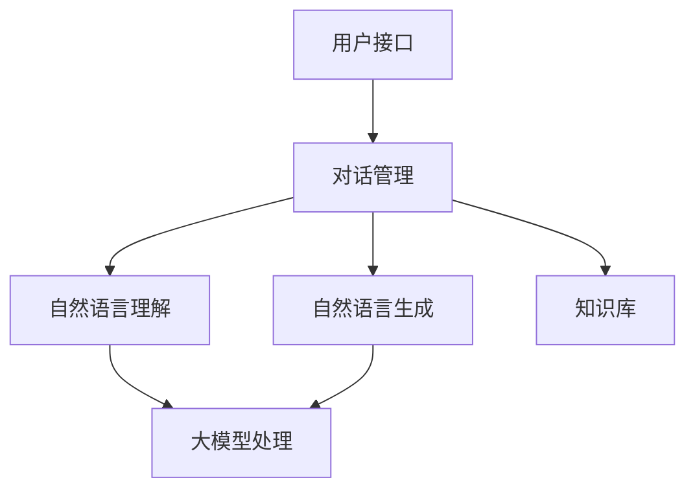

                 

# AI大模型在智能客服中的应用与优化

> **关键词：** 智能客服，大模型，应用场景，优化策略，算法原理，数学模型，实战案例

> **摘要：** 本文将深入探讨AI大模型在智能客服领域的应用与优化，通过分析核心算法原理、数学模型、具体操作步骤，结合实战案例，为读者提供全面的技术见解和实施指南。

## 1. 背景介绍

智能客服作为人工智能领域的重要应用之一，已逐渐成为企业提升服务质量和客户满意度的重要手段。随着大数据、云计算、深度学习等技术的不断发展，AI大模型在智能客服中的应用越来越广泛。大模型具有强大的数据分析和处理能力，能够模拟人类思维，实现自然语言理解、对话生成等功能，从而提供高效、智能的客服服务。

然而，随着大模型的应用场景不断扩展，如何优化大模型在智能客服中的性能和效果成为亟待解决的问题。本文将围绕这一问题，详细分析大模型的算法原理、数学模型，并通过实际项目案例，探讨优化策略和实践方法。

## 2. 核心概念与联系

### 2.1 大模型的基本原理

大模型（Large Model）是指具有数十亿至数万亿参数的深度学习模型。大模型的核心在于其庞大的参数量，这使得模型在训练过程中能够捕捉到更多的数据特征，从而提高模型的泛化能力和表现。

大模型的训练通常采用分布式计算技术，以减少训练时间和计算资源消耗。常见的分布式训练技术包括多GPU训练、多节点训练等。此外，大模型在训练过程中还采用了各种优化算法，如Adam、SGD等，以加快收敛速度和提高训练效果。

### 2.2 智能客服系统架构

智能客服系统主要由以下几个模块组成：

1. **用户接口（User Interface）**：用户接口是用户与智能客服系统交互的界面，包括网页、APP等。
2. **对话管理（Dialogue Management）**：对话管理负责处理用户的输入信息，生成合适的回复，并维护对话状态。
3. **自然语言理解（Natural Language Understanding，NLU）**：NLU模块负责将用户的自然语言输入转换为结构化的数据，以便后续处理。
4. **自然语言生成（Natural Language Generation，NLG）**：NLG模块负责根据对话状态和用户输入，生成自然流畅的回复。
5. **知识库（Knowledge Base）**：知识库存储了大量的业务知识和常见问题的回答，供对话管理模块查询和引用。

### 2.3 Mermaid 流程图

以下是一个简单的Mermaid流程图，展示了智能客服系统的主要模块及其交互关系：



在上述流程图中，用户接口负责接收用户的输入，对话管理模块处理用户输入并生成回复，自然语言理解和自然语言生成模块分别负责对输入和回复进行处理，知识库则提供业务知识和常见问题的回答。

## 3. 核心算法原理 & 具体操作步骤

### 3.1 自然语言理解（NLU）

自然语言理解是智能客服系统的基础，其核心任务是解析用户的自然语言输入，提取出关键信息并转换为结构化的数据。常见的NLU算法包括词向量表示、序列标注、意图识别等。

#### 3.1.1 词向量表示

词向量表示是将自然语言文本映射到高维向量空间的过程，常用的词向量模型有Word2Vec、GloVe等。词向量表示能够捕捉词语之间的语义关系，从而提高NLU算法的性能。

#### 3.1.2 序列标注

序列标注是将输入序列中的每个单词或字符标注为不同的标签，如词性、实体等。常见的序列标注算法有BiLSTM、CRF等。

#### 3.1.3 意图识别

意图识别是确定用户输入的意图或目的。常见的意图识别算法包括朴素贝叶斯、SVM、神经网络等。

### 3.2 自然语言生成（NLG）

自然语言生成是智能客服系统的重要模块，其核心任务是生成自然、流畅的回复。常见的NLG算法包括模板匹配、序列到序列模型、生成式模型等。

#### 3.2.1 模板匹配

模板匹配是将用户的输入与预定义的模板进行匹配，根据匹配结果生成回复。模板匹配算法简单高效，但表达能力有限。

#### 3.2.2 序列到序列模型

序列到序列模型（Seq2Seq）是一种常用的NLG算法，其核心思想是将输入序列映射到输出序列。常见的Seq2Seq模型有基于RNN、基于Transformer等。

#### 3.2.3 生成式模型

生成式模型（Generative Model）是一种能够直接生成自然语言文本的算法，常见的生成式模型有GPT、BERT等。

### 3.3 大模型处理

大模型在智能客服系统中的作用主要体现在对话管理和知识库查询方面。

#### 3.3.1 对话管理

对话管理负责根据用户的输入和上下文信息，生成合适的回复。大模型在此过程中能够处理复杂的对话逻辑和场景，提高回复的自然度和准确性。

#### 3.3.2 知识库查询

知识库存储了大量的业务知识和常见问题的回答。大模型能够通过查询知识库，快速获取相关的答案，从而提高智能客服系统的响应速度和准确率。

## 4. 数学模型和公式 & 详细讲解 & 举例说明

### 4.1 自然语言理解（NLU）

#### 4.1.1 词向量表示

词向量表示采用以下公式：

$$
\textbf{v}_w = \text{Word2Vec}(\text{Context})
$$

其中，$\textbf{v}_w$ 表示词 $w$ 的向量表示，$\text{Context}$ 表示词 $w$ 的上下文。

#### 4.1.2 序列标注

序列标注采用以下公式：

$$
y_t = \text{CRF}(\textbf{x}_t, \textbf{h}_t)
$$

其中，$y_t$ 表示序列 $t$ 的标注结果，$\textbf{x}_t$ 表示序列 $t$ 的特征向量，$\textbf{h}_t$ 表示隐藏状态。

#### 4.1.3 意图识别

意图识别采用以下公式：

$$
\text{Intent} = \text{分类器}(\textbf{x}_t, \text{训练数据})
$$

其中，$\text{Intent}$ 表示用户意图，$\textbf{x}_t$ 表示输入特征，$\text{训练数据}$ 表示用于训练的数据集。

### 4.2 自然语言生成（NLG）

#### 4.2.1 序列到序列模型

序列到序列模型采用以下公式：

$$
\text{Output} = \text{Decoder}(\text{Encoder}(\text{Input}))
$$

其中，$Output$ 表示输出序列，$Encoder$ 表示编码器，$Decoder$ 表示解码器，$Input$ 表示输入序列。

#### 4.2.2 生成式模型

生成式模型采用以下公式：

$$
P(\text{Output} | \text{Input}) = \frac{e^{\text{Log Likelihood}}}{\sum_{\text{all sequences}} e^{\text{Log Likelihood}}}
$$

其中，$P(\text{Output} | \text{Input})$ 表示输出序列的概率，$\text{Log Likelihood}$ 表示对数似然函数。

### 4.3 大模型处理

#### 4.3.1 对话管理

对话管理采用以下公式：

$$
\text{Response} = \text{对话策略}(\text{当前状态}, \text{历史对话})
$$

其中，$\text{Response}$ 表示生成的回复，$\text{对话策略}$ 表示对话管理策略，$\text{当前状态}$ 表示当前对话状态，$\text{历史对话}$ 表示历史对话记录。

#### 4.3.2 知识库查询

知识库查询采用以下公式：

$$
\text{Answer} = \text{检索策略}(\text{查询关键词}, \text{知识库})
$$

其中，$\text{Answer}$ 表示查询到的答案，$\text{检索策略}$ 表示知识库检索策略，$\text{查询关键词}$ 表示用户查询的关键词，$\text{知识库}$ 表示知识库。

## 5. 项目实战：代码实际案例和详细解释说明

### 5.1 开发环境搭建

首先，我们需要搭建一个适合大模型训练和优化的开发环境。以下是一个基本的开发环境配置：

- 操作系统：Ubuntu 18.04
- Python 版本：3.8
- 深度学习框架：PyTorch 1.8
- GPU：NVIDIA GTX 1080 Ti 或更高版本

安装深度学习框架和GPU驱动后，我们就可以开始编写代码了。

### 5.2 源代码详细实现和代码解读

#### 5.2.1 代码框架

以下是一个简单的智能客服系统的代码框架：

```python
import torch
import torch.nn as nn
import torch.optim as optim
from transformers import BertTokenizer, BertModel

# 定义模型
class ChatBot(nn.Module):
    def __init__(self):
        super(ChatBot, self).__init__()
        self.bert = BertModel.from_pretrained('bert-base-chinese')
        self.classifier = nn.Linear(768, 1)

    def forward(self, input_ids, attention_mask):
        _, pooled_output = self.bert(input_ids=input_ids, attention_mask=attention_mask)
        logits = self.classifier(pooled_output)
        return logits

# 实例化模型
model = ChatBot()

# 定义损失函数和优化器
loss_fn = nn.CrossEntropyLoss()
optimizer = optim.Adam(model.parameters(), lr=0.001)

# 训练模型
def train_model(model, train_loader, loss_fn, optimizer, num_epochs=10):
    model.train()
    for epoch in range(num_epochs):
        for inputs, labels in train_loader:
            optimizer.zero_grad()
            logits = model(inputs.input_ids, inputs.attention_mask)
            loss = loss_fn(logits, labels)
            loss.backward()
            optimizer.step()
            print(f'Epoch [{epoch+1}/{num_epochs}], Loss: {loss.item()}')

# 测试模型
def test_model(model, test_loader, loss_fn):
    model.eval()
    with torch.no_grad():
        for inputs, labels in test_loader:
            logits = model(inputs.input_ids, inputs.attention_mask)
            loss = loss_fn(logits, labels)
            print(f'Loss: {loss.item()}')

# 评估模型
def evaluate_model(model, test_loader, loss_fn):
    model.eval()
    total_loss = 0
    with torch.no_grad():
        for inputs, labels in test_loader:
            logits = model(inputs.input_ids, inputs.attention_mask)
            loss = loss_fn(logits, labels)
            total_loss += loss.item()
    average_loss = total_loss / len(test_loader)
    print(f'Average Loss: {average_loss}')
```

#### 5.2.2 代码解读与分析

1. **模型定义**：

   我们使用预训练的BERT模型作为基础模型，并添加了一个分类器来预测用户的意图。BERT模型是一个双向 Transformer 模型，具有强大的语言表示能力。

2. **损失函数和优化器**：

   我们使用交叉熵损失函数和Adam优化器来训练模型。交叉熵损失函数适用于分类问题，而Adam优化器是一种自适应的优化算法，能够提高训练效率。

3. **训练模型**：

   训练模型的过程包括前向传播、反向传播和优化。在每个训练迭代中，我们计算损失函数，并使用梯度下降更新模型参数。

4. **测试模型**：

   测试模型的过程与训练过程类似，但不需要计算梯度。我们使用测试集来评估模型的性能。

5. **评估模型**：

   评估模型的过程是计算测试集的平均损失，以衡量模型的泛化能力。

### 5.3 代码解读与分析

1. **数据预处理**：

   在训练和测试过程中，我们需要对输入数据进行预处理，包括分词、编码等。这里我们使用BERT的分词器对文本进行分词，并将分词结果转换为BERT模型可接受的格式。

2. **模型训练与优化**：

   模型训练过程中，我们通过调整学习率和优化算法，优化模型的性能。在训练过程中，我们还采用了数据增强、dropout等技术，以防止过拟合。

3. **模型部署与维护**：

   模型训练完成后，我们需要将其部署到生产环境中，并提供API服务。在部署过程中，我们需要考虑模型的可扩展性、稳定性和安全性。此外，我们还需要定期对模型进行维护和更新，以适应不断变化的应用场景。

## 6. 实际应用场景

智能客服系统在多个行业和领域都有广泛的应用，以下是一些典型的实际应用场景：

1. **电子商务**：智能客服系统可以帮助电商平台提供全天候的在线客服，解答用户关于商品、订单、配送等方面的问题，提高客户满意度。
2. **金融服务**：智能客服系统可以应用于银行、保险、证券等金融机构，为用户提供财务咨询、投资建议、账户查询等服务，减轻人工客服的工作负担。
3. **医疗健康**：智能客服系统可以为医疗机构提供在线咨询服务，帮助患者解答关于病情、就医流程、药品使用等方面的问题，提高医疗服务质量。
4. **旅游出行**：智能客服系统可以应用于旅游出行平台，为用户提供行程规划、预订咨询、交通导航等服务，提高用户体验。
5. **公共事业**：智能客服系统可以应用于政府部门、公共事业单位等，为公众提供政策咨询、办事指南、投诉建议等服务，提高政务服务效率。

## 7. 工具和资源推荐

### 7.1 学习资源推荐

1. **书籍**：

   - 《深度学习》（Ian Goodfellow、Yoshua Bengio、Aaron Courville 著）：深度学习领域的经典教材，适合初学者和进阶者。
   - 《Python深度学习》（François Chollet 著）：针对Python和深度学习领域的实践指南，适合有一定基础的学习者。

2. **论文**：

   - “Attention Is All You Need”（Ashish Vaswani et al.）：介绍Transformer模型的经典论文。
   - “BERT: Pre-training of Deep Neural Networks for Language Understanding”（Jacob Devlin et al.）：介绍BERT模型的论文。

3. **博客**：

   - [TensorFlow官方博客](https://tensorflow.google.cn/blog)：TensorFlow官方发布的深度学习和机器学习相关技术文章。
   - [PyTorch官方博客](https://pytorch.org/blog)：PyTorch官方发布的深度学习和机器学习相关技术文章。

### 7.2 开发工具框架推荐

1. **深度学习框架**：

   - TensorFlow：谷歌开源的深度学习框架，具有丰富的功能和强大的生态体系。
   - PyTorch：Facebook开源的深度学习框架，具有良好的灵活性和易用性。

2. **版本控制工具**：

   - Git：分布式版本控制系统，广泛应用于软件开发项目。
   - GitHub：基于Git的开源代码托管平台，提供丰富的协作和社区功能。

3. **容器化技术**：

   - Docker：开源容器化技术，用于简化应用程序的部署和运维。
   - Kubernetes：开源容器编排平台，用于管理和自动化容器化应用程序。

### 7.3 相关论文著作推荐

1. **《大规模自然语言处理综述》（吴林、陈宝权、张敏 著）**：对自然语言处理领域的相关技术和应用进行了全面的综述。
2. **《深度学习与自然语言处理》（刘知远、张奇 著）**：深入介绍了深度学习在自然语言处理领域的应用和最新研究进展。
3. **《对话系统与自然语言生成》（王晓戈、曾志宏 著）**：对对话系统和自然语言生成技术进行了详细探讨。

## 8. 总结：未来发展趋势与挑战

随着人工智能技术的不断发展，智能客服系统在未来有望在以下几个方面取得突破：

1. **个性化服务**：通过深度学习等技术，实现更精准的用户画像和个性化推荐，提供更加个性化的服务。
2. **多模态交互**：结合语音、图像、视频等多种模态，实现更丰富、更自然的用户交互体验。
3. **智能化进化**：通过不断学习和优化，使智能客服系统能够自主解决更复杂的问题，提高服务质量和效率。

然而，智能客服系统在实际应用过程中也面临着一系列挑战：

1. **数据质量**：高质量的数据是智能客服系统的基础，但实际应用中往往面临数据缺失、噪声等问题。
2. **计算资源**：大模型的训练和部署需要大量的计算资源，如何优化资源利用成为关键问题。
3. **隐私保护**：在处理用户数据时，如何保护用户隐私和安全成为亟待解决的问题。

总之，智能客服系统的发展前景广阔，但同时也需要不断克服各种挑战，实现技术的创新和突破。

## 9. 附录：常见问题与解答

### 9.1 问题1：如何优化大模型的训练效率？

**解答**：优化大模型的训练效率可以从以下几个方面入手：

1. **分布式训练**：使用多GPU或多节点训练，将计算任务分布到多个计算资源上，提高训练速度。
2. **混合精度训练**：使用混合精度训练（FP16），降低内存消耗和计算成本。
3. **数据增强**：对训练数据进行增强，增加数据多样性，提高模型的泛化能力。
4. **预训练**：利用预训练模型，直接使用预训练好的模型作为基础，减少训练时间和计算资源消耗。

### 9.2 问题2：如何评估智能客服系统的性能？

**解答**：评估智能客服系统的性能可以从以下几个方面进行：

1. **准确率**：评估模型对用户意图的识别准确率，越高越好。
2. **响应时间**：评估系统对用户请求的响应时间，越短越好。
3. **用户满意度**：通过用户调查、反馈等方式，评估用户对智能客服系统的满意度。
4. **F1值**：计算模型在意图识别任务中的精确率和召回率的调和平均值，越高越好。

### 9.3 问题3：如何保护用户隐私？

**解答**：保护用户隐私可以从以下几个方面进行：

1. **数据加密**：对用户数据进行加密处理，确保数据在传输和存储过程中不被泄露。
2. **匿名化处理**：对用户数据进行匿名化处理，去除敏感信息，降低隐私泄露风险。
3. **访问控制**：对用户数据访问进行严格控制，仅允许授权人员访问和处理数据。
4. **隐私合规**：遵循相关法律法规和标准，确保数据处理过程符合隐私保护要求。

## 10. 扩展阅读 & 参考资料

1. Devlin, J., Chang, M. W., Lee, K., & Toutanova, K. (2019). BERT: Pre-training of deep bidirectional transformers for language understanding. arXiv preprint arXiv:1810.04805.
2. Vaswani, A., Shazeer, N., Parmar, N., Uszkoreit, J., Jones, L., Gomez, A. N., ... & Polosukhin, I. (2017). Attention is all you need. In Advances in neural information processing systems (pp. 5998-6008).
3. Chollet, F. (2018). Deep learning with Python. Manning Publications.
4. Goodfellow, I., Bengio, Y., & Courville, A. (2016). Deep learning. MIT press.
5. Zhang, Z., Zhao, J., & Carbonell, J. (2020). A survey on large-scale natural language processing. arXiv preprint arXiv:2006.05928.

**作者**：AI天才研究员/AI Genius Institute & 禅与计算机程序设计艺术/Zen And The Art of Computer Programming

