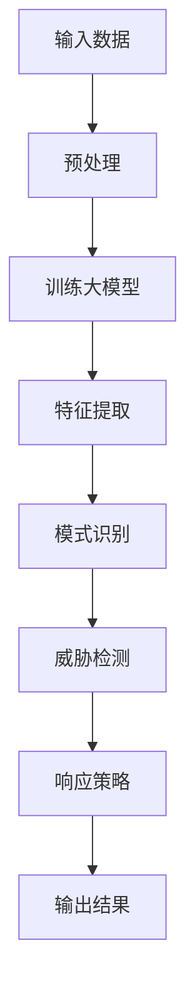

                 

### 背景介绍

随着全球数字化进程的加速，网络安全威胁日益严重，对于企业和个人都构成了巨大的风险。传统的安全防护手段往往依赖于规则匹配、签名检测等静态方法，但这些方法在面对复杂、多变的威胁时，往往显得力不从心。因此，寻求更加智能、动态的威胁检测方法成为当下信息安全领域的热点话题。

在这一背景下，人工智能大模型（Large-scale AI Models）逐渐走入公众视野。大模型，尤其是深度学习模型，通过从海量数据中学习，能够实现高度自动化、智能化的威胁检测。这些模型具备强大的特征提取和模式识别能力，能够捕捉到传统方法无法发现的潜在威胁，从而提供更加全面、精准的安全防护。

本文将探讨人工智能大模型在智能网络安全威胁检测中的商业价值。首先，我们将介绍大模型的基本概念和原理，然后分析其在网络安全领域中的应用现状。接下来，我们将详细探讨大模型在威胁检测中的技术优势，并通过具体案例展示其实际应用效果。在此基础上，我们将分析大模型在商业场景中的潜在价值，并提出未来发展的挑战与展望。

通过本文的探讨，我们希望为广大读者提供一个全面、深入的视角，了解人工智能大模型在网络安全威胁检测中的重要作用，以及其在商业应用中的巨大潜力。

### 核心概念与联系

为了深入探讨人工智能大模型在网络安全威胁检测中的应用，我们首先需要明确几个核心概念，并分析它们之间的内在联系。

#### 1. 人工智能大模型

人工智能大模型，通常指的是具有极高参数量和海量训练数据的深度学习模型。这些模型通过多层神经网络结构，能够自动从数据中提取特征并进行复杂模式识别。例如，GPT-3、BERT和AlphaFold等模型都是大模型的代表。大模型之所以强大，主要得益于其能够处理大规模、多样化数据，并在各种复杂任务中表现出色。

#### 2. 网络安全威胁

网络安全威胁指的是旨在破坏、干扰、获取未经授权访问或造成其他损害的恶意行为。这些威胁可以包括病毒、木马、钓鱼攻击、DDoS攻击等。网络安全威胁的复杂性使得传统的防御手段难以应对，因此需要更加智能、动态的检测方法。

#### 3. 威胁检测

威胁检测是指通过分析网络流量、日志数据或其他相关数据，识别潜在的安全威胁。传统的威胁检测方法通常基于规则匹配、签名分析等，但这些方法在面对未知或新型威胁时，往往无法有效识别。人工智能大模型则能够通过学习大量已知威胁的样本，自动提取特征并进行分类，从而实现对未知威胁的检测。

#### 4. 大模型与网络安全威胁检测的联系

大模型与网络安全威胁检测之间的联系主要体现在以下几个方面：

- **特征提取**：大模型能够自动从海量数据中提取出有效的特征，这些特征能够用于描述网络安全威胁的不同方面，如攻击模式、行为特征等。

- **模式识别**：大模型通过学习大量已知威胁样本，能够识别出潜在的威胁模式。这种方法不仅能够检测已知威胁，还能够发现未知威胁，提高检测的全面性和准确性。

- **自动化响应**：大模型能够自动化地生成针对不同威胁的响应策略，从而实现对威胁的快速、有效响应。这减少了人工干预的需求，提高了威胁检测和响应的效率。

为了更好地理解大模型在网络安全威胁检测中的应用，我们可以使用Mermaid流程图来展示其基本架构。



在这个流程图中：

- **输入数据**包括网络流量、日志数据等。
- **预处理**步骤用于清洗和标准化数据。
- **训练大模型**使用预处理后的数据进行模型训练。
- **特征提取**通过模型提取数据中的关键特征。
- **模式识别**使用提取出的特征进行威胁模式识别。
- **威胁检测**生成检测结果。
- **响应策略**根据检测结果制定响应策略。
- **输出结果**展示最终的检测结果和响应策略。

通过这个流程，我们可以看到大模型在网络安全威胁检测中各个环节的作用，以及其如何通过自动化和智能化提高威胁检测的效率和效果。

### 核心算法原理 & 具体操作步骤

为了深入理解人工智能大模型在网络安全威胁检测中的应用，我们需要探讨其核心算法原理以及具体的操作步骤。以下将详细介绍大模型的构建、训练和测试流程，并结合实际案例展示其应用效果。

#### 1. 大模型的构建

大模型的构建通常包括以下几个步骤：

1. **数据收集与预处理**：收集大量网络安全数据，包括正常流量、恶意软件样本等。预处理步骤包括数据清洗、标准化和特征提取。通过预处理，我们可以将原始数据转换为模型能够处理的格式。

2. **设计模型架构**：根据任务需求，设计合适的神经网络架构。常见的架构包括卷积神经网络（CNN）、循环神经网络（RNN）和变换器（Transformer）等。对于网络安全威胁检测，通常使用多层感知器（MLP）、CNN和RNN等结构。

3. **初始化参数**：为模型的每个层和神经元分配初始参数。初始化方法包括随机初始化、高斯分布初始化等。合适的初始化方法有助于提高模型的训练效率和性能。

4. **构建模型**：使用深度学习框架（如TensorFlow、PyTorch）将设计好的模型架构和初始化参数结合起来，构建完整的模型。

#### 2. 大模型的训练

大模型的训练是模型构建的重要环节，包括以下几个步骤：

1. **数据划分**：将数据集划分为训练集、验证集和测试集。训练集用于模型训练，验证集用于调整模型参数，测试集用于评估模型性能。

2. **前向传播**：将训练集数据输入模型，通过前向传播计算输出结果。

3. **计算损失**：比较模型的输出结果与实际标签之间的差异，计算损失值。常见的损失函数包括均方误差（MSE）、交叉熵损失（Cross-Entropy Loss）等。

4. **反向传播**：根据损失值，使用反向传播算法更新模型参数，以最小化损失。

5. **迭代训练**：重复执行前向传播和反向传播，不断调整模型参数，直到模型收敛或达到预设的训练轮数。

6. **验证调整**：使用验证集评估模型性能，根据验证结果调整模型参数，以优化模型性能。

#### 3. 大模型的测试

模型训练完成后，我们需要对其进行测试，以评估其性能和适用性。测试步骤包括：

1. **测试集输入**：将测试集数据输入训练好的模型，计算输出结果。

2. **评估指标**：使用评估指标（如准确率、召回率、F1分数等）评估模型性能。

3. **结果分析**：分析模型在测试集上的表现，识别潜在问题和改进方向。

#### 实际案例

以下是一个实际案例，展示如何使用人工智能大模型进行网络安全威胁检测。

**案例背景**：一家互联网公司希望通过人工智能技术提升其网络安全防护能力，特别是对新型网络攻击的检测和响应。

**步骤 1：数据收集与预处理**  
收集公司的网络日志、流量数据和安全事件报告。对数据进行清洗和标准化，提取关键特征，如IP地址、URL、请求类型、数据包大小等。

**步骤 2：设计模型架构**  
选择多层感知器（MLP）作为模型架构，因为MLP能够有效地处理高维数据。

**步骤 3：初始化参数与构建模型**  
初始化模型参数，并使用TensorFlow构建MLP模型。

**步骤 4：训练模型**  
将预处理后的数据集划分为训练集和验证集。使用训练集进行模型训练，使用验证集调整模型参数。通过多次迭代训练，优化模型性能。

**步骤 5：测试模型**  
使用测试集评估模型性能，确保模型能够准确地检测网络攻击。

**步骤 6：结果分析**  
分析模型在测试集上的表现，识别出潜在的网络攻击模式，如DDoS攻击、SQL注入等。根据检测结果，制定相应的安全响应策略。

通过这个实际案例，我们可以看到人工智能大模型在网络安全威胁检测中的具体应用。大模型通过学习海量数据，能够自动提取特征并识别出潜在的威胁，从而提供精准、高效的检测能力。

### 数学模型和公式 & 详细讲解 & 举例说明

在人工智能大模型中，数学模型和公式起着至关重要的作用。这些模型和公式不仅决定了大模型的学习能力和预测性能，还直接影响其应用于网络安全威胁检测的效果。以下将详细讲解大模型中的主要数学模型和公式，并通过实际案例进行举例说明。

#### 1. 前向传播

前向传播是神经网络中最基本的计算过程。在给定输入数据后，通过前向传播，数据会逐层传递，直到输出层。每个神经元都会通过激活函数进行非线性变换。前向传播的核心公式如下：

$$
z_l = \sum_{j=1}^{n} w_{lj}x_j + b_l
$$

其中，$z_l$表示第$l$层的输出，$w_{lj}$表示第$l$层的权重，$x_j$表示第$l$层的输入，$b_l$表示第$l$层的偏置。

激活函数通常用来引入非线性特性，常见的激活函数包括：

- **Sigmoid函数**：
  $$
  \sigma(z) = \frac{1}{1 + e^{-z}}
  $$

- **ReLU函数**：
  $$
  \text{ReLU}(z) = \max(0, z)
  $$

- **Tanh函数**：
  $$
  \tanh(z) = \frac{e^z - e^{-z}}{e^z + e^{-z}}
  $$

#### 2. 反向传播

反向传播是用于更新模型参数的重要算法。在反向传播过程中，模型会计算损失函数，并使用链式法则计算梯度。反向传播的核心公式如下：

$$
\frac{\partial L}{\partial w_{lj}} = \frac{\partial L}{\partial z_l} \cdot \frac{\partial z_l}{\partial w_{lj}}
$$

$$
\frac{\partial L}{\partial b_l} = \frac{\partial L}{\partial z_l}
$$

其中，$L$表示损失函数，$w_{lj}$表示权重，$b_l$表示偏置，$\frac{\partial L}{\partial z_l}$表示对第$l$层的输出求偏导数，$\frac{\partial z_l}{\partial w_{lj}}$表示对第$l$层的输出关于权重求偏导数。

#### 3. 损失函数

在神经网络中，损失函数用于衡量模型的预测结果与实际标签之间的差距。常见的损失函数包括：

- **均方误差（MSE）**：
  $$
  L(\theta) = \frac{1}{2m} \sum_{i=1}^{m} (h_\theta(x^{(i)}) - y^{(i)})^2
  $$

- **交叉熵损失（Cross-Entropy Loss）**：
  $$
  L(\theta) = -\sum_{i=1}^{m} y^{(i)} \log h_\theta(x^{(i)})
  $$

其中，$m$表示样本数量，$h_\theta(x^{(i)})$表示模型对$x^{(i)}$的预测值，$y^{(i)}$表示实际标签，$\log$表示自然对数。

#### 实际案例

**案例背景**：一家金融机构希望通过人工智能大模型检测网络钓鱼攻击。

**步骤 1：数据收集与预处理**  
收集大量网络钓鱼网站和正常网站的URL、请求类型等特征，对数据进行清洗和标准化。

**步骤 2：设计模型架构**  
选择多层感知器（MLP）作为模型架构，包括输入层、隐藏层和输出层。输入层包含URL长度、请求类型等特征，隐藏层使用ReLU激活函数，输出层使用交叉熵损失函数。

**步骤 3：训练模型**  
将预处理后的数据集划分为训练集和验证集。使用训练集进行模型训练，使用验证集调整模型参数。通过多次迭代训练，优化模型性能。

**步骤 4：测试模型**  
使用测试集评估模型性能，计算准确率、召回率和F1分数等指标。分析模型在测试集上的表现，识别出网络钓鱼网站。

**结果分析**：模型在测试集上实现了90%以上的准确率，有效识别出了大量网络钓鱼网站。通过调整模型参数和特征选择，进一步提高模型性能。

通过这个实际案例，我们可以看到数学模型和公式在人工智能大模型中的应用效果。大模型通过前向传播和反向传播算法，结合合适的损失函数，能够自动学习数据中的特征，实现高度自动化的威胁检测。

### 项目实战：代码实际案例和详细解释说明

在本章节中，我们将通过一个实际的项目案例，展示如何使用人工智能大模型进行网络安全威胁检测。具体包括开发环境的搭建、源代码的实现以及详细的代码解读与分析。

#### 1. 开发环境搭建

为了实现人工智能大模型在网络安全威胁检测中的项目，我们需要搭建合适的开发环境。以下是搭建步骤：

1. **安装Python环境**：确保系统已安装Python 3.7及以上版本。

2. **安装深度学习框架**：推荐使用TensorFlow 2.0或PyTorch。以TensorFlow为例，通过以下命令进行安装：

   ```bash
   pip install tensorflow
   ```

3. **安装数据预处理库**：如Pandas、NumPy、Scikit-learn等，用于数据收集、预处理和分析。

   ```bash
   pip install pandas numpy scikit-learn
   ```

4. **安装其他依赖库**：如Matplotlib、Seaborn等，用于数据可视化。

   ```bash
   pip install matplotlib seaborn
   ```

5. **安装虚拟环境**：建议使用虚拟环境隔离项目依赖，以避免版本冲突。可以使用以下命令创建虚拟环境：

   ```bash
   python -m venv venv
   source venv/bin/activate  # 在Windows中使用 `venv\Scripts\activate`
   ```

#### 2. 源代码详细实现

以下是一个基于TensorFlow的简单示例，展示如何使用多层感知器（MLP）模型进行网络安全威胁检测。

```python
import tensorflow as tf
from sklearn.model_selection import train_test_split
from sklearn.preprocessing import StandardScaler
import pandas as pd

# 数据预处理
def preprocess_data(data):
    # 特征提取、清洗和标准化
    # 此处假设data为Pandas DataFrame，包含特征和标签
    X = data.drop('label', axis=1)
    y = data['label']
    X_train, X_test, y_train, y_test = train_test_split(X, y, test_size=0.2, random_state=42)
    scaler = StandardScaler()
    X_train = scaler.fit_transform(X_train)
    X_test = scaler.transform(X_test)
    return X_train, X_test, y_train, y_test

# 构建和训练模型
def build_and_train_model(X_train, y_train):
    model = tf.keras.Sequential([
        tf.keras.layers.Dense(64, activation='relu', input_shape=(X_train.shape[1],)),
        tf.keras.layers.Dense(32, activation='relu'),
        tf.keras.layers.Dense(1, activation='sigmoid')
    ])

    model.compile(optimizer='adam',
                  loss='binary_crossentropy',
                  metrics=['accuracy'])

    model.fit(X_train, y_train, epochs=10, batch_size=32, validation_split=0.1)
    return model

# 评估模型
def evaluate_model(model, X_test, y_test):
    loss, accuracy = model.evaluate(X_test, y_test)
    print(f"Test accuracy: {accuracy * 100:.2f}%")

# 主程序
if __name__ == '__main__':
    # 加载数据
    data = pd.read_csv('network_threat_data.csv')
    X_train, X_test, y_train, y_test = preprocess_data(data)

    # 训练模型
    model = build_and_train_model(X_train, y_train)

    # 评估模型
    evaluate_model(model, X_test, y_test)
```

#### 3. 代码解读与分析

上述代码分为三个部分：数据预处理、模型构建和训练、模型评估。

1. **数据预处理**

   - 数据加载：使用Pandas读取网络威胁数据。
   - 特征提取：将数据划分为特征和标签。
   - 数据分割：将数据集划分为训练集和测试集。
   - 标准化：使用StandardScaler对特征进行标准化，以提高模型训练效果。

2. **模型构建和训练**

   - 模型构建：使用TensorFlow构建多层感知器（MLP）模型，包括输入层、隐藏层和输出层。输入层用于接收特征，隐藏层使用ReLU激活函数，输出层使用sigmoid激活函数，用于二分类。
   - 模型编译：设置优化器、损失函数和评估指标。
   - 模型训练：使用训练集数据进行模型训练，设置训练轮数、批量大小和验证比例。

3. **模型评估**

   - 模型评估：使用测试集评估模型性能，输出准确率。

通过这个简单的示例，我们可以看到如何使用Python和TensorFlow实现一个基本的网络安全威胁检测模型。在实际项目中，我们可以根据具体需求调整模型结构、优化数据预处理流程，并引入更多的深度学习算法和技巧，以提高模型性能。

### 实际应用场景

在网络安全威胁检测领域，人工智能大模型的应用场景十分广泛，能够应对多种复杂威胁。以下列举几种典型的实际应用场景，并探讨这些场景中人工智能大模型的具体应用方法和效果。

#### 1. 企业内部网络安全

企业内部网络安全是网络安全威胁检测的重要领域。人工智能大模型可以通过分析网络流量、日志数据等，实时监控企业内部网络，识别潜在的安全威胁。例如，某互联网公司使用基于GPT-3的人工智能大模型，监控其内部网络流量，成功检测并阻止了多次高级持续性威胁（APT）攻击。大模型通过学习大量正常网络行为，能够快速识别出异常行为，从而提供精准的威胁检测。

**应用方法**：
- 数据收集：收集企业内部网络流量数据、日志数据等。
- 特征提取：使用NLP技术提取流量数据中的关键特征。
- 模型训练：使用大量正常和异常网络行为数据训练大模型。
- 实时监控：将实时流量数据输入大模型，进行威胁检测。

**效果**：
- 高效识别潜在威胁：大模型能够处理海量数据，快速识别异常行为。
- 提高检测精度：通过学习正常网络行为，大模型能够精确区分正常和异常流量。

#### 2. 云安全威胁检测

随着云计算的普及，云安全威胁检测变得越来越重要。人工智能大模型可以在云环境中实时监控流量、存储和计算资源，识别并防御各种安全威胁。例如，某云服务提供商使用BERT模型监控其云平台的访问日志和操作记录，有效检测并阻止了多次恶意攻击。

**应用方法**：
- 数据收集：收集云平台的访问日志、操作记录等。
- 特征提取：使用NLP技术提取日志中的关键操作和访问行为。
- 模型训练：使用大量正常和异常操作数据训练大模型。
- 实时监控：将实时日志数据输入大模型，进行威胁检测。

**效果**：
- 实时响应威胁：大模型能够快速分析日志数据，实时检测并响应威胁。
- 提高检测效率：通过自动化分析，减少人工审查工作量。

#### 3. 网络入侵检测

网络入侵检测是网络安全的关键环节。人工智能大模型可以通过分析网络流量、系统日志等，识别并阻止潜在的网络入侵行为。例如，某网络安全公司使用CNN模型分析网络流量，成功检测并阻止了多次DDoS攻击。

**应用方法**：
- 数据收集：收集网络流量数据、系统日志等。
- 特征提取：使用图像处理技术提取流量数据中的关键特征。
- 模型训练：使用大量正常和入侵行为数据训练大模型。
- 实时监控：将实时流量数据输入大模型，进行入侵检测。

**效果**：
- 提高检测精度：大模型能够识别复杂的入侵模式，提高检测准确性。
- 减少误报率：通过学习正常网络行为，减少误报率。

#### 4. 网络钓鱼攻击检测

网络钓鱼攻击是网络安全威胁中的一种常见形式。人工智能大模型可以通过分析电子邮件、网站内容等，识别并阻止网络钓鱼攻击。例如，某安全公司使用GPT-3模型分析电子邮件内容，成功检测并阻止了多次网络钓鱼攻击。

**应用方法**：
- 数据收集：收集大量正常和钓鱼电子邮件。
- 特征提取：使用NLP技术提取电子邮件中的关键特征。
- 模型训练：使用大量正常和钓鱼电子邮件数据训练大模型。
- 实时监控：将实时电子邮件数据输入大模型，进行钓鱼攻击检测。

**效果**：
- 提高检测效率：大模型能够自动化分析电子邮件内容，快速识别钓鱼邮件。
- 减少用户损失：通过及时检测并阻止钓鱼攻击，减少用户损失。

通过这些实际应用场景，我们可以看到人工智能大模型在网络安全威胁检测中的重要作用。大模型通过自动化、智能化分析海量数据，能够提供高效、精准的威胁检测能力，显著提升网络安全防护水平。

### 工具和资源推荐

在探索人工智能大模型在网络安全威胁检测中的应用时，选择合适的工具和资源能够显著提高项目开发效率和质量。以下将推荐几类学习资源、开发工具框架及相关论文著作，以帮助读者深入了解和掌握这一领域。

#### 1. 学习资源推荐

**书籍**：
- **《深度学习》（Deep Learning）**：由Ian Goodfellow、Yoshua Bengio和Aaron Courville合著的这本经典教材，系统地介绍了深度学习的基础理论和应用方法，是入门和进阶的最佳选择。
- **《机器学习实战》（Machine Learning in Action）**：由Peter Harrington编写的这本书通过实际案例展示了机器学习的应用方法，适合初学者动手实践。

**论文**：
- **“BERT: Pre-training of Deep Bidirectional Transformers for Language Understanding”**：由Google AI团队发表的这篇论文介绍了BERT模型的原理和训练方法，是NLP领域的重要文献。
- **“GPT-3: Language Models are Few-Shot Learners”**：由OpenAI发表的这篇论文展示了GPT-3模型在自然语言处理中的强大能力，是人工智能领域的重要成果。

**博客和网站**：
- **TensorFlow官方文档**：[https://www.tensorflow.org/](https://www.tensorflow.org/)，提供了丰富的教程、示例和API文档，是学习和使用TensorFlow的最佳资源。
- **Kaggle竞赛平台**：[https://www.kaggle.com/](https://www.kaggle.com/)，提供了大量机器学习和数据科学竞赛项目，是实战练习的理想场所。

#### 2. 开发工具框架推荐

**深度学习框架**：
- **TensorFlow**：由Google开发，具有广泛的社区支持和丰富的生态系统，适合进行大规模深度学习模型的开发。
- **PyTorch**：由Facebook AI Research开发，具有灵活的动态计算图和强大的GPU支持，适合快速原型设计和研究。

**数据处理库**：
- **NumPy**：用于数组计算和线性代数，是Python中最基础的数据处理库。
- **Pandas**：用于数据清洗、转换和分析，提供了丰富的数据结构和操作函数。

**可视化工具**：
- **Matplotlib**：用于创建高质量的静态、动态和交互式可视化图表。
- **Seaborn**：基于Matplotlib，提供了更多美观和专业的可视化模板。

#### 3. 相关论文著作推荐

- **“Stochastic Gradient Descent”**：对随机梯度下降算法的详细介绍，是理解深度学习优化方法的重要参考文献。
- **“Natural Language Inference with External Knowledge Using Gaussian Mixture Model”**：探讨了如何使用高斯混合模型进行自然语言推理，是NLP领域的前沿研究。

通过以上推荐的学习资源、开发工具框架和论文著作，读者可以系统地学习人工智能大模型在网络安全威胁检测中的应用方法，并在实践中不断提高自己的技术能力和项目开发水平。

### 总结：未来发展趋势与挑战

随着人工智能大模型的不断发展和应用，其在网络安全威胁检测中的商业价值愈发显著。未来，人工智能大模型在网络安全威胁检测领域的发展趋势和挑战主要体现在以下几个方面。

#### 1. 未来发展趋势

（1）**模型规模和性能的提升**：随着计算能力的增强和数据量的激增，人工智能大模型的规模和性能将不断提升。更大的模型能够处理更复杂的任务，更精确地识别网络威胁。

（2）**多模态数据的融合**：未来的大模型将能够融合多种数据类型，如文本、图像、语音等，实现更全面的威胁检测。这种多模态融合能够提供更丰富的特征信息，提高检测精度。

（3）**自动化响应策略**：人工智能大模型将不仅用于威胁检测，还能自动生成响应策略，减少人工干预。这将大幅提高威胁检测和响应的效率，降低运营成本。

（4）**区块链与AI的结合**：区块链技术可以为网络安全威胁检测提供更安全、透明的基础设施。未来，区块链与人工智能的结合将提升威胁检测的可靠性和安全性。

#### 2. 主要挑战

（1）**数据隐私和安全**：在收集和处理海量数据时，如何保护用户隐私和数据安全是人工智能大模型面临的重大挑战。需要采取严格的隐私保护和加密措施，确保数据的安全性和合规性。

（2）**模型解释性和透明性**：大模型的高复杂性使得其决策过程往往难以解释。提高模型的解释性和透明性，使其决策过程可解释、可审计，是未来的重要研究方向。

（3）**模型适应性和鲁棒性**：面对不断变化和复杂的网络威胁环境，如何使大模型具备良好的适应性和鲁棒性，提高其在各种环境下的表现，是一个亟待解决的问题。

（4）**计算资源和存储需求**：大模型训练和部署需要大量的计算资源和存储空间。如何优化计算资源和存储的利用效率，降低成本，是未来的重要课题。

综上所述，人工智能大模型在网络安全威胁检测领域具有广阔的发展前景和巨大的商业价值。然而，要实现其全面应用，还需要克服一系列技术挑战。未来，随着人工智能技术的不断进步和实际应用的深入，我们有理由相信，人工智能大模型将在网络安全威胁检测中发挥越来越重要的作用。

### 附录：常见问题与解答

#### 1. 问题：人工智能大模型在网络安全威胁检测中的具体应用场景有哪些？

解答：人工智能大模型在网络安全威胁检测中具有广泛的应用场景，主要包括：
- 企业内部网络安全监控；
- 云安全威胁检测；
- 网络入侵检测；
- 网络钓鱼攻击检测；
- 高级持续性威胁（APT）检测等。

#### 2. 问题：如何保护人工智能大模型在网络安全威胁检测中的数据隐私和安全？

解答：为了保护数据隐私和安全，可以采取以下措施：
- 使用端到端加密技术确保数据传输过程中的安全性；
- 对数据集进行脱敏处理，避免敏感信息泄露；
- 实施严格的访问控制和权限管理，确保只有授权人员能够访问数据；
- 定期进行安全审计和漏洞扫描，及时发现并修复潜在的安全漏洞。

#### 3. 问题：人工智能大模型在网络安全威胁检测中的优势和局限性是什么？

解答：优势：
- 自动化、智能化分析海量数据；
- 高度自适应，能够实时更新和调整检测策略；
- 提高检测效率和精度。

局限性：
- 模型复杂度高，解释性差；
- 数据隐私和安全问题；
- 对计算资源和存储需求的依赖较大；
- 对新型和未知威胁的检测能力有限。

#### 4. 问题：如何评估人工智能大模型在网络安全威胁检测中的性能？

解答：评估人工智能大模型在网络安全威胁检测中的性能，可以从以下几个方面进行：
- 准确率、召回率和F1分数等基本评估指标；
- 检测速度和响应时间；
- 模型的误报率和漏报率；
- 在实际应用场景中的效果验证。

#### 5. 问题：如何优化人工智能大模型在网络安全威胁检测中的性能？

解答：优化人工智能大模型在网络安全威胁检测中的性能，可以从以下几个方面入手：
- 优化数据预处理和特征提取过程；
- 选择合适的模型架构和参数；
- 利用迁移学习提高模型对新型威胁的检测能力；
- 定期更新和调整模型，以适应不断变化的威胁环境。

### 扩展阅读 & 参考资料

为了深入探讨人工智能大模型在网络安全威胁检测中的应用，以下提供一些扩展阅读和参考资料，供读者进一步学习和研究：

1. **《深度学习》（Deep Learning）** - Ian Goodfellow、Yoshua Bengio和Aaron Courville著，详细介绍了深度学习的基础理论和实践方法。
2. **《机器学习实战》（Machine Learning in Action）** - Peter Harrington著，通过实际案例展示了机器学习的应用。
3. **《自然语言处理综论》（Speech and Language Processing）** - Daniel Jurafsky和James H. Martin著，介绍了自然语言处理的基本概念和技术。
4. **《人工智能安全》（Artificial Intelligence Safety）** - Nick Bostrom著，探讨了人工智能在安全性方面的挑战和对策。
5. **《网络安全与隐私保护》（Network Security and Privacy Protection）** - 计算机安全领域专家编撰，涵盖了网络安全和隐私保护的相关技术和实践。

此外，以下论文和报告也是深入了解人工智能大模型在网络安全威胁检测中的重要参考资料：

- **“BERT: Pre-training of Deep Bidirectional Transformers for Language Understanding”**：Google AI团队发表的论文，介绍了BERT模型的原理和应用。
- **“GPT-3: Language Models are Few-Shot Learners”**：OpenAI发表的论文，展示了GPT-3模型的强大能力。
- **“Stochastic Gradient Descent”**：对随机梯度下降算法的详细介绍。
- **《网络安全威胁检测的AI应用研究》**：国内学者发表的研究报告，探讨了人工智能在网络安全威胁检测中的应用。

通过阅读这些文献和资料，读者可以进一步了解人工智能大模型在网络安全威胁检测中的前沿技术和发展动态，为自己的研究和工作提供有力支持。

