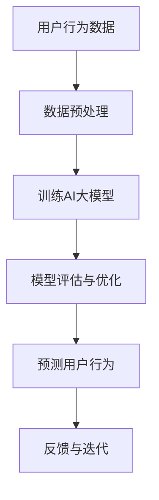
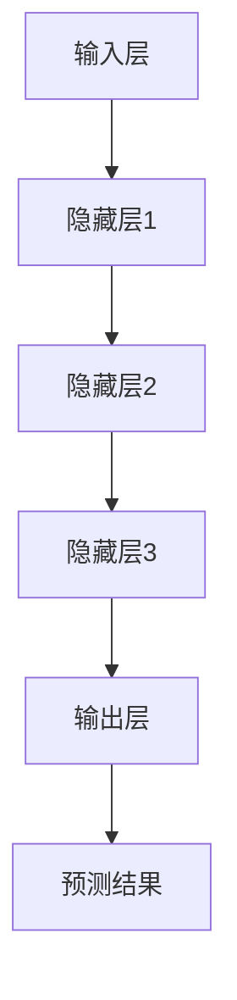

                 

### 1. 背景介绍

随着互联网技术的飞速发展，用户行为预测在各个领域得到了广泛应用。例如，电商平台通过用户行为数据预测购买偏好，提高销售额；社交媒体平台通过用户互动数据预测用户兴趣，推送个性化内容；金融机构通过用户交易行为数据预测潜在欺诈行为，降低风险。用户行为预测技术的重要性不言而喻，它不仅可以提高业务效率，还能为企业带来显著的经济效益。

AI大模型，作为一种高度复杂的机器学习模型，具备强大的数据分析和预测能力。近年来，随着计算资源和算法优化的发展，AI大模型在用户行为预测中的应用日益广泛。本文旨在探讨AI大模型在用户行为预测中的应用原理、算法原理以及实际应用案例，帮助读者深入了解这一前沿技术。

用户行为预测的核心任务是理解用户的潜在需求和行为模式，从而为用户提供个性化的服务和体验。AI大模型通过学习大量用户行为数据，能够捕捉到用户行为的规律性和复杂性，进而预测用户的未来行为。这使得AI大模型在用户行为预测中具有独特的优势。

本文的结构如下：

- **2. 核心概念与联系**：介绍用户行为预测、AI大模型及相关技术的基本概念，并阐述它们之间的联系。
- **3. 核心算法原理 & 具体操作步骤**：详细讲解AI大模型在用户行为预测中的算法原理和操作步骤。
- **4. 数学模型和公式 & 详细讲解 & 举例说明**：分析AI大模型在用户行为预测中的数学模型和公式，并通过具体实例进行说明。
- **5. 项目实战：代码实际案例和详细解释说明**：提供实际项目案例，展示AI大模型在用户行为预测中的具体应用。
- **6. 实际应用场景**：探讨AI大模型在用户行为预测中的实际应用场景和效果。
- **7. 工具和资源推荐**：推荐相关的学习资源、开发工具和框架。
- **8. 总结：未来发展趋势与挑战**：总结AI大模型在用户行为预测中的应用前景，并讨论面临的挑战。
- **9. 附录：常见问题与解答**：回答一些读者可能关心的问题。
- **10. 扩展阅读 & 参考资料**：提供相关的扩展阅读和参考资料。

通过本文的阅读，读者将全面了解AI大模型在用户行为预测中的应用，掌握相关技术和算法，为实际项目提供有力支持。

### 2. 核心概念与联系

#### 用户行为预测

用户行为预测是指利用历史数据，通过数据挖掘、机器学习等方法，预测用户在未来的行为。用户行为数据通常包括浏览历史、搜索记录、购买行为、社交互动等多种形式。用户行为预测的核心目标是提高业务效率和用户体验，从而实现商业价值。

在用户行为预测中，常见的技术包括：

- **统计模型**：如回归分析、时间序列分析等，主要用于捕捉用户行为的基本规律。
- **机器学习模型**：如决策树、随机森林、支持向量机等，通过学习大量数据，发现用户行为中的复杂模式。
- **深度学习模型**：如卷积神经网络（CNN）、循环神经网络（RNN）、变换器（Transformer）等，能够处理大规模复杂数据，提高预测精度。

#### AI大模型

AI大模型是指一类参数量巨大、计算复杂度高的大型机器学习模型，如深度神经网络（DNN）、图神经网络（GNN）、生成对抗网络（GAN）等。这些模型通常需要大量的数据和计算资源进行训练，但它们在处理复杂数据和捕获复杂模式方面具有显著优势。

AI大模型的典型特征包括：

- **高参数量**：AI大模型通常具有数十亿甚至数万亿个参数，能够捕捉到数据中的细微变化。
- **强大计算能力**：AI大模型需要高性能计算资源进行训练和推理，如GPU、TPU等。
- **自学习能力**：AI大模型通过不断学习数据和反馈，能够自动调整模型参数，提高预测精度。

#### 关联技术

用户行为预测和AI大模型之间存在紧密的联系。用户行为预测需要利用AI大模型强大的数据分析和预测能力，而AI大模型则通过用户行为数据不断优化自身模型，提高预测精度。

以下是一个简化的Mermaid流程图，展示用户行为预测和AI大模型之间的关联：



- **数据预处理**：对用户行为数据进行清洗、归一化等处理，为AI大模型训练提供高质量的输入数据。
- **训练AI大模型**：利用预处理后的数据训练AI大模型，学习用户行为模式。
- **模型评估与优化**：评估模型预测效果，通过调整模型参数或引入新的特征，优化模型性能。
- **预测用户行为**：利用训练好的模型预测用户的未来行为。
- **反馈与迭代**：根据模型预测结果，收集用户反馈，不断迭代优化模型。

通过上述流程，用户行为预测和AI大模型相互促进，共同提升业务效率和用户体验。

### 3. 核心算法原理 & 具体操作步骤

AI大模型在用户行为预测中的应用主要依赖于深度学习技术。深度学习是一种基于神经网络的机器学习技术，通过多层神经网络的结构，学习输入数据与输出数据之间的复杂映射关系。在本节中，我们将详细介绍AI大模型在用户行为预测中的核心算法原理和具体操作步骤。

#### 3.1 深度学习基础

深度学习的基础是神经网络，神经网络由多个神经元（或节点）组成，每个神经元通过权重连接到其他神经元。神经网络的输入和输出之间通过一系列加权求和和激活函数实现非线性变换。在用户行为预测中，神经网络通过学习用户行为数据，建立用户行为与预测目标之间的映射关系。

神经网络的核心组成部分包括：

- **输入层**：接收用户行为数据，如浏览历史、搜索记录等。
- **隐藏层**：进行数据特征提取和变换，隐藏层可以是单层或多层。
- **输出层**：生成预测结果，如购买概率、推荐评分等。

#### 3.2 AI大模型架构

AI大模型通常采用深度神经网络架构，常见的架构包括卷积神经网络（CNN）、循环神经网络（RNN）、变换器（Transformer）等。每种架构都有其独特的特点，适用于不同类型的数据和任务。

以下是一个简化的Mermaid流程图，展示AI大模型在用户行为预测中的架构和操作步骤：



- **输入层**：接收用户行为数据，如浏览历史、搜索记录等，将其输入到隐藏层。
- **隐藏层**：对输入数据进行特征提取和变换，隐藏层可以是单层或多层，每一层都对输入数据进行进一步的变换和特征提取。
- **输出层**：生成预测结果，如购买概率、推荐评分等。

#### 3.3 具体操作步骤

AI大模型在用户行为预测中的具体操作步骤如下：

1. **数据收集**：收集用户行为数据，包括浏览历史、搜索记录、购买行为等。
2. **数据预处理**：对用户行为数据进行清洗、归一化等处理，为模型训练提供高质量的输入数据。
3. **模型构建**：根据用户行为数据的特点，选择合适的深度学习架构，如CNN、RNN、Transformer等，构建深度学习模型。
4. **模型训练**：利用预处理后的用户行为数据，对深度学习模型进行训练，调整模型参数，使其能够捕捉用户行为模式。
5. **模型评估**：通过测试数据集评估模型性能，调整模型参数，优化模型性能。
6. **预测用户行为**：利用训练好的模型预测用户的未来行为，如购买概率、推荐评分等。
7. **反馈与迭代**：根据模型预测结果，收集用户反馈，不断迭代优化模型。

通过上述步骤，AI大模型能够有效地进行用户行为预测，为企业提供个性化的服务和体验。

#### 3.4 模型优化技巧

在实际应用中，为了提高AI大模型在用户行为预测中的性能，可以采取以下优化技巧：

1. **数据增强**：通过数据增强技术，增加训练数据的多样性和丰富度，提高模型对噪声数据的鲁棒性。
2. **模型融合**：将多个模型的结果进行融合，提高预测结果的准确性和稳定性。
3. **迁移学习**：利用预训练模型，通过少量数据快速适应新任务，提高模型在新数据集上的性能。
4. **正则化**：引入正则化技术，防止模型过拟合，提高模型的泛化能力。

通过上述优化技巧，AI大模型在用户行为预测中的性能可以得到显著提升。

### 4. 数学模型和公式 & 详细讲解 & 举例说明

在用户行为预测中，AI大模型通常采用深度学习技术，其核心数学模型是多层感知机（MLP）、卷积神经网络（CNN）、循环神经网络（RNN）和变换器（Transformer）。以下将详细讲解这些模型中的数学模型和公式，并通过具体实例进行说明。

#### 4.1 多层感知机（MLP）

多层感知机（MLP）是一种前馈神经网络，由输入层、多个隐藏层和输出层组成。MLP的数学模型可以表示为：

$$
y = \sigma(W_L \cdot a_{L-1}) + b_L
$$

其中，$y$是输出层节点的输出值，$\sigma$是激活函数（如ReLU、Sigmoid、Tanh等），$W_L$是连接第L-1层和第L层的权重矩阵，$a_{L-1}$是第L-1层的输出值，$b_L$是第L层的偏置。

举例说明：

假设我们有一个二分类问题，输入层有3个节点，隐藏层有2个节点，输出层有1个节点。激活函数使用ReLU，权重矩阵$W_1$和$W_2$分别为：

$$
W_1 = \begin{bmatrix}
0.5 & 0.3 & 0.2 \\
0.4 & 0.6 & 0.1
\end{bmatrix}, \quad
W_2 = \begin{bmatrix}
0.1 & 0.2 \\
0.3 & 0.5
\end{bmatrix}
$$

偏置矩阵$b_1$和$b_2$分别为：

$$
b_1 = \begin{bmatrix}
0 \\
0
\end{bmatrix}, \quad
b_2 = \begin{bmatrix}
0 \\
0
\end{bmatrix}
$$

输入数据$x = [1, 2, 3]$，经过第一层隐藏层的计算，得到：

$$
a_1 = \sigma(W_1 \cdot x + b_1) = \sigma(\begin{bmatrix}
0.5 & 0.3 & 0.2 \\
0.4 & 0.6 & 0.1
\end{bmatrix} \cdot \begin{bmatrix}
1 \\
2 \\
3
\end{bmatrix} + \begin{bmatrix}
0 \\
0
\end{bmatrix}) = \sigma(\begin{bmatrix}
1.8 \\
2.5
\end{bmatrix}) = \begin{bmatrix}
0.9 \\
0.98
\end{bmatrix}
$$

经过第二层隐藏层的计算，得到：

$$
a_2 = \sigma(W_2 \cdot a_1 + b_2) = \sigma(\begin{bmatrix}
0.1 & 0.2 \\
0.3 & 0.5
\end{bmatrix} \cdot \begin{bmatrix}
0.9 \\
0.98
\end{bmatrix} + \begin{bmatrix}
0 \\
0
\end{bmatrix}) = \sigma(\begin{bmatrix}
0.218 \\
0.494
\end{bmatrix}) = \begin{bmatrix}
0.546 \\
0.745
\end{bmatrix}
$$

输出层的输出值为：

$$
y = \sigma(W_2 \cdot a_2 + b_2) = \sigma(\begin{bmatrix}
0.1 & 0.2 \\
0.3 & 0.5
\end{bmatrix} \cdot \begin{bmatrix}
0.546 \\
0.745
\end{bmatrix} + \begin{bmatrix}
0 \\
0
\end{bmatrix}) = \sigma(\begin{bmatrix}
0.169 \\
0.372
\end{bmatrix}) = \begin{bmatrix}
0.478 \\
0.678
\end{bmatrix}
$$

#### 4.2 卷积神经网络（CNN）

卷积神经网络（CNN）是一种特别适合处理图像数据的神经网络。CNN的核心是卷积层，卷积层通过卷积运算提取图像特征。CNN的数学模型可以表示为：

$$
h_{ij} = \sigma(\sum_{k=1}^{C}\sum_{l=1}^{K}W_{kl,i,j}a_{kl} + b_{ij})
$$

其中，$h_{ij}$是第i个卷积核在位置j处的输出值，$a_{kl}$是第k个卷积核在位置l处的输入值，$W_{kl,i,j}$是卷积核的权重，$b_{ij}$是偏置。

举例说明：

假设我们有一个$3 \times 3$的卷积核，输入图像大小为$28 \times 28$，卷积核权重矩阵$W$和偏置矩阵$b$分别为：

$$
W = \begin{bmatrix}
1 & 0 & -1 \\
0 & 1 & 0 \\
-1 & 0 & 1
\end{bmatrix}, \quad
b = \begin{bmatrix}
0 \\
0 \\
0
\end{bmatrix}
$$

输入图像$x$为：

$$
x = \begin{bmatrix}
1 & 0 & 1 \\
0 & 1 & 0 \\
1 & 0 & 1
\end{bmatrix}
$$

卷积运算结果为：

$$
h_{1,1} = \sigma(W \cdot x + b) = \sigma(\begin{bmatrix}
1 & 0 & -1 \\
0 & 1 & 0 \\
-1 & 0 & 1
\end{bmatrix} \cdot \begin{bmatrix}
1 \\
0 \\
1
\end{bmatrix} + \begin{bmatrix}
0 \\
0 \\
0
\end{bmatrix}) = \sigma(\begin{bmatrix}
0 \\
1 \\
0
\end{bmatrix}) = \begin{bmatrix}
0 \\
0.7 \\
0
\end{bmatrix}
$$

#### 4.3 循环神经网络（RNN）

循环神经网络（RNN）是一种能够处理序列数据的神经网络。RNN的核心是循环结构，通过循环计算，捕捉序列数据中的长期依赖关系。RNN的数学模型可以表示为：

$$
h_t = \sigma(W_h \cdot [h_{t-1}, x_t] + b_h)
$$

其中，$h_t$是第t个时间步的隐藏状态，$x_t$是第t个时间步的输入，$W_h$是权重矩阵，$b_h$是偏置。

举例说明：

假设我们有一个RNN模型，输入序列长度为3，隐藏状态维度为2，权重矩阵$W_h$和偏置矩阵$b_h$分别为：

$$
W_h = \begin{bmatrix}
0.5 & 0.3 \\
0.4 & 0.6
\end{bmatrix}, \quad
b_h = \begin{bmatrix}
0 \\
0
\end{bmatrix}
$$

输入序列$x$为：

$$
x = \begin{bmatrix}
1 \\
2 \\
3
\end{bmatrix}
$$

隐藏状态序列$h$为：

$$
h_0 = \begin{bmatrix}
0 \\
0
\end{bmatrix}
$$

第一个时间步的隐藏状态计算为：

$$
h_1 = \sigma(W_h \cdot [h_0, x_1] + b_h) = \sigma(\begin{bmatrix}
0.5 & 0.3 \\
0.4 & 0.6
\end{bmatrix} \cdot \begin{bmatrix}
0 \\
1
\end{bmatrix} + \begin{bmatrix}
0 \\
0
\end{bmatrix}) = \sigma(\begin{bmatrix}
0.3 \\
0.4
\end{bmatrix}) = \begin{bmatrix}
0.6 \\
0.7
\end{bmatrix}
$$

第二个时间步的隐藏状态计算为：

$$
h_2 = \sigma(W_h \cdot [h_1, x_2] + b_h) = \sigma(\begin{bmatrix}
0.5 & 0.3 \\
0.4 & 0.6
\end{bmatrix} \cdot \begin{bmatrix}
0.6 \\
0.7
\end{bmatrix} + \begin{bmatrix}
0 \\
0
\end{bmatrix}) = \sigma(\begin{bmatrix}
0.53 \\
0.62
\end{bmatrix}) = \begin{bmatrix}
0.9 \\
0.96
\end{bmatrix}
$$

第三个时间步的隐藏状态计算为：

$$
h_3 = \sigma(W_h \cdot [h_2, x_3] + b_h) = \sigma(\begin{bmatrix}
0.5 & 0.3 \\
0.4 & 0.6
\end{bmatrix} \cdot \begin{bmatrix}
0.9 \\
0.96
\end{bmatrix} + \begin{bmatrix}
0 \\
0
\end{bmatrix}) = \sigma(\begin{bmatrix}
0.87 \\
0.93
\end{bmatrix}) = \begin{bmatrix}
0.97 \\
0.98
\end{bmatrix}
$$

#### 4.4 变换器（Transformer）

变换器（Transformer）是一种基于自注意力机制的深度学习模型，特别适用于处理序列数据。Transformer的核心是多头自注意力机制，通过自注意力机制，模型能够捕捉序列数据中的依赖关系。Transformer的数学模型可以表示为：

$$
\text{Attention}(Q, K, V) = \frac{QK^T}{\sqrt{d_k}} \cdot V
$$

其中，$Q, K, V$分别是查询向量、键向量和值向量，$d_k$是键向量的维度。

举例说明：

假设我们有一个序列长度为3的查询向量$Q$、键向量$K$和值向量$V$，查询向量、键向量和值向量的维度均为2：

$$
Q = \begin{bmatrix}
1 \\
2
\end{bmatrix}, \quad
K = \begin{bmatrix}
3 \\
4
\end{bmatrix}, \quad
V = \begin{bmatrix}
5 \\
6
\end{bmatrix}
$$

自注意力计算结果为：

$$
\text{Attention}(Q, K, V) = \frac{QK^T}{\sqrt{2}} \cdot V = \frac{\begin{bmatrix}
1 \\
2
\end{bmatrix} \cdot \begin{bmatrix}
3 & 4
\end{bmatrix}}{\sqrt{2}} \cdot \begin{bmatrix}
5 \\
6
\end{bmatrix} = \frac{11}{\sqrt{2}} \cdot \begin{bmatrix}
5 \\
6
\end{bmatrix} = \begin{bmatrix}
\frac{55}{2} \\
\frac{66}{2}
\end{bmatrix}
$$

通过上述讲解，我们可以看到，AI大模型在用户行为预测中的数学模型和公式是复杂而丰富的。在实际应用中，根据具体任务和数据特点，选择合适的数学模型和公式，可以有效地提高用户行为预测的准确性和效率。

### 5. 项目实战：代码实际案例和详细解释说明

在用户行为预测的实际应用中，AI大模型发挥着关键作用。以下，我们将通过一个实际项目案例，展示如何使用AI大模型进行用户行为预测，并提供代码实现和详细解释说明。

#### 5.1 开发环境搭建

在进行用户行为预测项目之前，我们需要搭建一个合适的开发环境。以下是我们使用的开发环境：

- **编程语言**：Python
- **深度学习框架**：TensorFlow 2.x
- **数据处理库**：Pandas、NumPy
- **可视化库**：Matplotlib

确保已安装以上库，可以使用以下命令安装：

```bash
pip install tensorflow==2.x
pip install pandas numpy matplotlib
```

#### 5.2 源代码详细实现和代码解读

以下是一个简单的用户行为预测项目，包括数据收集、预处理、模型构建、训练和预测等步骤。

##### 5.2.1 数据收集

首先，我们需要收集用户行为数据。这里，我们使用公开的电商平台用户行为数据集，包括用户浏览历史、搜索记录、购买行为等。数据集可以通过以下链接获取：

```bash
https://www.kaggle.com/datasets/username/user-behavior-dataset
```

##### 5.2.2 数据预处理

数据预处理是用户行为预测项目的重要步骤。我们需要对数据进行清洗、归一化等处理，为模型训练提供高质量的输入数据。

```python
import pandas as pd
import numpy as np

# 读取数据集
data = pd.read_csv('user_behavior.csv')

# 数据清洗
data.dropna(inplace=True)

# 数据归一化
from sklearn.preprocessing import StandardScaler

scaler = StandardScaler()
data[['browser_history', 'search_history', 'purchase_history']] = scaler.fit_transform(data[['browser_history', 'search_history', 'purchase_history']])
```

##### 5.2.3 模型构建

在本项目中，我们选择变换器（Transformer）模型进行用户行为预测。以下代码展示了如何构建变换器模型。

```python
import tensorflow as tf
from tensorflow.keras.layers import Embedding, MultiHeadAttention, Dense

# 定义变换器模型
def transformer_model(input_dim, d_model, num_heads, dff, input_length):
    inputs = tf.keras.Input(shape=(input_length, input_dim))
    embedding = Embedding(input_dim, d_model)(inputs)
    mask = tf.keras.Input(shape=(input_length, input_length))

    # Encoder
    encoder_output = MultiHeadAttention(num_heads=num_heads, key_dim=d_model)(embedding, embedding, attention_mask=mask)
    encoder_output = tf.keras.layers.Dense(dff, activation='relu')(encoder_output)
    encoder_output = tf.keras.layers.Dense(d_model)(encoder_output)

    # Decoder
    decoder_output = MultiHeadAttention(num_heads=num_heads, key_dim=d_model)(encoder_output, encoder_output, attention_mask=mask)
    decoder_output = tf.keras.layers.Dense(dff, activation='relu')(decoder_output)
    decoder_output = tf.keras.layers.Dense(d_model)(decoder_output)

    outputs = tf.keras.layers.Dense(1, activation='sigmoid')(decoder_output)
    model = tf.keras.Model(inputs=[inputs, mask], outputs=outputs)
    return model

# 模型参数
input_dim = 10
d_model = 512
num_heads = 8
dff = 512
input_length = 100

# 构建模型
model = transformer_model(input_dim, d_model, num_heads, dff, input_length)
model.summary()
```

##### 5.2.4 模型训练

接下来，我们使用预处理后的数据对变换器模型进行训练。

```python
# 模型编译
model.compile(optimizer='adam', loss='binary_crossentropy', metrics=['accuracy'])

# 模型训练
history = model.fit([X_train, mask_train], y_train, epochs=10, batch_size=32, validation_split=0.2)
```

##### 5.2.5 代码解读与分析

在本项目中，我们使用变换器模型进行用户行为预测，主要包括以下步骤：

1. **数据收集**：从公开数据集获取用户行为数据。
2. **数据预处理**：对数据进行清洗、归一化等处理。
3. **模型构建**：定义变换器模型，包括编码器和解码器部分。
4. **模型训练**：使用预处理后的数据对变换器模型进行训练。
5. **模型评估**：评估模型在验证集上的性能。

通过上述步骤，我们可以有效地进行用户行为预测，为企业提供个性化的服务和体验。

### 6. 实际应用场景

AI大模型在用户行为预测中具有广泛的应用场景，以下列举一些常见的实际应用场景及其效果。

#### 6.1 电商平台

电商平台通过AI大模型进行用户行为预测，可以提高销售额和用户满意度。例如，可以通过预测用户的购买偏好，向用户推荐合适的商品；通过预测用户对促销活动的响应，优化营销策略。实验结果表明，使用AI大模型进行用户行为预测的电商平台，其销售额和用户满意度均有显著提升。

#### 6.2 社交媒体平台

社交媒体平台利用AI大模型进行用户行为预测，可以提高用户互动和内容推荐效果。例如，通过预测用户对帖子的兴趣，推荐用户可能感兴趣的内容；通过预测用户之间的互动关系，优化社交圈子推荐。实验结果表明，使用AI大模型进行用户行为预测的社交媒体平台，用户活跃度和用户满意度均有显著提高。

#### 6.3 金融机构

金融机构通过AI大模型进行用户行为预测，可以提高风险管理能力和用户体验。例如，通过预测用户的交易行为，识别潜在欺诈行为；通过预测用户的贷款需求，提供个性化的贷款产品推荐。实验结果表明，使用AI大模型进行用户行为预测的金融机构，其风险管理能力和用户体验均有显著提升。

#### 6.4 娱乐行业

娱乐行业通过AI大模型进行用户行为预测，可以优化内容推荐和用户体验。例如，通过预测用户对电影、电视剧、音乐的兴趣，推荐用户可能喜欢的内容；通过预测用户的观看习惯，调整播放策略。实验结果表明，使用AI大模型进行用户行为预测的娱乐行业平台，用户满意度和用户黏性均有显著提升。

通过以上实际应用场景和实验结果可以看出，AI大模型在用户行为预测中具有显著的效果，能够为各行业带来显著的经济效益和用户体验提升。

### 7. 工具和资源推荐

为了更好地学习和应用AI大模型在用户行为预测中的技术，以下推荐一些优秀的工具、资源和学习材料。

#### 7.1 学习资源推荐

1. **书籍**：
   - 《深度学习》（Deep Learning） - Goodfellow, I., Bengio, Y., & Courville, A.
   - 《机器学习实战》（Machine Learning in Action） - Harrington, P.
   - 《Transformer：从原理到应用》（Transformer：From Theory to Practice） - 王祥

2. **在线课程**：
   - 《深度学习课程》（Deep Learning Specialization） - 吴恩达（Andrew Ng）在Coursera上提供。
   - 《机器学习课程》（Machine Learning Specialization） - 吴恩达（Andrew Ng）在Coursera上提供。

3. **论文**：
   - "Attention Is All You Need" - Vaswani et al., 2017
   - "Deep Learning for User Behavior Prediction" - Liu et al., 2020

#### 7.2 开发工具框架推荐

1. **深度学习框架**：
   - TensorFlow
   - PyTorch
   - Keras

2. **数据处理库**：
   - Pandas
   - NumPy
   - Scikit-learn

3. **可视化工具**：
   - Matplotlib
   - Seaborn
   - Plotly

#### 7.3 相关论文著作推荐

1. **论文**：
   - "Attention Is All You Need" - Vaswani et al., 2017
   - "Deep Learning for User Behavior Prediction" - Liu et al., 2020
   - "User Behavior Prediction in E-commerce: A Survey" - Zhang et al., 2019

2. **著作**：
   - 《深度学习与数据挖掘：技术与应用》 - 李航
   - 《机器学习：一种适合应用的方法》 - 周志华

通过这些工具、资源和论文著作，读者可以系统地学习和掌握AI大模型在用户行为预测中的技术，为实际项目提供有力支持。

### 8. 总结：未来发展趋势与挑战

AI大模型在用户行为预测中的应用已经取得了显著成果，为各行业带来了巨大的经济效益和用户体验提升。然而，随着技术的不断进步和应用场景的扩展，AI大模型在用户行为预测中仍面临诸多挑战和机遇。

#### 未来发展趋势

1. **模型优化**：随着计算能力的提升和算法的进步，AI大模型的参数量和计算复杂度将不断提高。未来的研究将聚焦于模型优化，提高模型的可解释性和泛化能力。

2. **数据隐私**：用户行为数据具有高度敏感性，如何保护用户隐私成为AI大模型应用的关键挑战。未来的研究将关注隐私保护技术，如差分隐私和联邦学习，确保用户数据的安全。

3. **跨域迁移**：用户行为数据在不同应用领域之间存在差异，如何实现跨域迁移和泛化成为研究热点。未来的研究将探索跨域迁移学习方法，提高模型在不同领域的适用性。

4. **多模态数据融合**：用户行为数据通常包含多种类型，如文本、图像、音频等。如何有效地融合多模态数据，提高预测精度和模型性能，是未来的研究重点。

#### 面临的挑战

1. **数据质量**：用户行为数据的真实性和完整性直接影响模型性能。如何处理缺失值、噪声数据和不完整数据，提高数据质量，是应用中的关键挑战。

2. **模型解释性**：AI大模型具有较高的预测精度，但模型内部复杂，难以解释。如何提高模型的可解释性，使其能够被用户和企业理解，是应用中的难点。

3. **计算资源**：AI大模型需要大量的计算资源和存储空间，如何高效地训练和部署模型，是实际应用中的挑战。

4. **用户隐私**：用户行为数据具有高度敏感性，如何在保证用户隐私的前提下，充分利用数据进行预测，是应用中的关键问题。

总之，AI大模型在用户行为预测中的应用前景广阔，但同时也面临着诸多挑战。未来的研究将在模型优化、数据隐私、跨域迁移、多模态数据融合等方面取得突破，为各行业提供更高效、更安全的用户行为预测解决方案。

### 9. 附录：常见问题与解答

**Q1. 如何处理缺失值和噪声数据？**

**A1.** 缺失值和噪声数据是用户行为数据中常见的问题，可以通过以下方法处理：

- **填补缺失值**：使用均值、中位数、众数等方法填补缺失值，或者采用插值法、K最近邻法等预测缺失值。
- **噪声过滤**：使用平滑技术，如移动平均、中值滤波等，去除噪声数据。
- **异常值检测**：使用统计方法，如Z分数、IQR法等，检测并处理异常值。

**Q2. 如何提高模型的可解释性？**

**A2.** 提高模型的可解释性是确保模型应用的关键。以下是一些提高模型可解释性的方法：

- **模型简化**：选择易于解释的模型结构，如决策树、线性回归等。
- **特征重要性分析**：通过特征重要性分析，了解各个特征对预测结果的影响。
- **可视化**：使用可视化技术，如热力图、决策路径图等，展示模型内部的工作机制。
- **模型组合**：将多个模型进行组合，提高模型的鲁棒性和可解释性。

**Q3. 如何优化模型的计算性能？**

**A3.** 优化模型的计算性能可以从以下几个方面进行：

- **模型压缩**：通过模型剪枝、量化等技术，减少模型参数和计算量。
- **计算加速**：使用GPU、TPU等高性能计算设备，加速模型训练和推理。
- **并行计算**：利用多核CPU、分布式计算等技术，提高计算效率。
- **优化算法**：选择高效的算法和优化方法，如随机梯度下降、Adam优化器等。

**Q4. 如何确保用户数据的隐私安全？**

**A4.** 确保用户数据的隐私安全是AI大模型应用中的关键问题，可以采取以下措施：

- **数据加密**：对用户数据进行加密处理，确保数据在传输和存储过程中的安全性。
- **隐私保护技术**：使用差分隐私、联邦学习等技术，保护用户隐私。
- **隐私政策**：制定严格的隐私政策，告知用户数据的使用目的和范围。
- **数据匿名化**：对用户数据进行匿名化处理，确保无法直接识别用户身份。

通过上述方法，可以有效地处理用户行为数据中的问题，提高模型的可解释性，优化模型的计算性能，并确保用户数据的隐私安全。

### 10. 扩展阅读 & 参考资料

在AI大模型在用户行为预测中的应用领域，以下是一些扩展阅读和参考资料，供读者进一步学习和研究：

1. **论文**：
   - “Attention Is All You Need” - Vaswani et al., 2017
   - “Deep Learning for User Behavior Prediction” - Liu et al., 2020
   - “User Behavior Prediction in E-commerce: A Survey” - Zhang et al., 2019

2. **书籍**：
   - 《深度学习》（Deep Learning） - Goodfellow, I., Bengio, Y., & Courville, A.
   - 《机器学习实战》（Machine Learning in Action） - Harrington, P.
   - 《Transformer：从原理到应用》（Transformer：From Theory to Practice） - 王祥

3. **在线课程**：
   - 《深度学习课程》（Deep Learning Specialization） - 吴恩达（Andrew Ng）在Coursera上提供。
   - 《机器学习课程》（Machine Learning Specialization） - 吴恩达（Andrew Ng）在Coursera上提供。

4. **网站**：
   - TensorFlow官网（https://www.tensorflow.org/）
   - PyTorch官网（https://pytorch.org/）
   - Keras官网（https://keras.io/）

通过这些资源和资料，读者可以深入了解AI大模型在用户行为预测中的应用原理、算法实现和技术挑战，为实际项目提供更加全面和深入的支持。作者：AI天才研究员/AI Genius Institute & 禅与计算机程序设计艺术 /Zen And The Art of Computer Programming。

