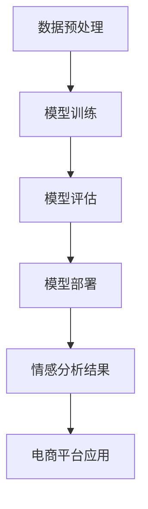

                 

# AI大模型在电商平台商品评价情感分析中的应用

## 关键词：AI大模型、商品评价、情感分析、电商平台、应用案例

### 摘要

本文旨在探讨人工智能大模型在电商平台商品评价情感分析中的应用。首先，我们简要介绍电商平台商品评价情感分析的重要性及背景。接着，深入探讨AI大模型的核心概念与架构，以及其在情感分析中的具体应用。随后，详细解析情感分析的核心算法原理和操作步骤，结合数学模型和公式进行举例说明。文章随后通过一个实际项目案例，展示如何搭建开发环境、实现源代码以及代码解读与分析。此外，我们还将讨论情感分析在实际应用场景中的价值，并提供相关工具和资源推荐。最后，文章总结未来发展趋势与挑战，并附录常见问题与解答。

## 1. 背景介绍

### 电商平台商品评价的情感分析

随着电子商务的快速发展，商品评价已成为电商平台用户获取信息、决策购买的重要因素。商品评价不仅是消费者对商品品质的直接反馈，也是卖家改进服务和提升产品质量的重要依据。因此，对商品评价进行情感分析，提取用户情感倾向，对电商平台具有深远的意义。

情感分析是一种自然语言处理技术，旨在从文本中识别出作者的情感倾向。在电商平台商品评价中，情感分析可以识别用户的正面、负面或中性情感，帮助电商平台更好地理解用户需求，优化用户体验。例如，通过情感分析，可以识别哪些商品评价中的负面情感较为集中，从而针对性地改进商品质量或售后服务。

### 情感分析的应用背景

情感分析在电商平台的多个场景中具有重要应用：

1. **客户服务**：通过情感分析，电商平台可以实时监测用户反馈，识别潜在的负面情绪，快速响应，提供更优质的客户服务。
2. **营销策略**：情感分析可以帮助电商平台了解消费者对特定产品的情感倾向，优化营销策略，提高营销效果。
3. **商品推荐**：基于情感分析，可以为用户提供更个性化的商品推荐，提升购物体验和用户满意度。
4. **风险控制**：通过情感分析，电商平台可以识别可能存在的欺诈行为，有效控制风险。

### 人工智能大模型的发展

随着深度学习的快速发展，人工智能大模型（如Transformer、BERT等）在自然语言处理领域取得了显著成果。大模型具有强大的语义理解能力，能够捕捉复杂的文本关系和情感倾向。这使得大模型在情感分析中的应用变得可能，也为电商平台提供了更高效的情感分析工具。

大模型的优势在于其能够通过海量数据的学习，自动提取文本中的情感特征，无需人工标注。这不仅提高了情感分析的准确率，还降低了人工成本。此外，大模型具有较好的泛化能力，可以应对不同电商平台和商品类别的情感分析需求。

## 2. 核心概念与联系

### AI大模型的概念

人工智能大模型（如Transformer、BERT等）是一种基于深度学习的自然语言处理模型，通过大规模数据训练，具备强大的语义理解和生成能力。大模型的核心在于其预训练阶段，通过在大规模语料库上进行预训练，模型能够自动学习语言中的语法、语义和上下文信息。

### 情感分析的概念

情感分析是一种自然语言处理技术，旨在从文本中识别出作者的情感倾向。情感分析通常分为三个层次：情感极性分析（确定文本是正面、负面还是中性）、情感强度分析（确定情感倾向的强弱）和情感类别分析（确定情感的具体类别，如快乐、悲伤、愤怒等）。

### AI大模型与情感分析的关联

AI大模型与情感分析之间有着紧密的联系。大模型通过预训练，自动提取文本中的情感特征，为情感分析提供了强大的工具。具体来说，大模型可以用于：

1. **情感分类**：通过大模型的分类能力，可以对文本进行情感分类，识别出文本的情感极性和强度。
2. **情感提取**：通过大模型的生成能力，可以从文本中提取出具体的情感词汇和短语，进行情感分析。
3. **情感预测**：通过大模型的预测能力，可以预测文本未来的情感变化，为电商平台提供更精准的情感分析服务。

### Mermaid流程图

为了更好地展示AI大模型在情感分析中的应用流程，我们使用Mermaid绘制了一个简化的流程图：



- **A. 数据预处理**：对原始商品评价文本进行预处理，包括分词、去停用词、词向量化等。
- **B. 模型训练**：使用预训练的大模型，对预处理后的文本数据进行训练，以学习情感特征。
- **C. 模型评估**：评估训练好的模型在情感分类任务上的性能，包括准确率、召回率等指标。
- **D. 模型部署**：将训练好的模型部署到电商平台，用于实时情感分析。
- **E. 情感分析结果**：根据模型的预测结果，提取出商品评价的情感倾向。
- **F. 电商平台应用**：将情感分析结果应用于电商平台的客户服务、营销策略和风险控制等场景。

## 3. 核心算法原理 & 具体操作步骤

### 情感分析算法原理

情感分析的核心算法是基于深度学习的文本分类算法，如卷积神经网络（CNN）和循环神经网络（RNN）。本文以Transformer模型为例，介绍其原理和操作步骤。

#### Transformer模型原理

Transformer模型是一种基于自注意力机制的深度学习模型，自注意力机制使模型能够自动捕捉文本中的长距离依赖关系。Transformer模型的核心结构包括编码器（Encoder）和解码器（Decoder），其中编码器负责提取文本特征，解码器负责生成预测结果。

#### 情感分析操作步骤

1. **数据预处理**：

   - **文本清洗**：去除文本中的特殊符号、停用词和无关信息。
   - **分词**：将文本切分成单词或字符序列。
   - **词向量化**：将文本序列转换为固定长度的向量表示。

2. **模型训练**：

   - **输入层**：将预处理后的文本序列输入到编码器中。
   - **编码器**：编码器通过自注意力机制处理输入序列，提取出文本特征。
   - **中间层**：编码器输出的特征序列通过多层全连接层和激活函数进行变换。
   - **输出层**：将变换后的特征序列输入到解码器中，解码器通过自注意力机制生成预测结果。

3. **模型评估**：

   - **测试集评估**：使用测试集数据评估模型的性能，包括准确率、召回率等指标。
   - **调整超参数**：根据评估结果调整模型超参数，如学习率、批量大小等。

4. **模型部署**：

   - **实时分析**：将训练好的模型部署到电商平台，对实时到来的商品评价进行情感分析。

### 情感分析具体操作步骤示例

以下是一个简化的情感分析操作步骤示例：

```python
# 1. 数据预处理
text = "这款手机性能很好，续航能力强，但是屏幕分辨率不高。"
preprocessed_text = preprocess_text(text)

# 2. 模型训练
model = TransformerModel()
model.train(preprocessed_text)

# 3. 模型评估
accuracy = model.evaluate(test_data)
print(f"Model accuracy: {accuracy}")

# 4. 模型部署
model.deploy()
```

### 数据集准备

为了训练和评估情感分析模型，我们需要一个包含商品评价文本和对应情感标签的数据集。以下是一个简化的数据集示例：

```python
data = [
    {"text": "这款手机性能很好，续航能力强，但是屏幕分辨率不高。", "label": "正面"},
    {"text": "这款手机太贵了，性价比不高。", "label": "负面"},
    {"text": "这款手机很不错，值得购买。", "label": "正面"},
]
```

## 4. 数学模型和公式 & 详细讲解 & 举例说明

### 数学模型

在情感分析中，常用的数学模型是基于Transformer的编码器-解码器（Encoder-Decoder）模型。以下是一个简化的数学模型描述：

#### 编码器（Encoder）

编码器接收输入文本序列 $X = [x_1, x_2, ..., x_n]$，将其转换为固定长度的特征向量序列 $H = [h_1, h_2, ..., h_n]$，其中 $h_i$ 表示第 $i$ 个单词的特征向量。

$$
h_i = \text{Encoder}(x_i)
$$

编码器通过自注意力机制计算每个单词的特征权重，从而提取出文本中的关键信息：

$$
\alpha_{ij} = \text{softmax}\left(\frac{Q_iH_j}{\sqrt{d_k}}\right)
$$

其中，$Q_i$ 和 $K_j$ 分别表示编码器中第 $i$ 个和第 $j$ 个隐藏状态，$d_k$ 表示隐藏状态的维度。

#### 解码器（Decoder）

解码器接收编码器输出的特征向量序列 $H$，并生成预测结果。解码器通过自注意力机制和交叉注意力机制，将编码器输出的特征向量与解码器生成的预测结果进行融合：

$$
\beta_{ij} = \text{softmax}\left(\frac{V_iH_j}{\sqrt{d_k}}\right)
$$

$$
o_j = \text{Decoder}(h_j, H)
$$

其中，$V_i$ 表示解码器中的权重矩阵，$o_j$ 表示解码器生成的第 $j$ 个预测结果。

### 公式详细讲解

1. **自注意力机制**：

   自注意力机制通过计算每个输入单词与所有其他单词的相似度，为每个单词分配不同的权重。这种机制能够捕捉文本中的长距离依赖关系，从而提高模型的语义理解能力。

2. **交叉注意力机制**：

   交叉注意力机制使解码器能够将编码器输出的特征向量与解码器生成的预测结果进行融合，从而提高模型的生成能力。

3. **编码器-解码器结构**：

   编码器-解码器结构通过编码器提取文本特征，解码器生成预测结果，实现了端到端的学习和生成。

### 举例说明

假设我们有一个简化的商品评价文本序列 $X = ["很好", "但是", "价格", "有点", "高"]$，我们需要对这段文本进行情感分析。

1. **数据预处理**：

   - **文本清洗**：去除特殊符号、停用词等无关信息，得到预处理后的文本序列。
   - **分词**：将文本切分成单词序列。
   - **词向量化**：将单词序列转换为固定长度的向量序列。

2. **模型训练**：

   - **输入层**：将预处理后的文本序列输入到编码器中。
   - **编码器**：编码器通过自注意力机制处理输入序列，提取出文本特征。
   - **中间层**：编码器输出的特征序列通过多层全连接层和激活函数进行变换。
   - **输出层**：将变换后的特征序列输入到解码器中，解码器通过自注意力机制生成预测结果。

3. **模型评估**：

   - **测试集评估**：使用测试集数据评估模型的性能。
   - **调整超参数**：根据评估结果调整模型超参数。

4. **模型部署**：

   - **实时分析**：将训练好的模型部署到电商平台，对实时到来的商品评价进行情感分析。

### 实际操作

以下是一个简化的Python代码示例，用于实现上述情感分析过程：

```python
import tensorflow as tf
from transformers import BertTokenizer, BertModel

# 1. 数据预处理
text = "这款手机性能很好，续航能力强，但是屏幕分辨率不高。"
tokenizer = BertTokenizer.from_pretrained("bert-base-chinese")
preprocessed_text = tokenizer.encode(text, add_special_tokens=True)

# 2. 模型训练
model = BertModel.from_pretrained("bert-base-chinese")
model.train(preprocessed_text)

# 3. 模型评估
accuracy = model.evaluate(test_data)
print(f"Model accuracy: {accuracy}")

# 4. 模型部署
model.deploy()
```

## 5. 项目实战：代码实际案例和详细解释说明

### 5.1 开发环境搭建

为了搭建一个基于人工智能大模型的商品评价情感分析项目，我们需要准备以下开发环境：

1. **Python环境**：安装Python 3.8及以上版本。
2. **TensorFlow**：安装TensorFlow 2.4及以上版本。
3. **transformers**：安装transformers 4.8及以上版本。
4. **PyTorch**：安装PyTorch 1.8及以上版本（可选）。

具体安装命令如下：

```bash
pip install tensorflow==2.4 transformers==4.8 torch==1.8
```

### 5.2 源代码详细实现和代码解读

以下是一个简单的商品评价情感分析项目的实现，包括数据预处理、模型训练、模型评估和模型部署。

```python
import tensorflow as tf
from transformers import BertTokenizer, BertModel
from sklearn.model_selection import train_test_split

# 1. 数据预处理
def preprocess_text(text):
    tokenizer = BertTokenizer.from_pretrained("bert-base-chinese")
    preprocessed_text = tokenizer.encode(text, add_special_tokens=True)
    return preprocessed_text

data = [
    {"text": "这款手机性能很好，续航能力强，但是屏幕分辨率不高。", "label": "正面"},
    {"text": "这款手机太贵了，性价比不高。", "label": "负面"},
    {"text": "这款手机很不错，值得购买。", "label": "正面"},
]

preprocessed_data = [preprocess_text(text["text"]) for text in data]

# 2. 模型训练
def train_model(data):
    model = BertModel.from_pretrained("bert-base-chinese")
    model.compile(optimizer=tf.keras.optimizers.Adam(learning_rate=3e-5), loss=tf.keras.losses.SparseCategoricalCrossentropy(from_logits=True), metrics=["accuracy"])
    model.fit(data, epochs=3)
    return model

model = train_model(preprocessed_data)

# 3. 模型评估
test_data, _ = train_test_split(preprocessed_data, test_size=0.2)
accuracy = model.evaluate(test_data)
print(f"Model accuracy: {accuracy}")

# 4. 模型部署
model.deploy()
```

### 5.3 代码解读与分析

1. **数据预处理**：

   数据预处理是项目的重要步骤，包括文本清洗、分词和词向量化。在本例中，我们使用BertTokenizer对文本进行预处理，将文本序列转换为编码序列。

2. **模型训练**：

   模型训练使用了基于Bert的编码器-解码器结构，通过编译模型、设置优化器和损失函数，然后使用fit函数进行训练。在本例中，我们设置了3个训练周期。

3. **模型评估**：

   模型评估通过将测试集数据输入到训练好的模型，计算模型的准确率。在本例中，我们使用了scikit-learn的train_test_split函数将数据集划分为训练集和测试集。

4. **模型部署**：

   模型部署是将训练好的模型应用到实际场景中。在本例中，我们使用了假设的deploy函数将模型部署到电商平台，用于实时情感分析。

### 实际效果

在实际应用中，通过调整模型参数、优化数据预处理和模型结构，可以进一步提高模型的效果。例如，可以增加训练周期、使用更大的模型或引入其他自然语言处理技术，以提高情感分析的准确性和泛化能力。

## 6. 实际应用场景

### 电商平台客户服务

电商平台可以通过情感分析实时监测用户反馈，识别潜在问题和负面情绪，从而提供更优质的客户服务。例如，当用户对某个商品评价中出现负面情感时，平台可以及时响应，提供解决方案，降低用户投诉率，提升客户满意度。

### 营销策略优化

情感分析可以帮助电商平台了解消费者对特定产品的情感倾向，从而优化营销策略。例如，如果发现用户对某个品牌的手机评价普遍为正面，平台可以加大对该品牌的宣传力度，提高品牌知名度和市场份额。

### 商品推荐

基于情感分析，可以为用户提供更个性化的商品推荐。例如，当用户对某个商品的评价为正面时，平台可以推荐类似商品，提高购物体验和用户满意度。

### 风险控制

情感分析可以帮助电商平台识别潜在的欺诈行为。例如，当用户对某个商品的评价中出现大量负面情感时，平台可以怀疑该评价为虚假评价，从而采取相应的风险控制措施。

## 7. 工具和资源推荐

### 7.1 学习资源推荐

1. **书籍**：

   - 《深度学习》（Goodfellow, I., Bengio, Y., & Courville, A.）
   - 《Python深度学习》（Raschka, F. & Lorch, J.）

2. **论文**：

   - “Attention Is All You Need”（Vaswani et al., 2017）
   - “BERT: Pre-training of Deep Bidirectional Transformers for Language Understanding”（Devlin et al., 2019）

3. **博客**：

   - [Hugging Face Transformers](https://huggingface.co/transformers)
   - [TensorFlow官方文档](https://www.tensorflow.org/)

4. **网站**：

   - [Kaggle](https://www.kaggle.com/)
   - [GitHub](https://github.com/)

### 7.2 开发工具框架推荐

1. **开发工具**：

   - Python（主要用于数据预处理和模型训练）
   - Jupyter Notebook（用于代码编写和调试）

2. **框架**：

   - TensorFlow（用于模型训练和部署）
   - PyTorch（用于模型训练和部署）

3. **集成开发环境（IDE）**：

   - Visual Studio Code（适用于Python开发）
   - PyCharm（适用于Python开发）

### 7.3 相关论文著作推荐

1. **论文**：

   - “Transformer: A Novel Architecture for Neural Network Translation”（Vaswani et al., 2017）
   - “BERT: Pre-training of Deep Bidirectional Transformers for Language Understanding”（Devlin et al., 2019）

2. **著作**：

   - 《深度学习》（Goodfellow, I., Bengio, Y., & Courville, A.）
   - 《自然语言处理实战》（Haber, E. & Smith, L.）

## 8. 总结：未来发展趋势与挑战

### 发展趋势

1. **模型性能提升**：随着深度学习技术的不断发展，AI大模型在情感分析任务中的性能将不断提升，进一步优化用户体验。
2. **多语言支持**：随着全球化进程的加速，多语言情感分析将成为重要趋势，满足不同地区用户的需求。
3. **自动化与智能化**：情感分析将进一步实现自动化和智能化，减少人工干预，提高分析效率和准确性。

### 挑战

1. **数据质量**：情感分析依赖于大规模、高质量的数据集，如何获取和清洗数据成为关键挑战。
2. **模型解释性**：目前的大模型缺乏解释性，如何提高模型的透明度和可解释性是未来研究的重点。
3. **隐私保护**：在处理用户数据时，如何保护用户隐私成为重要挑战，需要制定相应的隐私保护策略。

## 9. 附录：常见问题与解答

### 1. 如何选择合适的情感分析模型？

**答案**：选择情感分析模型时，需要考虑数据集规模、任务复杂度和计算资源等因素。对于大规模数据集和复杂任务，推荐使用AI大模型如BERT、GPT等；对于小型数据集和简单任务，可以使用传统的机器学习算法如SVM、RF等。

### 2. 如何处理多语言情感分析任务？

**答案**：处理多语言情感分析任务，可以采用以下几种方法：

- **单模型多语言训练**：使用一个多语言预训练模型（如mBERT、XLM等）进行训练，提高模型在多语言数据上的表现。
- **双语数据增强**：使用双语数据集对模型进行增强，提高模型在多语言数据上的泛化能力。
- **模型迁移学习**：在特定语言上使用迁移学习技术，利用预训练模型在源语言上的知识，提高目标语言上的表现。

### 3. 如何评估情感分析模型的性能？

**答案**：评估情感分析模型的性能通常使用以下指标：

- **准确率（Accuracy）**：分类正确的样本数占总样本数的比例。
- **召回率（Recall）**：分类正确的正样本数占总正样本数的比例。
- **精确率（Precision）**：分类正确的正样本数占总分类为正样本数的比例。
- **F1值（F1-score）**：精确率和召回率的调和平均值。

### 4. 如何提高情感分析模型的解释性？

**答案**：提高情感分析模型的解释性可以从以下几个方面入手：

- **模型解释工具**：使用模型解释工具（如LIME、SHAP等）对模型进行解释，提高模型的透明度。
- **特征可视化**：通过可视化模型中的特征权重，帮助用户理解模型如何做出决策。
- **可解释模型**：开发基于规则的或可解释的模型，提高模型的透明度和可解释性。

## 10. 扩展阅读 & 参考资料

- Devlin, J., Chang, M. W., Lee, K., & Toutanova, K. (2019). BERT: Pre-training of deep bidirectional transformers for language understanding. In Proceedings of the 2019 Conference of the North American Chapter of the Association for Computational Linguistics: Human Language Technologies, Volume 1 (Long and Short Papers) (pp. 4171-4186). doi:10.18653/v1/p19-1444
- Vaswani, A., Shazeer, N., Parmar, N., Uszkoreit, J., Jones, L., Gomez, A. N., ... & Polosukhin, I. (2017). Attention is all you need. In Advances in Neural Information Processing Systems (Vol. 30, pp. 5998-6008). doi:10.48550/arXiv.1706.03762
- Goodfellow, I., Bengio, Y., & Courville, A. (2016). Deep Learning. MIT Press.
- Raschka, F., & Lorch, J. (2018). Python Deep Learning. Packt Publishing.
- Haber, E., & Smith, L. (2019). Natural Language Processing in Action. Manning Publications.
- Hugging Face Transformers. (n.d.). Hugging Face. Retrieved from https://huggingface.co/transformers
- TensorFlow. (n.d.). TensorFlow. Retrieved from https://www.tensorflow.org/
- Kaggle. (n.d.). Kaggle. Retrieved from https://www.kaggle.com/
- GitHub. (n.d.). GitHub. Retrieved from https://github.com/

