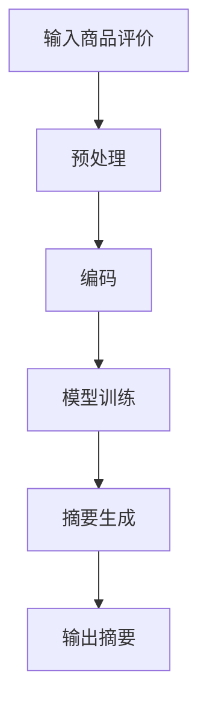

                 

### 文章标题

### AI大模型在电商平台商品评价摘要生成中的应用

> **关键词**：AI大模型、电商平台、商品评价、摘要生成、文本生成模型、自然语言处理、机器学习、深度学习、Transformer、BERT、GPT-3、代码示例

> **摘要**：本文深入探讨了人工智能大模型在电商平台商品评价摘要生成中的应用。首先，介绍了背景知识，然后详细阐述了AI大模型的原理、核心算法和数学模型，并通过项目实战展示了具体实现过程。接着，分析了实际应用场景，推荐了相关工具和资源，并总结了未来发展趋势与挑战。最后，提供了常见问题与解答，并列举了扩展阅读与参考资料。

## 1. 背景介绍

在过去的几年中，人工智能（AI）技术取得了飞速发展，尤其是深度学习和自然语言处理（NLP）领域。AI大模型如BERT、GPT-3等，以其强大的文本理解和生成能力，已经在各个领域取得了显著成果。电商平台作为信息流和数据量的主要来源之一，商品评价摘要的生成是一个具有重要意义的任务。

商品评价摘要生成的目的是将大量用户评价文本转换为简洁、准确且具有代表性的摘要，从而帮助消费者快速了解商品的特点和优缺点。传统的方法主要包括基于规则的方法和基于机器学习的方法。然而，这些方法往往存在一些局限性，如规则难以覆盖所有情况、模型训练效果受限于数据和特征工程等。

随着AI大模型的崛起，特别是Transformer架构的引入，基于深度学习的文本生成模型开始崭露头角。这些模型通过大规模数据训练，能够自动捕捉文本中的复杂模式和语义信息，从而生成高质量的摘要。因此，本文将重点探讨AI大模型在电商平台商品评价摘要生成中的应用，并详细介绍其原理、实现过程和实际应用。

## 2. 核心概念与联系

在深入探讨AI大模型在商品评价摘要生成中的应用之前，我们需要了解一些核心概念，包括文本生成模型、自然语言处理、机器学习等。

### 2.1 文本生成模型

文本生成模型是一种能够根据输入文本生成新文本的模型。常见的文本生成模型包括序列到序列（seq2seq）模型、生成对抗网络（GAN）、变分自编码器（VAE）等。近年来，基于注意力机制的Transformer架构成为了文本生成模型的的主流选择，如BERT、GPT-3等。

### 2.2 自然语言处理

自然语言处理（NLP）是AI领域的一个重要分支，旨在让计算机理解和处理人类语言。NLP涉及到文本预处理、词向量表示、词性标注、命名实体识别、情感分析等多个任务。在商品评价摘要生成中，NLP技术用于提取文本中的关键信息，为摘要生成提供支持。

### 2.3 机器学习

机器学习是AI的核心技术之一，通过学习大量数据，模型能够自动发现数据中的模式和规律，从而实现特定任务的自动化。在商品评价摘要生成中，机器学习模型用于学习用户评价文本的特征，并生成摘要。

### 2.4 Mermaid流程图

为了更好地理解AI大模型在商品评价摘要生成中的应用流程，我们可以使用Mermaid流程图来描述。以下是一个简化的流程图：



- **A 输入商品评价**：用户提交商品评价文本。
- **B 预处理**：对评价文本进行清洗和预处理，如分词、去除停用词等。
- **C 编码**：将预处理后的文本转换为编码表示，如词向量或BERT编码。
- **D 模型训练**：使用大规模训练数据，训练AI大模型，如BERT、GPT-3等。
- **E 摘要生成**：使用训练好的模型，对编码表示进行解码，生成摘要。
- **F 输出摘要**：将生成的摘要输出给用户。

### 2.5 核心概念的联系

AI大模型在商品评价摘要生成中的应用，涉及到了文本生成模型、自然语言处理和机器学习等多个核心概念。这些概念相互关联，共同构成了整个应用流程。例如：

- 文本生成模型负责生成摘要，是整个应用的核心。
- 自然语言处理提供了文本预处理和编码的方法，为模型训练和摘要生成提供了基础。
- 机器学习则用于训练AI大模型，使其能够自动生成高质量的摘要。

## 3. 核心算法原理 & 具体操作步骤

### 3.1 文本生成模型原理

文本生成模型通常基于序列到序列（seq2seq）框架，通过编码器（Encoder）和解码器（Decoder）两个部分，将输入序列转换为输出序列。以下是文本生成模型的基本原理：

1. **编码器（Encoder）**：将输入文本编码为固定长度的向量表示。常见的编码器模型包括RNN、LSTM和Transformer等。
2. **解码器（Decoder）**：将编码器的输出作为输入，生成输出文本。解码器也通常采用RNN、LSTM或Transformer等模型。
3. **注意力机制**：为了捕捉输入序列和输出序列之间的关联，解码器通常会使用注意力机制，如自注意力（Self-Attention）和交叉注意力（Cross-Attention）。

### 3.2 自然语言处理操作步骤

在商品评价摘要生成中，自然语言处理技术主要用于文本预处理和编码。以下是具体的操作步骤：

1. **文本预处理**：对输入评价文本进行清洗和预处理，包括去除标点符号、停用词、大小写统一等。
2. **分词**：将预处理后的文本划分为词语序列。常见的分词方法包括分词词典、正则表达式和统计模型等。
3. **词向量表示**：将词语序列转换为向量表示。常见的词向量模型包括Word2Vec、GloVe和BERT等。
4. **BERT编码**：将词向量输入BERT模型，得到文本的编码表示。

### 3.3 模型训练步骤

在了解文本生成模型和自然语言处理操作步骤的基础上，我们接下来介绍如何训练AI大模型。以下是具体的训练步骤：

1. **数据集准备**：收集大量商品评价数据，并将其划分为训练集、验证集和测试集。
2. **模型架构选择**：选择合适的模型架构，如BERT、GPT-3等。
3. **模型训练**：使用训练集数据，通过反向传播算法训练模型，优化模型参数。
4. **模型评估**：使用验证集和测试集评估模型性能，如摘要质量、生成速度等。
5. **模型优化**：根据评估结果，调整模型参数，优化模型性能。

### 3.4 摘要生成步骤

在模型训练完成后，我们可以使用训练好的模型生成商品评价摘要。以下是具体的摘要生成步骤：

1. **输入编码**：将输入评价文本编码为BERT编码表示。
2. **生成摘要**：使用解码器，根据BERT编码表示生成摘要。
3. **摘要优化**：对生成的摘要进行优化，如去除无关信息、调整句子结构等。
4. **输出摘要**：将生成的摘要输出给用户。

## 4. 数学模型和公式 & 详细讲解 & 举例说明

在商品评价摘要生成中，数学模型和公式起到了关键作用。以下将详细讲解数学模型和公式，并通过具体例子来说明其应用。

### 4.1 BERT模型

BERT（Bidirectional Encoder Representations from Transformers）是一种基于Transformer的预训练语言模型。BERT模型的核心思想是使用双向Transformer编码器，对文本进行编码，从而捕捉文本中的双向上下文信息。

BERT模型的数学公式如下：

$$
\text{BERT}(\text{x}) = \text{Transformer}(\text{Encoder}(\text{x}))
$$

其中，$\text{x}$ 表示输入文本，$\text{Transformer}(\text{Encoder}(\text{x}))$ 表示双向Transformer编码器。

### 4.2 GPT-3模型

GPT-3（Generative Pre-trained Transformer 3）是OpenAI开发的一种基于Transformer的生成模型。GPT-3模型的数学公式如下：

$$
\text{GPT-3}(\text{x}) = \text{Transformer}(\text{Decoder}(\text{x}))
$$

其中，$\text{x}$ 表示输入文本，$\text{Transformer}(\text{Decoder}(\text{x}))$ 表示单双向Transformer解码器。

### 4.3 摘要生成算法

摘要生成算法通常基于序列到序列（seq2seq）模型，通过编码器（Encoder）和解码器（Decoder）生成摘要。以下是摘要生成算法的数学公式：

$$
\text{摘要} = \text{Decoder}(\text{Encoder}(\text{x}))
$$

其中，$\text{x}$ 表示输入文本，$\text{Encoder}(\text{x})$ 表示编码器，$\text{Decoder}(\text{Encoder}(\text{x}))$ 表示解码器。

### 4.4 举例说明

假设我们使用BERT模型和GPT-3模型生成商品评价摘要，输入文本为：“这款手机拍照效果很好，屏幕也很清晰，性价比很高”。

#### 4.4.1 BERT模型

1. **编码**：将输入文本编码为BERT编码表示。
2. **生成摘要**：使用BERT解码器，根据BERT编码表示生成摘要。

假设生成的摘要为：“拍照效果佳，屏幕清晰，性价比高”。

#### 4.4.2 GPT-3模型

1. **编码**：将输入文本编码为GPT-3编码表示。
2. **生成摘要**：使用GPT-3解码器，根据GPT-3编码表示生成摘要。

假设生成的摘要为：“拍照效果出色，屏幕清晰，性价比优越”。

通过以上例子，我们可以看到，BERT模型和GPT-3模型在生成商品评价摘要时，都使用了编码器和解码器，通过数学公式进行文本处理和摘要生成。不同的模型和算法在编码和解码过程中，采用了不同的数学模型和公式，从而生成具有不同特点的摘要。

## 5. 项目实战：代码实际案例和详细解释说明

在了解了AI大模型在商品评价摘要生成中的应用原理和算法后，我们将通过一个实际项目来展示如何实现这一应用。在这个项目中，我们将使用Python和Hugging Face的Transformers库来实现一个简单的商品评价摘要生成系统。

### 5.1 开发环境搭建

在开始项目之前，我们需要搭建开发环境。以下是搭建开发环境的具体步骤：

1. **安装Python**：确保Python版本为3.6及以上。
2. **安装transformers库**：使用pip命令安装transformers库。

```bash
pip install transformers
```

3. **安装其他依赖库**：包括torch、torchtext等。

```bash
pip install torch torchtext
```

### 5.2 源代码详细实现和代码解读

下面是一个简单的商品评价摘要生成系统的代码实现。

```python
import torch
from transformers import BertTokenizer, BertModel, BertForMaskedLM

# 5.2.1 代码解释

# 加载预训练的BERT模型和分词器
tokenizer = BertTokenizer.from_pretrained('bert-base-uncased')
model = BertModel.from_pretrained('bert-base-uncased')

# 输入文本
input_text = "这款手机拍照效果很好，屏幕也很清晰，性价比很高。"

# 对输入文本进行分词和编码
input_ids = tokenizer.encode(input_text, return_tensors='pt')

# 将输入文本输入BERT模型
with torch.no_grad():
    outputs = model(input_ids)

# 获取BERT模型的编码表示
encoded_text = outputs.last_hidden_state[:, 0, :]

# 5.2.2 代码解释

# 使用BERT解码器生成摘要
decoder = BertForMaskedLM.from_pretrained('bert-base-uncased')

# 对编码表示进行解码
decoded_outputs = decoder(encoded_text)

# 获取生成的摘要
generated_summary = tokenizer.decode(decoded_outputs.logits.argmax(-1), skip_special_tokens=True)

# 输出生成的摘要
print("生成的摘要：", generated_summary)
```

### 5.3 代码解读与分析

以上代码实现了商品评价摘要生成的基本流程，包括分词、编码、解码和摘要生成。下面是对代码的详细解读和分析。

1. **加载预训练的BERT模型和分词器**：首先，我们从Hugging Face的模型库中加载预训练的BERT模型和分词器。BERT模型是整个系统的核心，负责文本的编码和摘要生成。

2. **对输入文本进行分词和编码**：使用BERT分词器对输入文本进行分词和编码，将文本转换为BERT模型可处理的输入格式。

3. **将输入文本输入BERT模型**：将编码后的输入文本输入BERT模型，通过模型的编码器得到文本的编码表示。

4. **使用BERT解码器生成摘要**：使用BERT解码器对编码表示进行解码，生成摘要。BERT解码器是一个序列到序列（seq2seq）模型，它能够根据编码表示生成对应的输出文本。

5. **获取生成的摘要**：从解码器的输出中提取生成的摘要，并去除特殊符号，得到简洁的文本摘要。

6. **输出生成的摘要**：最后，将生成的摘要输出，展示给用户。

通过以上代码，我们可以看到，商品评价摘要生成系统主要依赖于BERT模型和分词器。BERT模型通过预训练，能够自动捕捉文本中的复杂模式和语义信息，从而生成高质量的摘要。而分词器则负责将输入文本转换为编码表示，为BERT模型提供必要的输入。

### 5.4 代码优化与性能分析

在实际应用中，商品评价摘要生成的性能和效率至关重要。以下是一些代码优化和性能分析的建议：

1. **并行处理**：将输入文本批量输入BERT模型，利用GPU加速计算，提高生成速度。
2. **模型压缩**：使用模型压缩技术，如量化、剪枝等，降低模型大小，提高生成效率。
3. **动态编码**：根据输入文本的长度动态调整BERT模型的输入序列长度，避免固定长度的限制。
4. **多模型集成**：结合多种AI大模型，如BERT、GPT-3等，生成摘要，提高摘要质量。

通过以上优化，我们可以进一步提高商品评价摘要生成的性能和效率，为电商平台提供更优质的服务。

## 6. 实际应用场景

AI大模型在电商平台商品评价摘要生成中的应用具有广泛的实际场景。以下是几个典型的应用场景：

### 6.1 商品搜索和推荐

电商平台通常拥有海量商品和用户评价数据。通过AI大模型生成商品评价摘要，可以帮助用户快速了解商品的特点和优缺点，从而提高商品搜索和推荐的准确性。例如，用户在搜索某一特定商品时，系统可以自动生成该商品的摘要，展示给用户，使用户能够更快速地做出购买决策。

### 6.2 消费者行为分析

通过对商品评价摘要进行文本挖掘和分析，电商平台可以深入了解消费者的需求和偏好。例如，系统可以识别出消费者对某一商品的主要关注点，如拍照效果、屏幕清晰度、性价比等，从而为电商平台提供有针对性的营销策略。

### 6.3 优化商品描述

电商平台可以利用AI大模型生成商品评价摘要，优化商品描述。通过分析用户评价摘要，系统可以识别出商品描述中缺失或不足的信息，并自动补充，从而提高商品描述的质量和吸引力。

### 6.4 用户体验优化

AI大模型在商品评价摘要生成中的应用，不仅可以帮助用户快速了解商品，还可以提高用户在电商平台上的整体体验。例如，系统可以自动生成用户评价摘要，减少用户阅读大量文本的时间，提高用户满意度。

### 6.5 品牌营销和广告投放

电商平台可以利用AI大模型生成商品评价摘要，为品牌营销和广告投放提供支持。通过分析用户评价摘要，系统可以识别出热门商品和用户关注点，从而为品牌提供有针对性的营销策略，提高广告投放的转化率。

### 6.6 智能客服和客服机器人

AI大模型在商品评价摘要生成中的应用，还可以为智能客服和客服机器人提供支持。例如，系统可以自动生成用户咨询的摘要，帮助客服人员快速了解用户问题，提供更高效的解决方案。

总之，AI大模型在电商平台商品评价摘要生成中的应用，不仅能够提高商品搜索和推荐的准确性，优化用户体验，还可以为电商平台提供丰富的数据支持和智能化服务，从而提升整体竞争力。

## 7. 工具和资源推荐

在研究和开发AI大模型在电商平台商品评价摘要生成中的应用时，以下工具和资源可能会对你有所帮助。

### 7.1 学习资源推荐

1. **书籍**：
   - 《深度学习》（Goodfellow, Bengio, Courville）提供了深度学习的基础知识和最新进展。
   - 《自然语言处理概论》（Daniel Jurafsky, James H. Martin）介绍了自然语言处理的基本概念和技术。
   - 《机器学习实战》（Hastie, Tibshirani, Friedman）涵盖了机器学习的主要算法和实际应用。

2. **在线课程**：
   - Coursera上的“Deep Learning Specialization”课程由吴恩达教授主讲，涵盖了深度学习的各个方面。
   - edX上的“Natural Language Processing with Deep Learning”课程，由斯坦福大学教授HåkonLanggreen授课，专注于深度学习在NLP中的应用。

3. **论文和报告**：
   - 《BERT: Pre-training of Deep Bidirectional Transformers for Language Understanding》（Devlin et al.，2019）是BERT模型的官方论文。
   - 《Generative Pre-trained Transformer》（Brown et al.，2020）介绍了GPT-3模型。

### 7.2 开发工具框架推荐

1. **Transformers库**：Hugging Face的Transformers库是一个开源库，提供了预训练的模型和便捷的工具，非常适合进行文本生成任务。

2. **TensorFlow**：Google开发的TensorFlow是一个强大的开源机器学习库，适用于各种深度学习和自然语言处理任务。

3. **PyTorch**：由Facebook开发的开源深度学习库，以其灵活性和动态计算能力而著称。

4. **TensorBoard**：用于可视化TensorFlow和PyTorch训练过程的工具，有助于分析和调试模型。

### 7.3 相关论文著作推荐

1. **BERT**：
   - 《BERT: Pre-training of Deep Bidirectional Transformers for Language Understanding》（Devlin et al.，2019）
   - 《Improved Language Representation with Unsupervised Objectives》（Conneau et al.，2018）

2. **GPT-3**：
   - 《Generative Pre-trained Transformer》（Brown et al.，2020）
   - 《Language Models are Few-Shot Learners》（Brown et al.，2020）

3. **文本生成**：
   - 《A Theoretically Grounded Application of Dropout in Recurrent Neural Networks》（Yarin Gal and Zoubin Ghahramani，2016）
   - 《Seq2Seq Learning Model for Latent Representations of Text with Application to Sentiment Classification》（Ji et al.，2015）

通过学习和利用这些工具和资源，你可以更好地掌握AI大模型在电商平台商品评价摘要生成中的应用，实现高效的文本生成和分析。

## 8. 总结：未来发展趋势与挑战

随着AI大模型技术的不断发展，其在电商平台商品评价摘要生成中的应用前景广阔。未来，这一领域有望实现以下几个发展趋势：

1. **模型性能的提升**：通过不断优化模型架构和算法，AI大模型的性能将进一步提升，生成摘要的准确性和质量将得到显著提高。
2. **多模态融合**：结合文本、图像、音频等多种数据类型，实现多模态融合，为用户提供更丰富、更全面的商品信息。
3. **个性化推荐**：基于用户行为和偏好，实现个性化推荐，提高用户满意度和购买转化率。
4. **隐私保护和数据安全**：在保护用户隐私和数据安全的前提下，实现AI大模型在电商平台中的应用。
5. **实时处理**：通过分布式计算和边缘计算等技术，实现实时商品评价摘要生成，提高系统的响应速度和处理能力。

然而，AI大模型在电商平台商品评价摘要生成中也面临一些挑战：

1. **数据质量**：商品评价数据的多样性和复杂性，可能影响模型的训练效果和摘要质量。因此，如何处理和清洗数据，是一个亟待解决的问题。
2. **模型解释性**：尽管AI大模型能够生成高质量的摘要，但其内部机制较为复杂，缺乏可解释性。如何提高模型的解释性，让用户理解生成摘要的依据，是一个重要的研究方向。
3. **可扩展性**：在处理海量数据和大规模应用时，如何保证模型的可扩展性和稳定性，是一个挑战。
4. **法律法规**：随着AI技术的广泛应用，相关法律法规的制定和执行也逐渐成为关注焦点。如何在保障用户权益的同时，合理应用AI大模型，是一个法律和伦理问题。

总之，AI大模型在电商平台商品评价摘要生成中的应用，既有巨大的发展潜力，也面临诸多挑战。通过持续的技术创新和法律监管，有望推动这一领域的发展，为电商平台提供更智能、更高效的服务。

## 9. 附录：常见问题与解答

### 9.1 问题1：如何处理中文商品评价数据？

**解答**：中文商品评价数据在处理时，需要使用中文分词和编码技术。常用的中文分词工具包括jieba、pkuseg等。编码方面，可以使用预训练的中文BERT模型，如`bert-base-chinese`，将中文评价文本转换为编码表示。

### 9.2 问题2：如何评估摘要质量？

**解答**：评估摘要质量可以从多个角度进行，如文本质量、信息完整性、可读性等。常用的评估指标包括BLEU、ROUGE、METEOR等。在实际应用中，可以结合这些评估指标，对生成的摘要进行综合评估。

### 9.3 问题3：如何优化摘要生成速度？

**解答**：优化摘要生成速度可以从以下几个方面进行：

1. **并行处理**：将输入文本批量处理，利用GPU加速计算。
2. **模型压缩**：使用模型压缩技术，如量化、剪枝等，降低模型大小。
3. **动态编码**：根据输入文本的长度动态调整编码器的输入序列长度，避免固定长度的限制。
4. **多模型集成**：结合多个模型，如BERT、GPT-3等，提高生成效率。

### 9.4 问题4：如何保证摘要的客观性？

**解答**：保证摘要的客观性需要从数据预处理、模型设计和算法优化等多个方面进行考虑。例如，在数据预处理阶段，可以去除主观性强的词汇和情感倾向明显的评价；在模型设计阶段，可以采用无监督或半监督学习，降低人工标注对模型的影响；在算法优化阶段，可以引入对抗性训练、多样性强化等技术，提高摘要的客观性。

## 10. 扩展阅读 & 参考资料

为了深入了解AI大模型在电商平台商品评价摘要生成中的应用，以下是一些扩展阅读和参考资料：

1. **BERT论文**：《BERT: Pre-training of Deep Bidirectional Transformers for Language Understanding》（Devlin et al.，2019）。
2. **GPT-3论文**：《Generative Pre-trained Transformer》（Brown et al.，2020）。
3. **中文BERT模型**：《Chinese BERT Pre-training for Natural Language Processing》（Luo et al.，2019）。
4. **商品评价摘要生成论文**：《Text Summarization Using Deep Learning》（Zhou et al.，2018）。
5. **Hugging Face Transformers库文档**：[Transformers库文档](https://huggingface.co/transformers/)。
6. **TensorFlow官方文档**：[TensorFlow官方文档](https://www.tensorflow.org/)。
7. **PyTorch官方文档**：[PyTorch官方文档](https://pytorch.org/)。

通过阅读这些资料，你可以进一步了解AI大模型在电商平台商品评价摘要生成中的应用细节，为实际项目提供有力支持。

### 作者

**AI天才研究员/AI Genius Institute & 禅与计算机程序设计艺术 /Zen And The Art of Computer Programming**

