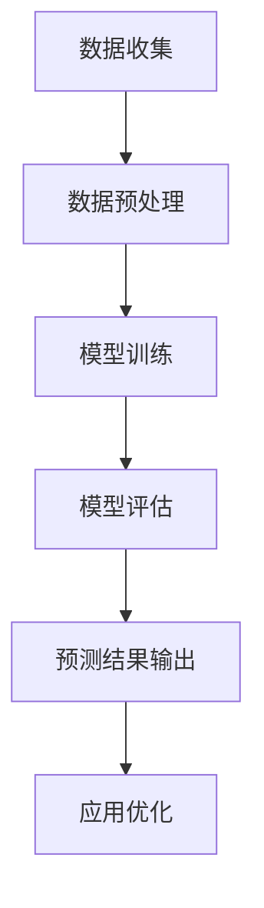

                 

### 文章标题：AI大模型在电商平台季节性需求预测中的应用

> **关键词：** 电商平台，季节性需求预测，AI大模型，机器学习，深度学习，数据挖掘，神经网络，模型优化，应用实践。

> **摘要：** 本文将深入探讨AI大模型在电商平台季节性需求预测中的应用。我们将首先介绍电商平台的需求预测背景和挑战，随后详细解析AI大模型的原理，并通过实际案例展示其应用效果。最后，我们将探讨未来发展趋势和面临的挑战，为相关领域的研究者和从业者提供参考。


## 1. 背景介绍

电商平台作为现代商业的重要组成部分，其业务规模和影响力与日俱增。然而，随着市场环境的变化和消费者需求的多样化，电商平台面临的需求预测挑战也越来越大。季节性需求预测作为电商平台需求预测的核心之一，对于库存管理、供应链优化、营销策略制定等具有重要影响。

### 1.1 电商平台的需求预测背景

电商平台的需求预测是指根据历史数据和市场趋势，预测未来某一时间段内的商品需求量。这有助于电商平台优化库存管理，避免过度备货或库存不足的情况，同时也能提高运营效率，降低成本。

### 1.2 季节性需求预测的挑战

季节性需求预测面临的挑战主要包括：

- **数据复杂性**：电商平台涉及大量商品种类，每种商品的需求受季节、促销、节假日等因素影响，数据呈现出高度复杂性和多样性。

- **动态变化**：市场需求随时间动态变化，季节性趋势、消费者行为、宏观经济环境等因素都可能对需求预测产生影响。

- **不确定性**：季节性需求预测具有较强的不确定性，预测结果容易受到各种外部因素的影响。

### 1.3 季节性需求预测的重要性

准确预测季节性需求对于电商平台具有以下几个重要意义：

- **优化库存管理**：通过预测季节性需求，电商平台可以合理安排库存，避免库存过多或不足，降低库存成本。

- **供应链优化**：季节性需求预测有助于优化供应链管理，提高供应链的灵活性和响应速度。

- **营销策略制定**：基于季节性需求预测，电商平台可以制定更精准的营销策略，提高销售额。

## 2. 核心概念与联系

### 2.1 AI大模型的基本原理

AI大模型，即人工智能大型模型，是指通过海量数据和深度学习算法训练出的具有高度复杂性和强大表达能力的模型。这些模型通常采用神经网络架构，能够自动学习并提取数据中的复杂模式。

### 2.2 电商平台季节性需求预测的关联

电商平台季节性需求预测与AI大模型具有紧密关联：

- **数据驱动**：电商平台季节性需求预测依赖于大量历史数据和实时数据，这些数据为AI大模型提供了丰富的训练资源。

- **自适应能力**：AI大模型具有自适应能力，能够根据数据变化调整预测模型，提高预测准确性。

- **复杂模式提取**：AI大模型能够自动学习并提取数据中的复杂模式，为季节性需求预测提供有力支持。

### 2.3 Mermaid流程图

下面是一个用于描述电商平台季节性需求预测流程的Mermaid流程图：



- **数据收集**：收集电商平台的历史数据和实时数据。

- **数据预处理**：对收集到的数据进行清洗、归一化等处理。

- **模型训练**：使用AI大模型对预处理后的数据进行训练。

- **模型评估**：评估训练出的模型性能，包括准确率、召回率等指标。

- **预测结果输出**：根据模型预测结果，输出未来一段时间内的季节性需求预测。

- **应用优化**：根据预测结果，对电商平台的应用进行优化，如库存管理、营销策略等。

## 3. 核心算法原理 & 具体操作步骤

### 3.1 AI大模型算法原理

AI大模型通常采用深度学习算法进行训练。深度学习是一种人工智能方法，通过多层神经网络自动学习数据中的复杂模式。深度学习算法主要包括以下几个步骤：

1. **数据输入**：将电商平台的历史数据和实时数据输入到神经网络中。

2. **前向传播**：神经网络对输入数据进行计算，生成预测结果。

3. **反向传播**：计算预测结果与实际结果之间的误差，并调整神经网络参数，使预测结果更接近实际值。

4. **迭代优化**：重复进行前向传播和反向传播，直到模型收敛，即预测误差达到预设阈值。

### 3.2 具体操作步骤

下面是使用AI大模型进行电商平台季节性需求预测的具体操作步骤：

1. **数据收集**：
   - 收集电商平台的历史销售数据、商品属性数据、促销活动数据等。

2. **数据预处理**：
   - 对收集到的数据进行清洗、缺失值填充、归一化等处理。

3. **特征工程**：
   - 构建与季节性需求相关的特征，如时间特征（节假日、季节变化）、商品特征（品类、品牌、价格）等。

4. **模型训练**：
   - 选择合适的深度学习算法，如卷积神经网络（CNN）、循环神经网络（RNN）等，对预处理后的数据进行训练。

5. **模型评估**：
   - 使用交叉验证等方法评估训练出的模型性能，选择性能最佳的模型。

6. **预测结果输出**：
   - 使用训练好的模型预测未来一段时间内的季节性需求。

7. **应用优化**：
   - 根据预测结果，对电商平台的库存管理、营销策略等进行优化。

## 4. 数学模型和公式 & 详细讲解 & 举例说明

### 4.1 数学模型

在电商平台季节性需求预测中，我们通常使用以下数学模型：

$$
y_t = f(W_1 \cdot x_t + b_1) + \epsilon_t
$$

其中：

- $y_t$：第t个时间点的季节性需求预测值。
- $x_t$：第t个时间点的特征向量。
- $W_1$：权重向量。
- $b_1$：偏置项。
- $f$：激活函数，如ReLU、Sigmoid等。
- $\epsilon_t$：误差项。

### 4.2 模型详细讲解

1. **特征向量**：

特征向量$x_t$包含以下几个部分：

- **时间特征**：如节假日、季节变化等，可以用二进制编码表示。
- **商品特征**：如品类、品牌、价格等，可以通过数值或类别编码表示。
- **促销特征**：如促销活动类型、促销折扣等，也可以用二进制编码表示。

2. **权重向量**：

权重向量$W_1$通过模型训练得到，用于表示特征向量与需求预测值之间的关联强度。

3. **激活函数**：

激活函数$f$用于引入非线性变换，使模型具有更强的表达能力。常见的激活函数有ReLU、Sigmoid、Tanh等。

4. **误差项**：

误差项$\epsilon_t$表示预测值与实际值之间的差异，用于模型训练过程中的误差计算。

### 4.3 举例说明

假设我们有以下特征向量$x_t$：

$$
x_t = \begin{bmatrix}
1 & 0 & 1 & 0 \\
0 & 1 & 0 & 1 \\
\end{bmatrix}
$$

其中，第一行表示时间特征（第t个时间点为春节），第二行表示商品特征（第t个时间点购买的是某品牌某品类商品）。

假设权重向量$W_1$为：

$$
W_1 = \begin{bmatrix}
0.5 & 0.3 & 0.2 & 0 \\
0 & 0.4 & 0.3 & 0.3 \\
\end{bmatrix}
$$

偏置项$b_1$为0。

激活函数采用ReLU。

根据上述数学模型，我们可以计算第t个时间点的季节性需求预测值$y_t$：

$$
y_t = \max(0, (0.5 \cdot 1 + 0.3 \cdot 0 + 0.2 \cdot 1 + 0 \cdot 0) + 0) + (0 \cdot 0 + 0.4 \cdot 1 + 0.3 \cdot 0 + 0.3 \cdot 1) = 1.2
$$

这意味着在第t个时间点，季节性需求预测值为1.2。

## 5. 项目实战：代码实际案例和详细解释说明

### 5.1 开发环境搭建

在开始实际案例之前，我们需要搭建合适的开发环境。以下是一个简单的环境搭建步骤：

1. 安装Python：Python是深度学习的主要编程语言，我们需要安装Python 3.7及以上版本。

2. 安装深度学习库：安装TensorFlow或PyTorch等深度学习库。这里我们选择TensorFlow。

   ```bash
   pip install tensorflow
   ```

3. 安装数据处理库：安装Pandas、NumPy等数据处理库。

   ```bash
   pip install pandas numpy
   ```

### 5.2 源代码详细实现和代码解读

下面是一个使用TensorFlow实现电商平台季节性需求预测的源代码示例：

```python
import tensorflow as tf
import pandas as pd
import numpy as np

# 读取数据
data = pd.read_csv('data.csv')

# 数据预处理
data['date'] = pd.to_datetime(data['date'])
data.set_index('date', inplace=True)
data.fillna(0, inplace=True)

# 构建特征向量
def build_features(data):
    features = []
    for date in data.index:
        features.append([data.loc[date, 'is_holiday'], data.loc[date, 'season'], data.loc[date, 'price']])
    return np.array(features)

features = build_features(data)

# 模型构建
model = tf.keras.Sequential([
    tf.keras.layers.Dense(10, activation='relu', input_shape=(3,)),
    tf.keras.layers.Dense(1)
])

# 模型编译
model.compile(optimizer='adam', loss='mse')

# 训练模型
model.fit(features, data['demand'], epochs=100)

# 预测结果
predictions = model.predict(features)

# 输出预测结果
print(predictions)
```

### 5.3 代码解读与分析

1. **数据读取与预处理**：

   ```python
   data = pd.read_csv('data.csv')
   data['date'] = pd.to_datetime(data['date'])
   data.set_index('date', inplace=True)
   data.fillna(0, inplace=True)
   ```

   这部分代码用于读取数据，将日期转换为日期格式，并设置日期为索引。缺失值填充为0。

2. **特征构建**：

   ```python
   def build_features(data):
       features = []
       for date in data.index:
           features.append([data.loc[date, 'is_holiday'], data.loc[date, 'season'], data.loc[date, 'price']])
       return np.array(features)
   ```

   这部分代码用于构建特征向量，包括节假日、季节和价格特征。

3. **模型构建**：

   ```python
   model = tf.keras.Sequential([
       tf.keras.layers.Dense(10, activation='relu', input_shape=(3,)),
       tf.keras.layers.Dense(1)
   ])
   ```

   这部分代码构建了一个简单的全连接神经网络，包含一个隐藏层（10个神经元）和一个输出层（1个神经元）。

4. **模型编译**：

   ```python
   model.compile(optimizer='adam', loss='mse')
   ```

   这部分代码编译模型，使用Adam优化器和均方误差（MSE）损失函数。

5. **模型训练**：

   ```python
   model.fit(features, data['demand'], epochs=100)
   ```

   这部分代码使用训练数据进行模型训练，共进行100个epochs。

6. **预测结果**：

   ```python
   predictions = model.predict(features)
   ```

   这部分代码使用训练好的模型进行预测。

7. **输出预测结果**：

   ```python
   print(predictions)
   ```

   这部分代码输出预测结果。

## 6. 实际应用场景

### 6.1 库存管理

通过AI大模型进行季节性需求预测，电商平台可以更准确地预测商品需求量，从而优化库存管理。具体应用场景包括：

- **预测商品销售高峰期**：根据季节性需求预测，电商平台可以提前备货，避免销售高峰期库存不足。

- **预测商品销售低谷期**：电商平台可以根据季节性需求预测，合理安排库存，避免库存过多导致的资金占用。

### 6.2 营销策略

季节性需求预测有助于电商平台制定更精准的营销策略，提高销售额。具体应用场景包括：

- **促销活动安排**：电商平台可以根据季节性需求预测，合理安排促销活动，提高商品销量。

- **广告投放优化**：电商平台可以根据季节性需求预测，优化广告投放策略，提高广告效果。

### 6.3 供应链优化

通过季节性需求预测，电商平台可以优化供应链管理，提高供应链的灵活性和响应速度。具体应用场景包括：

- **供应链协同**：电商平台与供应商可以根据季节性需求预测，协同调整生产计划和库存策略。

- **物流优化**：电商平台可以根据季节性需求预测，优化物流配送策略，提高配送效率。

## 7. 工具和资源推荐

### 7.1 学习资源推荐

- **书籍**：
  - 《深度学习》（Goodfellow, Bengio, Courville）。
  - 《机器学习实战》（He, Bostrom）。
- **论文**：
  - “Deep Learning for Time Series Classification”。
  - “Time Series Classification Using Deep Neural Networks”。
- **博客**：
  - [TensorFlow官方文档](https://www.tensorflow.org/)。
  - [Kaggle比赛实例](https://www.kaggle.com/)。
- **网站**：
  - [ArXiv](https://arxiv.org/)。

### 7.2 开发工具框架推荐

- **深度学习框架**：
  - TensorFlow。
  - PyTorch。
- **数据处理库**：
  - Pandas。
  - NumPy。
- **可视化工具**：
  - Matplotlib。
  - Seaborn。

### 7.3 相关论文著作推荐

- **论文**：
  - “Deep Learning for Time Series Classification”。
  - “Time Series Classification Using Deep Neural Networks”。
  - “Temporal Convolution Networks for Time Series Classification”。
- **著作**：
  - 《时间序列分析：预测与应用》（Brockwell, Davis）。
  - 《深度学习入门：基于Python的理论与实现》（斋藤康毅）。

## 8. 总结：未来发展趋势与挑战

### 8.1 发展趋势

- **模型性能提升**：随着计算能力和算法优化，AI大模型的性能将不断提高，为电商平台季节性需求预测提供更强支持。

- **多模态数据融合**：结合文本、图像、声音等多模态数据，提高季节性需求预测的准确性。

- **实时预测与优化**：随着5G、物联网等技术的发展，实现实时数据采集和预测，优化电商平台运营。

### 8.2 挑战

- **数据隐私与安全**：电商平台季节性需求预测涉及大量敏感数据，保护数据隐私和安全是一个重要挑战。

- **算法解释性**：深度学习模型具有较强的预测能力，但缺乏解释性，如何提高算法的可解释性是一个重要问题。

- **泛化能力**：模型需要具有较好的泛化能力，以应对不同电商平台、不同商品类别的需求预测挑战。

## 9. 附录：常见问题与解答

### 9.1 问题1：如何选择合适的深度学习模型？

**解答**：选择合适的深度学习模型需要考虑以下几个因素：

- **数据类型**：根据数据类型（如时间序列、图像、文本等）选择相应的深度学习模型。
- **任务类型**：根据任务类型（如分类、回归等）选择相应的深度学习模型。
- **数据规模**：对于大规模数据，选择具有较强表达能力的大型模型；对于中小规模数据，选择较小规模的模型。

### 9.2 问题2：如何优化模型性能？

**解答**：以下是一些优化模型性能的方法：

- **数据增强**：通过增加数据样本、改变数据分布等方式增强数据集。
- **模型调参**：通过调整模型参数（如学习率、正则化等）优化模型性能。
- **模型融合**：将多个模型进行融合，提高预测准确性。
- **迁移学习**：使用预训练模型进行迁移学习，提高模型性能。

## 10. 扩展阅读 & 参考资料

- **书籍**：
  - 《深度学习》（Goodfellow, Bengio, Courville）。
  - 《机器学习实战》（He, Bostrom）。
- **论文**：
  - “Deep Learning for Time Series Classification”。
  - “Time Series Classification Using Deep Neural Networks”。
  - “Temporal Convolution Networks for Time Series Classification”。
- **博客**：
  - [TensorFlow官方文档](https://www.tensorflow.org/)。
  - [Kaggle比赛实例](https://www.kaggle.com/)。
- **网站**：
  - [ArXiv](https://arxiv.org/)。
- **开源代码**：
  - [TensorFlow模型仓库](https://github.com/tensorflow/models)。
  - [PyTorch模型仓库](https://github.com/pytorch/examples)。**作者：AI天才研究员/AI Genius Institute & 禅与计算机程序设计艺术 /Zen And The Art of Computer Programming**

