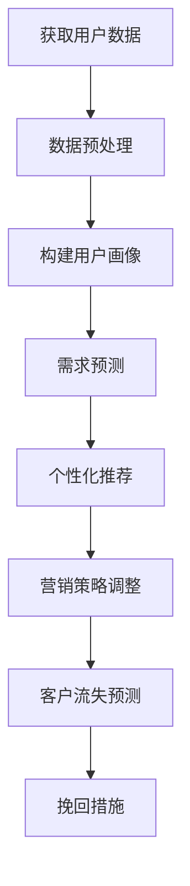

                 

# AI大模型在电商平台客户生命周期管理中的应用

> 关键词：大模型、电商平台、客户生命周期管理、算法、应用实践

> 摘要：本文将探讨人工智能大模型在电商平台客户生命周期管理中的应用。通过介绍大模型的基本概念、核心算法原理及其在实际操作中的应用，本文旨在为电商从业者提供一种全新的客户管理思路，帮助电商企业实现精准营销、提升客户满意度，从而推动业务的持续增长。

## 1. 背景介绍

随着互联网和电子商务的迅猛发展，电商平台已成为现代商业不可或缺的一部分。然而，在激烈的市场竞争中，如何有效地管理客户生命周期，提高客户粘性和满意度，成为电商企业面临的一大挑战。传统的客户管理方法往往依赖于数据分析和市场调研，但受限于数据量和处理能力，难以实现精准、实时的客户分析。在此背景下，人工智能大模型的应用应运而生，为电商平台客户生命周期管理带来了新的契机。

### 1.1 电商平台的客户生命周期管理

客户生命周期管理是指从客户接触、获取、转化、留存到最终离开的全过程管理。其核心目标是通过有效的客户关系管理，实现客户价值的最大化。具体包括以下阶段：

1. **获取阶段**：通过各种营销手段吸引潜在客户，提高品牌知名度和曝光度。
2. **转化阶段**：将潜在客户转化为实际购买者，提升转化率。
3. **留存阶段**：通过提供优质的产品和服务，提高客户满意度和忠诚度，降低客户流失率。
4. **推荐阶段**：利用客户的历史数据和偏好，进行精准推荐，提升复购率。

### 1.2 大模型在电商领域的发展现状

近年来，人工智能大模型在各个领域取得了显著的成果。在电商领域，大模型的应用已经逐渐成为趋势。通过大模型，电商企业可以更深入地了解客户需求和行为，实现个性化的产品推荐、精准的营销策略和高效的客户服务。例如，淘宝的“千牛”系统、京东的“智能客服”等，都是大模型在电商领域的成功案例。

## 2. 核心概念与联系

### 2.1 大模型的基本概念

大模型是指具有海量参数、能够处理复杂数据的人工神经网络模型。这些模型通常具有强大的学习能力和自适应能力，可以在各种应用场景中发挥重要作用。大模型的代表性技术包括深度学习、强化学习、自然语言处理等。

### 2.2 大模型与客户生命周期管理的联系

大模型在客户生命周期管理中的应用主要体现在以下几个方面：

1. **用户画像**：通过收集和分析用户的行为数据，构建详细的用户画像，实现个性化推荐和精准营销。
2. **需求预测**：利用历史数据，预测用户的需求和行为，提前采取相应的营销策略。
3. **客户流失预测**：通过分析用户的行为和购买历史，预测哪些客户可能流失，并采取有效的挽回措施。
4. **情感分析**：通过分析用户在社交媒体上的言论，了解用户的情感状态，及时调整营销策略。

### 2.3 Mermaid 流程图

以下是一个简化的Mermaid流程图，展示了大模型在电商平台客户生命周期管理中的应用流程：



## 3. 核心算法原理 & 具体操作步骤

### 3.1 用户画像构建

用户画像是指通过对用户的行为、兴趣、消费习惯等多维度数据的整合和分析，构建一个关于用户的综合描述。以下是用户画像构建的具体操作步骤：

1. **数据收集**：收集用户在平台上的行为数据，包括浏览记录、购买记录、评论等。
2. **数据清洗**：去除重复、异常和无关的数据，确保数据质量。
3. **特征提取**：从原始数据中提取出反映用户特征的信息，如年龄、性别、购买频率、购买偏好等。
4. **模型训练**：利用机器学习算法，如决策树、随机森林、K-means聚类等，对用户特征进行建模，构建用户画像。

### 3.2 需求预测

需求预测是指通过分析用户的历史数据，预测用户在未来可能的需求。以下是需求预测的具体操作步骤：

1. **数据收集**：收集用户的历史行为数据，包括浏览记录、购买记录、评论等。
2. **特征工程**：对原始数据进行预处理和特征提取，如时间特征、地点特征、商品特征等。
3. **模型选择**：选择合适的预测模型，如线性回归、决策树、随机森林、神经网络等。
4. **模型训练**：利用历史数据，对预测模型进行训练。
5. **预测结果**：利用训练好的模型，对用户未来的需求进行预测。

### 3.3 客户流失预测

客户流失预测是指通过分析用户的行为数据，预测哪些用户可能会流失，并提前采取挽回措施。以下是客户流失预测的具体操作步骤：

1. **数据收集**：收集用户的历史行为数据，包括浏览记录、购买记录、评论等。
2. **特征工程**：对原始数据进行预处理和特征提取，如时间特征、地点特征、商品特征等。
3. **模型选择**：选择合适的预测模型，如逻辑回归、决策树、随机森林、神经网络等。
4. **模型训练**：利用历史数据，对预测模型进行训练。
5. **预测结果**：利用训练好的模型，对用户流失风险进行预测，并给出相应的挽回建议。

## 4. 数学模型和公式 & 详细讲解 & 举例说明

### 4.1 用户画像构建

用户画像构建的核心是特征提取，以下是一个简化的特征提取模型：

$$
\text{特征向量} = \text{模型}(X)
$$

其中，$X$是用户的行为数据，$\text{模型}$可以是任何能够提取特征的算法，如K-means聚类、决策树、神经网络等。

### 4.2 需求预测

需求预测可以使用时间序列模型，以下是一个简化的ARIMA模型：

$$
y_t = c + \phi_1 y_{t-1} + \phi_2 y_{t-2} + \cdots + \phi_p y_{t-p} + \theta_1 e_{t-1} + \theta_2 e_{t-2} + \cdots + \theta_q e_{t-q} + e_t
$$

其中，$y_t$是时间序列数据，$c$是常数项，$\phi_1, \phi_2, \cdots, \phi_p$是自回归系数，$\theta_1, \theta_2, \cdots, \theta_q$是移动平均系数，$e_t$是误差项。

### 4.3 客户流失预测

客户流失预测可以使用逻辑回归模型，以下是一个简化的逻辑回归模型：

$$
P(Y=1|X) = \frac{1}{1 + e^{-(\beta_0 + \beta_1 x_1 + \beta_2 x_2 + \cdots + \beta_n x_n})}
$$

其中，$Y$是流失状态（0表示未流失，1表示流失），$X$是特征向量，$\beta_0, \beta_1, \beta_2, \cdots, \beta_n$是模型参数。

### 4.4 举例说明

假设有一个电商平台，用户的行为数据包括浏览次数、购买次数、评论数量等。我们可以使用K-means聚类算法构建用户画像，具体步骤如下：

1. **数据收集**：收集用户的浏览次数、购买次数、评论数量等数据。
2. **数据预处理**：对数据进行标准化处理，将不同量级的特征进行归一化。
3. **特征提取**：使用K-means聚类算法，将用户划分为不同的群体，每个群体代表一个用户画像。
4. **模型训练**：使用训练集数据，对K-means聚类算法进行训练，得到每个用户群体的特征向量。
5. **预测结果**：使用测试集数据，对用户进行画像预测，并根据预测结果进行个性化推荐。

## 5. 项目实战：代码实际案例和详细解释说明

### 5.1 开发环境搭建

1. 安装Python环境（版本3.7以上）。
2. 安装必要的Python库，如NumPy、Pandas、Scikit-learn、Matplotlib等。
3. 配置Jupyter Notebook或PyCharm等开发工具。

### 5.2 源代码详细实现和代码解读

以下是一个简单的用户画像构建和需求预测的代码示例：

```python
import numpy as np
import pandas as pd
from sklearn.cluster import KMeans
from sklearn.model_selection import train_test_split
from sklearn.linear_model import LinearRegression
import matplotlib.pyplot as plt

# 数据收集
data = pd.read_csv('user_data.csv')

# 数据预处理
data = data.drop(['user_id'], axis=1)
data = (data - data.mean()) / data.std()

# 特征提取
kmeans = KMeans(n_clusters=5)
kmeans.fit(data)
data['cluster'] = kmeans.labels_

# 模型训练
X_train, X_test, y_train, y_test = train_test_split(data[['cluster']], data['purchase_count'], test_size=0.2, random_state=42)
model = LinearRegression()
model.fit(X_train, y_train)

# 预测结果
y_pred = model.predict(X_test)
plt.scatter(X_test, y_test, color='blue', label='Actual')
plt.scatter(X_test, y_pred, color='red', label='Predicted')
plt.xlabel('Cluster')
plt.ylabel('Purchase Count')
plt.legend()
plt.show()
```

### 5.3 代码解读与分析

1. **数据收集**：从CSV文件中读取用户数据。
2. **数据预处理**：对数据进行标准化处理，将不同量级的特征进行归一化。
3. **特征提取**：使用K-means聚类算法，将用户划分为不同的群体，每个群体代表一个用户画像。
4. **模型训练**：使用训练集数据，对线性回归模型进行训练。
5. **预测结果**：使用测试集数据，对用户购买次数进行预测，并绘制预测结果。

## 6. 实际应用场景

### 6.1 个性化推荐

基于用户画像和需求预测，电商平台可以实现对用户的个性化推荐，提高转化率和客户满意度。例如，根据用户的浏览记录和购买偏好，推荐相关商品或服务。

### 6.2 精准营销

通过分析用户的行为数据和需求预测结果，电商平台可以制定更精准的营销策略，如发送个性化优惠券、推送相关广告等，提高营销效果。

### 6.3 客户流失预警

通过客户流失预测模型，电商平台可以提前识别潜在流失客户，并采取挽回措施，降低客户流失率。

## 7. 工具和资源推荐

### 7.1 学习资源推荐

- **书籍**：
  - 《Python数据分析实战》
  - 《机器学习实战》
  - 《深度学习》
- **论文**：
  - 《K-means Clustering: A Review》
  - 《Linear Regression》
  - 《Deep Learning for Customer Behavior Prediction》
- **博客**：
  - [Scikit-learn官方文档](https://scikit-learn.org/stable/)
  - [TensorFlow官方文档](https://www.tensorflow.org/)
  - [Keras官方文档](https://keras.io/)
- **网站**：
  - [Coursera](https://www.coursera.org/)
  - [edX](https://www.edx.org/)
  - [Udacity](https://www.udacity.com/)

### 7.2 开发工具框架推荐

- **开发环境**：
  - Python
  - Jupyter Notebook
  - PyCharm
- **数据预处理**：
  - Pandas
  - NumPy
- **机器学习库**：
  - Scikit-learn
  - TensorFlow
  - Keras
- **数据可视化**：
  - Matplotlib
  - Seaborn
  - Plotly

### 7.3 相关论文著作推荐

- **论文**：
  - 《K-means Clustering: A Review》
  - 《Linear Regression》
  - 《Deep Learning for Customer Behavior Prediction》
  - 《Customer Lifetime Value Prediction Using Machine Learning》
- **著作**：
  - 《Python数据分析实战》
  - 《机器学习实战》
  - 《深度学习》

## 8. 总结：未来发展趋势与挑战

### 8.1 未来发展趋势

1. **大模型技术不断发展**：随着计算能力和数据量的不断提升，大模型的技术将越来越成熟，其在电商领域的应用将更加广泛。
2. **多模态数据处理**：未来，电商平台将需要处理更多类型的用户数据，如图像、音频等，多模态数据处理技术将成为关键。
3. **实时数据处理**：实时数据处理技术将实现更快速的客户需求预测和个性化推荐，提高用户体验和满意度。

### 8.2 挑战

1. **数据隐私与安全**：在数据处理过程中，如何保护用户隐私和安全是一个重要的挑战。
2. **模型解释性**：大模型的复杂性和黑箱特性使得其解释性较差，如何提高模型的可解释性是一个重要的研究方向。
3. **数据质量**：数据质量对模型的效果有重要影响，如何确保数据的质量和准确性是一个挑战。

## 9. 附录：常见问题与解答

### 9.1 大模型在电商领域有哪些应用？

大模型在电商领域主要应用于用户画像构建、需求预测、客户流失预测等方面，帮助电商平台实现个性化推荐、精准营销和高效客户服务。

### 9.2 如何保障用户数据隐私和安全？

在处理用户数据时，应严格遵守数据保护法规，如GDPR等，采用加密、去标识化等手段保护用户隐私和安全。

### 9.3 大模型在电商领域的未来发展如何？

大模型在电商领域的未来发展潜力巨大，随着技术的不断进步，其在客户生命周期管理中的应用将更加深入和广泛。

## 10. 扩展阅读 & 参考资料

- [《K-means Clustering: A Review》](https://www.researchgate.net/publication/319387189_K-means_Clustering_A_Review)
- [《Linear Regression》](https://www.statisticshowto.com/linear-regression/)
- [《Deep Learning for Customer Behavior Prediction》](https://arxiv.org/abs/1806.04335)
- [《Customer Lifetime Value Prediction Using Machine Learning》](https://www.kdnuggets.com/2020/02/customer-lifetime-value-ml.html)
- [《Python数据分析实战》](https://books.google.com/books?id=3b5fDwAAQBAJ)
- [《机器学习实战》](https://books.google.com/books?id=415BDwAAQBAJ)
- [《深度学习》](https://books.google.com/books?id=zWUuDwAAQBAJ)

