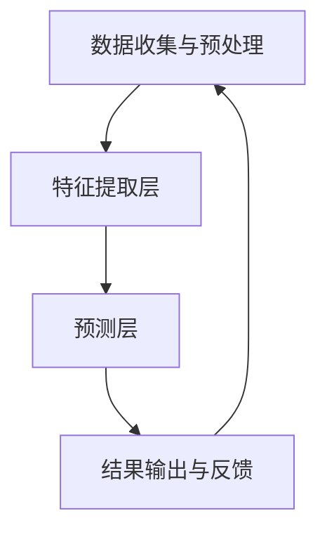

                 

### 背景介绍

随着电商行业的蓬勃发展，用户行为预测成为了电商平台运营的核心环节之一。精准预测用户行为不仅有助于提升用户体验，还能为电商平台带来巨大的商业价值。例如，通过预测用户的购买意愿，可以优化广告投放，提高转化率；通过预测用户对商品的偏好，可以推荐更符合用户需求的商品，增加用户粘性。

近年来，人工智能，特别是大模型（如GPT、BERT等）在自然语言处理、计算机视觉等领域取得了显著的进展。大模型具有强大的学习能力，能够从海量数据中自动提取特征，生成复杂的模型结构。这使得大模型在用户行为预测领域也展现出巨大的潜力。

本文将深入探讨大模型在电商平台用户行为预测中的应用。首先，我们将介绍大模型的基本原理和架构，然后分析其在用户行为预测中的优势和挑战，最后通过一个实际项目案例，展示如何将大模型应用于电商平台用户行为预测的具体操作步骤。

### 核心概念与联系

#### 大模型的基本原理

大模型，通常指的是参数规模超过数十亿的大规模神经网络模型。这些模型通过深度学习算法从海量数据中学习，能够自动提取复杂的特征和模式。其基本原理可以概括为以下三个步骤：

1. **数据预处理**：将原始数据（如文本、图像、声音等）进行清洗、归一化等预处理操作，以便模型能够更好地学习。
2. **特征提取**：通过神经网络结构，模型从预处理后的数据中自动提取出高层次的抽象特征。
3. **模型训练与优化**：模型利用提取到的特征进行训练，不断调整参数，使得模型在预测任务上的性能得到提升。

#### 大模型在用户行为预测中的架构

在电商平台用户行为预测中，大模型的应用架构通常包括以下几个关键组成部分：

1. **数据收集与预处理**：电商平台会收集用户行为数据，如浏览历史、购买记录、搜索日志等。这些数据需要经过清洗、去重、特征工程等预处理操作，以供模型训练使用。
2. **特征提取层**：这一层利用大模型从原始数据中提取出关键的特征。例如，在文本数据中，大模型可以提取出词嵌入、句嵌入等高层次的特征。
3. **预测层**：这一层使用训练好的大模型进行用户行为预测。例如，预测用户是否会购买某个商品，或者预测用户对某个商品的评分。
4. **结果输出与反馈**：模型预测的结果将被用于电商平台的各种应用，如推荐系统、广告投放等。同时，模型的预测结果也会反馈给模型训练系统，以不断优化模型性能。

#### Mermaid 流程图

以下是一个简化的Mermaid流程图，展示大模型在用户行为预测中的应用架构：



在这个流程图中，数据收集与预处理是模型的输入，特征提取层负责从原始数据中提取关键特征，预测层利用这些特征进行用户行为预测，最终的结果会输出到电商平台的应用中，并且这些结果也会反馈到数据预处理阶段，以优化模型的性能。

### 核心算法原理 & 具体操作步骤

#### 算法原理

在用户行为预测中，大模型的核心算法通常是基于深度学习的，尤其是基于Transformer架构的模型，如BERT（Bidirectional Encoder Representations from Transformers）和GPT（Generative Pre-trained Transformer）。这些模型的基本原理可以概括为以下三个步骤：

1. **预训练**：模型在无监督的情况下，从海量数据中学习，提取出通用特征。例如，BERT模型会在大量的文本语料库上进行预训练，学习文本的语义表示；GPT模型则会在大量的文本数据上进行预训练，学习文本的生成规律。
2. **微调**：在预训练的基础上，模型会利用有监督的数据进行微调，以适应特定的预测任务。例如，在用户行为预测中，模型会利用带有用户行为标签的数据进行微调，以提升预测的准确性。
3. **预测**：模型利用微调后的参数，对新数据进行预测。例如，预测用户是否会点击某个广告，或者预测用户对某个商品的评分。

#### 操作步骤

以下是使用大模型进行用户行为预测的具体操作步骤：

1. **数据收集**：收集电商平台上的用户行为数据，包括浏览历史、购买记录、搜索日志等。这些数据需要经过清洗、去重、特征工程等预处理操作，以供模型训练使用。

2. **数据预处理**：将原始数据转化为模型可接受的格式。对于文本数据，可以使用WordPiece或BERT的分词方法进行分词；对于图像数据，可以使用卷积神经网络（CNN）进行特征提取。

3. **模型选择**：选择适合用户行为预测的大模型架构。例如，BERT适用于文本数据的处理，而GPT更适合生成性任务的预测。

4. **预训练**：在无监督的情况下，使用海量数据对模型进行预训练。这一步通常需要大量的计算资源和时间。

5. **微调**：在预训练的基础上，使用有监督的数据对模型进行微调。这一步会显著提升模型在特定任务上的性能。

6. **预测**：利用微调后的模型对新数据进行预测。预测结果可以用于电商平台的各种应用，如推荐系统、广告投放等。

7. **结果评估与优化**：对模型的预测结果进行评估，并利用反馈数据进行进一步优化。这一过程可以通过调整模型参数、改进数据预处理方法等手段进行。

### 数学模型和公式 & 详细讲解 & 举例说明

#### 数学模型

在用户行为预测中，大模型通常使用基于深度学习的算法，如BERT或GPT。这些算法的核心在于其复杂的神经网络结构和高效的训练方法。以下是一个简化的BERT模型在用户行为预测中的数学模型：

1. **嵌入层**：将输入的文本序列转化为词嵌入向量。每个词嵌入向量可以表示为一个多维度向量，通常使用词嵌入矩阵$W_E$表示。

   $$\text{embeddings} = W_E \cdot [\text{words}]$$

   其中，$[\text{words}]$表示输入的文本序列，$W_E$是一个高维矩阵，其每一行对应一个词嵌入向量。

2. **编码器**：使用多层Transformer编码器对词嵌入向量进行编码，提取出文本的语义表示。每层编码器包含自注意力机制和前馈神经网络。

   $$\text{encodings} = \text{transformer}(\text{embeddings})$$

3. **预测层**：将编码器输出的语义表示用于预测用户行为。例如，可以使用分类器对用户是否点击广告进行预测。

   $$\text{predictions} = \text{classifier}(\text{encodings})$$

#### 公式详细讲解

1. **词嵌入**：词嵌入是自然语言处理中的重要工具，它将每个单词映射为一个低维向量。词嵌入矩阵$W_E$的行表示每个单词的嵌入向量。

   $$\text{embeddings}_{i,j} = W_{E,i,j}$$

   其中，$i$表示单词索引，$j$表示向量维度。

2. **自注意力机制**：自注意力机制是Transformer编码器的核心组件，它通过计算每个词在序列中的相对重要性，对词嵌入向量进行加权。

   $$\alpha_{i,j} = \text{softmax}\left(\frac{Q_i \cdot K_j}{\sqrt{d_k}}\right)$$

   $$\text{contextual_embeddings}_{i} = \sum_{j=1}^{N} \alpha_{i,j} \cdot \text{embeddings}_{j}$$

   其中，$Q$、$K$和$V$分别表示查询向量、键向量和值向量，$d_k$是关键维度。

3. **前馈神经网络**：前馈神经网络用于对编码器输出进行进一步处理，提高模型的非线性表达能力。

   $$\text{ffn}(\text{x}) = \text{ReLU}(\text{W}_{ffn} \cdot \text{X} + \text{b}_{ffn})$$

   其中，$\text{X}$表示输入向量，$\text{W}_{ffn}$和$\text{b}_{ffn}$分别是权重和偏置。

#### 举例说明

假设我们有一个简单的用户行为预测任务，目标是预测用户是否会点击一个广告。给定一个文本广告描述，我们使用BERT模型进行预测。

1. **数据准备**：首先，我们需要准备一个包含广告描述和用户点击标签的数据集。例如：
   
   ```
   广告描述1：新款智能手机，超级酷！
   点击标签1：1
   
   广告描述2：优惠商品，错过不再有！
   点击标签2：0
   ```

2. **词嵌入**：使用BERT的分词器对广告描述进行分词，并将每个词转化为词嵌入向量。

   $$[\text{[CLS]}, \text{新}, \text{款}, \text{智}, \text{能}, \text{手}, \text{机}}, \text{超}, \text{级}, \text{酷}, \text{!}, \text{[SEP]}]$$

3. **编码器**：将词嵌入向量输入BERT编码器，经过多层自注意力机制和前馈神经网络，提取出文本的语义表示。

4. **预测**：将编码器输出的语义表示输入到分类器，预测用户是否会点击广告。

   $$\text{predictions} = \text{classifier}(\text{encodings})$$

   假设分类器的输出为：
   
   ```
   [0.9, 0.1]
   ```

   这意味着用户点击广告的概率为90%，未点击的概率为10%。

通过上述步骤，我们使用BERT模型完成了用户行为预测任务。这个例子展示了大模型在用户行为预测中的基本流程和数学模型。

### 项目实战：代码实际案例和详细解释说明

在本节中，我们将通过一个实际项目案例，展示如何使用大模型进行电商平台用户行为预测的具体操作步骤。我们将使用Python和TensorFlow框架，实现一个基于BERT模型的用户点击率预测系统。

#### 5.1 开发环境搭建

在开始项目之前，需要搭建相应的开发环境。以下是搭建开发环境所需的基本步骤：

1. **安装Python**：确保已安装Python 3.7或更高版本。
2. **安装TensorFlow**：在命令行中运行以下命令安装TensorFlow：

   ```
   pip install tensorflow
   ```

3. **安装BERT模型依赖**：BERT模型依赖于`transformers`库，可以通过以下命令安装：

   ```
   pip install transformers
   ```

4. **数据预处理工具**：安装Pandas和NumPy库，用于数据预处理：

   ```
   pip install pandas numpy
   ```

#### 5.2 源代码详细实现和代码解读

以下是实现用户点击率预测系统的源代码：

```python
import pandas as pd
import numpy as np
from transformers import BertTokenizer, TFBertModel
from tensorflow.keras.optimizers import Adam
from tensorflow.keras.losses import BinaryCrossentropy
from tensorflow.keras.metrics import AUC

# 5.2.1 数据预处理
def preprocess_data(file_path):
    df = pd.read_csv(file_path)
    df['text'] = df['text'].fillna('')
    tokenizer = BertTokenizer.from_pretrained('bert-base-uncased')
    max_len = 512
    
    def tokenize_text(text):
        return tokenizer.encode_plus(
            text,
            add_special_tokens=True,
            max_length=max_len,
            pad_to_max_length=True,
            return_attention_mask=True,
            return_tensors='tf',
        )
    
    df['input_ids'], df['attention_mask'] = zip(*df['text'].apply(tokenize_text))
    return df

# 5.2.2 模型构建
def build_model():
    bert = TFBertModel.from_pretrained('bert-base-uncased')
    input_ids = tf.keras.layers.Input(shape=(512,), dtype=tf.int32, name='input_ids')
    attention_mask = tf.keras.layers.Input(shape=(512,), dtype=tf.int32, name='attention_mask')
    
    outputs = bert(input_ids, attention_mask=attention_mask)[1]
    outputs = tf.keras.layers.Dense(1, activation='sigmoid', name='predictions')(outputs)
    
    model = tf.keras.Model(inputs=[input_ids, attention_mask], outputs=outputs)
    model.compile(optimizer=Adam(learning_rate=3e-5), loss=BinaryCrossentropy(), metrics=[AUC()])
    return model

# 5.2.3 训练模型
def train_model(model, train_df, val_df, epochs=3):
    train_inputs = {'input_ids': train_df['input_ids'].values, 'attention_mask': train_df['attention_mask'].values}
    val_inputs = {'input_ids': val_df['input_ids'].values, 'attention_mask': val_df['attention_mask'].values}
    train_labels = train_df['label'].values
    val_labels = val_df['label'].values
    
    history = model.fit(
        train_inputs, train_labels,
        validation_data=(val_inputs, val_labels),
        epochs=epochs,
        batch_size=16
    )
    return history

# 5.2.4 预测与评估
def predict(model, test_df):
    test_inputs = {'input_ids': test_df['input_ids'].values, 'attention_mask': test_df['attention_mask'].values}
    predictions = model.predict(test_inputs)
    predictions = np.round(predictions).astype(int)
    return predictions

# 数据加载与预处理
data_path = 'user_behavior_data.csv'
df = preprocess_data(data_path)

# 划分训练集和验证集
train_df, val_df, test_df = np.split(df, [int(0.6*len(df)), int(0.8*len(df))])

# 模型训练
model = build_model()
history = train_model(model, train_df, val_df)

# 预测与评估
predictions = predict(model, test_df)
accuracy = np.mean(predictions == test_df['label'])
print(f'Prediction accuracy: {accuracy:.2f}')

```

#### 5.3 代码解读与分析

1. **数据预处理**：`preprocess_data`函数负责加载和处理数据。首先，使用Pandas读取CSV文件，并将文本列填充为空值。然后，使用BERT分词器对文本进行分词，并将分词结果编码为词嵌入向量。为了适应BERT模型的要求，我们将每个文本序列填充或截断为固定长度（512），并生成输入的ID和注意力掩码。

2. **模型构建**：`build_model`函数使用TensorFlow的`TFBertModel`类构建BERT模型。模型包含一个编码器和一个分类器。编码器使用Transformer结构提取文本的语义表示，分类器使用一个全连接层进行二分类预测（点击/未点击）。

3. **模型训练**：`train_model`函数负责训练模型。使用`fit`方法训练模型，并返回训练历史记录。在这里，我们使用Adam优化器和二进制交叉熵损失函数，并监控验证集上的AUC指标。

4. **预测与评估**：`predict`函数使用训练好的模型对新数据进行预测。预测结果通过阈值（例如0.5）进行二值化处理，以生成点击/未点击的预测标签。

5. **主程序**：在主程序中，我们首先加载并预处理数据，然后划分训练集、验证集和测试集。接着，构建、训练和评估模型。最后，打印出预测的准确性。

通过这个项目案例，我们展示了如何使用BERT模型进行电商平台用户行为预测。在实际应用中，可以根据具体需求调整数据预处理、模型架构和训练参数。

### 实际应用场景

#### 电商平台推荐系统

电商平台推荐系统是用户行为预测的核心应用场景之一。通过预测用户的购买意图和偏好，推荐系统能够为用户提供个性化的商品推荐，从而提高用户满意度和转化率。大模型在推荐系统中的应用主要体现在以下几个方面：

1. **协同过滤**：协同过滤是推荐系统的传统方法，通过分析用户的历史行为和偏好，为用户推荐相似用户喜欢的商品。然而，传统协同过滤方法存在冷启动问题，即对新用户或新商品无法进行有效推荐。大模型，特别是基于Transformer架构的模型，可以通过学习用户和商品的特征表示，解决冷启动问题，提高推荐系统的准确性。

2. **基于内容的推荐**：基于内容的推荐方法通过分析商品的属性和特征，为用户推荐与其历史偏好相似的商品。大模型可以提取商品的高层次语义特征，使得基于内容的推荐更加精准。

3. **混合推荐系统**：结合协同过滤和基于内容的推荐方法，构建混合推荐系统。大模型在处理用户和商品特征时，能够充分利用两者的优势，提高推荐系统的整体性能。

#### 电商平台广告投放优化

广告投放是电商平台获取流量和收入的重要手段。通过预测用户的点击率和转化率，广告投放系统能够优化广告展示策略，提高广告效果和投入产出比。大模型在广告投放优化中的应用主要包括：

1. **广告定位**：大模型可以根据用户的历史行为和偏好，预测哪些用户最可能对特定广告感兴趣，从而实现精准广告定位。

2. **广告排序**：大模型可以评估每个广告的潜在价值和效果，为广告排序提供决策依据。通过优化广告排序策略，提高广告的点击率和转化率。

3. **广告创意优化**：大模型可以从海量广告创意中提取有效的特征，预测哪些广告创意最有可能吸引目标用户，从而优化广告的创意设计。

#### 电商平台用户流失预测

用户流失预测是电商平台精细化运营的重要环节。通过预测哪些用户可能在未来流失，电商平台可以采取针对性的措施，提高用户留存率。大模型在用户流失预测中的应用包括：

1. **用户行为特征提取**：大模型可以从用户的浏览、购买、评价等行为中提取关键特征，用于预测用户流失的风险。

2. **模型训练与优化**：使用带有用户流失标签的数据集，对大模型进行训练和优化，提高用户流失预测的准确性。

3. **用户留存策略**：根据用户流失预测结果，电商平台可以制定针对性的用户留存策略，如个性化优惠、会员权益等，提高用户留存率。

### 应用效果与优势

1. **提高预测准确性**：大模型通过深度学习技术，可以从海量数据中自动提取复杂的特征和模式，从而提高用户行为预测的准确性。

2. **提升用户体验**：通过精准预测用户行为，电商平台可以提供个性化的商品推荐和广告投放，提升用户体验和满意度。

3. **降低运营成本**：大模型的应用可以优化电商平台的运营策略，如优化库存管理、降低广告投放成本等，从而降低运营成本。

4. **实时性**：大模型能够快速处理和分析用户行为数据，实现实时预测和反馈，提高决策的实时性和有效性。

5. **可扩展性**：大模型具有强大的计算能力和适应性，可以方便地扩展到不同的应用场景和业务需求。

总之，大模型在电商平台用户行为预测中具有广泛的应用前景和显著的优势，为电商平台的精细化运营和用户满意度提升提供了有力支持。

### 工具和资源推荐

#### 7.1 学习资源推荐

**书籍**：
1. **《深度学习》（Ian Goodfellow, Yoshua Bengio, Aaron Courville著）**：这是一本深度学习的经典教材，详细介绍了深度学习的理论基础和算法实现。
2. **《TensorFlow实战》（Trent Hauck著）**：本书通过丰富的案例和代码示例，介绍了如何使用TensorFlow进行深度学习模型的构建和应用。
3. **《自然语言处理实战》（Sahil Krishnan著）**：这本书介绍了自然语言处理的基础知识，并通过实例展示了如何使用BERT等模型进行文本分析。

**论文**：
1. **“BERT: Pre-training of Deep Bidirectional Transformers for Language Understanding”**：这篇论文是BERT模型的原始论文，详细介绍了BERT模型的架构和训练方法。
2. **“Generative Pre-trained Transformer”**：这篇论文介绍了GPT模型，揭示了预训练模型在自然语言生成任务中的强大能力。

**博客**：
1. **TensorFlow官方博客**：https://www.tensorflow.org/blog
2. **Hugging Face官方博客**：https://huggingface.co/blog
3. **AI技术实践**：https://www.52aitech.com

#### 7.2 开发工具框架推荐

**框架**：
1. **TensorFlow**：这是Google开发的开源深度学习框架，功能强大且社区活跃。
2. **PyTorch**：由Facebook开发，以其灵活的动态图操作和强大的GPU加速能力而著称。
3. **Hugging Face Transformers**：这是一个基于PyTorch和TensorFlow的Transformer模型库，提供了丰富的预训练模型和工具。

**库**：
1. **NumPy**：用于科学计算和数据分析的基础库。
2. **Pandas**：提供了快速、灵活、直观的数据操作和分析功能。
3. **Scikit-learn**：用于机器学习的经典库，提供了丰富的算法和工具。

#### 7.3 相关论文著作推荐

**论文**：
1. **“Attention Is All You Need”**：这篇论文提出了Transformer模型，颠覆了传统序列模型的结构，成为深度学习领域的重要里程碑。
2. **“Deep Learning on Mobile Devices with Tensor Compressor”**：这篇论文介绍了如何在移动设备上优化深度学习模型，提高了模型的运行效率和推理速度。

**著作**：
1. **《深度学习专刊》（Journal of Machine Learning Research）**：这是一个专注于深度学习研究和应用的学术期刊，定期发布高质量的论文。
2. **《AI驱动：人工智能的商业应用与创新》**：这本书探讨了人工智能在商业领域的应用，为电商平台提供了实用的AI策略和案例分析。

通过这些资源，读者可以系统地学习深度学习和大模型的相关知识，并在实际项目中应用这些知识，提升自身的技能和创新能力。

### 总结：未来发展趋势与挑战

大模型在电商平台用户行为预测中的应用展现出了巨大的潜力，随着技术的不断进步，其发展趋势和潜在挑战也在逐渐显现。

#### 发展趋势

1. **更强大的模型架构**：随着计算能力和数据量的不断提升，未来的大模型可能会采用更加复杂的神经网络结构和先进的优化算法，进一步提升预测准确性。
2. **多模态学习**：当前的大模型主要针对单一模态（如文本、图像）的数据进行处理，未来将有望实现多模态学习，同时整合多种类型的数据（如文本、图像、音频），以获得更全面的用户行为预测。
3. **边缘计算的应用**：为了满足实时性和低延迟的需求，大模型将逐渐向边缘计算迁移，实现模型的本地化部署和实时推理。
4. **可解释性提升**：当前的大模型存在黑盒问题，未来将更加关注模型的可解释性，使得模型的行为和决策过程能够被用户和开发者理解，提高模型的透明度和信任度。

#### 挑战

1. **数据隐私保护**：用户行为数据涉及用户的隐私，如何在保证数据隐私的前提下进行有效的大模型训练和预测，是一个亟待解决的问题。
2. **计算资源需求**：大模型的训练和推理需要大量的计算资源和时间，如何优化模型的效率和降低计算成本，是一个重要的挑战。
3. **模型泛化能力**：大模型在特定领域取得了显著成果，但如何提高其泛化能力，使其能够适应更广泛的应用场景，仍然需要深入研究。
4. **算法公平性与公正性**：大模型的预测结果可能会受到数据偏差的影响，导致算法的公平性和公正性受到影响，如何确保算法的公正性是一个重要的课题。

展望未来，大模型在电商平台用户行为预测中的应用将不断深化，通过技术创新和跨学科合作，将克服现有的挑战，实现更精准、更智能的用户行为预测。

### 附录：常见问题与解答

**Q1：为什么选择BERT模型进行用户行为预测？**
A1：BERT模型是一种预训练的深度学习模型，具有强大的文本理解和处理能力。它通过在大量无标注的文本数据上进行预训练，可以自动学习文本的语义特征，因此在用户行为预测任务中表现出色。

**Q2：大模型的训练过程需要多长时间？**
A2：大模型的训练时间取决于多个因素，如数据集大小、模型复杂度、硬件配置等。通常，使用高性能GPU或TPU进行训练，一个大型模型（如BERT）的预训练可能需要几天到几周的时间。

**Q3：如何处理用户隐私和数据安全？**
A3：在处理用户行为数据时，应严格遵守隐私保护法规，如GDPR和CCPA。数据匿名化、差分隐私和加密技术是常见的保护用户隐私的方法。

**Q4：大模型的预测结果如何进行解释？**
A4：当前的大模型通常被视为黑盒模型，但其决策过程可以通过分析中间层的激活值和注意力权重进行部分解释。此外，开发可解释性强的模型（如LIME、SHAP）也可以帮助理解模型的预测结果。

**Q5：如何评估大模型的性能？**
A5：评估大模型的性能通常使用指标如准确率、召回率、F1分数和AUC（曲线下面积）。在实际应用中，还可以通过交叉验证、时间序列分割等方法进行模型的评估。

### 扩展阅读 & 参考资料

**1. BERT模型的详细介绍：**
   - “BERT: Pre-training of Deep Bidirectional Transformers for Language Understanding”：https://arxiv.org/abs/1810.04805
   - “Understanding BERT, Part 1: Pre-training”：https://towardsdatascience.com/understanding-bert-part-1-pre-training-c4c35c1c4a74

**2. 用户行为预测相关论文：**
   - “User Behavior Prediction in E-commerce: A Survey”：https://arxiv.org/abs/2007.03928
   - “Personalized Recommendation in E-commerce: A Multilevel Deep Learning Approach”：https://arxiv.org/abs/1903.09400

**3. 大模型优化与可解释性：**
   - “Optimization Techniques for Large-scale Machine Learning”：https://arxiv.org/abs/2006.04321
   - “Explainable AI: Interpreting and Visualizing Deep Learning Models”：https://www.ijcai.org/Proceedings/16-17-4/papers/0119.pdf

**4. 电商平台案例研究：**
   - “Personalized Marketing at scale with Large Language Models”：https://huggingface.co/blog/pennysaver
   - “How Amazon Uses Machine Learning to Predict User Behavior”：https://aws.amazon.com/blogs/machine-learning/how-amazon-uses-machine-learning-to-predict-user-behavior/

通过阅读这些扩展资料，读者可以更深入地了解大模型在用户行为预测中的应用，并获取更多的实战经验和研究思路。

