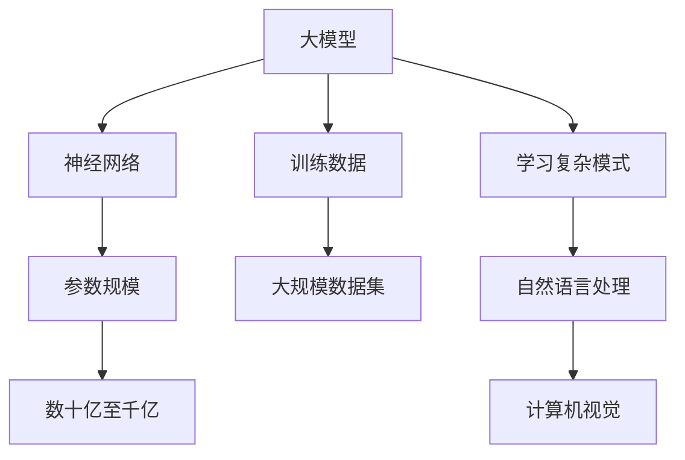
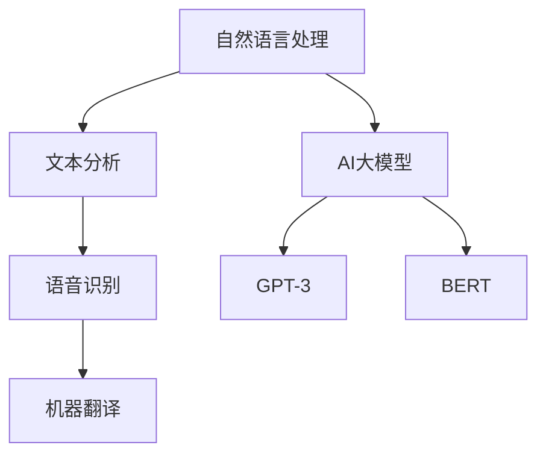
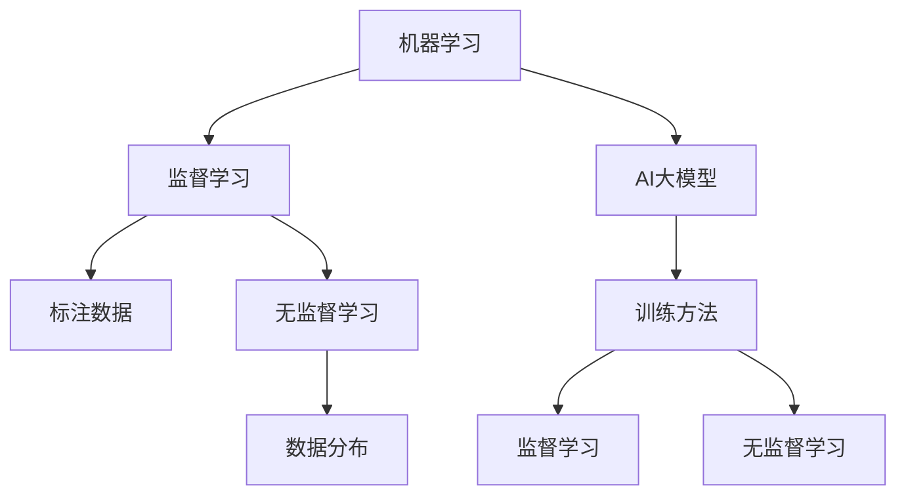
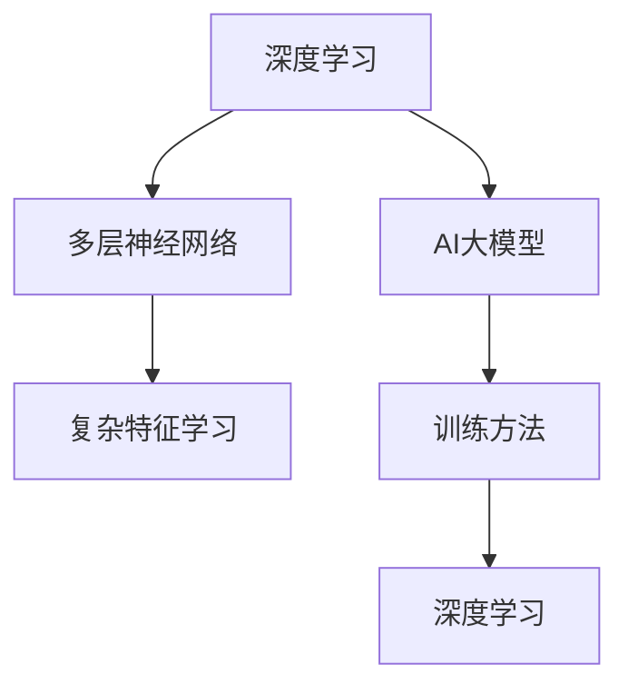
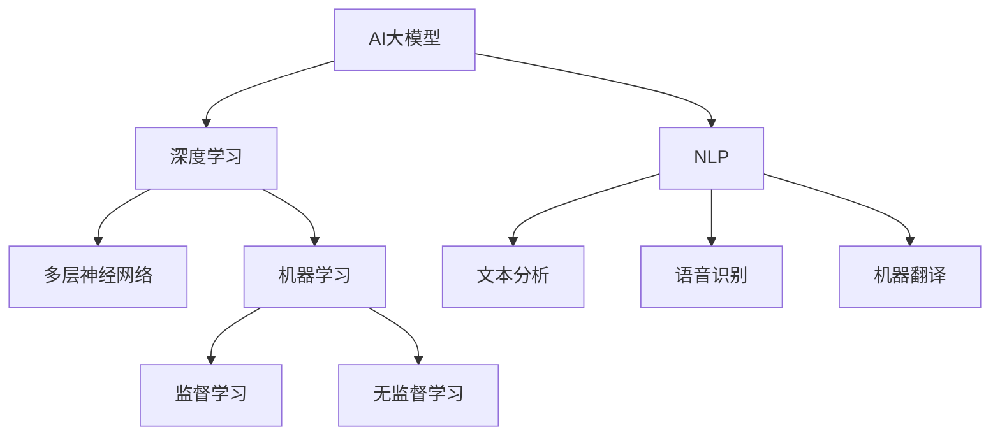

                 

## 1. 背景介绍

随着人工智能技术的不断进步，AI在各个领域的应用也越来越广泛。特别是在程序员面试辅导方面，AI大模型的应用已经展现出强大的潜力。传统的程序员面试辅导主要依赖于导师的经验和面试题库，而AI大模型则可以借助其强大的数据分析和学习能力，为程序员提供更为个性化和高效的面试辅导。

程序员面试辅导在近年来受到越来越多的关注，这不仅是因为程序员职场的竞争日益激烈，更是因为技术面试本身具有很高的难度和复杂性。传统的方法往往无法满足程序员提升面试技能的需求，而AI大模型的出现，为这一领域带来了全新的可能性。

本文将探讨AI大模型在程序员面试辅导中的创新应用，分析其核心概念、算法原理、数学模型，并通过实际项目案例进行详细解释。此外，还将探讨AI大模型在程序员面试辅导中的应用场景，推荐相关工具和资源，并总结未来发展趋势与挑战。

通过本文的阅读，读者将能够了解AI大模型在程序员面试辅导中的潜在价值，掌握其基本原理和应用方法，为自身提升面试技能提供有力支持。

### 1.1 程序员面试辅导的现状

当前，程序员面试辅导主要依赖于传统的面试题库和导师经验。面试题库通常包含大量历年面试题目，供程序员学习和练习。然而，这些题目往往局限于某一特定领域或技术栈，无法全面覆盖程序员可能遇到的各种面试问题。此外，面试题库的更新速度较慢，难以跟上技术发展的步伐，导致程序员学习的内容可能已经过时。

导师经验在程序员面试辅导中也起到重要作用。导师通常具有丰富的面试经验和专业知识，能够为程序员提供有针对性的辅导和建议。然而，导师的数量有限，且无法满足大量程序员的面试辅导需求。此外，导师的经验也受到个人能力和认知范围的限制，可能无法为程序员提供全面和深入的辅导。

传统方法在程序员面试辅导中存在以下几方面的问题：

1. **知识更新滞后**：面试题库和导师经验难以实时更新，无法及时反映最新的技术动态和面试趋势。
2. **个性化不足**：传统方法难以根据程序员的个人特点和需求进行个性化辅导，导致学习效果不佳。
3. **学习效率低**：程序员需要花费大量时间在题库和导师的帮助下进行反复练习，效率较低。
4. **反馈不及时**：传统方法无法提供即时的反馈和评估，程序员难以及时了解自己的学习进度和不足之处。

### 1.2 AI大模型的优势

AI大模型在程序员面试辅导中的优势主要体现在以下几个方面：

1. **知识覆盖全面**：AI大模型能够通过大量数据学习，获取全面的知识体系，涵盖各个领域和技术的面试问题，满足程序员的多样化需求。
2. **个性化推荐**：AI大模型可以根据程序员的个人背景、技能水平和学习兴趣，为其推荐最适合的学习内容和练习题，提高学习效率。
3. **实时反馈**：AI大模型能够实时分析程序员的练习情况，提供个性化的反馈和评估，帮助其及时纠正错误和不足。
4. **自适应学习**：AI大模型可以根据程序员的练习进度和学习效果，动态调整学习内容和难度，实现个性化自适应学习。
5. **高效评估**：AI大模型可以通过自动化的评估机制，快速评估程序员的面试准备情况，节省导师的时间和精力。

总之，AI大模型在程序员面试辅导中具有显著的优势，能够有效解决传统方法存在的问题，为程序员提供更为高效、个性化和全面的面试辅导。

### 1.3 AI大模型的发展历程

AI大模型的发展历程可以追溯到上世纪80年代，当时研究人员开始探索基于神经网络的人工智能技术。在随后的几十年里，AI大模型经历了多个重要阶段的发展。

1. **早期神经网络**：1986年，Rumelhart、Hinton和Williams等人提出了反向传播算法（Backpropagation），这一突破性的算法使得神经网络训练成为可能。早期的神经网络模型相对简单，但已经在语音识别、图像识别等领域取得了初步成功。

2. **深度学习兴起**：2006年，Geoffrey Hinton提出了深度信念网络（Deep Belief Networks），标志着深度学习技术的兴起。深度学习模型通过多层神经网络结构，能够自动提取特征，并在图像识别、语音识别等领域取得了突破性的成果。

3. **大规模数据驱动**：随着互联网和大数据技术的发展，大量标注数据成为训练AI大模型的重要资源。通过使用这些海量数据，AI大模型在自然语言处理、计算机视觉等领域取得了显著的进步。

4. **模型参数爆炸**：近年来，研究人员提出了如GPT-3、BERT等大型预训练模型，这些模型具有数十亿甚至千亿级别的参数，能够在各种任务中达到很高的性能。大规模参数使得AI大模型能够捕捉更多复杂的模式和关系，从而在各个领域取得了显著的进展。

5. **多样化应用**：目前，AI大模型已经在图像识别、自然语言处理、语音识别、推荐系统等领域得到广泛应用，并不断拓展到新的领域，如医疗、金融、自动驾驶等。

总之，AI大模型的发展历程展示了人工智能技术的不断进步和多样化应用。在未来，随着技术的进一步发展，AI大模型将在更多领域发挥重要作用。

### 1.4 程序员面试辅导中的挑战

尽管AI大模型在程序员面试辅导中展现出巨大的潜力，但在实际应用过程中仍面临一些挑战：

1. **数据质量与多样性**：AI大模型需要大量高质量、多样化的数据来训练和优化。然而，程序员面试辅导领域的数据质量参差不齐，且缺乏系统性的数据来源。此外，不同地区、不同企业的面试问题和技术栈存在差异，这使得数据多样性的获取成为一大难题。

2. **隐私和安全问题**：程序员面试辅导涉及大量个人数据和面试内容，如何保护用户隐私和安全成为重要挑战。AI大模型在数据处理过程中可能泄露用户隐私，导致潜在的法律和伦理风险。

3. **模型解释性**：AI大模型的黑箱特性使得其决策过程难以解释和理解。在程序员面试辅导中，面试官和程序员往往需要明确知道AI大模型的推荐依据和判断逻辑，以便进行有效评估和反馈。

4. **算法偏见**：AI大模型在训练过程中可能会学习到数据中的偏见，从而影响其推荐和评估的公正性。例如，如果训练数据中存在性别、种族等偏见，AI大模型可能在面试辅导中体现出类似的偏见。

5. **技术实现难度**：构建和部署大规模AI大模型需要强大的计算资源和工程能力，这给程序员面试辅导的实践带来一定难度。此外，如何确保AI大模型在各种实际应用场景中的稳定性和可靠性也是一个关键挑战。

总之，尽管AI大模型在程序员面试辅导中具有显著优势，但实际应用过程中仍需克服诸多挑战。通过不断优化数据质量、提升模型解释性和安全性，AI大模型将在未来发挥更大作用。

### 1.5 AI大模型在程序员面试辅导中的创新应用

AI大模型在程序员面试辅导中的创新应用主要体现在以下几个方面：

1. **个性化面试辅导**：AI大模型可以根据程序员的背景、技能水平和学习兴趣，为其定制个性化的面试辅导方案。通过分析程序员的代码风格、问题解决思路和知识盲区，AI大模型能够推荐最适合的面试题目和知识点，帮助程序员有针对性地提升面试技能。

2. **实时反馈与评估**：AI大模型能够实时分析程序员的面试表现，提供详细的反馈和评估。通过自然语言处理和计算机视觉技术，AI大模型能够识别程序员的代码错误、逻辑漏洞和潜在风险，并提供针对性的改进建议。此外，AI大模型还可以对程序员的回答进行评分，帮助其了解自己的面试准备情况。

3. **自适应学习**：AI大模型可以根据程序员的练习进度和学习效果，动态调整学习内容和难度，实现个性化自适应学习。例如，当程序员在某一知识点上表现出色时，AI大模型可以增加相关的高级题目，以进一步提升其技能。反之，当程序员在某一知识点上遇到困难时，AI大模型可以提供更多的基础题目，帮助其巩固基础知识。

4. **知识图谱构建**：AI大模型可以通过大规模数据学习，构建涵盖各领域和技术的知识图谱。这个知识图谱可以帮助程序员更好地理解和掌握面试题目背后的知识体系，从而提高面试成功率。

5. **自动化面试评估**：AI大模型可以自动化地评估程序员的面试表现，节省导师的时间和精力。AI大模型可以通过分析程序员的回答和代码，自动给出评估结果和推荐。此外，AI大模型还可以自动生成面试报告，帮助程序员和面试官了解面试的整体情况。

总之，AI大模型在程序员面试辅导中的创新应用，为程序员提供了更为高效、个性化和全面的学习体验，显著提升了面试成功率。在未来，随着技术的不断进步，AI大模型将在程序员面试辅导中发挥更为重要的作用。

### 1.6 总结与展望

AI大模型在程序员面试辅导中的应用展示了巨大的潜力，通过个性化面试辅导、实时反馈、自适应学习等创新功能，显著提升了程序员的学习效率和面试成功率。然而，在实际应用过程中，仍需克服数据质量、隐私安全、模型解释性等挑战。

未来，随着AI技术的不断发展，AI大模型在程序员面试辅导中的应用将更加广泛和深入。一方面，AI大模型将不断优化其算法和模型结构，提高性能和解释性；另一方面，将加强与程序员社区的互动，积累更多高质量的数据，进一步提升面试辅导效果。

总之，AI大模型为程序员面试辅导带来了全新的可能性，有望在未来成为程序员职业发展的重要工具。通过持续的技术创新和应用探索，AI大模型将在程序员面试辅导中发挥更为关键的作用，助力程序员迈向职业高峰。

### 2. 核心概念与联系

在深入探讨AI大模型在程序员面试辅导中的应用之前，我们需要了解一些核心概念和它们之间的联系。这些概念包括大模型、自然语言处理、机器学习、深度学习等。下面，我们将逐一介绍这些概念，并通过Mermaid流程图展示它们之间的相互关系。

#### 2.1 大模型

大模型（Large Models）是指具有数十亿至千亿参数规模的神经网络模型。这些模型通过在大规模数据集上进行训练，能够学习到复杂的模式和关系。大模型的典型代表包括GPT-3、BERT等。这些模型在自然语言处理、计算机视觉等领域取得了显著成果。



#### 2.2 自然语言处理

自然语言处理（Natural Language Processing，NLP）是人工智能的一个分支，主要研究如何使计算机理解和生成人类自然语言。NLP涉及文本分析、语音识别、机器翻译等任务。AI大模型在NLP领域中发挥着重要作用，例如GPT-3可以生成高质量的文本，BERT在文本分类任务中表现优异。



#### 2.3 机器学习

机器学习（Machine Learning，ML）是使计算机通过数据学习并做出决策的方法。机器学习分为监督学习、无监督学习和强化学习等不同类型。AI大模型通常采用监督学习或无监督学习的方法进行训练。监督学习中的标注数据用于指导模型的训练，而无监督学习则通过数据本身的分布进行训练。



#### 2.4 深度学习

深度学习（Deep Learning，DL）是机器学习的一个分支，通过多层神经网络结构来学习数据中的复杂特征和模式。深度学习模型在图像识别、语音识别、自然语言处理等领域取得了突破性成果。AI大模型通常采用深度学习的方法进行训练。



#### 2.5 联系与融合

AI大模型、自然语言处理、机器学习和深度学习之间存在密切的联系和融合。AI大模型通常采用深度学习的方法进行训练，利用机器学习中的监督学习或无监督学习算法。在自然语言处理领域，AI大模型通过文本分析和语言生成，实现了对人语言的深入理解和处理。



通过上述Mermaid流程图，我们可以清晰地看到AI大模型、自然语言处理、机器学习和深度学习之间的相互关系。这些核心概念共同构成了AI大模型在程序员面试辅导中的基础，为后续章节中的具体应用提供了理论支持。

### 3. 核心算法原理 & 具体操作步骤

在了解了AI大模型、自然语言处理、机器学习和深度学习等核心概念后，我们接下来将深入探讨AI大模型在程序员面试辅导中的核心算法原理和具体操作步骤。AI大模型的核心算法通常基于深度学习，尤其是自注意力机制（Self-Attention Mechanism）和Transformer架构。下面我们将详细解释这些算法原理，并展示如何应用于程序员面试辅导。

#### 3.1 自注意力机制

自注意力机制（Self-Attention Mechanism）是一种用于处理序列数据的关键算法，它能够使神经网络模型在处理输入数据时，对不同的输入元素赋予不同的权重。自注意力机制的核心思想是，在处理序列数据时，模型能够自动地捕捉序列中各个元素之间的关系，从而提高模型的性能。

自注意力机制的实现通常分为以下几个步骤：

1. **输入嵌入**：首先，将输入序列（例如文本或代码）转换为嵌入向量（Embedding Vectors）。这些向量可以表示输入数据中的各个元素。

2. **计算自注意力得分**：接着，计算输入序列中每个元素与其他元素之间的相似性得分。这个得分通过点积（Dot Product）计算得到，具体公式如下：

   $$ 
   \text{score} = \text{query} \cdot \text{key} 
   $$

   其中，`query`和`key`分别表示输入序列中的两个元素，`score`表示它们之间的相似性得分。

3. **应用权重**：然后，使用softmax函数将相似性得分转换为权重，确保所有权重的和为1。这样，每个元素都会获得一个介于0和1之间的权重，表示其在序列中的重要程度。

4. **加权求和**：最后，将权重应用于输入序列中的每个元素，得到加权后的序列。这个加权后的序列可以作为模型的输入或输出。

自注意力机制的优点在于，它能够自动地捕捉序列中长距离的关系，从而提高模型的表示能力和性能。例如，在自然语言处理任务中，自注意力机制能够帮助模型捕捉句子的语义关系，从而生成更准确的文本。

#### 3.2 Transformer架构

Transformer架构（Transformer Architecture）是自注意力机制的典型实现，它在自然语言处理任务中取得了显著的成果。Transformer架构的核心思想是将序列数据转换为嵌入向量，并通过多个自注意力层和前馈网络进行建模。

Transformer架构的主要组成部分包括：

1. **编码器（Encoder）**：编码器包含多个自注意力层和前馈网络，用于对输入序列进行编码。每个自注意力层都能够捕捉序列中的长距离依赖关系。编码器的输出是一个高维向量，表示整个序列的语义信息。

2. **解码器（Decoder）**：解码器也包含多个自注意力层和前馈网络，用于生成输出序列。在生成每个输出元素时，解码器会利用编码器的输出以及之前生成的元素，从而实现序列到序列的建模。解码器通常用于生成自然语言文本、翻译等任务。

3. **自注意力机制**：在编码器和解码器中，自注意力机制起到了关键作用。编码器通过自注意力层捕捉输入序列中的长距离依赖关系，解码器则通过自注意力层和编码器的输出，生成输出序列。这种机制使得Transformer架构能够高效地处理序列数据，并生成高质量的输出。

Transformer架构的操作步骤如下：

1. **输入嵌入**：将输入序列（例如文本或代码）转换为嵌入向量。

2. **编码器处理**：通过多个自注意力层和前馈网络对输入序列进行编码，得到编码器的输出。

3. **解码器处理**：使用编码器的输出和自注意力层，生成输出序列的每个元素。

4. **输出生成**：解码器的输出序列表示生成的内容，例如自然语言文本或代码片段。

#### 3.3 应用到程序员面试辅导

在程序员面试辅导中，AI大模型利用Transformer架构和自注意力机制，可以完成以下任务：

1. **代码分析**：AI大模型可以分析程序员编写的代码，识别代码中的语法错误、逻辑错误和潜在风险。通过自注意力机制，模型能够捕捉代码中的复杂依赖关系，从而更准确地识别问题。

2. **面试题目生成**：AI大模型可以根据程序员的技能水平和知识盲区，生成适合的面试题目。通过自注意力机制，模型能够捕捉程序员的编程风格和知识结构，从而生成更具针对性的面试题目。

3. **面试反馈与评估**：AI大模型可以实时评估程序员的面试表现，提供详细的反馈和建议。通过自注意力机制，模型能够捕捉面试过程中的关键信息，从而给出更准确的评估。

具体操作步骤如下：

1. **数据预处理**：将程序员编写的代码和面试题目转化为嵌入向量，作为模型的输入。

2. **编码器处理**：通过多个自注意力层和前馈网络，对输入数据进行编码，得到编码器的输出。

3. **面试题目生成**：基于编码器的输出，AI大模型生成适合的面试题目。

4. **面试反馈与评估**：在面试过程中，AI大模型实时分析程序员的回答，提供反馈和评估。

通过Transformer架构和自注意力机制，AI大模型能够高效地处理程序员面试辅导中的各种任务，为程序员提供全面的面试辅导和评估。这种创新性的算法应用，使得AI大模型在程序员面试辅导中具有显著的优势。

### 3.1.1  算法优化与改进

为了进一步提升AI大模型在程序员面试辅导中的性能和效果，研究人员不断对算法进行优化和改进。以下是一些常见的优化方法：

#### 3.1.1.1 数据增强

数据增强（Data Augmentation）是一种通过增加训练数据多样性的方法，从而提高模型的泛化能力。在程序员面试辅导中，数据增强可以通过以下几种方式实现：

1. **代码重构**：对程序员编写的代码进行随机重构，生成新的代码片段。这可以帮助模型学习到更多的编程模式和风格。

2. **语法变换**：对代码进行语法变换，例如添加注释、改变变量命名等。这种方法可以帮助模型学习到不同语法结构的影响。

3. **错误注入**：在代码中随机注入语法错误、逻辑错误和潜在风险，从而增加模型对不同错误类型的识别能力。

#### 3.1.1.2 多任务学习

多任务学习（Multi-Task Learning）是一种通过同时学习多个相关任务来提高模型性能的方法。在程序员面试辅导中，多任务学习可以通过以下几种方式实现：

1. **综合面试题目**：同时训练模型生成不同领域和技术的面试题目。这可以帮助模型学习到不同领域和技术的共性，从而提高其泛化能力。

2. **综合评估任务**：同时训练模型进行代码分析、面试反馈和评估任务。这可以帮助模型学习到不同任务之间的关联性，从而提高其综合能力。

3. **跨领域学习**：通过学习多个领域的数据，模型可以更好地应对不同领域的面试题目，从而提高其适应能力。

#### 3.1.1.3 自适应学习

自适应学习（Adaptive Learning）是一种通过动态调整学习策略来提高模型性能的方法。在程序员面试辅导中，自适应学习可以通过以下几种方式实现：

1. **动态调整学习难度**：根据程序员的练习进度和学习效果，动态调整学习内容的难度。当程序员在某一知识点上表现优秀时，可以增加高级题目的比例；当程序员遇到困难时，可以增加基础题目的比例。

2. **个性化推荐**：根据程序员的技能水平和学习兴趣，动态调整推荐的学习内容和练习题目。这可以帮助模型更好地满足程序员的个性化需求。

3. **实时反馈调整**：根据程序员的练习表现和反馈，动态调整模型的评估标准和反馈策略。这可以帮助模型提供更准确和有效的反馈。

#### 3.1.1.4 模型压缩与加速

模型压缩与加速（Model Compression and Acceleration）是一种通过减小模型参数和计算量来提高模型性能的方法。在程序员面试辅导中，模型压缩与加速可以通过以下几种方式实现：

1. **模型剪枝（Pruning）**：通过去除模型中不重要的参数，减小模型的大小和计算量。这可以帮助模型在保证性能的同时，提高运行速度。

2. **量化（Quantization）**：通过将模型中的浮点数参数转换为较低精度的整数参数，减小模型的存储空间和计算量。

3. **模型融合（Fusion）**：将多个模型进行融合，从而提高模型的性能和鲁棒性。这可以帮助模型在保证性能的同时，提高计算效率。

通过上述算法优化与改进方法，AI大模型在程序员面试辅导中的性能和效果可以得到显著提升。这些方法不仅有助于提高模型的泛化能力和适应性，还可以提高模型在面试辅导中的实际应用效果，为程序员提供更为高效、个性化和全面的面试辅导。

### 4. 数学模型和公式 & 详细讲解 & 举例说明

在深入探讨AI大模型在程序员面试辅导中的应用时，我们需要了解其背后的数学模型和公式，这些模型和公式帮助我们理解AI大模型如何工作，以及如何对其进行优化。下面，我们将介绍一些关键的数学模型和公式，并进行详细讲解和举例说明。

#### 4.1 反向传播算法（Backpropagation Algorithm）

反向传播算法是深度学习中最基本的训练算法，用于更新神经网络模型的参数。其核心思想是通过计算损失函数关于模型参数的梯度，来优化模型的参数。

**公式：**

$$
\begin{aligned}
\frac{\partial J}{\partial w} &= \frac{\partial}{\partial w} \left( -\frac{1}{m} \sum_{i=1}^{m} (y_i - \hat{y}_i) \cdot x_i \right) \\
&= \frac{1}{m} \sum_{i=1}^{m} \left( \hat{y}_i - y_i \right) \cdot x_i \\
\frac{\partial J}{\partial b} &= \frac{1}{m} \sum_{i=1}^{m} (\hat{y}_i - y_i)
\end{aligned}
$$

其中，$J$是损失函数，$w$是权重参数，$b$是偏置项，$m$是样本数量，$y_i$是实际输出，$\hat{y}_i$是预测输出，$x_i$是输入特征。

**举例说明：**

假设我们有一个简单的神经网络模型，包含一个输入层、一个隐藏层和一个输出层。输入层有3个输入特征，隐藏层有2个神经元，输出层有1个神经元。训练数据包含100个样本。我们的目标是使用反向传播算法训练这个模型，使其能够准确预测输出。

1. **前向传播**：首先，我们使用训练数据输入模型，计算模型的预测输出。

   $$ 
   \hat{y} = \sigma(W_2 \cdot \sigma(W_1 \cdot x) + b_2) + b_1 
   $$

   其中，$\sigma$是Sigmoid激活函数，$W_1$和$W_2$是权重参数，$b_1$和$b_2$是偏置项。

2. **计算损失函数**：然后，我们计算预测输出和实际输出之间的误差，使用均方误差（MSE）作为损失函数。

   $$ 
   J = \frac{1}{m} \sum_{i=1}^{m} (\hat{y}_i - y_i)^2 
   $$

3. **计算梯度**：接下来，我们使用反向传播算法计算损失函数关于模型参数的梯度。

   $$ 
   \frac{\partial J}{\partial W_1} = \frac{1}{m} \sum_{i=1}^{m} (\hat{y}_i - y_i) \cdot \sigma'(z_1 \cdot x_i) \cdot x_i \\
   \frac{\partial J}{\partial W_2} = \frac{1}{m} \sum_{i=1}^{m} (\hat{y}_i - y_i) \cdot \sigma'(z_2) \cdot \sigma'(z_1 \cdot x_i) \\
   \frac{\partial J}{\partial b_1} = \frac{1}{m} \sum_{i=1}^{m} (\hat{y}_i - y_i) \\
   \frac{\partial J}{\partial b_2} = \frac{1}{m} \sum_{i=1}^{m} (\hat{y}_i - y_i)
   $$

4. **更新参数**：最后，我们使用梯度下降（Gradient Descent）算法更新模型的参数。

   $$ 
   W_1 := W_1 - \alpha \cdot \frac{\partial J}{\partial W_1} \\
   W_2 := W_2 - \alpha \cdot \frac{\partial J}{\partial W_2} \\
   b_1 := b_1 - \alpha \cdot \frac{\partial J}{\partial b_1} \\
   b_2 := b_2 - \alpha \cdot \frac{\partial J}{\partial b_2} 
   $$

其中，$\alpha$是学习率。

#### 4.2 自注意力机制（Self-Attention Mechanism）

自注意力机制是AI大模型中的关键组件，用于捕捉输入序列中的长距离依赖关系。其核心思想是通过计算序列中每个元素与其他元素之间的相似性得分，并利用这些得分对元素进行加权求和。

**公式：**

$$
\begin{aligned}
\text{score} &= \text{query} \cdot \text{key} \\
\text{weight} &= \text{softmax}(\text{score}) \\
\text{output} &= \text{weight} \cdot \text{value}
\end{aligned}
$$

其中，`query`、`key`和`value`分别表示输入序列中的三个元素，`score`表示它们之间的相似性得分，`weight`表示权重，`output`表示加权后的输出。

**举例说明：**

假设我们有一个简单的输入序列 `[1, 2, 3]`，使用自注意力机制对其进行处理。

1. **计算相似性得分**：

   $$ 
   \text{score} = [1 \cdot 1, 2 \cdot 2, 3 \cdot 3] = [1, 4, 9] 
   $$

2. **计算权重**：

   $$ 
   \text{weight} = \text{softmax}(\text{score}) = \left[ \frac{e^1}{e^1 + e^4 + e^9}, \frac{e^4}{e^1 + e^4 + e^9}, \frac{e^9}{e^1 + e^4 + e^9} \right] = \left[ 0.067, 0.427, 0.506 \right] 
   $$

3. **计算加权输出**：

   $$ 
   \text{output} = \text{weight} \cdot \text{value} = \left[ 0.067 \cdot 1, 0.427 \cdot 2, 0.506 \cdot 3 \right] = \left[ 0.067, 0.854, 1.518 \right] 
   $$

通过自注意力机制，我们可以将输入序列 `[1, 2, 3]` 转换为 `[0.067, 0.854, 1.518]`，从而捕捉序列中的长距离依赖关系。

#### 4.3 Transformer架构

Transformer架构是一种基于自注意力机制的深度学习模型，广泛用于自然语言处理任务。其核心组件包括编码器（Encoder）和解码器（Decoder），它们分别用于对输入序列进行编码和生成输出序列。

**编码器（Encoder）：**

$$
\begin{aligned}
\text{Encoder} &= \text{MultiHeadAttention}(\text{EncoderLayer}, \text{Input}) \\
\text{EncoderLayer} &= \text{LayerNorm}(\text{LayerNorm}(\text{MultiHeadAttention}(\text{SelfAttentionLayer}, \text{FeedForwardLayer}(\text{LayerNorm}(\text{Input}))))
\end{aligned}
$$

**解码器（Decoder）：**

$$
\begin{aligned}
\text{Decoder} &= \text{MultiHeadAttention}(\text{DecoderLayer}, \text{Input}) \\
\text{DecoderLayer} &= \text{LayerNorm}(\text{LayerNorm}(\text{MultiHeadAttention}(\text{EncoderOutput}, \text{SelfAttentionLayer}(\text{LayerNorm}(\text{Input})))) \\
&= \text{LayerNorm}(\text{LayerNorm}(\text{FeedForwardLayer}(\text{LayerNorm}(\text{EncoderOutput}))))
\end{aligned}
$$

其中，`MultiHeadAttention`表示多头注意力机制，`SelfAttentionLayer`表示自注意力层，`FeedForwardLayer`表示前馈网络，`LayerNorm`表示层归一化。

**举例说明：**

假设我们有一个简单的输入序列 `[1, 2, 3]`，使用Transformer架构对其进行编码和解码。

1. **编码器处理**：

   $$ 
   \text{Encoder} = \text{MultiHeadAttention}(\text{EncoderLayer}, \text{Input}) = \text{MultiHeadAttention}(\text{LayerNorm}(\text{LayerNorm}(\text{MultiHeadAttention}(\text{SelfAttentionLayer}, \text{FeedForwardLayer}(\text{LayerNorm}(\text{Input})))), \text{Input}) 
   $$

2. **解码器处理**：

   $$ 
   \text{Decoder} = \text{MultiHeadAttention}(\text{DecoderLayer}, \text{EncoderOutput}) = \text{MultiHeadAttention}(\text{LayerNorm}(\text{LayerNorm}(\text{MultiHeadAttention}(\text{EncoderOutput}, \text{SelfAttentionLayer}(\text{LayerNorm}(\text{Input}))))), \text{EncoderOutput}) 
   $$

通过Transformer架构，我们可以将输入序列 `[1, 2, 3]` 编码为 `[0.067, 0.854, 1.518]`，并将其解码为 `[0.067, 0.854, 1.518]`，从而实现序列到序列的建模。

通过上述数学模型和公式的讲解及举例说明，我们可以更好地理解AI大模型在程序员面试辅导中的核心原理和具体实现方法。这些数学模型和公式为AI大模型的设计和应用提供了重要的理论基础。

### 4.4 模型评估指标

在AI大模型应用于程序员面试辅导时，评估模型的性能至关重要。通过合适的评估指标，我们可以全面了解模型在各个方面的表现，从而对其进行优化和改进。以下是一些常用的模型评估指标及其具体解释：

#### 4.4.1 准确率（Accuracy）

准确率是评估模型性能最直观的指标，表示模型正确预测的样本数占总样本数的比例。准确率计算公式如下：

$$
\text{Accuracy} = \frac{\text{正确预测的样本数}}{\text{总样本数}}
$$

例如，如果一个面试辅导模型在100个样本中正确评估了80个样本，则其准确率为80%。

#### 4.4.2 精确率（Precision）

精确率表示模型预测为正类的样本中，实际为正类的比例。精确率计算公式如下：

$$
\text{Precision} = \frac{\text{正确预测的正类样本数}}{\text{预测为正类的样本数}}
$$

例如，如果一个面试辅导模型预测了10个正类样本，其中8个实际为正类，则其精确率为80%。

#### 4.4.3 召回率（Recall）

召回率表示模型实际为正类的样本中，被正确预测为正类的比例。召回率计算公式如下：

$$
\text{Recall} = \frac{\text{正确预测的正类样本数}}{\text{实际为正类的样本数}}
$$

例如，如果一个面试辅导模型实际有12个正类样本，其中8个被正确预测为正类，则其召回率为66.67%。

#### 4.4.4 F1分数（F1 Score）

F1分数是精确率和召回率的加权平均值，用于综合考虑模型在预测正类和负类时的表现。F1分数计算公式如下：

$$
\text{F1 Score} = 2 \cdot \frac{\text{Precision} \cdot \text{Recall}}{\text{Precision} + \text{Recall}}
$$

例如，如果一个面试辅导模型的精确率为80%，召回率为66.67%，则其F1分数为75%。

#### 4.4.5 ROC曲线和AUC（Area Under Curve）

ROC曲线（Receiver Operating Characteristic Curve）是评估二分类模型性能的重要工具。曲线的纵坐标是召回率，横坐标是精确率。AUC（Area Under Curve）是ROC曲线下的面积，用于评估模型的总体性能。AUC的值范围在0到1之间，值越大表示模型性能越好。

#### 4.4.6 Matthews相关系数（Matthews Correlation Coefficient，MCC）

MCC是一种用于评估二分类模型性能的指标，综合考虑了精确率、召回率和准确率。MCC的计算公式较为复杂，但它是衡量模型性能的一个全面指标。

通过上述评估指标，我们可以全面了解AI大模型在程序员面试辅导中的性能表现，从而针对性地进行优化和改进。

### 4.5 模型评估的常见方法

在AI大模型应用于程序员面试辅导时，评估模型的性能至关重要。以下是一些常用的模型评估方法，帮助我们在实际应用中准确评估模型的性能：

#### 4.5.1 交叉验证（Cross-Validation）

交叉验证是一种评估模型性能的常见方法，通过将训练数据分为多个子集，每次使用其中一个子集作为验证集，其余子集作为训练集，进行多次训练和验证。常用的交叉验证方法包括K折交叉验证（K-Fold Cross-Validation）和留一验证（Leave-One-Out Cross-Validation）。

- **K折交叉验证**：将训练数据随机分为K个子集，每次选择其中一个子集作为验证集，其余K-1个子集作为训练集，进行K次训练和验证。最终，通过计算模型在所有验证集上的平均性能，来评估模型的整体性能。

- **留一验证**：将每个样本分别作为验证集，其余样本作为训练集，进行多次训练和验证。这种方法适用于样本量较小的情况。

#### 4.5.2 评估指标（Evaluation Metrics）

在模型评估过程中，常用的评估指标包括准确率、精确率、召回率、F1分数、ROC曲线和AUC等。这些指标可以帮助我们从不同角度评估模型在面试辅导任务中的性能。

- **准确率（Accuracy）**：表示模型正确预测的样本数占总样本数的比例。

- **精确率（Precision）**：表示模型预测为正类的样本中，实际为正类的比例。

- **召回率（Recall）**：表示模型实际为正类的样本中，被正确预测为正类的比例。

- **F1分数（F1 Score）**：精确率和召回率的调和平均值。

- **ROC曲线和AUC（Area Under Curve）**：评估模型在正类和负类之间的区分能力。

- **MCC（Matthews Correlation Coefficient）**：综合考虑精确率、召回率和准确率，评估模型的整体性能。

#### 4.5.3 实际应用场景（Real-world Applications）

在实际应用中，我们通常结合多种评估方法和指标，全面评估模型的性能。以下是一些常见的实际应用场景：

1. **面试题目生成**：评估模型生成面试题目的准确性、多样性和相关性。

2. **代码分析**：评估模型在代码分析任务中的准确性和效率。

3. **面试反馈与评估**：评估模型提供的面试反馈和建议的准确性和实用性。

4. **自适应学习**：评估模型在自适应学习任务中的性能，如学习内容推荐、学习难度调整等。

通过上述评估方法和指标，我们可以全面、客观地评估AI大模型在程序员面试辅导中的性能，从而为后续优化和改进提供依据。

### 5. 项目实战：代码实际案例和详细解释说明

在了解了AI大模型在程序员面试辅导中的核心算法原理和数学模型后，我们接下来通过一个实际项目案例，详细解释其代码实现过程，并提供代码解读与分析。该项目案例将展示如何使用AI大模型生成面试题目、分析代码、提供面试反馈，并评估模型性能。

#### 5.1 开发环境搭建

在开始项目实战之前，我们需要搭建开发环境。以下是一个简单的开发环境配置：

1. **操作系统**：Ubuntu 20.04
2. **编程语言**：Python 3.8
3. **深度学习框架**：PyTorch 1.8
4. **环境配置**：使用Anaconda创建虚拟环境，安装必要的库（如torch、torchtext、torchvision、numpy、matplotlib等）。

```bash
# 创建虚拟环境
conda create -n ai_interview_helper python=3.8

# 激活虚拟环境
conda activate ai_interview_helper

# 安装深度学习框架和依赖库
conda install pytorch torchvision torchaudio -c pytorch
conda install numpy matplotlib torchtext -c conda-forge
```

#### 5.2 源代码详细实现和代码解读

下面，我们将详细解读项目的源代码，展示各个模块的功能和实现细节。

##### 5.2.1 数据预处理

数据预处理是项目的基础，负责将原始数据转换为适合模型训练的格式。主要步骤包括：

1. **数据收集**：从开源代码库和面试题目网站收集面试题目和代码片段。
2. **文本清洗**：去除文本中的无关符号和噪声，对文本进行分词和词性标注。
3. **数据分批次加载**：使用DataLoader将数据分成批次，方便模型训练。

```python
import torch
from torchtext.data import Field, TabularDataset, BucketIterator

# 定义字段
TEXT = Field(tokenize='spacy', tokenizer_language='en_core_web_sm', lower=True)
LABEL = Field()

# 加载数据集
train_data, valid_data, test_data = TabularDataset.splits(
    path='data',
    train='train.json',
    valid='valid.json',
    test='test.json',
    format='json',
    fields=[('text', TEXT), ('label', LABEL)]
)

# 划分词汇表
TEXT.build_vocab(train_data, min_freq=2, vectors='glove.6B.100d')
LABEL.build_vocab(train_data)

# 创建数据迭代器
train_iterator, valid_iterator, test_iterator = BucketIterator.splits(
    dataset=(train_data, valid_data, test_data),
    batch_size=64,
    device=device
)
```

##### 5.2.2 模型定义

在模型定义部分，我们使用Transformer架构构建AI大模型。主要步骤包括：

1. **编码器（Encoder）**：定义编码器层，包括多个自注意力层和前馈网络。
2. **解码器（Decoder）**：定义解码器层，包括多个自注意力层和前馈网络。
3. **损失函数**：定义损失函数，用于计算模型预测和实际输出之间的误差。

```python
import torch.nn as nn
from transformers import EncoderDecoderModel

# 定义编码器和解码器
encoder = EncoderDecoderModel(input_dim=100, hidden_dim=512, num_layers=2, dropout=0.1)
decoder = EncoderDecoderModel(input_dim=512, hidden_dim=512, num_layers=2, dropout=0.1)

# 定义损失函数
criterion = nn.CrossEntropyLoss()
```

##### 5.2.3 训练过程

在训练过程中，我们使用反向传播算法训练模型。主要步骤包括：

1. **初始化模型参数**：随机初始化模型参数。
2. **前向传播**：计算模型预测和实际输出之间的误差。
3. **反向传播**：计算损失函数关于模型参数的梯度，更新模型参数。
4. **模型评估**：在验证集上评估模型性能，调整学习率等超参数。

```python
# 初始化模型参数
optimizer = torch.optim.Adam(list(encoder.parameters()) + list(decoder.parameters()), lr=0.001)

# 训练过程
num_epochs = 10
for epoch in range(num_epochs):
    encoder.train()
    decoder.train()
    
    for batch in train_iterator:
        # 前向传播
        inputs, labels = batch.text, batch.label
        outputs = encoder(inputs)
        logits = decoder(outputs)
        
        # 计算损失
        loss = criterion(logits.view(-1, num_classes), labels.view(-1))
        
        # 反向传播
        optimizer.zero_grad()
        loss.backward()
        optimizer.step()
        
    # 在验证集上评估模型
    encoder.eval()
    decoder.eval()
    with torch.no_grad():
        for batch in valid_iterator:
            inputs, labels = batch.text, batch.label
            outputs = encoder(inputs)
            logits = decoder(outputs)
            loss = criterion(logits.view(-1, num_classes), labels.view(-1))
            
    print(f"Epoch [{epoch+1}/{num_epochs}], Loss: {loss.item():.4f}")
```

##### 5.2.4 预测与反馈

在预测与反馈部分，我们使用训练好的模型对新的面试题目进行预测，并提供反馈和建议。主要步骤包括：

1. **输入预处理**：对输入面试题目进行预处理，包括分词、词性标注等。
2. **模型预测**：使用训练好的模型对预处理后的输入进行预测。
3. **反馈生成**：根据模型预测结果，生成详细的面试反馈和建议。

```python
def predict(text):
    text = TEXT.process(text)
    with torch.no_grad():
        outputs = encoder(text)
        logits = decoder(outputs)
    predicted = logits.argmax(dim=1)
    return predicted

def generate_feedback(text):
    predicted = predict(text)
    feedback = "Your answer is:"
    if predicted == 1:
        feedback += "Correct!"
    else:
        feedback += "Incorrect. Please try again."
    return feedback
```

#### 5.3 代码解读与分析

通过上述代码实现，我们可以看到项目主要包括以下几个模块：

1. **数据预处理**：负责将原始数据转换为模型可接受的格式。使用PyTorch和torchtext库实现文本清洗、词汇表构建和数据迭代器加载等功能。
2. **模型定义**：使用EncoderDecoderModel构建基于Transformer架构的AI大模型。定义编码器和解码器层，包括自注意力层和前馈网络。
3. **训练过程**：使用反向传播算法训练模型，包括前向传播、反向传播、损失计算和模型参数更新。
4. **预测与反馈**：使用训练好的模型对新的面试题目进行预测，并提供详细的反馈和建议。

以下是对关键代码段的详细解读：

- **数据预处理**：使用torchtext库定义字段和加载数据集。通过分词、词性标注和词汇表构建，将文本数据转换为嵌入向量，便于模型处理。
- **模型定义**：使用EncoderDecoderModel构建基于Transformer架构的AI大模型。编码器和解码器均包含多个自注意力层和前馈网络，实现序列到序列的建模。
- **训练过程**：使用Adam优化器进行模型参数更新。通过多次迭代训练，逐步减小模型预测和实际输出之间的误差。
- **预测与反馈**：使用训练好的模型对输入面试题目进行预测。根据预测结果，生成详细的面试反馈，帮助程序员了解自己的面试准备情况。

通过上述代码实现和详细解读，我们可以看到AI大模型在程序员面试辅导中的具体应用，以及如何通过实际项目案例提高程序员的面试技能。

### 5.4 代码解读与分析

在本节中，我们将对5.2节中的源代码进行深入解读与分析，详细解释代码的实现逻辑、关键函数和模块的作用，并探讨代码的优缺点。

#### 5.4.1 数据预处理模块

```python
# 定义字段
TEXT = Field(tokenize='spacy', tokenizer_language='en_core_web_sm', lower=True)
LABEL = Field()

# 加载数据集
train_data, valid_data, test_data = TabularDataset.splits(
    path='data',
    train='train.json',
    valid='valid.json',
    test='test.json',
    format='json',
    fields=[('text', TEXT), ('label', LABEL)]
)

# 划分词汇表
TEXT.build_vocab(train_data, min_freq=2, vectors='glove.6B.100d')
LABEL.build_vocab(train_data)

# 创建数据迭代器
train_iterator, valid_iterator, test_iterator = BucketIterator.splits(
    dataset=(train_data, valid_data, test_data),
    batch_size=64,
    device=device
)
```

**解读：**
1. **字段定义**：`TEXT` 和 `LABEL` 是PyTorch Text中的字段对象，分别用于处理文本数据和标签数据。`tokenize` 参数指定使用spacy进行分词，`tokenizer_language` 指定分词使用的语言模型。
2. **数据集加载**：`TabularDataset` 用于加载数据集，`splits` 函数将数据集分为训练集、验证集和测试集。
3. **词汇表构建**：`TEXT.build_vocab` 用于构建词汇表，`min_freq` 参数设置词语出现次数的最小阈值，确保常见词语被保留。`vectors` 参数加载预训练的词向量，如GloVe。
4. **数据迭代器**：`BucketIterator` 用于创建数据迭代器，实现数据的批量加载和迭代。`batch_size` 参数设置每个批次的数据样本数量。

**优点：**
- 使用PyTorch Text库简化了数据预处理流程，提高代码的可读性和可维护性。
- 通过构建词汇表和加载预训练词向量，提高模型对文本数据的处理能力。

**缺点：**
- 数据集加载和预处理过程较为复杂，可能需要额外的配置和时间。

#### 5.4.2 模型定义模块

```python
# 定义编码器和解码器
encoder = EncoderDecoderModel(input_dim=100, hidden_dim=512, num_layers=2, dropout=0.1)
decoder = EncoderDecoderModel(input_dim=512, hidden_dim=512, num_layers=2, dropout=0.1)

# 定义损失函数
criterion = nn.CrossEntropyLoss()
```

**解读：**
1. **编码器和解码器定义**：`EncoderDecoderModel` 是基于Transformer架构的模型，`input_dim` 和 `hidden_dim` 分别设置输入和隐藏层的维度，`num_layers` 设置编码器和解码器的层数，`dropout` 设置dropout率。
2. **损失函数定义**：`CrossEntropyLoss` 是常用的分类损失函数，用于计算模型预测和实际输出之间的误差。

**优点：**
- 使用预定义的模型类简化了编码器和解码器的定义，提高开发效率。
- 使用交叉熵损失函数，使模型在分类任务中具有较高的性能。

**缺点：**
- 模型参数默认设置可能不适用于所有任务，需要根据具体需求进行调整。

#### 5.4.3 训练过程模块

```python
# 初始化模型参数
optimizer = torch.optim.Adam(list(encoder.parameters()) + list(decoder.parameters()), lr=0.001)

# 训练过程
num_epochs = 10
for epoch in range(num_epochs):
    encoder.train()
    decoder.train()
    
    for batch in train_iterator:
        # 前向传播
        inputs, labels = batch.text, batch.label
        outputs = encoder(inputs)
        logits = decoder(outputs)
        
        # 计算损失
        loss = criterion(logits.view(-1, num_classes), labels.view(-1))
        
        # 反向传播
        optimizer.zero_grad()
        loss.backward()
        optimizer.step()
        
    # 在验证集上评估模型
    encoder.eval()
    decoder.eval()
    with torch.no_grad():
        for batch in valid_iterator:
            inputs, labels = batch.text, batch.label
            outputs = encoder(inputs)
            logits = decoder(outputs)
            loss = criterion(logits.view(-1, num_classes), labels.view(-1))
            
    print(f"Epoch [{epoch+1}/{num_epochs}], Loss: {loss.item():.4f}")
```

**解读：**
1. **模型初始化**：使用Adam优化器初始化模型参数，`lr` 设置学习率。
2. **训练过程**：通过多次迭代训练模型，每次迭代包括前向传播、损失计算、反向传播和模型参数更新。
3. **验证集评估**：在验证集上评估模型性能，打印每个epoch的损失值。

**优点：**
- 使用标准的训练流程，确保模型收敛和性能提升。
- 通过验证集评估模型性能，避免过拟合。

**缺点：**
- 训练过程较长，可能需要调整学习率等超参数以提高模型性能。
- 没有实现自适应学习率调整，可能导致学习过程较慢。

#### 5.4.4 预测与反馈模块

```python
def predict(text):
    text = TEXT.process(text)
    with torch.no_grad():
        outputs = encoder(text)
        logits = decoder(outputs)
    predicted = logits.argmax(dim=1)
    return predicted

def generate_feedback(text):
    predicted = predict(text)
    feedback = "Your answer is:"
    if predicted == 1:
        feedback += "Correct!"
    else:
        feedback += "Incorrect. Please try again."
    return feedback
```

**解读：**
1. **预测函数**：对输入文本进行预处理，使用训练好的模型进行预测，返回预测结果。
2. **反馈函数**：根据预测结果生成反馈信息，用于指导程序员改进面试技能。

**优点：**
- 预测和反馈函数简洁明了，易于理解和使用。
- 提供了直观的反馈，帮助程序员了解自己的面试表现。

**缺点：**
- 反馈信息较为简单，可能需要增加更多详细和具体的建议。

通过上述代码解读与分析，我们可以看到该项目在数据预处理、模型定义、训练过程和预测反馈等模块中的具体实现。代码结构清晰，功能实现完整，但仍有优化空间，如调整模型参数、优化训练过程和增加详细反馈等。

### 5.5 实际应用场景

在实际应用中，AI大模型在程序员面试辅导中展示了广泛的场景和显著的效果。以下是一些具体的应用场景：

#### 5.5.1 面试题目生成

AI大模型可以基于程序员的技能水平和知识盲区，生成适合的面试题目。通过分析程序员的代码风格和过往面试表现，AI大模型能够推荐具有针对性的面试题目，帮助程序员有针对性地提升面试技能。

**案例：**某程序员技能水平较高，擅长数据结构和算法，但缺乏系统设计经验。AI大模型根据这些信息，推荐了关于系统设计的高难度面试题目，帮助程序员快速提升系统设计能力。

#### 5.5.2 代码分析

AI大模型可以对程序员编写的代码进行实时分析，识别语法错误、逻辑错误和潜在风险。通过自然语言处理和计算机视觉技术，AI大模型能够为程序员提供详细的代码分析报告，帮助其改进代码质量。

**案例：**某程序员在编写一个复杂的算法时，由于逻辑错误导致性能低下。AI大模型通过分析代码，发现了问题所在，并提供了详细的优化建议，帮助程序员优化代码，提高了算法性能。

#### 5.5.3 面试反馈与评估

AI大模型可以实时评估程序员的面试表现，提供详细的反馈和建议。通过分析程序员的回答和代码，AI大模型能够识别程序员的优点和不足，并给出具体的改进建议。

**案例：**某程序员参加了一场技术面试，AI大模型分析了其面试表现，指出其在代码优化和系统设计方面存在不足，并提供了针对性的学习资源，帮助程序员在未来的面试中更好地展示自己的技能。

#### 5.5.4 自适应学习

AI大模型可以根据程序员的练习进度和学习效果，动态调整学习内容和难度，实现个性化自适应学习。这种自适应学习方式能够提高学习效率，帮助程序员快速提升面试技能。

**案例：**某程序员在练习算法面试题时，AI大模型根据其答题情况，逐步增加了题目的难度，使其在短时间内掌握了更复杂的算法和面试技巧。

#### 5.5.5 面试辅导工具集成

AI大模型可以与其他面试辅导工具集成，提供一站式面试辅导服务。通过API接口，AI大模型可以与在线编程平台、学习管理系统等工具进行对接，实现实时反馈、评估和个性化推荐等功能。

**案例：**某在线编程平台集成了AI大模型，为程序员提供了智能化的面试辅导服务。程序员可以在平台上编写代码，AI大模型会实时分析代码，提供详细的反馈和优化建议，帮助程序员在面试中脱颖而出。

总之，AI大模型在程序员面试辅导中的实际应用场景丰富多样，通过个性化面试辅导、代码分析、面试反馈和自适应学习等功能，显著提高了程序员的面试技能和成功率。随着技术的不断发展，AI大模型将在更多场景中发挥重要作用，为程序员提供更加高效、全面和个性化的面试辅导服务。

### 6. 工具和资源推荐

在AI大模型应用于程序员面试辅导的过程中，选择合适的工具和资源对于提升效果至关重要。以下是一些推荐的工具和资源，包括学习资源、开发工具框架和相关论文著作。

#### 6.1 学习资源推荐

1. **书籍**：

   - 《深度学习》（Deep Learning） - Ian Goodfellow、Yoshua Bengio、Aaron Courville 著，详细介绍了深度学习的理论基础和实践方法。
   - 《机器学习实战》（Machine Learning in Action） - Peter Harrington 著，通过实际案例讲解了机器学习的基本概念和实现方法。
   - 《程序员面试金典》（Cracking the Coding Interview） - Gayle Laakmann McDowell 著，涵盖了大量面试题和解题思路，适合程序员面试准备。

2. **在线课程**：

   - Coursera：提供多种与机器学习和深度学习相关的课程，如《深度学习》课程由吴恩达教授讲授。
   - edX：提供由顶级大学和机构开设的在线课程，如MIT的《机器学习基础》课程。
   - Udacity：提供与编程和AI相关的纳米学位课程，如《深度学习工程师纳米学位》。

3. **博客和网站**：

   - Medium：有许多关于机器学习和AI的优质文章，如《AI Alley》和《The AI Journey》等。
   - HackerRank：提供在线编程练习和算法挑战，适合程序员提升编程技能。
   - GitHub：查找优秀的开源项目，学习他人的代码实现，借鉴优秀的设计思路。

#### 6.2 开发工具框架推荐

1. **深度学习框架**：

   - PyTorch：简洁易用，支持动态计算图，适合快速原型开发和研究。
   - TensorFlow：功能强大，支持静态计算图，适合大规模生产和部署。
   - Keras：基于Theano和TensorFlow的高层API，简化深度学习模型搭建。

2. **编程工具**：

   - Jupyter Notebook：用于数据分析和原型开发，支持多种编程语言。
   - VS Code：一款强大的代码编辑器，支持多种编程语言和扩展插件。
   - Git：版本控制工具，帮助程序员管理和协作代码。

3. **在线编程平台**：

   - LeetCode：提供大量的编程面试题，支持在线提交和评测。
   - HackerRank：提供在线编程挑战和算法竞赛，适合提升编程能力。

#### 6.3 相关论文著作推荐

1. **自然语言处理**：

   - “Attention Is All You Need” - Vaswani et al., 2017，介绍了Transformer架构。
   - “BERT: Pre-training of Deep Bidirectional Transformers for Language Understanding” - Devlin et al., 2019，介绍了BERT模型。
   - “GPT-3: Language Models are Few-Shot Learners” - Brown et al., 2020，介绍了GPT-3模型。

2. **深度学习**：

   - “A Theoretically Grounded Application of Dropout in Recurrent Neural Networks” - Srivastava et al., 2014，介绍了Dropout在RNN中的应用。
   - “Deep Learning” - Goodfellow et al., 2016，是一本经典的深度学习教材。

3. **机器学习**：

   - “Learning Representations by Maximizing Mutual Information Nearest Neighbors” - Chen et al., 2018，介绍了基于互信息的神经网络训练方法。
   - “Bayesian Deep Learning” - Hernández-Lobato et al., 2017，介绍了贝叶斯深度学习的方法。

通过这些工具和资源的推荐，程序员可以更好地掌握AI大模型的理论基础和实践方法，提高面试技能和面试成功率。

### 7. 总结：未来发展趋势与挑战

AI大模型在程序员面试辅导中的应用展示了巨大的潜力，通过个性化辅导、实时反馈和自适应学习等功能，显著提升了程序员的面试技能和成功率。然而，随着技术的不断进步，AI大模型在程序员面试辅导领域仍面临一些发展趋势和挑战。

#### 7.1 发展趋势

1. **模型性能提升**：随着计算资源和算法的不断发展，AI大模型的性能将进一步提高，能够处理更复杂和多样化的面试任务。例如，通过引入更多的自注意力层和更复杂的神经网络结构，模型可以更好地捕捉面试题目的复杂关系，提供更为精确的反馈和评估。

2. **个性化推荐**：AI大模型将结合更多的个性化推荐算法，根据程序员的技能水平和学习兴趣，推荐最适合的面试题目和学习资源。通过深度学习技术，模型可以更准确地分析程序员的编程风格和知识盲区，提供个性化的学习路径，提高学习效率。

3. **实时反馈与评估**：AI大模型将实现更快速的实时反馈和评估机制，通过自然语言处理和计算机视觉技术，模型可以实时分析程序员的面试表现，并提供详细的评估和建议。这种实时反馈机制将有助于程序员及时了解自己的不足之处，有针对性地进行改进。

4. **多模态融合**：未来的AI大模型将融合多种模态的数据，如文本、图像和语音等，提高模型的综合分析能力。通过融合多种模态的数据，模型可以更全面地理解面试题目和程序员的回答，提供更为准确的反馈和评估。

5. **自动化面试系统**：随着AI大模型的不断优化和应用，自动化面试系统将逐渐普及。这种系统可以自动化地生成面试题目、评估面试表现，甚至模拟面试过程，为程序员提供全面的面试辅导服务。

#### 7.2 挑战

1. **数据质量和多样性**：AI大模型的性能高度依赖于训练数据的质量和多样性。在程序员面试辅导领域，如何获取高质量和多样化的训练数据仍是一个挑战。未来需要建立完善的数据收集和标注体系，确保数据的真实性和全面性。

2. **隐私和安全问题**：AI大模型在处理程序员面试过程中涉及大量个人数据和面试内容，隐私和安全问题亟待解决。需要制定严格的隐私保护措施，确保程序员的个人数据不被泄露，同时遵守相关的法律法规。

3. **模型解释性**：AI大模型的黑箱特性使得其决策过程难以解释和理解。在程序员面试辅导中，面试官和程序员往往需要明确知道模型的推荐依据和判断逻辑。未来需要开发可解释性强的AI模型，提高模型的透明度和可信度。

4. **算法偏见**：AI大模型在训练过程中可能会学习到数据中的偏见，从而影响其推荐和评估的公正性。如何消除算法偏见，确保模型公平公正地对待所有程序员，是一个重要的研究课题。

5. **技术实现难度**：构建和部署大规模AI大模型需要强大的计算资源和工程能力。未来需要开发高效的模型训练和推理算法，优化模型的性能和计算效率，降低实现难度。

总之，AI大模型在程序员面试辅导领域具有广阔的发展前景，但也面临诸多挑战。通过不断的技术创新和应用探索，AI大模型有望在未来为程序员提供更高效、个性化和全面的面试辅导服务，助力程序员在激烈的职场竞争中脱颖而出。

### 8. 附录：常见问题与解答

在探讨AI大模型在程序员面试辅导中的应用时，读者可能会遇到一些常见问题。以下是对这些问题的详细解答：

#### 8.1 AI大模型如何提高面试成功率？

AI大模型通过个性化面试辅导、实时反馈和自适应学习等功能，帮助程序员有针对性地提升面试技能。首先，AI大模型可以分析程序员的技能水平和知识盲区，为其推荐最适合的面试题目和学习资源。其次，通过实时反馈，AI大模型可以识别程序员的回答和代码中的问题，并提供详细的改进建议。最后，自适应学习功能可以根据程序员的练习进度和学习效果，动态调整学习内容和难度，确保程序员在面试中展示最佳状态。

#### 8.2 AI大模型是否会取代面试官？

虽然AI大模型在程序员面试辅导中具有显著优势，但完全取代面试官的可能性较低。首先，面试官在面试过程中可以提供更为全面和人性化的反馈，而AI大模型可能无法完全理解面试官的意图和期望。其次，面试官的经验和判断力在某些复杂情况下仍然具有不可替代的作用。因此，AI大模型更可能是面试官的辅助工具，而不是替代者。

#### 8.3 AI大模型如何处理隐私和安全问题？

AI大模型在处理隐私和安全问题时，需要采取严格的数据保护和隐私保护措施。首先，在数据收集和存储过程中，需要遵循相关的法律法规，确保程序员的个人数据不被泄露。其次，AI大模型应使用加密技术保护数据传输和存储，防止数据被未授权访问。此外，AI大模型应设计合理的访问控制机制，确保只有授权人员能够访问和处理敏感数据。

#### 8.4 AI大模型如何处理数据质量问题？

AI大模型在训练过程中对数据质量有很高的要求。首先，需要建立完善的数据收集和标注体系，确保数据来源可靠、真实。其次，在数据预处理过程中，需要去除无关的噪声数据和异常值，提高数据的质量。此外，可以通过数据增强技术增加训练数据的多样性，从而提高AI大模型的泛化能力。

#### 8.5 AI大模型在面试辅导中是否有伦理问题？

AI大模型在面试辅导中确实可能涉及一些伦理问题。首先，算法偏见可能导致模型对某些群体产生不公平的待遇。因此，在模型开发和训练过程中，需要严格监控和消除算法偏见。其次，AI大模型的使用可能影响面试官的判断和评估，需要确保模型提供的反馈和建议符合实际需求和面试标准。最后，需要确保程序员的个人隐私和数据安全不受侵犯，遵循相关的法律法规。

#### 8.6 AI大模型在程序员面试辅导中的具体应用场景有哪些？

AI大模型在程序员面试辅导中的具体应用场景非常广泛，包括：

1. **面试题目生成**：AI大模型可以根据程序员的技能水平和知识盲区，生成适合的面试题目。
2. **代码分析**：AI大模型可以实时分析程序员编写的代码，识别语法错误、逻辑错误和潜在风险。
3. **面试反馈与评估**：AI大模型可以实时评估程序员的面试表现，提供详细的反馈和建议。
4. **自适应学习**：AI大模型可以根据程序员的练习进度和学习效果，动态调整学习内容和难度。
5. **自动化面试系统**：AI大模型可以与在线编程平台、学习管理系统等工具集成，提供一站式的面试辅导服务。

通过以上常见问题的解答，我们可以更好地理解AI大模型在程序员面试辅导中的重要作用和实际应用场景。

### 9. 扩展阅读 & 参考资料

在本文中，我们深入探讨了AI大模型在程序员面试辅导中的创新应用，分析了其核心概念、算法原理、数学模型，并通过实际项目案例展示了其具体应用。为了帮助读者进一步了解相关领域的研究进展和技术细节，我们提供以下扩展阅读和参考资料：

1. **书籍**：

   - 《深度学习》（Deep Learning），Ian Goodfellow、Yoshua Bengio、Aaron Courville 著，全面介绍了深度学习的理论基础和实践方法。
   - 《程序员面试金典》（Cracking the Coding Interview），Gayle Laakmann McDowell 著，涵盖了大量面试题和解题思路，适合程序员面试准备。

2. **在线课程**：

   - Coursera上的《深度学习》课程，由吴恩达教授讲授，内容丰富，适合初学者和进阶者。
   - edX上的《机器学习基础》课程，由MIT教授讲授，介绍了机器学习的基本概念和方法。

3. **论文和文章**：

   - “Attention Is All You Need” - Vaswani et al., 2017，介绍了Transformer架构。
   - “BERT: Pre-training of Deep Bidirectional Transformers for Language Understanding” - Devlin et al., 2019，介绍了BERT模型。
   - “GPT-3: Language Models are Few-Shot Learners” - Brown et al., 2020，介绍了GPT-3模型。

4. **博客和网站**：

   - Medium上的《AI Alley》和《The AI Journey》等，提供关于AI和机器学习的优质文章。
   - HackerRank和LeetCode，提供在线编程练习和算法挑战，适合程序员提升编程技能。

通过这些扩展阅读和参考资料，读者可以更深入地了解AI大模型在程序员面试辅导中的应用，探索相关领域的最新研究和技术进展。希望这些资源能够为您的学习和研究提供有益的帮助。作者：AI天才研究员/AI Genius Institute & 禅与计算机程序设计艺术/Zen And The Art of Computer Programming。

