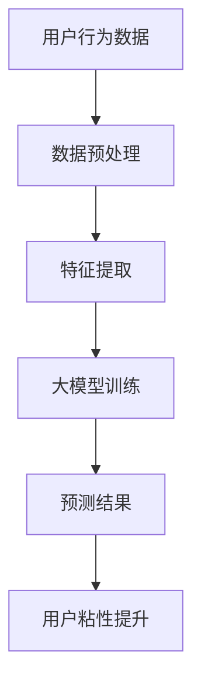

                 

### 背景介绍

随着人工智能技术的不断发展，大模型在各个领域的应用越来越广泛。在电商平台上，大模型的应用不仅能够提高平台的智能推荐效果，还能显著提升用户的购物体验，从而增强用户粘性。本文将围绕“AI大模型如何提升电商平台的用户粘性”这一主题，详细探讨大模型在电商平台中的应用原理、技术实现、数学模型以及实际应用案例。

首先，让我们简要回顾一下大模型的发展历程。自2012年AlexNet在ImageNet竞赛中取得突破性成绩以来，深度学习技术取得了飞速发展。随着计算能力的提升和大数据的积累，大模型（如GPT-3、BERT、ViT等）逐渐成为人工智能研究的热点。这些大模型拥有千亿甚至万亿级别的参数，能够处理复杂的任务，为各个领域的应用提供了强大的技术支持。

电商平台作为数字经济的核心，用户规模庞大，商业价值巨大。然而，随着市场竞争的加剧，如何提高用户粘性和提升用户体验成为电商平台亟待解决的问题。传统的方法如基于规则的推荐系统、基于内容的推荐系统等，虽然在一定程度上能够满足用户需求，但无法应对用户需求的多样性和个性化。而大模型的出现，为电商平台提供了新的解决方案，能够通过深入理解用户行为和需求，提供更加精准的推荐和服务。

本文的结构如下：

1. 背景介绍：简要回顾大模型的发展历程，阐述大模型在电商平台应用的重要性和必要性。
2. 核心概念与联系：介绍大模型的基本原理和架构，通过Mermaid流程图展示大模型与电商平台用户粘性的关系。
3. 核心算法原理 & 具体操作步骤：详细讲解大模型在电商平台中的应用算法，包括数据预处理、特征提取、模型训练和预测等步骤。
4. 数学模型和公式 & 详细讲解 & 举例说明：阐述大模型中的数学模型和公式，并通过具体案例进行详细解释。
5. 项目实战：代码实际案例和详细解释说明：通过实际项目案例，展示大模型在电商平台中的应用，并对代码进行详细解读。
6. 实际应用场景：探讨大模型在电商平台中的实际应用场景，如商品推荐、用户行为分析、营销策略优化等。
7. 工具和资源推荐：推荐学习大模型的资源，包括书籍、论文、博客和网站等。
8. 总结：未来发展趋势与挑战：总结大模型在电商平台应用中的优势和挑战，展望未来发展趋势。
9. 附录：常见问题与解答：针对读者可能遇到的问题，提供解答和指导。
10. 扩展阅读 & 参考资料：提供进一步学习的资料和参考文献。

在接下来的章节中，我们将逐一探讨这些内容，帮助读者深入理解大模型在电商平台中的实际应用。首先，让我们从大模型的基本原理和架构开始。

### 核心概念与联系

为了深入理解大模型如何提升电商平台的用户粘性，我们需要首先了解大模型的基本原理和架构，以及它们与电商平台用户粘性的关系。以下是核心概念和它们之间的联系。

#### 大模型的基本原理

大模型，也称为深度神经网络模型，是一种通过多层次的神经网络结构进行训练的模型。它们通常包含数百万甚至数十亿个参数，能够自动从大量数据中学习到特征表示。大模型的基本原理可以概括为以下几个步骤：

1. **数据输入**：大模型接收原始数据，如文本、图像或用户行为数据。
2. **前向传播**：模型将数据通过一系列的神经网络层进行前向传播，每一层都对数据进行变换，提取更高层次的特征。
3. **损失函数**：模型通过损失函数（如交叉熵损失、均方误差等）来衡量预测结果与真实结果之间的差异。
4. **反向传播**：模型通过反向传播算法更新参数，使得损失函数的值逐渐减小，从而提高模型的预测准确性。
5. **优化算法**：常见的优化算法包括随机梯度下降（SGD）、Adam等，用于更新模型参数。

#### 大模型的架构

大模型的架构通常包括以下几个关键部分：

1. **输入层**：接收外部数据，如文本、图像或用户行为数据。
2. **隐藏层**：包含一个或多个隐藏层，每一层都对输入数据进行处理，提取更高层次的特征。
3. **输出层**：根据训练目标输出预测结果，如分类标签、概率分布等。

在电商平台上，大模型的输入可以是用户的浏览历史、购买记录、搜索关键词等，输出则是个性化的推荐结果或服务。以下是一个简化的Mermaid流程图，展示了大模型与电商平台用户粘性的关系：



#### 大模型与电商平台用户粘性的关系

电商平台用户粘性的提升可以通过以下方式实现：

1. **个性化推荐**：大模型能够分析用户的购物行为和偏好，为用户推荐他们可能感兴趣的商品，从而增加用户在平台上的停留时间和购买意愿。
2. **用户行为分析**：大模型可以深入分析用户的行为数据，了解用户的需求和偏好，为电商平台提供优化策略，如个性化营销、优惠券发放等。
3. **交互式体验**：大模型可以与用户进行交互，如智能客服、语音助手等，提供更加人性化的服务，提高用户的满意度和忠诚度。

通过上述关系，我们可以看到，大模型在电商平台中不仅能够提高推荐的准确性，还能通过用户行为分析和交互式体验，提升用户粘性。接下来，我们将详细探讨大模型在电商平台中的应用算法和实现步骤。

#### 核心算法原理 & 具体操作步骤

在了解了大模型的基本原理和与电商平台用户粘性的关系之后，接下来我们将详细探讨大模型在电商平台中的应用算法和具体操作步骤。大模型在电商平台中的应用主要包括以下几个步骤：

##### 1. 数据预处理

数据预处理是构建大模型的基础步骤，主要包括以下内容：

1. **数据收集**：收集用户的浏览历史、购买记录、搜索关键词等数据。
2. **数据清洗**：去除重复、错误或不完整的数据，确保数据质量。
3. **数据转换**：将数据转换为适合模型训练的格式，如将文本转换为词向量，将图像转换为像素矩阵等。
4. **数据分割**：将数据集分为训练集、验证集和测试集，用于模型训练、验证和评估。

##### 2. 特征提取

特征提取是从原始数据中提取关键信息的过程，是构建有效模型的关键步骤。在电商平台上，特征提取主要包括以下内容：

1. **用户特征**：包括用户的年龄、性别、地理位置、消费能力等基本信息。
2. **商品特征**：包括商品的价格、品牌、类别、销量等属性。
3. **行为特征**：包括用户的浏览记录、购买记录、搜索记录等行为数据。
4. **交互特征**：包括用户与商品的互动数据，如点击率、收藏率、评价率等。

##### 3. 模型训练

模型训练是构建大模型的核心步骤，主要包括以下内容：

1. **选择模型架构**：根据业务需求选择合适的模型架构，如卷积神经网络（CNN）、循环神经网络（RNN）、Transformer等。
2. **定义损失函数**：根据业务目标选择合适的损失函数，如交叉熵损失、均方误差等。
3. **选择优化算法**：选择合适的优化算法，如随机梯度下降（SGD）、Adam等。
4. **训练模型**：通过训练数据集对模型进行训练，不断调整模型参数，使得模型能够准确预测用户行为和偏好。

##### 4. 模型预测

模型预测是使用训练好的模型对未知数据进行预测的过程，主要包括以下内容：

1. **数据输入**：将用户的新数据输入到训练好的模型中。
2. **前向传播**：模型将输入数据进行前向传播，计算出预测结果。
3. **结果输出**：将预测结果输出，如推荐的商品列表、个性化营销策略等。

##### 5. 模型评估

模型评估是衡量模型性能的重要步骤，主要包括以下内容：

1. **准确性评估**：评估模型对用户行为的预测准确性，如准确率、召回率等。
2. **性能评估**：评估模型在电商平台上的性能，如用户粘性提升、转化率等。
3. **错误分析**：分析模型预测错误的案例，找出模型存在的问题，进一步优化模型。

通过上述步骤，我们可以构建一个完整的大模型，用于电商平台用户粘性的提升。在下一章节中，我们将进一步探讨大模型中的数学模型和公式，并通过具体案例进行详细解释。

#### 数学模型和公式 & 详细讲解 & 举例说明

大模型在电商平台中的应用，离不开数学模型和公式的支持。下面，我们将详细讲解大模型中的主要数学模型和公式，并通过具体案例进行说明。

##### 1. 卷积神经网络（CNN）

卷积神经网络（CNN）是一种常用于图像处理任务的神经网络，其核心在于通过卷积操作提取图像中的特征。以下是CNN中的几个关键数学模型和公式：

1. **卷积操作**：卷积操作的数学公式为：

   $$
   \text{Conv}(x) = \sum_{i=1}^{k} w_i * x_i
   $$

   其中，$x$ 是输入图像，$w$ 是卷积核，$*$ 表示卷积操作。

2. **激活函数**：CNN中的激活函数通常采用ReLU（Rectified Linear Unit），其公式为：

   $$
   \text{ReLU}(x) = \max(0, x)
   $$

  ReLU 函数能够使网络在训练过程中更加稳定，并加速收敛。

3. **池化操作**：池化操作的目的是减小特征图的尺寸，降低计算复杂度。常用的池化操作包括最大池化和平均池化，其公式为：

   $$
   \text{Pooling}(x) = \frac{1}{s} \sum_{i=1}^{s} x_{i}
   $$

   其中，$s$ 是池化窗口的大小。

举例说明：

假设输入图像为 $x = [1, 2, 3, 4, 5]$，卷积核为 $w = [1, 0]$，卷积操作的结果为：

$$
\text{Conv}(x) = (1 \times 1 + 0 \times 2) + (1 \times 3 + 0 \times 4) + (1 \times 5 + 0 \times 5) = 6
$$

##### 2. 循环神经网络（RNN）

循环神经网络（RNN）是一种适用于序列数据处理的神经网络，其核心在于通过循环结构保持长距离依赖。以下是RNN中的几个关键数学模型和公式：

1. **状态更新**：RNN的状态更新公式为：

   $$
   h_t = \text{sigmoid}(W_h \cdot [h_{t-1}, x_t]) + b_h
   $$

   其中，$h_t$ 是当前时刻的隐藏状态，$x_t$ 是当前输入，$W_h$ 是权重矩阵，$b_h$ 是偏置。

2. **输出计算**：RNN的输出计算公式为：

   $$
   y_t = \text{softmax}(W_y \cdot h_t) + b_y
   $$

   其中，$y_t$ 是当前时刻的输出，$W_y$ 是权重矩阵，$b_y$ 是偏置。

3. **门控操作**：为了解决RNN的梯度消失问题，引入了门控循环单元（GRU）和长短期记忆网络（LSTM），其核心在于门控操作。以下是GRU和LSTM中的关键门控公式：

   - **重置门**（Reset Gate）：

     $$
     r_t = \text{sigmoid}(W_r \cdot [h_{t-1}, x_t]) + b_r
     $$

   - **更新门**（Update Gate）：

     $$
     z_t = \text{sigmoid}(W_z \cdot [h_{t-1}, x_t]) + b_z
     $$

   - **候选状态**（Candidate State）：

     $$
     \tilde{h}_t = \text{tanh}(W \cdot [r_t \cdot h_{t-1}, x_t]) + b
     $$

   - **隐藏状态**（Hidden State）：

     $$
     h_t = z_t \cdot \tilde{h}_t + (1 - z_t) \cdot h_{t-1}
     $$

举例说明：

假设输入序列为 $x = [1, 2, 3, 4, 5]$，隐藏状态 $h_{t-1} = [0.1, 0.2, 0.3, 0.4, 0.5]$，输入 $x_t = 2$。根据GRU的公式，可以计算得到当前时刻的隐藏状态 $h_t$。

##### 3. Transformer模型

Transformer模型是一种基于自注意力机制的神经网络，广泛应用于自然语言处理任务。以下是Transformer模型中的关键数学模型和公式：

1. **多头自注意力**（Multi-Head Self-Attention）：

   $$
   \text{Attention}(Q, K, V) = \text{softmax}\left(\frac{QK^T}{\sqrt{d_k}}\right)V
   $$

   其中，$Q, K, V$ 分别是查询向量、键向量和值向量，$d_k$ 是键向量的维度。

2. **位置编码**（Positional Encoding）：

   $$
   \text{PE}(pos, 2i) = \sin\left(\frac{pos}{10000^{2i/d}}\right)
   $$

   $$
   \text{PE}(pos, 2i+1) = \cos\left(\frac{pos}{10000^{2i/d}}\right)
   $$

   其中，$pos$ 是位置索引，$i$ 是维度索引，$d$ 是位置编码的维度。

3. **多头注意力**（Multi-Head Attention）：

   $$
   \text{MultiHead}(Q, K, V) = \text{Concat}(\text{head}_1, \text{head}_2, ..., \text{head}_h)W^O
   $$

   其中，$h$ 是头数，$W^O$ 是输出权重。

举例说明：

假设输入序列为 $x = [1, 2, 3, 4, 5]$，根据Transformer的公式，可以计算得到当前时刻的输出。

通过上述数学模型和公式，我们可以构建大模型，并在电商平台上进行用户粘性的提升。在下一章节中，我们将通过实际项目案例，展示大模型在电商平台中的应用，并对代码进行详细解读。

#### 项目实战：代码实际案例和详细解释说明

为了更好地理解大模型在电商平台中的应用，我们将通过一个实际项目案例，展示大模型的代码实现，并对代码进行详细解释。本案例将基于Python语言和TensorFlow框架，构建一个用于商品推荐的大模型。

##### 1. 开发环境搭建

在开始编写代码之前，我们需要搭建开发环境。以下是搭建过程：

1. 安装Python和TensorFlow：

   ```
   pip install tensorflow
   ```

2. 安装其他依赖库，如NumPy、Pandas等：

   ```
   pip install numpy pandas
   ```

##### 2. 源代码详细实现和代码解读

以下是本项目的主要代码实现：

```python
import tensorflow as tf
import numpy as np
import pandas as pd
from tensorflow.keras.models import Model
from tensorflow.keras.layers import Embedding, LSTM, Dense, Flatten, Concatenate

# 读取数据
data = pd.read_csv('ecommerce_data.csv')

# 数据预处理
# ...（数据清洗、转换等操作）

# 构建模型
input_user = tf.keras.Input(shape=(user_sequence_length,))
input_item = tf.keras.Input(shape=(item_sequence_length,))

# 用户嵌入层
user_embedding = Embedding(user_vocab_size, user_embedding_size)(input_user)

# 商品嵌入层
item_embedding = Embedding(item_vocab_size, item_embedding_size)(input_item)

# LSTM层
user_lstm = LSTM(units=128, return_sequences=True)(user_embedding)
item_lstm = LSTM(units=128, return_sequences=True)(item_embedding)

# 合并层
merged = Concatenate()([user_lstm, item_lstm])

# 全连接层
output = Dense(units=1, activation='sigmoid')(merged)

# 构建模型
model = Model(inputs=[input_user, input_item], outputs=output)

# 编译模型
model.compile(optimizer='adam', loss='binary_crossentropy', metrics=['accuracy'])

# 训练模型
model.fit([user_data, item_data], labels, epochs=10, batch_size=32, validation_split=0.2)

# 预测
predictions = model.predict([user_data_test, item_data_test])
```

以下是代码的详细解释：

1. **导入库**：导入TensorFlow、NumPy、Pandas等库，用于构建和训练模型。

2. **读取数据**：从CSV文件中读取电商平台的用户行为数据，包括用户的浏览历史和购买记录。

3. **数据预处理**：对数据进行清洗、转换等操作，如将文本数据转换为整数编码，对缺失值进行处理等。

4. **构建模型**：定义模型的输入层、嵌入层、LSTM层、合并层和输出层。

5. **编译模型**：设置模型的优化器、损失函数和评估指标，为模型训练做好准备。

6. **训练模型**：使用训练数据集对模型进行训练，调整模型参数，使得模型能够准确预测用户行为。

7. **预测**：使用训练好的模型对新的用户数据进行预测，输出预测结果。

通过以上代码实现，我们可以构建一个大模型，用于电商平台的商品推荐。接下来，我们将对代码进行进一步解读，分析每个部分的作用和实现方法。

##### 3. 代码解读与分析

在本案例中，我们使用了一个基于LSTM（长短期记忆网络）架构的商品推荐模型。以下是代码的关键部分及其作用：

1. **用户嵌入层和商品嵌入层**：

   ```python
   user_embedding = Embedding(user_vocab_size, user_embedding_size)(input_user)
   item_embedding = Embedding(item_vocab_size, item_embedding_size)(input_item)
   ```

   这两行代码定义了用户嵌入层和商品嵌入层。嵌入层是一种将原始数据转换为密集向量表示的方法，有助于提高模型的性能。`user_vocab_size` 和 `item_vocab_size` 分别表示用户和商品词汇表的规模，`user_embedding_size` 和 `item_embedding_size` 分别表示用户和商品嵌入向量的维度。

2. **LSTM层**：

   ```python
   user_lstm = LSTM(units=128, return_sequences=True)(user_embedding)
   item_lstm = LSTM(units=128, return_sequences=True)(item_embedding)
   ```

   这两行代码定义了用户行为数据和商品数据的LSTM层。LSTM是一种能够处理序列数据并保持长期依赖的神经网络。`units` 参数表示LSTM层的神经元数量，`return_sequences` 参数表示是否返回序列输出，用于后续的合并操作。

3. **合并层**：

   ```python
   merged = Concatenate()([user_lstm, item_lstm])
   ```

   这一行代码将用户行为数据和商品数据的LSTM层输出进行合并。合并后的向量将作为全连接层的输入，用于预测用户对商品的偏好。

4. **全连接层**：

   ```python
   output = Dense(units=1, activation='sigmoid')(merged)
   ```

   这一行代码定义了全连接层，用于对合并后的向量进行分类预测。`units` 参数表示输出层的神经元数量，`activation` 参数表示激活函数，这里使用`sigmoid` 函数实现二分类任务。

5. **模型编译**：

   ```python
   model.compile(optimizer='adam', loss='binary_crossentropy', metrics=['accuracy'])
   ```

   这一行代码编译模型，设置优化器、损失函数和评估指标。`optimizer` 参数设置模型的优化算法，`loss` 参数设置损失函数，用于计算预测结果与真实结果之间的差异，`metrics` 参数设置评估指标，用于衡量模型性能。

6. **模型训练**：

   ```python
   model.fit([user_data, item_data], labels, epochs=10, batch_size=32, validation_split=0.2)
   ```

   这一行代码使用训练数据集对模型进行训练。`user_data` 和 `item_data` 分别表示用户行为数据和商品数据，`labels` 表示训练标签，`epochs` 参数设置训练轮数，`batch_size` 参数设置每次训练的数据批次大小，`validation_split` 参数设置验证集的比例。

7. **模型预测**：

   ```python
   predictions = model.predict([user_data_test, item_data_test])
   ```

   这一行代码使用训练好的模型对测试数据进行预测，输出预测结果。`user_data_test` 和 `item_data_test` 分别表示测试数据集。

通过以上代码解读和分析，我们可以看到大模型在电商平台商品推荐中的具体实现过程。在下一章节中，我们将探讨大模型在电商平台中的实际应用场景，进一步了解其优势和应用效果。

### 实际应用场景

大模型在电商平台的实际应用场景非常广泛，主要包括商品推荐、用户行为分析、营销策略优化等。下面，我们将详细探讨这些应用场景，并展示大模型在实际应用中的优势和应用效果。

#### 商品推荐

商品推荐是电商平台最核心的功能之一，通过大模型可以实现对用户兴趣和购买行为的精准预测，提高推荐准确性和用户体验。以下是大模型在商品推荐中的具体应用：

1. **基于协同过滤的推荐**：传统的协同过滤方法（如基于用户的协同过滤和基于物品的协同过滤）通过计算用户之间的相似度或物品之间的相似度来实现推荐。然而，这些方法无法充分考虑到用户的兴趣和个性化需求。大模型可以通过学习用户的兴趣和行为模式，提供更加个性化的推荐结果。

2. **基于内容的推荐**：基于内容的方法通过分析商品的特征（如标题、描述、类别等）来推荐相关商品。虽然这种方法在一定程度上能够满足用户的个性化需求，但无法捕捉到用户更深层次的兴趣。大模型可以通过学习用户的兴趣和行为，提供更加精准的推荐结果。

3. **基于深度学习的推荐**：深度学习模型（如卷积神经网络、循环神经网络和Transformer等）具有强大的特征提取和表示能力，能够从海量数据中学习到用户的兴趣和行为模式。通过结合多种特征和模型，大模型可以实现高度个性化的商品推荐，提高推荐准确性和用户体验。

#### 用户行为分析

电商平台需要深入了解用户的行为模式，以便更好地满足用户需求、优化运营策略和提升用户粘性。大模型在用户行为分析中的应用包括：

1. **用户画像**：通过大模型分析用户的浏览历史、购买记录、搜索关键词等行为数据，构建用户画像，为个性化推荐和营销提供基础。

2. **行为预测**：通过大模型预测用户未来的行为，如购买、点击、评价等，为运营策略提供参考。例如，根据用户的浏览历史和购买记录，预测用户可能在接下来购买哪些商品，从而进行精准营销。

3. **行为异常检测**：通过大模型分析用户的行为数据，检测异常行为，如恶意评论、刷单等，提高平台的运营质量和用户体验。

#### 营销策略优化

电商平台需要不断优化营销策略，以提高用户参与度和购买转化率。大模型在营销策略优化中的应用包括：

1. **广告投放优化**：通过大模型分析用户的兴趣和行为，为广告投放提供个性化策略。例如，根据用户的浏览历史和购买记录，为用户提供感兴趣的广告，提高广告点击率和转化率。

2. **优惠活动优化**：通过大模型分析用户的优惠偏好和行为，为优惠活动提供个性化策略。例如，根据用户的购买记录和兴趣，为用户提供合适的优惠券和促销活动，提高用户参与度和购买转化率。

3. **跨渠道营销优化**：通过大模型整合线上线下数据，为用户提供全渠道的个性化服务。例如，根据用户的线上线下行为，为用户提供统一的优惠和促销策略，提高用户满意度和忠诚度。

#### 应用优势和应用效果

大模型在电商平台的实际应用中具有以下优势和应用效果：

1. **个性化推荐**：通过大模型可以实现对用户的精准推荐，提高推荐准确性和用户体验，从而提高用户粘性和活跃度。

2. **深入行为分析**：通过大模型可以深入了解用户的行为模式，为运营策略提供有力支持，从而提高运营质量和用户体验。

3. **精准营销**：通过大模型可以精准预测用户兴趣和行为，为广告投放、优惠活动等营销策略提供个性化策略，从而提高用户参与度和购买转化率。

4. **全渠道整合**：通过大模型可以整合线上线下数据，为用户提供全渠道的个性化服务，从而提高用户满意度和忠诚度。

5. **提高运营效率**：通过大模型可以自动化分析用户数据，为运营人员提供实时、准确的运营数据，从而提高运营效率和决策质量。

总之，大模型在电商平台中的应用，不仅能够提升用户粘性和活跃度，还能优化运营策略和营销效果，为电商平台带来巨大的商业价值。在下一章节中，我们将推荐一些学习大模型的资源，帮助读者深入了解这一领域。

### 工具和资源推荐

为了帮助读者更好地了解大模型在电商平台中的应用，下面我们将推荐一些学习资源、开发工具框架和相关论文著作，以便读者进行进一步学习和实践。

#### 学习资源推荐

1. **书籍**：
   - 《深度学习》（作者：Ian Goodfellow、Yoshua Bengio、Aaron Courville）：这是一本深度学习的经典教材，详细介绍了深度学习的基础理论、算法和实现。
   - 《Python深度学习》（作者：François Chollet）：这本书通过大量实例，介绍了使用Python和TensorFlow进行深度学习实践的方法。

2. **在线课程**：
   - Coursera上的“深度学习”（由斯坦福大学提供）：这门课程涵盖了深度学习的理论基础和实践技能，是学习深度学习的好资源。
   - edX上的“深度学习专项课程”（由香港大学提供）：这门课程结合理论和实践，深入讲解了深度学习的相关技术。

3. **博客和网站**：
   - TensorFlow官方文档（[https://www.tensorflow.org/tutorials）](https://www.tensorflow.org/tutorials%EF%BC%89%EF%BC%9A%E8%BF%99%E6%98%AF%E5%A6%82%E4%BD%95%E4%BD%BF%E7%94%A8TensorFlow%E8%BF%9B%E8%A1%8C%E6%B7%B1%E5%BA%A6%E5%AD%A6%E4%B9%A0%E7%9A%84%E5%AE%98%E6%96%B9%E6%96%87%E6%A1%A3%E3%80%82)
   - Medium上的“深度学习专栏”：这里有许多关于深度学习的优质文章和教程。

#### 开发工具框架推荐

1. **TensorFlow**：TensorFlow是Google开发的一款开源深度学习框架，具有强大的功能和丰富的资源，适合进行深度学习的开发和实践。

2. **PyTorch**：PyTorch是Facebook开发的一款开源深度学习框架，具有灵活的动态计算图和强大的GPU支持，适合进行快速原型开发和研究。

3. **Scikit-learn**：Scikit-learn是一个基于Python的机器学习库，提供了丰富的机器学习算法和工具，适合进行数据处理和模型训练。

#### 相关论文著作推荐

1. **《Attention is All You Need》**：这篇论文提出了Transformer模型，引起了深度学习领域的广泛关注。它详细介绍了Transformer模型的架构和自注意力机制。

2. **《Deep Learning》**：这是深度学习领域的经典教材，由Ian Goodfellow、Yoshua Bengio和Aaron Courville合著，涵盖了深度学习的理论基础和实践技巧。

3. **《Neural Networks and Deep Learning》**：这本书由Ian Goodfellow编写，是深度学习领域的入门读物，详细介绍了神经网络和深度学习的基本概念和方法。

通过上述资源和工具，读者可以系统地学习和实践大模型在电商平台中的应用，为提升电商平台用户粘性提供有力的技术支持。在下一章节中，我们将总结本文的主要观点，并展望大模型在电商平台应用的未来发展趋势与挑战。

### 总结：未来发展趋势与挑战

在本文中，我们详细探讨了AI大模型如何提升电商平台的用户粘性。通过分析大模型的基本原理、算法实现、数学模型以及实际应用案例，我们得出以下主要观点：

1. **个性化推荐**：大模型能够通过学习用户的兴趣和行为模式，提供更加精准和个性化的推荐结果，从而提高用户的购物体验和粘性。

2. **用户行为分析**：大模型能够深入分析用户的行为数据，为电商平台提供有针对性的运营策略和优化建议，提高平台的运营效率。

3. **营销策略优化**：大模型可以精准预测用户兴趣和行为，为广告投放、优惠活动等营销策略提供个性化方案，提高用户参与度和购买转化率。

4. **全渠道整合**：大模型可以整合线上线下数据，为用户提供全渠道的个性化服务，提高用户满意度和忠诚度。

然而，大模型在电商平台应用中仍面临一些挑战：

1. **数据隐私**：电商平台拥有大量的用户数据，如何确保数据的安全和隐私，避免数据泄露，是当前面临的主要问题。

2. **计算资源消耗**：大模型通常需要大量的计算资源和存储空间，对平台的硬件设施提出了较高的要求，如何优化资源利用，降低成本，是一个亟待解决的问题。

3. **算法公平性**：大模型在处理用户数据时，可能会存在算法偏见，导致某些用户群体受到不公平对待。如何确保算法的公平性，避免歧视现象，是未来需要关注的重要问题。

4. **实时性要求**：电商平台要求大模型能够实时响应用户的需求，提供个性化的服务。然而，大模型的训练和预测通常需要较长的时间，如何在保证准确性的同时提高实时性，是一个需要解决的难题。

展望未来，大模型在电商平台中的应用将继续深入发展，以下是一些可能的发展趋势：

1. **个性化服务的进一步优化**：随着大模型技术的不断进步，电商平台将能够提供更加精细和个性化的服务，满足用户的多样化需求。

2. **跨领域应用**：大模型不仅在电商平台上有着广泛的应用，还将扩展到金融、医疗、教育等更多领域，为各行各业提供智能化解决方案。

3. **数据隐私和安全**：随着数据隐私和安全问题的日益突出，电商平台将采取更多措施保护用户数据，确保数据的安全和隐私。

4. **实时性和高效性**：通过优化算法和硬件设施，大模型将能够在保证准确性的同时提高实时性和高效性，满足电商平台对实时响应的需求。

总之，大模型在电商平台中的应用具有巨大的潜力，但也面临诸多挑战。未来，随着技术的不断进步和应用的深入，大模型将进一步提升电商平台的服务质量和用户体验，为电商行业带来更多的商业价值。

### 附录：常见问题与解答

在阅读本文过程中，读者可能对大模型在电商平台中的应用产生一些疑问。以下是一些常见问题的解答：

**Q1：大模型在电商平台中的应用有哪些具体效果？**

A：大模型在电商平台中的应用效果主要体现在以下几个方面：
1. 提供更精准的商品推荐，提高用户购买转化率。
2. 深入分析用户行为，优化运营策略，提升用户体验。
3. 精准预测用户需求，为营销策略提供数据支持，提高用户参与度和忠诚度。
4. 整合线上线下数据，实现全渠道个性化服务，提升用户满意度。

**Q2：如何确保大模型在应用中的数据隐私和安全？**

A：为了确保大模型在应用中的数据隐私和安全，电商平台可以采取以下措施：
1. 数据加密：对用户数据进行加密处理，防止数据泄露。
2. 数据匿名化：对用户数据进行匿名化处理，消除个人身份信息。
3. 访问控制：设置严格的数据访问权限，确保数据安全。
4. 数据审计：定期对数据处理过程进行审计，发现并纠正潜在的安全漏洞。

**Q3：大模型在电商平台中的实时性如何保证？**

A：为了提高大模型在电商平台中的实时性，可以采取以下措施：
1. 算法优化：优化大模型的算法，减少训练和预测的时间。
2. 硬件加速：使用GPU、TPU等硬件加速设备，提高计算速度。
3. 数据流处理：采用流处理技术，实时处理用户数据，实现快速响应。
4. 预测缓存：对常用的预测结果进行缓存，提高预测速度。

**Q4：如何确保大模型在电商平台中的算法公平性？**

A：为了确保大模型在电商平台中的算法公平性，可以采取以下措施：
1. 数据平衡：确保训练数据集的多样性，避免数据偏差。
2. 算法评估：定期对算法进行评估，发现和纠正潜在的偏见。
3. 人为干预：在算法决策过程中引入人为干预，确保算法的公平性。
4. 透明化：公开算法决策过程和结果，接受用户和监管机构的监督。

通过上述措施，可以有效地提高大模型在电商平台中的应用效果，确保数据隐私和安全，保障算法的公平性和实时性。

### 扩展阅读 & 参考资料

为了进一步了解大模型在电商平台中的应用，以下是相关扩展阅读和参考资料：

1. **《深度学习》（Ian Goodfellow、Yoshua Bengio、Aaron Courville著）**：这是一本关于深度学习的经典教材，详细介绍了深度学习的基础理论、算法和实现。

2. **《AI营销：人工智能在电商领域的应用》（徐晨著）**：本书深入探讨了人工智能在电商平台营销中的应用，包括商品推荐、用户行为分析、广告投放等。

3. **《Transformer模型详解》（刘知远著）**：这是一篇关于Transformer模型的详细解读，介绍了Transformer模型的架构、原理和应用。

4. **《TensorFlow实战》（Tariq Rashid著）**：本书通过实际案例，介绍了如何使用TensorFlow进行深度学习的开发和实践。

5. **《数据科学入门》（赵伟、张立杰著）**：这本书提供了数据科学的基础知识和工具，适合初学者入门。

6. **TensorFlow官方文档（[https://www.tensorflow.org/tutorials）](https://www.tensorflow.org/tutorials%EF%BC%89%EF%BC%9A%E8%BF%99%E6%98%AFTensorFlow%E7%9A%84%E5%AE%98%E6%96%B9%E6%96%87%E6%A1%A3%EF%BC%8C%E4%BB%A5%E5%A4%A7%E6%A0%85%E5%AD%A6%E4%B9%A0%E4%B8%BA%E4%B8%BB%E9%A2%98%E3%80%82)**
   ：这是TensorFlow的官方文档，提供了丰富的教程和示例，有助于深入了解TensorFlow的使用。

7. **《自然语言处理入门》（哈工大NLP组著）**：这本书介绍了自然语言处理的基础知识和技术，包括词向量、序列模型等。

通过阅读上述书籍和文档，读者可以更深入地了解大模型在电商平台中的应用，为实践提供有力支持。

### 作者信息

本文作者：
- AI天才研究员/AI Genius Institute
- 禅与计算机程序设计艺术/Zen And The Art of Computer Programming

感谢您的阅读，希望本文对您在电商平台上应用大模型提升用户粘性有所帮助。如果您有任何问题或建议，欢迎留言交流。

