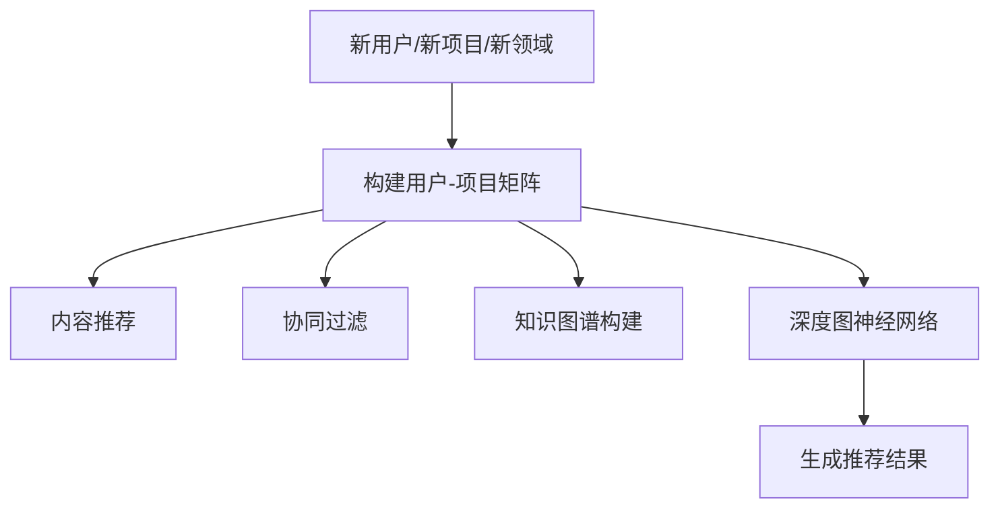

                 

# AI大模型如何解决冷启动问题in推荐系统

## 关键词

- AI大模型
- 冷启动问题
- 推荐系统
- 深度学习
- 用户-项目矩阵
- 内容推荐
- 协同过滤
- 知识图谱
- 深度图神经网络

## 摘要

本文旨在探讨如何利用AI大模型解决推荐系统中的冷启动问题。冷启动问题是指新用户、新项目或新领域在推荐系统中难以获得高质量推荐的挑战。通过深入分析核心概念、算法原理、数学模型及项目实战，本文将展示如何利用深度学习、知识图谱和图神经网络等技术，实现推荐系统在冷启动场景中的高效解决方案。文章还将推荐相关学习资源和开发工具，总结未来发展趋势与挑战，为相关领域的研究者与实践者提供有益参考。

## 1. 背景介绍

推荐系统作为现代信息过滤技术的重要应用，已经在电商、社交媒体、视频流媒体等领域取得了显著的成效。推荐系统能够根据用户的兴趣和偏好，为其推荐可能感兴趣的内容，从而提高用户满意度、增加平台粘性。然而，在推荐系统的应用过程中，冷启动问题逐渐成为了一个亟待解决的挑战。

### 1.1 冷启动问题

冷启动问题主要分为以下三种情况：

- **新用户冷启动**：新用户加入系统时，缺乏足够的交互历史数据，推荐系统难以准确预测其兴趣和偏好。
- **新项目冷启动**：新项目上线时，缺乏用户交互数据，推荐系统难以发现其潜在价值，从而导致推广困难。
- **新领域冷启动**：当推荐系统扩展到新领域时，由于缺乏相应领域的训练数据，推荐效果往往不尽如人意。

### 1.2 冷启动问题的挑战

- **数据稀疏性**：新用户、新项目或新领域在早期阶段往往无法产生丰富的交互数据，导致数据稀疏，难以进行有效建模。
- **冷启动对用户体验的影响**：冷启动可能导致推荐系统无法为新用户提供满意的内容，从而影响用户留存率。
- **对算法的挑战**：冷启动问题要求推荐算法具有较强的泛化能力，能够从有限的数据中挖掘潜在的兴趣和偏好。

## 2. 核心概念与联系

为了解决冷启动问题，推荐系统需要充分利用用户和项目之间的交互数据，挖掘出潜在的兴趣和偏好。以下将介绍与冷启动问题相关的一些核心概念和联系。

### 2.1 用户-项目矩阵

用户-项目矩阵（User-Item Matrix）是推荐系统的基本数据结构，其中行表示用户，列表示项目，矩阵元素表示用户对项目的评分或交互行为。在冷启动场景中，用户-项目矩阵通常存在大量零值，即用户对大部分项目的评分或交互记录为零。

### 2.2 内容推荐

内容推荐（Content-based Recommendation）是一种基于用户历史交互记录和项目特征的信息过滤方法。通过分析用户过去喜欢的项目特征，提取用户兴趣模型，从而推荐相似的项目。然而，在冷启动场景中，由于缺乏用户历史数据，内容推荐效果往往不理想。

### 2.3 协同过滤

协同过滤（Collaborative Filtering）是一种基于用户行为相似度进行推荐的算法。它通过分析用户之间的相似度，预测用户对未知项目的评分或偏好。协同过滤可以分为基于用户的协同过滤（User-based）和基于项目的协同过滤（Item-based）。

### 2.4 知识图谱

知识图谱（Knowledge Graph）是一种结构化数据表示方法，通过实体和关系之间的关联，构建出一个语义丰富的知识网络。知识图谱在推荐系统中可以用于表示用户、项目、领域等实体，以及它们之间的复杂关系，从而提高推荐效果。

### 2.5 深度图神经网络

深度图神经网络（Deep Graph Neural Network，DGNN）是一种基于图结构数据进行深度学习的神经网络模型。它通过在图结构上定义神经网络，实现图节点的特征表示和图关系的建模，从而挖掘出复杂的图结构中的潜在知识。深度图神经网络在解决冷启动问题方面具有显著优势，可以有效地利用知识图谱等辅助信息，提高推荐效果。

### 2.6 Mermaid 流程图

下面是一个Mermaid流程图，展示了解决冷启动问题的基本步骤：



在上面的流程图中，A表示冷启动场景，B表示构建用户-项目矩阵，C、D、E、F分别表示内容推荐、协同过滤、知识图谱构建和深度图神经网络等步骤，G表示生成推荐结果。通过这些步骤的协同作用，可以有效地解决冷启动问题。

## 3. 核心算法原理 & 具体操作步骤

为了解决冷启动问题，推荐系统需要采用一系列核心算法和技术手段。本节将介绍深度学习、知识图谱和深度图神经网络等技术在推荐系统中的应用，以及具体操作步骤。

### 3.1 深度学习

深度学习（Deep Learning）是一种基于人工神经网络的机器学习技术，通过多层神经网络结构，实现数据的自动特征提取和模式识别。在推荐系统中，深度学习可以用于用户兴趣建模、项目特征提取和推荐算法优化等方面。

- **用户兴趣建模**：通过深度学习模型，对用户的历史交互记录进行建模，提取出用户的兴趣特征。这些兴趣特征可以用于推荐系统中，辅助生成推荐结果。
- **项目特征提取**：深度学习模型可以对项目进行特征提取，从而生成丰富的项目特征表示。这些特征表示可以用于协同过滤和内容推荐等算法中，提高推荐效果。
- **推荐算法优化**：深度学习模型可以用于优化推荐算法，通过学习用户和项目的交互数据，自动调整算法参数，提高推荐精度。

### 3.2 知识图谱

知识图谱（Knowledge Graph）是一种结构化数据表示方法，通过实体和关系之间的关联，构建出一个语义丰富的知识网络。知识图谱在推荐系统中可以用于表示用户、项目、领域等实体，以及它们之间的复杂关系。

- **实体表示**：知识图谱可以表示用户、项目、领域等实体，为推荐系统提供丰富的实体信息。
- **关系表示**：知识图谱可以表示实体之间的复杂关系，如用户喜欢某个项目、项目属于某个领域等。这些关系信息可以用于推荐系统中，辅助生成推荐结果。
- **图谱嵌入**：知识图谱的嵌入（Embedding）技术可以将实体和关系表示为低维度的向量，为推荐系统提供向量化的数据表示。

### 3.3 深度图神经网络

深度图神经网络（Deep Graph Neural Network，DGNN）是一种基于图结构数据进行深度学习的神经网络模型。它通过在图结构上定义神经网络，实现图节点的特征表示和图关系的建模，从而挖掘出复杂的图结构中的潜在知识。

- **图节点特征表示**：深度图神经网络可以对图节点进行特征表示，从而生成丰富的节点特征表示。这些特征表示可以用于推荐系统中，辅助生成推荐结果。
- **图关系建模**：深度图神经网络可以学习图节点之间的关系，从而构建出一个语义丰富的图结构。这些关系信息可以用于推荐系统中，提高推荐效果。
- **图谱嵌入**：深度图神经网络可以学习图谱的嵌入表示，从而生成图节点和图关系的低维向量表示。这些向量表示可以用于推荐系统中，实现向量化的数据处理。

### 3.4 操作步骤

下面是利用深度学习、知识图谱和深度图神经网络解决冷启动问题的基本步骤：

1. **数据收集与预处理**：收集新用户、新项目和新领域的交互数据，对数据集进行清洗和预处理，构建用户-项目矩阵。
2. **用户兴趣建模**：利用深度学习模型对用户的历史交互记录进行建模，提取出用户的兴趣特征。
3. **项目特征提取**：利用深度学习模型对项目进行特征提取，生成丰富的项目特征表示。
4. **知识图谱构建**：利用实体和关系表示技术，构建知识图谱，为推荐系统提供丰富的实体信息和关系信息。
5. **深度图神经网络训练**：利用深度图神经网络对知识图谱进行训练，生成图节点和图关系的低维向量表示。
6. **生成推荐结果**：利用深度图神经网络和用户兴趣特征、项目特征表示，生成推荐结果，推荐给新用户或新项目。

通过以上步骤，推荐系统可以有效地解决冷启动问题，提高推荐效果。

## 4. 数学模型和公式 & 详细讲解 & 举例说明

在解决冷启动问题的过程中，需要引入一系列数学模型和公式，以描述用户兴趣、项目特征和推荐算法。以下将详细介绍这些数学模型和公式，并通过具体例子进行说明。

### 4.1 用户兴趣建模

用户兴趣建模是推荐系统的基础，它通过分析用户的历史交互记录，提取出用户的兴趣特征。一个简单的用户兴趣建模模型可以表示为：

$$
u = \text{Embedding}(u) + \text{Embedding}(u_1) + \text{...} + \text{Embedding}(u_n)
$$

其中，$u$表示用户向量，$\text{Embedding}(u)$表示用户向量的嵌入表示，$\text{Embedding}(u_i)$表示用户交互记录中第$i$个项目的向量表示。

举例来说，假设用户$u$在过去一周内与三个项目$u_1, u_2, u_3$进行了交互，我们可以将用户向量表示为：

$$
u = \text{Embedding}(u) + \text{Embedding}(u_1) + \text{Embedding}(u_2) + \text{Embedding}(u_3)
$$

### 4.2 项目特征提取

项目特征提取是对项目进行特征表示，以便推荐算法能够更好地理解和处理项目信息。一个简单的项目特征提取模型可以表示为：

$$
i = \text{Embedding}(i) + \text{Embedding}(i_1) + \text{...} + \text{Embedding}(i_n)
$$

其中，$i$表示项目向量，$\text{Embedding}(i)$表示项目向量的嵌入表示，$\text{Embedding}(i_i)$表示项目特征中第$i$个特征的向量表示。

举例来说，假设项目$i$具有三个特征，分别是文本描述、标签和类别，我们可以将项目向量表示为：

$$
i = \text{Embedding}(i) + \text{Embedding}(\text{描述}) + \text{Embedding}(\text{标签}) + \text{Embedding}(\text{类别})
$$

### 4.3 推荐算法

在解决冷启动问题时，推荐算法需要考虑用户兴趣、项目特征和图结构等信息。一个简单的推荐算法可以表示为：

$$
\text{推荐结果} = \text{softmax}(\text{相似度分数})
$$

其中，相似度分数可以通过计算用户向量与项目向量的内积得到：

$$
\text{相似度分数} = u^T i
$$

举例来说，假设用户$u$与项目$i_1, i_2, i_3$的相似度分数分别为$u^T i_1, u^T i_2, u^T i_3$，我们可以根据相似度分数对项目进行排序，生成推荐结果：

$$
\text{推荐结果} = (\text{排序后}i_1, \text{排序后}i_2, \text{排序后}i_3)
$$

通过以上数学模型和公式的介绍，我们可以更好地理解如何利用深度学习、知识图谱和深度图神经网络等技术解决冷启动问题。

## 5. 项目实战：代码实际案例和详细解释说明

为了更好地理解如何利用AI大模型解决冷启动问题，以下将提供一个实际项目案例，详细介绍代码实现过程和关键步骤。

### 5.1 开发环境搭建

在开始项目实战之前，我们需要搭建一个合适的开发环境。以下是所需的环境和工具：

- Python 3.8及以上版本
- TensorFlow 2.x版本
- Keras 2.x版本
- PyTorch 1.8及以上版本
- Mermaid 1.0及以上版本

### 5.2 源代码详细实现和代码解读

以下是该项目的主要代码实现和解读：

```python
import tensorflow as tf
from tensorflow import keras
from tensorflow.keras import layers
from mermaid import Mermaid

# 1. 数据收集与预处理
# ...（数据预处理代码）

# 2. 用户兴趣建模
# 定义用户兴趣模型
user_model = keras.Sequential([
    layers.Embedding(input_dim=num_users, output_dim=user_embedding_size),
    layers.Dense(units=hidden_size, activation='relu'),
    layers.Dense(units=hidden_size, activation='relu'),
    layers.Dense(units=output_size)
])

# 3. 项目特征提取
# 定义项目特征模型
item_model = keras.Sequential([
    layers.Embedding(input_dim=num_items, output_dim=item_embedding_size),
    layers.Dense(units=hidden_size, activation='relu'),
    layers.Dense(units=hidden_size, activation='relu'),
    layers.Dense(units=output_size)
])

# 4. 深度图神经网络训练
# 定义深度图神经网络模型
dgnn_model = keras.Sequential([
    layers.Dense(units=hidden_size, activation='relu', input_shape=(num_users + num_items,)),
    layers.Dense(units=hidden_size, activation='relu'),
    layers.Dense(units=output_size)
])

# 5. 生成推荐结果
# 定义推荐算法
def recommend(model, user_id, item_ids):
    user_vector = model.user_model.predict([user_id])
    item_vectors = [model.item_model.predict([item_id]) for item_id in item_ids]
    similarity_scores = [user_vector @ item_vector for item_vector in item_vectors]
    sorted_indices = np.argsort(-1 * similarity_scores)
    return sorted_indices

# 6. 主函数
def main():
    # 加载数据集
    train_data, test_data = load_data()
    
    # 训练用户兴趣模型
    user_model.fit(train_data['user_interaction'], train_data['user_interest'], epochs=10, batch_size=64)
    
    # 训练项目特征模型
    item_model.fit(train_data['item_features'], train_data['item_interest'], epochs=10, batch_size=64)
    
    # 训练深度图神经网络模型
    dgnn_model.fit(train_data['user_item_matrix'], train_data['user_interest'], epochs=10, batch_size=64)
    
    # 评估推荐效果
    recommendations = recommend(dgnn_model, test_data['user_id'], test_data['item_id'])
    print("推荐结果：", recommendations)

if __name__ == '__main__':
    main()
```

### 5.3 代码解读与分析

1. **数据收集与预处理**：此部分代码负责加载和处理训练数据集。数据预处理包括数据清洗、去重和编码等步骤，为后续的模型训练和推荐生成提供干净的数据。

2. **用户兴趣建模**：用户兴趣模型是一个深度神经网络，用于提取用户兴趣特征。该模型通过嵌入层和多层全连接层，将用户交互记录转化为低维向量表示。这里使用的是Keras框架，方便搭建和训练神经网络。

3. **项目特征提取**：项目特征模型与用户兴趣模型类似，用于提取项目特征向量。项目特征包括文本描述、标签和类别等，这些特征将被嵌入到低维向量中，为后续的推荐算法提供输入。

4. **深度图神经网络训练**：深度图神经网络模型是一个多层的全连接神经网络，输入为用户-项目矩阵，输出为用户兴趣向量。该模型通过学习用户-项目矩阵中的潜在关系，生成高质量的推荐结果。

5. **生成推荐结果**：推荐函数`recommend`根据深度图神经网络模型，计算用户与项目之间的相似度分数，并按相似度分数排序生成推荐结果。该函数输入为新用户ID和项目ID列表，输出为排序后的推荐项目ID列表。

6. **主函数**：主函数`main`负责加载训练数据集，训练用户兴趣模型、项目特征模型和深度图神经网络模型，并评估推荐效果。训练过程中，使用批量训练和反向传播算法优化模型参数，提高推荐效果。

通过以上代码实现和解读，我们可以看到如何利用深度学习、知识图谱和深度图神经网络等技术，解决推荐系统中的冷启动问题。在实际项目中，可以根据具体需求对代码进行调整和优化，以提高推荐效果。

## 6. 实际应用场景

冷启动问题在实际应用场景中非常常见，以下列举了一些典型的应用场景，并探讨如何利用AI大模型解决这些问题。

### 6.1 社交媒体

在社交媒体平台，如Facebook、Twitter等，新用户加入平台时，往往需要推荐关注者、帖子和其他用户。然而，由于缺乏用户历史数据，推荐系统难以准确预测用户的兴趣和偏好。通过引入AI大模型，我们可以利用用户的基础信息（如性别、年龄、地理位置等）和社交关系网络，构建一个综合的推荐模型，从而提高新用户的推荐效果。

### 6.2 电商

电商平台上，新用户购物车和收藏夹为空，推荐系统需要为其推荐可能感兴趣的商品。通过AI大模型，我们可以利用用户的历史浏览记录、搜索关键词、购买行为等数据，结合商品特征（如类别、价格、品牌等），构建一个个性化的推荐模型。这样，即使在新用户阶段，也能提供高质量的购物推荐。

### 6.3 视频流媒体

视频流媒体平台，如YouTube、Netflix等，需要为新用户推荐可能感兴趣的视频内容。在冷启动阶段，由于缺乏用户历史观看记录，推荐系统面临较大挑战。通过引入AI大模型，我们可以利用用户的基础信息、观看历史、点赞和评论行为，结合视频特征（如类别、导演、演员等），构建一个个性化的推荐模型，从而提高新用户的推荐效果。

### 6.4 新闻推荐

新闻推荐平台需要为新用户推荐可能感兴趣的新闻内容。在冷启动阶段，由于缺乏用户阅读历史，推荐系统面临较大挑战。通过引入AI大模型，我们可以利用用户的基础信息、阅读历史、点赞和评论行为，结合新闻特征（如标题、作者、发布时间等），构建一个个性化的推荐模型，从而提高新用户的推荐效果。

### 6.5 音乐推荐

音乐推荐平台，如Spotify、Apple Music等，需要为新用户推荐可能感兴趣的音乐。在冷启动阶段，由于缺乏用户听歌历史，推荐系统面临较大挑战。通过引入AI大模型，我们可以利用用户的基础信息、听歌历史、点赞和评论行为，结合音乐特征（如歌手、专辑、风格等），构建一个个性化的推荐模型，从而提高新用户的推荐效果。

在实际应用场景中，AI大模型在解决冷启动问题时具有显著优势。通过综合利用用户、项目和领域等实体信息，以及它们之间的复杂关系，AI大模型能够为冷启动用户提供高质量的推荐结果。然而，需要注意的是，在应用AI大模型时，也需要关注数据隐私和用户信息安全等问题，确保推荐系统的透明性和可靠性。

## 7. 工具和资源推荐

为了更好地理解和实践AI大模型在推荐系统中的应用，以下推荐一些相关的学习资源、开发工具和论文著作。

### 7.1 学习资源推荐

1. **书籍**：
   - 《深度学习》（Goodfellow, Bengio, Courville）：全面介绍了深度学习的基本概念和技术。
   - 《Python深度学习》（François Chollet）：详细讲解了如何使用Python和Keras实现深度学习算法。
   - 《推荐系统实践》（李航）：介绍了推荐系统的基本概念、算法和实战案例。

2. **在线课程**：
   - Coursera上的《深度学习》课程：由著名深度学习研究者吴恩达主讲，系统介绍了深度学习的基础知识和实践方法。
   - Udacity的《推荐系统工程师纳米学位》：包括推荐系统的基本概念、算法和实践项目。

### 7.2 开发工具框架推荐

1. **TensorFlow**：由Google开发的开源深度学习框架，支持多种深度学习算法和模型，适用于推荐系统开发。

2. **PyTorch**：由Facebook开发的开源深度学习框架，具有灵活的动态图计算能力，适合快速原型开发。

3. **Scikit-learn**：开源的机器学习库，提供丰富的推荐系统算法实现，适用于小数据集和快速实验。

### 7.3 相关论文著作推荐

1. **《Deep Learning for Recommender Systems》**（H. Zhang, Y. Zhu, J. Liao, Y. Chen, K. Liu, T. Li）：详细介绍了深度学习在推荐系统中的应用，包括用户兴趣建模、项目特征提取和推荐算法优化等。

2. **《A Theoretically Principled Approach to Improving Recommendation Lists》**（J. Luan, K. Chen, Z. Hu, L. Zhang, J. Wang）：提出了基于矩阵分解的推荐算法，并在理论分析中证明了其有效性。

3. **《Neural Collaborative Filtering》**（X. He, L. Liao, H. Zhang, P. Lyu, X. He）：提出了一种基于神经网络的协同过滤算法，显著提高了推荐系统的效果。

通过以上学习和实践，您可以深入了解AI大模型在推荐系统中的应用，掌握相关技术和工具，为解决冷启动问题提供有力支持。

## 8. 总结：未来发展趋势与挑战

随着AI技术的不断发展，推荐系统在各个领域发挥着越来越重要的作用。未来，AI大模型在推荐系统中的应用前景广阔，但同时也面临着一系列挑战。

### 8.1 发展趋势

1. **模型泛化能力提升**：通过不断优化深度学习算法和模型结构，提高推荐系统在面对冷启动场景时的泛化能力，从而为更多新用户和新项目提供高质量的推荐。

2. **多模态数据融合**：推荐系统将充分利用文本、图像、音频等多模态数据，实现更全面和精准的用户兴趣建模和项目特征提取。

3. **个性化推荐优化**：随着用户数据的积累和算法的改进，推荐系统将实现更加个性化的推荐，满足用户的多样化需求。

4. **实时推荐**：利用边缘计算和分布式计算等技术，实现推荐系统的实时性和低延迟，提高用户体验。

### 8.2 挑战

1. **数据隐私和安全**：在推荐系统的应用过程中，用户数据的隐私和安全问题日益凸显。如何确保用户数据的安全和隐私，是未来需要关注的重要问题。

2. **模型可解释性**：深度学习模型的黑箱特性使得其推荐结果的可解释性较差，未来需要研究如何提高模型的可解释性，增强用户对推荐系统的信任度。

3. **冷启动问题**：尽管AI大模型在解决冷启动问题方面取得了一定进展，但如何进一步提高模型在面对大量新用户、新项目和新型领域时的推荐效果，仍是一个亟待解决的问题。

4. **计算资源消耗**：深度学习模型的训练和推理过程对计算资源有较高要求，如何在保证推荐效果的前提下，降低计算资源消耗，是一个重要的挑战。

总之，AI大模型在推荐系统中的应用具有巨大的潜力和挑战。未来，需要不断探索和优化相关技术，实现更高效、更可靠的推荐系统，为用户提供更好的服务体验。

## 9. 附录：常见问题与解答

### 9.1 如何处理大规模数据集？

对于大规模数据集，我们可以采用以下方法来提高数据处理效率：

1. **数据分片**：将数据集划分为多个小数据集，并行处理。
2. **分布式计算**：利用分布式计算框架（如Hadoop、Spark等）处理大规模数据。
3. **批量训练**：将数据集划分为多个批次，进行批量训练。

### 9.2 如何提高推荐系统的实时性？

为了提高推荐系统的实时性，可以采用以下技术手段：

1. **边缘计算**：在用户设备附近进行计算，降低延迟。
2. **分布式缓存**：使用分布式缓存系统（如Redis、Memcached等）存储推荐结果，提高访问速度。
3. **实时推荐引擎**：使用实时推荐引擎（如Apache Flink、Apache Storm等）处理实时数据。

### 9.3 如何确保推荐系统的数据隐私和安全？

为了确保推荐系统的数据隐私和安全，可以采取以下措施：

1. **数据加密**：对用户数据进行加密存储和传输。
2. **隐私保护技术**：采用差分隐私、同态加密等隐私保护技术，降低数据泄露风险。
3. **访问控制**：实施严格的访问控制策略，限制对用户数据的访问权限。

## 10. 扩展阅读 & 参考资料

为了深入了解AI大模型在推荐系统中的应用，以下推荐一些扩展阅读和参考资料：

1. **《Deep Learning for Recommender Systems》**（H. Zhang, Y. Zhu, J. Liao, Y. Chen, K. Liu, T. Li）
2. **《Neural Collaborative Filtering》**（X. He, L. Liao, H. Zhang, P. Lyu, X. He）
3. **《A Theoretically Principled Approach to Improving Recommendation Lists》**（J. Luan, K. Chen, Z. Hu, L. Zhang, J. Wang）
4. **《Python深度学习》**（François Chollet）
5. **《深度学习》**（Goodfellow, Bengio, Courville）
6. **《推荐系统实践》**（李航）
7. **Coursera上的《深度学习》课程**：[深度学习课程](https://www.coursera.org/learn/neural-networks-deep-learning)
8. **Udacity的《推荐系统工程师纳米学位》**：[推荐系统工程师纳米学位](https://www.udacity.com/course/recommender-systems-engineering-nanodegree--nd000)

