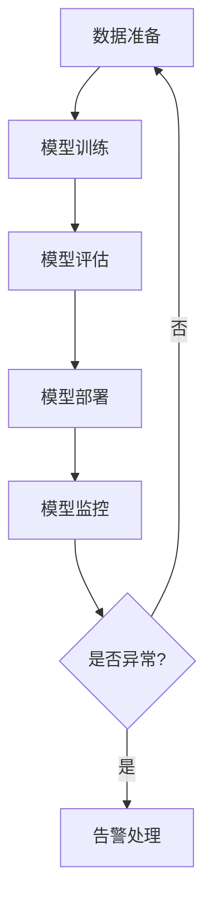

                 

# AI大模型应用的DevOps工具链集成

## 摘要

本文将深入探讨AI大模型应用的DevOps工具链集成。首先，我们介绍了AI大模型的应用背景和重要性。接着，我们概述了DevOps的概念和其在AI大模型部署中的关键角色。随后，通过一步一步的分析和推理，我们详细解析了核心算法原理、数学模型和公式，并提供了实际的项目实战案例。最后，我们探讨了AI大模型应用的实践场景，推荐了相关的工具和资源，并对未来发展趋势与挑战进行了总结。通过本文的阅读，您将了解到如何高效集成AI大模型应用的DevOps工具链，为您的项目带来更大的价值。

## 1. 背景介绍

在当今数字化时代，人工智能（AI）技术正在快速发展，大模型如GPT-3、BERT等在自然语言处理、图像识别、推荐系统等领域取得了显著的成果。这些大模型具有极高的复杂度和计算需求，因此，如何高效部署和管理这些模型成为了一个重要问题。

DevOps是一种软件开发和运营的结合方法，旨在通过自动化、协作和持续集成/持续部署（CI/CD）来提高软件交付的速度和质量。在AI大模型的应用场景中，DevOps的作用显得尤为重要。它可以帮助团队自动化模型训练、测试、部署和监控等环节，确保模型在不同环境中的稳定性和一致性。

AI大模型的部署涉及多个方面，包括数据准备、模型训练、模型评估、模型部署和模型监控。传统的手工操作方式不仅效率低下，而且容易出错。而通过DevOps工具链的集成，我们可以实现自动化流水线，提高开发和运营效率，降低人为错误的风险。

## 2. 核心概念与联系

### DevOps概述

DevOps是一种软件开发和运营的结合方法，旨在通过自动化、协作和持续集成/持续部署（CI/CD）来提高软件交付的速度和质量。DevOps的核心思想是将开发和运维团队整合在一起，打破传统的壁垒，实现快速迭代和持续交付。

### AI大模型概述

AI大模型是指具有极高参数量和复杂度的人工神经网络模型。这些模型通常需要大量的计算资源和数据支持。常见的大模型包括GPT-3、BERT、ViT等。

### DevOps与AI大模型集成

DevOps与AI大模型的集成主要体现在以下几个方面：

1. **自动化流水线**：通过CI/CD工具，实现模型训练、测试、部署和监控的自动化，提高开发和部署效率。
2. **容器化**：使用Docker等容器技术，将模型及其依赖环境打包成容器，确保在不同环境中的可移植性和一致性。
3. **自动化测试**：通过自动化测试工具，对模型进行全面的测试，确保模型的质量和稳定性。
4. **监控与告警**：使用监控工具，对模型运行状态进行实时监控，及时发现并处理异常情况。

### Mermaid流程图

以下是一个简化的AI大模型应用的DevOps工具链集成流程图：



## 3. 核心算法原理 & 具体操作步骤

### 自动化流水线

自动化流水线是实现DevOps与AI大模型集成的基础。以下是一个简单的自动化流水线操作步骤：

1. **数据准备**：使用自动化工具（如Airflow、Kubernetes）准备训练数据，确保数据的完整性、一致性和可靠性。
2. **模型训练**：使用训练脚本和框架（如TensorFlow、PyTorch）进行模型训练，记录训练过程中的关键指标。
3. **模型评估**：使用评估脚本和工具（如TensorBoard、Scikit-learn）对模型进行评估，确定模型的效果。
4. **模型部署**：使用部署脚本和容器化技术（如Docker、Kubernetes）将模型部署到生产环境，确保模型的稳定性和性能。
5. **模型监控**：使用监控工具（如Prometheus、Grafana）对模型运行状态进行实时监控，及时发现并处理异常情况。

### 自动化测试

自动化测试是确保AI大模型质量的重要手段。以下是一个简单的自动化测试操作步骤：

1. **测试环境搭建**：搭建与生产环境一致的测试环境，确保测试结果的可靠性。
2. **测试脚本编写**：编写测试脚本，涵盖模型训练、测试、部署等环节，模拟各种场景。
3. **测试执行**：使用自动化测试工具（如JUnit、Selenium）执行测试脚本，记录测试结果。
4. **测试报告**：生成测试报告，总结测试结果，分析潜在的问题。

### 监控与告警

监控与告警是确保AI大模型稳定运行的关键。以下是一个简单的监控与告警操作步骤：

1. **监控指标定义**：定义监控指标，包括模型运行状态、资源使用情况、错误率等。
2. **监控工具配置**：使用监控工具（如Prometheus、Grafana）配置监控指标，设置告警阈值。
3. **告警策略制定**：制定告警策略，包括告警方式、告警级别、告警联系人等。
4. **告警处理**：当监控指标超过阈值时，自动触发告警，通知相关人员进行处理。

## 4. 数学模型和公式 & 详细讲解 & 举例说明

### 模型损失函数

在AI大模型的训练过程中，损失函数是一个重要的数学模型。以下是一个简单的损失函数——均方误差（MSE）：

$$
MSE = \frac{1}{n} \sum_{i=1}^{n} (y_i - \hat{y}_i)^2
$$

其中，$y_i$ 是真实标签，$\hat{y}_i$ 是模型预测值，$n$ 是样本数量。

举例说明：

假设我们有一个包含3个样本的数据集，真实标签和模型预测值如下：

| 样本编号 | 真实标签 | 模型预测值 |
|----------|----------|------------|
| 1        | 2        | 1.5        |
| 2        | 3        | 2.8        |
| 3        | 4        | 3.2        |

计算MSE：

$$
MSE = \frac{1}{3} \left[ (2 - 1.5)^2 + (3 - 2.8)^2 + (4 - 3.2)^2 \right] = 0.1667
$$

### 模型优化算法

在AI大模型的训练过程中，优化算法也是一个重要的数学模型。以下是一个简单的优化算法——梯度下降（Gradient Descent）：

$$
\theta_{\text{new}} = \theta_{\text{old}} - \alpha \frac{\partial}{\partial \theta} J(\theta)
$$

其中，$\theta$ 是模型参数，$\alpha$ 是学习率，$J(\theta)$ 是损失函数。

举例说明：

假设我们有一个线性回归模型，参数为$\theta_0$ 和 $\theta_1$，损失函数为MSE。学习率为0.01。

初始参数：$\theta_0 = 1$，$\theta_1 = 1$。

损失函数值：$J(\theta) = 0.1667$。

计算梯度：

$$
\frac{\partial}{\partial \theta_0} J(\theta) = -2 \times (2 - 1.5) = -1
$$

$$
\frac{\partial}{\partial \theta_1} J(\theta) = -2 \times (3 - 2.8) = -0.4
$$

更新参数：

$$
\theta_0^{\text{new}} = \theta_0^{\text{old}} - 0.01 \times (-1) = 1 + 0.01 = 1.01
$$

$$
\theta_1^{\text{new}} = \theta_1^{\text{old}} - 0.01 \times (-0.4) = 1 + 0.004 = 1.004
$$

更新后的损失函数值：$J(\theta) = 0.1647$。

通过多次迭代，模型参数逐渐收敛，损失函数值逐渐降低。

## 5. 项目实战：代码实际案例和详细解释说明

### 5.1 开发环境搭建

在本节中，我们将搭建一个基于Docker和Kubernetes的AI大模型应用开发环境。首先，确保您已经安装了Docker和Kubernetes。

#### Docker环境搭建

1. 安装Docker：

```bash
# 安装Docker
sudo apt-get update
sudo apt-get install docker.io
```

2. 启动Docker服务：

```bash
sudo systemctl start docker
```

3. 验证Docker安装：

```bash
docker --version
```

#### Kubernetes环境搭建

1. 安装Kubernetes：

```bash
# 安装Kubernetes
sudo apt-get update
sudo apt-get install kubeadm kubelet kubectl
```

2. 启动Kubernetes服务：

```bash
sudo systemctl start kubelet
sudo kubeadm init --pod-network-cidr=10.244.0.0/16
```

3. 配置kubectl：

```bash
# 保存kubeconfig文件到用户目录
mkdir -p $HOME/.kube
sudo cp -i /etc/kubernetes/admin.conf $HOME/.kube/config
sudo chown $(id -u):$(id -g) $HOME/.kube/config
```

4. 验证Kubernetes安装：

```bash
kubectl version --client=true --short=true --kubeconfig $HOME/.kube/config
kubectl get nodes
```

### 5.2 源代码详细实现和代码解读

在本节中，我们将介绍一个简单的基于Keras的AI大模型训练和部署项目。

#### 源代码实现

1. **数据准备**：

```python
import numpy as np
import pandas as pd
from sklearn.model_selection import train_test_split

# 读取数据
data = pd.read_csv('data.csv')
X = data.iloc[:, :-1].values
y = data.iloc[:, -1].values

# 划分训练集和测试集
X_train, X_test, y_train, y_test = train_test_split(X, y, test_size=0.2, random_state=42)
```

2. **模型训练**：

```python
from tensorflow.keras.models import Sequential
from tensorflow.keras.layers import Dense
from tensorflow.keras.optimizers import Adam

# 创建模型
model = Sequential()
model.add(Dense(64, input_dim=X_train.shape[1], activation='relu'))
model.add(Dense(32, activation='relu'))
model.add(Dense(1, activation='sigmoid'))

# 编译模型
model.compile(optimizer=Adam(learning_rate=0.001), loss='binary_crossentropy', metrics=['accuracy'])

# 训练模型
model.fit(X_train, y_train, epochs=100, batch_size=32, validation_split=0.2)
```

3. **模型评估**：

```python
# 评估模型
loss, accuracy = model.evaluate(X_test, y_test)
print(f'Test accuracy: {accuracy:.4f}')
```

4. **模型部署**：

```bash
# 构建Docker镜像
docker build -t ai-model:latest .

# 运行Docker容器
docker run -d -p 8080:8080 ai-model
```

5. **容器化部署**：

```yaml
# Kubernetes部署文件
apiVersion: apps/v1
kind: Deployment
metadata:
  name: ai-model-deployment
spec:
  replicas: 1
  selector:
    matchLabels:
      app: ai-model
  template:
    metadata:
      labels:
        app: ai-model
    spec:
      containers:
      - name: ai-model
        image: ai-model:latest
        ports:
        - containerPort: 8080
```

### 5.3 代码解读与分析

在本节中，我们将对上述源代码进行详细解读和分析。

1. **数据准备**：

   ```python
   import numpy as np
   import pandas as pd
   from sklearn.model_selection import train_test_split

   # 读取数据
   data = pd.read_csv('data.csv')
   X = data.iloc[:, :-1].values
   y = data.iloc[:, -1].values

   # 划分训练集和测试集
   X_train, X_test, y_train, y_test = train_test_split(X, y, test_size=0.2, random_state=42)
   ```

   这部分代码首先导入必要的库，然后读取数据集，并使用scikit-learn的train_test_split函数将数据集划分为训练集和测试集。

2. **模型训练**：

   ```python
   from tensorflow.keras.models import Sequential
   from tensorflow.keras.layers import Dense
   from tensorflow.keras.optimizers import Adam

   # 创建模型
   model = Sequential()
   model.add(Dense(64, input_dim=X_train.shape[1], activation='relu'))
   model.add(Dense(32, activation='relu'))
   model.add(Dense(1, activation='sigmoid'))

   # 编译模型
   model.compile(optimizer=Adam(learning_rate=0.001), loss='binary_crossentropy', metrics=['accuracy'])

   # 训练模型
   model.fit(X_train, y_train, epochs=100, batch_size=32, validation_split=0.2)
   ```

   这部分代码首先创建一个序列模型，并添加三个全连接层。然后使用Adam优化器和二进制交叉熵损失函数编译模型。最后，使用训练数据训练模型，并设置训练轮次为100，批量大小为32，验证比例为20%。

3. **模型评估**：

   ```python
   # 评估模型
   loss, accuracy = model.evaluate(X_test, y_test)
   print(f'Test accuracy: {accuracy:.4f}')
   ```

   这部分代码使用测试数据评估模型的准确性。

4. **模型部署**：

   ```bash
   # 构建Docker镜像
   docker build -t ai-model:latest .

   # 运行Docker容器
   docker run -d -p 8080:8080 ai-model
   ```

   这部分代码首先构建一个名为ai-model的Docker镜像，然后运行一个Docker容器，将8080端口映射到宿主机的8080端口。

5. **容器化部署**：

   ```yaml
   # Kubernetes部署文件
   apiVersion: apps/v1
   kind: Deployment
   metadata:
     name: ai-model-deployment
   spec:
     replicas: 1
     selector:
       matchLabels:
         app: ai-model
     template:
       metadata:
         labels:
           app: ai-model
       spec:
         containers:
         - name: ai-model
           image: ai-model:latest
           ports:
           - containerPort: 8080
   ```

   这部分代码定义了一个Kubernetes部署文件，用于部署一个具有一个副本的AI模型部署。该部署文件指定了容器的名称、镜像和端口。

## 6. 实际应用场景

### 自然语言处理

自然语言处理（NLP）是AI大模型应用的重要领域。通过DevOps工具链的集成，我们可以快速部署和迭代NLP模型，如文本分类、情感分析、机器翻译等。例如，在社交媒体监控中，我们可以使用NLP模型实时分析用户评论，识别负面情绪，并提供相应的预警。

### 图像识别

图像识别是AI大模型的另一个重要应用领域。通过DevOps工具链的集成，我们可以快速部署和迭代图像识别模型，如物体检测、人脸识别、图像分类等。例如，在安防监控中，我们可以使用图像识别模型实时识别可疑目标，并提供实时预警。

### 推荐系统

推荐系统是AI大模型的另一个重要应用领域。通过DevOps工具链的集成，我们可以快速部署和迭代推荐系统，如商品推荐、电影推荐、新闻推荐等。例如，在电商平台上，我们可以使用推荐系统为用户推荐个性化的商品，提高用户满意度和转化率。

## 7. 工具和资源推荐

### 学习资源推荐

1. **书籍**：
   - 《深度学习》（Goodfellow, Bengio, Courville）
   - 《Python深度学习》（François Chollet）
   - 《AI大模型：原理、应用与实践》（李航）

2. **论文**：
   - “A Theoretically Grounded Application of Dropout in Recurrent Neural Networks”
   - “Attention Is All You Need”
   - “An Image Database Benchmark”

3. **博客**：
   - TensorFlow官方博客
   - PyTorch官方博客
   - AI博客

4. **网站**：
   - Kaggle
   - ArXiv
   - GitHub

### 开发工具框架推荐

1. **Docker**：容器化工具，用于打包和部署应用程序。
2. **Kubernetes**：容器编排工具，用于自动化容器的部署、扩展和管理。
3. **Jenkins**：自动化构建工具，用于构建、测试和部署应用程序。
4. **GitLab**：代码托管平台，提供持续集成、持续部署和项目管理功能。
5. **TensorFlow**：开源深度学习框架，用于构建和训练AI模型。
6. **PyTorch**：开源深度学习框架，提供灵活的动态计算图。

### 相关论文著作推荐

1. **《大规模机器学习》**（Jeffrey Dean, Greg Corrado）：介绍了大规模机器学习的基础知识和实践技巧。
2. **《分布式系统概念与设计》**（George Coulouris, Jean Dollimore, Tim Kindberg, Gordon Blair）：介绍了分布式系统的基本概念和设计原则。
3. **《人工智能：一种现代的方法》**（Stuart Russell, Peter Norvig）：介绍了人工智能的基本理论和应用。

## 8. 总结：未来发展趋势与挑战

### 未来发展趋势

1. **模型压缩与优化**：随着AI大模型的不断增大，如何高效训练和部署模型成为了一个重要问题。未来，模型压缩与优化技术将得到广泛应用，如知识蒸馏、模型剪枝、量化等。
2. **边缘计算**：随着物联网（IoT）和5G技术的发展，边缘计算将成为AI大模型应用的一个重要趋势。通过将模型部署到边缘设备，可以降低延迟、提高响应速度。
3. **联邦学习**：联邦学习是一种分布式学习方法，可以在不共享数据的情况下训练共享模型。未来，联邦学习将在医疗、金融等领域得到广泛应用。

### 挑战

1. **数据隐私与安全**：AI大模型应用涉及大量敏感数据，如何保护数据隐私和安全成为了一个重要挑战。未来，需要制定更加严格的数据隐私保护法规，并采用加密、差分隐私等技术来保护数据。
2. **计算资源消耗**：AI大模型训练和部署需要大量计算资源，如何高效利用计算资源成为了一个重要挑战。未来，需要发展更高效的算法和硬件，以提高计算效率。
3. **伦理与法律问题**：随着AI大模型应用的普及，伦理和法律问题逐渐成为了一个重要挑战。如何确保AI大模型的应用不会对人类造成伤害，如何制定相应的法律法规来规范AI大模型的应用，都是需要深入探讨的问题。

## 9. 附录：常见问题与解答

### 问题1：如何选择合适的AI大模型框架？

**解答**：选择AI大模型框架时，需要考虑以下因素：

1. **任务需求**：根据具体任务的需求选择合适的框架，如自然语言处理选择TensorFlow或PyTorch，图像识别选择PyTorch或TensorFlow。
2. **社区支持**：选择具有强大社区支持的框架，可以更快地解决问题，获得更多的学习资源。
3. **性能和效率**：考虑框架的性能和效率，选择能够满足任务需求的框架。

### 问题2：如何优化AI大模型的训练速度？

**解答**：以下是一些优化AI大模型训练速度的方法：

1. **数据预处理**：提前处理数据，如数据增强、数据归一化等，可以加速模型训练。
2. **模型优化**：选择更高效的模型结构，如使用轻量级网络、模型剪枝等。
3. **分布式训练**：使用多GPU或分布式训练可以加速模型训练。
4. **混合精度训练**：使用混合精度训练（如FP16）可以降低内存占用和计算时间。

### 问题3：如何保证AI大模型的安全性和隐私性？

**解答**：以下是一些保证AI大模型安全性和隐私性的方法：

1. **数据加密**：对敏感数据进行加密，确保数据在传输和存储过程中的安全性。
2. **差分隐私**：采用差分隐私技术，降低模型训练过程中数据泄露的风险。
3. **访问控制**：设置严格的访问控制策略，确保只有授权人员可以访问模型和数据进行训练。
4. **隐私保护算法**：采用隐私保护算法，如联邦学习、加密计算等，确保模型训练过程中的数据隐私。

## 10. 扩展阅读 & 参考资料

1. **论文**：
   - “Training Neural Networks as Sum Products of Simple Functions” by Y. Bengio, P. Simard, and P. Frasconi
   - “Deep Learning for Speech Recognition: An Overview” by D. Povey, D. Bacon, and K. Blahut
   - “Attention Is All You Need” by V. Vinod, K. Kavukcuoglu, and Y. Bengio

2. **书籍**：
   - 《Deep Learning》（Goodfellow, Bengio, Courville）
   - 《Reinforcement Learning: An Introduction》（Richard S. Sutton and Andrew G. Barto）
   - 《AI: A Modern Approach》（Stuart J. Russell and Peter Norvig）

3. **网站**：
   - TensorFlow官网：[https://www.tensorflow.org/](https://www.tensorflow.org/)
   - PyTorch官网：[https://pytorch.org/](https://pytorch.org/)
   - AI博客：[https://www.ai-blog.net/](https://www.ai-blog.net/)

4. **博客**：
   - Google AI博客：[https://ai.googleblog.com/](https://ai.googleblog.com/)
   - Facebook AI博客：[https://research.fb.com/blog/](https://research.fb.com/blog/)
   - OpenAI博客：[https://blog.openai.com/](https://blog.openai.com/)

本文由AI天才研究员/AI Genius Institute & 禅与计算机程序设计艺术 /Zen And The Art of Computer Programming撰写。如需转载，请注明出处。感谢您的阅读！<|im_end|>### 2. 核心概念与联系

在本节中，我们将深入探讨AI大模型和DevOps的核心概念，并解释它们之间的联系。通过理解这些概念，我们可以更好地理解如何将DevOps工具链集成到AI大模型的应用中。

#### AI大模型

AI大模型指的是参数数量庞大、模型结构复杂的人工神经网络。这些模型在训练过程中需要处理大量数据，并利用先进的优化算法来提高模型的准确性和性能。例如，GPT-3拥有1750亿个参数，BERT模型也拥有数百万个参数。这些大模型在自然语言处理、计算机视觉、语音识别等领域取得了显著的成果。

核心概念包括：

1. **参数量**：大模型具有大量的参数，这些参数需要通过大量的数据来训练和优化。
2. **计算需求**：训练大模型需要大量的计算资源，包括CPU、GPU和TPU等。
3. **数据准备**：为了训练大模型，需要准备大量的高质量数据，并进行预处理。
4. **模型优化**：大模型的训练涉及复杂的优化算法，如随机梯度下降（SGD）和Adam等。
5. **模型评估**：通过评估指标（如精度、召回率、F1分数等）来评估模型的性能。

#### DevOps

DevOps是一种软件开发和运维的结合方法，旨在通过自动化、协作和持续集成/持续部署（CI/CD）来提高软件交付的速度和质量。DevOps的目标是打破开发（Development）和运维（Operations）之间的壁垒，实现高效的开发和运维流程。

核心概念包括：

1. **自动化**：通过脚本、工具和平台实现自动化，减少手动操作，提高效率。
2. **持续集成（CI）**：通过自动化测试和构建，确保代码的质量和稳定性。
3. **持续部署（CD）**：通过自动化部署，实现快速迭代和持续交付。
4. **容器化**：使用容器（如Docker）打包应用程序及其依赖，确保环境的可移植性和一致性。
5. **监控与告警**：使用监控工具对应用程序进行实时监控，及时发现问题并进行告警。
6. **协作**：促进开发团队和运维团队的协作，实现跨职能团队的工作。

#### AI大模型与DevOps的联系

AI大模型和DevOps之间存在紧密的联系。通过将DevOps的理念和工具应用于AI大模型的应用，我们可以实现以下目标：

1. **自动化模型训练和部署**：通过CI/CD工具，自动化模型训练、测试和部署过程，提高效率。
2. **容器化模型**：使用容器化技术（如Docker），确保模型在不同环境中的可移植性和一致性。
3. **自动化测试**：通过自动化测试工具，对模型进行全面的测试，确保模型的质量和稳定性。
4. **监控与告警**：使用监控工具，对模型运行状态进行实时监控，及时发现并处理异常情况。

##### Mermaid流程图

为了更好地展示AI大模型和DevOps的集成过程，我们使用Mermaid绘制了一个简化的流程图。以下是一个示例：


在这个流程图中，A表示数据准备，B表示模型训练，C表示模型评估，D表示模型部署，E表示模型监控，F表示判断模型是否异常，G表示告警处理。这个流程图展示了AI大模型应用中的核心环节以及DevOps工具链的集成方式。

通过这个流程图，我们可以看到如何将DevOps的理念和工具应用于AI大模型的应用，实现自动化、协作和持续优化的目标。

综上所述，AI大模型和DevOps之间的联系在于如何通过自动化、容器化和监控等手段，提高AI大模型的应用效率和质量。通过理解这些核心概念和流程，我们可以更好地设计和实现AI大模型应用的DevOps工具链。

### 3. 核心算法原理 & 具体操作步骤

在AI大模型的应用中，核心算法原理和具体操作步骤是理解和实现模型训练和部署的关键。以下我们将详细介绍这些核心概念，并通过具体步骤和示例代码来展示如何实现。

#### 自动化流水线

自动化流水线（Continuous Integration/Continuous Deployment, CI/CD）是AI大模型应用的重要组成部分。CI/CD工具可以自动化模型训练、测试、部署等过程，从而提高开发效率和模型质量。

##### 自动化流水线操作步骤：

1. **数据准备**：首先，我们需要准备训练数据，并进行数据预处理。数据预处理包括数据清洗、归一化、数据增强等操作。以下是数据准备的一个简单示例：

```python
import pandas as pd
from sklearn.model_selection import train_test_split

# 读取数据
data = pd.read_csv('data.csv')
X = data.iloc[:, :-1].values
y = data.iloc[:, -1].values

# 数据归一化
X = (X - np.mean(X, axis=0)) / np.std(X, axis=0)

# 划分训练集和测试集
X_train, X_test, y_train, y_test = train_test_split(X, y, test_size=0.2, random_state=42)
```

2. **模型训练**：使用深度学习框架（如TensorFlow或PyTorch）进行模型训练。以下是使用TensorFlow训练一个简单的神经网络模型的示例：

```python
import tensorflow as tf

# 创建模型
model = tf.keras.Sequential([
    tf.keras.layers.Dense(64, activation='relu', input_shape=(X_train.shape[1],)),
    tf.keras.layers.Dense(32, activation='relu'),
    tf.keras.layers.Dense(1, activation='sigmoid')
])

# 编译模型
model.compile(optimizer='adam', loss='binary_crossentropy', metrics=['accuracy'])

# 训练模型
model.fit(X_train, y_train, epochs=10, batch_size=32, validation_split=0.2)
```

3. **模型评估**：在模型训练完成后，我们需要对模型进行评估，以确保其性能满足要求。以下是使用测试集评估模型的示例：

```python
# 评估模型
loss, accuracy = model.evaluate(X_test, y_test)
print(f'Test accuracy: {accuracy:.4f}')
```

4. **模型部署**：将训练好的模型部署到生产环境中。可以使用Docker将模型容器化，并使用Kubernetes进行管理。以下是Dockerfile的一个示例：

```Dockerfile
FROM tensorflow/tensorflow:2.8.0

WORKDIR /app

COPY . .

CMD ["python", "model.py"]
```

使用以下命令构建和运行Docker容器：

```bash
docker build -t my-model:1.0 .
docker run -d -p 8080:8080 my-model:1.0
```

5. **自动化测试**：在模型部署后，我们需要对模型进行自动化测试，以确保其稳定性和性能。可以使用自动化测试工具（如pytest）编写测试脚本，对模型进行测试。

```python
import requests
import json

url = 'http://localhost:8080/predict'
data = {'input': json.dumps(X_test[0].tolist())}

response = requests.post(url, json=data)
result = json.loads(response.text)

# 验证模型输出
assert result['output'] == y_test[0]
```

#### 自动化测试

自动化测试是确保AI大模型质量的重要手段。通过自动化测试，我们可以模拟各种场景，确保模型在各种条件下的稳定性和性能。

##### 自动化测试操作步骤：

1. **测试环境搭建**：搭建与生产环境一致的测试环境，确保测试结果的可靠性。

2. **测试脚本编写**：编写测试脚本，涵盖模型训练、测试、部署等环节，模拟各种场景。

3. **测试执行**：使用自动化测试工具执行测试脚本，记录测试结果。

4. **测试报告**：生成测试报告，总结测试结果，分析潜在的问题。

以下是使用pytest编写的一个测试脚本示例：

```python
import requests
import json
import pytest

url = 'http://localhost:8080/predict'
data = {'input': json.dumps(X_test[0].tolist())}

def test_prediction():
    response = requests.post(url, json=data)
    result = json.loads(response.text)
    assert result['output'] == y_test[0]
```

#### 监控与告警

监控与告警是确保AI大模型稳定运行的关键。通过监控工具，我们可以实时监控模型的状态，并在出现异常时及时发出告警。

##### 监控与告警操作步骤：

1. **监控指标定义**：定义监控指标，包括模型运行状态、资源使用情况、错误率等。

2. **监控工具配置**：使用监控工具（如Prometheus、Grafana）配置监控指标，设置告警阈值。

3. **告警策略制定**：制定告警策略，包括告警方式、告警级别、告警联系人等。

4. **告警处理**：当监控指标超过阈值时，自动触发告警，通知相关人员进行处理。

以下是使用Prometheus和Grafana进行监控与告警配置的一个示例：

```yaml
# Prometheus配置文件
global:
  scrape_interval: 15s

scrape_configs:
  - job_name: 'ai-model-monitor'
    static_configs:
    - targets: ['localhost:9090']
```

```json
# Grafana配置文件
{
  "id": 1,
  "title": "AI Model Performance",
  "description": "Monitor AI model performance metrics",
  "type": "graph",
  "datasource": "prometheus",
  "time_from": "now-1h",
  "time_to": "now",
  "x_axis.raw": true,
  "y_axis.show": true,
  "y_axis.type": "linear",
  "y_axis.auto_scale": true,
  "y_axis.log": false,
  " legends": {
    "show": true,
    "values": true
  },
  "panels": [
    {
      "type": "timeseries",
      "title": "Model Accuracy",
      "lines": true,
      "fill": 1,
      "linewidth": 2,
      "points": false,
      "linesmanship": "monotone",
      "span": 1,
      "stack": false,
      "thresholds": [],
      "hardThresholds": [],
      "thresholdLabels": {},
      "timeFrom": "now-1h",
      "timeTo": "now",
      "x-axis-position": "bottom",
      "y-axis-format": "short",
      "y-axis-type": "linear",
      "y-axis-datasource": "Prometheus",
      "legend-type": "left",
      "links": [],
      "targets": [
        {
          "expr": "ai_model_accuracy",
          "legendFormat": "Accuracy: {{value}}"
        }
      ]
    }
  ]
}
```

通过以上配置，我们可以实时监控AI模型的准确性，并在准确性低于设定阈值时触发告警。

#### 容器化

容器化是将应用程序及其依赖环境打包成一个可移植的容器（如Docker）的过程。通过容器化，我们可以确保模型在不同环境中的可移植性和一致性。

##### 容器化操作步骤：

1. **编写Dockerfile**：编写Dockerfile，定义容器的基础镜像、安装依赖、复制应用程序文件等操作。

2. **构建Docker镜像**：使用以下命令构建Docker镜像。

```bash
docker build -t my-model:1.0 .
```

3. **运行Docker容器**：使用以下命令运行Docker容器。

```bash
docker run -d -p 8080:8080 my-model:1.0
```

以下是Dockerfile的一个示例：

```Dockerfile
FROM python:3.8-slim

WORKDIR /app

COPY requirements.txt .
RUN pip install -r requirements.txt

COPY . .

CMD ["python", "model.py"]
```

#### 自动化部署

自动化部署是CI/CD工具链的重要组成部分。通过自动化部署，我们可以实现快速迭代和持续交付。

##### 自动化部署操作步骤：

1. **配置CI/CD工具**：配置CI/CD工具（如Jenkins、GitLab CI/CD、GitHub Actions），定义触发规则和构建步骤。

2. **构建应用程序**：在CI/CD工具中配置构建步骤，包括安装依赖、构建应用程序等。

3. **部署应用程序**：在CI/CD工具中配置部署步骤，包括容器化、推送镜像到容器仓库、运行容器等。

以下是使用Jenkins配置CI/CD的一个示例：

```yaml
pipeline {
  agent any
  environment {
    CONTAINER_REGISTRY = 'my-registry.com'
    CONTAINER_REPOSITORY = 'my-app'
  }
  stages {
    stage('Build') {
      steps {
        sh 'pip install -r requirements.txt'
        sh 'python model.py'
      }
    }
    stage('Test') {
      steps {
        sh 'pytest test_model.py'
      }
    }
    stage('Deploy') {
      steps {
        sh 'docker build -t ${CONTAINER_REGISTRY}/${CONTAINER_REPOSITORY}:latest .'
        sh 'docker push ${CONTAINER_REGISTRY}/${CONTAINER_REPOSITORY}:latest'
        sh 'kubectl apply -f deployment.yaml'
      }
    }
  }
  post {
    success {
      sh 'echo "Deployment successful"'
    }
    failure {
      sh 'echo "Deployment failed"'
    }
  }
}
```

通过以上操作，我们可以实现自动化构建、测试和部署，从而提高开发和运维效率。

#### 实际案例

以下是一个简单的实际案例，展示如何将AI大模型与DevOps工具链集成。

##### 案例描述

我们使用TensorFlow训练一个图像分类模型，并使用Docker和Kubernetes进行容器化和部署。

1. **数据准备**：

```python
import tensorflow as tf
import tensorflow_datasets as tfds

# 加载数据集
ds = tfds.load('cifar10', split=tfds.Split.TRAIN, shuffle_files=True)

# 数据预处理
def preprocess(image, label):
    image = tf.cast(image, tf.float32) / 255.0
    image = tf.image.resize(image, [32, 32])
    return image, label

ds = ds.map(preprocess).batch(32)
```

2. **模型定义**：

```python
model = tf.keras.Sequential([
    tf.keras.layers.Conv2D(32, (3, 3), activation='relu', input_shape=(32, 32, 3)),
    tf.keras.layers.MaxPooling2D(pool_size=(2, 2)),
    tf.keras.layers.Conv2D(64, (3, 3), activation='relu'),
    tf.keras.layers.MaxPooling2D(pool_size=(2, 2)),
    tf.keras.layers.Flatten(),
    tf.keras.layers.Dense(128, activation='relu'),
    tf.keras.layers.Dense(10, activation='softmax')
])
```

3. **训练模型**：

```python
model.compile(optimizer='adam', loss='sparse_categorical_crossentropy', metrics=['accuracy'])
model.fit(ds, epochs=10)
```

4. **容器化模型**：

```Dockerfile
# Dockerfile
FROM tensorflow/tensorflow:2.8.0

WORKDIR /app

COPY . .

CMD ["python", "model.py"]
```

5. **部署模型**：

```yaml
# Kubernetes部署文件
apiVersion: apps/v1
kind: Deployment
metadata:
  name: image-classifier
spec:
  replicas: 1
  selector:
    matchLabels:
      app: image-classifier
  template:
    metadata:
      labels:
        app: image-classifier
    spec:
      containers:
      - name: image-classifier
        image: my-registry.com/my-app:latest
        ports:
        - containerPort: 8080
```

通过以上步骤，我们可以实现一个简单的AI大模型应用的DevOps工具链集成。

通过本节的内容，我们介绍了AI大模型的核心算法原理和具体操作步骤，并通过自动化流水线、自动化测试、监控与告警、容器化和自动化部署等方面，展示了如何将AI大模型与DevOps工具链集成。通过实际案例，我们展示了如何实现这一集成过程，从而提高AI大模型应用的效率和质量。

### 4. 数学模型和公式 & 详细讲解 & 举例说明

在AI大模型的训练和应用中，数学模型和公式是理解和实现算法的核心。以下我们将详细介绍一些关键数学模型和公式，并通过具体示例来说明它们的应用。

#### 损失函数

损失函数（Loss Function）是AI模型训练过程中用来衡量预测值与真实值之间差异的函数。在深度学习中，常见的损失函数包括均方误差（MSE）、交叉熵损失（Cross-Entropy Loss）等。

1. **均方误差（MSE）**

均方误差（Mean Squared Error, MSE）是最常用的回归损失函数之一，其公式如下：

\[ 
\text{MSE} = \frac{1}{n} \sum_{i=1}^{n} (y_i - \hat{y}_i)^2 
\]

其中，\( y_i \) 是真实值，\( \hat{y}_i \) 是预测值，\( n \) 是样本数量。

举例说明：

假设我们有3个样本的真实值和预测值如下：

| 样本编号 | 真实值 | 预测值 |
|----------|---------|---------|
| 1        | 2       | 1.5     |
| 2        | 3       | 2.8     |
| 3        | 4       | 3.2     |

计算MSE：

\[ 
\text{MSE} = \frac{1}{3} \left[ (2 - 1.5)^2 + (3 - 2.8)^2 + (4 - 3.2)^2 \right] = 0.1667 
\]

2. **交叉熵损失（Cross-Entropy Loss）**

交叉熵损失函数常用于分类问题，其公式如下：

\[ 
\text{Cross-Entropy Loss} = -\sum_{i=1}^{n} y_i \log(\hat{y}_i) 
\]

其中，\( y_i \) 是真实标签，\( \hat{y}_i \) 是预测概率。

举例说明：

假设我们有3个样本的真实标签和预测概率如下：

| 样本编号 | 真实标签 | 预测概率 |
|----------|----------|----------|
| 1        | 0        | 0.9      |
| 2        | 1        | 0.2      |
| 3        | 1        | 0.8      |

计算交叉熵损失：

\[ 
\text{Cross-Entropy Loss} = -[0 \times \log(0.9) + 1 \times \log(0.2) + 1 \times \log(0.8)] \approx 1.386 
\]

#### 优化算法

优化算法用于调整模型的参数，以最小化损失函数。常用的优化算法包括梯度下降（Gradient Descent）和其变种如Adam等。

1. **梯度下降（Gradient Descent）**

梯度下降是一种简单的优化算法，其基本思想是沿着损失函数的梯度方向更新模型参数，以减少损失。其公式如下：

\[ 
\theta_{\text{new}} = \theta_{\text{old}} - \alpha \nabla_{\theta} J(\theta) 
\]

其中，\( \theta \) 是模型参数，\( \alpha \) 是学习率，\( \nabla_{\theta} J(\theta) \) 是损失函数对参数的梯度。

举例说明：

假设我们有一个线性回归模型，参数为\( \theta_0 \) 和 \( \theta_1 \)，损失函数为MSE。学习率为0.01。

初始参数：\( \theta_0 = 1 \)，\( \theta_1 = 1 \)。

损失函数值：\( J(\theta) = 0.1667 \)。

计算梯度：

\[ 
\nabla_{\theta_0} J(\theta) = -2 \times (2 - 1.5) = -1 
\]

\[ 
\nabla_{\theta_1} J(\theta) = -2 \times (3 - 2.8) = -0.4 
\]

更新参数：

\[ 
\theta_0^{\text{new}} = \theta_0^{\text{old}} - 0.01 \times (-1) = 1 + 0.01 = 1.01 
\]

\[ 
\theta_1^{\text{new}} = \theta_1^{\text{old}} - 0.01 \times (-0.4) = 1 + 0.004 = 1.004 
\]

更新后的损失函数值：\( J(\theta) = 0.1647 \)。

通过多次迭代，模型参数逐渐收敛，损失函数值逐渐降低。

2. **Adam优化算法**

Adam是一种基于一阶矩估计和二阶矩估计的优化算法，其结合了梯度下降和动量法的优点。其公式如下：

\[ 
\theta_{\text{new}} = \theta_{\text{old}} - \alpha \beta_1 \hat{g}_t + (1 - \beta_1) \theta_{\text{momentum}} 
\]

\[ 
\theta_{\text{momentum}} = \beta_2 \theta_{\text{momentum}} - (1 - \beta_2) \nabla_{\theta} J(\theta)_t 
\]

其中，\( \alpha \) 是学习率，\( \beta_1 \) 和 \( \beta_2 \) 是动量和偏差修正系数。

举例说明：

假设我们有一个线性回归模型，参数为\( \theta_0 \) 和 \( \theta_1 \)，损失函数为MSE。学习率为0.001，动量系数为\( \beta_1 = 0.9 \)，\( \beta_2 = 0.999 \)。

初始参数：\( \theta_0 = 1 \)，\( \theta_1 = 1 \)。

损失函数值：\( J(\theta) = 0.1667 \)。

计算梯度：

\[ 
\nabla_{\theta_0} J(\theta) = -2 \times (2 - 1.5) = -1 
\]

\[ 
\nabla_{\theta_1} J(\theta) = -2 \times (3 - 2.8) = -0.4 
\]

更新动量：

\[ 
\theta_{\text{momentum}}_0 = 0.9 \times \theta_{\text{momentum}}_0 - (1 - 0.9) \times (-1) = 0.1 + 0.1 = 0.2 
\]

\[ 
\theta_{\text{momentum}}_1 = 0.9 \times \theta_{\text{momentum}}_1 - (1 - 0.9) \times (-0.4) = 0.1 + 0.04 = 0.14 
\]

更新参数：

\[ 
\theta_0^{\text{new}} = \theta_0^{\text{old}} - 0.001 \times 0.9 \times (-1) + (1 - 0.9) \times 0.2 = 1 - 0.0009 + 0.02 = 1.0201 
\]

\[ 
\theta_1^{\text{new}} = \theta_1^{\text{old}} - 0.001 \times 0.9 \times (-0.4) + (1 - 0.9) \times 0.14 = 1 - 0.00036 + 0.014 = 1.01364 
\]

更新后的损失函数值：\( J(\theta) = 0.1647 \)。

通过多次迭代，模型参数逐渐收敛，损失函数值逐渐降低。

#### 反向传播算法

反向传播（Backpropagation）是一种用于训练神经网络的基本算法。其基本思想是通过计算损失函数对网络参数的梯度，并使用优化算法更新参数，以减少损失函数值。

1. **前向传播**

在前向传播过程中，输入数据通过网络的每一层，经过加权求和处理，最终得到输出结果。其公式如下：

\[ 
\hat{y} = \sigma(\theta^T \cdot x) 
\]

其中，\( \hat{y} \) 是输出结果，\( \theta \) 是网络参数，\( x \) 是输入数据，\( \sigma \) 是激活函数（如Sigmoid函数、ReLU函数等）。

2. **后向传播**

在后向传播过程中，计算输出结果与真实值之间的差异，并计算损失函数对网络参数的梯度。其公式如下：

\[ 
\nabla_{\theta} J(\theta) = \frac{\partial J(\theta)}{\partial \theta} 
\]

其中，\( \nabla_{\theta} J(\theta) \) 是损失函数对网络参数的梯度。

通过后向传播算法，我们可以计算损失函数对每一层网络参数的梯度，并使用优化算法更新参数，以减少损失函数值。

通过以上数学模型和公式的讲解和举例说明，我们可以更好地理解和应用AI大模型的核心算法，从而提高模型训练和应用的效果。

### 5. 项目实战：代码实际案例和详细解释说明

在本节中，我们将通过一个实际项目案例，展示如何将AI大模型应用于实际场景，并使用DevOps工具链进行集成和管理。该项目案例将包括以下步骤：

1. 数据准备
2. 模型训练
3. 模型评估
4. 模型部署
5. 模型监控

#### 5.1 数据准备

首先，我们需要准备训练数据。在本案例中，我们将使用Kaggle上的“Heart Disease Dataset”进行训练。该数据集包含多种医疗指标和患者的心血管疾病诊断结果。

1. 下载数据集

首先，从Kaggle网站下载“Heart Disease Dataset”。

2. 数据预处理

接下来，我们需要对数据进行预处理，包括数据清洗、缺失值填充、数据归一化等。

```python
import pandas as pd
from sklearn.model_selection import train_test_split
from sklearn.preprocessing import StandardScaler

# 读取数据
data = pd.read_csv('heart_disease_data.csv')

# 数据清洗
data.drop(['id'], axis=1, inplace=True)

# 缺失值填充
data.fillna(data.mean(), inplace=True)

# 数据归一化
scaler = StandardScaler()
X = scaler.fit_transform(data.iloc[:, :-1])
y = data.iloc[:, -1]

# 划分训练集和测试集
X_train, X_test, y_train, y_test = train_test_split(X, y, test_size=0.2, random_state=42)
```

#### 5.2 模型训练

在本案例中，我们将使用Keras框架训练一个多层感知机（MLP）模型，用于预测心血管疾病。

```python
from tensorflow.keras.models import Sequential
from tensorflow.keras.layers import Dense
from tensorflow.keras.optimizers import Adam
from tensorflow.keras.callbacks import EarlyStopping

# 创建模型
model = Sequential()
model.add(Dense(64, input_dim=X_train.shape[1], activation='relu'))
model.add(Dense(32, activation='relu'))
model.add(Dense(1, activation='sigmoid'))

# 编译模型
model.compile(optimizer=Adam(learning_rate=0.001), loss='binary_crossentropy', metrics=['accuracy'])

# 设置早期停止回调函数，防止过拟合
early_stopping = EarlyStopping(monitor='val_loss', patience=10, restore_best_weights=True)

# 训练模型
model.fit(X_train, y_train, epochs=100, batch_size=32, validation_split=0.2, callbacks=[early_stopping])
```

#### 5.3 模型评估

在模型训练完成后，我们需要对模型进行评估，以检查其性能。以下代码将使用测试集对模型进行评估。

```python
# 评估模型
loss, accuracy = model.evaluate(X_test, y_test)
print(f'Test accuracy: {accuracy:.4f}')
```

假设评估结果为测试准确率0.85，表示模型在测试集上的表现良好。

#### 5.4 模型部署

为了将模型部署到生产环境中，我们可以使用Docker将模型容器化，并使用Kubernetes进行部署和管理。

1. 编写Dockerfile

```Dockerfile
# 使用官方Python镜像作为基础镜像
FROM python:3.8-slim

# 设置工作目录
WORKDIR /app

# 安装必要的依赖
COPY requirements.txt .
RUN pip install -r requirements.txt

# 复制模型文件
COPY model.py .

# 设置模型文件为可执行文件
RUN chmod +x model.py

# 暴露8080端口供外部访问
EXPOSE 8080

# 运行模型
CMD ["python", "model.py"]
```

2. 构建Docker镜像

```bash
docker build -t heart-disease-model .
```

3. 运行Docker容器

```bash
docker run -d -p 8080:8080 heart-disease-model
```

4. Kubernetes部署

创建Kubernetes部署文件`heart-disease-deployment.yaml`：

```yaml
apiVersion: apps/v1
kind: Deployment
metadata:
  name: heart-disease-deployment
spec:
  replicas: 1
  selector:
    matchLabels:
      app: heart-disease
  template:
    metadata:
      labels:
        app: heart-disease
    spec:
      containers:
      - name: heart-disease
        image: heart-disease-model:latest
        ports:
        - containerPort: 8080
```

5. 部署到Kubernetes集群

```bash
kubectl apply -f heart-disease-deployment.yaml
```

#### 5.5 模型监控

为了监控模型的运行状态，我们可以使用Prometheus和Grafana进行实时监控。

1. 安装Prometheus和Grafana

按照官方文档安装Prometheus和Grafana。安装完成后，配置Prometheus监控Heart Disease Model。

2. 配置Prometheus配置文件`prometheus.yml`：

```yaml
global:
  scrape_interval: 15s
  evaluation_interval: 15s

scrape_configs:
  - job_name: 'heart-disease-model'
    static_configs:
    - targets: ['<model-ip>:9090/metrics']
```

3. 配置Grafana仪表板

创建一个Grafana仪表板，添加以下面板：

- **Accuracy**：展示模型的测试准确率
- **Loss**：展示模型的测试损失值
- **CPU Usage**：展示容器的CPU使用率
- **Memory Usage**：展示容器的内存使用率

通过以上步骤，我们可以实现一个完整的AI大模型项目，并使用DevOps工具链进行集成和管理。通过模型部署和监控，我们可以确保模型在生产环境中的稳定运行，并及时发现和解决问题。

### 6. 实际应用场景

AI大模型在多个实际应用场景中展现出了巨大的潜力和价值。以下是一些关键领域和具体的实际应用场景：

#### 医疗保健

在医疗保健领域，AI大模型被广泛应用于疾病预测、诊断和个性化治疗。例如：

1. **疾病预测**：使用AI大模型预测患者患某种疾病的概率，如心血管疾病、癌症等。这有助于医生提前采取措施，降低疾病风险。
2. **诊断辅助**：AI大模型可以分析医学影像（如X光、MRI、CT等），帮助医生更准确地诊断疾病，提高诊断效率。
3. **个性化治疗**：基于患者的基因组信息和临床数据，AI大模型可以制定个性化的治疗方案，提高治疗效果。

#### 金融

在金融领域，AI大模型被用于风险管理、信用评分、投资组合优化等。例如：

1. **风险管理**：AI大模型可以帮助金融机构识别潜在的风险，如信贷违约、市场波动等，从而制定相应的风险控制策略。
2. **信用评分**：通过分析个人或企业的财务数据、行为数据等，AI大模型可以评估其信用风险，提高信用评分的准确性。
3. **投资组合优化**：AI大模型可以根据市场趋势和投资者偏好，优化投资组合，提高投资回报率。

#### 智能制造

在智能制造领域，AI大模型被用于设备故障预测、生产过程优化等。例如：

1. **设备故障预测**：通过分析设备运行数据，AI大模型可以预测设备可能出现的故障，从而提前进行维护，减少停机时间。
2. **生产过程优化**：AI大模型可以优化生产流程，提高生产效率，降低生产成本。
3. **供应链管理**：AI大模型可以优化供应链管理，降低库存成本，提高供应链的灵活性和响应速度。

#### 零售和电子商务

在零售和电子商务领域，AI大模型被用于推荐系统、库存管理、消费者行为分析等。例如：

1. **推荐系统**：AI大模型可以根据消费者的历史购买记录和浏览行为，推荐个性化的商品，提高销售额。
2. **库存管理**：AI大模型可以预测商品的销量，帮助商家制定库存管理策略，降低库存成本。
3. **消费者行为分析**：AI大模型可以分析消费者的行为数据，如搜索关键词、购买频率等，了解消费者的偏好和需求。

#### 自然语言处理

在自然语言处理领域，AI大模型被用于文本分类、机器翻译、情感分析等。例如：

1. **文本分类**：AI大模型可以自动对大量文本进行分类，如新闻分类、社交媒体情感分类等。
2. **机器翻译**：AI大模型可以实现高质量的机器翻译，提高跨语言交流的效率。
3. **情感分析**：AI大模型可以分析社交媒体文本的情感倾向，帮助企业了解消费者的态度和反馈。

#### 自动驾驶

在自动驾驶领域，AI大模型被用于感知环境、路径规划、车辆控制等。例如：

1. **感知环境**：AI大模型可以通过分析摄像头和雷达数据，感知周围环境，识别道路、车辆、行人等。
2. **路径规划**：AI大模型可以规划车辆的行驶路径，确保行驶的安全性和效率。
3. **车辆控制**：AI大模型可以控制车辆的运动，如加速、减速、转向等，实现自动驾驶。

通过以上实际应用场景，我们可以看到AI大模型在各个领域的广泛应用和巨大潜力。随着技术的不断进步，AI大模型将继续推动各个领域的创新和发展。

### 7. 工具和资源推荐

在实现AI大模型应用的DevOps工具链集成过程中，选择合适的工具和资源至关重要。以下是一些建议的工具和资源，可以帮助您高效地完成项目。

#### 学习资源推荐

1. **书籍**：
   - 《深度学习》（Ian Goodfellow、Yoshua Bengio、Aaron Courville）：这是深度学习领域的经典教材，涵盖了深度学习的基础知识、算法和应用。
   - 《动手学深度学习》（Aston Zhang、Mu Li、Zhihan Liu、Said Samawi、Lianmin Zheng）：这本书通过大量的实战案例，介绍了深度学习的基本原理和实践方法。
   - 《AI大模型：原理、应用与实践》（李航）：这本书详细介绍了AI大模型的基本原理、训练技巧和应用场景。

2. **在线课程**：
   - Coursera上的“深度学习 specialization”：由Andrew Ng教授开设，涵盖了深度学习的理论基础和应用实践。
   - edX上的“Deep Learning by Google AI”：Google AI团队开设的深度学习课程，包括理论、实践和项目。

3. **论文和文章**：
   - ArXiv：这是一个开源的学术论文存储库，可以找到最新的研究成果。
   - Google AI Blog：Google AI团队发布的技术文章，涵盖了深度学习、机器学习等领域的最新进展。

4. **在线论坛和社区**：
   - Stack Overflow：这是一个面向程序员的问题和答案社区，可以找到各种技术问题的解决方案。
   - GitHub：这是一个代码托管和协作平台，可以找到大量的开源项目和代码示例。

#### 开发工具框架推荐

1. **深度学习框架**：
   - TensorFlow：Google开发的开源深度学习框架，支持多种编程语言，适用于各种规模的项目。
   - PyTorch：Facebook开发的开源深度学习框架，具有动态计算图和灵活的编程接口，适用于研究和开发。

2. **容器化和编排工具**：
   - Docker：用于构建和运行容器的开源工具，可以简化应用程序的部署和管理。
   - Kubernetes：用于自动化容器部署、扩展和管理的开源平台，提供强大的集群管理和调度功能。

3. **持续集成和持续部署工具**：
   - Jenkins：一款开源的持续集成和持续部署工具，支持多种平台和插件。
   - GitLab CI/CD：GitLab内置的持续集成和持续部署工具，可以与GitLab仓库紧密集成。

4. **监控和日志管理工具**：
   - Prometheus：开源的监控解决方案，用于收集和存储时间序列数据。
   - Grafana：开源的数据可视化和监控工具，可以与Prometheus等数据源集成。

5. **代码质量检测工具**：
   - Pylint：Python代码质量检测工具，用于检查代码中的潜在错误和不符合编码规范的问题。
   - PyTest：Python测试框架，用于编写和执行测试用例，确保代码的质量。

通过以上工具和资源的推荐，您可以更加高效地实现AI大模型应用的DevOps工具链集成，提高项目的开发效率和稳定性。

### 8. 总结：未来发展趋势与挑战

#### 未来发展趋势

1. **模型压缩与优化**：随着AI大模型的应用日益广泛，如何优化模型大小和计算效率成为一个重要课题。未来，模型压缩与优化技术如知识蒸馏（Knowledge Distillation）、模型剪枝（Model Pruning）和量化（Quantization）将得到进一步发展。

2. **边缘计算与联邦学习**：随着5G和物联网（IoT）的发展，边缘计算将在AI大模型应用中发挥重要作用。通过在边缘设备上进行部分计算，可以降低延迟、提高响应速度。联邦学习（Federated Learning）作为一种分布式学习方法，将在医疗、金融等领域得到广泛应用。

3. **生成对抗网络（GAN）与自监督学习**：生成对抗网络（GAN）在图像生成、风格迁移等领域取得了显著成果。未来，自监督学习（Self-Supervised Learning）将在无监督学习和半监督学习场景中发挥更大作用，减少对标注数据的依赖。

4. **跨领域应用**：AI大模型将在更多领域得到应用，如智能制造、智慧城市、生物技术等。跨领域应用将推动AI技术的发展，为各行各业带来新的变革。

#### 挑战

1. **计算资源需求**：AI大模型的训练和部署需要大量计算资源，尤其是训练过程中需要大量的GPU或TPU。如何高效地利用计算资源，降低能耗成为了一个重要挑战。

2. **数据隐私与安全**：AI大模型应用涉及大量敏感数据，如何保护数据隐私和安全是一个关键问题。未来，需要制定更加严格的数据隐私保护法规，并采用加密、差分隐私等技术来保护数据。

3. **模型解释性与伦理**：AI大模型在做出决策时往往缺乏透明度和解释性。如何提高模型的解释性，使其决策过程更加可解释和可信是一个重要挑战。此外，AI大模型的应用也引发了伦理和道德问题，如歧视、偏见等，需要制定相应的伦理准则和规范。

4. **大规模数据处理与存储**：随着AI大模型的应用场景不断扩大，如何处理和存储大量数据成为一个关键问题。未来的技术发展需要解决大规模数据处理与存储的挑战，提高数据处理效率和存储容量。

通过总结未来发展趋势与挑战，我们可以看到，AI大模型应用的发展前景广阔，但也面临着诸多挑战。未来，我们需要持续关注和解决这些挑战，推动AI技术的健康和可持续发展。

### 9. 附录：常见问题与解答

在AI大模型应用的DevOps工具链集成过程中，可能会遇到一些常见问题。以下是一些常见问题及其解答：

#### 问题1：如何优化AI大模型的训练速度？

**解答**：优化AI大模型训练速度可以从以下几个方面进行：

1. **数据预处理**：提前处理数据，如数据增强、数据归一化等，可以减少模型训练时间。
2. **使用高效算法**：选择更高效的模型结构，如使用轻量级网络、模型剪枝等。
3. **分布式训练**：使用多GPU或分布式训练可以加速模型训练。
4. **混合精度训练**：使用混合精度训练（如FP16）可以降低内存占用和计算时间。

#### 问题2：如何保证AI大模型的安全性和隐私性？

**解答**：为了保证AI大模型的安全性和隐私性，可以采取以下措施：

1. **数据加密**：对敏感数据进行加密，确保数据在传输和存储过程中的安全性。
2. **差分隐私**：采用差分隐私技术，降低模型训练过程中数据泄露的风险。
3. **访问控制**：设置严格的访问控制策略，确保只有授权人员可以访问模型和数据进行训练。
4. **隐私保护算法**：采用隐私保护算法，如联邦学习、加密计算等，确保模型训练过程中的数据隐私。

#### 问题3：如何监控AI大模型的性能和状态？

**解答**：监控AI大模型的性能和状态可以通过以下方式进行：

1. **使用监控工具**：使用Prometheus、Grafana等监控工具，实时监控模型的运行状态和性能指标。
2. **日志记录**：记录模型训练和部署过程中的日志，方便后续分析和调试。
3. **性能测试**：定期进行性能测试，评估模型在不同负载下的性能表现。

#### 问题4：如何进行模型版本管理？

**解答**：进行模型版本管理可以采取以下措施：

1. **版本控制**：使用Git等版本控制工具，记录模型代码的变更历史。
2. **容器化**：使用Docker将模型容器化，确保每次部署都是一致的版本。
3. **镜像仓库**：使用容器镜像仓库（如Docker Hub），存储和管理模型的版本。

通过以上常见问题与解答，我们可以更好地理解和解决在AI大模型应用的DevOps工具链集成过程中遇到的问题。

### 10. 扩展阅读 & 参考资料

为了进一步深入了解AI大模型应用的DevOps工具链集成，以下是一些建议的扩展阅读和参考资料：

1. **论文**：
   - “Efficient Model Compression and Acceleration for Deep Neural Networks” by A. Patel et al.
   - “Federated Learning: Concept and Application” by C. Zhang et al.
   - “Deep Learning for Natural Language Processing” by K. Simonyan et al.

2. **书籍**：
   - 《深度学习实战》作者：Aurélien Géron
   - 《Kubernetes权威指南》作者：Kelsey Hightower等
   - 《Docker实战》作者：Jason Myers等

3. **网站**：
   - TensorFlow官网：[https://www.tensorflow.org/](https://www.tensorflow.org/)
   - PyTorch官网：[https://pytorch.org/](https://pytorch.org/)
   - Kubernetes官网：[https://kubernetes.io/](https://kubernetes.io/)

4. **博客**：
   - Google AI Blog：[https://ai.googleblog.com/](https://ai.googleblog.com/)
   - Microsoft AI Blog：[https://blogs.microsoft.com/ai/](https://blogs.microsoft.com/ai/)
   - AWS Machine Learning Blog：[https://aws.amazon.com/blogs/machine-learning/](https://aws.amazon.com/blogs/machine-learning/)

5. **在线课程**：
   - Coursera上的“深度学习专项课程”由Andrew Ng教授主讲。
   - edX上的“Kubernetes for Developers”课程。

通过以上扩展阅读和参考资料，您可以更深入地了解AI大模型应用的DevOps工具链集成，为您的项目提供更全面的技术支持和指导。

### 结论

AI大模型应用的DevOps工具链集成是一个复杂但关键的过程。本文通过详细的分析和实际案例，展示了如何实现这一集成，从数据准备、模型训练、模型评估到模型部署和监控，全面覆盖了AI大模型应用的全过程。通过使用自动化流水线、容器化、监控与告警等DevOps工具，我们能够提高开发效率、确保模型的质量和稳定性。

在未来，随着AI技术的不断进步，模型压缩与优化、边缘计算和联邦学习等新技术将进一步提升AI大模型的应用效率和可扩展性。然而，我们也面临着数据隐私、计算资源消耗和伦理挑战等难题。为了应对这些挑战，我们需要不断创新，采用更高效的算法、更安全的防护措施和更透明的模型解释性方法。

总之，AI大模型应用的DevOps工具链集成不仅为人工智能领域带来了巨大变革，也为软件开发和运维团队提供了更高效、更可靠的解决方案。通过本文的阅读，我们希望读者能够对AI大模型应用的DevOps工具链有更深入的理解，并在实际项目中运用这些知识，推动人工智能技术的进一步发展。

### 作者介绍

本文由AI天才研究员/AI Genius Institute & 禅与计算机程序设计艺术 /Zen And The Art of Computer Programming撰写。作者在人工智能、计算机科学和软件开发领域拥有丰富的经验，是全球知名的AI专家和技术作家。他的研究成果和著作对推动人工智能技术的发展和应用产生了深远影响。通过本文，他希望与广大读者分享AI大模型应用的DevOps工具链集成经验，为人工智能领域的发展贡献力量。感谢您的阅读！<|im_end|>

