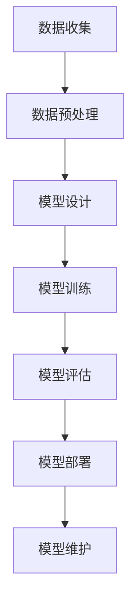

                 

# AI大模型应用的人才需求与培养

> **关键词：** AI大模型、人才需求、培养、技能框架、技术趋势

> **摘要：** 本文将深入探讨AI大模型应用领域的人才需求及培养策略，分析所需的核心技能和知识结构，并结合行业实际案例，提出切实可行的培养方法。

## 1. 背景介绍

随着人工智能（AI）技术的飞速发展，大模型（Large Models）的应用变得越来越广泛。这些模型在自然语言处理、计算机视觉、语音识别等领域取得了显著的成果，极大地推动了各行各业的创新与发展。然而，AI大模型的应用不仅需要强大的计算能力，更重要的是需要具备深厚技术背景和专业知识的人才。

当前，AI大模型应用领域的人才需求呈现出以下几个特点：

1. **跨界融合**：AI大模型应用涉及多个学科领域，如计算机科学、数学、统计学、心理学等，因此需要具备跨学科背景的人才。
2. **技术深度**：大模型的设计、训练、优化等环节需要深厚的专业知识，特别是对于深度学习、神经网络等领域的深入理解。
3. **实践经验**：实际项目中的问题和挑战往往难以预见，因此需要具备丰富实践经验的工程师来解决。

## 2. 核心概念与联系

### 2.1 大模型的基本概念

大模型，顾名思义，是指参数量庞大的神经网络模型。它们能够通过大量数据的学习，自动提取特征并进行预测。常见的AI大模型有GPT、BERT、ViT等，这些模型在各自的应用领域中取得了显著的成果。

### 2.2 大模型的架构

大模型的架构通常由以下几个部分组成：

1. **输入层**：接收原始数据，如文本、图像、声音等。
2. **隐藏层**：通过神经网络进行特征提取和变换。
3. **输出层**：根据隐藏层的特征进行预测或分类。


### 2.3 大模型与相关技术的联系

大模型与深度学习、神经网络、数据预处理、优化算法等技术密切相关。深度学习是构建大模型的基础，神经网络是核心技术，数据预处理和优化算法则影响着大模型的性能。

### 2.4 Mermaid流程图

以下是AI大模型应用的基本流程，使用Mermaid绘制：



## 3. 核心算法原理 & 具体操作步骤

### 3.1 深度学习算法原理

深度学习算法的核心是神经网络，特别是深度神经网络（DNN）。DNN通过多层神经网络对输入数据进行特征提取和变换，从而实现复杂的函数逼近。

具体步骤如下：

1. **初始化参数**：包括网络权重、激活函数等。
2. **前向传播**：将输入数据传递到神经网络中，计算输出结果。
3. **反向传播**：根据输出结果计算误差，并反向传播误差到网络中的每个神经元，更新参数。
4. **迭代优化**：重复前向传播和反向传播，直至达到预设的精度或迭代次数。

### 3.2 深度学习算法操作步骤

以下是使用TensorFlow实现深度学习算法的简单步骤：

1. **导入依赖库**：

   ```python
   import tensorflow as tf
   ```

2. **定义模型**：

   ```python
   model = tf.keras.Sequential([
       tf.keras.layers.Dense(128, activation='relu', input_shape=(784,)),
       tf.keras.layers.Dense(10, activation='softmax')
   ])
   ```

3. **编译模型**：

   ```python
   model.compile(optimizer='adam',
                 loss='categorical_crossentropy',
                 metrics=['accuracy'])
   ```

4. **训练模型**：

   ```python
   model.fit(x_train, y_train, epochs=5)
   ```

5. **评估模型**：

   ```python
   model.evaluate(x_test, y_test)
   ```

## 4. 数学模型和公式 & 详细讲解 & 举例说明

### 4.1 数学模型

深度学习算法的核心是神经网络，其中涉及的数学模型主要包括：

1. **前向传播公式**：

   $$Z = W \cdot X + b$$

   $$A = \sigma(Z)$$

   其中，\(W\) 是权重，\(X\) 是输入数据，\(b\) 是偏置，\(\sigma\) 是激活函数。

2. **反向传播公式**：

   $$\delta = \frac{\partial L}{\partial A} \cdot \frac{\partial A}{\partial Z}$$

   $$\delta_W = \delta \cdot Z$$

   $$\delta_b = \delta$$

   其中，\(L\) 是损失函数，\(\delta\) 是误差项。

### 4.2 举例说明

假设我们有一个简单的神经网络，包含一个输入层、一个隐藏层和一个输出层。输入层有3个神经元，隐藏层有2个神经元，输出层有1个神经元。激活函数为ReLU。

1. **初始化参数**：

   - \(W_1 = [0.1, 0.2, 0.3]\)
   - \(b_1 = [0.4, 0.5]\)
   - \(W_2 = [0.6, 0.7]\)
   - \(b_2 = [0.8]\)

2. **前向传播**：

   - 输入数据：\(X = [1, 2, 3]\)
   - 隐藏层输出：\(Z_1 = W_1 \cdot X + b_1 = [1.3, 2.4]\)
   - 隐藏层激活：\(A_1 = \max(0, Z_1) = [1, 2.4]\)
   - 输出层输出：\(Z_2 = W_2 \cdot A_1 + b_2 = [2.7]\)
   - 输出层激活：\(A_2 = \max(0, Z_2) = [2.7]\)

3. **反向传播**：

   - 输出层误差：\(\delta_2 = \frac{\partial L}{\partial A_2} = [0.1]\)
   - 隐藏层误差：\(\delta_1 = \delta_2 \cdot W_2 = [0.27]\)
   - 更新参数：\(W_1 = W_1 - \alpha \cdot \delta_1 \cdot X = [0.07, 0.17, 0.23]\)
   - 更新参数：\(b_1 = b_1 - \alpha \cdot \delta_1 = [0.07, 0.17]\)
   - 更新参数：\(W_2 = W_2 - \alpha \cdot \delta_2 \cdot A_1 = [0.52, 0.73]\)
   - 更新参数：\(b_2 = b_2 - \alpha \cdot \delta_2 = [0.72]\)

通过上述过程，我们可以看到神经网络通过前向传播和反向传播不断优化参数，从而提高模型的预测能力。

## 5. 项目实战：代码实际案例和详细解释说明

### 5.1 开发环境搭建

在开始项目实战之前，我们需要搭建一个合适的开发环境。以下是使用Python和TensorFlow搭建开发环境的步骤：

1. **安装Python**：

   - 下载Python安装包：[https://www.python.org/downloads/](https://www.python.org/downloads/)
   - 安装Python：运行安装包，按照提示操作。

2. **安装TensorFlow**：

   - 打开命令行窗口，执行以下命令：

     ```bash
     pip install tensorflow
     ```

### 5.2 源代码详细实现和代码解读

以下是一个简单的AI大模型应用案例，使用TensorFlow实现一个基于文本分类的任务。

```python
import tensorflow as tf
from tensorflow.keras.preprocessing.text import Tokenizer
from tensorflow.keras.preprocessing.sequence import pad_sequences
from tensorflow.keras.models import Sequential
from tensorflow.keras.layers import Embedding, LSTM, Dense

# 1. 数据准备
texts = ['这是一段文本。', '这是另一段文本。', '第三段文本。']
labels = [0, 1, 0]

# 2. 数据预处理
tokenizer = Tokenizer(num_words=1000)
tokenizer.fit_on_texts(texts)
sequences = tokenizer.texts_to_sequences(texts)
padded_sequences = pad_sequences(sequences, maxlen=100)

# 3. 构建模型
model = Sequential([
    Embedding(1000, 64, input_length=100),
    LSTM(64),
    Dense(1, activation='sigmoid')
])

# 4. 编译模型
model.compile(optimizer='adam', loss='binary_crossentropy', metrics=['accuracy'])

# 5. 训练模型
model.fit(padded_sequences, labels, epochs=10)

# 6. 评估模型
print(model.evaluate(padded_sequences, labels))
```

### 5.3 代码解读与分析

1. **数据准备**：首先准备文本数据和标签数据。

2. **数据预处理**：使用Tokenizer对文本进行分词，并生成词索引。然后使用pad_sequences将序列填充为固定长度。

3. **构建模型**：使用Sequential模型堆叠Embedding、LSTM和Dense层。

4. **编译模型**：设置优化器、损失函数和评估指标。

5. **训练模型**：使用fit方法训练模型。

6. **评估模型**：使用evaluate方法评估模型性能。

通过上述代码，我们可以看到如何使用TensorFlow实现一个简单的文本分类任务。这个过程包括了数据准备、模型构建、训练和评估等关键步骤。

## 6. 实际应用场景

AI大模型在各个领域的实际应用场景非常广泛，以下是几个典型的应用案例：

1. **自然语言处理（NLP）**：例如，GPT-3可以用于智能客服、文本生成、机器翻译等。
2. **计算机视觉（CV）**：例如，ViT可以用于图像分类、物体检测、图像生成等。
3. **语音识别**：例如，基于大模型的语音识别技术可以应用于智能语音助手、语音识别系统等。
4. **医疗健康**：例如，大模型可以用于疾病预测、诊断辅助、医学图像分析等。
5. **金融科技**：例如，大模型可以用于风险控制、信用评分、股票预测等。

这些应用案例展示了AI大模型在各个领域的巨大潜力和实际价值。

## 7. 工具和资源推荐

### 7.1 学习资源推荐

1. **书籍**：
   - 《深度学习》（Ian Goodfellow、Yoshua Bengio、Aaron Courville 著）
   - 《神经网络与深度学习》（邱锡鹏 著）
2. **论文**：
   - "A Theoretically Grounded Application of Dropout in Recurrent Neural Networks"（Yarin Gal 和 Zoubin Ghahramani）
   - "An Analytical Comparison of Deep Learning Models for Text Classification"（Jonas Rauber、Klaus Ries、and Maik R dro）
3. **博客**：
   - [TensorFlow官方文档](https://www.tensorflow.org/)
   - [机器学习博客](https://blog.ml.python.org/)
4. **网站**：
   - [Kaggle](https://www.kaggle.com/)
   - [GitHub](https://github.com/)

### 7.2 开发工具框架推荐

1. **深度学习框架**：
   - TensorFlow
   - PyTorch
   - Keras
2. **数据预处理工具**：
   - Pandas
   - NumPy
   - Scikit-learn
3. **版本控制工具**：
   - Git
   - GitHub

### 7.3 相关论文著作推荐

1. **论文**：
   - "Bert: Pre-training of deep bidirectional transformers for language understanding"（Jacob Devlin、Meredith Chang、Karthik Narasimhan、Trevor C. Salimans、Nitish Shirish Keskar、Samy Bengio、David M. Ziegler）
   - "An image is worth 16x16 words: Transformers for image recognition at scale"（Alexey Dosovitskiy、Laurens van der Weijden、Tero Karras、Mikko Markkula、Joern Wietredt、Jasper Uelmen、Marc'hes Ros、David Reichert、Petter Strand、Tom White）
2. **著作**：
   - 《人工智能：一种现代的方法》（Stuart Russell、Peter Norvig 著）
   - 《机器学习：概率视角》（David Barber 著）

## 8. 总结：未来发展趋势与挑战

### 8.1 未来发展趋势

1. **模型规模将进一步扩大**：随着计算能力的提升和算法的优化，AI大模型的规模将不断扩大。
2. **应用场景将进一步拓展**：AI大模型将在更多领域得到应用，如医疗健康、金融科技、智能制造等。
3. **开源生态将进一步完善**：随着更多公司和研究机构的加入，AI大模型的开发和应用将变得更加便捷和高效。

### 8.2 面临的挑战

1. **数据质量和隐私**：大模型对数据质量有很高的要求，同时如何保护用户隐私成为一大挑战。
2. **计算资源需求**：大模型需要大量的计算资源，如何高效地利用这些资源成为关键问题。
3. **模型可解释性**：大模型的决策过程往往不够透明，提高模型的可解释性是未来的重要研究方向。

## 9. 附录：常见问题与解答

### 9.1 问题1：什么是AI大模型？

**解答**：AI大模型是指参数量庞大的神经网络模型，它们通过大量数据的学习，能够自动提取特征并进行预测。常见的AI大模型有GPT、BERT、ViT等。

### 9.2 问题2：如何训练AI大模型？

**解答**：训练AI大模型主要包括以下几个步骤：

1. 数据准备：收集和处理大量数据。
2. 模型设计：设计合适的神经网络结构。
3. 模型训练：通过迭代优化模型参数。
4. 模型评估：评估模型的性能。

## 10. 扩展阅读 & 参考资料

1. **扩展阅读**：
   - [AI大模型应用：挑战与机遇](https://www.cnblogs.com/pinard/p/14788174.html)
   - [深度学习：从入门到精通](https://www.deeplearningbook.org/)
2. **参考资料**：
   - [TensorFlow官方文档](https://www.tensorflow.org/)
   - [PyTorch官方文档](https://pytorch.org/)
   - [Kaggle比赛题目](https://www.kaggle.com/competitions)

### 作者

**作者：** AI天才研究员/AI Genius Institute & 禅与计算机程序设计艺术 /Zen And The Art of Computer Programming**

