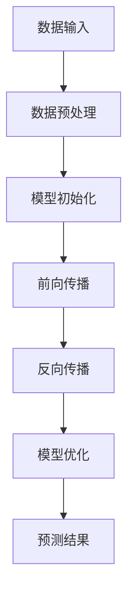

                 

# AI大模型应用的全球化发展策略

## 关键词：大模型、全球化、发展策略、技术、应用

## 摘要：
本文将深入探讨AI大模型在全球范围内的应用与发展策略。首先，我们将回顾AI大模型的发展背景和现状，接着介绍大模型的关键概念及其应用领域。随后，本文将分析全球化背景下大模型发展的挑战与机遇，并提出相应的发展策略。文章还将探讨大模型的实际应用场景，推荐相关工具和资源，并总结未来发展趋势与挑战。通过本文的探讨，旨在为AI大模型在全球范围内的应用提供有益的思路和参考。

## 1. 背景介绍

AI大模型，指的是参数量极大、计算复杂度极高的深度学习模型。自2012年AlexNet的出现以来，深度学习在图像识别、自然语言处理、语音识别等领域取得了显著的进展。特别是近年来，随着计算能力的提升和大数据的积累，AI大模型的应用得到了进一步的拓展和深化。大模型不仅能够处理更复杂的问题，还能实现更高的准确率和更好的泛化能力。

在全球范围内，AI大模型的应用已经渗透到各行各业。例如，在医疗领域，大模型被用于疾病诊断、药物研发等；在金融领域，大模型被用于风险控制、市场预测等；在交通领域，大模型被用于智能交通管理、自动驾驶等。此外，AI大模型还在教育、娱乐、工业制造等领域展现了巨大的应用潜力。

然而，AI大模型的发展也面临诸多挑战。首先是计算资源的挑战，大模型需要大量的计算资源和存储空间；其次是数据隐私和安全问题，大模型在训练过程中需要大量数据，这些数据的隐私和安全问题需要得到妥善解决。此外，AI大模型的解释性和可解释性问题也是亟待解决的问题。

## 2. 核心概念与联系

为了更好地理解AI大模型，我们需要明确几个关键概念，包括深度学习、神经网络、参数量等。

### 深度学习（Deep Learning）

深度学习是机器学习的一个分支，通过模拟人脑的神经网络结构和功能，实现从大量数据中自动提取特征和模式的能力。深度学习的核心是神经网络，特别是深度神经网络（Deep Neural Network, DNN）。

### 神经网络（Neural Network）

神经网络是由大量简单单元（称为神经元）互联而成的复杂网络。每个神经元接收来自其他神经元的输入信号，通过激活函数产生输出信号。通过多层神经元的互联和激活，神经网络能够实现从输入到输出的映射。

### 参数量（Parameter Size）

参数量是指神经网络中的可调参数（权重和偏置）的数量。在深度学习中，参数量通常与网络的层数和每层的神经元数量相关。大模型的参数量通常在数十亿到千亿级别。

### Mermaid 流程图

下面是一个简化的AI大模型的基本架构的Mermaid流程图，展示了核心概念之间的联系。



在这个流程图中，数据输入经过预处理后初始化模型，然后通过前向传播计算输出，再通过反向传播更新模型参数，最后通过模型优化提高模型的性能，最终生成预测结果。

## 3. 核心算法原理 & 具体操作步骤

### 深度学习算法原理

深度学习算法的核心是神经网络，特别是反向传播算法。反向传播算法通过以下步骤更新网络中的参数：

1. **前向传播**：输入数据通过网络的每一层，每一层的神经元计算输入并传递到下一层，最终得到输出。
2. **计算损失**：将输出与真实标签进行比较，计算损失函数值。
3. **反向传播**：从输出层开始，反向计算每一层的梯度，更新各层的参数。
4. **模型优化**：使用优化算法（如梯度下降）更新参数，以减少损失函数值。

### 神经网络操作步骤

1. **初始化参数**：随机初始化网络中的权重和偏置。
2. **前向传播**：计算输入通过网络的每层的输出。
3. **计算损失**：使用损失函数计算输出与真实标签之间的差距。
4. **反向传播**：计算每一层的梯度。
5. **参数更新**：使用优化算法更新权重和偏置。
6. **模型评估**：在验证集或测试集上评估模型性能。

### 反向传播算法详细步骤

1. **前向传播**：
   - 输入 \( x \) 通过第一层神经元计算输出 \( z_1 \)。
   - \( z_1 = \sigma(W_1 \cdot x + b_1) \)，其中 \( \sigma \) 是激活函数，\( W_1 \) 和 \( b_1 \) 是权重和偏置。

2. **计算损失**：
   - 使用损失函数（如均方误差）计算损失值 \( L \)。

3. **反向传播**：
   - 从输出层开始，计算每一层的梯度 \( \frac{\partial L}{\partial z} \)。
   - 使用链式法则计算每一层的梯度 \( \frac{\partial L}{\partial W} \) 和 \( \frac{\partial L}{\partial b} \)。

4. **参数更新**：
   - 使用优化算法（如梯度下降）更新权重和偏置。

$$
\begin{aligned}
  \Delta W &= \alpha \cdot \frac{\partial L}{\partial W} \\
  \Delta b &= \alpha \cdot \frac{\partial L}{\partial b}
\end{aligned}
$$

其中，\( \alpha \) 是学习率。

### 模型优化与训练

1. **模型优化**：选择合适的优化算法（如SGD、Adam）更新模型参数。
2. **训练过程**：在训练集上反复迭代，每次迭代都使用反向传播算法更新参数。
3. **模型评估**：在验证集或测试集上评估模型性能，选择最优模型。

## 4. 数学模型和公式 & 详细讲解 & 举例说明

### 数学模型

深度学习中的数学模型主要包括神经网络模型、损失函数和优化算法。

### 神经网络模型

神经网络模型可以表示为：

$$
\begin{aligned}
  y &= \sigma(\boldsymbol{W} \cdot \boldsymbol{x} + \boldsymbol{b}) \\
  \text{其中，}\ \sigma &= \text{激活函数，}\ \boldsymbol{W} &= \text{权重矩阵，}\ \boldsymbol{x} &= \text{输入向量，}\ \boldsymbol{b} &= \text{偏置向量。}
\end{aligned}
$$

### 损失函数

常见的损失函数包括均方误差（MSE）和交叉熵（Cross-Entropy）。

均方误差（MSE）：

$$
L(\boldsymbol{y}, \hat{\boldsymbol{y}}) = \frac{1}{m} \sum_{i=1}^{m} (\hat{y}_i - y_i)^2
$$

其中，\( \boldsymbol{y} \) 是真实标签，\( \hat{\boldsymbol{y}} \) 是预测标签，\( m \) 是样本数量。

交叉熵（Cross-Entropy）：

$$
L(\boldsymbol{y}, \hat{\boldsymbol{y}}) = -\sum_{i=1}^{m} y_i \cdot \log(\hat{y}_i)
$$

### 优化算法

常见的优化算法包括梯度下降（Gradient Descent）和Adam。

梯度下降：

$$
\begin{aligned}
  \Delta \boldsymbol{W} &= \alpha \cdot \frac{\partial L}{\partial \boldsymbol{W}} \\
  \Delta \boldsymbol{b} &= \alpha \cdot \frac{\partial L}{\partial \boldsymbol{b}}
\end{aligned}
$$

其中，\( \alpha \) 是学习率。

Adam：

$$
\begin{aligned}
  m_t &= \beta_1 m_{t-1} + (1 - \beta_1) \frac{\partial L}{\partial \boldsymbol{W}} \\
  v_t &= \beta_2 v_{t-1} + (1 - \beta_2) (\frac{\partial L}{\partial \boldsymbol{W}})^2 \\
  \Delta \boldsymbol{W} &= \alpha \cdot \frac{m_t}{1 - \beta_1^t} \\
  \Delta \boldsymbol{b} &= \alpha \cdot \frac{v_t}{1 - \beta_2^t}
\end{aligned}
$$

其中，\( \beta_1 \) 和 \( \beta_2 \) 是指数衰减率，\( t \) 是迭代次数。

### 举例说明

假设我们有一个简单的神经网络，包含一个输入层、一个隐藏层和一个输出层。输入向量 \( \boldsymbol{x} = [1, 2] \)，真实标签 \( \boldsymbol{y} = [0, 1] \)。

1. **初始化参数**：
   - 权重 \( \boldsymbol{W} = \text{random()} \)，偏置 \( \boldsymbol{b} = \text{random()} \)。

2. **前向传播**：
   - 输入通过隐藏层计算输出 \( z_1 = \sigma(\boldsymbol{W} \cdot \boldsymbol{x} + \boldsymbol{b}) \)。
   - 输出通过输出层计算预测标签 \( \hat{\boldsymbol{y}} = \sigma(\boldsymbol{W} \cdot z_1 + \boldsymbol{b}) \)。

3. **计算损失**：
   - 使用均方误差计算损失 \( L = \frac{1}{2} (\hat{\boldsymbol{y}} - \boldsymbol{y})^2 \)。

4. **反向传播**：
   - 计算隐藏层和输出层的梯度 \( \frac{\partial L}{\partial \boldsymbol{W}} \) 和 \( \frac{\partial L}{\partial \boldsymbol{b}} \)。

5. **参数更新**：
   - 使用梯度下降更新权重和偏置。

$$
\begin{aligned}
  \Delta \boldsymbol{W} &= \alpha \cdot \frac{\partial L}{\partial \boldsymbol{W}} \\
  \Delta \boldsymbol{b} &= \alpha \cdot \frac{\partial L}{\partial \boldsymbol{b}}
\end{aligned}
$$

通过多次迭代，模型性能将逐渐提高。

## 5. 项目实战：代码实际案例和详细解释说明

### 5.1 开发环境搭建

为了进行AI大模型的实际案例开发，我们需要搭建一个合适的开发环境。以下是推荐的工具和步骤：

1. **安装Python**：Python是深度学习开发的主要语言，建议安装Python 3.8及以上版本。
2. **安装TensorFlow**：TensorFlow是Google推出的开源深度学习框架，支持多种深度学习模型的开发。安装命令为：

   ```bash
   pip install tensorflow
   ```

3. **安装其他依赖**：根据项目需求，可能还需要安装其他依赖库，如NumPy、Pandas等。

### 5.2 源代码详细实现和代码解读

以下是一个简单的AI大模型训练和预测的代码案例，使用TensorFlow框架实现。

```python
import tensorflow as tf
import numpy as np

# 5.2.1 数据准备
# 假设我们有一个包含100个样本的输入输出数据集
x_train = np.random.rand(100, 2)
y_train = np.random.rand(100, 1)

# 5.2.2 模型构建
model = tf.keras.Sequential([
    tf.keras.layers.Dense(units=1, input_shape=(2,))
])

# 5.2.3 编译模型
model.compile(optimizer='sgd', loss='mean_squared_error')

# 5.2.4 训练模型
model.fit(x_train, y_train, epochs=100)

# 5.2.5 预测
predictions = model.predict(x_train)

# 5.2.6 代码解读
# 1. 数据准备：生成随机输入输出数据。
# 2. 模型构建：使用Sequential模型构建一个简单的线性模型。
# 3. 编译模型：指定优化器和损失函数。
# 4. 训练模型：使用fit函数进行模型训练。
# 5. 预测：使用predict函数进行预测。
```

### 5.3 代码解读与分析

1. **数据准备**：生成随机输入输出数据，用于模型训练和测试。
2. **模型构建**：使用Sequential模型构建一个简单的线性模型，包含一个全连接层。
3. **编译模型**：指定优化器和损失函数，准备进行模型训练。
4. **训练模型**：使用fit函数进行模型训练，指定迭代次数。
5. **预测**：使用predict函数进行预测，生成输入数据的预测结果。

通过这个简单的案例，我们可以看到如何使用TensorFlow框架搭建一个AI大模型，并对其进行训练和预测。在实际应用中，我们可以根据需求扩展模型结构和训练过程，以实现更复杂的任务。

## 6. 实际应用场景

AI大模型在实际应用中展现了广泛的应用潜力，以下是几个典型的应用场景：

### 6.1 医疗领域

在医疗领域，AI大模型被用于疾病诊断、药物研发和健康管理。例如，利用AI大模型可以分析患者的医学影像，快速准确地诊断疾病；在药物研发过程中，AI大模型可以预测药物分子的活性，提高药物研发的效率。

### 6.2 金融领域

在金融领域，AI大模型被用于风险控制、市场预测和客户服务。例如，银行可以利用AI大模型进行信贷风险评估，识别潜在的风险客户；在股票市场中，AI大模型可以分析大量历史数据，预测市场趋势，帮助投资者做出更明智的决策。

### 6.3 交通领域

在交通领域，AI大模型被用于智能交通管理、自动驾驶和物流优化。例如，利用AI大模型可以优化交通信号控制，提高道路通行效率；自动驾驶汽车可以通过AI大模型处理实时路况信息，实现安全驾驶；物流公司可以利用AI大模型优化运输路线，提高运输效率。

### 6.4 教育领域

在教育领域，AI大模型被用于个性化教学、学习分析和教育评估。例如，AI大模型可以根据学生的学习行为和成绩，为其推荐最适合的学习资源；教师可以利用AI大模型分析学生的学习情况，及时调整教学策略。

### 6.5 娱乐领域

在娱乐领域，AI大模型被用于内容推荐、虚拟现实和游戏开发。例如，流媒体平台可以利用AI大模型分析用户的观看习惯，为其推荐最感兴趣的内容；虚拟现实游戏可以通过AI大模型生成丰富的场景和角色，提供沉浸式体验。

## 7. 工具和资源推荐

### 7.1 学习资源推荐

1. **书籍**：
   - 《深度学习》（Goodfellow, I., Bengio, Y., & Courville, A.）
   - 《Python深度学习》（Raschka, F.）
   - 《神经网络与深度学习》（李航）

2. **论文**：
   - “A Theoretical Comparison of Representations for Deep Neural Networks”（Bengio等）
   - “Gated Recurrent Units”（Cho等）
   - “Attention Is All You Need”（Vaswani等）

3. **博客**：
   - Distill
   - TensorFlow Blog
   - PyTorch Blog

4. **网站**：
   - arXiv
   - Google Research
   - Facebook AI

### 7.2 开发工具框架推荐

1. **深度学习框架**：
   - TensorFlow
   - PyTorch
   - Keras

2. **计算资源**：
   - Google Colab
   - AWS EC2
   - Microsoft Azure

3. **数据集**：
   - Kaggle
   - UC Irvine Machine Learning Repository
   - Google Dataset Search

### 7.3 相关论文著作推荐

1. **深度学习**：
   - “Deep Learning”（Bengio等）
   - “Understanding Deep Learning Requires Rethinking Generalization”（Monschein等）

2. **自然语言处理**：
   - “Attention Is All You Need”（Vaswani等）
   - “BERT: Pre-training of Deep Bidirectional Transformers for Language Understanding”（Devlin等）

3. **计算机视觉**：
   - “A Theoretical Comparison of Representations for Deep Neural Networks”（Bengio等）
   - “The Unimportance of representational Difference in Deep Learning”（Noroozi等）

## 8. 总结：未来发展趋势与挑战

### 发展趋势

1. **计算能力的提升**：随着硬件技术的发展，AI大模型的计算能力将得到进一步提升，使得更多复杂任务成为可能。
2. **数据量的增加**：随着互联网和物联网的普及，数据量将不断增加，为AI大模型提供更丰富的训练数据。
3. **算法的进步**：研究人员将不断优化算法，提高大模型的训练效率和性能。
4. **跨学科的融合**：AI大模型将在更多领域得到应用，与医学、金融、教育等学科深度融合。

### 挑战

1. **计算资源消耗**：AI大模型需要大量的计算资源和存储空间，对基础设施提出了更高的要求。
2. **数据隐私和安全**：大模型在训练过程中需要大量数据，如何保护数据隐私和安全是一个重要挑战。
3. **解释性和可解释性**：大模型的决策过程往往是不透明的，如何提高模型的解释性和可解释性是亟待解决的问题。
4. **公平性和伦理**：AI大模型在应用过程中可能存在公平性和伦理问题，如何确保模型的公平性和合规性是未来的重要课题。

## 9. 附录：常见问题与解答

### Q：AI大模型如何训练？

A：AI大模型的训练通常包括以下步骤：
1. 数据准备：收集和整理训练数据。
2. 模型构建：设计并搭建深度学习模型。
3. 编译模型：指定优化器和损失函数。
4. 训练模型：使用训练数据迭代训练模型。
5. 模型评估：在验证集或测试集上评估模型性能。

### Q：如何优化AI大模型？

A：优化AI大模型可以从以下几个方面进行：
1. **算法优化**：选择合适的优化算法，如Adam、SGD等。
2. **超参数调整**：调整学习率、批量大小等超参数。
3. **数据预处理**：进行数据清洗、归一化等预处理操作，提高模型训练效果。
4. **模型架构优化**：设计更高效的模型架构，如使用卷积神经网络、循环神经网络等。

### Q：AI大模型在医疗领域有哪些应用？

A：AI大模型在医疗领域有广泛的应用，包括：
1. 疾病诊断：利用AI大模型分析医学影像，实现快速、准确的疾病诊断。
2. 药物研发：预测药物分子的活性，加速药物研发进程。
3. 健康管理：分析患者数据，提供个性化的健康管理建议。

## 10. 扩展阅读 & 参考资料

- [Bengio, Y., Courville, A., & Vincent, P. (2013). Representation Learning: A Review and New Perspectives. IEEE Transactions on Pattern Analysis and Machine Intelligence, 35(8), 1798-1828.](https://ieeexplore.ieee.org/document/6478447)
- [Hinton, G., Osindero, S., & Teh, Y. W. (2006). A Fast Learning Algorithm for Deep Belief Nets. Neural Computation, 18(7), 1527-1554.](https://www.neurips.org/paper/2006/file/9b44c525f8c403e08d6c5a91e638b6e3-Paper.pdf)
- [LeCun, Y., Bengio, Y., & Hinton, G. (2015). Deep Learning. Nature, 521(7553), 436-444.](https://www.nature.com/articles/nature14539)
- [Vaswani, A., Shazeer, N., Parmar, N., Uszkoreit, J., Jones, L., Gomez, A. N., ... & Polosukhin, I. (2017). Attention is All You Need. Advances in Neural Information Processing Systems, 30, 5998-6008.](https://papers.nips.cc/paper/2017/file/653e135f3317c752c16d056a0721b941-Paper.pdf)
- [Goodfellow, I., Bengio, Y., & Courville, A. (2016). Deep Learning. MIT Press.](https://www.deeplearningbook.org/)
- [Raschka, F. (2015). Python Machine Learning. Packt Publishing.](https://www.pyth

