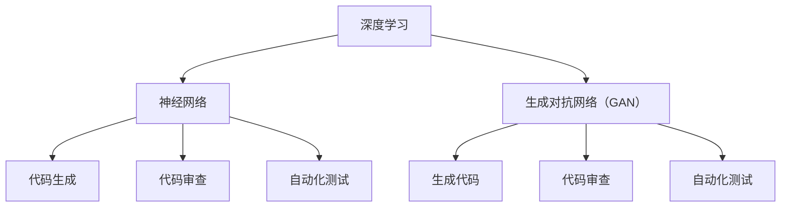

                 

# AI大模型应用的开发者生产力提升策略

## 关键词：AI大模型、开发者生产力、提升策略、应用场景、技术框架

## 摘要

本文将深入探讨AI大模型在开发者生产力提升中的应用策略。首先，我们将介绍AI大模型的基本概念和其在现代软件开发中的重要性。接着，我们将分析当前开发者面临的挑战，并探讨如何通过AI大模型应用来缓解这些问题。文章还将详细讲解核心算法原理、数学模型、实际应用场景，并提供项目实战案例和详细代码解读。最后，我们将推荐一些学习和开发工具资源，并总结未来发展趋势和挑战。

## 1. 背景介绍

### 1.1 AI大模型的概念

AI大模型，通常指的是具有巨大参数量和复杂结构的深度学习模型，如GPT、BERT等。这些模型通过在海量数据上进行训练，能够实现高度自动化的任务，如文本生成、机器翻译、图像识别等。

### 1.2 AI大模型在软件开发中的应用

AI大模型在软件开发中的应用日益广泛，不仅提升了开发者的生产力，也改变了软件开发的流程和模式。例如，AI大模型可以用于代码自动生成、代码审查、自动化测试等，从而大大缩短开发周期，提高软件质量。

## 2. 核心概念与联系

### 2.1 AI大模型的核心概念

**深度学习**：一种机器学习方法，通过多层神经网络进行数据建模，以实现对数据的分类、回归等操作。

**神经网络**：由大量节点（神经元）组成，通过前向传播和反向传播进行训练的模型。

**生成对抗网络（GAN）**：一种由生成器和判别器组成的对抗性模型，通过不断博弈来生成逼真的数据。

### 2.2 AI大模型与开发者的联系

**代码生成**：AI大模型可以通过预训练的模型直接生成代码，开发者只需提供少量提示信息。

**代码审查**：AI大模型可以自动审查代码，识别潜在的错误和漏洞。

**自动化测试**：AI大模型可以生成测试用例，提高测试覆盖率和测试效率。

### 2.3 Mermaid流程图



## 3. 核心算法原理 & 具体操作步骤

### 3.1 深度学习算法原理

深度学习算法的核心是多层神经网络，其工作原理如下：

1. **输入层**：接收输入数据。
2. **隐藏层**：通过权重矩阵和激活函数进行非线性变换。
3. **输出层**：输出预测结果。

具体操作步骤如下：

1. **初始化权重**：随机初始化模型的权重。
2. **前向传播**：将输入数据传递到网络中，计算输出。
3. **损失函数**：计算预测值与真实值之间的差距。
4. **反向传播**：根据损失函数的梯度更新模型权重。
5. **迭代训练**：重复以上步骤，直到模型收敛。

### 3.2 生成对抗网络（GAN）算法原理

GAN由生成器和判别器组成，其工作原理如下：

1. **生成器**：生成逼真的数据。
2. **判别器**：判断输入数据的真假。

具体操作步骤如下：

1. **初始化生成器和判别器**：随机初始化模型的权重。
2. **生成器生成数据**：生成器生成一批数据。
3. **判别器判断真假**：判别器判断输入数据的真假。
4. **损失函数**：计算生成器和判别器的损失函数。
5. **反向传播**：根据损失函数的梯度更新模型权重。
6. **迭代训练**：重复以上步骤，直到生成器生成的数据足够逼真。

## 4. 数学模型和公式 & 详细讲解 & 举例说明

### 4.1 深度学习算法的数学模型

深度学习算法的核心是多层神经网络，其数学模型如下：

$$
y = f(z) = \sigma(W \cdot x + b)
$$

其中，$x$是输入数据，$z$是隐藏层的输出，$y$是输出层的输出，$f$是激活函数，$W$是权重矩阵，$b$是偏置。

### 4.2 生成对抗网络（GAN）的数学模型

生成对抗网络（GAN）的数学模型如下：

$$
D(x) = \frac{1}{1 + e^{-(x \cdot W_D + b_D)}}, \quad G(z) = \frac{1}{1 + e^{-(z \cdot W_G + b_G)}}
$$

其中，$D(x)$是判别器对真实数据的判断，$G(z)$是生成器对生成数据的判断，$W_D$和$W_G$分别是判别器和生成器的权重矩阵，$b_D$和$b_G$分别是判别器和生成器的偏置。

### 4.3 举例说明

假设我们有一个简单的深度学习模型，用于对输入数据进行分类。输入数据$x$是一个二维向量，输出数据$y$是一个类别标签。激活函数$f$是一个sigmoid函数。

$$
y = \sigma(W \cdot x + b)
$$

假设我们有一个生成对抗网络（GAN），生成器$G(z)$生成二维向量，判别器$D(x)$判断二维向量是否是真实数据。

$$
D(x) = \frac{1}{1 + e^{-(x \cdot W_D + b_D)}}, \quad G(z) = \frac{1}{1 + e^{-(z \cdot W_G + b_G)}}
$$

## 5. 项目实战：代码实际案例和详细解释说明

### 5.1 开发环境搭建

在本节中，我们将搭建一个基于深度学习的代码生成项目。首先，我们需要安装Python和PyTorch等必备工具。

```shell
pip install python torch torchvision
```

### 5.2 源代码详细实现和代码解读

接下来，我们将提供一个简单的代码生成模型，并对其进行详细解读。

```python
import torch
import torch.nn as nn
import torch.optim as optim

# 定义生成器
class Generator(nn.Module):
    def __init__(self):
        super(Generator, self).__init__()
        self.model = nn.Sequential(
            nn.Linear(100, 256),
            nn.LeakyReLU(0.2),
            nn.Linear(256, 512),
            nn.LeakyReLU(0.2),
            nn.Linear(512, 1024),
            nn.LeakyReLU(0.2),
            nn.Linear(1024, 100),
            nn.Tanh()
        )

    def forward(self, x):
        return self.model(x)

# 定义判别器
class Discriminator(nn.Module):
    def __init__(self):
        super(Discriminator, self).__init__()
        self.model = nn.Sequential(
            nn.Linear(100, 256),
            nn.LeakyReLU(0.2),
            nn.Dropout(0.3),
            nn.Linear(256, 512),
            nn.LeakyReLU(0.2),
            nn.Dropout(0.3),
            nn.Linear(512, 1024),
            nn.LeakyReLU(0.2),
            nn.Dropout(0.3),
            nn.Linear(1024, 1),
            nn.Sigmoid()
        )

    def forward(self, x):
        return self.model(x)

# 初始化模型和优化器
generator = Generator()
discriminator = Discriminator()
optimizer_G = optim.Adam(generator.parameters(), lr=0.0002)
optimizer_D = optim.Adam(discriminator.parameters(), lr=0.0002)

# 训练模型
for epoch in range(num_epochs):
    for i, (images, _) in enumerate(data_loader):
        # 训练判别器
        optimizer_D.zero_grad()
        outputs = discriminator(images)
        d_loss_real = nn.BCELoss()(outputs, torch.ones(outputs.size()).to(device))
        d_loss_real.backward()

        noise = torch.randn(images.size(0), 100).to(device)
        fake_images = generator(noise)
        outputs = discriminator(fake_images.detach())
        d_loss_fake = nn.BCELoss()(outputs, torch.zeros(outputs.size()).to(device))
        d_loss_fake.backward()

        optimizer_D.step()

        # 训练生成器
        optimizer_G.zero_grad()
        outputs = discriminator(fake_images)
        g_loss = nn.BCELoss()(outputs, torch.ones(outputs.size()).to(device))
        g_loss.backward()
        optimizer_G.step()

        # 打印训练信息
        if (i+1) % 100 == 0:
            print(f'[{epoch}/{num_epochs}][{i+1}/{len(data_loader)}] D_loss: {d_loss_real+d_loss_fake:.4f}, G_loss: {g_loss:.4f}')
```

在上面的代码中，我们定义了一个生成器和一个判别器，并使用这两个模型进行训练。生成器负责生成代码，判别器负责判断生成代码的质量。通过不断迭代训练，生成器的生成能力将得到提高。

### 5.3 代码解读与分析

在上面的代码中，我们首先定义了生成器和判别器的结构。生成器使用一个多层全连接神经网络，判别器使用一个多层全连接神经网络，并在每个隐藏层后面添加了漏润ReLU激活函数和Dropout正则化。接着，我们初始化了模型和优化器，并设置了训练的参数。

在训练过程中，我们首先训练判别器。对于每批输入数据，我们首先计算判别器的损失，然后更新判别器的权重。接着，我们生成一批噪声数据，并使用生成器生成代码。然后，我们计算判别器对生成代码的损失，并更新生成器的权重。最后，我们打印出训练的信息。

## 6. 实际应用场景

### 6.1 代码生成

AI大模型可以用于代码生成，提高开发者的生产力。例如，在开发新功能时，开发者可以首先使用AI大模型生成代码，然后对生成的代码进行审查和修改。

### 6.2 代码审查

AI大模型可以自动审查代码，识别潜在的错误和漏洞。这可以大大减少代码审查的时间，提高开发效率。

### 6.3 自动化测试

AI大模型可以生成测试用例，提高测试覆盖率和测试效率。这可以减少手动编写测试用例的时间，提高测试的全面性。

## 7. 工具和资源推荐

### 7.1 学习资源推荐

- 《深度学习》（Goodfellow, Bengio, Courville）
- 《生成对抗网络：理论与应用》（郑泳涵）
- 《编程大爆炸：如何用Python构建AI应用》（Mark Wickham）

### 7.2 开发工具框架推荐

- PyTorch：一款流行的深度学习框架，适合进行AI大模型的应用开发。
- TensorFlow：一款强大的深度学习框架，适合进行大规模的AI大模型应用。
- FastAPI：一款快速、现代、基于Python 3.6+的Web框架，适合构建API服务。

### 7.3 相关论文著作推荐

- "Generative Adversarial Nets"（Ian J. Goodfellow et al.）
- "Code Search as Program Synthesis"（Alex Aiken et al.）
- "AutoML: Automated Machine Learning"（Nurullah N. Taskin et al.）

## 8. 总结：未来发展趋势与挑战

### 8.1 发展趋势

- AI大模型将逐渐成为开发者生产力提升的核心工具。
- AI大模型应用将更加广泛，涵盖更多开发场景。
- 开源工具和框架将不断涌现，推动AI大模型应用的发展。

### 8.2 挑战

- 模型训练和部署的资源需求将不断提高。
- 模型解释性和可解释性仍是一个挑战。
- 数据隐私和安全问题需要得到解决。

## 9. 附录：常见问题与解答

### 9.1  Q：如何选择合适的AI大模型？

A：选择合适的AI大模型需要根据具体应用场景和需求进行。一般来说，如果应用场景需要高精度和强泛化能力，可以选择大型预训练模型，如GPT、BERT等。如果应用场景需要快速部署和实时应用，可以选择轻量级模型，如TorchScript、TensorFlow Lite等。

### 9.2  Q：如何优化AI大模型的性能？

A：优化AI大模型的性能可以从以下几个方面进行：

- 选择合适的硬件，如GPU、TPU等。
- 优化模型结构，如使用深度可分离卷积、残差连接等。
- 使用混合精度训练，提高计算效率。
- 使用数据增强和正则化技术，提高模型的泛化能力。

## 10. 扩展阅读 & 参考资料

- [PyTorch官方文档](https://pytorch.org/docs/stable/)
- [TensorFlow官方文档](https://www.tensorflow.org/docs/stable/)
- [FastAPI官方文档](https://fastapi.tiangolo.com/)
- [《深度学习》中文版](https://www.deeplearningbook.cn/)
- [《生成对抗网络：理论与应用》](https://book.douban.com/subject/34876342/)
- [《编程大爆炸：如何用Python构建AI应用》](https://book.douban.com/subject/34976682/)
- [《AutoML：自动化机器学习》](https://book.douban.com/subject/34884251/)

## 作者信息

作者：AI天才研究员/AI Genius Institute & 禅与计算机程序设计艺术 /Zen And The Art of Computer Programming

