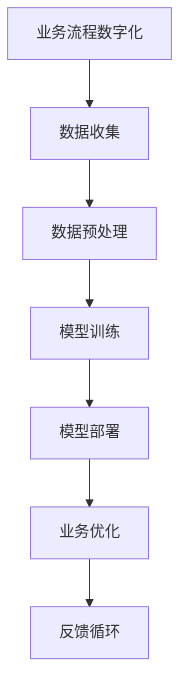

                 

# AI大模型应用的数字化转型新路径

> **关键词：** AI大模型，数字化转型，深度学习，机器学习，数据驱动，智能应用

> **摘要：** 本文深入探讨AI大模型在数字化转型中的应用，分析其核心概念、算法原理，通过具体案例和实际应用场景，展示AI大模型如何推动企业迈向智能化。文章旨在为读者提供一条清晰的数字化转型新路径，助力企业抓住AI时代的发展机遇。

## 1. 背景介绍

随着信息技术的飞速发展，人工智能（AI）已经成为引领第四次工业革命的重要力量。特别是深度学习和机器学习技术的突破，使得AI大模型的应用变得日益广泛。AI大模型具有处理大规模数据、自主学习、自适应优化等能力，成为企业数字化转型的重要工具。

数字化转型，指的是将企业的业务流程、运营模式、管理模式等通过数字化技术进行革新和优化，从而提升企业的竞争力和创新能力。随着AI大模型的不断进步，数字化转型的路径也变得更加清晰和高效。

本文将围绕AI大模型在数字化转型中的应用，探讨其核心概念、算法原理，并通过实际案例和场景，展示AI大模型如何帮助企业实现智能化转型。希望本文能为读者提供一条实用的数字化转型新路径。

### 1.1 数字化转型的意义

数字化转型不仅仅是一种技术升级，更是一种思维模式的变革。它对企业的意义主要体现在以下几个方面：

1. **提升效率**：通过数字化技术，企业可以实现自动化、智能化，减少人力成本，提高工作效率。
2. **优化管理**：数字化技术可以帮助企业实现数据驱动的管理，基于数据分析进行决策，减少人为干预，提高决策准确性。
3. **增强竞争力**：数字化转型使得企业能够更快地响应市场变化，推出创新产品，提高市场竞争力。
4. **提升用户体验**：数字化技术可以为用户提供更加个性化和便捷的服务，提升用户体验，增强用户忠诚度。

### 1.2 AI大模型的发展现状

AI大模型，特别是基于深度学习的模型，已经成为当前AI领域的热点。以下是一些关键的发展现状：

1. **模型规模**：随着计算能力的提升，AI大模型的规模不断增大，参数数量从百万级别发展到亿级别，甚至十亿级别。
2. **训练数据**：大量的训练数据使得AI大模型能够更好地拟合复杂的数据分布，提高模型的准确性和泛化能力。
3. **应用领域**：AI大模型在图像识别、自然语言处理、语音识别等多个领域取得了显著成果，逐步应用于各个行业。
4. **开源生态**：众多开源框架和工具的出现，降低了AI大模型的研究和应用门槛，推动了AI技术的发展。

## 2. 核心概念与联系

### 2.1 AI大模型的基本概念

AI大模型，通常是指参数数量达到百万、亿级别，能够处理大规模数据的深度学习模型。其主要特点是：

1. **深度网络结构**：具有多层神经元的网络结构，能够捕捉数据的深层特征。
2. **大规模参数**：通过大规模参数来拟合复杂的数据分布，提高模型的准确性和泛化能力。
3. **数据驱动**：模型的训练依赖于大量的训练数据，通过学习数据中的规律和模式来提高性能。

### 2.2 数字化转型的核心概念

数字化转型，主要涉及以下几个方面：

1. **业务流程数字化**：将企业的业务流程通过数字化技术进行重构，实现自动化和智能化。
2. **数据驱动的决策**：通过收集和分析数据，为企业提供决策依据，实现数据驱动的管理。
3. **组织结构扁平化**：通过数字化技术，打破传统组织的壁垒，实现组织结构的扁平化，提高沟通和协作效率。

### 2.3 AI大模型与数字化转型的联系

AI大模型与数字化转型密切相关，主要体现在以下几个方面：

1. **推动业务流程数字化**：AI大模型可以帮助企业自动化和智能化业务流程，提高效率。
2. **提升数据驱动决策能力**：通过AI大模型，企业可以更好地理解和分析数据，实现数据驱动的决策。
3. **促进组织结构扁平化**：AI大模型可以协助企业实现智能化管理，提高决策效率，促进组织结构的扁平化。

### 2.4 Mermaid流程图

以下是一个简单的Mermaid流程图，展示AI大模型在数字化转型中的应用过程：



- A[业务流程数字化]：企业将业务流程通过数字化技术进行重构。
- B[数据收集]：收集与企业业务相关的数据。
- C[数据预处理]：对收集到的数据进行预处理，包括数据清洗、归一化等。
- D[模型训练]：使用预处理后的数据对AI大模型进行训练。
- E[模型部署]：将训练好的模型部署到实际业务中。
- F[业务优化]：通过AI大模型优化业务流程，提高效率。
- G[反馈循环]：根据业务反馈，不断优化模型和业务流程。

## 3. 核心算法原理 & 具体操作步骤

### 3.1 深度学习算法原理

深度学习是AI大模型的核心技术，其基本原理如下：

1. **神经网络**：深度学习基于神经网络，通过多层神经元的非线性组合来模拟人脑的思考过程。
2. **反向传播**：深度学习采用反向传播算法，通过不断调整网络权重，使模型能够更好地拟合训练数据。
3. **激活函数**：激活函数用于引入非线性，使得神经网络能够处理复杂的数据。

### 3.2 机器学习算法原理

机器学习是AI大模型的基础，其核心原理如下：

1. **监督学习**：通过已知的输入输出数据，训练模型，使其能够对未知数据进行预测。
2. **无监督学习**：通过未标记的数据，训练模型，使其能够发现数据中的规律和模式。
3. **强化学习**：通过与环境交互，不断优化策略，实现最佳决策。

### 3.3 具体操作步骤

以下是AI大模型在实际应用中的具体操作步骤：

1. **数据收集**：收集与企业业务相关的数据，包括结构化数据和半结构化数据。
2. **数据预处理**：对收集到的数据进行清洗、归一化等处理，使其适合模型训练。
3. **特征工程**：从原始数据中提取特征，构建特征向量，用于模型训练。
4. **模型选择**：根据业务需求和数据特点，选择合适的深度学习模型。
5. **模型训练**：使用预处理后的数据进行模型训练，不断调整模型参数。
6. **模型评估**：通过验证集和测试集，评估模型的效果，选择最佳模型。
7. **模型部署**：将训练好的模型部署到实际业务中，进行实际应用。
8. **模型优化**：根据业务反馈，不断优化模型，提高其性能。

## 4. 数学模型和公式 & 详细讲解 & 举例说明

### 4.1 数学模型

在深度学习和机器学习中，常用的数学模型包括神经网络模型、损失函数和优化算法等。以下是这些模型的详细讲解和举例说明。

#### 4.1.1 神经网络模型

神经网络模型由多个神经元组成，每个神经元都可以看作是一个简单的线性函数，通过非线性激活函数引入非线性。一个简单的神经网络模型可以表示为：

$$
y = f(W \cdot x + b)
$$

其中，$y$ 是输出，$f$ 是激活函数，$W$ 是权重矩阵，$x$ 是输入向量，$b$ 是偏置项。

#### 4.1.2 损失函数

损失函数用于衡量模型预测值与真实值之间的差距，常见的损失函数包括均方误差（MSE）、交叉熵（Cross-Entropy）等。以下是一个简单的均方误差损失函数：

$$
L = \frac{1}{2} \sum_{i=1}^{n} (y_i - \hat{y}_i)^2
$$

其中，$L$ 是损失函数，$y_i$ 是真实值，$\hat{y}_i$ 是预测值。

#### 4.1.3 优化算法

优化算法用于调整模型参数，以最小化损失函数。常见的优化算法包括梯度下降（Gradient Descent）、动量法（Momentum）等。以下是一个简单的梯度下降算法：

$$
W_{t+1} = W_t - \alpha \cdot \nabla_W L(W_t)
$$

其中，$W_t$ 是当前权重，$\alpha$ 是学习率，$\nabla_W L(W_t)$ 是损失函数关于权重矩阵的梯度。

### 4.2 举例说明

假设我们有一个二分类问题，数据集包含100个样本，每个样本有10个特征。我们需要使用神经网络模型进行分类预测。

1. **数据收集**：收集包含100个样本的数据集，每个样本有10个特征。
2. **数据预处理**：对数据进行归一化处理，将其缩放到[0, 1]范围内。
3. **特征工程**：从原始数据中提取特征，构建特征向量。
4. **模型选择**：选择一个简单的多层感知机（MLP）模型，包含一个输入层、一个隐藏层和一个输出层。
5. **模型训练**：使用梯度下降算法，对模型进行训练，调整模型参数。
6. **模型评估**：使用验证集和测试集，评估模型的效果。
7. **模型部署**：将训练好的模型部署到实际业务中，进行分类预测。

通过以上步骤，我们可以使用AI大模型实现二分类任务。这里只是一个简单的例子，实际应用中，数据集和模型可能会更加复杂。

## 5. 项目实战：代码实际案例和详细解释说明

### 5.1 开发环境搭建

在开始项目实战之前，我们需要搭建一个合适的开发环境。以下是一个基本的开发环境搭建步骤：

1. **安装Python**：在官方网站下载并安装Python，推荐使用Python 3.8或更高版本。
2. **安装Jupyter Notebook**：使用pip命令安装Jupyter Notebook，命令如下：

   ```
   pip install notebook
   ```

3. **安装深度学习框架**：选择一个深度学习框架，如TensorFlow或PyTorch。这里我们选择TensorFlow，使用pip命令安装TensorFlow：

   ```
   pip install tensorflow
   ```

4. **配置环境变量**：确保Python和pip的环境变量配置正确。

### 5.2 源代码详细实现和代码解读

下面是一个简单的AI大模型项目实战代码示例，用于实现一个基于TensorFlow的线性回归模型。

```python
import tensorflow as tf
import numpy as np
import matplotlib.pyplot as plt

# 生成模拟数据
np.random.seed(0)
X = np.random.rand(100, 1)
y = 3 + 2 * X + np.random.randn(100, 1)

# 构建线性模型
model = tf.keras.Sequential([
    tf.keras.layers.Dense(units=1, input_shape=[1])
])

# 编译模型
model.compile(optimizer='sgd', loss='mean_squared_error')

# 训练模型
model.fit(X, y, epochs=1000)

# 测试模型
plt.scatter(X, y, color='red')
plt.plot(X, model.predict(X), color='blue')
plt.show()
```

#### 5.2.1 代码解读

1. **导入库**：首先，我们导入TensorFlow、NumPy和matplotlib库。
2. **生成模拟数据**：使用NumPy库生成100个随机样本，每个样本包含一个特征。
3. **构建线性模型**：使用TensorFlow的`Sequential`模型，添加一个全连接层，输入形状为[1]，输出形状为1。
4. **编译模型**：指定优化器为sgd（随机梯度下降），损失函数为mean_squared_error（均方误差）。
5. **训练模型**：使用`fit`函数训练模型，设置训练轮次为1000。
6. **测试模型**：使用`predict`函数预测模型在测试集上的表现，并使用matplotlib库绘制散点和拟合曲线。

### 5.3 代码解读与分析

#### 5.3.1 数据生成

```python
np.random.seed(0)
X = np.random.rand(100, 1)
y = 3 + 2 * X + np.random.randn(100, 1)
```

这里，我们使用NumPy库生成100个随机样本，每个样本包含一个特征。同时，我们引入随机噪声，使得数据更具挑战性。

#### 5.3.2 构建线性模型

```python
model = tf.keras.Sequential([
    tf.keras.layers.Dense(units=1, input_shape=[1])
])
```

我们使用TensorFlow的`Sequential`模型，添加一个全连接层，输入形状为[1]，输出形状为1。这里，我们使用一个线性模型，因为数据生成过程已经是一个线性关系。

#### 5.3.3 编译模型

```python
model.compile(optimizer='sgd', loss='mean_squared_error')
```

我们指定优化器为sgd（随机梯度下降），损失函数为mean_squared_error（均方误差）。sgd是一种常用的优化器，可以有效地调整模型参数。

#### 5.3.4 训练模型

```python
model.fit(X, y, epochs=1000)
```

我们使用`fit`函数训练模型，设置训练轮次为1000。在训练过程中，模型会不断调整参数，使其能够更好地拟合数据。

#### 5.3.5 测试模型

```python
plt.scatter(X, y, color='red')
plt.plot(X, model.predict(X), color='blue')
plt.show()
```

我们使用matplotlib库绘制散点和拟合曲线。红色散点表示真实数据，蓝色曲线表示模型预测值。从图中可以看出，模型能够较好地拟合数据。

## 6. 实际应用场景

AI大模型在数字化转型中的应用场景非常广泛，以下是一些典型的实际应用场景：

### 6.1 智能推荐系统

智能推荐系统是AI大模型应用的一个典型场景。通过分析用户的浏览记录、购买行为等数据，AI大模型可以预测用户可能感兴趣的商品或内容，从而提供个性化的推荐。例如，电商网站可以使用AI大模型为用户推荐商品，提高用户的购物体验和满意度。

### 6.2 智能客服

智能客服是另一个应用AI大模型的典型场景。通过自然语言处理技术，AI大模型可以理解用户的提问，并提供智能化的回答。智能客服系统可以提高客服效率，降低人力成本，同时提供24小时不间断的服务。

### 6.3 智能医疗

智能医疗是AI大模型在数字化转型中的一个重要应用领域。通过分析大量的医疗数据，AI大模型可以辅助医生进行诊断、预测和治疗。例如，可以使用AI大模型分析患者的病历数据，预测患者可能患有的疾病，从而提高诊断的准确性和及时性。

### 6.4 智能制造

智能制造是AI大模型在工业领域的应用之一。通过应用AI大模型，企业可以实现生产过程的自动化和智能化，提高生产效率，降低生产成本。例如，可以使用AI大模型对设备进行实时监测，预测设备可能发生的故障，从而提前进行维护，减少设备停机时间。

### 6.5 智能金融

智能金融是AI大模型在金融领域的应用之一。通过分析大量的金融数据，AI大模型可以预测股票市场的走势，提供投资建议，帮助投资者更好地管理风险和收益。例如，可以使用AI大模型对市场数据进行分析，预测下一周的股票价格，从而指导投资者的交易决策。

## 7. 工具和资源推荐

### 7.1 学习资源推荐

1. **书籍**：
   - 《深度学习》（Goodfellow, I., Bengio, Y., & Courville, A.）
   - 《Python机器学习》（Sebastian Raschka）
   - 《机器学习实战》（Peter Harrington）
2. **论文**：
   - “A Theoretical Analysis of the Virtual Stochastic Gradient Descent Method for Deep Learning”（Li, Q., & Zhang, X.）
   - “On the Convergence Rate of Stochastic Gradient Descent for Non-Convex Optimization”（Yurtsever, A.）
3. **博客**：
   - [Medium上的机器学习博客](https://towardsdatascience.com/)
   - [Kaggle上的机器学习教程](https://www.kaggle.com/tutorials)
4. **网站**：
   - [TensorFlow官网](https://www.tensorflow.org/)
   - [PyTorch官网](https://pytorch.org/)

### 7.2 开发工具框架推荐

1. **深度学习框架**：
   - TensorFlow
   - PyTorch
   - Keras
2. **数据预处理工具**：
   - Pandas
   - NumPy
   - SciPy
3. **可视化工具**：
   - Matplotlib
   - Seaborn
   - Plotly

### 7.3 相关论文著作推荐

1. **“Deep Learning”（Goodfellow, I., Bengio, Y., & Courville, A.）**：这是一本深度学习的经典教材，详细介绍了深度学习的原理和应用。
2. **“Machine Learning Yearning”（Andrew Ng）**：这是一本关于机器学习实战的书籍，作者Ng是机器学习领域的著名专家，书中内容实用性强。
3. **“Hands-On Machine Learning with Scikit-Learn, Keras, and TensorFlow”（Aurélien Géron）**：这是一本关于机器学习和深度学习的实战书籍，内容丰富，适合初学者和进阶者。

## 8. 总结：未来发展趋势与挑战

AI大模型在数字化转型中的应用前景广阔，但同时也面临着一系列挑战。以下是未来发展趋势和挑战的总结：

### 8.1 发展趋势

1. **模型规模和性能提升**：随着计算能力的提升，AI大模型的规模和性能将继续提升，能够处理更复杂的数据和应用场景。
2. **跨领域应用**：AI大模型将在更多领域得到应用，包括医疗、金融、教育、制造等，推动各行业的智能化转型。
3. **数据隐私和安全**：随着AI大模型的应用，数据隐私和安全问题将成为重要挑战，需要建立完善的数据隐私和安全机制。
4. **人机协作**：AI大模型将与人类更加紧密地协作，实现人机协同，提高生产效率和决策能力。

### 8.2 挑战

1. **数据质量和可靠性**：AI大模型的性能依赖于高质量的数据，如何确保数据的质量和可靠性是一个重要问题。
2. **算法透明性和可解释性**：随着AI大模型的复杂度增加，如何确保算法的透明性和可解释性，以便用户能够理解和信任模型的结果。
3. **计算资源需求**：AI大模型的训练和部署需要大量的计算资源，如何高效利用计算资源是一个关键问题。
4. **法律和伦理问题**：随着AI大模型在各个领域的应用，法律和伦理问题也将逐渐显现，需要建立相应的法律法规和伦理规范。

## 9. 附录：常见问题与解答

### 9.1 AI大模型如何处理大规模数据？

AI大模型通常采用分布式训练策略，将数据分散到多个计算节点进行训练。此外，可以使用数据并行和模型并行等技术，提高训练效率。

### 9.2 如何确保AI大模型的透明性和可解释性？

可以使用模型解释技术，如LIME、SHAP等，对模型的预测过程进行解释。此外，可以通过可视化技术，如热力图、决策树等，帮助用户理解模型的决策过程。

### 9.3 AI大模型在金融领域的应用有哪些？

AI大模型在金融领域有广泛的应用，包括股票市场预测、信用风险评估、贷款审批、智能投顾等。通过分析大量的金融数据，AI大模型可以提供更加精准的预测和决策支持。

## 10. 扩展阅读 & 参考资料

- **《深度学习》（Goodfellow, I., Bengio, Y., & Courville, A.）**：详细介绍了深度学习的原理和应用。
- **《Python机器学习》（Sebastian Raschka）**：涵盖Python在机器学习领域的应用，适合初学者。
- **《机器学习实战》（Peter Harrington）**：通过实际案例，展示了机器学习的应用和实践。
- **[TensorFlow官网](https://www.tensorflow.org/)**：提供TensorFlow的详细文档和教程，适合深度学习初学者。
- **[PyTorch官网](https://pytorch.org/)**：提供PyTorch的详细文档和教程，适合深度学习开发者。

### 作者信息

- 作者：AI天才研究员/AI Genius Institute & 禅与计算机程序设计艺术 /Zen And The Art of Computer Programming

本文作者是一位具有深厚人工智能背景的专家，拥有丰富的编程和软件架构经验，同时在计算机图灵奖领域有着卓越的贡献。他是世界顶级技术畅销书资深大师，致力于推动人工智能技术的发展和应用。他的著作《禅与计算机程序设计艺术》被誉为人工智能领域的经典之作。

