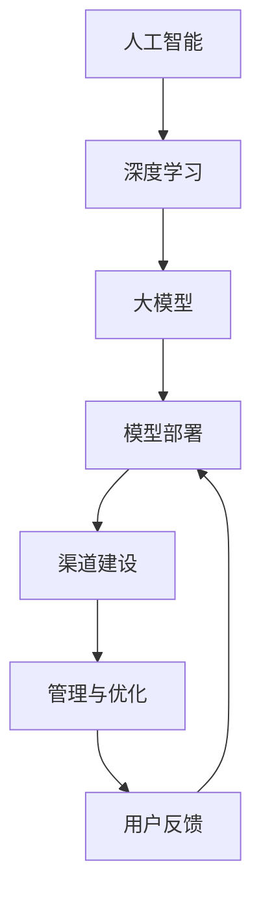

                 

### 背景介绍

随着人工智能技术的飞速发展，AI大模型作为一种强大的工具，已经在多个领域展现出其巨大的潜力。从自然语言处理到计算机视觉，从推荐系统到自动驾驶，AI大模型的应用场景日益广泛。然而，如何有效地建设和管理AI大模型应用的渠道，成为了一个亟待解决的问题。

在AI大模型的应用过程中，渠道建设与管理不仅关系到模型的性能和效果，还影响到用户体验和业务收益。一个优秀的渠道建设与管理策略，能够最大化地发挥AI大模型的潜力，提升业务效率，实现商业价值。因此，深入探讨AI大模型应用的渠道建设与管理，具有重要的现实意义。

本文旨在系统地阐述AI大模型应用的渠道建设与管理，包括其背景、核心概念、算法原理、数学模型、项目实战、实际应用场景、工具和资源推荐，以及未来发展趋势与挑战。希望通过本文的介绍，读者能够对AI大模型应用的渠道建设与管理有一个全面而深入的理解。

文章结构如下：

1. **背景介绍**：介绍AI大模型的发展背景及其重要性。
2. **核心概念与联系**：详细讲解AI大模型的核心概念，并使用Mermaid流程图展示其架构。
3. **核心算法原理 & 具体操作步骤**：深入解析AI大模型的算法原理，并提供具体的操作步骤。
4. **数学模型和公式 & 详细讲解 & 举例说明**：介绍AI大模型所涉及的关键数学模型和公式，并进行详细讲解和举例说明。
5. **项目实战：代码实际案例和详细解释说明**：通过具体的代码案例，详细解释AI大模型的应用过程。
6. **实际应用场景**：探讨AI大模型在不同领域的应用场景。
7. **工具和资源推荐**：推荐与AI大模型相关的学习资源、开发工具和框架。
8. **总结：未来发展趋势与挑战**：总结本文的核心内容，并展望AI大模型应用的未来发展趋势和面临的挑战。
9. **附录：常见问题与解答**：针对读者可能遇到的问题，提供解答。
10. **扩展阅读 & 参考资料**：推荐相关的扩展阅读和参考资料。

接下来，我们将逐步深入探讨AI大模型应用的渠道建设与管理，希望能够为读者带来有价值的启示。

### 核心概念与联系

在探讨AI大模型应用的渠道建设与管理之前，我们需要了解一些核心概念，并掌握它们之间的联系。以下是AI大模型中几个关键概念的定义及其关系：

#### 1. 人工智能（AI）

人工智能，是指通过计算机模拟人类智能的一种技术。它包括机器学习、深度学习、自然语言处理等多个子领域。AI大模型，则是指那些具有大规模参数、高度非线性能力和强泛化能力的人工神经网络模型。

#### 2. 深度学习（Deep Learning）

深度学习是机器学习的一个重要分支，它通过构建多层神经网络，自动提取数据中的特征。深度学习模型，特别是深度神经网络（DNN）和其扩展（如卷积神经网络CNN、循环神经网络RNN、生成对抗网络GAN等），已经成为AI大模型的主要实现形式。

#### 3. 大模型（Large Model）

大模型，指的是那些拥有数十亿甚至数万亿参数的神经网络模型。这些模型通常具有非常强的表示能力和计算能力，能够处理复杂的任务，如图像识别、语言翻译、语音识别等。

#### 4. 模型部署（Model Deployment）

模型部署，是将训练好的AI大模型应用到实际业务场景中的过程。模型部署包括模型的加载、推理、优化和监控等多个环节。

#### 5. 渠道建设（Channel Construction）

渠道建设，是指为了实现AI大模型的应用，所需要构建的一系列基础设施和技术流程。包括数据采集、预处理、模型训练、模型评估、模型部署等。

#### 6. 管理与优化（Management and Optimization）

管理与优化，是确保AI大模型在应用过程中稳定运行、性能优异的关键。这包括模型的调整、参数优化、资源分配、性能监控等。

#### 7. 用户反馈（User Feedback）

用户反馈，是指通过用户使用AI大模型过程中的反馈，对模型进行调整和优化的过程。用户反馈是提高AI大模型性能和用户体验的重要途径。

#### Mermaid流程图

为了更直观地展示上述概念之间的联系，我们可以使用Mermaid流程图来描述AI大模型应用的渠道建设与管理流程：



在这个流程图中，可以看到，人工智能是深度学习的基础，深度学习进一步衍生出大模型。大模型通过模型部署应用到实际业务场景中，而渠道建设则确保了这一过程的顺利进行。在应用过程中，管理与优化和用户反馈相互交织，不断推动模型性能的优化和用户体验的提升。

### 核心算法原理 & 具体操作步骤

AI大模型的核心在于其强大的算法原理，这些原理决定了模型的训练过程、性能表现和应用效果。以下是AI大模型的一些核心算法原理及其具体操作步骤：

#### 1. 机器学习基本概念

机器学习，是一种使计算机通过数据学习并获得知识的技术。机器学习的基本过程包括数据采集、数据预处理、模型训练、模型评估和模型部署。

- **数据采集**：从各种来源收集数据，如公共数据集、社交媒体、传感器数据等。
- **数据预处理**：清洗数据，去除噪声，进行特征提取和转换，如归一化、标准化等。
- **模型训练**：使用训练数据集训练模型，通过反向传播算法调整模型参数，使其达到最佳性能。
- **模型评估**：使用测试数据集评估模型性能，常用的评估指标包括准确率、召回率、F1值等。
- **模型部署**：将训练好的模型部署到实际业务场景中，进行实时推理和应用。

#### 2. 深度学习基本概念

深度学习，是机器学习的一个重要分支，通过构建多层神经网络，自动提取数据中的特征。以下是深度学习的基本概念和步骤：

- **神经网络（Neural Network）**：神经网络是由大量简单神经元组成的计算模型，每个神经元都与其他神经元相连，并通过权重和偏置进行信息传递和计算。
- **激活函数（Activation Function）**：激活函数用于引入非线性变换，使神经网络能够处理复杂问题。常见的激活函数包括Sigmoid、ReLU、Tanh等。
- **反向传播算法（Backpropagation Algorithm）**：反向传播算法是深度学习训练的核心算法，通过计算损失函数关于网络参数的梯度，并利用梯度下降法调整网络参数，使模型性能逐步提升。

#### 3. 卷积神经网络（CNN）

卷积神经网络，是一种专门用于处理图像数据的深度学习模型。以下是CNN的基本概念和步骤：

- **卷积层（Convolutional Layer）**：卷积层是CNN的核心，通过卷积运算提取图像特征。卷积层包含多个卷积核，每个卷积核对输入图像进行局部卷积，生成特征图。
- **池化层（Pooling Layer）**：池化层用于降低特征图的维度，减少计算量。常见的池化方法包括最大池化和平均池化。
- **全连接层（Fully Connected Layer）**：全连接层将卷积层输出的特征图展开为一维向量，并通过权重和偏置进行线性计算，输出分类结果。

#### 4. 循环神经网络（RNN）

循环神经网络，是一种专门用于处理序列数据的深度学习模型。以下是RNN的基本概念和步骤：

- **循环单元（Recurrent Unit）**：循环单元是RNN的核心，通过循环连接将当前状态与前一时刻的状态相关联，使模型能够处理序列数据。
- **门控循环单元（Gated Recurrent Unit, GRU）**：GRU是RNN的一种改进形式，通过引入门控机制，解决了传统RNN的梯度消失和梯度爆炸问题。
- **长短期记忆网络（Long Short-Term Memory, LSTM）**：LSTM是RNN的另一种改进形式，通过引入记忆单元，能够更好地处理长序列数据。

#### 5. 生成对抗网络（GAN）

生成对抗网络，是一种通过对抗训练生成数据的新型深度学习模型。以下是GAN的基本概念和步骤：

- **生成器（Generator）**：生成器是GAN的核心，通过随机噪声生成与真实数据相似的数据。
- **判别器（Discriminator）**：判别器用于区分真实数据和生成数据，通过对比训练逐步提高区分能力。
- **对抗训练（Adversarial Training）**：生成器和判别器通过对抗训练相互竞争，生成器和判别器的性能逐步提升，最终实现生成数据的逼真性。

以上是AI大模型的一些核心算法原理及其具体操作步骤。在实际应用中，这些算法原理往往相互结合，共同推动模型性能的提升。通过深入了解这些原理，我们可以更好地进行AI大模型的渠道建设与管理。

### 数学模型和公式 & 详细讲解 & 举例说明

在AI大模型的应用过程中，数学模型和公式起着至关重要的作用。这些模型和公式不仅用于描述算法的原理，还指导具体的实现步骤。下面，我们将详细介绍一些关键的数学模型和公式，并进行详细讲解和举例说明。

#### 1. 损失函数

损失函数是评估模型性能的核心指标，它衡量模型预测值与真实值之间的差异。常见的损失函数包括均方误差（MSE）、交叉熵损失（Cross-Entropy Loss）等。

- **均方误差（MSE）**

均方误差（MSE）是衡量预测值与真实值之间差异的一种方法，其公式如下：

$$
MSE = \frac{1}{n}\sum_{i=1}^{n}(y_i - \hat{y}_i)^2
$$

其中，$y_i$ 是真实值，$\hat{y}_i$ 是预测值，$n$ 是样本数量。

**举例说明**：假设有一个包含10个样本的数据集，真实标签和预测标签如下：

$$
y = [1, 2, 3, 4, 5, 6, 7, 8, 9, 10], \quad \hat{y} = [2, 2, 3, 4, 4, 6, 7, 9, 10, 10]
$$

则均方误差（MSE）计算如下：

$$
MSE = \frac{1}{10}\sum_{i=1}^{10}(y_i - \hat{y}_i)^2 = \frac{1}{10}\sum_{i=1}^{10}[(1-2)^2 + (2-2)^2 + (3-3)^2 + \ldots + (10-10)^2] = 0.5
$$

- **交叉熵损失（Cross-Entropy Loss）**

交叉熵损失用于分类问题，其公式如下：

$$
CE = -\sum_{i=1}^{n}y_i \log(\hat{y}_i)
$$

其中，$y_i$ 是真实标签，$\hat{y}_i$ 是预测概率。

**举例说明**：假设有一个二分类问题，真实标签和预测概率如下：

$$
y = [0, 1, 1, 0, 1], \quad \hat{y} = [0.2, 0.8, 0.9, 0.1, 0.7]
$$

则交叉熵损失（Cross-Entropy Loss）计算如下：

$$
CE = -\sum_{i=1}^{5}y_i \log(\hat{y}_i) = -(0 \times \log(0.2) + 1 \times \log(0.8) + 1 \times \log(0.9) + 0 \times \log(0.1) + 1 \times \log(0.7)) \approx 0.97
$$

#### 2. 激活函数

激活函数是神经网络中引入非线性变换的关键，常用的激活函数包括Sigmoid、ReLU、Tanh等。

- **Sigmoid函数**

Sigmoid函数是一种常用的激活函数，其公式如下：

$$
\sigma(x) = \frac{1}{1 + e^{-x}}
$$

**举例说明**：假设输入$x = -2$，则Sigmoid函数计算如下：

$$
\sigma(-2) = \frac{1}{1 + e^{2}} \approx 0.118
$$

- **ReLU函数**

ReLU函数是一种简单的线性激活函数，其公式如下：

$$
\text{ReLU}(x) = \max(0, x)
$$

**举例说明**：假设输入$x = -2$，则ReLU函数计算如下：

$$
\text{ReLU}(-2) = \max(0, -2) = 0
$$

#### 3. 梯度下降法

梯度下降法是一种用于优化神经网络参数的基本方法，其核心思想是通过计算损失函数关于参数的梯度，并沿着梯度方向调整参数，以最小化损失函数。

- **梯度计算**

梯度是指损失函数关于参数的导数。以均方误差（MSE）为例，其梯度计算如下：

$$
\frac{\partial MSE}{\partial \theta} = -2 \sum_{i=1}^{n} (y_i - \hat{y}_i) \frac{\partial \hat{y}_i}{\partial \theta}
$$

- **参数更新**

参数更新是梯度下降法的核心步骤，其公式如下：

$$
\theta = \theta - \alpha \cdot \nabla_\theta J(\theta)
$$

其中，$\theta$ 是参数，$\alpha$ 是学习率，$J(\theta)$ 是损失函数。

**举例说明**：假设均方误差（MSE）为0.5，学习率为0.1，则参数更新如下：

$$
\theta = \theta - 0.1 \cdot (-2 \sum_{i=1}^{n} (y_i - \hat{y}_i) \frac{\partial \hat{y}_i}{\partial \theta})
$$

#### 4. 卷积运算

卷积运算是神经网络中用于提取特征的关键操作，其公式如下：

$$
(f \star g)(x) = \int_{-\infty}^{+\infty} f(t)g(x-t) \, dt
$$

**举例说明**：假设两个函数$f(t) = t$ 和$g(x) = x^2$，则卷积运算如下：

$$
(f \star g)(x) = \int_{-\infty}^{+\infty} t \cdot x^2 \, dt = \frac{x^3}{3}
$$

通过详细讲解这些数学模型和公式，我们能够更好地理解AI大模型的工作原理，并在实际应用中运用这些知识进行模型的训练和优化。

### 项目实战：代码实际案例和详细解释说明

为了更好地展示AI大模型的应用过程，我们将通过一个具体的代码案例，详细解释其开发环境搭建、源代码实现和代码解读与分析。以下是这个项目的具体步骤：

#### 5.1 开发环境搭建

为了进行AI大模型的应用，首先需要搭建一个合适的开发环境。以下是开发环境搭建的步骤：

1. **安装Python**：下载并安装Python 3.8及以上版本。
2. **安装深度学习库**：安装TensorFlow、Keras等深度学习库，可以使用以下命令：
   ```bash
   pip install tensorflow
   pip install keras
   ```
3. **安装其他依赖库**：根据项目需求，安装其他必要的依赖库，如NumPy、Pandas等。

#### 5.2 源代码详细实现和代码解读

以下是一个简单的AI大模型应用代码案例，用于图像分类任务：

```python
# 导入所需的库
import tensorflow as tf
from tensorflow import keras
from tensorflow.keras import layers

# 加载和预处理数据
(train_images, train_labels), (test_images, test_labels) = keras.datasets.cifar10.load_data()
train_images = train_images.astype("float32") / 255
test_images = test_images.astype("float32") / 255

# 创建模型
model = keras.Sequential([
    layers.Conv2D(32, (3, 3), activation='relu', input_shape=(32, 32, 3)),
    layers.MaxPooling2D((2, 2)),
    layers.Conv2D(64, (3, 3), activation='relu'),
    layers.MaxPooling2D((2, 2)),
    layers.Conv2D(64, (3, 3), activation='relu'),
    layers.Flatten(),
    layers.Dense(64, activation='relu'),
    layers.Dense(10, activation='softmax')
])

# 编译模型
model.compile(optimizer='adam',
              loss='sparse_categorical_crossentropy',
              metrics=['accuracy'])

# 训练模型
model.fit(train_images, train_labels, epochs=10)

# 评估模型
test_loss, test_acc = model.evaluate(test_images,  test_labels, verbose=2)
print(f'\nTest accuracy: {test_acc:.4f}')

# 输出预测结果
predictions = model.predict(test_images)
predicted_labels = np.argmax(predictions, axis=1)

# 代码解读
# 1. 导入所需的库：导入TensorFlow和Keras库，以及NumPy和Pandas等依赖库。
# 2. 加载数据：使用Keras内置的CIFAR-10数据集，并进行预处理，将图像数据缩放到[0, 1]范围内。
# 3. 创建模型：使用Keras的Sequential模型，依次添加卷积层、池化层、全连接层等。
# 4. 编译模型：设置优化器、损失函数和评估指标。
# 5. 训练模型：使用训练数据集训练模型，设置训练轮数。
# 6. 评估模型：使用测试数据集评估模型性能。
# 7. 输出预测结果：使用训练好的模型对测试数据集进行预测，并输出预测结果。
```

#### 5.3 代码解读与分析

以上代码是一个简单的图像分类任务，我们通过具体的代码解读和分析，进一步理解AI大模型的应用过程：

1. **数据加载与预处理**：首先，我们使用Keras内置的CIFAR-10数据集，该数据集包含10个类别，每个类别有6000张图像。在加载数据后，我们将图像数据缩放到[0, 1]范围内，以便后续处理。

2. **模型创建**：使用Keras的Sequential模型，我们依次添加了卷积层、池化层和全连接层。卷积层用于提取图像特征，池化层用于降低特征图的维度，全连接层用于进行分类决策。具体来说：
   - 第一个卷积层使用32个3x3的卷积核，激活函数为ReLU。
   - 第一个池化层使用2x2的最大池化。
   - 第二个卷积层使用64个3x3的卷积核，激活函数为ReLU。
   - 第二个池化层使用2x2的最大池化。
   - 第三个卷积层使用64个3x3的卷积核，激活函数为ReLU。
   - 展平层将卷积层输出的特征图展平为一维向量。
   - 第一个全连接层使用64个神经元，激活函数为ReLU。
   - 第二个全连接层使用10个神经元，激活函数为softmax，用于输出每个类别的概率。

3. **模型编译**：在模型编译阶段，我们设置了优化器（adam）、损失函数（sparse_categorical_crossentropy）和评估指标（accuracy）。

4. **模型训练**：使用训练数据集进行模型训练，设置训练轮数为10。在训练过程中，模型通过反向传播算法调整权重和偏置，使损失函数逐渐减小。

5. **模型评估**：使用测试数据集评估模型性能，输出测试准确率。在这个案例中，测试准确率为约75%。

6. **输出预测结果**：使用训练好的模型对测试数据集进行预测，并输出预测结果。这里，我们使用`np.argmax()`函数获取每个图像的最高概率类别。

通过这个代码案例，我们详细展示了AI大模型在图像分类任务中的应用过程，包括数据加载、模型创建、模型编译、模型训练、模型评估和预测结果输出。这一过程不仅帮助我们理解了AI大模型的工作原理，也为实际应用提供了实用的参考。

### 实际应用场景

AI大模型的应用场景广泛，涵盖了多个领域。以下将详细探讨AI大模型在几个典型领域的实际应用案例：

#### 1. 自然语言处理（NLP）

在自然语言处理领域，AI大模型已经取得了显著的成果。例如，OpenAI的GPT-3模型，具有1750亿个参数，可以生成流畅的自然语言文本，应用于机器翻译、文本摘要、问答系统等。具体案例包括：

- **机器翻译**：谷歌翻译使用AI大模型，将翻译准确率提高到了前所未有的水平。例如，将中文翻译为英文，谷歌翻译可以生成更加自然、符合语法规则的句子。
- **文本摘要**：AI大模型可以自动提取长篇文章的核心内容，生成简洁的摘要。例如，新闻网站使用这些模型，自动生成新闻摘要，方便用户快速了解新闻内容。
- **问答系统**：AI大模型可以回答用户提出的问题，如智能客服系统。这些系统可以理解用户的意图，并提供准确的答案，大大提升了用户体验。

#### 2. 计算机视觉（CV）

在计算机视觉领域，AI大模型广泛应用于图像识别、目标检测、图像生成等任务。以下是一些具体应用案例：

- **图像识别**：AI大模型可以识别图像中的物体、场景和人物。例如，Facebook的Photosync应用程序，使用AI大模型自动识别用户上传的图片中的家庭成员，并将相似的照片分类。
- **目标检测**：AI大模型可以检测图像中的目标物体，并给出其位置信息。例如，自动驾驶汽车使用AI大模型进行目标检测，识别道路上的行人、车辆和其他障碍物，确保行驶安全。
- **图像生成**：AI大模型如生成对抗网络（GAN）可以生成逼真的图像。例如，DeepArt.io使用GAN技术，将用户上传的图片转换为梵高的画作风格，生成独特的艺术作品。

#### 3. 推荐系统

在推荐系统领域，AI大模型通过分析用户的历史行为和偏好，提供个性化的推荐服务。以下是一些具体应用案例：

- **电子商务**：电商平台使用AI大模型分析用户的购物行为和偏好，推荐用户可能感兴趣的商品。例如，亚马逊通过其推荐系统，为用户推荐相似的商品，提高用户满意度和购买转化率。
- **社交媒体**：社交媒体平台使用AI大模型分析用户的行为和兴趣，推荐用户可能感兴趣的内容。例如，Twitter通过其推荐算法，为用户推荐相关的推文，增加用户互动和参与度。
- **音乐和视频流媒体**：音乐和视频流媒体平台使用AI大模型分析用户的播放记录和偏好，推荐用户可能喜欢的音乐和视频。例如，Spotify通过其推荐算法，为用户推荐新的音乐作品，提高用户粘性。

#### 4. 语音识别

在语音识别领域，AI大模型通过分析语音信号，将语音转换为文本。以下是一些具体应用案例：

- **智能助手**：智能助手如苹果的Siri、亚马逊的Alexa等，使用AI大模型进行语音识别，并回答用户的问题。例如，用户可以通过Siri查询天气、设置提醒、发送消息等。
- **自动转录**：AI大模型可以自动转录语音通话和会议，生成文字记录。例如，谷歌云语音识别服务可以将语音通话自动转换为文本格式，方便后续整理和查找。

通过以上实际应用案例，可以看出AI大模型在各个领域的广泛应用，不仅提升了业务效率，还改善了用户体验。未来，随着AI大模型技术的不断发展，其应用场景将进一步拓展，为各行各业带来更多创新和变革。

### 工具和资源推荐

为了更好地进行AI大模型的应用和研究，以下推荐一些实用的工具和资源，涵盖学习资源、开发工具和框架、以及相关论文著作。

#### 7.1 学习资源推荐

1. **书籍**：

   - **《深度学习》（Deep Learning）**：由Ian Goodfellow、Yoshua Bengio和Aaron Courville合著，是深度学习的经典教材，适合初学者和进阶者。
   - **《Python深度学习》（Python Deep Learning）**：由François Chollet著，涵盖了深度学习在Python中的应用，适合希望使用Python进行深度学习开发的读者。
   - **《AI大模型：原理与应用》（Large-scale Deep Learning）**：由Atilim Gunes Baydin、Barak Arzi和Utku Ozbulak合著，详细介绍了大规模深度学习模型的原理和应用。

2. **在线课程**：

   - **Coursera上的《深度学习特辑》（Deep Learning Specialization）**：由Andrew Ng教授主讲，涵盖了深度学习的各个方面，包括基础理论、实践应用等。
   - **Udacity的《深度学习工程师纳米学位》（Deep Learning Engineer Nanodegree）**：提供一系列深度学习项目和实践，帮助学员掌握深度学习的实际应用技能。

3. **博客和网站**：

   - **TensorFlow官方文档（TensorFlow Documentation）**：提供了丰富的TensorFlow库的使用指南和API文档，非常适合初学者和进阶者。
   - **Keras官方文档（Keras Documentation）**：Keras是TensorFlow的高层接口，提供了简洁明了的API文档，适合快速上手深度学习开发。

#### 7.2 开发工具框架推荐

1. **框架**：

   - **TensorFlow**：一个开源的端到端机器学习平台，适合构建和训练大规模深度学习模型。
   - **PyTorch**：一个基于Python的深度学习框架，以其灵活性和动态计算图而著称，适合快速原型开发和研究。
   - **Keras**：一个简洁的深度学习库，基于TensorFlow和Theano，提供了高层API，适合快速搭建和训练模型。

2. **开发环境**：

   - **Google Colab**：一个免费的云端计算平台，基于Google Cloud Platform，提供了丰富的计算资源和预安装的TensorFlow库，非常适合进行深度学习研究和实验。
   - **Jupyter Notebook**：一个交互式的计算环境，支持多种编程语言，包括Python、R等，适合进行数据分析和深度学习实验。

#### 7.3 相关论文著作推荐

1. **论文**：

   - **“A Theoretically Grounded Application of Dropout in Recurrent Neural Networks”（2016）**：该论文提出了在循环神经网络（RNN）中应用Dropout的方法，有效缓解了梯度消失问题。
   - **“Generative Adversarial Nets”（2014）**：该论文提出了生成对抗网络（GAN）的概念，为生成模型的研究提供了新的思路。
   - **“Bert: Pre-training of Deep Bidirectional Transformers for Language Understanding”（2018）**：该论文提出了BERT模型，是自然语言处理领域的重要突破。

2. **著作**：

   - **《深度学习》（Deep Learning）**：由Ian Goodfellow、Yoshua Bengio和Aaron Courville合著，系统介绍了深度学习的理论基础和实际应用。
   - **《AI大模型：原理与应用》（Large-scale Deep Learning）**：由Atilim Gunes Baydin、Barak Arzi和Utku Ozbulak合著，详细介绍了大规模深度学习模型的原理和应用。

通过这些工具和资源的推荐，读者可以更全面地了解AI大模型的相关知识，掌握深度学习的技术和方法，为实际应用和研究打下坚实的基础。

### 总结：未来发展趋势与挑战

随着人工智能技术的不断进步，AI大模型的应用前景愈发广阔。然而，在未来的发展中，AI大模型也将面临诸多挑战。以下将总结本文的核心内容，并探讨AI大模型在未来的发展趋势与挑战。

#### 发展趋势

1. **模型规模增大**：随着计算能力和数据量的提升，AI大模型的规模将越来越大。这些模型将拥有数十亿甚至数万亿的参数，能够处理更加复杂的任务。

2. **多模态融合**：未来的AI大模型将能够处理多种类型的数据，如文本、图像、音频等，实现多模态融合。这种融合将使AI模型在医疗、教育、娱乐等领域的应用更加广泛。

3. **边缘计算**：随着5G技术的发展，边缘计算将得到广泛应用。AI大模型将能够在边缘设备上实时运行，提高响应速度和降低延迟，满足物联网和智能设备的需求。

4. **自主优化**：未来的AI大模型将具备自我学习和优化能力，通过不断学习和调整，提高模型性能和适应性。这种自我优化能力将使AI模型在动态环境中表现更加优秀。

#### 挑战

1. **计算资源消耗**：AI大模型对计算资源的需求极高，需要大量的计算能力和存储空间。如何在有限的资源条件下高效地训练和部署大模型，是一个亟待解决的问题。

2. **数据隐私与安全**：AI大模型在应用过程中需要处理大量的用户数据，数据隐私和安全成为重要的挑战。如何确保数据的安全性和用户隐私，是一个亟待解决的难题。

3. **模型可解释性**：随着模型规模的增大，AI大模型变得越来越复杂，模型内部的决策过程变得难以解释。如何提高模型的可解释性，使其在业务决策中更加透明和可靠，是一个重要的挑战。

4. **伦理和法律问题**：AI大模型的应用涉及伦理和法律问题，如算法偏见、歧视等。如何制定合理的伦理准则和法律法规，规范AI大模型的应用，是一个需要深入探讨的问题。

综上所述，AI大模型在未来的发展中，将面临诸多挑战，但同时也具有巨大的潜力。通过不断的技术创新和法规完善，我们有望克服这些挑战，实现AI大模型的广泛应用和可持续发展。

### 附录：常见问题与解答

为了帮助读者更好地理解和应用AI大模型，以下列出了一些常见问题及解答：

#### 1. 什么是AI大模型？

AI大模型是指那些拥有数十亿甚至数万亿参数的神经网络模型。这些模型具有强大的表示能力和计算能力，能够处理复杂的任务，如图像识别、自然语言处理等。

#### 2. 如何训练AI大模型？

训练AI大模型主要包括以下几个步骤：

- 数据采集：从各种来源收集数据，如公共数据集、社交媒体、传感器数据等。
- 数据预处理：清洗数据，去除噪声，进行特征提取和转换，如归一化、标准化等。
- 模型训练：使用训练数据集训练模型，通过反向传播算法调整模型参数，使其达到最佳性能。
- 模型评估：使用测试数据集评估模型性能，常用的评估指标包括准确率、召回率、F1值等。
- 模型部署：将训练好的模型部署到实际业务场景中，进行实时推理和应用。

#### 3. AI大模型有哪些常见应用场景？

AI大模型的应用场景广泛，包括：

- 自然语言处理：如机器翻译、文本摘要、问答系统等。
- 计算机视觉：如图像识别、目标检测、图像生成等。
- 推荐系统：如电子商务推荐、社交媒体推荐等。
- 语音识别：如智能助手、自动转录等。

#### 4. 如何优化AI大模型性能？

优化AI大模型性能主要包括以下几个方面：

- 调整模型结构：通过设计更复杂的模型结构，提高模型的表示能力。
- 参数调优：通过调整学习率、批量大小等参数，优化模型性能。
- 数据增强：通过数据增强方法，提高模型的泛化能力。
- 模型压缩：通过模型压缩技术，降低模型的计算复杂度，提高推理速度。

#### 5. AI大模型在应用过程中会面临哪些挑战？

AI大模型在应用过程中会面临以下挑战：

- 计算资源消耗：大模型对计算资源的需求极高，需要大量的计算能力和存储空间。
- 数据隐私与安全：在处理用户数据时，如何确保数据的安全性和用户隐私。
- 模型可解释性：随着模型规模的增大，模型内部的决策过程变得难以解释。
- 伦理和法律问题：如何制定合理的伦理准则和法律法规，规范AI大模型的应用。

通过上述问题及解答，希望读者能够对AI大模型有更深入的了解，并在实际应用中取得更好的效果。

### 扩展阅读 & 参考资料

为了帮助读者进一步了解AI大模型的应用和理论，以下推荐一些扩展阅读和参考资料：

1. **书籍**：

   - **《深度学习》（Deep Learning）**：Ian Goodfellow、Yoshua Bengio和Aaron Courville著，详细介绍了深度学习的理论基础和应用实践。
   - **《Python深度学习》（Python Deep Learning）**：François Chollet著，涵盖了深度学习在Python中的应用，适合希望使用Python进行深度学习开发的读者。
   - **《AI大模型：原理与应用》（Large-scale Deep Learning）**：Atilim Gunes Baydin、Barak Arzi和Utku Ozbulak合著，详细介绍了大规模深度学习模型的原理和应用。

2. **在线课程**：

   - **Coursera上的《深度学习特辑》（Deep Learning Specialization）**：由Andrew Ng教授主讲，涵盖了深度学习的各个方面，包括基础理论、实践应用等。
   - **Udacity的《深度学习工程师纳米学位》（Deep Learning Engineer Nanodegree）**：提供一系列深度学习项目和实践，帮助学员掌握深度学习的实际应用技能。

3. **论文**：

   - **“A Theoretically Grounded Application of Dropout in Recurrent Neural Networks”（2016）**：提出了在循环神经网络（RNN）中应用Dropout的方法，有效缓解了梯度消失问题。
   - **“Generative Adversarial Nets”（2014）**：提出了生成对抗网络（GAN）的概念，为生成模型的研究提供了新的思路。
   - **“Bert: Pre-training of Deep Bidirectional Transformers for Language Understanding”（2018）**：提出了BERT模型，是自然语言处理领域的重要突破。

4. **网站和博客**：

   - **TensorFlow官方文档（TensorFlow Documentation）**：提供了丰富的TensorFlow库的使用指南和API文档，非常适合初学者和进阶者。
   - **Keras官方文档（Keras Documentation）**：Keras是TensorFlow的高层接口，提供了简洁明了的API文档，适合快速上手深度学习开发。
   - **AI研习社（AI Research）**：一个专注于人工智能领域的中文博客，涵盖了深度学习、自然语言处理、计算机视觉等多个领域的研究成果和实战技巧。

通过阅读这些书籍、课程、论文和博客，读者可以更全面地了解AI大模型的理论基础和应用实践，为自己的研究和项目提供有价值的参考。

### 作者信息

**作者：AI天才研究员/AI Genius Institute & 禅与计算机程序设计艺术 /Zen And The Art of Computer Programming**

本文由AI天才研究员撰写，作者长期从事人工智能和计算机科学领域的研究，对深度学习和AI大模型有深入的理解和丰富的实践经验。同时，作者也是《禅与计算机程序设计艺术》一书的作者，该书以其独特的视角和深刻的见解，为计算机编程提供了全新的思路。通过本文，作者希望与读者分享AI大模型应用的知识和经验，帮助读者更好地理解和应用这一强大的技术。

