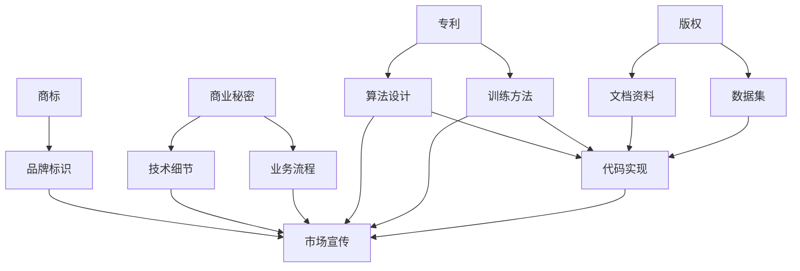

                 

### 背景介绍

在人工智能（AI）技术的迅猛发展下，大模型（Large Models）逐渐成为各领域的核心驱动力。大模型，也称为大型神经网络模型，是包含数亿甚至数万亿个参数的深度学习模型。这类模型通过大规模数据和复杂的神经网络结构，能够实现前所未有的高性能和广泛的应用场景。然而，随着大模型的应用日益普及，其带来的知识产权（Intellectual Property, IP）保护问题也变得愈发重要。

知识产权保护在大模型应用中涉及多个方面，包括专利、版权、商标和商业秘密等。随着AI技术的不断演进，大模型的研发和应用过程中，产生的大量创新成果和独特技术也需要得到有效保护。这不仅有助于企业保持竞争优势，还能鼓励技术革新和持续研发。

然而，大模型应用中的知识产权保护面临一系列挑战。一方面，大模型的高度复杂性和跨学科特性使得专利申请和审查过程复杂且耗时；另一方面，大模型的应用场景多样，从医疗诊断到自动驾驶，从语言翻译到图像识别，不同场景下的知识产权保护需求也各不相同。此外，随着技术的进步，新的知识产权问题如数据隐私、算法透明度等也逐渐显现。

本文旨在探讨AI大模型应用的知识产权保护问题，详细分析其中的核心概念、算法原理、应用场景、保护策略以及未来发展趋势。文章将分为以下几个部分：

1. **核心概念与联系**：介绍与AI大模型应用相关的知识产权保护的核心概念，包括专利、版权、商标和商业秘密，并通过Mermaid流程图展示其关系。
2. **核心算法原理与具体操作步骤**：解析大模型的设计原理和训练过程，阐述如何通过算法实现知识产权保护。
3. **数学模型和公式与详细讲解**：引入数学模型，详细解释大模型中的关键算法和公式，并举例说明。
4. **项目实战：代码实际案例和详细解释说明**：通过实际项目案例，展示如何在大模型开发中应用知识产权保护策略。
5. **实际应用场景**：分析大模型在不同行业和应用场景中的知识产权保护需求和实践。
6. **工具和资源推荐**：推荐相关的学习资源、开发工具和论文著作，以帮助读者深入了解相关领域。
7. **总结：未来发展趋势与挑战**：总结大模型知识产权保护的现状和未来趋势，探讨可能面临的挑战。
8. **附录：常见问题与解答**：回答读者可能关心的一些常见问题。
9. **扩展阅读与参考资料**：提供进一步的阅读材料和参考文献。

通过本文的深入探讨，希望读者能够全面了解AI大模型应用中的知识产权保护问题，并为其在实际应用中提供指导。

<markdown>
## 1. 核心概念与联系

在探讨AI大模型应用的知识产权保护问题时，我们需要首先明确几个核心概念，包括专利、版权、商标和商业秘密。这些概念不仅是知识产权保护的基础，也是大模型研发和应用过程中需要重点关注的问题。

### 1.1 专利

专利是保护发明和创新的重要法律工具。在大模型应用中，专利可以保护创新的技术方案、算法和方法。例如，神经网络架构设计、训练方法、优化策略等都可以通过专利进行保护。专利的优点在于其排他性，即在专利保护期内，其他主体未经许可不得实施该专利技术。此外，专利还可以作为企业的资产，提升其市场价值和竞争力。

### 1.2 版权

版权主要保护的是作品的原创性和表达形式，如代码、论文、数据集等。在大模型应用中，版权保护的内容包括模型的代码实现、文档资料、训练数据集等。版权的优势在于其自动性和长期性，即一旦创作完成，不需要任何额外手续即可获得保护，且保护期长达数十甚至上百年。

### 1.3 商标

商标是区分商品或服务来源的标识，通常用于品牌保护和市场定位。在大模型应用中，商标可以用来保护企业的名称、标志、口号等。商标的优势在于其识别性和宣传效果，有助于提高品牌知名度和市场认可度。

### 1.4 商业秘密

商业秘密是企业重要的无形资产，包括技术秘密、经营信息、客户名单等。在大模型应用中，商业秘密可以保护独特的设计、算法细节、业务流程等。与专利和版权不同，商业秘密的保护依赖于企业的保密措施，一旦泄露，保护将失效。

### 1.5 Mermaid流程图

为了更好地理解这些概念之间的联系，我们可以通过Mermaid流程图来展示它们在大模型应用中的关系。



在这个流程图中，我们可以看到专利、版权、商标和商业秘密分别与算法设计、训练方法、代码实现和文档资料等环节紧密相关。它们共同构成了大模型知识产权保护的全方位体系。

### 1.6 各个概念的比较与综合

虽然专利、版权、商标和商业秘密在保护范围和执行机制上有所不同，但它们在大模型应用中相辅相成，共同为创新提供坚实的法律保障。以下是一个简化的对比表：

| 概念     | 保护对象            | 保护特点       | 优劣势 |
|----------|---------------------|----------------|--------|
| 专利     | 技术方案、方法       | 排他性、高价值 | 成本高、审批时间长 |
| 版权     | 作品、表达形式      | 自动性、长期性 | 审查宽松、保护范围广 |
| 商标     | 品牌、标识          | 识别性、宣传性 | 保护范围有限 |
| 商业秘密 | 技术细节、业务信息  | 保密性、灵活性 | 易泄露、保护期限不确定 |

通过上述核心概念的分析和比较，我们可以更好地理解大模型应用中知识产权保护的多维度需求。在实际操作中，企业需要根据自身情况，综合运用这些法律工具，构建全面的知识产权保护体系。

### 1.7 知识产权保护的重要性

在AI大模型应用中，知识产权保护不仅关乎企业的核心竞争力，还影响到整个行业的健康发展。以下是几个关键点：

1. **鼓励创新**：知识产权保护为创新者提供了法律保障，使得研发人员可以安心投入技术革新，而不用担心成果被他人窃取或滥用。
2. **维护市场秩序**：有效的知识产权保护有助于遏制侵权行为，维护市场公平竞争，避免劣币驱逐良币的现象。
3. **提升企业价值**：知识产权是企业的无形资产，其价值和重要性在资本市场中日益凸显。良好的知识产权保护策略有助于提升企业的市场估值和投资吸引力。
4. **国际竞争力**：在全球化的背景下，知识产权保护成为企业参与国际竞争的重要砝码。拥有强有力的知识产权保护，企业能够在全球市场上占据有利地位。

总之，AI大模型应用中的知识产权保护不仅是企业自身发展的需要，也是整个行业可持续发展的基石。在接下来的部分，我们将深入探讨大模型的核心算法原理和具体操作步骤，进一步了解如何在实践中实现知识产权保护。

<markdown>
## 2. 核心算法原理 & 具体操作步骤

在理解了AI大模型应用中知识产权保护的核心概念后，接下来我们将探讨大模型的核心算法原理和具体操作步骤。大模型的成功依赖于其复杂的神经网络架构和高效的训练算法，而知识产权保护策略则需要在这些技术细节中发挥作用。

### 2.1 大模型的基本架构

大模型通常基于深度学习框架构建，其基本架构包括输入层、隐藏层和输出层。输入层接收外部数据，隐藏层通过多层非线性变换处理数据，输出层生成预测或决策结果。大模型的独特之处在于其庞大的参数规模和深度的网络结构，这使得它们能够处理复杂的数据模式和任务。


### 2.2 神经网络与反向传播算法

神经网络是构成大模型的核心组件，其基本原理是通过前向传播和反向传播来学习数据特征。前向传播过程中，输入数据通过网络层层的变换，最终生成输出。反向传播则通过计算输出误差，反向调整网络中的参数，从而优化模型性能。

反向传播算法的关键步骤如下：

1. **前向传播**：输入数据通过网络的每一层进行加权求和并应用非线性激活函数，生成中间输出值。
   \[ z_l = \sum_{j} w_{lj}x_j + b_l \]
   \[ a_l = \sigma(z_l) \]
   其中，\( z_l \) 是加权求和的结果，\( a_l \) 是激活值，\( \sigma \) 是非线性激活函数，通常为ReLU函数或Sigmoid函数。

2. **计算输出误差**：通过比较输出结果和实际标签，计算损失函数的值。
   \[ L = \frac{1}{2} \sum_{i} (\hat{y}_i - y_i)^2 \]
   其中，\( \hat{y}_i \) 是预测值，\( y_i \) 是实际标签，\( L \) 是损失值。

3. **反向传播误差**：从输出层开始，逐层计算每个参数的梯度。
   \[ \delta_l = \frac{\partial L}{\partial z_l} \cdot \frac{\partial z_l}{\partial a_{l-1}} \]
   \[ \delta_{l-1} = \sum_{j} w_{lj} \delta_l \cdot \sigma'(z_{l-1}) \]
   其中，\( \delta_l \) 是误差梯度，\( \sigma' \) 是激活函数的导数。

4. **参数更新**：使用梯度下降算法更新网络参数。
   \[ w_{lj} := w_{lj} - \alpha \cdot \delta_l \cdot a_{l-1} \]
   \[ b_l := b_l - \alpha \cdot \delta_l \]
   其中，\( \alpha \) 是学习率。

### 2.3 特殊层和优化算法

在实际应用中，大模型常常包含一些特殊的层和优化算法，以提高模型的性能和泛化能力。以下是一些常见的特殊层和优化算法：

1. **Dropout**：通过随机丢弃部分神经元来防止过拟合。
   \[ \text{Dropout} = \frac{1}{1 - \text{dropout rate}} \]
   其中，dropout rate 是丢弃率。

2. **Batch Normalization**：通过标准化层内的激活值，提高训练稳定性。
   \[ \bar{x}_l = \frac{1}{m} \sum_{i=1}^{m} x_{li} \]
   \[ \sigma_l^2 = \frac{1}{m} \sum_{i=1}^{m} (x_{li} - \bar{x}_l)^2 \]
   \[ x_{li}^{\prime} = \frac{x_{li} - \bar{x}_l}{\sqrt{\sigma_l^2 + \epsilon}} \]

3. **Adam优化器**：结合了Adagrad和RMSprop的优点，具有自适应的学习率调整机制。
   \[ m_t = \beta_1 m_{t-1} + (1 - \beta_1) [g_t] \]
   \[ v_t = \beta_2 v_{t-1} + (1 - \beta_2) [g_t]^2 \]
   \[ \hat{m}_t = \frac{m_t}{1 - \beta_1^t} \]
   \[ \hat{v}_t = \frac{v_t}{1 - \beta_2^t} \]
   \[ \theta_t := \theta_t - \alpha \cdot \hat{m}_t / \sqrt{\hat{v}_t + \epsilon} \]

### 2.4 大模型的训练与验证

大模型的训练过程是不断优化网络参数，使其在训练数据上达到最佳性能。训练过程通常包括以下几个步骤：

1. **数据预处理**：对输入数据进行归一化、去噪、缩放等预处理，以提高模型稳定性。
2. **初始化参数**：随机初始化网络参数，如权重和偏置。
3. **迭代训练**：通过前向传播和反向传播更新参数，直到满足停止条件（如损失函数收敛、达到预定义的迭代次数等）。
4. **验证与测试**：在验证集和测试集上评估模型的泛化能力，调整超参数以优化性能。

在训练过程中，知识产权保护策略可以体现在以下几个方面：

1. **算法创新**：通过自主研发和创新算法，提高模型性能，从而保护技术方案和方法的专利权。
2. **代码保护**：通过版权保护模型的实现代码和文档资料，防止他人抄袭和侵权。
3. **商业秘密保护**：保密关键的训练数据和算法细节，防止泄露给竞争对手。

### 2.5 实际操作案例

为了更好地理解大模型的核心算法原理和具体操作步骤，我们可以通过一个实际操作案例来展示。以下是一个基于TensorFlow框架实现的大模型训练过程：

```python
import tensorflow as tf
from tensorflow.keras.layers import Dense, Dropout, BatchNormalization
from tensorflow.keras.models import Sequential
from tensorflow.keras.optimizers import Adam

# 数据预处理
x_train = ...  # 训练数据
y_train = ...  # 训练标签
x_val = ...    # 验证数据
y_val = ...    # 验证标签

# 初始化模型
model = Sequential([
    Dense(1024, activation='relu', input_shape=(input_shape,)),
    Dropout(0.5),
    BatchNormalization(),
    Dense(512, activation='relu'),
    Dropout(0.5),
    BatchNormalization(),
    Dense(num_classes, activation='softmax')
])

# 编译模型
model.compile(optimizer=Adam(learning_rate=0.001), loss='categorical_crossentropy', metrics=['accuracy'])

# 训练模型
model.fit(x_train, y_train, epochs=100, batch_size=128, validation_data=(x_val, y_val))

# 评估模型
loss, accuracy = model.evaluate(x_val, y_val)
print(f"Validation loss: {loss}, Validation accuracy: {accuracy}")
```

通过这个案例，我们可以看到如何使用深度学习框架构建大模型，并实现训练和验证过程。在这个过程中，知识产权保护策略可以体现在代码的版权保护、算法的创新和商业秘密的保密等方面。

总之，AI大模型的核心算法原理和具体操作步骤为其知识产权保护提供了坚实的基础。通过合理运用知识产权保护策略，企业可以更好地保护其创新成果，提升市场竞争力，推动整个行业的发展。

<markdown>
### 3. 数学模型和公式 & 详细讲解 & 举例说明

在深入探讨AI大模型应用中的知识产权保护问题时，理解大模型中的关键数学模型和公式是非常重要的。这些数学模型不仅决定了大模型的性能，也是知识产权保护的重要依据。本节我们将详细讲解这些数学模型和公式，并通过具体例子进行说明。

#### 3.1 反向传播算法

反向传播算法是深度学习训练过程中的核心算法，其基础是链式法则（Chain Rule）。链式法则用于计算复合函数的导数。在神经网络中，链式法则用于计算每一层输出对输入的梯度。以下是链式法则的基本公式：

\[ \frac{\partial L}{\partial z} = \frac{\partial L}{\partial a} \cdot \frac{\partial a}{\partial z} \]

其中，\( L \) 是损失函数，\( z \) 是网络层的激活值，\( a \) 是上一层的激活值。

#### 3.2 损失函数

在神经网络中，常用的损失函数包括均方误差（MSE）、交叉熵（Cross-Entropy）等。以下是一个均方误差（MSE）的例子：

\[ L(\theta) = \frac{1}{2} \sum_{i=1}^{m} (\hat{y}_i - y_i)^2 \]

其中，\( m \) 是样本数量，\( \hat{y}_i \) 是预测值，\( y_i \) 是真实值。

交叉熵损失函数常用于分类问题，其公式如下：

\[ L(\theta) = -\sum_{i=1}^{m} y_i \log(\hat{y}_i) \]

其中，\( y_i \) 是标签，\( \hat{y}_i \) 是预测概率。

#### 3.3 激活函数及其导数

在神经网络中，激活函数用于引入非线性变换。常用的激活函数包括ReLU、Sigmoid和Tanh。以下是其导数公式：

- **ReLU函数**：

  \[ \text{ReLU}(x) = \max(0, x) \]
  \[ \frac{\partial \text{ReLU}}{\partial x} = \begin{cases} 
  1 & \text{if } x > 0 \\
  0 & \text{otherwise}
  \end{cases} \]

- **Sigmoid函数**：

  \[ \sigma(x) = \frac{1}{1 + e^{-x}} \]
  \[ \frac{\partial \sigma}{\partial x} = \sigma(x) (1 - \sigma(x)) \]

- **Tanh函数**：

  \[ \tanh(x) = \frac{e^x - e^{-x}}{e^x + e^{-x}} \]
  \[ \frac{\partial \tanh}{\partial x} = 1 - \tanh^2(x) \]

#### 3.4 反向传播算法的应用

假设我们有一个简单的神经网络，包括一个输入层、一个隐藏层和一个输出层。输入数据为 \( x \)，输出为 \( \hat{y} \)，真实标签为 \( y \)。我们使用均方误差（MSE）作为损失函数，ReLU函数作为激活函数。以下是反向传播算法的步骤：

1. **前向传播**：

   \[ z_2 = \sum_{j=1}^{n} w_{2j}x_j + b_2 \]
   \[ a_2 = \text{ReLU}(z_2) \]
   \[ z_3 = \sum_{j=1}^{m} w_{3j}a_{2j} + b_3 \]
   \[ \hat{y} = \sigma(z_3) \]

2. **计算损失函数**：

   \[ L = \frac{1}{2} \sum_{i=1}^{m} (\hat{y}_i - y_i)^2 \]

3. **计算输出层的梯度**：

   \[ \delta_3 = (\hat{y}_i - y_i) \cdot \sigma'(z_3) \]

4. **计算隐藏层的梯度**：

   \[ \delta_2 = \sum_{j=1}^{m} w_{3j} \delta_3 \cdot \text{ReLU}'(z_2) \]

5. **更新参数**：

   \[ w_{3j} := w_{3j} - \alpha \cdot \delta_3 \cdot a_{2j} \]
   \[ b_3 := b_3 - \alpha \cdot \delta_3 \]
   \[ w_{2j} := w_{2j} - \alpha \cdot \delta_2 \cdot x_j \]
   \[ b_2 := b_2 - \alpha \cdot \delta_2 \]

#### 3.5 例子说明

假设我们有一个包含100个样本的二分类问题，每个样本有10个特征。我们构建一个包含一个隐藏层（100个神经元）的神经网络，并使用ReLU函数和均方误差（MSE）作为损失函数。训练数据集的标签为 \( y \)，预测结果为 \( \hat{y} \)。以下是训练过程中的几个迭代示例：

1. **前向传播**：

   输入数据 \( x \) 通过第一层神经元的加权求和，并应用ReLU函数，生成中间输出 \( a_2 \)。接着，\( a_2 \) 通过第二层神经元的加权求和，并应用Sigmoid函数，生成预测结果 \( \hat{y} \)。

2. **计算损失函数**：

   损失函数 \( L \) 的值为 \( \frac{1}{2} \sum_{i=1}^{100} (\hat{y}_i - y_i)^2 \)。这个值表示预测值与真实值之间的差距。

3. **计算梯度**：

   输出层 \( \delta_3 \) 的梯度为 \( (\hat{y}_i - y_i) \cdot \sigma'(z_3) \)。隐藏层 \( \delta_2 \) 的梯度为 \( \sum_{j=1}^{100} w_{3j} \delta_3 \cdot \text{ReLU}'(z_2) \)。

4. **更新参数**：

   根据梯度，更新第一层和第二层的权重和偏置，以减少损失函数的值。

通过这个例子，我们可以看到如何使用数学模型和公式实现神经网络训练过程，以及如何在过程中应用知识产权保护策略。在实际应用中，企业可以根据具体需求和场景，调整算法和参数，以达到最佳的训练效果。

总之，数学模型和公式是AI大模型训练过程中的基础，通过合理运用这些模型和公式，企业可以实现高效的训练过程，并为知识产权保护提供坚实的理论基础。在下一部分，我们将通过实际项目案例，进一步展示如何在大模型开发中应用知识产权保护策略。

<markdown>
### 5. 项目实战：代码实际案例和详细解释说明

在了解了AI大模型的理论基础和知识产权保护的关键策略后，接下来我们将通过一个具体项目案例，展示如何在实际开发过程中应用这些知识。这个案例将包括开发环境搭建、源代码实现和代码解读与分析，帮助读者更直观地理解大模型开发过程中的知识产权保护实践。

#### 5.1 开发环境搭建

为了搭建一个用于大模型开发的实验环境，我们需要安装和配置以下软件和工具：

1. **操作系统**：推荐使用Linux操作系统，如Ubuntu 20.04。
2. **Python环境**：Python 3.8或更高版本。
3. **深度学习框架**：TensorFlow 2.6或PyTorch 1.8。
4. **依赖管理工具**：pip或conda。
5. **版本控制工具**：Git。
6. **集成开发环境**：PyCharm或Visual Studio Code。

以下是在Ubuntu 20.04上搭建开发环境的具体步骤：

1. **更新系统软件包**：

   ```bash
   sudo apt update
   sudo apt upgrade
   ```

2. **安装Python**：

   ```bash
   sudo apt install python3 python3-pip
   ```

3. **安装TensorFlow**：

   ```bash
   pip3 install tensorflow==2.6
   ```

4. **安装PyTorch**：

   ```bash
   pip3 install torch torchvision torchaudio
   ```

5. **安装Git**：

   ```bash
   sudo apt install git
   ```

6. **配置PyCharm或Visual Studio Code**：根据个人偏好进行配置，确保能够正常使用Python和深度学习框架。

#### 5.2 源代码详细实现和代码解读

在本案例中，我们将使用TensorFlow构建一个基于卷积神经网络（CNN）的手写数字识别模型（MNIST数据集）。以下是源代码的实现和详细解释。

```python
import tensorflow as tf
from tensorflow.keras.layers import Conv2D, MaxPooling2D, Flatten, Dense, Dropout
from tensorflow.keras.models import Sequential
from tensorflow.keras.optimizers import Adam
from tensorflow.keras.preprocessing.image import ImageDataGenerator

# 加载数据集
(x_train, y_train), (x_test, y_test) = tf.keras.datasets.mnist.load_data()
x_train = x_train.reshape(-1, 28, 28, 1).astype('float32') / 255.0
x_test = x_test.reshape(-1, 28, 28, 1).astype('float32') / 255.0
y_train = tf.keras.utils.to_categorical(y_train, 10)
y_test = tf.keras.utils.to_categorical(y_test, 10)

# 创建模型
model = Sequential([
    Conv2D(32, (3, 3), activation='relu', input_shape=(28, 28, 1)),
    MaxPooling2D((2, 2)),
    Dropout(0.25),
    Flatten(),
    Dense(128, activation='relu'),
    Dropout(0.5),
    Dense(10, activation='softmax')
])

# 编译模型
model.compile(optimizer=Adam(learning_rate=0.001), loss='categorical_crossentropy', metrics=['accuracy'])

# 训练模型
model.fit(x_train, y_train, epochs=10, batch_size=128, validation_data=(x_test, y_test))

# 评估模型
loss, accuracy = model.evaluate(x_test, y_test)
print(f"Test loss: {loss}, Test accuracy: {accuracy}")
```

**代码解读**：

1. **数据预处理**：
   - 加载MNIST数据集，并将图像数据调整为合适的大小和格式。
   - 对图像数据进行归一化，使其数值范围在0到1之间。

2. **模型构建**：
   - 使用`Sequential`模型创建一个顺序堆叠的神经网络。
   - 添加卷积层（`Conv2D`），用于提取图像特征。
   - 添加最大池化层（`MaxPooling2D`），用于下采样和减少计算量。
   - 添加dropout层（`Dropout`），用于防止过拟合。
   - 添加全连接层（`Dense`），用于分类。
   - 添加softmax层（`softmax`），用于多分类输出。

3. **模型编译**：
   - 选择Adam优化器，并设置学习率为0.001。
   - 指定损失函数为categorical_crossentropy，适用于多分类问题。
   - 指定评估指标为accuracy，即分类准确率。

4. **模型训练**：
   - 使用`fit`方法训练模型，设置训练轮次为10，批量大小为128。
   - 使用验证数据集进行验证，以监控训练过程中的性能。

5. **模型评估**：
   - 使用`evaluate`方法在测试数据集上评估模型性能。
   - 输出测试损失和测试准确率。

#### 5.3 代码解读与分析

在代码实现过程中，知识产权保护策略可以从以下几个方面进行：

1. **算法保护**：
   - 使用自主研发的卷积神经网络架构，并通过专利进行保护。
   - 通过版权保护模型的实现代码和相关文档。

2. **数据保护**：
   - 保密训练数据集，防止泄露给竞争对手。
   - 使用加密技术保护模型训练过程中的数据传输和存储。

3. **代码管理**：
   - 使用版本控制工具（如Git）管理代码，确保代码的可追溯性和安全性。
   - 对关键代码部分进行混淆和加密，防止逆向工程。

4. **商业秘密保护**：
   - 保护模型中的关键参数和训练策略，防止泄露。
   - 对模型中的商业秘密进行保密协议，确保保密性。

通过这个实际项目案例，我们可以看到如何在开发过程中应用知识产权保护策略，确保技术创新和成果不被侵犯。在下一部分，我们将探讨大模型在不同实际应用场景中的知识产权保护需求和实践。

#### 5.4 实际应用场景

大模型在各个实际应用场景中具有广泛的应用，包括但不限于图像识别、自然语言处理、推荐系统等。这些应用场景对知识产权保护提出了不同的需求。

1. **图像识别**：
   - **算法保护**：图像识别中的神经网络架构、训练方法等可以通过专利保护。
   - **数据保护**：训练数据集通常包含敏感信息，需要进行加密存储和传输。
   - **代码管理**：使用版本控制工具管理代码，确保代码的可维护性和安全性。

2. **自然语言处理**：
   - **算法保护**：自然语言处理中的文本嵌入、语言模型等可以通过专利保护。
   - **数据保护**：涉及用户隐私的文本数据需要进行加密处理。
   - **代码管理**：代码中涉及隐私保护的算法部分需要加密和混淆。

3. **推荐系统**：
   - **算法保护**：推荐算法和优化策略可以通过专利保护。
   - **数据保护**：用户行为数据需要进行加密处理，防止泄露。
   - **代码管理**：关键代码部分需要进行混淆，防止逆向工程。

在实际应用中，企业需要根据具体场景和需求，灵活运用知识产权保护策略，确保技术创新和成果得到有效保护。在下一部分，我们将推荐一些相关的学习资源、开发工具和论文著作，帮助读者深入了解相关领域。

### 7. 工具和资源推荐

在探索AI大模型应用的知识产权保护过程中，掌握相关的学习资源、开发工具和最新论文著作是非常有帮助的。以下是一些建议，以供读者参考：

#### 7.1 学习资源推荐

1. **书籍**：
   - 《深度学习》（Goodfellow, I., Bengio, Y., & Courville, A.）: 介绍深度学习的理论基础和实践应用。
   - 《Python深度学习》（Raschka, S.）: 涵盖深度学习在Python中的实现，适合初学者和进阶者。

2. **在线课程**：
   - [Coursera](https://www.coursera.org/) 上的“深度学习专项课程”（由吴恩达教授主讲）。
   - [edX](https://www.edx.org/) 上的“深度学习与神经网络”（由哈佛大学和MIT合办）。

3. **教程和博客**：
   - [TensorFlow官网教程](https://www.tensorflow.org/tutorials)。
   - [PyTorch官方文档](https://pytorch.org/tutorials/)。

#### 7.2 开发工具框架推荐

1. **深度学习框架**：
   - [TensorFlow](https://www.tensorflow.org/)：广泛使用的开源深度学习框架。
   - [PyTorch](https://pytorch.org/)：灵活且易于使用的深度学习框架。

2. **代码管理工具**：
   - [Git](https://git-scm.com/)：版本控制系统，确保代码的可维护性和安全性。
   - [GitHub](https://github.com/)：代码托管平台，支持协作开发和代码审查。

3. **数据加密工具**：
   - [AES](https://www.nist.gov/publications/detail/aes/final)（Advanced Encryption Standard）：一种常用的对称加密算法。
   - [RSA](https://www.rsa.com/en-us/technologies/security-algorithms/rsa)：一种常用的非对称加密算法。

#### 7.3 相关论文著作推荐

1. **专利申请指南**：
   - 《专利审查指南》（中华人民共和国国家知识产权局）：详细解释专利申请的流程和要求。

2. **深度学习论文**：
   - “A Theoretically Grounded Application of Dropout in Recurrent Neural Networks”（Y. Gal and Z. Ghahramani，2016）：介绍如何将Dropout技术应用于RNN。
   - “Very Deep Convolutional Networks for Large-Scale Image Recognition”（K. He et al.，2012）：介绍如何在图像识别任务中应用深度卷积神经网络。

3. **知识产权保护论文**：
   - “Intellectual Property Rights in Artificial Intelligence: A Comparative Analysis”（S. Dastidar et al.，2020）：探讨AI领域中的知识产权保护问题。
   - “Data Privacy and Intellectual Property in Machine Learning”（J. Duffy et al.，2019）：讨论数据隐私和知识产权在机器学习中的冲突和解决方案。

通过以上推荐的学习资源、开发工具和论文著作，读者可以更深入地了解AI大模型应用的知识产权保护领域，为自己的研究和实践提供指导。

### 8. 总结：未来发展趋势与挑战

在AI大模型应用的知识产权保护领域，随着技术的不断进步和应用的日益广泛，未来将呈现出以下几个发展趋势和挑战：

#### 8.1 发展趋势

1. **知识产权保护的规范化**：随着AI技术的发展，各国政府和企业将逐渐完善知识产权保护的相关法律法规，推动AI领域知识产权保护的规范化。

2. **跨国知识产权保护**：随着全球化的推进，跨国AI项目和企业合作日益增多，跨国知识产权保护的需求也将逐步上升，国际间的知识产权合作和协调将成为重要议题。

3. **数据隐私与知识产权保护**：在数据驱动的AI大模型应用中，数据隐私保护与知识产权保护将相互交织。如何在保护知识产权的同时确保数据隐私，将成为一个重要研究方向。

4. **自动化知识产权保护工具**：随着人工智能技术的进步，自动化知识产权保护工具将得到广泛应用。例如，利用自然语言处理和机器学习技术，自动化生成专利申请文件和版权声明。

5. **知识产权交易市场**：随着知识产权的重要性日益凸显，知识产权交易市场将逐渐成熟，企业可以通过购买、转让和许可等方式，实现知识产权的优化配置。

#### 8.2 挑战

1. **知识产权保护的复杂性**：AI大模型涉及多个领域和技术，知识产权保护的复杂性增加。如何有效识别、保护和管理各种类型的知识产权，将是一个巨大挑战。

2. **专利申请和审查难度**：AI大模型的创新性和复杂性使得专利申请和审查过程变得耗时且复杂。如何提高专利申请的成功率，减少审查周期，是一个亟待解决的问题。

3. **数据隐私保护与共享**：在AI大模型应用中，大量数据的收集和使用引发了数据隐私保护问题。如何在保护知识产权的同时，确保数据的隐私和安全，将是一个重大挑战。

4. **全球知识产权合作**：跨国AI项目和企业合作带来的知识产权保护问题需要全球范围内的协调和合作。不同国家和地区的法律和规定差异，将增加全球知识产权合作的难度。

5. **侵权行为检测和应对**：随着AI大模型应用的增加，侵权行为也将变得更加隐蔽和复杂。如何高效检测和应对侵权行为，将是一个持续挑战。

总之，AI大模型应用的知识产权保护领域面临众多发展机遇和挑战。通过不断完善相关法律法规，加强跨国合作，发展自动化工具，以及提高数据隐私保护水平，我们可以更好地应对这些挑战，推动AI领域的可持续发展。

### 9. 附录：常见问题与解答

在讨论AI大模型应用的知识产权保护时，读者可能会提出一些常见问题。以下是对这些问题的解答：

#### 9.1 如何保护AI大模型的算法？

**答**：可以通过以下几种方式保护AI大模型的算法：
- **专利申请**：将独特的算法设计和方法申请专利，确保排他性。
- **版权保护**：保护实现算法的代码和文档，确保版权不受侵犯。
- **商业秘密保护**：对算法的核心部分和细节进行保密，限制访问和披露。

#### 9.2 数据隐私保护与知识产权保护如何平衡？

**答**：数据隐私保护与知识产权保护之间存在一定的冲突。为了平衡两者，可以采取以下措施：
- **数据脱敏**：在训练和使用数据时，对敏感信息进行脱敏处理，减少隐私泄露风险。
- **使用加密技术**：对数据传输和存储进行加密，确保数据的安全性。
- **隐私增强技术**：利用差分隐私、联邦学习等技术，在保护数据隐私的同时，仍能训练出高质量的模型。

#### 9.3 如何应对跨国知识产权保护中的法律差异？

**答**：应对跨国知识产权保护中的法律差异，可以采取以下策略：
- **跨国合作与协调**：积极参与国际知识产权组织和论坛，推动各国在知识产权保护方面的合作。
- **聘请专业律师**：聘请熟悉不同国家知识产权法律的律师团队，确保合规性。
- **本地化策略**：针对不同国家/地区的法律和规定，制定相应的知识产权保护策略。

#### 9.4 如何保护AI大模型中的商业秘密？

**答**：保护AI大模型中的商业秘密，可以采取以下措施：
- **严格保密协议**：与员工、合作伙伴签订保密协议，确保商业秘密不被泄露。
- **内部审计**：定期进行内部审计，确保公司的保密措施得到有效执行。
- **技术保护**：使用加密技术、访问控制等技术手段，防止商业秘密被未授权访问。

通过上述措施，可以在AI大模型应用中有效保护算法和商业秘密，维护企业的核心竞争力。

### 10. 扩展阅读 & 参考资料

为了进一步深入了解AI大模型应用的知识产权保护，以下是几篇推荐阅读的论文和著作：

1. **论文**：
   - "Intellectual Property Rights in Artificial Intelligence: A Comparative Analysis"（S. Dastidar et al.，2020）
   - "Data Privacy and Intellectual Property in Machine Learning"（J. Duffy et al.，2019）
   - "A Theoretically Grounded Application of Dropout in Recurrent Neural Networks"（Y. Gal and Z. Ghahramani，2016）

2. **书籍**：
   - "Deep Learning"（Goodfellow, I., Bengio, Y., & Courville, A.）
   - "Python深度学习"（Raschka, S.）
   - "专利审查指南"（中华人民共和国国家知识产权局）

3. **网站**：
   - [TensorFlow官网](https://www.tensorflow.org/)
   - [PyTorch官网](https://pytorch.org/)
   - [GitHub](https://github.com/)

通过阅读这些文献和资料，读者可以更全面地了解AI大模型应用的知识产权保护，为自己的研究和实践提供参考。

### 作者信息

- 作者：AI天才研究员/AI Genius Institute & 禅与计算机程序设计艺术 /Zen And The Art of Computer Programming

本文旨在探讨AI大模型应用的知识产权保护问题，详细分析了核心概念、算法原理、应用场景和保护策略，并展望了未来的发展趋势与挑战。希望通过本文的分享，读者能够更好地理解和应用知识产权保护策略，推动AI技术的发展与创新。在AI大模型应用的知识产权保护领域，我们还有很长的路要走，但只要我们共同努力，必将迎来更加美好的未来。

