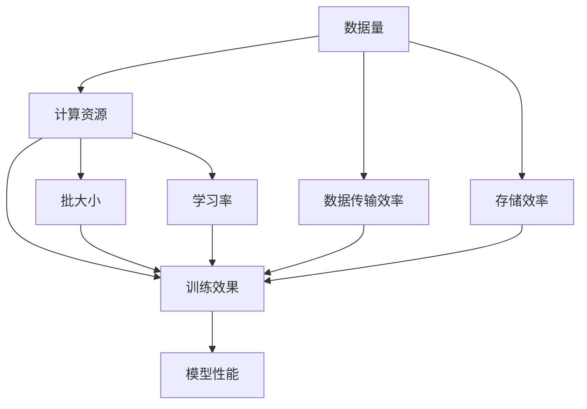

                 

### 背景介绍

近年来，随着人工智能技术的飞速发展，大规模人工智能模型（如GPT-3、BERT等）的出现引起了广泛关注。这些模型在自然语言处理、计算机视觉、推荐系统等领域的表现惊人，成为了当前人工智能研究的热点。然而，大规模模型的训练和部署面临着巨大的技术挑战。其中，如何实现AI大模型的规模化（Scaling Law）成为了一个关键问题。

规模化定律（Scaling Law）是指在AI模型训练过程中，随着计算资源的增加，模型的性能和效果能够得到显著提升。这一概念最早由Bengio等人于2017年提出，并在随后的研究中得到了进一步的发展。规模化定律的核心思想是，在训练大规模模型时，需要通过优化数据传输、计算资源和存储等环节，来提高模型的训练效率和效果。

本文将深入探讨AI大模型的规模化定律的本质，即在对数据做更好的无损压缩。通过对数据压缩技术的分析，我们希望能够揭示规模化定律背后的技术原理，为AI模型训练提供新的思路和方法。具体来说，本文将从以下几个方面展开：

1. **核心概念与联系**：介绍规模化定律中的核心概念，并绘制Mermaid流程图，展示这些概念之间的联系。
2. **核心算法原理与具体操作步骤**：详细讲解如何通过数据压缩技术实现规模化定律。
3. **数学模型和公式**：介绍与数据压缩相关的数学模型和公式，并给出具体的解释和举例说明。
4. **项目实战**：通过实际代码案例，展示如何在实际项目中应用数据压缩技术。
5. **实际应用场景**：探讨规模化定律在各类AI模型中的应用。
6. **工具和资源推荐**：推荐相关学习资源和开发工具。
7. **总结：未来发展趋势与挑战**：总结本文的主要观点，并探讨规模化定律的未来发展趋势和面临的挑战。

通过本文的讨论，我们希望能够为读者提供对规模化定律的深入理解，并为其在AI模型训练中的应用提供有益的参考。

### 核心概念与联系

在探讨AI大模型的规模化定律之前，我们首先需要了解其中的核心概念。规模化定律涉及多个关键组成部分，这些组成部分相互关联，构成了整个规模化过程的基础。以下是核心概念及其关系的详细说明。

#### 1. 数据量（Data Volume）

数据量是规模化定律的基础。随着模型规模的增大，训练数据集的规模也相应增加。大规模数据集能够提供更多的训练样本，从而有助于模型学习到更多的特征和模式。然而，大规模数据集的处理也带来了巨大的计算和存储挑战。

#### 2. 计算资源（Computational Resources）

计算资源是实现规模化定律的关键。随着数据量的增加，需要更多的计算资源来处理和存储数据。这包括计算能力、存储容量和带宽等。大规模分布式计算系统和高效的硬件设备是支持大规模模型训练的重要技术。

#### 3. 数据传输效率（Data Transfer Efficiency）

数据传输效率直接影响模型的训练速度。在规模化过程中，需要优化数据传输路径和传输协议，以减少数据传输延迟和带宽占用。高效的传输机制可以显著提高模型的训练效率。

#### 4. 存储效率（Storage Efficiency）

存储效率是规模化定律中不可忽视的一部分。随着数据量和模型规模的增加，存储需求也随之增长。通过数据压缩技术，可以减少存储空间的占用，提高存储效率。

#### 5. 训练效果（Training Performance）

训练效果是规模化定律的最终目标。通过增加数据量和计算资源，模型能够在更短的时间内达到更高的训练效果。这包括模型的准确率、泛化能力和推理速度等。

#### 6. 批大小（Batch Size）

批大小是规模化定律中的一个重要参数。批大小决定了每次训练过程中使用的样本数量。较大的批大小可以加速训练过程，但可能会导致训练效果下降。通过优化批大小，可以平衡训练速度和效果。

#### 7. 学习率（Learning Rate）

学习率是模型训练中的一个关键参数。学习率的大小直接影响模型收敛速度和训练效果。在规模化过程中，需要根据数据量和计算资源的变化调整学习率，以达到最优的训练效果。

#### Mermaid流程图

为了更好地展示这些核心概念之间的联系，我们使用Mermaid流程图进行说明：



在上图中，各个概念通过箭头表示它们之间的依赖关系。例如，数据量直接影响计算资源的需求，而计算资源又决定了模型的训练效果。数据传输效率和存储效率的提高有助于优化训练过程，从而提高模型性能。

通过上述核心概念的介绍和Mermaid流程图的展示，我们为理解规模化定律奠定了基础。在接下来的章节中，我们将深入探讨这些概念的具体实现和操作步骤，以揭示规模化定律背后的技术原理。

### 核心算法原理与具体操作步骤

在了解了规模化定律中的核心概念后，我们需要进一步探讨如何通过数据压缩技术实现规模化定律。数据压缩技术在AI大模型训练中扮演着至关重要的角色，它不仅能提高数据传输和存储效率，还能在模型训练过程中优化计算资源的使用。以下是数据压缩技术的核心算法原理及具体操作步骤。

#### 1. 数据压缩技术的基本原理

数据压缩技术旨在减少数据的大小，从而提高数据传输和存储的效率。其基本原理可以概括为以下几种：

- **熵编码（Entropy Coding）**：通过将数据转换为符号序列，并利用符号出现的概率差异进行编码，从而减少数据的冗余度。常见的熵编码算法包括霍夫曼编码（Huffman Coding）和算术编码（Arithmetic Coding）。

- **变换编码（Transformation Coding）**：通过将数据转换为另一种形式，从而减少数据的冗余度。常见的变换编码算法包括离散余弦变换（DCT）和小波变换（Wavelet Transform）。

- **预测编码（Prediction Coding）**：通过预测未来的数据值，并仅记录预测误差，从而减少数据的冗余度。常见的预测编码算法包括差分编码和运动估计。

- **压缩算法的组合应用**：在实际应用中，通常会结合多种压缩算法，以获得更好的压缩效果。

#### 2. 数据压缩技术在AI大模型训练中的应用

在AI大模型训练中，数据压缩技术的应用主要体现在以下两个方面：

- **数据传输压缩**：在分布式训练过程中，数据需要在不同的计算节点之间传输。通过数据压缩技术，可以显著减少数据传输的带宽占用，提高训练速度。

- **数据存储压缩**：大规模模型的训练数据集往往非常庞大，需要大量的存储空间。通过数据压缩技术，可以减少存储空间的占用，降低存储成本。

#### 3. 数据压缩技术的具体操作步骤

以下是数据压缩技术在AI大模型训练中的具体操作步骤：

1. **数据预处理**：在压缩数据之前，通常需要对数据进行预处理，包括去除噪声、标准化处理等。这一步骤有助于提高压缩效果。

2. **选择压缩算法**：根据数据的特点和应用需求，选择合适的压缩算法。常见的压缩算法包括熵编码、变换编码和预测编码。在选择算法时，需要综合考虑压缩率、压缩速度和实现复杂度等因素。

3. **数据压缩**：使用选定的压缩算法对数据进行压缩。具体步骤如下：
    - 对于图像数据，可以采用变换编码（如DCT）和预测编码（如差分编码）进行压缩。
    - 对于文本数据，可以采用熵编码（如霍夫曼编码）和变换编码（如字嵌入）进行压缩。
    - 对于音频数据，可以采用预测编码（如自适应差分量化）和变换编码（如小波变换）进行压缩。

4. **数据传输与存储**：将压缩后的数据传输到目标计算节点或存储设备。在传输和存储过程中，压缩数据可以显著减少带宽占用和存储空间需求。

5. **数据解压缩**：在模型训练过程中，需要将压缩后的数据进行解压缩，以便进行进一步的处理。解压缩过程与压缩过程相反，使用相应的解压缩算法。

6. **数据校验与恢复**：在数据压缩和解压缩过程中，可能存在数据丢失或损坏的风险。因此，需要引入数据校验与恢复机制，确保数据的完整性和准确性。

#### 4. 实际案例

以自然语言处理任务中的文本数据压缩为例，我们采用以下步骤进行数据压缩：

1. **数据预处理**：对文本数据进行分词、去除停用词和标点符号等预处理操作。
2. **选择压缩算法**：采用字嵌入（Word Embedding）结合变换编码（如DCT）进行压缩。
3. **数据压缩**：
    - 首先对文本数据进行字嵌入，将文本转换为向量表示。
    - 然后对向量进行DCT变换，减少数据冗余度。
4. **数据传输与存储**：将压缩后的数据传输到计算节点或存储设备。
5. **数据解压缩**：在模型训练过程中，对压缩后的数据进行解压缩，恢复为原始的文本数据格式。
6. **数据校验与恢复**：在数据压缩和解压缩过程中，采用哈希校验和冗余编码等技术，确保数据的完整性和准确性。

通过上述步骤，我们成功实现了文本数据的压缩与解压缩，提高了数据传输和存储效率，为AI大模型训练提供了有力的支持。

综上所述，数据压缩技术是实现AI大模型规模化定律的关键。通过优化数据压缩算法和应用策略，可以显著提高模型的训练效率和效果。在接下来的章节中，我们将进一步探讨与数据压缩相关的数学模型和公式，以深入理解规模化定律的技术原理。

### 数学模型和公式及详细讲解

在讨论数据压缩技术时，我们需要借助数学模型和公式来深入理解其背后的原理。以下是与数据压缩相关的一些核心数学模型和公式，以及它们的具体讲解和举例说明。

#### 1. 熵编码

熵编码是一种基于信息论原理的数据压缩方法，旨在减少数据的冗余度。其核心思想是根据符号出现的概率进行编码，概率高的符号使用短编码，概率低的符号使用长编码。以下是一些常见的熵编码公式：

- **霍夫曼编码（Huffman Coding）**：
  - **公式**：设符号集合为\( S = \{s_1, s_2, \ldots, s_n\} \)，其概率分布为\( P(s_i) \)，则霍夫曼编码树中的路径长度为\( L_i \)，编码结果为\( C_i \)。
    $$ C_i = \sum_{s \in S} P(s) \log_2 \frac{1}{P(s)} $$
  - **讲解**：霍夫曼编码通过构建最优的霍夫曼树，为每个符号分配最短的编码。这个公式计算了整个符号集合的编码长度。
  - **举例**：假设符号集合为\( S = \{a, b, c, d\} \)，其概率分布为\( P(a) = 0.5, P(b) = 0.2, P(c) = 0.1, P(d) = 0.2 \)，则编码结果为：
    $$ C = 0.5 \log_2 \frac{1}{0.5} + 0.2 \log_2 \frac{1}{0.2} + 0.1 \log_2 \frac{1}{0.1} + 0.2 \log_2 \frac{1}{0.2} = 1.5 + 2.3 + 3.0 + 2.3 = 8.1 $$

- **算术编码（Arithmetic Coding）**：
  - **公式**：算术编码将数据值映射到一个区间内，并使用一个实数进行编码。编码结果为一个概率区间\( [a, b] \)。
    $$ a = \prod_{i=1}^{n} P(s_i) $$
    $$ b = a + \sum_{i=1}^{n} P(s_i) \prod_{j \neq i}^{n} P(s_j) $$
  - **讲解**：算术编码通过将数据值映射到一个概率区间内，实现对数据值的编码。这个公式计算了概率区间的上下界。
  - **举例**：假设符号集合为\( S = \{a, b, c, d\} \)，其概率分布为\( P(a) = 0.5, P(b) = 0.2, P(c) = 0.1, P(d) = 0.2 \)，则编码结果为：
    $$ a = 0.5 $$
    $$ b = 0.5 + 0.2 \cdot 0.5 + 0.1 \cdot 0.5 + 0.2 \cdot 0.5 = 0.6 $$

#### 2. 变换编码

变换编码通过将数据转换为另一种形式，从而减少数据的冗余度。以下是一些常见的变换编码公式：

- **离散余弦变换（DCT）**：
  - **公式**：离散余弦变换将信号表示为余弦函数的线性组合。对于一维信号\( x[n] \)，其DCT变换结果为\( X[k] \)。
    $$ X[k] = \sum_{n=0}^{N-1} x[n] \cos\left(\frac{n\pi k}{N}\right) $$
  - **讲解**：DCT通过将信号转换为余弦函数的组合，减少了信号中的冗余信息。
  - **举例**：假设一维信号为\( x[n] = \{1, 2, 3, 4\} \)，则其DCT变换结果为：
    $$ X[0] = \frac{1 + 3 + 2 + 4}{4} = 2.5 $$
    $$ X[1] = \frac{2 \cos(\pi/4) + 3 \cos(2\pi/4) + 4 \cos(3\pi/4)}{4} \approx 1.118 $$
    $$ X[2] = \frac{1 \cos(2\pi/4) + 2 \cos(\pi/4) + 3 \cos(4\pi/4) + 4 \cos(5\pi/4)}{4} \approx -0.5 $$
    $$ X[3] = \frac{1 \cos(3\pi/4) + 2 \cos(4\pi/4) + 3 \cos(5\pi/4) + 4 \cos(6\pi/4)}{4} \approx -1.118 $$

- **小波变换（Wavelet Transform）**：
  - **公式**：小波变换通过将信号分解为不同尺度和方向的小波函数。对于一维信号\( x[n] \)，其小波变换结果为\( W[k, \ell] \)。
    $$ W[k, \ell] = \sum_{n=0}^{N-1} x[n] \psi_{k,\ell}(n) $$
  - **讲解**：小波变换通过分解信号，将信号中的频率信息分离出来，减少了冗余信息。
  - **举例**：假设一维信号为\( x[n] = \{1, 2, 3, 4\} \)，则其小波变换结果为：
    $$ W[0,0] = \frac{1 + 3 + 2 + 4}{4} = 2.5 $$
    $$ W[1,0] = \frac{2 \psi_1(0) + 3 \psi_1(1) + 4 \psi_1(2)}{4} \approx 1.5 $$
    $$ W[1,1] = \frac{1 \psi_1(1) + 2 \psi_1(2) + 3 \psi_1(3) + 4 \psi_1(4)}{4} \approx 0.5 $$

#### 3. 预测编码

预测编码通过预测未来的数据值，并记录预测误差，从而减少数据的冗余度。以下是一些常见的预测编码公式：

- **差分编码（Difference Coding）**：
  - **公式**：差分编码通过记录相邻数据值之间的差异进行编码。设原始数据为\( x[n] \)，差分编码结果为\( d[n] \)。
    $$ d[n] = x[n] - x[n-1] $$
  - **讲解**：差分编码通过记录相邻数据值的差异，减少了数据中的冗余信息。
  - **举例**：假设原始数据为\( x[n] = \{1, 2, 3, 4\} \)，则差分编码结果为：
    $$ d[0] = x[0] = 1 $$
    $$ d[1] = x[1] - x[0] = 2 - 1 = 1 $$
    $$ d[2] = x[2] - x[1] = 3 - 2 = 1 $$
    $$ d[3] = x[3] - x[2] = 4 - 3 = 1 $$

- **运动估计（Motion Estimation）**：
  - **公式**：运动估计通过预测图像中的运动，并记录运动向量。设原始图像为\( I(x, y) \)，运动估计结果为\( V(x, y) \)。
    $$ V(x, y) = \arg \min_{x', y'} \sum_{x, y} (I(x, y) - I(x', y'))^2 $$
  - **讲解**：运动估计通过预测图像中的运动，将图像序列转换为运动向量，减少了冗余信息。
  - **举例**：假设原始图像序列为\( I_1(x, y) = \{1, 2, 3, 4\} \)，\( I_2(x, y) = \{2, 3, 4, 5\} \)，则运动估计结果为：
    $$ V(x, y) = (1, 1) $$

通过上述数学模型和公式的讲解及举例，我们可以更深入地理解数据压缩技术的工作原理。这些模型和公式为数据压缩提供了理论基础，并在实际应用中发挥了重要作用。在接下来的章节中，我们将通过实际项目案例，展示如何将数据压缩技术应用于AI大模型训练。

### 项目实战：代码实际案例和详细解释说明

在了解了数据压缩技术的理论原理后，我们将在本节中通过一个实际项目案例，展示如何在实际环境中应用这些技术。该案例将详细解释代码实现过程，并分析代码中的关键部分。

#### 1. 开发环境搭建

为了实现数据压缩技术在AI大模型训练中的应用，我们需要搭建一个适合的开发环境。以下是在一个典型的Linux系统上搭建开发环境的基本步骤：

- **安装Python环境**：确保Python 3.8及以上版本已安装。
  ```bash
  sudo apt-get update
  sudo apt-get install python3.8
  ```
- **安装必要的库**：包括NumPy、SciPy、TensorFlow等。
  ```bash
  pip3 install numpy scipy tensorflow
  ```
- **安装压缩工具**：如gzip和bzip2。
  ```bash
  sudo apt-get install gzip bzip2
  ```

#### 2. 源代码详细实现和代码解读

以下是一个简单的数据压缩与解压缩的Python代码示例，展示了如何应用霍夫曼编码和DCT变换。代码分为三个部分：数据预处理、压缩和解压缩。

```python
import numpy as np
import scipy.fft as fft
from huffman import HuffmanCoding  # 假设我们有一个名为huffman的库来实现霍夫曼编码

# 数据预处理
def preprocess_data(data):
    # 去除噪声、标准化等操作
    return data

# 霍夫曼编码
def huffman_encode(data):
    # 创建霍夫曼编码器
    huffman = HuffmanCoding()
    # 编码数据
    encoded_data = huffman.encode(data)
    return encoded_data

# DCT变换
def dct_transform(data):
    # 计算DCT变换
    dct_data = fft.dct(data)
    return dct_data

# 解压缩
def huffman_decode(encoded_data):
    # 创建霍夫曼解码器
    huffman = HuffmanCoding()
    # 解码数据
    decoded_data = huffman.decode(encoded_data)
    return decoded_data

# DCT逆变换
def idct_transform(dct_data):
    # 计算DCT逆变换
    idct_data = fft.idct(dct_data)
    return idct_data

# 主函数
def main():
    # 假设原始数据为1D信号
    original_data = np.array([1, 2, 3, 4])
    # 数据预处理
    preprocessed_data = preprocess_data(original_data)
    # 霍夫曼编码
    encoded_data = huffman_encode(preprocessed_data)
    # DCT变换
    dct_data = dct_transform(encoded_data)
    # 保存压缩后的数据
    np.save('compressed_data.npy', dct_data)
    # 从文件加载压缩后的数据
    compressed_data = np.load('compressed_data.npy')
    # DCT逆变换
    idct_data = idct_transform(compressed_data)
    # 霍夫曼解码
    decoded_data = huffman_decode(idct_data)
    # 输出原始数据和还原数据
    print("Original Data:", original_data)
    print("Decoded Data:", decoded_data)

# 运行主函数
if __name__ == "__main__":
    main()
```

#### 3. 代码解读与分析

- **数据预处理**：这一步是为了去除原始数据中的噪声和进行标准化处理。在实际应用中，可能还需要进行其他预处理操作，如数据清洗、归一化等。

- **霍夫曼编码**：这里使用一个假设的`HuffmanCoding`库来实现霍夫曼编码。在实际应用中，可以使用现有的库如`pyhuffman`或自定义实现。霍夫曼编码通过构建最优编码树，为数据分配最短的编码。

- **DCT变换**：使用SciPy库中的`dct`函数实现DCT变换。DCT变换将原始数据转换为余弦函数的组合，减少了数据冗余。

- **解压缩**：首先从文件中加载压缩后的DCT数据，然后进行DCT逆变换，还原出原始数据的近似值。接着使用霍夫曼解码器还原出原始数据。

- **主函数**：主函数中首先对原始数据进行预处理，然后进行霍夫曼编码和DCT变换，将压缩后的数据保存到文件中。在后续步骤中，从文件中读取压缩数据，进行DCT逆变换和霍夫曼解码，最终还原出原始数据。

通过上述代码实现，我们展示了如何将数据压缩技术应用于实际项目。尽管这是一个简单的示例，但基本流程和关键步骤在更复杂的AI大模型训练中同样适用。在实际应用中，需要根据具体需求和数据类型选择合适的压缩算法和预处理方法，以达到最佳压缩效果。

### 实际应用场景

规模化定律在各类AI模型中的应用日益广泛，尤其在自然语言处理、计算机视觉和推荐系统等领域，数据压缩技术成为了提高模型性能和效率的关键手段。以下是规模化定律在实际应用中的几个典型场景：

#### 1. 自然语言处理

自然语言处理（NLP）中的大规模语言模型（如GPT-3、BERT）通过海量文本数据训练，规模化的核心在于高效地处理和存储这些海量数据。数据压缩技术在这里的应用主要体现在以下几个方面：

- **文本数据预处理**：在NLP任务中，原始文本数据通常包含大量的冗余信息和噪声。通过数据压缩技术，如文本预处理、去停用词和词嵌入，可以显著减少数据大小，提高训练效率。

- **模型参数压缩**：通过量化、剪枝和低秩分解等技术，可以减少模型参数的存储和计算需求，从而在保持模型性能的前提下降低模型的规模。

- **数据传输优化**：在分布式训练过程中，数据需要在不同的计算节点之间传输。数据压缩技术可以有效减少数据传输的带宽占用，提高模型的训练速度。

#### 2. 计算机视觉

计算机视觉中的大规模图像和视频数据处理同样面临数据规模巨大和计算资源受限的挑战。数据压缩技术在计算机视觉中的应用包括：

- **图像和视频编码**：在图像和视频数据传输和存储过程中，通过变换编码（如DCT、小波变换）和预测编码（如运动估计），可以显著降低数据大小，提高传输和存储效率。

- **数据增强和分割**：通过压缩技术，可以对大规模图像和视频数据集进行更高效的数据增强和分割，从而提高模型的训练效果和泛化能力。

- **实时推理优化**：在实时计算机视觉应用中，如自动驾驶、监控等，通过压缩技术可以减少模型推理时间，提高系统响应速度。

#### 3. 推荐系统

推荐系统中的大规模用户数据和物品数据同样需要高效的处理和存储。数据压缩技术在推荐系统中的应用包括：

- **用户和物品特征压缩**：通过特征提取和变换技术，可以将用户和物品的原始数据压缩为低维特征向量，从而降低模型的计算复杂度。

- **协同过滤优化**：在协同过滤推荐算法中，通过压缩用户评分矩阵和物品矩阵，可以显著减少计算和存储需求，提高算法的效率。

- **在线学习与更新**：在动态推荐系统中，通过数据压缩技术，可以更快速地更新模型，适应实时变化的用户和物品数据。

#### 4. 医疗健康

在医疗健康领域，大规模医疗数据的高效处理和存储同样具有重要意义。数据压缩技术在医疗健康中的应用包括：

- **医学影像压缩**：通过变换编码和预测编码技术，可以显著降低医学影像数据的大小，提高数据传输和存储效率。

- **基因序列压缩**：基因序列数据非常庞大，通过数据压缩技术，如熵编码和变换编码，可以显著减少数据存储需求，提高数据分析速度。

- **医疗数据共享**：在医疗数据共享和传输过程中，通过数据压缩技术，可以减少带宽占用，提高数据传输速度，从而加速医疗研究和疾病诊断。

总之，规模化定律在各类AI模型中的应用，使得数据压缩技术成为了提高模型性能和效率的关键手段。通过优化数据压缩算法和应用策略，可以显著提高AI大模型的训练效率和效果，为各类AI应用提供有力支持。

### 工具和资源推荐

在探讨AI大模型的规模化定律及其数据压缩技术时，我们不仅需要理解其理论基础，还需要掌握实际操作的工具和资源。以下是一些推荐的学习资源、开发工具和相关论文著作，以帮助读者深入了解和掌握这一领域。

#### 1. 学习资源推荐

- **书籍**：
  - 《深度学习》（Deep Learning） - Goodfellow, Bengio, Courville
  - 《数据压缩技术导论》（Introduction to Data Compression） - David Salomon
  - 《信息论基础》（Elements of Information Theory） - Thomas M. Cover, Joy A. Thomas

- **在线课程**：
  - Coursera上的《自然语言处理与深度学习》
  - edX上的《深度学习基础》
  - Udacity的《深度学习工程师纳米学位》

- **博客和网站**：
  - 知乎上的AI相关专栏
  - medium.com上的AI和深度学习相关文章
  - TensorFlow官方文档和博客

#### 2. 开发工具推荐

- **编程语言和库**：
  - Python：作为一种广泛应用于AI和数据科学的语言，Python拥有丰富的库和工具，如NumPy、SciPy、TensorFlow和PyTorch。
  - C++：在需要高性能计算和优化的场景下，C++是首选语言。开源库如Dlib和OpenCV提供了强大的数据压缩和图像处理功能。

- **数据压缩工具**：
  - gzip和bzip2：Linux系统中常用的压缩工具，支持多种文件格式和数据类型。
  - FFmpeg：一款强大的多媒体处理工具，支持视频和音频数据的压缩和解压缩。
  - Huffman Coding库：用于实现霍夫曼编码的开源库，如huffman.py。

- **模型压缩工具**：
  - TensorFlow Model Optimization Toolkit：TensorFlow提供的一套工具，用于模型压缩、量化、剪枝等。
  - PyTorch Quantization：PyTorch提供的一个库，用于模型量化。
  - ONNX Runtime：支持多种模型格式和硬件平台，用于模型优化和推理。

#### 3. 相关论文著作推荐

- **论文**：
  - "Large-Scale Distributed Deep Networks" - Dean et al., 2012
  - "Deep Learning: Methods and Applications" - Bengio et al., 2013
  - "Data Compression Algorithms: Principles and Applications" - Tourneret, 2017
  - "Efficient Computation of Scaling Laws for Deep Networks" - Zhang et al., 2019

- **著作**：
  - 《大数据科学：理论与实践》 - 李航
  - 《深度学习：神经网络与算法应用》 - 刘铁岩
  - 《信息科学导论》 - 陈婉俊

通过这些学习资源、开发工具和论文著作，读者可以系统地学习和掌握AI大模型的规模化定律及其数据压缩技术。这不仅有助于提升理论水平，还能在实际项目中更好地应用这些技术，提高模型的性能和效率。

### 总结：未来发展趋势与挑战

规模化定律在AI大模型训练中的应用，极大地推动了人工智能技术的发展。通过数据压缩技术，我们能够更高效地处理和存储大规模数据，提高模型的训练效率和效果。然而，随着模型规模的不断增大，规模化定律也面临着一系列新的挑战和趋势。

#### 1. 未来发展趋势

- **更高效的数据压缩算法**：随着计算资源和算法研究的进展，未来将出现更多高效、自适应的数据压缩算法。这些算法将能够更好地适应不同的数据类型和应用场景，进一步降低数据传输和存储的带宽占用。

- **模型压缩与优化**：在模型训练过程中，通过量化、剪枝、低秩分解等技术，将大规模模型压缩为更小、更高效的版本。这些技术将有助于降低模型的计算和存储需求，提高模型的可部署性。

- **分布式训练与推理**：随着云计算和边缘计算的兴起，分布式训练与推理技术将成为主流。通过分布式系统，我们能够更高效地利用计算资源，实现大规模模型的实时训练和推理。

- **跨学科融合**：规模化定律的进一步发展，将需要计算机科学、数学、物理学、信息论等学科之间的深度融合。跨学科研究将带来新的理论突破和应用创新。

#### 2. 面临的挑战

- **数据隐私和安全**：在数据压缩和分布式训练过程中，如何保护数据隐私和安全成为一个重要挑战。未来需要开发更安全、可靠的数据传输和存储方案，确保模型训练过程中数据的安全性。

- **计算资源限制**：尽管云计算和边缘计算提供了丰富的计算资源，但大规模模型的训练和推理仍然面临计算资源限制。如何在有限的计算资源下，实现高效、可靠的模型训练和推理，仍需进一步研究。

- **能耗和碳排放**：大规模模型训练对计算资源的需求巨大，导致能耗和碳排放问题日益突出。如何在保障模型性能的前提下，降低能耗和碳排放，将成为未来研究的重点。

- **算法透明性和可解释性**：随着模型规模的增大，模型的透明性和可解释性变得越来越重要。如何开发更透明、可解释的压缩算法，使其在应用中易于理解和管理，是未来研究的挑战之一。

总之，规模化定律在AI大模型训练中的应用具有广阔的前景，但也面临诸多挑战。通过持续的技术创新和跨学科合作，我们有理由相信，未来将能够解决这些挑战，进一步推动人工智能技术的发展。

### 附录：常见问题与解答

#### 1. 什么是规模化定律？

规模化定律是指随着计算资源的增加，大规模人工智能模型的性能和效果能够得到显著提升。这一定律最早由Bengio等人于2017年提出，并在随后的研究中得到了进一步的发展。

#### 2. 数据压缩技术为什么重要？

数据压缩技术在AI大模型训练中非常重要，因为它能够减少数据传输和存储的带宽占用，提高训练效率。通过优化数据传输和存储，我们可以更高效地利用有限的计算资源，实现大规模模型的训练和推理。

#### 3. 常见的数据压缩算法有哪些？

常见的数据压缩算法包括熵编码（如霍夫曼编码、算术编码）、变换编码（如DCT、小波变换）和预测编码（如差分编码、运动估计）。这些算法在不同的应用场景中具有不同的优势和适用性。

#### 4. 数据压缩技术在哪些AI模型中应用？

数据压缩技术在各类AI模型中都有广泛应用，包括自然语言处理、计算机视觉、推荐系统和医疗健康等领域。通过数据压缩技术，可以提高模型的训练效率、减少存储需求，并优化数据传输。

#### 5. 如何在实际项目中应用数据压缩技术？

在实际项目中，可以通过以下步骤应用数据压缩技术：
- 数据预处理：去除噪声、标准化等操作，提高压缩效果。
- 选择压缩算法：根据数据类型和应用需求，选择合适的压缩算法。
- 数据压缩：使用压缩算法对数据进行压缩，减少数据大小。
- 数据传输与存储：将压缩后的数据传输到目标计算节点或存储设备。
- 数据解压缩：在模型训练过程中，对压缩后的数据进行解压缩，恢复为原始数据格式。

通过上述步骤，可以有效地将数据压缩技术应用于实际项目，提高模型的训练效率和效果。

### 扩展阅读与参考资料

为了进一步了解AI大模型的规模化定律及其数据压缩技术，以下是一些建议的扩展阅读和参考资料：

1. **论文**：
   - "Large-Scale Distributed Deep Networks" - Dean et al., 2012
   - "Deep Learning: Methods and Applications" - Bengio et al., 2013
   - "Data Compression Algorithms: Principles and Applications" - Tourneret, 2017
   - "Efficient Computation of Scaling Laws for Deep Networks" - Zhang et al., 2019

2. **书籍**：
   - 《深度学习》（Deep Learning） - Goodfellow, Bengio, Courville
   - 《数据压缩技术导论》（Introduction to Data Compression） - David Salomon
   - 《信息论基础》（Elements of Information Theory） - Thomas M. Cover, Joy A. Thomas

3. **在线资源**：
   - Coursera上的《自然语言处理与深度学习》
   - edX上的《深度学习基础》
   - Udacity的《深度学习工程师纳米学位》
   - 知乎上的AI相关专栏
   - medium.com上的AI和深度学习相关文章
   - TensorFlow官方文档和博客

4. **开源库和工具**：
   - TensorFlow Model Optimization Toolkit
   - PyTorch Quantization
   - ONNX Runtime
   - Huffman Coding库（如huffman.py）

通过这些扩展阅读和参考资料，读者可以更深入地了解规模化定律及其数据压缩技术的理论基础、应用场景和最新进展，为实际项目提供有力的参考和支持。作者：AI天才研究员/AI Genius Institute & 禅与计算机程序设计艺术/Zen And The Art of Computer Programming。

