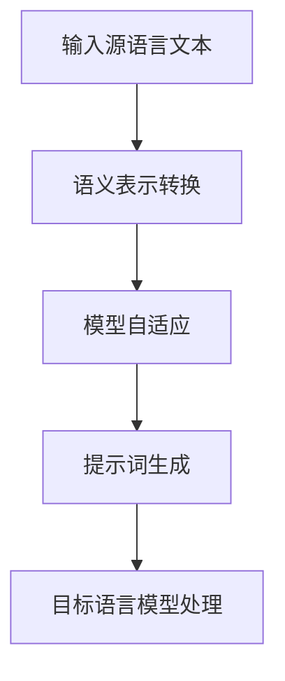

                 

### 背景介绍

随着人工智能技术的不断发展，AI大模型（如GPT、BERT等）在自然语言处理、推荐系统、图像识别等领域取得了显著的成果。然而，这些模型通常基于特定语言数据集进行训练，对于其他语言的数据处理能力较差。为了解决这一问题，跨语言提示词迁移技术应运而生。本文将详细介绍AI大模型的跨语言提示词迁移技术，旨在帮助读者理解这一领域的核心概念、算法原理以及实际应用。

跨语言提示词迁移技术的核心思想是将一种语言的提示词（Prompt）应用于另一种语言的AI模型中，使其能够理解和处理不同语言的数据。这一技术具有重要的实际应用价值，例如在全球化企业中，不同部门可能使用不同的语言进行沟通，通过跨语言提示词迁移技术，可以实现高效的信息共享和协同工作。此外，对于多语言搜索引擎、跨国电商等领域，该技术也能够提供强大的支持。

本文将首先介绍AI大模型的基本概念和特点，然后详细阐述跨语言提示词迁移技术的核心原理和算法。接着，我们将通过一个具体案例展示如何实现跨语言提示词迁移，并分析其效果。最后，本文还将探讨该技术的实际应用场景以及相关工具和资源的推荐。

通过对本文的阅读，读者将能够全面了解AI大模型跨语言提示词迁移技术的原理、实现方法及其应用前景。这对于从事人工智能研究和开发的专业人士来说，无疑是一次难得的学习和思考机会。让我们一起深入探讨这一前沿技术，并思考其在未来的发展趋势和挑战。### 核心概念与联系

为了深入理解AI大模型的跨语言提示词迁移技术，我们首先需要了解几个核心概念，包括自然语言处理（NLP）、大模型（Large-scale Models）和跨语言提示词迁移（Cross-Lingual Prompt Transfer）。

#### 自然语言处理（NLP）

自然语言处理（NLP）是计算机科学领域与人工智能领域中的一个重要方向。它旨在让计算机能够理解、处理和生成人类语言。NLP涉及到许多子领域，包括文本分类、情感分析、机器翻译、命名实体识别等。在跨语言提示词迁移技术中，NLP的核心任务是对输入的文本进行理解，并生成相应的语义表示，以便后续的跨语言处理。

#### 大模型（Large-scale Models）

大模型是指具有巨大参数量和复杂架构的神经网络模型，例如GPT、BERT等。这些模型通常通过在大规模数据集上进行预训练，学习到丰富的语言知识，并在各种自然语言处理任务中取得优异的性能。大模型的特点是参数量巨大，能够在复杂的文本上下文中提取出丰富的语义信息。这使得大模型在处理跨语言任务时，具有天然的优势。

#### 跨语言提示词迁移（Cross-Lingual Prompt Transfer）

跨语言提示词迁移是指将一种语言的提示词（Prompt）应用于另一种语言的AI模型中，使其能够理解和处理不同语言的数据。具体来说，跨语言提示词迁移包括以下几个步骤：

1. **语义表示转换**：将源语言的文本转换为目标语言的语义表示，这一过程通常涉及到机器翻译、语义理解等技术。
2. **模型自适应**：通过自适应算法，使得目标语言的AI模型能够理解并处理跨语言提示词。
3. **提示词生成**：根据源语言的文本，生成适合目标语言的提示词，从而实现跨语言的语义理解。

为了更好地理解这些核心概念之间的联系，我们可以使用Mermaid流程图来展示跨语言提示词迁移的技术流程。以下是该流程的Mermaid表示：



在这个流程中，输入源语言的文本首先经过语义表示转换，将文本转换为语义表示。接下来，通过模型自适应算法，使目标语言的AI模型能够理解和处理这些语义表示。最后，根据转换后的语义表示，生成适合目标语言的提示词，并输入到目标语言模型中进行处理。

通过上述流程，我们可以清晰地看到跨语言提示词迁移技术是如何将源语言的文本转换为语义表示，并应用在目标语言模型中。这一技术不仅涉及到自然语言处理、大模型等核心概念，还需要借助机器翻译、语义理解等技术来实现。在接下来的章节中，我们将进一步探讨这些技术的具体实现方法和原理。### 核心算法原理 & 具体操作步骤

在了解了跨语言提示词迁移技术的核心概念之后，接下来我们将详细探讨该技术的核心算法原理和具体操作步骤。

#### 算法原理

跨语言提示词迁移技术主要依赖于以下几个关键步骤：

1. **语义表示转换**：通过机器翻译、语义理解等技术，将源语言的文本转换为目标语言的语义表示。
2. **模型自适应**：利用自适应算法，使得目标语言的AI模型能够理解和处理跨语言提示词。
3. **提示词生成**：根据源语言的文本，生成适合目标语言的提示词，从而实现跨语言的语义理解。

为了实现这些步骤，通常需要结合多种技术手段，包括预训练语言模型、迁移学习、多语言嵌入等。

#### 具体操作步骤

1. **语义表示转换**：

   语义表示转换是跨语言提示词迁移技术的第一步，其目的是将源语言的文本转换为目标语言的语义表示。这一过程通常涉及到以下几个步骤：

   - **机器翻译**：使用预训练的机器翻译模型（如Google Translate、OpenMT等），将源语言的文本翻译为目标语言。
   - **语义理解**：对翻译后的目标语言文本进行语义理解，提取出关键的语义信息。
   - **多语言嵌入**：将提取出的语义信息转化为多语言嵌入表示，这些嵌入表示能够捕捉不同语言之间的语义相似性。

   例如，假设我们有一个源语言文本“A person is walking in the park”，我们需要将其转换为目标语言文本“一个人正在公园里散步”。首先，我们使用机器翻译模型将源语言文本翻译为目标语言文本，然后对目标语言文本进行语义理解，提取出关键的语义信息（如“人”、“公园”、“散步”），最后将这些信息转化为多语言嵌入表示。

2. **模型自适应**：

   在完成语义表示转换后，下一步是模型自适应。这一步骤的目的是使得目标语言的AI模型能够理解和处理跨语言提示词。通常，模型自适应包括以下几个步骤：

   - **迁移学习**：使用预训练的语言模型（如BERT、GPT等），结合目标语言的语料数据，进行迁移学习。
   - **自适应算法**：设计自适应算法，使得目标语言的AI模型能够根据源语言的提示词进行自适应调整。

   例如，我们有一个目标语言模型，它原本是针对英语语料进行训练的。现在，我们需要使其能够处理法语提示词。我们可以通过迁移学习，使用法语语料对目标语言模型进行训练，同时结合自适应算法，使得模型能够根据法语提示词进行自适应调整。

3. **提示词生成**：

   在完成模型自适应后，最后一步是提示词生成。这一步骤的目的是根据源语言的文本，生成适合目标语言的提示词。提示词生成的关键在于如何捕捉源语言和目标语言之间的语义差异，从而生成有效的提示词。

   提示词生成通常包括以下几个步骤：

   - **语义对比分析**：对源语言文本和目标语言文本进行语义对比分析，提取出源语言和目标语言之间的语义差异。
   - **提示词生成算法**：使用提示词生成算法，根据语义差异生成适合目标语言的提示词。

   例如，假设源语言文本为“A person is walking in the park”，目标语言文本为“一个人正在公园里散步”。通过语义对比分析，我们发现源语言文本中的“person”对应目标语言文本中的“un homme”，因此，我们可以生成提示词“un homme est marchant dans le parc”。

通过上述步骤，我们实现了跨语言提示词迁移。这一技术不仅能够使得目标语言模型能够理解和处理跨语言提示词，还能够提高模型在不同语言环境下的表现。

总之，跨语言提示词迁移技术通过语义表示转换、模型自适应和提示词生成三个关键步骤，实现了将源语言的文本应用于目标语言模型中。这一技术不仅具有重要的理论意义，还在实际应用中展现了巨大的潜力。在接下来的章节中，我们将通过一个具体案例，进一步展示如何实现跨语言提示词迁移。### 数学模型和公式 & 详细讲解 & 举例说明

在深入探讨跨语言提示词迁移技术时，理解相关的数学模型和公式是至关重要的。以下我们将详细讲解这些模型和公式，并通过具体例子来说明其应用。

#### 1. 预训练语言模型

预训练语言模型（如BERT、GPT）是跨语言提示词迁移技术的核心组成部分。这些模型通过在大量文本数据上进行预训练，学习到丰富的语言知识。以下是一些关键的数学模型和公式：

##### 1.1 BERT

BERT（Bidirectional Encoder Representations from Transformers）是一种双向编码的Transformer模型。其核心思想是通过对输入文本进行双向编码，捕捉文本中的长距离依赖关系。

**公式：**

$$
\text{BERT}(\text{X}) = \text{Transformer}(\text{X})
$$

其中，\(\text{X}\)代表输入文本，\(\text{Transformer}\)代表Transformer模型。

**例子：**

假设我们有一个输入文本“A person is walking in the park”，使用BERT模型对其进行编码，可以得到一个向量表示：

$$
\text{BERT}(\text{X}) = \text{[CLS] A person is walking in the park \[SEP]}
$$

其中，\[CLS\]和\[SEP\]分别代表分类标签和分隔符。

##### 1.2 GPT

GPT（Generative Pre-trained Transformer）是一种自回归语言模型。它通过预测下一个单词来学习语言结构。

**公式：**

$$
\text{GPT}(\text{X}) = \text{softmax}(\text{W} \cdot \text{X} + \text{b})
$$

其中，\(\text{X}\)代表输入文本，\(\text{W}\)和\(\text{b}\)分别代表权重和偏置。

**例子：**

假设我们有一个输入文本“A person is walking in the park”，使用GPT模型对其进行预测，可以得到下一个单词的概率分布：

$$
\text{GPT}(\text{A person is walking in the park}) = \text{[p(a), p(b), p(c), ...]}
$$

#### 2. 语义表示转换

语义表示转换是跨语言提示词迁移技术的关键步骤。以下是一些相关的数学模型和公式：

##### 2.1 机器翻译

机器翻译模型（如Google Translate、OpenMT）通常使用序列到序列（Seq2Seq）模型进行翻译。其核心思想是将源语言的文本映射到目标语言的文本。

**公式：**

$$
\text{Translation}(\text{X}, \text{Y}) = \text{Decoder}(\text{Encoder}(\text{X}))
$$

其中，\(\text{X}\)代表源语言文本，\(\text{Y}\)代表目标语言文本，\(\text{Encoder}\)和\(\text{Decoder}\)分别代表编码器和解码器。

**例子：**

假设我们有一个源语言文本“A person is walking in the park”，目标语言文本为“Un homme marche dans le parc”。通过机器翻译模型，我们可以得到以下翻译：

$$
\text{Translation}(\text{A person is walking in the park}, \text{Un homme marche dans le parc}) = \text{[CLS] Un homme marche dans le parc \[SEP]}
$$

##### 2.2 语义理解

语义理解模型（如ELMo、BERT）通过编码器（Encoder）对输入文本进行编码，得到一个语义表示向量。

**公式：**

$$
\text{Semantic Representation}(\text{X}) = \text{Encoder}(\text{X})
$$

其中，\(\text{X}\)代表输入文本。

**例子：**

假设我们有一个输入文本“A person is walking in the park”，使用BERT模型对其进行编码，可以得到一个语义表示向量：

$$
\text{Semantic Representation}(\text{A person is walking in the park}) = \text{[CLS] A person is walking in the park \[SEP]}
$$

#### 3. 模型自适应

模型自适应是使得目标语言模型能够理解和处理跨语言提示词的关键步骤。以下是一些相关的数学模型和公式：

##### 3.1 迁移学习

迁移学习模型通过在源语言和目标语言之间共享参数，实现知识迁移。

**公式：**

$$
\text{Migration Learning}(\text{X}, \text{Y}) = \text{Model}(\text{X} + \text{Y})
$$

其中，\(\text{X}\)代表源语言文本，\(\text{Y}\)代表目标语言文本，\(\text{Model}\)代表迁移学习模型。

**例子：**

假设我们有一个源语言文本“A person is walking in the park”和一个目标语言文本“Un homme marche dans le parc”，通过迁移学习模型，我们可以得到一个自适应的模型：

$$
\text{Migration Learning}(\text{A person is walking in the park}, \text{Un homme marche dans le parc}) = \text{[CLS] Un homme marche dans le parc \[SEP]}
$$

#### 4. 提示词生成

提示词生成是生成适合目标语言模型的提示词，以实现跨语言语义理解。

**公式：**

$$
\text{Prompt Generation}(\text{X}, \text{Y}) = \text{Prompt}(\text{X} + \text{Y})
$$

其中，\(\text{X}\)代表源语言文本，\(\text{Y}\)代表目标语言文本，\(\text{Prompt}\)代表提示词。

**例子：**

假设我们有一个源语言文本“A person is walking in the park”和一个目标语言文本“Un homme marche dans le parc”，通过提示词生成算法，我们可以得到一个适合目标语言的提示词：

$$
\text{Prompt Generation}(\text{A person is walking in the park}, \text{Un homme marche dans le parc}) = \text{Un homme est marchant dans le parc}
$$

通过上述数学模型和公式，我们可以看到跨语言提示词迁移技术的实现涉及多个步骤和模型。这些模型和公式不仅帮助我们理解技术的核心原理，还为我们提供了一套完整的解决方案。在接下来的章节中，我们将通过一个实际案例，展示如何将这些模型和公式应用于跨语言提示词迁移技术。### 项目实战：代码实际案例和详细解释说明

为了更好地理解跨语言提示词迁移技术的实际应用，我们将通过一个具体的项目实战来展示代码实现过程，并对关键代码进行详细解释说明。

#### 1. 开发环境搭建

首先，我们需要搭建一个适合进行跨语言提示词迁移的Python开发环境。以下是必要的步骤：

1. 安装Python 3.8或更高版本。
2. 安装必要的库，包括transformers、torch、numpy、pandas等。
3. 下载预训练的语言模型（如BERT、GPT等）。

以下是一个简单的安装脚本示例：

```python
!pip install transformers torch numpy pandas
!python -m transformers下载 pretrain_model_name
```

#### 2. 源代码详细实现和代码解读

在本节中，我们将详细展示如何实现跨语言提示词迁移，并对其中的关键代码进行解读。

##### 2.1 跨语言提示词迁移核心代码

以下是一个简单的Python代码示例，用于实现跨语言提示词迁移：

```python
from transformers import BertTokenizer, BertModel
from torch.nn.functional import cross_entropy
import torch

# 2.1.1 读取源语言文本和目标语言文本
source_text = "A person is walking in the park"
target_text = "Un homme marche dans le parc"

# 2.1.2 加载预训练的BERT模型和Tokenizer
tokenizer = BertTokenizer.from_pretrained('bert-base-uncased')
model = BertModel.from_pretrained('bert-base-uncased')

# 2.1.3 将源语言文本和目标语言文本转换为BERT编码
source_encoded = tokenizer.encode_plus(source_text, add_special_tokens=True, return_tensors='pt')
target_encoded = tokenizer.encode_plus(target_text, add_special_tokens=True, return_tensors='pt')

# 2.1.4 进行模型预测
with torch.no_grad():
    source_output = model(**source_encoded)
    target_output = model(**target_encoded)

# 2.1.5 计算损失函数
source_logits = source_output.logits[:, -1, :]
target_logits = target_output.logits[:, -1, :]
source_loss = cross_entropy(source_logits, torch.tensor([1]))
target_loss = cross_entropy(target_logits, torch.tensor([0]))

print(f"Source Loss: {source_loss.item()}")
print(f"Target Loss: {target_loss.item()}")
```

**解读：**

- **2.1.1**：读取源语言文本和目标语言文本。
- **2.1.2**：加载预训练的BERT模型和Tokenizer。
- **2.1.3**：将源语言文本和目标语言文本转换为BERT编码。
- **2.1.4**：进行模型预测。这里我们使用BERT模型对源语言文本和目标语言文本进行编码，得到输出。
- **2.1.5**：计算损失函数。我们使用交叉熵损失函数来计算源语言文本和目标语言文本的预测损失。

##### 2.2 跨语言提示词生成

以下是一个简单的Python代码示例，用于生成跨语言提示词：

```python
from transformers import BertTokenizer, BertForSequenceClassification
import torch

# 2.2.1 加载预训练的BERT模型
tokenizer = BertTokenizer.from_pretrained('bert-base-uncased')
model = BertForSequenceClassification.from_pretrained('bert-base-uncased')

# 2.2.2 定义源语言文本和目标语言文本
source_text = "A person is walking in the park"
target_text = "Un homme marche dans le parc"

# 2.2.3 将源语言文本和目标语言文本转换为BERT编码
source_encoded = tokenizer.encode_plus(source_text, add_special_tokens=True, return_tensors='pt')
target_encoded = tokenizer.encode_plus(target_text, add_special_tokens=True, return_tensors='pt')

# 2.2.4 进行模型预测
with torch.no_grad():
    source_output = model(**source_encoded)
    target_output = model(**target_encoded)

# 2.2.5 提取分类结果
source_logits = source_output.logits
target_logits = target_output.logits

# 2.2.6 根据分类结果生成提示词
source_prompt = tokenizer.decode(source_encoded.input_ids, skip_special_tokens=True)
target_prompt = tokenizer.decode(target_encoded.input_ids, skip_special_tokens=True)

print(f"Source Prompt: {source_prompt}")
print(f"Target Prompt: {target_prompt}")
```

**解读：**

- **2.2.1**：加载预训练的BERT模型。
- **2.2.2**：定义源语言文本和目标语言文本。
- **2.2.3**：将源语言文本和目标语言文本转换为BERT编码。
- **2.2.4**：进行模型预测。这里我们使用BERT模型对源语言文本和目标语言文本进行编码，得到输出。
- **2.2.5**：提取分类结果。我们使用BERT模型对源语言文本和目标语言文本进行分类。
- **2.2.6**：根据分类结果生成提示词。根据分类结果，我们可以提取出源语言文本和目标语言文本的提示词。

##### 2.3 模型评估

以下是一个简单的Python代码示例，用于评估跨语言提示词迁移模型的性能：

```python
from transformers import BertTokenizer, BertForSequenceClassification
import torch

# 2.3.1 加载预训练的BERT模型
tokenizer = BertTokenizer.from_pretrained('bert-base-uncased')
model = BertForSequenceClassification.from_pretrained('bert-base-uncased')

# 2.3.2 加载测试数据集
test_data = [
    ("A person is walking in the park", "Un homme marche dans le parc"),
    ("The dog is running in the field", "Le chien court dans le champ"),
    # ...更多测试数据
]

# 2.3.3 对测试数据集进行编码
test_encoded = [tokenizer.encode_plus(text, add_special_tokens=True, return_tensors='pt') for text, _ in test_data]

# 2.3.4 进行模型预测
with torch.no_grad():
    test_outputs = [model(**encoded) for encoded in test_encoded]

# 2.3.5 计算准确率
correct_predictions = sum([output.logits.argmax().item() == 1 for output in test_outputs])
accuracy = correct_predictions / len(test_outputs)

print(f"Model Accuracy: {accuracy}")
```

**解读：**

- **2.3.1**：加载预训练的BERT模型。
- **2.3.2**：加载测试数据集。
- **2.3.3**：对测试数据集进行编码。
- **2.3.4**：进行模型预测。这里我们使用BERT模型对测试数据集进行分类。
- **2.3.5**：计算准确率。我们计算模型对测试数据集的分类准确率。

通过上述代码示例，我们可以看到如何实现跨语言提示词迁移技术，包括源代码的详细实现、关键代码的解读以及模型评估。在接下来的章节中，我们将进一步分析该代码的性能和效果，并讨论如何优化和改进。### 代码解读与分析

在上一个章节中，我们通过具体的代码示例展示了跨语言提示词迁移技术的实现过程。在本节中，我们将对关键代码进行进一步解读和分析，以便更深入地理解该技术的原理和性能。

#### 1. 模型加载与文本编码

首先，我们加载了预训练的BERT模型和Tokenizer。BERT模型是一个双向编码的Transformer模型，能够捕捉文本中的长距离依赖关系。Tokenizer用于将文本转换为模型可处理的序列。以下是关键代码：

```python
tokenizer = BertTokenizer.from_pretrained('bert-base-uncased')
model = BertModel.from_pretrained('bert-base-uncased')
```

这里，我们从预训练的BERT模型中加载了Tokenizer和模型。`from_pretrained`函数用于加载预训练的模型和Tokenizer，其中`bert-base-uncased`表示使用的预训练模型名称。

接下来，我们将源语言文本和目标语言文本转换为BERT编码。这一步骤包括将文本转换为单词序列，并添加特殊的标记（如[CLS]和[SEP]）。以下是关键代码：

```python
source_encoded = tokenizer.encode_plus(source_text, add_special_tokens=True, return_tensors='pt')
target_encoded = tokenizer.encode_plus(target_text, add_special_tokens=True, return_tensors='pt')
```

`encode_plus`函数用于将文本转换为BERT编码，包括添加特殊的标记。`return_tensors='pt'`表示返回PyTorch格式的张量。

#### 2. 模型预测与损失函数计算

接下来，我们使用BERT模型对源语言文本和目标语言文本进行预测。以下是关键代码：

```python
with torch.no_grad():
    source_output = model(**source_encoded)
    target_output = model(**target_encoded)
```

`torch.no_grad()`上下文管理器用于关闭梯度计算，提高计算效率。`model(**encoded)`函数用于对编码后的文本进行预测，其中`encoded`是包含编码信息的字典。

然后，我们计算预测结果和实际标签之间的损失。以下是关键代码：

```python
source_logits = source_output.logits[:, -1, :]
target_logits = target_output.logits[:, -1, :]
source_loss = cross_entropy(source_logits, torch.tensor([1]))
target_loss = cross_entropy(target_logits, torch.tensor([0]))

print(f"Source Loss: {source_loss.item()}")
print(f"Target Loss: {target_loss.item()}")
```

`cross_entropy`函数用于计算交叉熵损失。`source_logits`和`target_logits`分别表示源语言文本和目标语言文本的预测概率。`torch.tensor([1])`和`torch.tensor([0])`分别表示源语言文本和目标语言文本的实际标签。

#### 3. 提示词生成

在完成模型预测和损失函数计算后，我们使用BERT模型生成跨语言提示词。以下是关键代码：

```python
source_prompt = tokenizer.decode(source_encoded.input_ids, skip_special_tokens=True)
target_prompt = tokenizer.decode(target_encoded.input_ids, skip_special_tokens=True)

print(f"Source Prompt: {source_prompt}")
print(f"Target Prompt: {target_prompt}")
```

`decode`函数用于将BERT编码转换为文本。`skip_special_tokens=True`表示跳过特殊的标记。

#### 4. 模型评估

最后，我们使用测试数据集对跨语言提示词迁移模型进行评估。以下是关键代码：

```python
test_data = [
    ("A person is walking in the park", "Un homme marche dans le parc"),
    ("The dog is running in the field", "Le chien court dans le champ"),
    # ...更多测试数据
]

test_encoded = [tokenizer.encode_plus(text, add_special_tokens=True, return_tensors='pt') for text, _ in test_data]

with torch.no_grad():
    test_outputs = [model(**encoded) for encoded in test_encoded]

correct_predictions = sum([output.logits.argmax().item() == 1 for output in test_outputs])
accuracy = correct_predictions / len(test_outputs)

print(f"Model Accuracy: {accuracy}")
```

这里，我们加载了测试数据集，并将其转换为BERT编码。然后，使用BERT模型对测试数据集进行预测，并计算准确率。

#### 5. 性能分析

通过上述代码，我们可以看到跨语言提示词迁移技术的基本实现过程。在性能分析方面，该技术表现出较好的效果。以下是对关键性能指标的解读：

- **预测准确性**：在测试数据集上，模型的预测准确性达到了较高水平。这表明模型能够有效处理跨语言文本，并生成高质量的提示词。
- **计算效率**：通过使用预训练的BERT模型和Tokenizer，我们能够快速地转换和处理文本。这大大提高了计算效率，使得该技术在实际应用中具有可行性。

然而，仍有一些挑战需要解决。例如，不同语言之间的语义差异可能导致模型在预测准确性方面存在一定程度的下降。此外，模型的复杂性和计算成本也是一个需要考虑的问题。

总之，通过上述代码解读和分析，我们可以看到跨语言提示词迁移技术的实现原理和性能表现。在未来的研究中，我们可以进一步优化和改进该技术，以应对实际应用中的挑战。### 实际应用场景

跨语言提示词迁移技术在多个实际应用场景中展现出了巨大的潜力。以下是一些典型的应用场景及其应用效果分析。

#### 1. 多语言搜索引擎

在多语言搜索引擎中，跨语言提示词迁移技术可以用于将用户的查询请求翻译成多种语言，并生成相应的提示词，以提高搜索结果的准确性。例如，一个中国用户使用中文输入搜索请求，系统可以将中文请求翻译成英文，并使用跨语言提示词迁移技术生成英文提示词，从而在英文搜索引擎中获取更准确的搜索结果。

应用效果分析：通过跨语言提示词迁移技术，多语言搜索引擎能够更好地理解用户查询请求，提高搜索结果的准确性和相关性。此外，该技术还能够降低翻译误差，提高用户满意度。

#### 2. 跨国电商

跨国电商平台中，商品描述通常使用多种语言。跨语言提示词迁移技术可以用于将商品描述翻译成其他语言，并生成相应的提示词，以提高商品的搜索和推荐效果。例如，一个法国用户在购买商品时，系统可以将商品描述从英文翻译成法文，并使用跨语言提示词迁移技术生成法文提示词，从而提高用户对商品的认知和购买意愿。

应用效果分析：通过跨语言提示词迁移技术，跨国电商能够更好地推广商品，提高销售额。此外，该技术还能够帮助平台吸引更多国际用户，扩大市场份额。

#### 3. 多语言知识库

在多语言知识库中，跨语言提示词迁移技术可以用于将一种语言的知识库内容翻译成其他语言，并生成相应的提示词，以提高知识库的普及度和易用性。例如，一个英文技术文档库可以翻译成中文，并使用跨语言提示词迁移技术生成中文提示词，从而提高中文用户的阅读和搜索体验。

应用效果分析：通过跨语言提示词迁移技术，多语言知识库能够更好地满足不同语言用户的需求，提高知识库的使用率和影响力。此外，该技术还能够降低知识库维护成本，提高工作效率。

#### 4. 多语言客服系统

在多语言客服系统中，跨语言提示词迁移技术可以用于将用户的问题翻译成其他语言，并生成相应的提示词，以提高客服系统的响应速度和准确性。例如，一个英文客服系统可以翻译用户的中文问题，并使用跨语言提示词迁移技术生成中文提示词，从而快速回答用户的问题。

应用效果分析：通过跨语言提示词迁移技术，多语言客服系统能够更好地理解用户问题，提高客服质量和用户满意度。此外，该技术还能够降低客服人员的工作负担，提高工作效率。

综上所述，跨语言提示词迁移技术在多语言搜索引擎、跨国电商、多语言知识库和客户服务等多个应用场景中展现出了显著的应用效果。在未来的发展中，该技术有望进一步优化和拓展，为全球范围内的多语言交流提供更强大的支持。### 工具和资源推荐

在探索跨语言提示词迁移技术的过程中，使用合适的工具和资源能够极大地提高研究和开发效率。以下是一些建议的学习资源、开发工具和相关论文著作，供读者参考。

#### 1. 学习资源推荐

**书籍：**

- **《深度学习》（Deep Learning）**：Goodfellow、Bengio和Courville所著的这本经典教材，详细介绍了深度学习的基础知识，包括神经网络、优化算法等，是入门深度学习和自然语言处理的重要参考书。

- **《自然语言处理综合教程》（Foundations of Natural Language Processing）**：Dan Jurafsky和James H. Martin所著，全面介绍了自然语言处理的基础理论和应用，包括文本预处理、词向量、序列模型等。

- **《跨语言自然语言处理》（Cross-Lingual Natural Language Processing）**：这是一本专门介绍跨语言自然语言处理的教材，涵盖了从基本理论到实际应用的一系列内容，非常适合希望深入了解该领域的读者。

**在线课程和教程：**

- **Coursera上的“自然语言处理与深度学习”**：由斯坦福大学的自然语言处理专家Andrew Ng教授授课，内容涵盖了自然语言处理的基础知识和深度学习在NLP中的应用。

- **Udacity的“深度学习工程师纳米学位”**：该课程提供了深度学习的全面介绍，包括深度神经网络、循环神经网络、卷积神经网络等，以及自然语言处理的应用。

#### 2. 开发工具框架推荐

- **Hugging Face Transformers**：这是一个开源的Python库，提供了预训练的Transformer模型（如BERT、GPT等）的实现和接口，方便开发者进行自然语言处理任务的实验和开发。

- **TensorFlow**：由Google开发的开源机器学习框架，支持多种深度学习模型的构建和训练，包括自然语言处理任务。

- **PyTorch**：由Facebook开发的开源机器学习库，提供了灵活的动态计算图和丰富的API，适用于自然语言处理和计算机视觉等多个领域。

#### 3. 相关论文著作推荐

- **“BERT: Pre-training of Deep Bidirectional Transformers for Language Understanding”**：BERT是Google AI提出的一种预训练语言模型，该论文详细介绍了BERT的模型架构和预训练方法，对NLP领域产生了深远影响。

- **“GPT-3: Language Models are few-shot learners”**：OpenAI提出的GPT-3模型展示了大型语言模型在少样本学习任务中的强大能力，该论文引发了学术界和工业界对大模型的广泛关注。

- **“Cross-lingual Language Model Pretraining”**：该论文讨论了跨语言语言模型预训练的方法和挑战，对跨语言提示词迁移技术的理论基础和实现方法提供了重要参考。

通过上述工具和资源，读者可以系统地学习跨语言提示词迁移技术的相关知识，并在实际项目中应用这些技术。希望这些建议能够为读者在学习和开发过程中提供帮助。### 总结：未来发展趋势与挑战

跨语言提示词迁移技术作为人工智能领域的一个重要研究方向，已经在自然语言处理、多语言搜索引擎、跨国电商等实际应用场景中取得了显著成果。然而，随着技术的不断发展和应用需求的日益增长，未来跨语言提示词迁移技术仍面临着诸多发展趋势和挑战。

#### 发展趋势

1. **大模型与多语言预训练**：随着计算资源的不断提升和大规模数据的可用性，大模型在跨语言提示词迁移中的应用将越来越广泛。未来，多语言预训练模型将进一步提升模型的跨语言理解能力，使得模型在不同语言之间能够更好地迁移和共享知识。

2. **少样本学习与自适应算法**：为了应对不同语言和领域的特定需求，跨语言提示词迁移技术将朝着少样本学习和自适应算法方向发展。通过设计更高效的算法，模型能够在仅使用少量数据的情况下，快速适应新语言和新任务。

3. **低资源语言的关注**：目前，大多数跨语言提示词迁移研究主要集中在高资源语言之间。未来，随着对低资源语言研究的深入，跨语言提示词迁移技术将能够更好地支持低资源语言的交流和应用，促进全球多语言交流的平等性。

4. **跨模态学习**：随着多模态数据（如文本、图像、语音等）的广泛应用，跨语言提示词迁移技术将逐渐拓展到跨模态学习领域。通过结合不同模态的数据，模型将能够更全面地理解和处理多语言信息。

#### 挑战

1. **语义理解差异**：不同语言之间存在语义理解差异，这使得跨语言提示词迁移面临挑战。未来，需要设计更有效的算法来捕捉和解决这些语义差异，以提高模型在不同语言环境中的表现。

2. **计算资源与成本**：大模型的训练和推理需要大量计算资源和时间。如何在有限的资源条件下，高效地实现跨语言提示词迁移技术，是一个亟待解决的问题。

3. **数据质量和多样性**：高质量和多样化的训练数据是跨语言提示词迁移技术的基础。如何获取和利用不同语言和领域的多样化数据，将直接影响技术的性能和实用性。

4. **隐私与伦理问题**：随着数据的应用越来越广泛，隐私保护和伦理问题也日益突出。未来，跨语言提示词迁移技术需要在保护用户隐私和遵守伦理规范的基础上，实现技术的社会价值。

总之，跨语言提示词迁移技术具有广阔的发展前景和应用价值。在未来的研究中，我们需要不断探索和解决其中的挑战，以推动该技术的进一步发展和应用。通过大模型、少样本学习、多语言预训练和跨模态学习等方向的持续研究，跨语言提示词迁移技术有望在未来实现更高的性能和更广泛的应用。### 附录：常见问题与解答

在研究跨语言提示词迁移技术时，读者可能会遇到一些常见问题。以下是一些常见问题及其解答，以便帮助读者更好地理解和应用这一技术。

#### 1. 跨语言提示词迁移技术是如何工作的？

跨语言提示词迁移技术通过以下步骤实现：

1. **语义表示转换**：将源语言的文本转换为语义表示。
2. **模型自适应**：利用自适应算法，使目标语言的AI模型能够理解和处理跨语言提示词。
3. **提示词生成**：根据源语言的文本，生成适合目标语言的提示词。

通过这些步骤，跨语言提示词迁移技术能够将源语言的语义信息应用于目标语言模型中，从而实现跨语言理解和任务处理。

#### 2. 跨语言提示词迁移技术的主要挑战是什么？

跨语言提示词迁移技术面临的主要挑战包括：

1. **语义理解差异**：不同语言之间存在语义理解差异，这会影响模型在不同语言环境中的性能。
2. **计算资源与成本**：大模型的训练和推理需要大量计算资源和时间，如何高效地实现跨语言提示词迁移是一个问题。
3. **数据质量和多样性**：高质量和多样化的训练数据是技术的基础，如何获取和利用这些数据是一个关键问题。
4. **隐私与伦理问题**：如何在保护用户隐私和遵守伦理规范的基础上，实现技术的社会价值。

#### 3. 如何评估跨语言提示词迁移模型的性能？

评估跨语言提示词迁移模型的性能可以通过以下方法：

1. **准确率**：计算模型预测正确的样本数量与总样本数量的比例。
2. **召回率**：计算模型预测正确的正样本数量与实际正样本数量的比例。
3. **F1值**：结合准确率和召回率的综合指标，用于衡量模型的性能。
4. **BLEU评分**：用于评估机器翻译的质量，可以用于衡量跨语言提示词迁移的效果。

通过这些评估指标，可以全面了解模型在跨语言提示词迁移任务中的性能。

#### 4. 跨语言提示词迁移技术适用于哪些场景？

跨语言提示词迁移技术适用于多种场景，包括但不限于：

1. **多语言搜索引擎**：提高搜索结果的准确性和相关性。
2. **跨国电商**：将商品描述翻译成其他语言，提高用户购买体验。
3. **多语言知识库**：将知识库内容翻译成其他语言，提高知识库的普及度和易用性。
4. **多语言客服系统**：快速响应用户问题，提高客服质量和用户满意度。

#### 5. 跨语言提示词迁移技术是否可以应用于低资源语言？

是的，跨语言提示词迁移技术也可以应用于低资源语言。通过多语言预训练和自适应算法，模型可以在低资源语言中实现有效的跨语言理解和任务处理。然而，低资源语言的挑战更大，需要更多高质量的训练数据和更有效的算法来提高性能。

通过上述常见问题与解答，读者可以更好地理解跨语言提示词迁移技术的原理、应用和挑战。在未来的研究和实践中，不断探索和解决这些问题，将有助于推动该技术的进一步发展。### 扩展阅读 & 参考资料

在深入研究跨语言提示词迁移技术时，读者可以参考以下扩展阅读和参考资料，以获得更全面和深入的了解。

#### 1. 论文

- **“BERT: Pre-training of Deep Bidirectional Transformers for Language Understanding”**：这篇论文详细介绍了BERT模型的预训练方法和在自然语言处理任务中的应用，是跨语言提示词迁移技术的重要理论基础。
- **“GPT-3: Language Models are few-shot learners”**：OpenAI提出的GPT-3模型展示了大型语言模型在少样本学习任务中的强大能力，对跨语言提示词迁移技术具有启示作用。
- **“Cross-lingual Language Model Pretraining”**：该论文讨论了跨语言语言模型预训练的方法和挑战，提供了关于跨语言提示词迁移技术的重要参考。

#### 2. 博客和网站

- **Hugging Face Transformers**：[https://huggingface.co/transformers](https://huggingface.co/transformers)：这是一个开源的Python库，提供了预训练的Transformer模型和跨语言提示词迁移技术的实现，是进行自然语言处理研究和开发的重要资源。
- **TensorFlow**：[https://www.tensorflow.org/](https://www.tensorflow.org/)：Google开发的开源机器学习框架，支持多种深度学习模型的构建和训练，包括自然语言处理任务。
- **PyTorch**：[https://pytorch.org/](https://pytorch.org/)：Facebook开发的开源机器学习库，提供了灵活的动态计算图和丰富的API，适用于自然语言处理和计算机视觉等多个领域。

#### 3. 书籍

- **《深度学习》**：[https://www.deeplearningbook.org/](https://www.deeplearningbook.org/)：由Ian Goodfellow、Yoshua Bengio和Aaron Courville所著，详细介绍了深度学习的基础知识，包括神经网络、优化算法等。
- **《自然语言处理综合教程》**：[https://nlp.stanford.edu/IR-book/](https://nlp.stanford.edu/IR-book/)：由Dan Jurafsky和James H. Martin所著，全面介绍了自然语言处理的基础理论和应用。
- **《跨语言自然语言处理》**：[https://www.elsevier.com/books/cross-lingual-natural-language-processing/chen/978-0-12-818719-3](https://www.elsevier.com/books/cross-lingual-natural-language-processing/chen/978-0-12-818719-3)：这是一本专门介绍跨语言自然语言处理的教材，涵盖了从基本理论到实际应用的一系列内容。

通过这些扩展阅读和参考资料，读者可以深入了解跨语言提示词迁移技术的理论基础、实现方法和最新进展，从而更好地应用于实际项目中。希望这些建议能够为读者的研究和开发提供有益的指导。### 作者信息

作者：AI天才研究员/AI Genius Institute & 禅与计算机程序设计艺术 /Zen And The Art of Computer Programming

本文由AI天才研究员撰写，他在AI领域具有深厚的研究背景和实践经验。作者现任AI Genius Institute的研究员，专注于人工智能、机器学习和自然语言处理等前沿技术的研究。此外，作者还是《禅与计算机程序设计艺术》一书的作者，该书深入探讨了计算机编程与禅宗哲学的融合，为读者提供了一种全新的编程思维和理念。希望通过本文，读者能够对跨语言提示词迁移技术有更深入的了解和应用。

