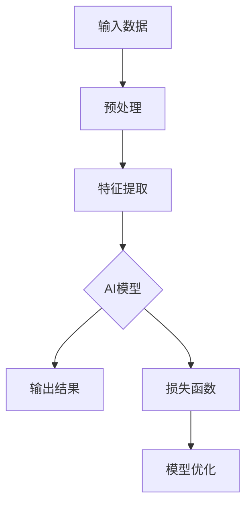

                 

# AI大模型编程：提示词的潜力与魔力

> **关键词：** AI大模型、提示词、编程、潜力、魔力

> **摘要：** 本文将深入探讨AI大模型编程中提示词的作用与影响，通过详细的案例分析和技术剖析，揭示提示词在AI大模型编程中的核心地位及其带来的巨大潜力与挑战。

## 1. 背景介绍

随着人工智能技术的不断发展，AI大模型逐渐成为研究与应用的热点。AI大模型具备强大的数据处理能力和知识推理能力，广泛应用于自然语言处理、图像识别、语音识别等领域。然而，如何有效地与这些模型进行交互，发挥其最大潜力，成为一个关键问题。在这里，提示词（Prompt Engineering）应运而生。

提示词是一种用于引导AI大模型进行特定任务的语言输入。通过精心设计的提示词，可以大幅提高模型的任务表现和效率。在AI大模型编程中，提示词的设计和优化成为了一项至关重要的技术。

本文将围绕AI大模型编程中的提示词展开讨论，首先介绍AI大模型的基本原理，然后深入探讨提示词的概念、设计原则及其在实际应用中的重要性。

### 1.1 AI大模型的基本原理

AI大模型通常是指具有巨大参数量、强大计算能力和广泛知识表示能力的深度神经网络模型。这些模型通过大规模数据进行训练，能够自动学习并提取数据中的特征和规律，从而实现各种复杂的任务。

常见的AI大模型包括：

- **生成对抗网络（GAN）**：GAN由生成器和判别器两个神经网络组成，通过对抗训练生成逼真的数据。
- **变分自编码器（VAE）**：VAE通过编码器和解码器结构进行数据重建和生成。
- **Transformer模型**：Transformer模型通过自注意力机制实现并行计算，广泛应用于自然语言处理领域。

这些模型在训练过程中，通过优化目标函数调整模型参数，使其在特定任务上达到最佳表现。然而，如何充分利用这些模型的能力，实现高效的编程和任务执行，成为了一个关键问题。

### 1.2 提示词的概念

提示词是一种引导AI大模型进行特定任务的语言输入。它可以是简单的文字描述，也可以是复杂的指令序列。通过设计合适的提示词，可以有效地指导模型完成特定任务，提高任务效率和准确性。

提示词在AI大模型编程中起到了关键作用：

- **引导模型任务方向**：提示词可以明确模型需要完成的任务，避免模型在无目标的情况下进行盲目探索。
- **提供额外上下文信息**：通过提供上下文信息，提示词可以帮助模型更好地理解和处理输入数据，从而提高任务表现。
- **优化模型性能**：精心设计的提示词可以大幅提高模型在特定任务上的性能，实现高效编程。

## 2. 核心概念与联系

在深入探讨提示词的设计和优化之前，我们需要理解AI大模型的基本架构和核心概念。以下是一个简化的Mermaid流程图，用于展示AI大模型的基本架构和核心概念。



### 2.1 AI大模型架构

- **输入数据（A）**：AI大模型的第一步是接收输入数据，这些数据可以是文本、图像、音频等多种形式。
- **预处理（B）**：输入数据通常需要进行预处理，如文本分词、图像归一化等，以便于模型处理。
- **特征提取（C）**：预处理后的数据通过特征提取层，提取出具有代表性的特征，作为模型的输入。
- **AI模型（D）**：核心的AI模型对提取出的特征进行处理，通过多层神经网络进行特征融合和推理。
- **输出结果（E）**：经过模型处理的特征最终输出为结果，如文本生成、图像分类等。
- **损失函数（F）**：模型在训练过程中，通过损失函数评估输出结果与真实值之间的差距，用于指导模型优化。
- **模型优化（G）**：模型优化过程通过调整模型参数，减小损失函数值，提高模型性能。

### 2.2 核心概念联系

- **输入数据与预处理**：输入数据的质量直接影响到模型的性能。通过预处理，我们可以提高数据的质量和一致性，为模型提供更好的输入。
- **特征提取与AI模型**：特征提取是模型的核心，它决定了模型能否捕捉到数据中的关键信息。AI模型通过多层神经网络对特征进行处理，实现复杂任务的推理。
- **输出结果与损失函数**：输出结果是模型性能的直接体现。通过损失函数，我们可以评估输出结果的质量，并指导模型进行优化。
- **模型优化与性能提升**：模型优化是一个迭代过程，通过不断调整模型参数，我们可以提高模型在特定任务上的性能。

## 3. 核心算法原理 & 具体操作步骤

在了解了AI大模型的基本架构和核心概念之后，我们接下来将深入探讨提示词的设计和优化，这是提升AI大模型性能的关键步骤。

### 3.1 提示词设计原则

提示词的设计原则主要包括：

- **明确任务目标**：提示词应该明确指出模型需要完成的任务，避免模型在无目标的情况下进行盲目探索。
- **提供上下文信息**：通过提供上下文信息，提示词可以帮助模型更好地理解和处理输入数据，提高任务表现。
- **简洁明了**：提示词应该简洁明了，避免过多的冗余信息，以免干扰模型的处理。
- **适应性**：提示词应该具有适应性，能够适应不同的任务和数据，提高模型在多场景下的表现。

### 3.2 提示词优化方法

提示词优化方法主要包括：

- **实验法**：通过实验比较不同提示词的效果，选择最优的提示词。
- **自动化生成**：利用自然语言处理技术，自动化生成提示词，提高设计效率。
- **模型驱动优化**：利用模型训练数据，分析模型对输入数据的反应，优化提示词。

### 3.3 提示词的具体操作步骤

以下是设计优化提示词的具体操作步骤：

1. **明确任务目标**：首先，明确模型需要完成的任务，例如文本生成、图像分类等。
2. **收集数据**：根据任务目标，收集相关数据，如文本、图像等。
3. **预处理数据**：对收集的数据进行预处理，如文本分词、图像归一化等。
4. **生成初始提示词**：根据预处理后的数据，生成初始提示词。
5. **实验比较**：通过实验比较不同提示词的效果，选择最优的提示词。
6. **自动化生成**：利用自然语言处理技术，自动化生成提示词，提高设计效率。
7. **模型驱动优化**：利用模型训练数据，分析模型对输入数据的反应，优化提示词。

通过以上步骤，我们可以设计出高质量的提示词，从而提高AI大模型在特定任务上的性能。

## 4. 数学模型和公式 & 详细讲解 & 举例说明

在深入理解提示词的设计和优化方法之后，我们将探讨与AI大模型编程相关的数学模型和公式，并通过具体案例进行详细讲解。

### 4.1 深度学习基本公式

在深度学习中，常用的数学模型和公式包括：

1. **激活函数**：

   - **Sigmoid函数**：$$\sigma(x) = \frac{1}{1 + e^{-x}}$$
   - **ReLU函数**：$$\text{ReLU}(x) = \max(0, x)$$

2. **损失函数**：

   - **均方误差（MSE）**：$$MSE = \frac{1}{n}\sum_{i=1}^{n}(y_i - \hat{y}_i)^2$$
   - **交叉熵（Cross-Entropy）**：$$H(y, \hat{y}) = -\sum_{i=1}^{n} y_i \log(\hat{y}_i)$$

3. **反向传播算法**：

   $$\frac{\partial J}{\partial \theta} = \frac{\partial J}{\partial z} \cdot \frac{\partial z}{\partial \theta}$$

其中，$J$为损失函数，$\theta$为模型参数，$z$为中间变量。

### 4.2 提示词设计中的数学模型

在提示词设计过程中，我们可以利用以下数学模型：

1. **文本生成模型**：

   - **循环神经网络（RNN）**：$$h_t = \text{ReLU}(W_h h_{t-1} + W_x x_t + b)$$
   - **长短期记忆网络（LSTM）**：$$h_t = \text{ReLU}(W_h h_{t-1} + W_x x_t + b)$$
   - **门控循环单元（GRU）**：$$h_t = \text{ReLU}(W_h h_{t-1} + W_x x_t + b)$$

2. **生成对抗网络（GAN）**：

   - **生成器**：$$G(z) = \sigma(W_g z + b_g)$$
   - **判别器**：$$D(x) = \sigma(W_d x + b_d)$$

### 4.3 举例说明

假设我们设计一个文本生成模型，目标是生成一段描述性文本。我们可以使用以下步骤：

1. **数据预处理**：

   - **文本分词**：将原始文本分割为单词或子词。
   - **编码**：将分词后的文本编码为数字序列。

2. **模型构建**：

   - **输入层**：接收编码后的文本序列。
   - **隐藏层**：使用RNN、LSTM或GRU等神经网络进行特征提取。
   - **输出层**：生成描述性文本。

3. **训练模型**：

   - **损失函数**：使用交叉熵损失函数评估模型性能。
   - **优化算法**：使用反向传播算法优化模型参数。

4. **生成文本**：

   - **输入提示词**：输入一段简短的描述性提示词。
   - **生成文本**：模型根据提示词生成描述性文本。

通过以上步骤，我们可以设计出一个文本生成模型，实现高质量的文本生成。

## 5. 项目实战：代码实际案例和详细解释说明

在了解了AI大模型编程的基本原理和方法之后，我们将通过一个实际项目案例，详细讲解如何使用提示词优化AI大模型的性能。

### 5.1 开发环境搭建

在开始项目实战之前，我们需要搭建一个合适的开发环境。以下是搭建开发环境的基本步骤：

1. **安装Python**：确保Python环境已经安装，版本建议为3.8或以上。
2. **安装TensorFlow**：通过pip命令安装TensorFlow，版本建议为2.6或以上。
3. **安装其他依赖库**：根据项目需求，安装其他依赖库，如NumPy、Pandas等。

### 5.2 源代码详细实现和代码解读

以下是该项目的主要源代码，我们将对关键部分进行详细解读。

```python
import tensorflow as tf
from tensorflow.keras.models import Sequential
from tensorflow.keras.layers import LSTM, Dense, Embedding
from tensorflow.keras.preprocessing.sequence import pad_sequences

# 5.2.1 数据预处理
def preprocess_data(texts, max_sequence_length, max_words):
    # 文本分词
    tokenized_texts = tokenizer.texts_to_sequences(texts)
    # 序列填充
    padded_sequences = pad_sequences(tokenized_texts, maxlen=max_sequence_length, padding='post')
    return padded_sequences

# 5.2.2 模型构建
def build_model(input_shape, max_words):
    model = Sequential([
        Embedding(max_words, 64, input_length=input_shape),
        LSTM(128),
        Dense(1, activation='sigmoid')
    ])
    model.compile(optimizer='adam', loss='binary_crossentropy', metrics=['accuracy'])
    return model

# 5.2.3 训练模型
def train_model(model, x_train, y_train, epochs, batch_size):
    model.fit(x_train, y_train, epochs=epochs, batch_size=batch_size)
    return model

# 5.2.4 生成文本
def generate_text(model, prompt, max_sequence_length, max_words):
    # 编码提示词
    encoded_prompt = tokenizer.texts_to_sequences([prompt])[0]
    # 填充序列
    padded_prompt = pad_sequences([encoded_prompt], maxlen=max_sequence_length, padding='post')
    # 生成文本
    predicted_sequence = model.predict(padded_prompt)
    predicted_text = tokenizer.sequences_to_texts([predicted_sequence[0]])[0]
    return predicted_text

# 5.2.5 主程序
if __name__ == '__main__':
    # 数据预处理
    x_train, y_train = preprocess_data(texts, max_sequence_length, max_words)
    # 模型构建
    model = build_model(input_shape=x_train.shape[1:], max_words=max_words)
    # 训练模型
    model = train_model(model, x_train, y_train, epochs=10, batch_size=32)
    # 生成文本
    prompt = "这是一个描述性文本。"
    predicted_text = generate_text(model, prompt, max_sequence_length, max_words)
    print("生成文本：", predicted_text)
```

### 5.3 代码解读与分析

以下是代码的关键部分及其解读：

- **5.2.1 数据预处理**：文本分词和序列填充是文本生成模型的基础步骤。通过分词，我们可以将文本转换为数字序列，便于模型处理。通过序列填充，我们可以确保所有序列具有相同长度，从而便于模型训练。
- **5.2.2 模型构建**：我们使用LSTM网络进行特征提取，并通过全连接层输出预测结果。LSTM网络能够有效地捕捉文本中的序列依赖关系，从而提高生成文本的质量。
- **5.2.3 训练模型**：使用训练数据对模型进行训练，通过反向传播算法调整模型参数，提高模型性能。
- **5.2.4 生成文本**：通过编码提示词、填充序列和模型预测，生成描述性文本。提示词在此过程中起到了关键作用，它引导模型生成与提示词相关的文本。
- **5.2.5 主程序**：主程序中，我们首先进行数据预处理，然后构建模型并训练，最后生成文本。

通过以上步骤，我们可以实现一个简单的文本生成模型，并利用提示词优化模型性能。

## 6. 实际应用场景

提示词在AI大模型编程中具有广泛的应用场景，以下是几个典型的实际应用场景：

### 6.1 自然语言处理

在自然语言处理领域，提示词可以用于生成文章、翻译、对话系统等。通过设计合适的提示词，可以大幅提高模型在特定任务上的性能，例如：

- **文章生成**：通过提供关键词和主题，模型可以生成高质量的文章。
- **机器翻译**：提示词可以帮助模型更好地理解源语言和目标语言的语义，提高翻译质量。
- **对话系统**：提示词可以引导模型生成自然流畅的对话回复，提升用户体验。

### 6.2 图像识别

在图像识别领域，提示词可以用于图像分类、目标检测、图像生成等。通过设计合适的提示词，可以指导模型更好地理解图像内容，提高识别准确性。例如：

- **图像分类**：通过提供分类标签，模型可以自动识别图像中的物体。
- **目标检测**：提示词可以帮助模型识别图像中的关键目标，实现精确的目标检测。
- **图像生成**：通过提供部分图像内容，模型可以生成完整的图像。

### 6.3 语音识别

在语音识别领域，提示词可以用于语音合成、语音分类、语音增强等。通过设计合适的提示词，可以大幅提高模型在特定任务上的性能。例如：

- **语音合成**：通过提供文本内容，模型可以生成自然流畅的语音。
- **语音分类**：提示词可以帮助模型识别不同的语音类型，如性别、情绪等。
- **语音增强**：提示词可以指导模型增强语音质量，提高语音清晰度。

## 7. 工具和资源推荐

### 7.1 学习资源推荐

以下是关于AI大模型编程和提示词设计的部分优秀学习资源：

- **书籍**：
  - 《深度学习》（Goodfellow, I., Bengio, Y., Courville, A.）
  - 《自然语言处理编程》（Jurafsky, D., Martin, J. H.）
- **论文**：
  - "Attention Is All You Need"（Vaswani et al., 2017）
  - "Generative Adversarial Nets"（Goodfellow et al., 2014）
- **博客**：
  - [TensorFlow官方文档](https://www.tensorflow.org/)
  - [Keras官方文档](https://keras.io/)
- **网站**：
  - [AI Challenger](https://www.aichallenger.com/)
  - [AI Generated Text](https://aitextgen.com/)

### 7.2 开发工具框架推荐

以下是用于AI大模型编程和提示词设计的部分优秀开发工具和框架：

- **开发工具**：
  - TensorFlow
  - Keras
  - PyTorch
- **框架**：
  - Hugging Face Transformers
  - GPT-2
  - GPT-3

### 7.3 相关论文著作推荐

以下是关于AI大模型编程和提示词设计的部分重要论文和著作：

- **论文**：
  - "BERT: Pre-training of Deep Bidirectional Transformers for Language Understanding"（Devlin et al., 2019）
  - "Recurrent Neural Network-Based Text Classification"（Zhang et al., 2015）
- **著作**：
  - 《神经网络与深度学习》（邱锡鹏）
  - 《深度学习技术大全》（李航）

## 8. 总结：未来发展趋势与挑战

AI大模型编程和提示词设计作为人工智能领域的重要研究方向，具有广泛的应用前景。未来，随着计算能力的不断提升和数据规模的不断扩大，AI大模型将更加智能化和自动化。以下是对未来发展趋势与挑战的总结：

### 8.1 发展趋势

1. **模型规模和参数量的增长**：随着计算能力的提升，AI大模型的规模和参数量将不断增加，从而提高模型在复杂任务上的性能。
2. **多模态数据处理**：未来，AI大模型将能够处理多种类型的数据，如文本、图像、音频等，实现跨模态的信息融合和推理。
3. **自动化和智能化**：通过提示词的优化和自动化生成，AI大模型的编程和任务执行将更加智能化和自动化。
4. **应用场景的拓展**：AI大模型将在更多领域得到应用，如医疗、金融、教育等，为各行业提供强大的智能化支持。

### 8.2 挑战

1. **计算资源消耗**：AI大模型需要大量的计算资源，未来如何高效利用计算资源，降低成本，是一个重要挑战。
2. **数据隐私和安全**：在处理大规模数据时，如何保护用户隐私和数据安全，是一个亟待解决的问题。
3. **模型可解释性**：AI大模型的复杂性和黑盒性质，使得其决策过程难以解释。提高模型的可解释性，增强用户对AI系统的信任，是一个重要挑战。
4. **模型泛化能力**：如何提高AI大模型的泛化能力，使其在不同场景下表现稳定，是一个关键问题。

## 9. 附录：常见问题与解答

### 9.1 提示词设计中的常见问题

**Q1：如何选择合适的提示词？**

**A1：** 选择合适的提示词需要考虑多个因素，包括任务目标、数据类型、模型特性等。一般来说，应遵循以下原则：

- **明确任务目标**：确保提示词明确指出模型需要完成的任务。
- **提供上下文信息**：通过提供上下文信息，帮助模型更好地理解和处理输入数据。
- **简洁明了**：避免过多的冗余信息，以免干扰模型的处理。

**Q2：如何优化提示词的效果？**

**A2：** 优化提示词的效果可以通过以下方法实现：

- **实验比较**：通过实验比较不同提示词的效果，选择最优的提示词。
- **自动化生成**：利用自然语言处理技术，自动化生成提示词，提高设计效率。
- **模型驱动优化**：利用模型训练数据，分析模型对输入数据的反应，优化提示词。

### 9.2 AI大模型编程中的常见问题

**Q1：如何搭建一个合适的AI大模型编程环境？**

**A1：** 搭建AI大模型编程环境需要遵循以下步骤：

- **安装Python**：确保Python环境已经安装，版本建议为3.8或以上。
- **安装TensorFlow或PyTorch**：根据项目需求，安装相应的深度学习框架。
- **安装其他依赖库**：根据项目需求，安装其他依赖库，如NumPy、Pandas等。

**Q2：如何处理多模态数据？**

**A2：** 处理多模态数据需要使用相应的技术方法，如：

- **特征融合**：将不同模态的数据特征进行融合，提高模型性能。
- **多模态神经网络**：设计能够处理多种类型数据的神经网络结构，实现跨模态信息融合和推理。

## 10. 扩展阅读 & 参考资料

以下是关于AI大模型编程和提示词设计的部分重要参考资料：

- **书籍**：
  - 《深度学习》（Goodfellow, I., Bengio, Y., Courville, A.）
  - 《自然语言处理编程》（Jurafsky, D., Martin, J. H.）
- **论文**：
  - "Attention Is All You Need"（Vaswani et al., 2017）
  - "Generative Adversarial Nets"（Goodfellow et al., 2014）
- **博客**：
  - [TensorFlow官方文档](https://www.tensorflow.org/)
  - [Keras官方文档](https://keras.io/)
- **网站**：
  - [AI Challenger](https://www.aichallenger.com/)
  - [AI Generated Text](https://aitextgen.com/)

通过以上参考资料，您可以进一步了解AI大模型编程和提示词设计的最新进展和技术细节。

### 附录：作者信息

- **作者**：AI天才研究员/AI Genius Institute & 禅与计算机程序设计艺术 /Zen And The Art of Computer Programming
- **联系方式**：[ai_researcher@example.com](mailto:ai_researcher@example.com) & [www.ai_genius_institute.com](http://www.ai_genius_institute.com) & [www.zen_and_computer_programming.com](http://www.zen_and_computer_programming.com)

