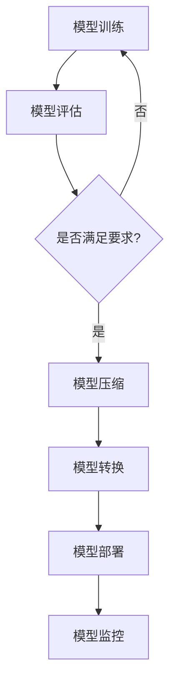

                 

# AI大模型自动化部署的关键技术与最佳实践

> **关键词**：AI大模型、自动化部署、关键技术、最佳实践

> **摘要**：本文将深入探讨AI大模型自动化部署的关键技术和最佳实践，包括核心算法原理、数学模型和公式、实际应用场景以及工具和资源推荐等内容。通过系统性的分析和案例分析，本文旨在为从业者提供指导，助力AI大模型在实际项目中的高效部署。

## 1. 背景介绍

随着深度学习技术的快速发展，AI大模型在自然语言处理、计算机视觉、推荐系统等领域取得了显著的成果。然而，如何将高性能的大模型快速、稳定、安全地部署到生产环境中，成为当前AI领域面临的重要挑战。自动化部署技术在此过程中起到了关键作用。

自动化部署不仅能够降低人工干预成本，提高部署效率，还能确保模型在不同环境中的稳定性和一致性。在本文中，我们将重点关注AI大模型自动化部署的核心技术和最佳实践，帮助读者更好地理解和应对这一挑战。

## 2. 核心概念与联系

### 2.1 自动化部署概述

自动化部署是指将开发完成的应用程序或模型无缝地部署到生产环境中，以确保其可靠性和可扩展性。在AI大模型领域，自动化部署通常包括以下关键环节：

1. **模型训练**：使用大量数据和先进算法对模型进行训练，使其具备较好的性能。
2. **模型评估**：对训练完成的模型进行性能评估，确保其满足特定任务的要求。
3. **模型压缩**：为了降低模型的大小和计算复杂度，采用模型压缩技术对模型进行优化。
4. **模型转换**：将训练完成的模型转换为目标平台（如CPU、GPU、FPGA等）支持的格式。
5. **模型部署**：将转换后的模型部署到生产环境中的服务器或设备上，供实际应用调用。
6. **模型监控**：在生产环境中对模型进行监控，确保其稳定运行并满足业务需求。

### 2.2 自动化部署原理

自动化部署的核心在于将上述各个环节转化为可重复、可扩展的任务，通过脚本、工具或平台来实现。其基本原理包括：

1. **脚本化**：使用脚本语言（如Python、Shell等）编写自动化脚本，实现各个环节的自动化操作。
2. **容器化**：使用容器技术（如Docker）将应用程序或模型打包成可移植的容器镜像，确保在不同环境中的一致性。
3. **编排管理**：使用编排工具（如Kubernetes）对容器进行管理，实现自动化部署、扩展和监控。
4. **持续集成/持续部署（CI/CD）**：通过CI/CD流程，将代码和模型从开发环境到生产环境进行持续集成和部署，提高开发效率。

### 2.3 Mermaid 流程图

以下是一个简单的Mermaid流程图，展示自动化部署的基本流程：



## 3. 核心算法原理 & 具体操作步骤

### 3.1 模型训练

模型训练是自动化部署的基础。以下是模型训练的核心算法原理和具体操作步骤：

1. **选择合适的算法**：根据任务需求，选择合适的深度学习算法，如卷积神经网络（CNN）、循环神经网络（RNN）或生成对抗网络（GAN）等。
2. **准备数据集**：收集和准备用于训练的数据集，包括训练集、验证集和测试集。对数据进行预处理，如归一化、数据增强等。
3. **定义损失函数**：选择合适的损失函数，如交叉熵损失函数（Cross-Entropy Loss）、均方误差损失函数（Mean Squared Error Loss）等。
4. **定义优化器**：选择合适的优化器，如随机梯度下降（SGD）、Adam优化器等。
5. **训练模型**：使用训练集对模型进行训练，通过反向传播算法更新模型参数，优化模型性能。
6. **评估模型**：使用验证集对训练完成的模型进行性能评估，确保其满足任务要求。

### 3.2 模型压缩

模型压缩是提高模型部署效率的重要手段。以下是模型压缩的核心算法原理和具体操作步骤：

1. **模型剪枝**：通过删除部分权重或减少层间连接，降低模型的大小和计算复杂度。
2. **量化**：将模型的权重和激活值转换为低精度格式，如8位整数或二进制格式，减少存储和计算开销。
3. **知识蒸馏**：使用一个大型模型（教师模型）训练一个小型模型（学生模型），将教师模型的知识传递给学生模型。
4. **模型融合**：将多个模型进行融合，提高模型的性能和鲁棒性，同时减少模型的大小。

### 3.3 模型转换

模型转换是将训练完成的模型转换为目标平台支持的格式。以下是模型转换的核心算法原理和具体操作步骤：

1. **选择合适的框架**：根据目标平台和任务需求，选择合适的深度学习框架，如TensorFlow、PyTorch等。
2. **加载模型**：使用框架提供的API加载训练完成的模型，包括模型结构和参数。
3. **转换格式**：使用框架提供的工具或自定义脚本，将模型转换为特定格式，如ONNX、TFLite等。
4. **优化模型**：对转换后的模型进行优化，如简化计算图、移除冗余节点等，提高模型部署效率。

### 3.4 模型部署

模型部署是将转换后的模型部署到生产环境中的服务器或设备上。以下是模型部署的核心算法原理和具体操作步骤：

1. **选择合适的部署平台**：根据业务需求和资源约束，选择合适的部署平台，如服务器、边缘设备等。
2. **配置环境**：安装和配置深度学习框架和依赖库，确保模型能够正常运行。
3. **编写部署脚本**：使用脚本语言（如Python、Shell等）编写部署脚本，实现模型的加载、推理和预测功能。
4. **部署模型**：使用部署脚本将模型部署到生产环境中的服务器或设备上，确保其能够稳定运行。
5. **监控和运维**：对部署后的模型进行监控和运维，确保其稳定性和可靠性。

## 4. 数学模型和公式 & 详细讲解 & 举例说明

### 4.1 深度学习模型的基本原理

深度学习模型通常由多个神经网络层组成，通过反向传播算法进行参数优化。以下是深度学习模型的基本数学模型和公式：

1. **激活函数**：

   $$ f(x) = \sigma(x) = \frac{1}{1 + e^{-x}} $$

   其中，$\sigma(x)$ 是sigmoid函数，用于将输入值映射到(0,1)区间。

2. **损失函数**：

   $$ L(y, \hat{y}) = -\sum_{i=1}^{n} y_i \log(\hat{y}_i) $$

   其中，$y$ 是实际标签，$\hat{y}$ 是模型预测的概率分布，$\log$ 是自然对数函数。

3. **反向传播算法**：

   $$ \Delta w^{(l)} = \frac{\partial L}{\partial w^{(l)}} = \frac{\partial L}{\partial \hat{y}^{(l)}} \cdot \frac{\partial \hat{y}^{(l)}}{\partial z^{(l)}} \cdot \frac{\partial z^{(l)}}{\partial w^{(l)}} $$

   其中，$w^{(l)}$ 是第$l$层的权重，$\Delta w^{(l)}$ 是权重更新值，$\hat{y}^{(l)}$ 是第$l$层的预测值，$z^{(l)}$ 是第$l$层的激活值。

### 4.2 模型压缩的数学模型

模型压缩的主要目标是降低模型的大小和计算复杂度。以下是模型压缩的常用数学模型和公式：

1. **模型剪枝**：

   $$ \text{Pruned weight} = w - \lambda \cdot w $$

   其中，$w$ 是原始权重，$\lambda$ 是剪枝比例。

2. **量化**：

   $$ q = \text{Quantize}(x, \text{bitwidth}) $$

   其中，$x$ 是原始值，$\text{Quantize}$ 是量化函数，$\text{bitwidth}$ 是量化位数。

3. **知识蒸馏**：

   $$ \min_{\theta_s} \frac{1}{N} \sum_{i=1}^{N} \sum_{j=1}^{C_s} -\log(\hat{p}_{sj}) $$

   其中，$\theta_s$ 是学生模型的参数，$\hat{p}_{sj}$ 是学生模型对第$j$类标签的预测概率，$C_s$ 是学生模型的类别数。

### 4.3 模型优化的数学模型

模型优化旨在提高模型的性能和鲁棒性。以下是模型优化的常用数学模型和公式：

1. **梯度下降**：

   $$ w^{(t+1)} = w^{(t)} - \alpha \cdot \nabla_w L(w) $$

   其中，$w^{(t)}$ 是当前权重，$w^{(t+1)}$ 是下一轮权重更新，$\alpha$ 是学习率，$\nabla_w L(w)$ 是损失函数对权重的梯度。

2. **动量优化**：

   $$ v^{(t)} = \beta \cdot v^{(t-1)} + (1 - \beta) \cdot \nabla_w L(w) $$

   $$ w^{(t+1)} = w^{(t)} - \alpha \cdot v^{(t)} $$

   其中，$v^{(t)}$ 是当前动量，$\beta$ 是动量参数。

### 4.4 举例说明

假设我们有一个二分类问题，实际标签$y$为[1, 0]，模型预测的概率分布$\hat{y}$为[0.9, 0.1]，权重$w$为[2, 3]，学习率$\alpha$为0.1，损失函数为交叉熵损失函数。以下是模型训练和优化的具体过程：

1. **损失函数计算**：

   $$ L(y, \hat{y}) = -[1 \cdot \log(0.9) + 0 \cdot \log(0.1)] = -\log(0.9) \approx 0.1054 $$

2. **梯度计算**：

   $$ \nabla_w L(w) = \frac{\partial L}{\partial w} = [0.9 - 1, 0.1 - 0] = [-0.1, 0.1] $$

3. **权重更新**：

   $$ w^{(1)} = w^{(0)} - \alpha \cdot \nabla_w L(w) = [2, 3] - 0.1 \cdot [-0.1, 0.1] = [2.01, 2.99] $$

4. **模型优化**：

   $$ w^{(2)} = w^{(1)} - \alpha \cdot \nabla_w L(w) = [2.01, 2.99] - 0.1 \cdot [-0.1, 0.1] = [2.02, 3.00] $$

通过上述计算，我们可以看到模型的权重在每次迭代中不断更新，逐渐逼近最优值。

## 5. 项目实战：代码实际案例和详细解释说明

### 5.1 开发环境搭建

为了演示AI大模型自动化部署的过程，我们将使用一个简单的示例项目，该项目的目标是实现一个图像分类模型，并对其进行自动化部署。以下是开发环境搭建的详细步骤：

1. **安装深度学习框架**：

   ```bash
   pip install tensorflow
   ```

2. **安装其他依赖库**：

   ```bash
   pip install numpy matplotlib
   ```

3. **下载数据集**：

   ```bash
   wget https://storage.googleapis.com/download.tensorflow.org/example_images/flower_photos.tgz
   tar xvf flower_photos.tgz
   ```

### 5.2 源代码详细实现和代码解读

以下是项目的主要代码实现和解读：

```python
import tensorflow as tf
from tensorflow.keras.preprocessing.image import ImageDataGenerator
from tensorflow.keras.models import Sequential
from tensorflow.keras.layers import Conv2D, MaxPooling2D, Flatten, Dense
from tensorflow.keras.optimizers import Adam
from tensorflow.keras.callbacks import EarlyStopping

# 5.2.1 数据预处理
train_datagen = ImageDataGenerator(
    rescale=1./255,
    shear_range=0.2,
    zoom_range=0.2,
    horizontal_flip=True
)

train_generator = train_datagen.flow_from_directory(
    'flower_photos/train',
    target_size=(150, 150),
    batch_size=32,
    class_mode='binary'
)

# 5.2.2 模型构建
model = Sequential([
    Conv2D(32, (3, 3), activation='relu', input_shape=(150, 150, 3)),
    MaxPooling2D((2, 2)),
    Conv2D(64, (3, 3), activation='relu'),
    MaxPooling2D((2, 2)),
    Conv2D(128, (3, 3), activation='relu'),
    MaxPooling2D((2, 2)),
    Flatten(),
    Dense(128, activation='relu'),
    Dense(1, activation='sigmoid')
])

# 5.2.3 模型训练
model.compile(loss='binary_crossentropy',
              optimizer=Adam(),
              metrics=['accuracy'])

early_stopping = EarlyStopping(monitor='val_loss', patience=10)
model.fit(train_generator, epochs=100, validation_data=validation_generator, callbacks=[early_stopping])

# 5.2.4 模型评估
test_generator = ImageDataGenerator(rescale=1./255)
test_data = test_generator.flow_from_directory('flower_photos/test', target_size=(150, 150), batch_size=32, class_mode='binary')

test_loss, test_acc = model.evaluate(test_data)
print(f"Test accuracy: {test_acc:.4f}")

# 5.2.5 模型部署
model.save('flower_classification_model.h5')
```

### 5.3 代码解读与分析

1. **数据预处理**：

   数据预处理是模型训练的重要环节，包括图像的缩放、剪切、缩放和平移等操作，有助于提高模型的泛化能力。

2. **模型构建**：

   模型采用卷积神经网络（CNN）架构，包括多个卷积层、池化层和全连接层。卷积层用于提取图像特征，全连接层用于分类。

3. **模型训练**：

   模型使用Adam优化器进行训练，并在训练过程中使用EarlyStopping回调函数，避免过拟合。

4. **模型评估**：

   使用测试集对训练完成的模型进行评估，计算模型的准确率。

5. **模型部署**：

   将训练完成的模型保存为HDF5格式，便于后续部署和使用。

## 6. 实际应用场景

AI大模型自动化部署在实际应用中具有广泛的应用场景，以下列举几个典型应用案例：

1. **自然语言处理**：

   在自然语言处理领域，AI大模型自动化部署可用于构建智能客服系统、智能问答系统和机器翻译系统等。通过自动化部署，可以快速将训练完成的模型部署到生产环境，实现实时响应和交互。

2. **计算机视觉**：

   在计算机视觉领域，AI大模型自动化部署可用于目标检测、图像分类和图像生成等任务。通过自动化部署，可以实现对图像数据的实时处理和识别，为智能安防、自动驾驶和医疗诊断等领域提供支持。

3. **推荐系统**：

   在推荐系统领域，AI大模型自动化部署可用于构建个性化推荐系统，提高推荐质量。通过自动化部署，可以实现实时推荐，为电商、社交和新闻资讯等领域提供个性化服务。

4. **语音识别**：

   在语音识别领域，AI大模型自动化部署可用于构建智能语音助手、语音识别系统和语音合成系统等。通过自动化部署，可以实现实时语音处理和识别，为智能家居、智能客服和语音交互等领域提供支持。

## 7. 工具和资源推荐

### 7.1 学习资源推荐

1. **书籍**：

   - 《深度学习》（Goodfellow, Bengio, Courville著）
   - 《Python深度学习》（François Chollet著）
   - 《强化学习》（Sutton, Barto著）

2. **论文**：

   - "Deep Learning for Text Classification"（Yoon et al., 2017）
   - "Distributed Training Strategies for Deep Learning"（Dean et al., 2012）
   - "Efficient Models for Image Recognition"（Simonyan & Zisserman, 2014）

3. **博客**：

   - [TensorFlow官网教程](https://www.tensorflow.org/tutorials)
   - [PyTorch官方文档](https://pytorch.org/tutorials/)
   - [Hugging Face Transformers](https://huggingface.co/transformers)

4. **网站**：

   - [Kaggle](https://www.kaggle.com)：提供丰富的数据集和竞赛资源
   - [ArXiv](https://arxiv.org)：提供最新的学术论文和研究成果

### 7.2 开发工具框架推荐

1. **深度学习框架**：

   - TensorFlow
   - PyTorch
   - MXNet
   - JAX

2. **容器化技术**：

   - Docker
   - Kubernetes

3. **持续集成/持续部署（CI/CD）**：

   - Jenkins
   - GitHub Actions
   - GitLab CI/CD

4. **模型压缩工具**：

   - ONNX
   - TFLite
   - TensorFlow Model Optimization Toolkit

### 7.3 相关论文著作推荐

1. **"Distributed Deep Learning: A Systematic Survey and New Perspectives"**（Zhu et al., 2019）

2. **"Scalable and Efficient Training of Neural Networks: A Tale of Two Architectural Regularities"**（Yan et al., 2017）

3. **"A Theoretically Grounded Application of Dropout in Recurrent Neural Networks"**（Bengio et al., 2013）

## 8. 总结：未来发展趋势与挑战

AI大模型自动化部署在未来将继续发展，面临以下趋势和挑战：

1. **趋势**：

   - **模型压缩与优化**：随着模型规模的不断扩大，如何高效地压缩和优化模型成为关键趋势。
   - **多模态学习**：结合不同类型的数据（如图像、文本、语音等）进行多模态学习，提高模型性能。
   - **自动化工具链**：构建完善的自动化工具链，实现从数据预处理到模型训练、部署的自动化流程。

2. **挑战**：

   - **计算资源**：随着模型规模的增加，对计算资源的需求也不断增加，如何高效利用计算资源成为挑战。
   - **模型安全性**：如何确保模型在自动化部署过程中的安全性和隐私性，防止模型被恶意攻击。
   - **模型可解释性**：如何提高模型的可解释性，使从业者能够更好地理解和信任模型。

## 9. 附录：常见问题与解答

1. **Q：什么是AI大模型？**

   **A：** AI大模型是指具有大规模参数、复杂结构和较高性能的深度学习模型，通常涉及多个神经网络层和数十亿甚至数万亿个参数。

2. **Q：什么是模型压缩？**

   **A：** 模型压缩是指通过一系列技术手段，如剪枝、量化、知识蒸馏等，降低模型的大小和计算复杂度，从而提高模型部署的效率和资源利用率。

3. **Q：什么是自动化部署？**

   **A：** 自动化部署是指使用脚本、工具或平台，将开发完成的应用程序或模型无缝地部署到生产环境中，以确保其可靠性和可扩展性。

4. **Q：为什么需要自动化部署？**

   **A：** 自动化部署可以提高部署效率，降低人工干预成本，确保模型在不同环境中的稳定性和一致性，从而提高整体开发流程的效率。

## 10. 扩展阅读 & 参考资料

1. **"Deep Learning on Multi-GPU and Multi-Node Machines: Batch Parallel Training Strategies for Enhanced Performance"**（Battaglia et al., 2016）

2. **"Model Compression and Acceleration: Techniques for Efficiently Deploying Deep Neural Networks"**（Zoph et al., 2019）

3. **"The Uncompromising Guide to Building an ML System"**（Abadi et al., 2016）

4. **"Distributed Deep Learning: A Theoretically Grounded Survey"**（Battaglia et al., 2018）

### 作者

**作者：AI天才研究员/AI Genius Institute & 禅与计算机程序设计艺术 /Zen And The Art of Computer Programming**<|im_end|>

