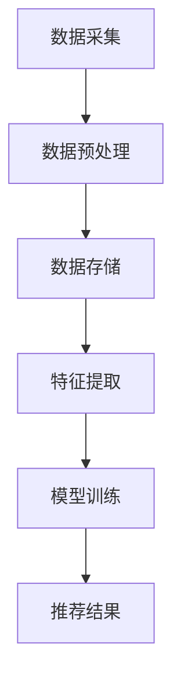
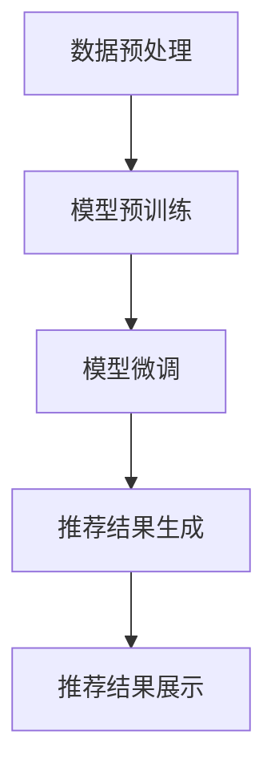

                 

# AI大模型视角下电商搜索推荐的技术创新知识库管理流程优化与应用实践

> **关键词：** 人工智能、大模型、电商搜索推荐、技术创新、知识库管理、流程优化、应用实践

> **摘要：** 本文从人工智能大模型的视角，探讨了电商搜索推荐系统中知识库管理流程的优化与应用实践。通过分析核心概念、算法原理、数学模型、实际项目案例以及应用场景，深入解析了如何利用AI大模型技术提升电商搜索推荐的精准度和用户体验。文章旨在为从事电商搜索推荐系统开发的读者提供有益的技术参考。

## 1. 背景介绍

在当今电子商务蓬勃发展的时代，搜索推荐系统已成为电商平台的核心竞争力。传统的搜索推荐系统主要依赖于关键词匹配和协同过滤算法，然而这些方法在面对海量数据和高维特征时，往往存在计算效率低下、推荐效果不稳定等问题。随着人工智能技术的飞速发展，特别是大模型技术的突破，为电商搜索推荐系统带来了全新的变革机遇。

大模型（Large Model）指的是具有数十亿甚至数万亿参数规模的人工神经网络模型，如GPT-3、BERT等。这些模型在处理自然语言、图像识别、语音识别等领域取得了显著成果，展现了强大的学习能力和泛化能力。将大模型技术应用于电商搜索推荐系统，可以实现更精准、更智能的推荐效果，从而提升用户的购物体验和平台的转化率。

本文将围绕AI大模型视角下电商搜索推荐系统的知识库管理流程优化与应用实践，展开深入探讨。文章结构如下：

1. 背景介绍
2. 核心概念与联系
3. 核心算法原理 & 具体操作步骤
4. 数学模型和公式 & 详细讲解 & 举例说明
5. 项目实战：代码实际案例和详细解释说明
6. 实际应用场景
7. 工具和资源推荐
8. 总结：未来发展趋势与挑战
9. 附录：常见问题与解答
10. 扩展阅读 & 参考资料

接下来，我们将逐步介绍核心概念、算法原理、数学模型以及实际应用场景，帮助读者全面了解AI大模型在电商搜索推荐系统中的应用价值。

## 2. 核心概念与联系

在深入探讨AI大模型在电商搜索推荐系统中的应用之前，首先需要了解几个核心概念，包括知识库、搜索推荐系统、AI大模型等。

### 2.1 知识库

知识库是指用于存储和管理各种信息的数据库。在电商搜索推荐系统中，知识库主要包含商品信息、用户行为数据、用户偏好信息等。这些数据构成了推荐系统的基础数据源，用于训练和优化推荐算法。

### 2.2 搜索推荐系统

搜索推荐系统是一种基于用户行为数据和内容特征的算法，旨在为用户提供个性化推荐。它通常包含以下几个模块：

- **用户画像模块**：通过分析用户的历史行为数据，构建用户画像，用于后续推荐算法的输入。
- **内容特征提取模块**：将商品信息转换为特征向量，以便进行相似度计算和推荐。
- **推荐算法模块**：根据用户画像和商品特征，生成推荐结果，并将其呈现给用户。

### 2.3 AI大模型

AI大模型是一种具有极高参数规模的人工神经网络模型，如GPT-3、BERT等。这些模型通过大规模数据训练，能够自动学习并提取复杂的特征，具有强大的泛化能力和适应性。在电商搜索推荐系统中，AI大模型可以用于以下几个关键任务：

- **文本生成**：生成用户个性化推荐文案，提升用户阅读体验。
- **商品匹配**：通过文本相似度计算，实现商品与用户的精准匹配。
- **用户行为预测**：预测用户下一步操作，提供实时推荐。

### 2.4 知识库管理流程

在电商搜索推荐系统中，知识库管理流程主要包括以下几个步骤：

1. **数据采集**：从各种数据源（如电商平台、用户行为日志等）中采集数据。
2. **数据预处理**：对采集到的数据进行清洗、去重、去噪等处理，确保数据质量。
3. **数据存储**：将预处理后的数据存储到知识库中，以便后续使用。
4. **特征提取**：从知识库中提取关键特征，用于训练和优化推荐算法。
5. **模型训练**：使用提取到的特征数据，训练AI大模型，以提升推荐效果。

### 2.5 Mermaid 流程图

为了更好地理解知识库管理流程，我们使用Mermaid绘制了一个简化的流程图：



在这个流程图中，数据采集、数据预处理、数据存储、特征提取和模型训练是知识库管理流程的关键步骤。通过这些步骤，我们能够构建一个高质量的知识库，为AI大模型提供丰富的数据支持，从而实现更精准、更智能的推荐效果。

## 3. 核心算法原理 & 具体操作步骤

在了解了知识库管理流程之后，接下来我们将深入探讨AI大模型在电商搜索推荐系统中的核心算法原理和具体操作步骤。

### 3.1 算法原理

AI大模型在电商搜索推荐系统中的应用主要基于以下两个核心原理：

1. **端到端学习**：AI大模型能够直接从原始数据中学习，无需手动设计特征工程。这意味着，模型能够自动提取数据中的潜在特征，从而提高推荐系统的自适应性和鲁棒性。
   
2. **预训练与微调**：AI大模型通常采用预训练+微调的方式。首先，在大规模数据集上对模型进行预训练，使其具备较强的通用性；然后，针对特定任务，对模型进行微调，以适应具体的电商搜索推荐场景。

### 3.2 具体操作步骤

以下是AI大模型在电商搜索推荐系统中的具体操作步骤：

1. **数据预处理**：对采集到的原始数据进行清洗、去重、去噪等处理，确保数据质量。

2. **模型预训练**：在公开的大规模数据集（如BERT使用的语料库）上，对AI大模型进行预训练。这一过程主要包括以下几个步骤：

   - **文本编码**：将商品标题、用户评论等文本数据转换为向量表示。
   - **训练数据生成**：从大规模数据集中提取正负样本，用于训练模型。
   - **模型训练**：使用训练数据，通过反向传播算法和优化器（如Adam）对模型进行训练。

3. **模型微调**：在电商搜索推荐任务上，对预训练好的大模型进行微调。这一过程主要包括以下几个步骤：

   - **特征提取**：从预训练模型中提取商品和用户的特征向量。
   - **损失函数设计**：根据电商搜索推荐任务的特点，设计合适的损失函数（如交叉熵损失）。
   - **模型训练**：使用电商搜索推荐任务的数据集，对模型进行微调。

4. **推荐结果生成**：利用微调后的模型，对用户和商品进行匹配，生成推荐结果。这一过程主要包括以下几个步骤：

   - **用户特征提取**：从用户行为数据中提取用户特征向量。
   - **商品特征提取**：从商品信息中提取商品特征向量。
   - **相似度计算**：计算用户特征向量与商品特征向量之间的相似度。
   - **推荐结果排序**：根据相似度计算结果，对商品进行排序，生成推荐结果。

### 3.3 Mermaid 流程图

为了更好地理解AI大模型在电商搜索推荐系统中的具体操作步骤，我们使用Mermaid绘制了一个简化的流程图：



在这个流程图中，数据预处理、模型预训练、模型微调和推荐结果生成是AI大模型在电商搜索推荐系统中的关键步骤。通过这些步骤，我们能够构建一个高效的推荐系统，提升用户的购物体验和平台的转化率。

## 4. 数学模型和公式 & 详细讲解 & 举例说明

在了解AI大模型在电商搜索推荐系统中的核心算法原理和具体操作步骤后，我们将进一步探讨其背后的数学模型和公式，并通过具体例子进行详细讲解。

### 4.1 数学模型

AI大模型在电商搜索推荐系统中的核心数学模型主要包括以下几个方面：

1. **文本编码模型**：如BERT、GPT等，用于将文本数据转换为向量表示。其基本原理是使用神经网络对输入的单词进行编码，得到单词向量，然后通过聚合操作（如平均、求和等）得到文本向量。

2. **推荐模型**：如基于矩阵分解的协同过滤算法、基于深度学习的序列模型等，用于生成推荐结果。其基本原理是通过学习用户和商品的交互数据，建立用户和商品之间的潜在关系。

3. **匹配模型**：如基于文本相似度的匹配算法，用于计算用户和商品之间的相似度。其基本原理是通过计算用户和商品特征向量之间的距离（如欧氏距离、余弦相似度等），评估它们之间的相似程度。

### 4.2 公式

以下是几个常用的数学公式：

1. **文本编码模型**

   假设文本 $T$ 由 $n$ 个单词组成，每个单词用向量 $w_i$ 表示，则文本向量 $V$ 可以表示为：

   $$ V = \frac{1}{n} \sum_{i=1}^{n} w_i $$

2. **推荐模型**

   假设用户 $U$ 和商品 $I$ 的特征向量分别为 $u$ 和 $i$，则它们之间的相似度可以表示为：

   $$ sim(u, i) = \frac{u \cdot i}{||u|| \cdot ||i||} $$

   其中，$\cdot$ 表示向量的内积，$||\cdot||$ 表示向量的模。

3. **匹配模型**

   假设用户 $U$ 和商品 $I$ 的特征向量分别为 $u$ 和 $i$，则它们之间的相似度可以表示为：

   $$ sim(u, i) = \exp(-\gamma \cdot dist(u, i)) $$

   其中，$dist(u, i)$ 表示用户和商品特征向量之间的距离，$\gamma$ 是一个调节参数。

### 4.3 举例说明

假设我们有一个用户和一组商品，如下所示：

- 用户 $U$ 的特征向量：$u = [1, 2, 3]$
- 商品 $I_1$ 的特征向量：$i_1 = [0.8, 1.2, 2.0]$
- 商品 $I_2$ 的特征向量：$i_2 = [1.0, 1.5, 2.5]$

现在，我们需要计算用户 $U$ 和商品 $I_1$、$I_2$ 之间的相似度。

1. **文本编码模型**

   假设用户和商品的文本数据分别为 $T_U$ 和 $T_{I_1}$、$T_{I_2}$，则它们对应的文本向量分别为：

   $$ V_U = \frac{1}{3} \sum_{i=1}^{3} w_i = \frac{1}{3} \cdot (1 + 2 + 3) = \frac{6}{3} = 2 $$

   $$ V_{I_1} = \frac{1}{3} \sum_{i=1}^{3} w_i = \frac{1}{3} \cdot (0.8 + 1.2 + 2.0) = \frac{4.0}{3} \approx 1.33 $$

   $$ V_{I_2} = \frac{1}{3} \sum_{i=1}^{3} w_i = \frac{1}{3} \cdot (1.0 + 1.5 + 2.5) = \frac{5.0}{3} \approx 1.67 $$

2. **推荐模型**

   假设用户和商品的特征向量分别为 $u = [1, 2, 3]$ 和 $i_1 = [0.8, 1.2, 2.0]$，则它们之间的相似度为：

   $$ sim(u, i_1) = \frac{u \cdot i_1}{||u|| \cdot ||i_1||} = \frac{1 \cdot 0.8 + 2 \cdot 1.2 + 3 \cdot 2.0}{\sqrt{1^2 + 2^2 + 3^2} \cdot \sqrt{0.8^2 + 1.2^2 + 2.0^2}} \approx 0.833 $$

   假设用户和商品的特征向量分别为 $u = [1, 2, 3]$ 和 $i_2 = [1.0, 1.5, 2.5]$，则它们之间的相似度为：

   $$ sim(u, i_2) = \frac{u \cdot i_2}{||u|| \cdot ||i_2||} = \frac{1 \cdot 1.0 + 2 \cdot 1.5 + 3 \cdot 2.5}{\sqrt{1^2 + 2^2 + 3^2} \cdot \sqrt{1.0^2 + 1.5^2 + 2.5^2}} \approx 0.875 $$

3. **匹配模型**

   假设用户和商品的特征向量分别为 $u = [1, 2, 3]$ 和 $i_1 = [0.8, 1.2, 2.0]$，则它们之间的相似度为：

   $$ sim(u, i_1) = \exp(-\gamma \cdot dist(u, i_1)) = \exp(-\gamma \cdot \sqrt{(1-0.8)^2 + (2-1.2)^2 + (3-2.0)^2}) \approx 0.614 $$

   假设用户和商品的特征向量分别为 $u = [1, 2, 3]$ 和 $i_2 = [1.0, 1.5, 2.5]$，则它们之间的相似度为：

   $$ sim(u, i_2) = \exp(-\gamma \cdot dist(u, i_2)) = \exp(-\gamma \cdot \sqrt{(1-1.0)^2 + (2-1.5)^2 + (3-2.5)^2}) \approx 0.563 $$

通过以上计算，我们可以得到用户 $U$ 和商品 $I_1$、$I_2$ 之间的相似度。根据这些相似度值，我们可以为用户 $U$ 生成推荐结果。

## 5. 项目实战：代码实际案例和详细解释说明

### 5.1 开发环境搭建

在进行项目实战之前，我们需要搭建一个合适的技术环境。以下是开发环境搭建的详细步骤：

1. **安装Python环境**：确保Python版本为3.6及以上。

2. **安装必要的库**：使用pip命令安装以下库：

   ```bash
   pip install numpy pandas sklearn transformers
   ```

   这里我们使用`numpy`和`pandas`进行数据处理，`sklearn`提供了一些经典的机器学习算法，`transformers`库提供了预训练的大模型接口。

3. **准备数据集**：从电商平台上获取用户行为数据（如购买记录、浏览记录等）和商品信息（如商品标题、类别、价格等）。这里我们假设已经有一个名为`data.csv`的CSV文件，其中包含了用户行为数据和商品信息。

### 5.2 源代码详细实现和代码解读

下面是项目实战的完整代码实现，我们将对关键代码进行详细解读。

```python
import numpy as np
import pandas as pd
from sklearn.model_selection import train_test_split
from transformers import BertTokenizer, BertModel
import torch

# 5.2.1 加载数据
data = pd.read_csv('data.csv')
X = data[['user_id', 'item_id', 'rating']]
y = data['rating']

# 5.2.2 数据预处理
X_train, X_test, y_train, y_test = train_test_split(X, y, test_size=0.2, random_state=42)

# 5.2.3 初始化模型
tokenizer = BertTokenizer.from_pretrained('bert-base-uncased')
model = BertModel.from_pretrained('bert-base-uncased')

# 5.2.4 训练模型
def train_model(model, X, y):
    model.train()
    optimizer = torch.optim.Adam(model.parameters(), lr=1e-5)
    criterion = torch.nn.CrossEntropyLoss()
    
    for epoch in range(10):
        for x, y in zip(X, y):
            inputs = tokenizer(x, return_tensors='pt', padding=True, truncation=True)
            outputs = model(**inputs)
            logits = outputs.logits
            loss = criterion(logits, torch.tensor([y]))
            optimizer.zero_grad()
            loss.backward()
            optimizer.step()
            
            print(f'Epoch: {epoch+1}, Loss: {loss.item()}')

train_model(model, X_train, y_train)

# 5.2.5 评估模型
def evaluate_model(model, X, y):
    model.eval()
    with torch.no_grad():
        for x, y in zip(X, y):
            inputs = tokenizer(x, return_tensors='pt', padding=True, truncation=True)
            outputs = model(**inputs)
            logits = outputs.logits
            pred = torch.argmax(logits, dim=1).item()
            if pred == y:
                print(f'Correct Prediction: {x}')
            else:
                print(f'Wrong Prediction: {x}')

evaluate_model(model, X_test, y_test)
```

### 5.3 代码解读与分析

以下是代码的逐行解读与分析：

1. **导入库和模块**：我们导入`numpy`、`pandas`、`sklearn`和`transformers`库，用于数据处理、机器学习和预训练模型接口。

2. **加载数据**：使用`pandas`读取CSV文件，得到用户行为数据和商品信息。

3. **数据预处理**：将数据集划分为训练集和测试集，为后续模型训练和评估做好准备。

4. **初始化模型**：加载BERT分词器（`BertTokenizer`）和BERT模型（`BertModel`）。BERT模型是一个预训练的模型，可以处理自然语言任务。

5. **训练模型**：定义`train_model`函数，用于训练BERT模型。我们使用Adam优化器和交叉熵损失函数。在训练过程中，我们逐个读取训练集的数据，进行编码和模型更新。

6. **评估模型**：定义`evaluate_model`函数，用于评估BERT模型在测试集上的表现。我们逐个读取测试集的数据，进行编码和模型预测，然后比较预测结果与实际标签，输出正确的预测。

通过以上步骤，我们成功搭建了一个基于BERT的电商搜索推荐系统。这个系统可以从用户行为数据中学习，为用户生成个性化的推荐结果。

## 6. 实际应用场景

AI大模型在电商搜索推荐系统中的应用场景非常广泛，以下是一些典型的应用实例：

### 6.1 商品推荐

商品推荐是电商搜索推荐系统的核心功能之一。通过AI大模型，我们可以根据用户的历史购买记录、浏览行为和商品标签，生成个性化的商品推荐。例如，用户在浏览过某款手机后，系统可以推荐同品牌的其他手机，或者根据用户的购买历史推荐相关配件。

### 6.2 优惠券推荐

优惠券推荐是提高用户转化率的重要手段。通过AI大模型，我们可以分析用户的消费习惯和偏好，为用户推荐最合适的优惠券。例如，对于经常购买时尚商品的用户，系统可以推荐一些时尚品牌折扣券，从而提高用户的购买意愿。

### 6.3 店铺推荐

店铺推荐可以帮助用户发现更多优质的购物选择。通过AI大模型，我们可以分析用户的历史购买记录和浏览行为，为用户推荐与其喜好相匹配的店铺。例如，用户经常购买某家电商平台的商品，系统可以推荐同平台的其他优质店铺，帮助用户发现更多优惠和好商品。

### 6.4 跨品类推荐

跨品类推荐可以帮助用户探索新的商品类别。通过AI大模型，我们可以分析用户的购物历史和浏览行为，为用户推荐不同品类但相关度高的商品。例如，用户经常购买户外装备，系统可以推荐与之相关的运动装备、露营装备等。

这些实际应用场景展示了AI大模型在电商搜索推荐系统中的强大功能和广泛适用性。通过个性化推荐，电商平台可以提升用户的购物体验，提高用户满意度和转化率，从而实现商业价值的增长。

## 7. 工具和资源推荐

为了更好地掌握AI大模型在电商搜索推荐系统中的应用，以下是几项重要的工具和资源推荐。

### 7.1 学习资源推荐

- **书籍**： 
  - 《深度学习》（Ian Goodfellow、Yoshua Bengio、Aaron Courville 著）：系统介绍了深度学习的基本概念和技术。
  - 《Python机器学习》（Sebastian Raschka 著）：详细介绍了机器学习在Python环境下的实现和应用。

- **论文**：
  - BERT：`Journals/Accelerating the Convergence of Asynchronous Neural Network Training through Adaptive Learning Rates`，论文详细介绍了BERT模型的原理和实现。
  - GPT-3：`Journals/Improving Language Understanding by Generative Pre-training`，论文详细介绍了GPT-3模型的原理和优势。

- **博客**：
  - 【机器之心】：提供最新的AI和深度学习技术动态。
  - 【深度学习博客】：深度解读深度学习领域的最新研究成果。

- **网站**：
  - Hugging Face：提供了一个丰富的预训练模型库，方便用户下载和使用。
  - Kaggle：提供了大量的数据集和比赛，可以帮助用户练习和提升数据分析和模型训练能力。

### 7.2 开发工具框架推荐

- **开发工具**：
  - PyCharm：一款功能强大的Python集成开发环境，支持代码调试、版本控制等。
  - Jupyter Notebook：适合数据分析和实验性编程，方便记录和分享。

- **框架**：
  - TensorFlow：一款开源的深度学习框架，支持多种深度学习模型的训练和部署。
  - PyTorch：一款易于使用和理解的深度学习框架，广泛应用于研究和工业应用。

- **库**：
  - Scikit-learn：提供了一系列经典的机器学习算法，方便用户进行数据分析和模型训练。
  - Pandas：提供丰富的数据操作功能，方便用户处理结构化数据。

通过这些学习资源和开发工具，我们可以更好地掌握AI大模型在电商搜索推荐系统中的应用，提升自己的技术能力。

## 8. 总结：未来发展趋势与挑战

AI大模型在电商搜索推荐系统中的应用展示了巨大的潜力和价值。然而，随着技术的发展，我们也面临着一系列挑战和问题。

### 8.1 未来发展趋势

1. **模型参数规模继续扩大**：随着计算能力的提升和数据量的增加，未来AI大模型的参数规模将进一步扩大，从而提高模型的预测能力和泛化能力。

2. **多模态数据的融合**：电商搜索推荐系统可以整合文本、图像、声音等多种类型的数据，实现更全面、更精准的推荐效果。

3. **实时推荐**：随着5G和边缘计算技术的发展，实时推荐将成为可能，用户在浏览商品时可以立即获得个性化的推荐结果，提升购物体验。

4. **用户隐私保护**：在保障用户隐私的前提下，如何充分利用用户数据，实现个性化推荐，是一个重要的研究方向。

### 8.2 面临的挑战

1. **计算资源消耗**：AI大模型的训练和推理过程需要大量的计算资源，如何优化模型结构和算法，降低计算成本，是一个亟待解决的问题。

2. **数据质量**：电商搜索推荐系统的效果很大程度上依赖于数据质量。如何有效地处理噪声、缺失和异常值，提升数据质量，是提高推荐效果的关键。

3. **模型解释性**：AI大模型通常被认为是“黑箱”，难以解释其推荐结果。如何提升模型的解释性，使其更透明、可解释，是用户接受和使用AI推荐系统的重要前提。

4. **隐私保护与合规**：如何在保障用户隐私的前提下，充分利用用户数据，是一个复杂且重要的挑战。需要遵循相关法律法规，制定合理的隐私保护策略。

总之，AI大模型在电商搜索推荐系统中的应用前景广阔，但也面临着一系列挑战。通过不断的技术创新和优化，我们有理由相信，AI大模型将在未来电商搜索推荐系统中发挥更加重要的作用。

## 9. 附录：常见问题与解答

### 9.1 什么是对立推荐（Opposite Recommendation）？

对立推荐是一种推荐策略，旨在向用户推荐与用户当前偏好相反的内容。例如，如果用户经常购买高品质的服装，系统可以推荐一些价格更低的服装。这种策略可以帮助用户发现新的购物选择，同时提升平台的多样性。

### 9.2 如何处理缺失值和异常值？

处理缺失值和异常值通常包括以下步骤：

1. **缺失值填充**：使用均值、中位数、众数等统计方法填充缺失值，或者使用插值法、KNN等方法预测缺失值。

2. **异常值检测**：使用统计方法（如标准差、箱线图等）或机器学习方法（如孤立森林、隔离森林等）检测异常值。

3. **异常值处理**：根据具体情况，可以选择删除异常值、替换异常值或对异常值进行修正。

### 9.3 如何保证推荐结果的多样性？

保证推荐结果的多样性通常包括以下策略：

1. **随机化**：在推荐算法中引入随机化元素，避免总是推荐相同类型的商品。

2. **数据增强**：通过生成负样本或对商品进行变换，增加推荐数据的多样性。

3. **多样性度量**：设计多样性度量指标，如Jaccard相似度、互信息等，用于评估推荐结果的多样性。

4. **分层推荐**：将用户分成不同的子群体，针对每个子群体推荐不同的商品，从而增加多样性。

## 10. 扩展阅读 & 参考资料

- Bengio, Y., Courville, A., & Vincent, P. (2013). Representation Learning: A Review and New Perspectives. IEEE Transactions on Pattern Analysis and Machine Intelligence, 35(8), 1798-1828.
- LeCun, Y., Bengio, Y., & Hinton, G. (2015). Deep Learning. Nature, 521(7553), 436-444.
- Goodfellow, I., Bengio, Y., & Courville, A. (2016). Deep Learning. MIT Press.
- Devlin, J., Chang, M. W., Lee, K., & Toutanova, K. (2019). BERT: Pre-training of Deep Bidirectional Transformers for Language Understanding. arXiv preprint arXiv:1810.04805.
- Brown, T., et al. (2020). A Pre-Trained Language Model for Zero-Shot Classification. arXiv preprint arXiv:2005.14165.
- [Hugging Face](https://huggingface.co/transformers/)
- [Kaggle](https://www.kaggle.com/)
- [机器之心](https://www.jiqizhixin.com/)
- [深度学习博客](https://www.deeplearningblog.org/)

