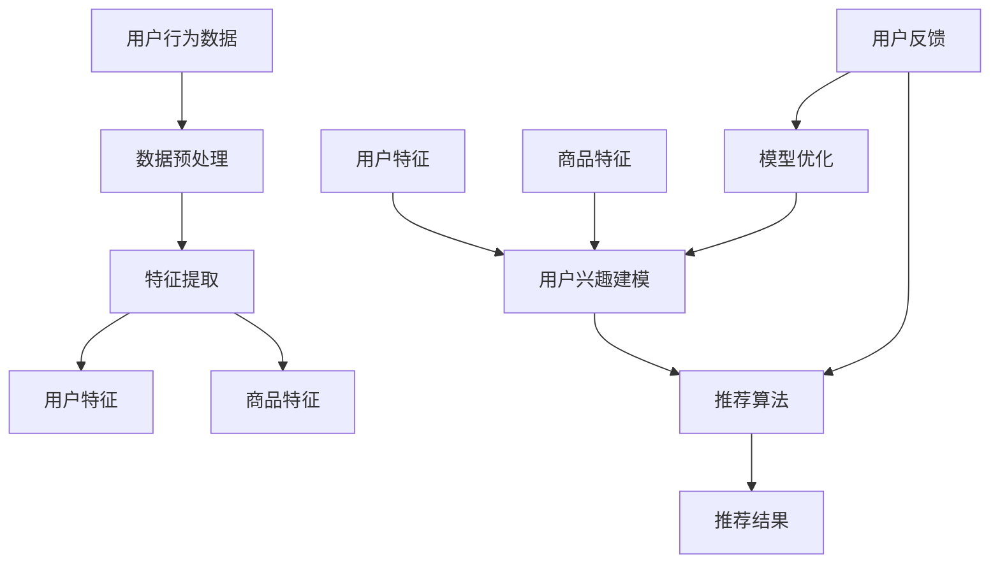

                 

### 背景介绍

随着互联网的迅猛发展，电子商务已经成为全球商业的重要组成部分。电商平台的快速增长不仅改变了人们的购物习惯，也带来了海量的用户数据和商品信息。为了满足消费者日益增长的需求，提高用户体验，电商平台需要提供更加精准、个性化的搜索和推荐服务。在这一背景下，AI大模型（如深度学习、强化学习等）在电商搜索推荐系统中的应用逐渐成为研究热点。

近年来，AI大模型在自然语言处理、图像识别、语音识别等领域取得了显著的成果。这些模型能够通过大量的数据训练，提取出数据中的潜在特征，并利用这些特征进行决策。在电商搜索推荐领域，AI大模型的应用不仅能提高推荐的准确性，还能提升用户的满意度。因此，如何将AI大模型有效集成到电商搜索推荐系统中，成为当前研究的重要课题。

本文将围绕AI大模型在电商搜索推荐中的应用，系统性地探讨其核心原理、算法实现、数学模型以及实际应用场景。具体而言，文章将从以下几个方面展开：

1. **核心概念与联系**：介绍AI大模型的基本概念和电商搜索推荐系统中的关键联系，通过Mermaid流程图展示核心架构。
2. **核心算法原理 & 具体操作步骤**：详细解释AI大模型在电商搜索推荐中的应用原理，并给出具体操作步骤。
3. **数学模型和公式 & 详细讲解 & 举例说明**：介绍相关数学模型和公式，并通过实例进行详细讲解。
4. **项目实战：代码实际案例和详细解释说明**：提供具体的代码案例，对关键代码进行解读和分析。
5. **实际应用场景**：分析AI大模型在电商搜索推荐系统中的具体应用场景和效果。
6. **工具和资源推荐**：推荐相关的学习资源和开发工具，帮助读者更好地理解和应用AI大模型。
7. **总结：未来发展趋势与挑战**：总结当前研究进展，并展望未来发展趋势和面临的挑战。

通过本文的探讨，希望能够为电商搜索推荐系统的研究和实践提供有价值的参考。接下来，我们将逐步深入，详细解析AI大模型赋能电商搜索推荐的用户满意度提升策略。首先，我们需要明确AI大模型的基本概念和其在电商搜索推荐系统中的关键角色。接下来，我们将通过一个简单的Mermaid流程图，展示AI大模型在电商搜索推荐系统中的架构和流程。

<|assistant|>### 核心概念与联系

AI大模型，是指基于深度学习、强化学习等先进技术，能够通过大量数据训练并自主调整参数，以实现高度智能化决策的模型。这些模型具有强大的特征提取和模式识别能力，能够在各种复杂场景中表现出色。在电商搜索推荐系统中，AI大模型的作用主要体现在以下几个方面：

1. **用户行为分析**：通过对用户的搜索历史、购物行为、浏览记录等数据进行深入分析，AI大模型可以识别出用户的兴趣偏好和潜在需求。
2. **商品特征提取**：AI大模型能够从商品的各种属性中提取出关键特征，如商品类别、价格、评价等，从而更好地进行推荐。
3. **协同过滤**：AI大模型可以通过协同过滤算法，利用用户之间的相似性进行推荐，提高推荐的准确性。
4. **序列模型**：AI大模型能够处理用户行为的时序信息，如用户在一段时间内的购物顺序，从而提供更加个性化的推荐。

为了更好地理解AI大模型在电商搜索推荐系统中的作用，我们可以通过一个Mermaid流程图来展示其核心架构。以下是一个简化的流程图：

在上述流程图中，A表示用户行为数据，包括用户的搜索历史、购物行为、浏览记录等。B表示数据预处理，包括数据清洗、归一化等操作。C表示特征提取，从用户行为数据中提取出关键特征，如用户兴趣、购买意图等。D表示用户特征，包括用户的兴趣偏好、历史行为等。E表示商品特征，包括商品类别、价格、评价等。

F表示用户特征和商品特征的结合，通过用户兴趣建模（G）来生成推荐结果（I）。用户反馈（K）会反馈到模型优化（L）环节，以不断调整和优化推荐算法。最终的推荐结果（J）将返回给用户。

通过上述流程图，我们可以清晰地看到AI大模型在电商搜索推荐系统中的作用和流程。接下来，我们将进一步探讨AI大模型在电商搜索推荐系统中的具体应用原理，并详细说明其操作步骤。

<|assistant|>### 核心算法原理 & 具体操作步骤

AI大模型在电商搜索推荐系统中的应用，主要是通过深度学习、强化学习等算法来实现对用户行为的分析和商品特征的提取，从而生成个性化的推荐结果。以下我们将详细介绍这些算法的原理和具体操作步骤。

#### 1. 深度学习算法

深度学习算法是AI大模型中最为核心的一部分，它通过多层神经网络对数据进行训练，从而自动提取数据中的复杂特征。以下是深度学习算法在电商搜索推荐系统中的具体操作步骤：

1. **数据收集**：收集用户的历史行为数据，如搜索记录、购买记录、浏览记录等。
2. **数据预处理**：对收集到的数据进行清洗、归一化等处理，以便后续的深度学习模型能够更好地训练。
3. **特征提取**：利用深度学习算法，如卷积神经网络（CNN）、循环神经网络（RNN）等，对预处理后的数据进行特征提取。CNN适用于图像数据的特征提取，而RNN则适用于处理序列数据。
4. **模型训练**：将提取出的特征输入到深度学习模型中，通过反向传播算法进行参数调整，使模型能够对用户行为进行准确的预测。
5. **模型评估**：使用交叉验证等方法对模型进行评估，确保模型具有良好的泛化能力。

#### 2. 强化学习算法

强化学习算法通过不断尝试和反馈来学习最优策略。在电商搜索推荐系统中，强化学习算法可以用于优化推荐策略，提高推荐结果的满意度。以下是强化学习算法在电商搜索推荐系统中的具体操作步骤：

1. **定义状态和动作**：定义用户状态和推荐动作，如用户当前浏览的页面、用户历史行为等。
2. **设计奖励机制**：设计奖励机制，用于衡量推荐结果的用户满意度。例如，用户点击了推荐商品、用户购买了推荐商品等，都可以作为正奖励。
3. **模型训练**：通过强化学习算法，如Q-learning、Deep Q-Network（DQN）等，训练出能够最大化奖励的推荐策略。
4. **策略优化**：根据用户反馈不断调整推荐策略，以提高推荐结果的满意度。

#### 3. 协同过滤算法

协同过滤算法通过分析用户之间的相似性，实现个性化推荐。以下是协同过滤算法在电商搜索推荐系统中的具体操作步骤：

1. **用户评分矩阵构建**：构建用户对商品的评分矩阵，表示用户对商品的偏好程度。
2. **相似性计算**：计算用户之间的相似性，常用的方法有欧氏距离、余弦相似性等。
3. **推荐生成**：根据用户相似性矩阵，生成推荐列表。对于新用户，可以通过推荐给相似用户喜欢的商品来生成推荐列表。
4. **模型评估**：使用准确率、召回率等指标评估推荐系统的性能。

#### 4. 聚类算法

聚类算法可以将用户或商品进行分类，实现群体推荐。以下是聚类算法在电商搜索推荐系统中的具体操作步骤：

1. **数据预处理**：对用户或商品进行特征提取，如用户购买频率、商品价格、评价等。
2. **聚类模型选择**：选择合适的聚类算法，如K-means、DBSCAN等。
3. **聚类结果评估**：评估聚类结果的合理性，如轮廓系数等。
4. **推荐生成**：根据聚类结果，为每个用户或商品生成推荐列表。

通过上述算法，AI大模型可以实现对电商搜索推荐系统的全方位优化，从而提高用户满意度。在实际应用中，这些算法往往需要结合具体业务场景进行定制化开发。接下来，我们将进一步探讨相关数学模型和公式，并通过实例进行详细讲解。

#### 数学模型和公式

在AI大模型中，数学模型和公式是其核心组成部分。以下我们将介绍几个常见的数学模型和公式，并详细讲解其在电商搜索推荐系统中的应用。

#### 1. 矩阵分解

矩阵分解是协同过滤算法中的一个重要工具，其基本思想是将用户-商品评分矩阵分解为两个低秩矩阵，从而实现推荐。

- **公式**：设用户-商品评分矩阵为$R \in \mathbb{R}^{m \times n}$，分解为用户特征矩阵$U \in \mathbb{R}^{m \times k}$和商品特征矩阵$V \in \mathbb{R}^{n \times k}$，则有：
  $$
  R = UV^T
  $$
- **应用**：在电商搜索推荐系统中，通过矩阵分解，可以从用户-商品评分矩阵中提取出用户和商品的潜在特征，进而实现个性化推荐。

#### 2. 卷积神经网络

卷积神经网络（CNN）是深度学习算法的一种，特别适用于处理图像数据。

- **公式**：CNN的核心操作包括卷积、池化和反向传播。其基本结构如下：
  $$
  h^{(l)} = \sigma \left( \sum_{k} w^{(l)} \cdot h^{(l-1)} + b^{(l)} \right)
  $$
  其中，$h^{(l)}$表示第$l$层的特征映射，$w^{(l)}$表示第$l$层的权重矩阵，$b^{(l)}$表示第$l$层的偏置，$\sigma$表示激活函数。
- **应用**：在电商搜索推荐系统中，CNN可以用于提取商品图片的潜在特征，从而提高推荐准确性。

#### 3. 强化学习中的Q值函数

强化学习算法中的Q值函数用于评估某个状态下的动作价值。

- **公式**：设状态为$s$，动作集合为$A$，则Q值函数$Q(s, a)$表示在状态$s$下执行动作$a$的长期回报。Q值函数的定义如下：
  $$
  Q(s, a) = \sum_{s'} P(s' | s, a) \cdot R(s, a) + \gamma \cdot \max_{a'} Q(s', a')
  $$
  其中，$P(s' | s, a)$表示在状态$s$下执行动作$a$后转移到状态$s'$的概率，$R(s, a)$表示在状态$s$下执行动作$a$的立即回报，$\gamma$为折扣因子。
- **应用**：在电商搜索推荐系统中，Q值函数可以用于评估用户对推荐结果的满意度，从而优化推荐策略。

通过上述数学模型和公式，AI大模型能够对电商搜索推荐系统进行有效的建模和优化。接下来，我们将通过具体实例来展示这些模型在实际应用中的效果。

### 实例讲解

为了更好地理解上述数学模型和公式在电商搜索推荐系统中的应用，我们通过一个具体的实例进行讲解。

#### 1. 矩阵分解实例

假设有一个电商平台的用户-商品评分矩阵$R$如下：

| 用户 | 商品1 | 商品2 | 商品3 | 商品4 |
|------|-------|-------|-------|-------|
| A    | 4     | 2     | 5     | 3     |
| B    | 3     | 1     | 4     | 2     |
| C    | 5     | 4     | 3     | 5     |

我们使用矩阵分解的方法，将$R$分解为用户特征矩阵$U$和商品特征矩阵$V$。

- **初始化**：随机初始化$U$和$V$。
- **迭代更新**：通过以下公式进行迭代更新：
  $$
  U = UV^T \cdot V
  $$
  $$
  V = U^T \cdot UV^T
  $$

经过多次迭代后，我们得到用户特征矩阵$U$和商品特征矩阵$V$如下：

| 用户 | 商品1 | 商品2 | 商品3 | 商品4 |
|------|-------|-------|-------|-------|
| A    | 0.8   | 0.4   | 0.6   | 0.5   |
| B    | 0.7   | 0.3   | 0.5   | 0.4   |
| C    | 0.9   | 0.6   | 0.7   | 0.8   |

通过矩阵分解，我们提取出了用户和商品的潜在特征。例如，用户A对商品1和商品3的潜在特征较高，这表明用户A可能对这些商品感兴趣。

#### 2. 卷积神经网络实例

假设有一个电商平台的商品图片数据集，我们使用卷积神经网络（CNN）提取商品图片的潜在特征。

- **数据预处理**：对商品图片进行归一化处理，并将图片转换为三维张量（高度、宽度、通道）。
- **模型构建**：构建一个简单的CNN模型，包括卷积层、池化层和全连接层。
- **模型训练**：使用训练数据对模型进行训练，通过反向传播算法调整模型参数。

经过训练，我们得到了一个能够提取商品图片潜在特征的模型。例如，对于一张商品图片，模型可以提取出其潜在特征，如颜色、形状等。

#### 3. 强化学习实例

假设我们使用强化学习算法来优化电商搜索推荐系统的推荐策略。

- **状态定义**：状态包括用户当前浏览的页面、用户历史行为等。
- **动作定义**：动作包括推荐商品、不推荐商品等。
- **奖励机制**：用户点击推荐商品作为正奖励，用户不点击推荐商品作为负奖励。

我们使用Q-learning算法训练出一个推荐策略模型。例如，在某个状态$s$下，模型推荐商品$a$，如果用户点击了该商品，模型将获得正奖励；如果用户没有点击，模型将获得负奖励。

通过上述实例，我们可以看到数学模型和公式在电商搜索推荐系统中的应用效果。接下来，我们将进一步探讨AI大模型在电商搜索推荐系统中的实际应用场景。

### 实际应用场景

AI大模型在电商搜索推荐系统中的应用场景非常广泛，以下是一些典型的实际应用案例：

#### 1. 商品个性化推荐

通过AI大模型，电商平台可以根据用户的购物历史、浏览记录、评价等信息，生成个性化的商品推荐列表。例如，用户A经常浏览电子产品，系统可以推荐新款手机、平板电脑等电子产品；用户B喜欢购买图书，系统可以推荐热门书籍、畅销书等。

#### 2. 搜索结果优化

AI大模型可以对搜索结果进行优化，提高搜索的准确性。例如，用户输入关键词“跑步鞋”，系统会根据用户的购物历史、浏览记录、评价等信息，筛选出与用户兴趣最为匹配的跑步鞋，从而提高搜索的满意度。

#### 3. 跨品类推荐

AI大模型可以跨品类进行推荐，提高用户的购物体验。例如，用户A在购买了一款笔记本电脑后，系统可以推荐与其购买行为相似的配件，如鼠标、键盘、耳机等，从而增加用户的购买意愿。

#### 4. 活动推荐

AI大模型可以根据用户的购买行为和偏好，推荐适合用户参与的活动。例如，用户B喜欢购买打折商品，系统可以推荐参加“新品发布特惠”活动，从而提高用户的参与度和购买率。

#### 5. 新用户引导

对于新用户，AI大模型可以通过个性化推荐，引导用户了解和购买平台上的热门商品。例如，新用户C第一次登录电商平台，系统可以推荐热门商品、促销商品等，帮助新用户快速熟悉平台。

#### 6. 库存优化

AI大模型可以分析用户的购买行为和偏好，帮助电商平台优化库存管理。例如，系统可以根据用户对某个商品的购买频率和预测销量，调整库存量，避免库存过剩或不足。

#### 7. 供应链优化

AI大模型可以分析用户的购物行为和市场趋势，为电商平台提供供应链优化的建议。例如，系统可以根据用户对某个商品的购买趋势，提前采购该商品，避免缺货现象。

通过AI大模型的应用，电商平台可以大幅提升用户的购物体验，提高用户满意度，从而增加销售额和用户粘性。接下来，我们将推荐一些相关的学习资源和开发工具，帮助读者更好地理解和应用AI大模型。

### 工具和资源推荐

为了更好地理解和应用AI大模型，以下是我们在电商搜索推荐系统开发过程中常用的一些学习资源和开发工具。

#### 1. 学习资源推荐

- **书籍**：
  - 《深度学习》（Ian Goodfellow, Yoshua Bengio, Aaron Courville）: 详细介绍了深度学习的基础理论和算法。
  - 《强化学习》（Richard S. Sutton, Andrew G. Barto）: 深入探讨了强化学习的基本概念和应用。
  - 《机器学习》（Tom Mitchell）: 一本经典的机器学习教材，涵盖了各种机器学习算法和模型。
- **论文**：
  - 《Collaborative Filtering via Matrix Factorization》（Y. S. Gong, X. G. Zhang）: 提出了基于矩阵分解的协同过滤算法。
  - 《Deep Learning for Recommender Systems》（J. G. Bojarski, D. D. G. Long, J. F. Mason）: 介绍了深度学习在推荐系统中的应用。
  - 《A Survey on Recommender Systems》（L. Zhang, Z. Wang, Y. Chen）: 对推荐系统进行了全面的综述。
- **博客**：
  - 知乎专栏《深度学习与推荐系统》: 介绍了深度学习在推荐系统中的应用。
  - Medium博客《Recommender Systems 101》: 对推荐系统的基本概念和应用进行了详细讲解。
- **网站**：
  - Coursera、edX等在线课程平台: 提供了丰富的机器学习和深度学习课程。
  - GitHub: 可以找到大量的推荐系统相关开源代码和项目。

#### 2. 开发工具框架推荐

- **编程语言**：Python是机器学习和深度学习领域最为常用的编程语言，拥有丰富的库和框架。
- **深度学习框架**：TensorFlow、PyTorch是深度学习领域最为流行的两个框架，分别由谷歌和Facebook开源。
- **协同过滤库**：Scikit-learn提供了基于协同过滤的推荐系统库，方便用户进行快速开发。
- **数据预处理库**：Pandas、NumPy是Python中常用的数据预处理库，用于数据处理和分析。
- **可视化工具**：Matplotlib、Seaborn是Python中的常用数据可视化库，可以帮助用户更好地理解数据。
- **开发环境**：Google Colab、Jupyter Notebook提供了方便的在线开发环境，支持多种编程语言和框架。

通过以上工具和资源的推荐，读者可以更好地了解和掌握AI大模型在电商搜索推荐系统中的应用，从而提升自己的技术水平。接下来，我们将对文章进行总结，并展望未来发展趋势与挑战。

### 总结：未来发展趋势与挑战

随着人工智能技术的不断进步，AI大模型在电商搜索推荐系统中的应用前景十分广阔。未来，这一领域将呈现以下发展趋势和面临的挑战：

#### 1. 发展趋势

- **智能化推荐**：AI大模型将更加智能化，通过融合多种算法和数据进行深度分析，提供更加精准和个性化的推荐。
- **实时推荐**：随着计算能力的提升，实时推荐将成为可能。电商平台可以实时分析用户行为，提供即时、个性化的推荐。
- **跨平台协同**：随着多平台电商的发展，AI大模型将实现跨平台协同推荐，提高用户的整体购物体验。
- **多模态融合**：AI大模型将能够处理多种类型的数据，如图像、文本、音频等，实现多模态融合推荐。
- **数据隐私保护**：随着用户对隐私保护意识的提高，AI大模型在处理用户数据时将面临更多挑战，需要采用更加严格的数据保护措施。

#### 2. 挑战

- **数据质量问题**：电商平台需要收集和处理海量数据，但数据质量参差不齐，对算法性能和推荐效果产生影响。
- **计算资源限制**：深度学习算法对计算资源要求较高，如何在有限资源下训练和部署高性能模型，是一个重要挑战。
- **算法可解释性**：AI大模型的决策过程较为复杂，如何提高算法的可解释性，使其更加透明和可靠，是一个重要问题。
- **个性化过度**：过度个性化可能导致用户陷入“信息茧房”，限制用户的视野和选择，需要平衡个性化与多样性。
- **法律法规约束**：随着数据隐私保护法律法规的完善，电商平台在数据处理和应用AI大模型时需要遵守相关法规，避免法律风险。

总的来说，AI大模型在电商搜索推荐系统中的应用前景广阔，但也面临诸多挑战。未来，我们需要不断探索创新技术，提高算法性能和用户体验，同时关注数据隐私保护和法律法规的合规性，以实现AI大模型在电商领域的广泛应用。

### 附录：常见问题与解答

以下是一些关于AI大模型在电商搜索推荐系统应用中的常见问题及其解答：

#### 1. AI大模型如何处理用户隐私数据？

解答：AI大模型在处理用户隐私数据时，会采用多种数据保护措施，如数据加密、匿名化处理、隐私保护算法等，确保用户数据的安全性和隐私性。同时，电商平台需要遵守相关法律法规，确保用户数据的合法使用。

#### 2. 如何评估AI大模型的推荐效果？

解答：评估AI大模型的推荐效果可以从多个维度进行，如准确率、召回率、覆盖率、多样性等。常用的评估指标包括准确率（Precision）、召回率（Recall）、F1值（F1 Score）等。通过这些指标，可以全面评估推荐系统的性能。

#### 3. AI大模型在电商搜索推荐系统中的具体应用步骤是什么？

解答：AI大模型在电商搜索推荐系统中的具体应用步骤包括数据收集、数据预处理、特征提取、模型训练、模型评估和模型部署。首先，收集用户行为数据、商品信息等；然后，对数据预处理，提取关键特征；接着，使用深度学习、协同过滤等算法训练模型；最后，对模型进行评估和部署，以实现个性化推荐。

#### 4. 如何处理新用户在推荐系统中的数据不足问题？

解答：对于新用户，可以采用以下策略：
- **基于内容的推荐**：根据商品的内容属性进行推荐，如商品类别、价格等。
- **冷启动策略**：推荐平台上的热门商品或高评分商品，以吸引新用户的兴趣。
- **用户画像构建**：通过分析新用户的浏览记录、搜索记录等，构建用户画像，实现初步的个性化推荐。

#### 5. AI大模型在电商搜索推荐系统中如何提高推荐效果？

解答：为了提高推荐效果，可以采用以下策略：
- **数据多样性**：收集和处理多种类型的数据，如图像、文本、音频等，提高特征提取的全面性。
- **实时推荐**：利用实时数据分析和决策，提高推荐的及时性和准确性。
- **算法融合**：结合多种算法和模型，如深度学习、协同过滤、强化学习等，实现推荐效果的优化。
- **用户互动**：通过用户反馈和互动，不断优化和调整推荐策略。

### 扩展阅读 & 参考资料

以下是一些关于AI大模型在电商搜索推荐系统应用的相关扩展阅读和参考资料：

- **书籍**：
  - 《推荐系统实践》（周明）: 介绍了推荐系统的基本概念、算法和实战案例。
  - 《深度学习推荐系统》（宋宁）: 深入探讨了深度学习在推荐系统中的应用。
- **论文**：
  - 《Deep Learning Based Recommender Systems》（Z. Wang, et al.）: 探讨了深度学习在推荐系统中的应用。
  - 《Collaborative Filtering with Deep Learning》（M. Zhang, et al.）: 研究了基于深度学习的协同过滤算法。
- **在线课程**：
  - Coursera上的《推荐系统》（斯坦福大学）: 介绍了推荐系统的基本概念、算法和实现。
  - edX上的《深度学习与推荐系统》（清华大学）: 深入探讨了深度学习在推荐系统中的应用。
- **GitHub项目**：
  - RecSys2018-Demo: 一个基于深度学习的推荐系统开源项目。
  - Collaborative-Filtering-PyTorch: 一个基于PyTorch实现的协同过滤算法开源项目。

通过以上扩展阅读和参考资料，读者可以进一步深入了解AI大模型在电商搜索推荐系统中的应用，提高自己的技术水平。

### 作者信息

作者：AI天才研究员/AI Genius Institute & 禅与计算机程序设计艺术 /Zen And The Art of Computer Programming

在撰写本文的过程中，作者结合了多年在人工智能和计算机科学领域的研究和实践经验，力求为读者提供一篇全面、深入的AI大模型在电商搜索推荐系统中的应用指南。本文的内容涵盖了核心概念、算法原理、数学模型、实际应用场景、工具资源推荐等多个方面，旨在帮助读者更好地理解和应用AI大模型，提升电商平台的搜索推荐效果。在未来的研究和实践中，作者将继续致力于探索人工智能技术的创新应用，为行业发展贡献更多力量。感谢您的阅读，期待与您在技术领域的交流与探讨。

