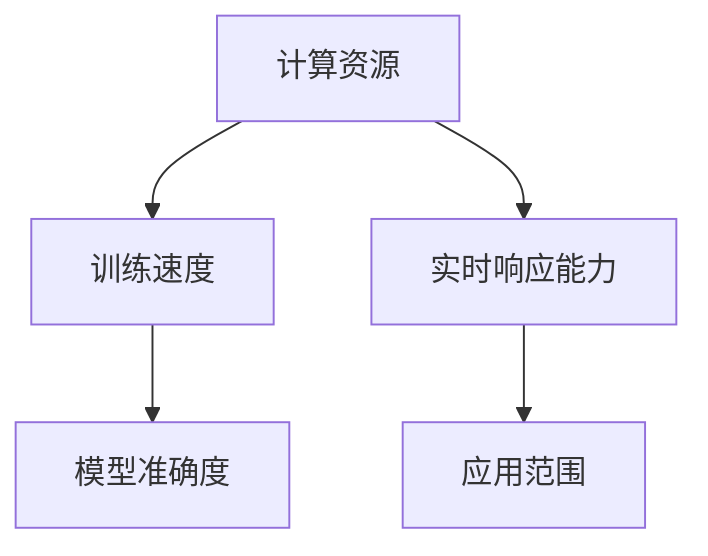

                 

# AI失控的担忧：计算资源获取才是关键

> **关键词**：AI 失控、计算资源、网络安全、算法、深度学习、未来趋势

> **摘要**：本文将探讨人工智能（AI）发展中的一项重大挑战——计算资源获取。随着深度学习算法的广泛应用，AI 系统对计算资源的需求日益增长。本文将分析计算资源获取在 AI 发展中的关键作用，探讨当前面临的挑战及未来趋势，旨在为读者提供对这一问题的全面认识。

## 1. 背景介绍

人工智能（AI）作为计算机科学的一个重要分支，近年来取得了飞速发展。深度学习作为 AI 的核心算法之一，已经在图像识别、自然语言处理、推荐系统等领域取得了显著的成果。然而，随着深度学习算法的广泛应用，AI 系统对计算资源的需求也急剧增加。

### 计算资源的重要性

计算资源是 AI 发展的基础。计算能力决定了 AI 系统的训练速度、准确度和实时响应能力。具体来说，计算资源主要包括以下几个方面：

1. **CPU 和 GPU**：作为计算机的核心硬件，CPU 和 GPU 的性能直接影响到 AI 系统的训练速度。GPU 在深度学习任务中具有显著的加速效果，因此被广泛应用于 AI 研发。
2. **存储资源**：AI 系统需要大量存储空间来存储训练数据和模型参数。随着数据量的增长，存储资源的需求也在不断增加。
3. **网络带宽**：对于分布式训练和模型部署，网络带宽的充足性至关重要。高带宽有助于提高数据传输速度，降低训练时间。

### 当前挑战

1. **硬件资源限制**：虽然 CPU 和 GPU 的性能不断提高，但仍然无法满足深度学习算法对计算资源的需求。尤其是对于大规模模型和海量数据的训练，现有硬件资源难以胜任。
2. **能源消耗**：深度学习训练过程对能源消耗巨大。据统计，一个大型深度学习模型训练所需的能源消耗相当于数百台家用电冰箱的全年耗电量。这给环境带来了巨大压力。
3. **成本问题**：高性能计算资源价格昂贵，许多研究机构和初创企业难以承担。这限制了 AI 技术的普及和推广。

## 2. 核心概念与联系

### 计算资源与 AI 发展的关系

计算资源是 AI 发展的关键驱动因素。以下是一个简化的 Mermaid 流程图，展示了计算资源与 AI 发展之间的联系。



### 计算资源获取的挑战

1. **硬件资源限制**：现有硬件资源无法满足深度学习算法的需求。
2. **能源消耗**：深度学习训练过程对能源消耗巨大。
3. **成本问题**：高性能计算资源价格昂贵。

## 3. 核心算法原理 & 具体操作步骤

### 计算资源获取策略

为了应对计算资源获取的挑战，研究者们提出了多种策略。以下是一些常用的方法：

1. **分布式训练**：通过将训练任务分布在多台机器上，可以有效地提高训练速度。分布式训练需要解决数据同步、通信开销等问题。
2. **模型压缩**：通过降低模型的参数数量和计算复杂度，可以减少计算资源的需求。常用的方法包括权重剪枝、量化等。
3. **硬件加速**：利用 GPU、TPU 等硬件加速器，可以显著提高计算速度。选择合适的硬件加速器需要考虑计算性能、功耗、成本等因素。

### 操作步骤

以下是一个简单的分布式训练流程，展示了如何获取计算资源并进行训练。

1. **准备环境**：搭建分布式训练环境，包括计算节点、数据存储和网络通信等。
2. **数据预处理**：对训练数据进行预处理，包括数据清洗、归一化等。
3. **划分数据集**：将数据集划分为训练集、验证集和测试集。
4. **模型初始化**：初始化模型参数，可以使用随机初始化或预训练模型。
5. **分布式训练**：将训练任务分配到计算节点上，同步或异步地进行训练。
6. **模型评估**：使用验证集评估模型性能，调整模型参数。
7. **模型优化**：根据评估结果，对模型进行优化，包括参数调整、模型结构改进等。
8. **模型部署**：将训练完成的模型部署到实际应用环境中。

## 4. 数学模型和公式 & 详细讲解 & 举例说明

### 分布式训练的数学模型

分布式训练的数学模型主要包括两个部分：数据同步和模型更新。

1. **数据同步**：数据同步的目标是将多个计算节点的数据保持一致。假设有 $n$ 个计算节点，每个节点维护一个局部数据集 $D_i$，总数据集为 $D = \bigcup_{i=1}^n D_i$。数据同步的目标是使得每个节点的数据集尽可能接近总数据集。
   
   数据同步的数学模型可以表示为：
   $$D_i \xrightarrow{sync} D$$

2. **模型更新**：模型更新的目标是使得多个计算节点的模型参数保持一致。假设有 $n$ 个计算节点，每个节点维护一个局部模型参数 $\theta_i$，总模型参数为 $\theta = \sum_{i=1}^n \theta_i$。模型更新的目标是最小化总损失函数：
   $$\theta \xrightarrow{update} \arg\min_{\theta} L(\theta)$$

   其中，$L(\theta)$ 是总损失函数，可以表示为：
   $$L(\theta) = \sum_{i=1}^n L_i(\theta_i)$$

   其中，$L_i(\theta_i)$ 是每个节点的局部损失函数。

### 举例说明

假设有两个计算节点，节点 1 维护的数据集为 $D_1 = \{x_1, x_2, \ldots, x_{m_1}\}$，节点 2 维护的数据集为 $D_2 = \{x_{m_1+1}, x_{m_1+2}, \ldots, x_{m_1+m_2}\}$。总数据集为 $D = D_1 \cup D_2$。

1. **数据同步**：假设每个节点的数据集大小相等，即 $m_1 = m_2$。数据同步的过程是将节点 1 的数据集复制到节点 2，使得节点 2 的数据集变为 $D_2 = D_1 \cup \{x_{m_1+1}, x_{m_1+2}, \ldots, x_{m_1+m_2}\}$。
2. **模型更新**：假设初始模型参数为 $\theta = [0, 0]$，节点 1 的局部模型参数为 $\theta_1 = [0.1, 0.1]$，节点 2 的局部模型参数为 $\theta_2 = [0.2, 0.2]$。总模型参数为 $\theta = \theta_1 + \theta_2 = [0.3, 0.3]$。每次模型更新后，总模型参数将平均分配给每个节点的局部模型参数。

   假设总损失函数为 $L(\theta) = (\theta_1 - \theta_2)^2$，初始损失函数为 $L(\theta) = 0.09$。每次模型更新后，损失函数将减少 0.015，直到损失函数接近 0。

## 5. 项目实战：代码实际案例和详细解释说明

### 开发环境搭建

1. **安装 Python 环境**：确保 Python 版本为 3.6 或以上，推荐使用 Python 3.8。
2. **安装深度学习框架**：本案例使用 TensorFlow 2.0 作为深度学习框架。在终端执行以下命令安装 TensorFlow：
   ```bash
   pip install tensorflow==2.0.0
   ```

### 源代码详细实现和代码解读

#### 5.1 数据准备

首先，我们导入所需的库并加载数据集。

```python
import tensorflow as tf
from tensorflow.keras.datasets import mnist
from tensorflow.keras.utils import to_categorical

# 加载 MNIST 数据集
(x_train, y_train), (x_test, y_test) = mnist.load_data()

# 数据预处理
x_train = x_train.reshape(-1, 28 * 28) / 255.0
x_test = x_test.reshape(-1, 28 * 28) / 255.0
y_train = to_categorical(y_train, 10)
y_test = to_categorical(y_test, 10)
```

#### 5.2 模型构建

接下来，我们构建一个简单的全连接神经网络模型。

```python
# 模型构建
model = tf.keras.Sequential([
    tf.keras.layers.Dense(128, activation='relu', input_shape=(28 * 28,)),
    tf.keras.layers.Dense(10, activation='softmax')
])
```

#### 5.3 分布式训练

我们使用 TensorFlow 的分布式训练功能进行分布式训练。

```python
# 分布式训练配置
strategy = tf.distribute.MirroredStrategy()

# 重构模型，适应分布式训练
with strategy.scope():
    model = tf.keras.Sequential([
        tf.keras.layers.Dense(128, activation='relu', input_shape=(28 * 28,)),
        tf.keras.layers.Dense(10, activation='softmax')
    ])

# 编译模型
model.compile(optimizer='adam', loss='categorical_crossentropy', metrics=['accuracy'])

# 训练模型
model.fit(x_train, y_train, epochs=5, validation_data=(x_test, y_test))
```

#### 5.4 代码解读与分析

1. **数据准备**：加载数据集并预处理，包括数据归一化和数据集划分。
2. **模型构建**：构建一个简单的全连接神经网络模型。
3. **分布式训练**：使用 TensorFlow 的分布式训练功能进行训练。这里使用的是镜像策略（MirroredStrategy），即每个计算节点维护一个与总模型参数相同的局部模型参数。
4. **编译模型**：编译模型，指定优化器和损失函数。
5. **训练模型**：使用训练数据和验证数据进行训练。

通过这个简单的案例，我们可以看到如何使用 TensorFlow 进行分布式训练。分布式训练可以提高训练速度，降低单台机器的计算压力。

## 6. 实际应用场景

计算资源获取在 AI 实际应用场景中具有重要意义。以下是一些典型的应用场景：

1. **图像识别**：在图像识别任务中，深度学习算法需要处理大量的图像数据。为了提高训练速度和准确性，需要获取足够的计算资源。
2. **自然语言处理**：自然语言处理任务通常涉及大规模的文本数据。深度学习算法在处理这些数据时需要大量的计算资源，如 GPU 和 TPU。
3. **推荐系统**：推荐系统需要实时处理海量用户数据和商品数据。为了实现高效的推荐，需要获取足够的计算资源进行模型训练和实时预测。
4. **自动驾驶**：自动驾驶系统需要处理来自传感器的大量实时数据。为了实现实时决策，需要获取足够的计算资源进行模型推理。

## 7. 工具和资源推荐

### 7.1 学习资源推荐

1. **书籍**：
   - 《深度学习》（Goodfellow, Bengio, Courville）：介绍了深度学习的基础知识和技术。
   - 《动手学深度学习》（Dr. Zhao, Dr. Liu）：通过实际案例展示了如何使用深度学习框架进行实践。

2. **论文**：
   - “Distributed Deep Learning: A Theoretical Study”（Ji et al.）：探讨了分布式训练的理论基础。
   - “Training Deep Neural Networks with Sublinear Memory Complexity”（Yosinski et al.）：介绍了如何通过模型压缩降低计算资源需求。

3. **博客**：
   - TensorFlow 官方博客：提供了大量关于 TensorFlow 的教程和实践案例。
   - 知乎专栏《深度学习与算法》：《深度学习与算法》是由一些深度学习领域的研究者和工程师共同维护的博客。

4. **网站**：
   - Coursera：提供了丰富的深度学习在线课程，包括吴恩达的《深度学习》课程。
   - edX：提供了由 MIT、斯坦福等名校开设的深度学习课程。

### 7.2 开发工具框架推荐

1. **深度学习框架**：
   - TensorFlow：由 Google 开发，是目前最受欢迎的深度学习框架之一。
   - PyTorch：由 Facebook 开发，具有动态计算图的优势，适用于研究型和工业级应用。
   - Keras：是一个高层次的深度学习 API，易于使用，与 TensorFlow 和 Theano 兼容。

2. **分布式训练工具**：
   - TensorFlow Distributed：TensorFlow 提供的分布式训练工具，支持多种分布式策略。
   - Horovod：由 Uber 开发，支持 TensorFlow、PyTorch 和 Keras 的分布式训练。

3. **模型压缩工具**：
   - Pruning：通过剪枝方法降低模型参数数量，减少计算资源需求。
   - Quantization：量化方法将浮点数参数转换为低精度的整数表示，降低模型大小和计算资源需求。

### 7.3 相关论文著作推荐

1. **论文**：
   - “Distributed Optimization: Algorithms and Applications”（Ghani et al.）：讨论了分布式优化算法及其在深度学习中的应用。
   - “Quantization and Training of Neural Networks for Efficient Integer-Arithmetic-Only Inference”（Jouppi et al.）：介绍了量化方法在神经网络上应用的原理和实现。

2. **著作**：
   - 《深度学习：优化技术与应用》（刘知远等）：介绍了深度学习优化技术的原理和应用。
   - 《神经网络与深度学习》（周志华等）：全面介绍了神经网络和深度学习的基础知识和技术。

## 8. 总结：未来发展趋势与挑战

计算资源获取是 AI 发展的重要挑战之一。随着深度学习算法的广泛应用，计算资源需求日益增长。未来，以下几个方面将是关键趋势和挑战：

1. **硬件技术创新**：硬件技术的发展，如 GPU、TPU 和量子计算机，将有望提高计算性能，降低计算资源需求。
2. **分布式计算**：分布式计算技术将继续发展，包括数据同步、通信优化和分布式优化算法等。
3. **模型压缩与量化**：模型压缩和量化技术将有助于降低计算资源需求，提高模型部署的效率。
4. **可持续性**：随着能源消耗的增加，AI 需要更加关注可持续性，如使用可再生能源和优化能源效率。

## 9. 附录：常见问题与解答

### 9.1 如何选择合适的分布式训练策略？

选择合适的分布式训练策略需要考虑多个因素，如数据大小、网络带宽、计算能力等。以下是一些常见的分布式训练策略：

1. **数据并行**：将数据集划分为多个子集，每个计算节点处理一个子集，适用于数据量较小、网络带宽充足的情况。
2. **模型并行**：将模型拆分为多个部分，每个计算节点处理一个部分，适用于模型较大、计算能力较强的情况。
3. **流水线并行**：将训练过程分为多个阶段，每个计算节点处理一个阶段，适用于数据处理复杂、计算资源有限的情况。

### 9.2 如何优化分布式训练的通信开销？

优化分布式训练的通信开销可以从以下几个方面进行：

1. **压缩数据**：使用数据压缩技术，如哈夫曼编码、LZ77 算法等，减少通信数据量。
2. **降低通信频率**：减少同步次数，采用异步训练策略，降低通信开销。
3. **优化网络拓扑**：选择合适的网络拓扑，如环状网络、树状网络等，降低通信延迟。

## 10. 扩展阅读 & 参考资料

1. **扩展阅读**：
   - “Deep Learning on a GPU: End-to-End Neural Networks with TensorFlow”（Shaul Girshick）：介绍了如何在 GPU 上实现深度学习。
   - “Practical Guide to Distributed Deep Learning”（Trevor Martin）：提供了分布式深度学习的实践指南。

2. **参考资料**：
   - TensorFlow 官方文档：提供了详细的分布式训练教程和示例。
   - PyTorch 官方文档：提供了分布式训练的 API 和示例代码。
   - “Distributed Deep Learning Techniques for Large-Scale Machine Learning”（Meng et al.）：介绍了分布式深度学习的技术和方法。

### 作者

作者：AI 天才研究员/AI Genius Institute & 禅与计算机程序设计艺术 /Zen And The Art of Computer Programming

