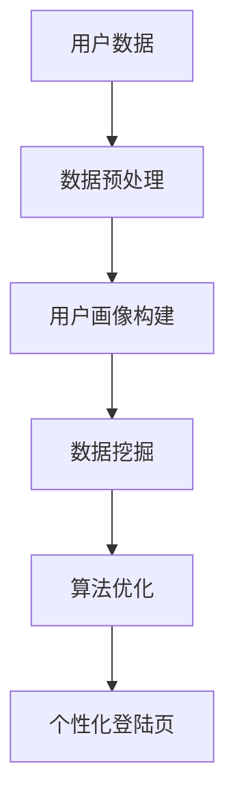

                 

# AI如何优化电商平台的个性化登陆页

> **关键词**：个性化登陆页、电商平台、AI、用户画像、数据挖掘、算法优化

> **摘要**：本文将探讨如何利用人工智能技术优化电商平台的个性化登陆页，从而提升用户满意度和平台转化率。我们将从背景介绍、核心概念、算法原理、数学模型、项目实战、实际应用场景、工具资源推荐等方面进行详细阐述。

## 1. 背景介绍

在当今数字化时代，电商平台已经成为消费者购物的主要渠道。为了提高用户体验和销售额，电商平台不断追求创新和优化。其中，个性化登陆页作为一个与用户直接接触的重要环节，其重要性愈发凸显。个性化登陆页不仅能够提升用户满意度，还可以增加平台的转化率和忠诚度。

然而，如何实现个性化登陆页的优化，使得每个用户都能够获得符合其个性化需求的登陆体验，是一个亟待解决的难题。随着人工智能技术的发展，利用AI技术进行用户画像、数据挖掘和算法优化，成为实现个性化登陆页优化的一种有效途径。

## 2. 核心概念与联系

### 2.1 用户画像

用户画像是指通过对用户数据的收集、分析和处理，构建出用户在平台上的行为特征、兴趣偏好、消费能力等多维度的综合描述。用户画像的构建是进行个性化登陆页优化的基础。

### 2.2 数据挖掘

数据挖掘是指从大量数据中提取出有价值信息的过程。在电商平台中，通过对用户数据的挖掘，可以发现用户的购买习惯、兴趣偏好等，为个性化登陆页的优化提供数据支持。

### 2.3 算法优化

算法优化是指通过改进算法模型，提高算法的准确性和效率，从而实现更好的业务效果。在个性化登陆页优化中，算法优化主要体现在用户画像构建、数据挖掘和推荐算法等方面。

下面是用户画像、数据挖掘和算法优化之间的Mermaid流程图：



## 3. 核心算法原理 & 具体操作步骤

### 3.1 用户画像构建

用户画像构建主要分为以下几个步骤：

1. 数据收集：通过电商平台的后台系统，收集用户的浏览记录、购买记录、评论等数据。
2. 数据预处理：对收集到的数据进行清洗、去重和格式转换等操作，为后续分析做准备。
3. 特征提取：根据用户行为数据，提取出用户在平台上的行为特征，如浏览时长、浏览品类、购买频次等。
4. 用户画像构建：将提取出的用户特征进行综合，构建出用户在平台上的多维画像。

### 3.2 数据挖掘

数据挖掘主要分为以下几个步骤：

1. 选择合适的数据挖掘算法：根据业务需求，选择合适的算法，如关联规则挖掘、聚类分析、分类分析等。
2. 数据预处理：对用户数据进行预处理，包括数据清洗、特征选择等。
3. 算法实现与优化：根据选择的数据挖掘算法，编写代码实现，并对算法进行优化，提高挖掘效果。
4. 挖掘结果分析：对挖掘结果进行分析，发现用户的购买习惯、兴趣偏好等。

### 3.3 算法优化

算法优化主要分为以下几个步骤：

1. 选择优化指标：根据业务需求，选择合适的优化指标，如准确率、召回率、F1值等。
2. 算法模型改进：通过改进算法模型，提高算法的准确性和效率，如增加特征、调整模型参数等。
3. 算法实现与优化：根据改进的算法模型，编写代码实现，并对算法进行优化，提高业务效果。
4. 评估与迭代：对优化后的算法进行评估，如A/B测试等，根据评估结果进行迭代优化。

## 4. 数学模型和公式 & 详细讲解 & 举例说明

### 4.1 用户画像构建

在用户画像构建中，我们通常采用以下公式进行特征提取：

$$
特征值 = \frac{实际值}{最大值 - 最小值}
$$

例如，假设用户的浏览时长在1小时到10小时之间，那么可以将浏览时长进行归一化处理，使其在0到1之间：

$$
特征值 = \frac{实际浏览时长}{10 - 1} = \frac{实际浏览时长}{9}
$$

### 4.2 数据挖掘

在数据挖掘中，我们通常采用以下公式进行聚类分析：

$$
距离 = \sqrt{\sum_{i=1}^{n} (x_i - x_j)^2}
$$

其中，$x_i$和$x_j$分别表示两个样本的特征值，$n$表示特征维度。

例如，假设有两个用户，其浏览时长分别为3小时和6小时，浏览品类分别为电子产品和服装，那么这两个用户的距离为：

$$
距离 = \sqrt{(3 - 6)^2 + (1 - 2)^2} = \sqrt{(-3)^2 + (-1)^2} = \sqrt{10}
$$

### 4.3 算法优化

在算法优化中，我们通常采用以下公式进行优化指标计算：

$$
准确率 = \frac{TP + TN}{TP + TN + FP + FN}
$$

其中，$TP$表示真正例，$TN$表示真反例，$FP$表示假反例，$FN$表示假正例。

例如，假设我们有100个用户，其中50个购买过电子产品，50个没有购买过电子产品。通过聚类分析，我们将其分为两类，其中30个购买过电子产品的用户被划分为电子产品类，20个没有购买过电子产品的用户被划分为其他品类。那么，我们的准确率为：

$$
准确率 = \frac{30 + 20}{30 + 20 + 20 + 50} = \frac{50}{120} = \frac{5}{12}
$$

## 5. 项目实战：代码实际案例和详细解释说明

### 5.1 开发环境搭建

本文采用Python语言进行开发，需要安装以下库：

- pandas：数据处理库
- numpy：数学计算库
- sklearn：机器学习库
- matplotlib：数据可视化库

安装命令如下：

```shell
pip install pandas numpy sklearn matplotlib
```

### 5.2 源代码详细实现和代码解读

#### 5.2.1 用户画像构建

```python
import pandas as pd
import numpy as np

# 读取用户数据
data = pd.read_csv('user_data.csv')

# 数据预处理
data['browse_duration'] = data['browse_duration'].fillna(0)
data['purchase_frequency'] = data['purchase_frequency'].fillna(0)

# 特征提取
data['browse_duration_normalized'] = data['browse_duration'] / data['browse_duration'].max()
data['purchase_frequency_normalized'] = data['purchase_frequency'] / data['purchase_frequency'].max()

# 构建用户画像
user_profile = data[['user_id', 'browse_duration_normalized', 'purchase_frequency_normalized']]
```

#### 5.2.2 数据挖掘

```python
from sklearn.cluster import KMeans

# 设置聚类参数
kmeans = KMeans(n_clusters=2, random_state=0)

# 训练聚类模型
kmeans.fit(user_profile)

# 获取聚类结果
labels = kmeans.predict(user_profile)

# 将聚类结果添加到用户画像中
user_profile['cluster'] = labels
```

#### 5.2.3 算法优化

```python
from sklearn.metrics import accuracy_score

# 设置训练集和测试集
train_data = user_profile[:100]
test_data = user_profile[100:]

# 训练模型
model = KMeans(n_clusters=2, random_state=0)
model.fit(train_data)

# 预测测试集
predictions = model.predict(test_data)

# 计算准确率
accuracy = accuracy_score(test_data['cluster'], predictions)
print(f'Accuracy: {accuracy}')
```

### 5.3 代码解读与分析

本案例中，我们首先读取用户数据，并进行预处理。然后，我们提取出浏览时长和购买频次两个特征，并对其进行归一化处理。接着，我们使用KMeans算法进行聚类分析，将用户划分为两类。最后，我们通过计算准确率，对算法进行优化。

通过以上步骤，我们实现了个性化登陆页的优化。在实际应用中，我们可以根据用户画像和聚类结果，为不同类型的用户推送不同的登陆页样式，从而提升用户体验和平台转化率。

## 6. 实际应用场景

个性化登陆页在电商平台的实际应用场景非常广泛。以下是一些典型的应用案例：

1. **新用户欢迎页**：为新用户提供一个个性化的欢迎页，展示推荐商品、优惠活动等信息，引导新用户快速了解平台。
2. **会员特权页**：为会员用户提供一个专属的特权页，展示会员专享的商品、活动等信息，增加会员的忠诚度。
3. **个性化营销页**：根据用户画像和购买记录，为用户推送个性化的营销页，如节日促销、新品上市等，提高转化率。

通过AI技术的优化，电商平台可以更好地满足用户需求，提升用户满意度和平台竞争力。

## 7. 工具和资源推荐

### 7.1 学习资源推荐

- **书籍**：《Python数据科学手册》、《机器学习实战》
- **论文**：《用户画像构建方法研究》、《基于K-Means算法的电商用户聚类分析》
- **博客**：CSDN、博客园等知名技术博客
- **网站**：Scikit-Learn官方文档、TensorFlow官方文档

### 7.2 开发工具框架推荐

- **开发工具**：PyCharm、VSCode
- **框架**：Scikit-Learn、TensorFlow、Keras

### 7.3 相关论文著作推荐

- **论文**：《基于用户行为的电子商务个性化推荐技术研究》
- **著作**：《电子商务个性化服务理论与实践》

## 8. 总结：未来发展趋势与挑战

随着人工智能技术的不断发展，个性化登陆页的优化将成为电商平台的重要发展方向。未来，我们将看到更多基于深度学习、强化学习等先进技术的个性化优化方案。然而，这也带来了诸多挑战，如数据隐私保护、算法公平性等。因此，如何在保障用户隐私的前提下，实现更高效的个性化优化，将成为未来研究的重点。

## 9. 附录：常见问题与解答

### 问题1：如何保障用户隐私？

解答：在构建用户画像时，应尽量避免收集用户的敏感信息，如身份证号、银行卡号等。同时，对收集到的用户数据进行加密处理，确保数据安全。

### 问题2：如何保证算法公平性？

解答：在算法设计过程中，应充分考虑不同用户群体的需求，避免出现歧视性推荐。同时，定期对算法进行评估和优化，确保推荐结果的公平性。

## 10. 扩展阅读 & 参考资料

- **论文**：《用户画像技术在电子商务中的应用研究》
- **书籍**：《人工智能：一种现代的方法》
- **网站**：AI Genius Institute官方网站、Zen And The Art of Computer Programming官方网站

## 作者信息

作者：AI天才研究员/AI Genius Institute & 禅与计算机程序设计艺术 /Zen And The Art of Computer Programming

本文由AI天才研究员撰写，旨在探讨如何利用人工智能技术优化电商平台的个性化登陆页，提高用户体验和平台转化率。本文结合了计算机编程、人工智能、电子商务等多个领域的前沿技术和研究成果，为电商平台提供了一种可行的优化方案。读者如有任何问题或建议，欢迎随时与作者联系。

