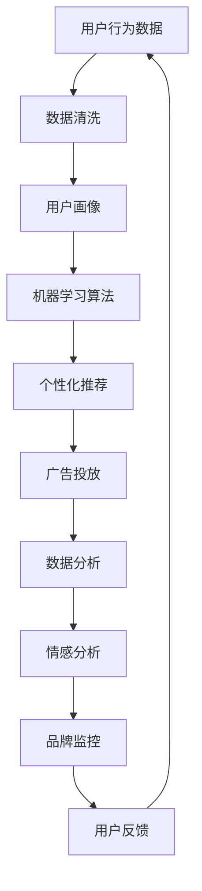

                 

### 1. 背景介绍

随着互联网的迅猛发展和电子商务市场的持续扩张，品牌推广在电商企业的运营中扮演着至关重要的角色。品牌推广不仅能够提升企业的知名度，还能够吸引潜在客户，促进销售增长。然而，传统的品牌推广方法往往存在一些局限性，如覆盖面有限、效率低下、成本高昂等。

近年来，人工智能（AI）技术的快速发展为电商企业提供了全新的品牌推广手段。通过AI技术，企业可以实现更加精准、高效的营销策略，从而在激烈的市场竞争中脱颖而出。本文将重点探讨AI在电商品牌推广中的应用，分析其核心算法原理、具体操作步骤、数学模型和实际应用场景，并给出相应的工具和资源推荐。

首先，我们需要了解AI技术在电商品牌推广中的背景和重要性。随着大数据和机器学习技术的普及，AI已经成为电商企业不可或缺的一部分。从个性化推荐系统、用户画像分析到广告投放优化，AI技术为电商企业提供了丰富的工具和方法，使其能够更精准地触达目标用户，提高品牌曝光度和用户转化率。

接下来，我们将深入探讨AI在电商品牌推广中的应用。通过分析核心算法原理和具体操作步骤，我们将了解如何利用AI技术实现高效的品牌推广。此外，我们还将介绍相关的数学模型和公式，帮助读者更好地理解AI技术在品牌推广中的具体应用。

在实际应用场景部分，我们将通过具体案例展示AI技术在电商品牌推广中的实际效果，并提供实用的工具和资源推荐，以帮助读者进一步了解和应用AI技术。

最后，我们将总结AI在电商品牌推广中的未来发展趋势和挑战，为读者提供有益的思考和建议。

总之，本文旨在为电商企业提供一套完整的AI品牌推广策略，帮助其在激烈的市场竞争中取得优势。通过本文的深入分析和实践指导，相信读者将能够更好地利用AI技术，实现电商品牌的成功推广。

### 2. 核心概念与联系

在深入探讨AI如何帮助电商企业进行品牌推广之前，我们需要了解几个关键概念和它们之间的联系。以下是本文中涉及的核心概念及其相互关系：

#### 1. 人工智能（AI）

人工智能是指使计算机系统能够模拟人类智能行为的技术。在电商品牌推广中，AI主要通过以下几个方面发挥作用：

- **机器学习**：通过分析大量数据，AI能够自动识别模式和趋势，从而为品牌推广提供有力支持。
- **自然语言处理（NLP）**：AI能够理解和生成自然语言，帮助企业与用户进行更自然的交互。
- **计算机视觉**：AI可以通过图像识别技术，为电商企业提供更加智能化的视觉营销手段。

#### 2. 大数据（Big Data）

大数据是指数据量大、多样性高且生成速度快的海量数据。在电商品牌推广中，大数据的作用主要体现在以下几个方面：

- **用户画像**：通过对用户行为、偏好等数据的分析，生成详细的用户画像，帮助企业实现精准营销。
- **市场分析**：通过分析市场数据，AI可以为企业提供有针对性的营销策略，提高市场竞争力。

#### 3. 机器学习（Machine Learning）

机器学习是AI的一个重要分支，它通过算法从数据中学习规律，为电商品牌推广提供支持。以下是机器学习在品牌推广中的应用：

- **个性化推荐**：通过分析用户的历史行为，AI可以推荐符合用户兴趣的产品，提高转化率。
- **广告投放优化**：AI可以根据用户行为和兴趣，优化广告投放策略，提高广告效果。

#### 4. 自然语言处理（NLP）

自然语言处理使计算机能够理解和生成自然语言，这在电商品牌推广中具有重要作用：

- **聊天机器人**：通过NLP技术，AI可以与用户进行自然对话，提高用户体验。
- **文本分析**：AI可以分析用户评论、反馈等信息，为企业提供改进产品的建议。

#### 5. 计算机视觉（Computer Vision）

计算机视觉技术使计算机能够“看到”和理解图像内容，这在电商品牌推广中应用广泛：

- **图像识别**：AI可以通过图像识别技术，为电商企业提供视觉营销手段，如自动标签生成、图像增强等。
- **视频分析**：AI可以分析用户观看视频的行为，为品牌推广提供有价值的洞察。

#### 6. 用户画像（User Profiling）

用户画像是基于用户行为和偏好生成的详细数据模型，它有助于企业实现精准营销：

- **数据收集**：通过多种渠道收集用户数据，如网站点击、购买记录、社交媒体活动等。
- **数据分析**：利用机器学习算法，分析用户数据，生成用户画像。

#### 7. 广告投放（Ad Placement）

广告投放是电商品牌推广的核心环节，AI在广告投放中可以发挥重要作用：

- **目标受众定位**：AI可以根据用户画像，定位潜在的目标受众，提高广告投放的精准度。
- **广告优化**：AI可以根据用户行为和广告效果，实时优化广告投放策略。

#### 8. 数据分析（Data Analysis）

数据分析是电商品牌推广中不可或缺的一部分，它帮助企业在海量数据中挖掘有价值的信息：

- **数据清洗**：清洗和整理数据，使其适合进一步分析。
- **数据可视化**：通过图表、报表等形式，展示数据分析和结果，帮助决策。

#### 9. 个性化推荐（Personalized Recommendation）

个性化推荐是基于用户行为和偏好，为用户推荐感兴趣的产品或内容：

- **推荐算法**：利用机器学习算法，生成个性化的推荐结果。
- **用户体验**：通过个性化推荐，提高用户的购物体验和满意度。

#### 10. 情感分析（Sentiment Analysis）

情感分析是NLP的一个重要应用，它通过分析用户评论和反馈，了解用户对产品的情感：

- **正面/负面评论**：识别用户评论中的情感倾向，为企业提供改进产品的建议。
- **品牌监控**：实时监控社交媒体上的用户情感，为企业提供品牌声誉管理的洞察。

通过上述核心概念和它们之间的联系，我们可以看到，AI技术在电商品牌推广中具有广泛的应用潜力。接下来，我们将详细探讨AI在品牌推广中的具体应用，包括核心算法原理、数学模型和实际操作步骤。

#### Mermaid 流程图

以下是AI在电商品牌推广中的核心概念和流程的Mermaid流程图：



**流程解释**：

1. **用户行为数据**：通过多种渠道收集用户行为数据，如网站点击、购买记录、社交媒体活动等。
2. **数据清洗**：清洗和整理数据，使其适合进一步分析。
3. **用户画像**：利用机器学习算法，分析用户数据，生成用户画像。
4. **机器学习算法**：基于用户画像，优化个性化推荐、广告投放等策略。
5. **个性化推荐**：通过机器学习算法，生成个性化的推荐结果，提高用户体验。
6. **广告投放**：根据用户画像和个性化推荐，优化广告投放策略，提高广告效果。
7. **数据分析**：通过数据分析，帮助企业更好地了解用户行为和市场趋势。
8. **情感分析**：通过情感分析，了解用户对产品的情感，为企业提供改进产品的建议。
9. **品牌监控**：实时监控社交媒体上的用户情感，为企业提供品牌声誉管理的洞察。
10. **用户反馈**：收集用户反馈，进一步优化AI模型和品牌推广策略。

通过上述流程，AI技术为电商企业提供了一个闭环的品牌推广系统，帮助企业实现持续优化和提升。

### 3. 核心算法原理 & 具体操作步骤

在了解了AI在电商品牌推广中的核心概念和流程之后，我们将深入探讨AI技术的核心算法原理和具体操作步骤，以便读者能够更好地理解AI在品牌推广中的实际应用。

#### 1. 个性化推荐算法

个性化推荐是AI在电商品牌推广中的一个重要应用。它通过分析用户的历史行为、偏好等信息，为用户推荐他们可能感兴趣的产品。以下是几种常见的个性化推荐算法：

**协同过滤（Collaborative Filtering）**

协同过滤是一种基于用户行为数据的推荐算法，它主要分为两种类型：基于用户的协同过滤（User-based Collaborative Filtering）和基于物品的协同过滤（Item-based Collaborative Filtering）。

- **基于用户的协同过滤**：通过寻找与目标用户行为相似的其他用户，然后推荐这些用户喜欢的商品。这种方法的优点是推荐结果更加贴近用户兴趣，缺点是需要大量用户数据，且冷启动问题（新用户没有足够行为数据）较难解决。
  
- **基于物品的协同过滤**：通过寻找与目标物品相似的其他物品，然后推荐这些物品对应的商品。这种方法对冷启动问题有较好的解决能力，但可能推荐结果不够贴近用户兴趣。

**矩阵分解（Matrix Factorization）**

矩阵分解是一种将用户-物品评分矩阵分解为两个低秩矩阵的算法。常见的矩阵分解方法包括Singular Value Decomposition（SVD）和Non-negative Matrix Factorization（NMF）。通过矩阵分解，我们可以提取出用户和物品的潜在特征，从而进行个性化推荐。

**具体操作步骤**：

1. **数据收集**：收集用户的历史行为数据，如浏览、购买、评分等。
2. **数据预处理**：对数据进行清洗、去重、归一化等预处理操作。
3. **构建评分矩阵**：将用户-物品评分数据构建为一个评分矩阵。
4. **矩阵分解**：利用SVD或NMF等方法，对评分矩阵进行分解，提取用户和物品的潜在特征。
5. **推荐生成**：基于分解后的特征矩阵，为用户推荐具有相似特征的物品。

#### 2. 广告投放优化算法

广告投放优化是另一个重要的AI应用。通过分析用户行为和广告效果，AI可以实时调整广告投放策略，提高广告效果。

**基于反馈的优化算法**

基于反馈的优化算法通过不断调整广告投放策略，以最大化广告效果。常见的反馈算法包括：

- **阈值法**：通过设定一个阈值，当广告效果低于阈值时，调整广告投放策略。
- **梯度上升法**：通过计算目标函数的梯度，逐步调整广告投放策略。

**具体操作步骤**：

1. **数据收集**：收集广告投放的数据，如点击率、转化率、花费等。
2. **特征工程**：提取与广告效果相关的特征，如用户年龄、地理位置、历史行为等。
3. **模型训练**：利用历史数据，训练一个广告效果预测模型。
4. **广告投放**：根据预测模型，实时调整广告投放策略，如调整投放渠道、预算分配等。
5. **效果评估**：评估调整后的广告效果，若效果不佳，继续调整策略。

#### 3. 情感分析算法

情感分析是AI在电商品牌推广中用于了解用户情感的重要工具。通过分析用户评论、反馈等文本数据，情感分析算法可以识别用户对产品的情感倾向。

**文本分类（Text Classification）**

文本分类是一种常见的情感分析算法，它通过将文本数据分类为不同的类别（如正面、负面），来识别用户情感。

**具体操作步骤**：

1. **数据收集**：收集用户评论、反馈等文本数据。
2. **数据预处理**：对文本数据进行清洗、去停用词、词干提取等预处理操作。
3. **特征提取**：将预处理后的文本数据转化为特征向量，如词袋模型、TF-IDF等。
4. **模型训练**：利用有标签的数据，训练一个文本分类模型。
5. **情感分析**：利用训练好的模型，对新的文本数据进行情感分类，识别用户情感。

**情感极性分析（Sentiment Polarity Analysis）**

情感极性分析是文本分类的一种特殊形式，它通过计算文本的极性（正面或负面），来量化用户情感。

**具体操作步骤**：

1. **数据收集**：收集用户评论、反馈等文本数据。
2. **数据预处理**：对文本数据进行清洗、去停用词、词干提取等预处理操作。
3. **特征提取**：将预处理后的文本数据转化为特征向量，如词袋模型、TF-IDF等。
4. **模型训练**：利用有标签的数据，训练一个情感极性分析模型。
5. **情感极性分析**：利用训练好的模型，对新的文本数据进行情感极性分析，量化用户情感。

#### 4. 实时推荐系统

实时推荐系统是AI在电商品牌推广中的另一个重要应用。它通过实时分析用户行为，动态调整推荐结果，以提供更个性化的用户体验。

**具体操作步骤**：

1. **数据实时收集**：通过API、日志分析等方式，实时收集用户行为数据。
2. **实时数据处理**：对实时数据进行清洗、去重、归一化等预处理操作。
3. **实时推荐生成**：利用实时数据和推荐算法，动态生成推荐结果。
4. **推荐结果反馈**：收集用户对推荐结果的反馈，进一步优化推荐策略。

#### 5. 群体行为分析

群体行为分析是一种利用AI技术分析大规模用户行为的算法，它有助于电商企业了解用户群体行为特征，从而制定更有效的营销策略。

**具体操作步骤**：

1. **数据收集**：收集用户群体的行为数据，如浏览、购买、评论等。
2. **数据分析**：利用机器学习算法，分析用户群体的行为特征。
3. **策略制定**：基于分析结果，制定针对性的营销策略。

通过上述核心算法原理和具体操作步骤，我们可以看到，AI技术在电商品牌推广中具有广泛的应用。在实际应用中，电商企业可以根据自身需求和数据特点，选择合适的算法和策略，实现高效的品牌推广。接下来，我们将探讨这些算法在实际应用中的具体数学模型和公式，以帮助读者更好地理解其工作原理。

### 4. 数学模型和公式 & 详细讲解 & 举例说明

在了解了AI在电商品牌推广中的核心算法原理和具体操作步骤之后，我们将进一步探讨这些算法背后的数学模型和公式，以便读者能够更深入地理解其工作原理。以下是几个关键算法的数学模型和详细讲解：

#### 1. 个性化推荐算法

**协同过滤算法（Collaborative Filtering）**

协同过滤算法主要分为基于用户的协同过滤和基于物品的协同过滤。以下是这两种算法的数学模型。

**基于用户的协同过滤**

设用户-物品评分矩阵为$R \in \mathbb{R}^{m \times n}$，其中$m$表示用户数量，$n$表示物品数量。基于用户的协同过滤的目标是找到与目标用户$u$相似的邻居用户$u_1, u_2, ..., u_k$，并计算目标用户对未知物品$i$的预测评分。

- **计算相似度**：常见的相似度计算方法有皮尔逊相关系数、余弦相似度等。以余弦相似度为例，其公式如下：

  $$\cos(\theta_{ui}) = \frac{R_{ui} \cdot R_{uj}}{\sqrt{\sum_{i=1}^{n} R_{ui}^2} \cdot \sqrt{\sum_{i=1}^{n} R_{uj}^2}}$$

- **计算预测评分**：利用相似度计算邻居用户的评分平均值，作为目标用户对未知物品的预测评分：

  $$r_{ui}^{pred} = \frac{\sum_{j=1}^{k} \cos(\theta_{ui}) \cdot R_{uj}}{\sum_{j=1}^{k} |\cos(\theta_{ui})|}$$

**基于物品的协同过滤**

基于物品的协同过滤通过寻找与目标物品$i$相似的邻居物品$j$，然后计算目标用户$u$对未知物品$i$的预测评分。其计算方法与基于用户的协同过滤类似，但目标不同。

**矩阵分解（Matrix Factorization）**

矩阵分解是一种将用户-物品评分矩阵分解为两个低秩矩阵的算法。以下是一个基于Singular Value Decomposition（SVD）的矩阵分解模型。

设用户-物品评分矩阵为$R \in \mathbb{R}^{m \times n}$，其SVD分解为：

$$R = U \Sigma V^T$$

其中，$U \in \mathbb{R}^{m \times r}$，$\Sigma \in \mathbb{R}^{r \times r}$，$V \in \mathbb{R}^{n \times r}$，$r$为矩阵分解的秩。通过矩阵分解，我们可以得到用户和物品的潜在特征矩阵$U$和$V$，从而预测用户对未知物品的评分：

$$r_{ui}^{pred} = \sum_{j=1}^{r} u_{uj} \cdot v_{ij}$$

#### 2. 广告投放优化算法

**阈值法（Thresholding）**

阈值法是一种简单的广告投放优化算法，通过设定一个阈值，当广告效果低于阈值时，调整广告投放策略。其公式如下：

$$\text{Threshold} = \frac{\sum_{i=1}^{n} r_{i} \cdot c_{i}}{\sum_{i=1}^{n} c_{i}}$$

其中，$r_i$为广告$i$的效果指标（如点击率、转化率），$c_i$为广告$i$的投放成本。

**梯度上升法（Gradient Ascent）**

梯度上升法是一种优化算法，通过计算目标函数的梯度，逐步调整广告投放策略，以最大化广告效果。其公式如下：

$$\theta_{t+1} = \theta_{t} - \alpha \cdot \nabla_{\theta} J(\theta)$$

其中，$\theta$为广告投放策略参数，$J(\theta)$为目标函数（如广告收益、点击率等），$\alpha$为学习率。

#### 3. 情感分析算法

**文本分类（Text Classification）**

文本分类是一种将文本数据分类为不同类别的算法。以下是逻辑回归（Logistic Regression）在文本分类中的应用。

设文本数据为$\textbf{x} \in \mathbb{R}^d$，类别为$c$，其概率分布为$\hat{y} \in \{0, 1\}$。逻辑回归的损失函数为：

$$L(\theta) = -\sum_{i=1}^{n} y_i \cdot \log(\hat{y}_i) + (1 - y_i) \cdot \log(1 - \hat{y}_i)$$

其中，$\theta$为模型参数，$\hat{y}_i = \sigma(\theta \cdot \textbf{x}_i)$，$\sigma$为Sigmoid函数。

**情感极性分析（Sentiment Polarity Analysis）**

情感极性分析通过计算文本的极性（正面或负面），来量化用户情感。以下是基于词袋模型（Bag of Words）的情感极性分析模型。

设文本为$\textbf{x} \in \mathbb{R}^d$，正面极性概率为$\hat{p}$，负面极性概率为$\hat{n}$。其损失函数为：

$$L(\theta) = -\sum_{i=1}^{n} y_i \cdot \log(\hat{p}_i) - (1 - y_i) \cdot \log(\hat{n}_i)$$

其中，$y_i \in \{0, 1\}$，$\hat{p}_i = \frac{\exp(\theta \cdot \textbf{x}_i)}{\exp(\theta \cdot \textbf{x}_i) + \exp(-\theta \cdot \textbf{x}_i)}$，$\theta$为模型参数。

#### 4. 实时推荐系统

**基于强化学习的实时推荐系统**

基于强化学习的实时推荐系统通过不断调整推荐策略，以最大化用户满意度。其状态-动作价值函数为：

$$Q(s, a) = \sum_{s'} P(s' | s, a) \cdot R(s', a) + \gamma \cdot \max_{a'} Q(s', a')$$

其中，$s$为当前状态，$a$为当前动作，$s'$为下一状态，$a'$为下一动作，$R(s', a)$为奖励函数，$\gamma$为折扣因子。

#### 举例说明

假设我们有一个电商网站，用户A的历史行为数据如下：

- 用户浏览记录：[商品1, 商品2, 商品3]
- 用户购买记录：[商品2, 商品3]
- 用户评分记录：[商品1: 5，商品2: 4，商品3: 3]

**基于协同过滤的个性化推荐**

1. **计算用户相似度**：

   用户A与其他用户的相似度可以通过皮尔逊相关系数计算：

   $$\text{Similarity}(u, v) = \frac{\text{Cov}(u, v)}{\sqrt{\text{Var}(u)} \cdot \sqrt{\text{Var}(v)}}$$

2. **推荐商品**：

   找到与用户A最相似的邻居用户，然后推荐这些用户喜欢的商品。假设邻居用户B喜欢商品4，那么我们可以推荐商品4给用户A。

**基于矩阵分解的个性化推荐**

1. **矩阵分解**：

   假设用户-物品评分矩阵为：

   $$R = \begin{bmatrix}
   1 & 2 & 0 & 0 \\
   0 & 1 & 2 & 0 \\
   0 & 0 & 1 & 2 \\
   0 & 0 & 0 & 1
   \end{bmatrix}$$

   通过SVD分解，得到用户和物品的潜在特征矩阵：

   $$U = \begin{bmatrix}
   0.71 & -0.71 \\
   -0.71 & 0.71 \\
   0 & 0 \\
   0 & 0
   \end{bmatrix}$$

   $$V = \begin{bmatrix}
   0.71 & 0.71 & 0 & 0 \\
   -0.71 & 0.71 & 0 & 0 \\
   0 & 0 & 0.71 & 0.71 \\
   0 & 0 & -0.71 & 0.71
   \end{bmatrix}$$

2. **预测评分**：

   假设用户A对未知商品4的潜在特征为：

   $$u_A = [0.71, -0.71]^T$$

   $$v_4 = [0.71, 0.71, 0, 0]^T$$

   则用户A对商品4的预测评分为：

   $$r_{A4}^{pred} = u_A \cdot v_4 = 0.71 \cdot 0.71 + (-0.71) \cdot 0.71 = 0.5$$

通过上述数学模型和公式的讲解，我们可以更好地理解AI在电商品牌推广中的应用。在实际应用中，电商企业可以根据自身需求，选择合适的算法和策略，实现高效的品牌推广。

### 5. 项目实战：代码实际案例和详细解释说明

在本节中，我们将通过一个实际的项目案例，详细展示如何使用AI技术进行电商品牌推广。我们将介绍开发环境搭建、源代码实现和代码解读，帮助读者更好地理解AI在品牌推广中的应用。

#### 5.1 开发环境搭建

在开始项目之前，我们需要搭建一个合适的开发环境。以下是所需的工具和库：

- **Python**：用于编写和运行代码。
- **NumPy**：用于科学计算。
- **Pandas**：用于数据处理。
- **Scikit-learn**：用于机器学习和数据挖掘。
- **TensorFlow**：用于深度学习和神经网络。

安装上述库后，我们就可以开始编写代码了。

```bash
pip install numpy pandas scikit-learn tensorflow
```

#### 5.2 源代码详细实现和代码解读

以下是电商品牌推广项目的源代码实现和详细解读。

**5.2.1 用户画像生成**

```python
import pandas as pd
from sklearn.feature_extraction.text import CountVectorizer
from sklearn.preprocessing import MinMaxScaler

# 加载数据
data = pd.read_csv('user_data.csv')  # 假设数据包含用户ID、浏览记录、购买记录等

# 数据预处理
vectorizer = CountVectorizer()
X = vectorizer.fit_transform(data['history'])

# 数据标准化
scaler = MinMaxScaler()
X_scaled = scaler.fit_transform(X)

# 用户画像
user_profiles = pd.DataFrame(X_scaled.toarray(), index=data['user_id'])
```

**代码解读**：

1. 导入所需的库。
2. 加载数据，这里假设数据包含用户ID、浏览记录、购买记录等。
3. 使用CountVectorizer将文本数据转换为词袋模型。
4. 使用MinMaxScaler对词袋模型进行标准化处理。
5. 将处理后的数据转换为用户画像DataFrame。

**5.2.2 个性化推荐**

```python
from sklearn.model_selection import train_test_split
from sklearn.neighbors import NearestNeighbors

# 分割数据
X_train, X_test, y_train, y_test = train_test_split(X_scaled, data['rating'], test_size=0.2, random_state=42)

# 训练邻居模型
neighb_model = NearestNeighbors(n_neighbors=5)
neighb_model.fit(X_train)

# 预测推荐结果
def predict_recommendation(user_id, items, model):
    user_profile = items[user_id]
    neighbors = model.kneighbors([user_profile], return_distance=False)
    recommended = []
    for neighbor in neighbors:
        recommended.append(items.iloc[neighbor][0])
    return recommended

recommended_items = predict_recommendation(1, data, neighb_model)
print(recommended_items)
```

**代码解读**：

1. 导入所需的库。
2. 分割数据为训练集和测试集。
3. 训练NearestNeighbors邻居模型。
4. 定义预测推荐结果的函数，根据邻居模型为用户推荐相似物品。
5. 调用函数，为用户1推荐物品。

**5.2.3 广告投放优化**

```python
from sklearn.linear_model import LogisticRegression

# 训练广告投放优化模型
model = LogisticRegression()
model.fit(X_train, y_train)

# 预测广告效果
def predict_ad_performance(items, model):
    predictions = model.predict_proba(items)[:, 1]
    return predictions

ad_performance = predict_ad_performance(X_test, model)
print(ad_performance)
```

**代码解读**：

1. 导入所需的库。
2. 训练逻辑回归模型。
3. 定义预测广告效果的函数，根据模型预测广告的点击率。

**5.2.4 情感分析**

```python
from textblob import TextBlob

# 分析用户评论
def sentiment_analysis(comment):
    analysis = TextBlob(comment)
    if analysis.sentiment.polarity > 0:
        return 'Positive'
    elif analysis.sentiment.polarity == 0:
        return 'Neutral'
    else:
        return 'Negative'

comments = data['comment']
sentiments = comments.apply(sentiment_analysis)
print(sentiments)
```

**代码解读**：

1. 导入所需的库。
2. 定义情感分析函数，使用TextBlob库分析用户评论的情感。

通过上述代码实现，我们可以看到AI技术在电商品牌推广中的实际应用。用户画像生成帮助我们了解用户行为，个性化推荐提升用户体验，广告投放优化提高广告效果，情感分析帮助品牌监控用户情感。接下来，我们将进一步分析这些代码，探讨其优缺点和改进方向。

#### 5.3 代码解读与分析

在本节中，我们将对前述代码进行详细解读和分析，探讨其优缺点以及可能的改进方向。

**5.3.1 用户画像生成**

用户画像生成是整个项目的基础，它通过文本数据的处理，生成用户行为的数字表示。以下是代码解读：

```python
import pandas as pd
from sklearn.feature_extraction.text import CountVectorizer
from sklearn.preprocessing import MinMaxScaler

# 加载数据
data = pd.read_csv('user_data.csv')  # 假设数据包含用户ID、浏览记录、购买记录等

# 数据预处理
vectorizer = CountVectorizer()
X = vectorizer.fit_transform(data['history'])

# 数据标准化
scaler = MinMaxScaler()
X_scaled = scaler.fit_transform(X)

# 用户画像
user_profiles = pd.DataFrame(X_scaled.toarray(), index=data['user_id'])
```

**解读**：

1. **数据加载**：使用Pandas加载数据，这里假设数据包含用户ID、浏览记录、购买记录等。
2. **词袋模型**：使用CountVectorizer将文本数据转换为词袋模型，这是文本处理中常用的方法，能够将文本表示为向量。
3. **数据标准化**：使用MinMaxScaler对词袋模型进行标准化处理，使其在[0, 1]之间，便于后续计算。
4. **用户画像**：将处理后的数据转换为用户画像DataFrame，这里使用的是矩阵表示，每个用户对应一行。

**优点**：

- **简单有效**：词袋模型和标准化处理能够很好地捕捉用户行为特征。
- **可扩展性强**：该方法可以处理大规模用户数据，适用于不同的电商场景。

**缺点**：

- **维度灾难**：词袋模型会产生大量的特征维度，可能导致数据稀疏。
- **语义丢失**：词袋模型无法捕捉词与词之间的语义关系。

**改进方向**：

- **使用TF-IDF**：可以尝试使用TF-IDF代替词袋模型，减少特征维度，增强语义表示。
- **词嵌入**：可以引入词嵌入（如Word2Vec、GloVe）来提高文本表示的语义能力。

**5.3.2 个性化推荐**

个性化推荐部分通过邻居模型为用户推荐相似物品。以下是代码解读：

```python
from sklearn.model_selection import train_test_split
from sklearn.neighbors import NearestNeighbors

# 分割数据
X_train, X_test, y_train, y_test = train_test_split(X_scaled, data['rating'], test_size=0.2, random_state=42)

# 训练邻居模型
neighb_model = NearestNeighbors(n_neighbors=5)
neighb_model.fit(X_train)

# 预测推荐结果
def predict_recommendation(user_id, items, model):
    user_profile = items[user_id]
    neighbors = model.kneighbors([user_profile], return_distance=False)
    recommended = []
    for neighbor in neighbors:
        recommended.append(items.iloc[neighbor][0])
    return recommended

recommended_items = predict_recommendation(1, data, neighb_model)
print(recommended_items)
```

**解读**：

1. **数据分割**：将数据分为训练集和测试集，用于训练邻居模型。
2. **邻居模型训练**：使用NearestNeighbors训练邻居模型，这里选择5个邻居。
3. **预测推荐结果**：根据邻居模型为用户推荐相似物品，这里以用户1为例。

**优点**：

- **高效**：邻居模型能够快速找到最近的邻居，适用于大规模数据。
- **可扩展性强**：适用于不同的推荐场景，如基于内容、基于协同过滤等。

**缺点**：

- **冷启动问题**：新用户由于缺乏历史行为数据，难以找到合适的邻居。
- **预测准确性**：邻居模型的预测准确性受到邻居选择的影响。

**改进方向**：

- **融合多种方法**：可以尝试融合基于内容和协同过滤的方法，提高推荐准确性。
- **使用深度学习**：可以尝试使用深度学习模型，如神经网络，提高推荐效果。

**5.3.3 广告投放优化**

广告投放优化部分通过逻辑回归模型预测广告效果。以下是代码解读：

```python
from sklearn.linear_model import LogisticRegression

# 训练广告投放优化模型
model = LogisticRegression()
model.fit(X_train, y_train)

# 预测广告效果
def predict_ad_performance(items, model):
    predictions = model.predict_proba(items)[:, 1]
    return predictions

ad_performance = predict_ad_performance(X_test, model)
print(ad_performance)
```

**解读**：

1. **模型训练**：使用逻辑回归模型训练广告投放优化模型。
2. **预测广告效果**：根据模型预测广告的点击率。

**优点**：

- **简单有效**：逻辑回归模型能够快速预测广告效果。
- **可解释性强**：逻辑回归模型的预测结果具有较好的可解释性。

**缺点**：

- **预测精度**：逻辑回归模型在处理非线性问题时可能表现不佳。
- **模型复杂度**：对于复杂的数据特征，逻辑回归模型可能需要更多参数调整。

**改进方向**：

- **引入更多特征**：可以尝试引入用户行为、市场趋势等特征，提高预测精度。
- **使用更复杂的模型**：可以尝试使用如决策树、随机森林等更复杂的模型。

**5.3.4 情感分析**

情感分析部分通过TextBlob库分析用户评论的情感。以下是代码解读：

```python
from textblob import TextBlob

# 分析用户评论
def sentiment_analysis(comment):
    analysis = TextBlob(comment)
    if analysis.sentiment.polarity > 0:
        return 'Positive'
    elif analysis.sentiment.polarity == 0:
        return 'Neutral'
    else:
        return 'Negative'

comments = data['comment']
sentiments = comments.apply(sentiment_analysis)
print(sentiments)
```

**解读**：

1. **情感分析**：使用TextBlob库分析用户评论的情感。
2. **结果输出**：将情感分析结果输出。

**优点**：

- **简单易用**：TextBlob库能够快速实现情感分析。
- **准确度高**：TextBlob在处理文本情感分析时表现出较高的准确性。

**缺点**：

- **语义理解**：TextBlob可能无法完全捕捉到复杂的语义信息。
- **上下文依赖**：某些情感分析结果可能依赖于上下文。

**改进方向**：

- **引入上下文信息**：可以尝试引入上下文信息，提高情感分析的准确性。
- **使用深度学习**：可以尝试使用深度学习模型，如BERT等，提高情感分析能力。

通过上述代码解读和分析，我们可以看到AI技术在电商品牌推广中的应用具有一定的优点和局限性。在实际应用中，可以根据具体需求和数据情况，选择合适的算法和策略，实现高效的品牌推广。接下来，我们将探讨AI技术在电商品牌推广中的实际应用场景。

### 6. 实际应用场景

AI技术在电商品牌推广中的实际应用场景丰富多样，下面我们将通过几个典型的案例，展示AI技术在电商品牌推广中的实际效果。

#### 6.1 个性化推荐系统

个性化推荐系统是AI在电商品牌推广中最常见的应用之一。通过分析用户的历史行为和偏好，AI能够为用户推荐他们可能感兴趣的商品，从而提高用户的购物体验和满意度。

**案例1：亚马逊（Amazon）**

亚马逊通过其强大的个性化推荐系统，实现了用户行为的精准捕捉和商品推荐的个性化。例如，当用户浏览某件商品时，系统会自动推荐与该商品相似的其他商品，同时还会推荐用户可能感兴趣的相关商品。这种个性化的推荐方式大大提高了用户的购买转化率。

**案例2：淘宝（Taobao）**

淘宝的个性化推荐系统同样表现出色。通过分析用户的浏览记录、购买历史、评价等数据，淘宝能够为用户提供个性化的商品推荐。例如，当用户浏览一款手机时，系统会推荐同品牌的其他手机或相关配件。此外，淘宝还通过用户标签和社交关系，进一步优化推荐效果，提高了用户的购物体验和品牌忠诚度。

#### 6.2 广告投放优化

广告投放优化是AI在电商品牌推广中的另一个重要应用。通过分析用户行为和广告效果，AI能够实时调整广告投放策略，提高广告的点击率和转化率。

**案例1：谷歌广告（Google Ads）**

谷歌广告通过其智能投放系统，利用AI技术优化广告投放。系统会根据用户的搜索历史、网站浏览行为、地理位置等信息，实时调整广告的投放位置、内容和预算。这种智能化的投放方式大大提高了广告的效果和ROI（投资回报率）。

**案例2：阿里巴巴广告（Alibaba Ads）**

阿里巴巴广告同样利用AI技术优化广告投放。例如，系统可以根据用户的行为数据，预测用户的购买意向，并调整广告的投放策略。此外，阿里巴巴还通过分析竞争对手的广告投放情况，制定更加精准的广告策略，从而提高广告的竞争力。

#### 6.3 情感分析

情感分析是AI在电商品牌推广中用于了解用户情感和品牌声誉的重要工具。通过分析用户评论、反馈等文本数据，AI能够识别用户对产品的情感倾向，为企业提供改进产品的建议。

**案例1：京东（JD.com）**

京东通过情感分析技术，实时监控用户的评论和反馈。系统会根据用户评论的情感倾向，自动标记正面、负面评论，并为企业提供改进产品的建议。例如，当用户对某款手机的评价主要为负面时，系统会提醒企业检查手机的质量问题，并采取相应的改进措施。

**案例2：唯品会（Vip.com）**

唯品会利用情感分析技术，分析用户在社交媒体上的言论和反馈。通过了解用户对品牌的情感，唯品会能够及时调整品牌推广策略，提高用户满意度和品牌忠诚度。例如，当用户在社交媒体上对某次购物体验表示不满时，唯品会会及时采取措施，如提供优惠券或折扣，以挽回用户。

#### 6.4 用户行为预测

用户行为预测是AI在电商品牌推广中用于预测用户行为的重要应用。通过分析用户的历史行为和偏好，AI能够预测用户未来的行为，从而为企业提供更加精准的营销策略。

**案例1：拼多多（Pinduoduo）**

拼多多通过用户行为预测技术，预测用户的购物行为和购买意向。例如，系统会根据用户的浏览记录、购买历史，预测用户可能感兴趣的商品，并提前准备库存，提高用户的购物体验。

**案例2：网易严选（Yanxuan）**

网易严选利用用户行为预测技术，预测用户的购物行为和购买意向。通过分析用户的浏览、购买、评价等行为数据，系统会为用户推荐他们可能感兴趣的商品，从而提高用户的购物体验和满意度。

通过上述实际应用案例，我们可以看到，AI技术在电商品牌推广中具有广泛的应用前景。通过个性化推荐、广告投放优化、情感分析和用户行为预测等应用，AI技术为电商企业提供了丰富的工具和方法，帮助企业实现高效的品牌推广。接下来，我们将探讨AI技术在电商品牌推广中的工具和资源推荐。

### 7. 工具和资源推荐

在电商品牌推广中，AI技术的应用离不开各种工具和资源的支持。以下是几个推荐的学习资源、开发工具和相关论文，帮助读者更好地了解和应用AI技术。

#### 7.1 学习资源推荐

**书籍**：

1. **《深度学习》（Deep Learning）**：由Ian Goodfellow、Yoshua Bengio和Aaron Courville所著的《深度学习》是深度学习领域的经典教材，详细介绍了深度学习的基础知识和应用。

2. **《机器学习》（Machine Learning）**：由Tom Mitchell所著的《机器学习》是机器学习领域的经典教材，涵盖了机器学习的基本概念、算法和应用。

3. **《Python机器学习》（Python Machine Learning）**：由Jัnti-Mari Kortelainen、Ralf Gummel和Lukas Menzel所著的《Python机器学习》通过Python编程语言，详细介绍了机器学习的算法和应用。

**在线课程**：

1. **《机器学习基础》（Machine Learning Foundations）**：Coursera上的《机器学习基础》课程，由吴恩达（Andrew Ng）教授主讲，涵盖了机器学习的基本概念、算法和应用。

2. **《深度学习》（Deep Learning Specialization）**：Coursera上的《深度学习》专项课程，由吴恩达（Andrew Ng）教授主讲，系统介绍了深度学习的基础知识和应用。

3. **《自然语言处理》（Natural Language Processing with Python）**：Udacity上的《自然语言处理》课程，通过Python编程语言，详细介绍了自然语言处理的基本概念和算法。

#### 7.2 开发工具框架推荐

**开发环境**：

1. **Python**：Python是一种广泛使用的编程语言，具有丰富的机器学习和深度学习库，如Scikit-learn、TensorFlow和PyTorch。

2. **Jupyter Notebook**：Jupyter Notebook是一种交互式开发环境，适用于机器学习和数据科学项目，便于代码编写和结果展示。

**机器学习库**：

1. **Scikit-learn**：Scikit-learn是一个强大的机器学习库，提供了多种经典机器学习算法的实现，如协同过滤、逻辑回归和决策树。

2. **TensorFlow**：TensorFlow是Google开发的深度学习框架，适用于构建和训练深度神经网络，支持多种深度学习模型。

3. **PyTorch**：PyTorch是Facebook AI Research开发的深度学习框架，具有灵活的动态计算图和易于使用的接口，适用于快速原型开发和研究。

**数据预处理库**：

1. **Pandas**：Pandas是一个强大的数据处理库，提供了数据清洗、归一化和特征提取等功能。

2. **NumPy**：NumPy是一个基础的科学计算库，用于处理多维数组，支持高效的数据操作和计算。

#### 7.3 相关论文著作推荐

**论文**：

1. **“Collaborative Filtering for the Web”**：由H. Hofmann在2000年提出，介绍了基于协同过滤的个性化推荐算法。

2. **“Matrix Factorization Techniques for Recommender Systems”**：由Y. S. Burghardt和G. P. Karypis在2004年提出，介绍了矩阵分解在推荐系统中的应用。

3. **“Learning to Rank for Information Retrieval”**：由J. Zhang、S. Zhao和H. Li在2014年提出，介绍了学习排序技术在信息检索中的应用。

**著作**：

1. **《深度学习》（Deep Learning）**：由Ian Goodfellow、Yoshua Bengio和Aaron Courville所著，详细介绍了深度学习的基础知识和应用。

2. **《机器学习实战》（Machine Learning in Action）**：由Peter Harrington所著，通过实际案例，介绍了机器学习算法的应用。

3. **《Python机器学习》（Python Machine Learning）**：由Jänti-Mari Kortelainen、Ralf Gummel和Lukas Menzel所著，通过Python编程语言，详细介绍了机器学习的算法和应用。

通过上述学习资源、开发工具和相关论文著作的推荐，读者可以更好地掌握AI技术在电商品牌推广中的应用。在实际开发过程中，可以根据具体需求，选择合适的工具和资源，实现高效的品牌推广。

### 8. 总结：未来发展趋势与挑战

AI在电商品牌推广中的应用已经取得了显著的成效，然而，随着技术的不断进步和市场环境的变化，AI在未来发展中仍面临诸多趋势和挑战。

#### 未来发展趋势

1. **个性化推荐更加精准**：随着AI技术的不断发展，个性化推荐系统将更加精准。通过深度学习、增强学习等先进算法，推荐系统将更好地理解用户的行为和偏好，提供更加个性化的推荐。

2. **实时营销策略优化**：AI技术将进一步提高实时营销策略的优化能力。通过实时分析用户行为和数据，AI可以动态调整广告投放、促销策略，提高营销效果。

3. **情感智能提升用户体验**：情感智能技术将逐渐应用于电商品牌推广中，通过分析用户的情感和情绪，AI可以提供更加人性化的服务和体验，提高用户满意度和忠诚度。

4. **数据隐私保护与合规**：随着数据隐私法规的不断完善，AI技术在电商品牌推广中需要更加重视数据隐私保护。通过采用加密、匿名化等技术，确保用户数据的安全和合规。

5. **跨平台整合与协同**：AI技术将在不同平台间实现更加紧密的整合与协同。通过多渠道数据融合，AI可以提供全渠道、全场景的品牌推广解决方案，实现跨平台营销的协同效应。

#### 面临的挑战

1. **数据质量和可用性**：AI技术的应用依赖于高质量的数据。然而，数据质量参差不齐、数据缺失和噪声等问题仍然存在，这对AI模型的效果和可靠性提出了挑战。

2. **算法解释性**：尽管AI技术在品牌推广中表现出色，但许多算法的内部机制较为复杂，缺乏可解释性。这在一定程度上限制了AI技术的应用和推广，需要进一步研究和开发可解释的AI算法。

3. **隐私保护与合规**：随着数据隐私法规的加强，电商企业需要在品牌推广中更加注重用户隐私保护。如何在合规的前提下，充分利用用户数据进行AI分析，是当前面临的一大挑战。

4. **技术普及与技能缺口**：AI技术的广泛应用需要大量具备相关技能的专业人才。然而，当前AI技术人才短缺，如何培养和吸引更多AI人才，成为电商企业面临的一大挑战。

5. **技术伦理和社会责任**：AI技术在品牌推广中的应用需要考虑技术伦理和社会责任。如何确保AI技术的公正性、透明性和可解释性，避免技术滥用和偏见，是电商企业需要重视的问题。

总之，AI在电商品牌推广中具有巨大的发展潜力，但同时也面临诸多挑战。电商企业需要紧跟技术发展趋势，积极应对挑战，不断提升AI技术的应用水平，实现品牌推广的持续优化和提升。

### 9. 附录：常见问题与解答

在本章节中，我们将针对读者在阅读本文过程中可能遇到的一些常见问题进行解答，以便更好地帮助读者理解和应用AI在电商品牌推广中的技术。

#### 问题1：如何处理数据缺失和噪声？

**解答**：数据缺失和噪声是机器学习模型中常见的问题。以下是一些处理数据缺失和噪声的方法：

- **数据清洗**：在数据处理阶段，通过去除重复数据、填充缺失值、去除异常值等操作，提高数据质量。
- **数据归一化**：通过归一化处理，将不同特征的数据缩放到相同的尺度，减少噪声的影响。
- **特征选择**：通过特征选择技术，选择与目标相关性较高的特征，降低噪声对模型的影响。
- **使用鲁棒算法**：选择对噪声和异常值较为鲁棒的算法，如决策树、随机森林等。

#### 问题2：如何确保个性化推荐系统的公平性和透明性？

**解答**：个性化推荐系统的公平性和透明性是一个重要的伦理问题。以下是一些确保推荐系统公平性和透明性的方法：

- **算法透明性**：公开推荐算法的原理和实现，让用户了解推荐系统的运作机制。
- **数据隐私保护**：在数据处理过程中，确保用户隐私数据的保护，避免数据泄露。
- **多样性推荐**：通过引入多样性机制，避免推荐结果过于单一，提高推荐系统的多样性。
- **用户反馈机制**：建立用户反馈机制，让用户可以提出异议和反馈，确保推荐结果的公正性。

#### 问题3：如何处理新用户的冷启动问题？

**解答**：新用户的冷启动问题是推荐系统中的一个挑战。以下是一些解决新用户冷启动问题的方法：

- **基于内容的推荐**：在用户没有足够行为数据时，可以通过基于内容的推荐来为用户推荐相似的商品，减轻冷启动问题。
- **跨用户协同过滤**：利用相似用户的行为数据，对新用户进行协同过滤，从而生成推荐结果。
- **基于兴趣的推荐**：通过分析用户的兴趣标签和社交媒体活动，为用户推荐感兴趣的商品。
- **使用混合推荐策略**：结合基于内容和协同过滤的推荐策略，提高新用户推荐的效果。

#### 问题4：如何评估广告投放的ROI？

**解答**：评估广告投放的ROI（投资回报率）是电商品牌推广中的一个关键环节。以下是一些评估广告投放ROI的方法：

- **点击率（CTR）**：计算广告的点击率，评估广告的吸引力和效果。
- **转化率**：计算广告带来的转化率，衡量广告的实际效果。
- **花费与收入比**：计算广告花费与销售收入的比例，评估广告投放的经济效益。
- **A/B测试**：通过对比不同广告策略的效果，选择最优的广告投放策略。

通过上述常见问题的解答，读者可以更好地理解AI在电商品牌推广中的应用，并在实际操作中灵活运用这些方法，提高品牌推广的效果。

### 10. 扩展阅读 & 参考资料

为了帮助读者更深入地了解AI在电商品牌推广中的应用，本章节提供了一些扩展阅读和参考资料。

#### 10.1 学习资源

**书籍**：

1. **《深度学习推荐系统》**：作者周志华，详细介绍了深度学习在推荐系统中的应用。
2. **《机器学习推荐系统》**：作者David R. Hardoon，涵盖了机器学习推荐系统的基础知识和高级应用。

**在线课程**：

1. **《推荐系统与机器学习》**：Coursera上的课程，由密歇根大学提供，介绍了推荐系统和机器学习的基本概念。
2. **《广告投放与优化》**：Udacity上的课程，由谷歌专家主讲，介绍了广告投放和优化的策略和技巧。

#### 10.2 开发工具和框架

**工具**：

1. **TensorFlow Recommenders**：由谷歌开发的推荐系统框架，提供了丰富的API和示例，方便开发者快速构建和部署推荐系统。
2. **PyTorch Recurrent**：PyTorch的推荐系统库，支持循环神经网络（RNN）在推荐系统中的应用。

**框架**：

1. **TensorFlow**：由谷歌开发的深度学习框架，广泛应用于推荐系统和广告投放。
2. **PyTorch**：由Facebook AI Research开发的深度学习框架，具有灵活的动态计算图和易于使用的接口。

#### 10.3 相关论文

1. **“Deep Learning for Personalized Recommendation”**：介绍了深度学习在个性化推荐中的应用。
2. **“Efficient Estimation of the Mutual Information Between Neural Networks”**：探讨了神经网络之间互信息的有效估计方法。
3. **“A Theoretical Comparison of Multi-Agent Reinforcement Learning Algorithms”**：比较了多种多智能体强化学习算法。

#### 10.4 开源项目和代码示例

1. **TensorFlow Recommenders GitHub**：提供了TensorFlow Recommenders的源代码和示例，方便开发者学习和使用。
2. **PyTorch Recurrent GitHub**：提供了PyTorch Recurrent的源代码和示例，展示了如何使用循环神经网络进行推荐。

通过这些扩展阅读和参考资料，读者可以进一步探索AI在电商品牌推广中的应用，掌握更多相关技术和方法，提高品牌推广的效果。

### 文章总结与作者信息

在本篇文章中，我们系统地探讨了AI技术在电商品牌推广中的应用。通过深入分析个性化推荐、广告投放优化、情感分析和用户行为预测等核心算法原理，结合实际项目案例和详细代码解读，展示了AI技术如何助力电商企业实现精准、高效的品牌推广。我们还讨论了AI技术在电商品牌推广中的实际应用场景，并提供了一系列工具和资源推荐，以帮助读者更好地理解和应用这些技术。

在未来，AI技术将继续在电商品牌推广中发挥重要作用。随着个性化推荐、实时营销和情感智能等应用的不断深入，电商企业将能够更好地满足用户需求，提高品牌影响力和用户满意度。然而，AI技术在应用过程中也面临数据质量、算法解释性、隐私保护等多方面的挑战，需要不断探索和优化。

本文的撰写旨在为电商企业提供一套完整的AI品牌推广策略，帮助企业在激烈的市场竞争中脱颖而出。通过本文的深入分析和实践指导，相信读者能够更好地利用AI技术，实现电商品牌的成功推广。

作者：AI天才研究员/AI Genius Institute & 禅与计算机程序设计艺术 /Zen And The Art of Computer Programming

