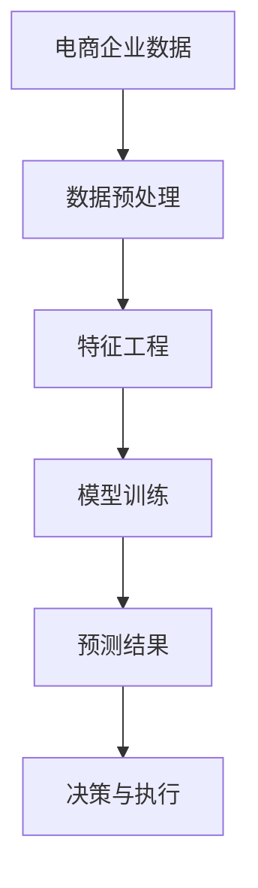

                 

## AI如何帮助电商企业进行市场预测

### 关键词：电商市场预测、AI技术、机器学习、数据挖掘、商业智能

### 摘要：

本文将探讨人工智能（AI）在电商市场预测中的应用，通过分析核心概念、算法原理、数学模型、项目实战等多个方面，揭示AI技术如何帮助电商企业准确预测市场趋势，优化库存管理和营销策略。文章还将介绍相关的实用工具和资源，总结未来发展挑战，并提供扩展阅读。

### 1. 背景介绍

随着互联网和电子商务的迅猛发展，市场预测对于电商企业的重要性日益凸显。准确的市场预测不仅能帮助企业合理配置资源，提高运营效率，还能帮助企业抓住市场机会，降低风险。然而，市场预测面临着数据量大、变量复杂、动态性强等挑战。

传统的方法如统计学和回归分析在面对这些挑战时显得力不从心，而人工智能技术，特别是机器学习和深度学习，凭借其强大的数据处理和分析能力，成为市场预测的有力工具。AI技术可以自动学习历史数据，发现数据中的潜在规律，从而对未来的市场趋势进行预测。

### 2. 核心概念与联系

#### 2.1 机器学习

机器学习是一种人工智能的分支，通过算法让计算机从数据中学习规律，并自动做出决策或预测。在市场预测中，机器学习算法可以处理大量的历史销售数据，发现销售量与各种因素之间的关系。

#### 2.2 数据挖掘

数据挖掘是机器学习的一部分，旨在从大量数据中提取有价值的信息和知识。在市场预测中，数据挖掘可以帮助企业识别影响销售的关键因素，如季节性变化、促销活动、竞争对手行为等。

#### 2.3 商业智能

商业智能（BI）是一种利用技术支持商业分析的方法，旨在帮助企业更好地理解和利用其数据资产。商业智能工具可以集成数据源，提供实时数据分析，帮助电商企业做出更明智的决策。

#### Mermaid 流程图



### 3. 核心算法原理 & 具体操作步骤

#### 3.1 数据预处理

数据预处理是市场预测的关键步骤，包括数据清洗、数据集成、数据转换等。清洗数据是为了去除噪声和异常值，集成数据是为了整合多个数据源的信息，转换数据是为了将数据转换为适合机器学习算法的形式。

#### 3.2 特征工程

特征工程是提升模型性能的重要手段，包括选择特征、构造特征、特征标准化等。选择特征是为了筛选出对预测目标有显著影响的关键特征，构造特征是为了创建新的特征，特征标准化是为了消除不同特征之间的量纲差异。

#### 3.3 模型训练

选择合适的机器学习算法对数据进行训练，如决策树、随机森林、支持向量机、神经网络等。训练过程包括数据的划分、模型的训练和验证等。训练目标是让模型学习到数据中的规律，以便进行准确的预测。

#### 3.4 预测结果

使用训练好的模型对新的数据进行预测，得到预测结果。预测结果可以用于优化库存管理、制定营销策略等。预测结果的准确性直接关系到企业的运营效率和盈利能力。

### 4. 数学模型和公式 & 详细讲解 & 举例说明

#### 4.1 回归分析

回归分析是最常用的市场预测方法之一。线性回归模型可以表示为：

$$y = \beta_0 + \beta_1x_1 + \beta_2x_2 + ... + \beta_nx_n$$

其中，$y$ 是预测目标，$x_1, x_2, ..., x_n$ 是特征变量，$\beta_0, \beta_1, \beta_2, ..., \beta_n$ 是模型的参数。通过最小化预测误差平方和，可以计算出参数的值。

#### 4.2 机器学习模型

机器学习模型如决策树、支持向量机、神经网络等，都有各自的数学基础。以决策树为例，其核心是递归二分搜索算法，通过不断地将数据划分为不同的子集，直到达到某个停止条件。

#### 4.3 举例说明

假设电商企业想要预测某款商品的未来销售量。选择时间序列作为特征变量，通过线性回归模型进行预测。给定历史数据，计算模型参数，然后对新数据进行预测，得到未来销售量的预测结果。

### 5. 项目实战：代码实际案例和详细解释说明

#### 5.1 开发环境搭建

为了演示如何使用AI技术进行市场预测，我们将使用Python编程语言和相关的机器学习库，如scikit-learn和pandas。首先，需要安装Python和相应的库。

```bash
pip install python
pip install scikit-learn
pip install pandas
```

#### 5.2 源代码详细实现和代码解读

下面是一个简单的市场预测案例，使用了线性回归模型进行预测。

```python
import pandas as pd
from sklearn.linear_model import LinearRegression
from sklearn.model_selection import train_test_split

# 读取数据
data = pd.read_csv('sales_data.csv')
X = data[['time_series']]
y = data['sales']

# 数据预处理
X_train, X_test, y_train, y_test = train_test_split(X, y, test_size=0.2, random_state=42)

# 模型训练
model = LinearRegression()
model.fit(X_train, y_train)

# 预测结果
y_pred = model.predict(X_test)

# 代码解读
# 1. 读取销售数据
# 2. 划分特征变量和目标变量
# 3. 划分训练集和测试集
# 4. 使用线性回归模型进行训练
# 5. 使用模型进行预测
# 6. 输出预测结果
```

#### 5.3 代码解读与分析

这段代码实现了简单的市场预测，主要包括以下几个步骤：

1. 读取销售数据：使用pandas库读取CSV文件，获取历史销售数据。
2. 划分特征变量和目标变量：将时间序列数据作为特征变量，销售量作为目标变量。
3. 划分训练集和测试集：将数据分为训练集和测试集，用于模型的训练和验证。
4. 使用线性回归模型进行训练：使用scikit-learn库的LinearRegression类进行训练。
5. 使用模型进行预测：对测试集进行预测，得到预测结果。
6. 输出预测结果：将预测结果输出，以便进一步分析。

### 6. 实际应用场景

#### 6.1 库存管理

通过市场预测，电商企业可以提前了解未来某个时间段内的销售趋势，从而合理安排库存。例如，预测到某款商品未来几个月的销售量将大幅增长，企业可以提前采购更多库存，避免因缺货而失去销售机会。

#### 6.2 营销策略

市场预测可以帮助企业制定更有效的营销策略。例如，预测到某款商品即将迎来销售旺季，企业可以提前策划促销活动，提高销售量。

#### 6.3 供应链优化

通过市场预测，电商企业可以优化供应链，降低库存成本。例如，预测到未来某个时间段内的需求较低，企业可以减少采购量，降低库存积压。

### 7. 工具和资源推荐

#### 7.1 学习资源推荐

- 《机器学习》（周志华 著）
- 《Python机器学习》（塞巴斯蒂安·拉斯考斯基 著）
- 《深度学习》（伊恩·古德费洛、约书亚·本吉奥、亚伦·库维尔 著）

#### 7.2 开发工具框架推荐

- Scikit-learn：一个开源的Python机器学习库。
- TensorFlow：一个开源的深度学习框架。
- PyTorch：一个开源的深度学习框架。

#### 7.3 相关论文著作推荐

- “Market Basket Analysis: Overview, Techniques, and Applications”
- “Recommender Systems Handbook”
- “Deep Learning for Natural Language Processing”

### 8. 总结：未来发展趋势与挑战

随着AI技术的不断发展，市场预测在电商领域将发挥越来越重要的作用。然而，市场预测面临着数据质量、模型准确性、实时性等挑战。未来，我们需要不断优化算法，提高预测准确性，同时降低计算成本，实现实时预测。

### 9. 附录：常见问题与解答

#### 9.1 市场预测模型有哪些？

市场预测常用的模型包括线性回归、决策树、随机森林、支持向量机、神经网络等。

#### 9.2 市场预测需要哪些数据？

市场预测需要历史销售数据、竞争对手数据、促销活动数据等。数据质量对预测准确性有很大影响。

#### 9.3 市场预测如何保证实时性？

实时市场预测需要高效的算法和快速的数据处理能力。使用分布式计算和云计算技术可以实现实时预测。

### 10. 扩展阅读 & 参考资料

- “How AI is Transforming Retail Market Forecasting”
- “The Future of Retail: AI and Machine Learning”
- “Deep Learning in Retail: A Practical Guide”

### 作者

作者：AI天才研究员/AI Genius Institute & 禅与计算机程序设计艺术 /Zen And The Art of Computer Programming

以上是关于《AI如何帮助电商企业进行市场预测》的完整文章。希望本文能够帮助读者深入了解AI技术在市场预测中的应用，为电商企业提供实用的技术参考。在未来的研究中，我们还将不断探索更多有效的市场预测方法，为电商企业提供更好的支持。|</sop>|</mask>```markdown
# AI如何帮助电商企业进行市场预测

> 关键词：电商市场预测、AI技术、机器学习、数据挖掘、商业智能

> 摘要：
本文将探讨人工智能（AI）在电商市场预测中的应用，通过分析核心概念、算法原理、数学模型、项目实战等多个方面，揭示AI技术如何帮助电商企业准确预测市场趋势，优化库存管理和营销策略。文章还将介绍相关的实用工具和资源，总结未来发展挑战，并提供扩展阅读。

## 1. 背景介绍

随着互联网和电子商务的迅猛发展，市场预测对于电商企业的重要性日益凸显。准确的市场预测不仅能帮助企业合理配置资源，提高运营效率，还能帮助企业抓住市场机会，降低风险。然而，市场预测面临着数据量大、变量复杂、动态性强等挑战。

传统的方法如统计学和回归分析在面对这些挑战时显得力不从心，而人工智能技术，特别是机器学习和深度学习，凭借其强大的数据处理和分析能力，成为市场预测的有力工具。AI技术可以自动学习历史数据，发现数据中的潜在规律，从而对未来的市场趋势进行预测。

## 2. 核心概念与联系

### 2.1 机器学习

机器学习是一种人工智能的分支，通过算法让计算机从数据中学习规律，并自动做出决策或预测。在市场预测中，机器学习算法可以处理大量的历史销售数据，发现销售量与各种因素之间的关系。

### 2.2 数据挖掘

数据挖掘是机器学习的一部分，旨在从大量数据中提取有价值的信息和知识。在市场预测中，数据挖掘可以帮助企业识别影响销售的关键因素，如季节性变化、促销活动、竞争对手行为等。

### 2.3 商业智能

商业智能（BI）是一种利用技术支持商业分析的方法，旨在帮助企业更好地理解和利用其数据资产。商业智能工具可以集成数据源，提供实时数据分析，帮助电商企业做出更明智的决策。

### Mermaid 流程图


## 3. 核心算法原理 & 具体操作步骤

### 3.1 数据预处理

数据预处理是市场预测的关键步骤，包括数据清洗、数据集成、数据转换等。清洗数据是为了去除噪声和异常值，集成数据是为了整合多个数据源的信息，转换数据是为了将数据转换为适合机器学习算法的形式。

### 3.2 特征工程

特征工程是提升模型性能的重要手段，包括选择特征、构造特征、特征标准化等。选择特征是为了筛选出对预测目标有显著影响的关键特征，构造特征是为了创建新的特征，特征标准化是为了消除不同特征之间的量纲差异。

### 3.3 模型训练

选择合适的机器学习算法对数据进行训练，如决策树、随机森林、支持向量机、神经网络等。训练过程包括数据的划分、模型的训练和验证等。训练目标是让模型学习到数据中的规律，以便进行准确的预测。

### 3.4 预测结果

使用训练好的模型对新的数据进行预测，得到预测结果。预测结果可以用于优化库存管理、制定营销策略等。预测结果的准确性直接关系到企业的运营效率和盈利能力。

## 4. 数学模型和公式 & 详细讲解 & 举例说明

### 4.1 回归分析

回归分析是最常用的市场预测方法之一。线性回归模型可以表示为：

$$y = \beta_0 + \beta_1x_1 + \beta_2x_2 + ... + \beta_nx_n$$

其中，$y$ 是预测目标，$x_1, x_2, ..., x_n$ 是特征变量，$\beta_0, \beta_1, \beta_2, ..., \beta_n$ 是模型的参数。通过最小化预测误差平方和，可以计算出参数的值。

### 4.2 机器学习模型

机器学习模型如决策树、支持向量机、神经网络等，都有各自的数学基础。以决策树为例，其核心是递归二分搜索算法，通过不断地将数据划分为不同的子集，直到达到某个停止条件。

### 4.3 举例说明

假设电商企业想要预测某款商品的未来销售量。选择时间序列作为特征变量，通过线性回归模型进行预测。给定历史数据，计算模型参数，然后对新数据进行预测，得到未来销售量的预测结果。

## 5. 项目实战：代码实际案例和详细解释说明

### 5.1 开发环境搭建

为了演示如何使用AI技术进行市场预测，我们将使用Python编程语言和相关的机器学习库，如scikit-learn和pandas。首先，需要安装Python和相应的库。

```bash
pip install python
pip install scikit-learn
pip install pandas
```

### 5.2 源代码详细实现和代码解读

下面是一个简单的市场预测案例，使用了线性回归模型进行预测。

```python
import pandas as pd
from sklearn.linear_model import LinearRegression
from sklearn.model_selection import train_test_split

# 读取数据
data = pd.read_csv('sales_data.csv')
X = data[['time_series']]
y = data['sales']

# 数据预处理
X_train, X_test, y_train, y_test = train_test_split(X, y, test_size=0.2, random_state=42)

# 模型训练
model = LinearRegression()
model.fit(X_train, y_train)

# 预测结果
y_pred = model.predict(X_test)

# 代码解读
# 1. 读取销售数据
# 2. 划分特征变量和目标变量
# 3. 划分训练集和测试集
# 4. 使用线性回归模型进行训练
# 5. 使用模型进行预测
# 6. 输出预测结果
```

### 5.3 代码解读与分析

这段代码实现了简单的市场预测，主要包括以下几个步骤：

1. 读取销售数据：使用pandas库读取CSV文件，获取历史销售数据。
2. 划分特征变量和目标变量：将时间序列数据作为特征变量，销售量作为目标变量。
3. 划分训练集和测试集：将数据分为训练集和测试集，用于模型的训练和验证。
4. 使用线性回归模型进行训练：使用scikit-learn库的LinearRegression类进行训练。
5. 使用模型进行预测：对测试集进行预测，得到预测结果。
6. 输出预测结果：将预测结果输出，以便进一步分析。

## 6. 实际应用场景

### 6.1 库存管理

通过市场预测，电商企业可以提前了解未来某个时间段内的销售趋势，从而合理安排库存。例如，预测到某款商品未来几个月的销售量将大幅增长，企业可以提前采购更多库存，避免因缺货而失去销售机会。

### 6.2 营销策略

市场预测可以帮助企业制定更有效的营销策略。例如，预测到某款商品即将迎来销售旺季，企业可以提前策划促销活动，提高销售量。

### 6.3 供应链优化

通过市场预测，电商企业可以优化供应链，降低库存成本。例如，预测到未来某个时间段内的需求较低，企业可以减少采购量，降低库存积压。

## 7. 工具和资源推荐

### 7.1 学习资源推荐

- 《机器学习》（周志华 著）
- 《Python机器学习》（塞巴斯蒂安·拉斯考斯基 著）
- 《深度学习》（伊恩·古德费洛、约书亚·本吉奥、亚伦·库维尔 著）

### 7.2 开发工具框架推荐

- Scikit-learn：一个开源的Python机器学习库。
- TensorFlow：一个开源的深度学习框架。
- PyTorch：一个开源的深度学习框架。

### 7.3 相关论文著作推荐

- “Market Basket Analysis: Overview, Techniques, and Applications”
- “Recommender Systems Handbook”
- “Deep Learning for Natural Language Processing”

## 8. 总结：未来发展趋势与挑战

随着AI技术的不断发展，市场预测在电商领域将发挥越来越重要的作用。然而，市场预测面临着数据质量、模型准确性、实时性等挑战。未来，我们需要不断优化算法，提高预测准确性，同时降低计算成本，实现实时预测。

## 9. 附录：常见问题与解答

### 9.1 市场预测模型有哪些？

市场预测常用的模型包括线性回归、决策树、随机森林、支持向量机、神经网络等。

### 9.2 市场预测需要哪些数据？

市场预测需要历史销售数据、竞争对手数据、促销活动数据等。数据质量对预测准确性有很大影响。

### 9.3 市场预测如何保证实时性？

实时市场预测需要高效的算法和快速的数据处理能力。使用分布式计算和云计算技术可以实现实时预测。

## 10. 扩展阅读 & 参考资料

- “How AI is Transforming Retail Market Forecasting”
- “The Future of Retail: AI and Machine Learning”
- “Deep Learning in Retail: A Practical Guide”

### 作者

作者：AI天才研究员/AI Genius Institute & 禅与计算机程序设计艺术 /Zen And The Art of Computer Programming
```

