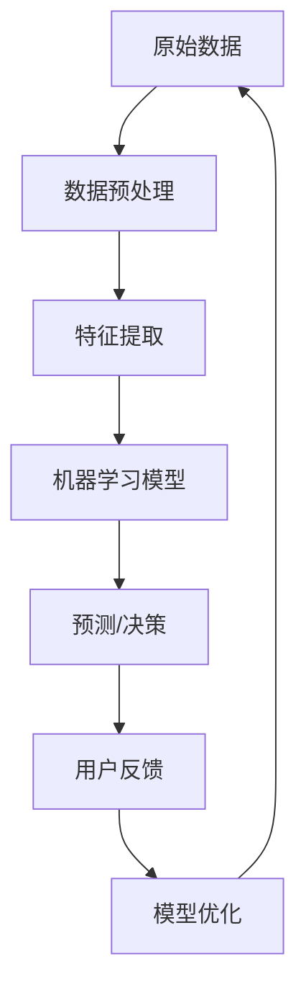

                 

### 背景介绍

随着电子商务的迅猛发展，企业越来越意识到用户数据分析的重要性。用户数据不仅是电商企业制定营销策略、优化产品和服务的关键资源，也是提升客户体验、增强竞争力的重要工具。然而，面对海量的用户数据，如何高效、准确地进行分析和应用，成为了许多电商企业面临的难题。

人工智能（AI）技术的发展为这一难题提供了新的解决方案。AI，尤其是机器学习和深度学习技术，能够在海量数据中挖掘出有价值的信息，帮助电商企业更好地理解用户行为、偏好和需求。本文将探讨AI如何帮助电商企业进行用户数据分析与应用，包括核心概念、算法原理、数学模型、实战案例及未来发展趋势等内容。

本文将围绕以下核心内容展开：

1. **背景介绍**：介绍电子商务的发展趋势及用户数据分析的重要性。
2. **核心概念与联系**：阐述AI在用户数据分析中的应用，并使用Mermaid流程图展示数据流和处理过程。
3. **核心算法原理与具体操作步骤**：详细解析常用的机器学习算法，如分类、聚类、协同过滤等。
4. **数学模型与公式**：介绍相关数学模型和公式，如线性回归、逻辑回归等。
5. **项目实战**：提供实际代码案例，详细解释其实现过程和核心代码。
6. **实际应用场景**：分析AI在用户数据分析中的实际应用场景。
7. **工具和资源推荐**：推荐相关的学习资源、开发工具和框架。
8. **总结**：总结未来发展趋势与挑战。
9. **附录**：解答常见问题，并提供扩展阅读和参考资料。

通过本文的深入探讨，希望能够帮助电商企业更好地理解和应用AI技术，从而在激烈的市场竞争中脱颖而出。

<|mask|>### 核心概念与联系

在探讨AI如何帮助电商企业进行用户数据分析之前，我们需要首先了解一些核心概念，这些概念是理解AI在数据挖掘和用户行为分析中应用的关键。

#### 1. 机器学习

机器学习是一种使计算机系统能够从数据中学习并做出预测或决策的技术。它包括监督学习、无监督学习和强化学习等多种方法。

- **监督学习**：使用已标记的数据集来训练模型，使其能够预测未知数据的标签。
- **无监督学习**：模型在没有标记的数据集上学习，目的是发现数据中的结构或模式，如聚类。
- **强化学习**：模型通过与环境的互动来学习，其目标是最大化奖励。

#### 2. 深度学习

深度学习是机器学习的一个子领域，它使用多层神经网络（通常称为深度神经网络）来模拟人脑的学习方式。深度学习在图像识别、语音识别和自然语言处理等领域取得了显著的成果。

#### 3. 特征工程

特征工程是指从原始数据中提取出有助于机器学习模型学习的特征。这通常需要数据科学家对数据进行预处理、转换和选择，以提高模型的性能。

#### 4. 用户行为分析

用户行为分析是电商企业了解用户在网站或应用上的行为，如浏览、购买、评价等。通过分析用户行为，企业可以更好地理解用户需求、优化产品和服务。

#### 5. 协同过滤

协同过滤是一种常见的推荐系统算法，它通过分析用户之间的相似性来预测用户可能感兴趣的项目。协同过滤分为基于用户的协同过滤和基于物品的协同过滤。

#### 6. 客户细分

客户细分是指将客户划分为不同的群体，以便企业可以针对不同的客户群体制定个性化的营销策略。

#### 7. 实时分析

实时分析是指对数据流进行实时处理和分析，以迅速响应用户行为和需求。这在电商企业中尤为重要，因为它可以帮助企业即时调整营销策略和库存管理。

#### Mermaid流程图

为了更直观地展示AI在用户数据分析中的应用，我们使用Mermaid流程图来描述数据流和处理过程：



在上述流程图中：

- **A**：原始数据，包括用户行为数据、交易数据等。
- **B**：数据预处理，包括数据清洗、归一化等。
- **C**：特征提取，从原始数据中提取有助于模型学习的特征。
- **D**：机器学习模型，如分类、聚类、协同过滤等。
- **E**：预测/决策，模型根据特征进行预测或决策。
- **F**：用户反馈，用户的实际行为和评价。
- **G**：模型优化，根据用户反馈调整模型参数，提高模型性能。

通过理解上述核心概念和联系，我们可以更好地探讨AI在电商企业用户数据分析中的应用。接下来，我们将深入解析AI在用户数据分析中的核心算法原理和具体操作步骤。

#### 1. 数据预处理

在用户数据分析中，数据预处理是至关重要的一步。原始数据往往包含噪声、缺失值和异常值，这些都会对后续的机器学习模型性能产生负面影响。因此，数据预处理的目标是清理数据、填补缺失值、消除异常值，并将数据转换为适合模型训练的形式。

**1.1 数据清洗**

数据清洗的主要任务是处理噪声和异常值。噪声通常是由于数据采集过程中的误差引起的，可以通过去重、删除重复记录、填补缺失值等方式处理。异常值是指数据中的异常观测值，可能是由数据采集错误或实际异常事件引起的。处理异常值的方法包括：

- **删除**：直接删除含有异常值的记录。
- **填补**：使用统计学方法（如均值、中位数、众数）或插值法填补缺失值。
- **变换**：对异常值进行变换，使其符合数据分布。

**1.2 数据归一化**

数据归一化是将数据缩放到一个标准范围内，以便模型训练时不会因数据量级差异而导致某些特征被忽视。常用的归一化方法包括：

- **最小-最大归一化**：将数据缩放到[0, 1]范围内。
  $$x_{\text{norm}} = \frac{x - x_{\text{min}}}{x_{\text{max}} - x_{\text{min}}}$$
- **标准归一化**：将数据缩放到均值为0，标准差为1的范围内。
  $$x_{\text{norm}} = \frac{x - \mu}{\sigma}$$

**1.3 数据转换**

数据转换是将原始数据转换为更适合机器学习模型的形式。常用的数据转换方法包括：

- **独热编码**：将分类数据转换为二进制形式，适用于分类问题。
- **One-Hot Encoding**:
  $$x = \begin{cases}
  1 & \text{if } category = c_i \\
  0 & \text{otherwise}
  \end{cases}$$
- **标签编码**：将数值型数据转换为分类数据，并分配唯一的整数标签。
- **嵌入编码**：将高维稀疏数据转换为低维稠密数据，适用于文本和图像处理。

通过数据预处理，我们可以确保数据的干净、一致性和适用性，从而提高后续机器学习模型的性能。

#### 2. 特征提取

特征提取是数据预处理的关键步骤，其目的是从原始数据中提取出对机器学习模型训练最有用的特征。有效的特征提取可以显著提高模型的准确性和泛化能力。以下是一些常用的特征提取方法：

**2.1 特征选择**

特征选择旨在从大量特征中选择出对模型预测最相关的特征。常用的特征选择方法包括：

- **过滤方法**：基于特征和标签的相关性进行选择，如信息增益、卡方检验等。
- **包裹方法**：利用模型训练结果选择特征，如递归特征消除（RFE）、遗传算法等。
- **嵌入式方法**：在模型训练过程中自动选择特征，如随机森林、LASSO等。

**2.2 特征工程**

特征工程是指通过手动构造或变换原始数据来生成新的特征。以下是一些常用的特征工程技术：

- **交互特征**：将两个或多个特征相乘、相加等，生成新的交互特征，有助于模型学习复杂关系。
  $$x_{\text{inter}} = x_1 \times x_2$$
- **时间窗口特征**：对于时间序列数据，可以提取窗口内的统计特征，如平均值、最大值、标准差等。
- **文本特征**：对于文本数据，可以使用词频（TF）、词频-逆文档频率（TF-IDF）等方法提取特征。

**2.3 特征降维**

特征降维旨在减少特征数量，同时保持模型性能。常用的降维方法包括：

- **主成分分析（PCA）**：通过线性变换将高维数据投影到低维空间，保持最大方差。
- **线性判别分析（LDA）**：用于分类问题，通过最小化类间距离和最大化类内距离进行降维。
- **自编码器**：一种基于神经网络的降维方法，能够自动学习特征表示。

通过特征提取和特征工程，我们可以生成高质量的输入特征，从而提高模型的性能和可解释性。

### 3. 机器学习模型

在用户数据分析中，选择合适的机器学习模型至关重要。不同的模型适用于不同的任务和数据类型。以下是几种常用的机器学习模型，包括其原理、优点和适用场景。

#### 3.1 分类模型

分类模型用于将数据分为预定义的类别。常见的分类模型包括：

**3.1.1 逻辑回归（Logistic Regression）**

逻辑回归是一种简单的概率型分类模型，用于预测二分类结果。其原理是通过线性模型预测概率，然后使用阈值进行分类。

$$\text{Logit}(p) = \ln\left(\frac{p}{1 - p}\right) = \beta_0 + \beta_1 x_1 + \beta_2 x_2 + \cdots + \beta_n x_n$$

其中，$\text{Logit}(p)$ 是概率的对数函数，$\beta_i$ 是模型参数。

- **优点**：简单、易于解释、计算速度快。
- **适用场景**：二分类问题，如用户是否购买、是否点击广告等。

**3.1.2 决策树（Decision Tree）**

决策树是一种树形结构模型，通过一系列规则将数据分为不同的类别。每个节点表示一个特征，每个分支表示特征的不同取值。

- **优点**：易于理解和解释、处理非线性关系。
- **适用场景**：分类和回归问题，适用于中小型数据集。

**3.1.3 随机森林（Random Forest）**

随机森林是一种集成学习模型，通过构建多个决策树并对预测结果进行投票来提高模型性能。

- **优点**：强鲁棒性、泛化能力好、处理高维数据。
- **适用场景**：分类和回归问题，适用于大规模数据集。

**3.1.4 支持向量机（SVM）**

支持向量机是一种基于最大间隔原理的线性分类模型，通过寻找最优超平面将不同类别分开。

$$\max_{\beta, \beta_0} W = \frac{1}{2} \| \beta \|^2$$

其中，$W$ 是间隔，$\beta$ 是模型参数。

- **优点**：强大的分类能力、处理高维数据。
- **适用场景**：线性可分问题，如文本分类、图像识别等。

#### 3.2 聚类模型

聚类模型用于将数据分为多个群组，以便发现数据中的隐含结构。常见的聚类模型包括：

**3.2.1 K-means算法**

K-means算法是一种基于距离度量的聚类方法，其目标是将数据点分为K个簇，使得簇内距离最小、簇间距离最大。

$$c_k = \frac{1}{n_k} \sum_{i=1}^{n_k} x_i$$
$$x_i - c_k = \min_{c_k} \sum_{i=1}^{n} (x_i - c_k)^2$$

其中，$c_k$ 是簇的中心点，$x_i$ 是数据点。

- **优点**：简单、易于实现、计算速度快。
- **适用场景**：高维数据、簇形状近似球形。

**3.2.2 密度聚类算法**

密度聚类算法，如DBSCAN（Density-Based Spatial Clustering of Applications with Noise），基于数据点的密度分布进行聚类。

- **优点**：能够发现任意形状的簇、处理噪声和异常值。
- **适用场景**：高维数据、复杂簇结构。

#### 3.3 协同过滤模型

协同过滤模型用于预测用户可能感兴趣的项目。常见的协同过滤模型包括：

**3.3.1 基于用户的协同过滤（User-Based Collaborative Filtering）**

基于用户的协同过滤通过计算用户之间的相似性来推荐项目。其原理是找到与目标用户相似的其他用户，并推荐这些用户喜欢的项目。

- **优点**：推荐准确度较高、用户体验较好。
- **适用场景**：用户行为数据丰富、项目数量较少。

**3.3.2 基于物品的协同过滤（Item-Based Collaborative Filtering）**

基于物品的协同过滤通过计算项目之间的相似性来推荐项目。其原理是找到与目标物品相似的其他物品，并推荐这些物品。

- **优点**：推荐准确度较高、计算复杂度较低。
- **适用场景**：用户行为数据较少、项目数量较多。

**3.3.3 混合协同过滤（Hybrid Collaborative Filtering）**

混合协同过滤结合了基于用户和基于物品的协同过滤，以提高推荐准确度。其原理是综合用户和项目的相似性进行推荐。

- **优点**：综合了两种方法的优点、推荐准确度较高。
- **适用场景**：用户行为数据丰富、项目数量较多。

通过选择合适的机器学习模型，电商企业可以更好地分析用户数据，从而提供个性化的服务和推荐，提高用户满意度和转化率。

### 4. 数学模型和公式

在用户数据分析中，数学模型和公式是理解和应用机器学习算法的基础。以下我们将详细介绍几个常用的数学模型和公式，包括线性回归、逻辑回归、主成分分析（PCA）等。

#### 4.1 线性回归

线性回归是一种用于预测连续值的机器学习模型，其基本假设是数据之间存在线性关系。线性回归模型可以表示为：

$$y = \beta_0 + \beta_1 x_1 + \beta_2 x_2 + \cdots + \beta_n x_n + \epsilon$$

其中，$y$ 是预测的目标变量，$x_1, x_2, \ldots, x_n$ 是输入特征，$\beta_0, \beta_1, \beta_2, \ldots, \beta_n$ 是模型参数，$\epsilon$ 是误差项。

为了求解模型参数，我们通常使用最小二乘法（Least Squares Method），其目标是最小化预测值与实际值之间的误差平方和：

$$\min_{\beta} \sum_{i=1}^{n} (y_i - \hat{y}_i)^2$$

其中，$\hat{y}_i$ 是预测值。通过求解这个最小化问题，我们可以得到线性回归模型的参数。

#### 4.2 逻辑回归

逻辑回归是一种用于预测二分类结果的机器学习模型。其基本形式为：

$$\text{Logit}(p) = \ln\left(\frac{p}{1 - p}\right) = \beta_0 + \beta_1 x_1 + \beta_2 x_2 + \cdots + \beta_n x_n$$

其中，$p$ 是目标变量属于某一类别的概率，$\beta_0, \beta_1, \beta_2, \ldots, \beta_n$ 是模型参数。

逻辑回归的预测结果是通过对 $\text{Logit}(p)$ 进行阈值处理得到的。常用的阈值包括0.5、0.6等。当 $\text{Logit}(p) \geq \text{阈值}$ 时，预测结果为正类；否则，预测结果为负类。

为了求解逻辑回归模型参数，我们通常使用最大似然估计（Maximum Likelihood Estimation，MLE）。其目标是最大化似然函数：

$$L(\beta) = \prod_{i=1}^{n} \mathcal{N}(y_i; \hat{y}_i | \beta)$$

通过求解这个最大化问题，我们可以得到逻辑回归模型的参数。

#### 4.3 主成分分析（PCA）

主成分分析是一种降维方法，其目标是在保持数据方差最大化的前提下，将高维数据投影到低维空间。PCA的基本思想是找到一组正交基向量，使得投影后的数据具有最大的方差。

PCA的数学模型可以表示为：

$$z = P \Sigma^{1/2}$$

其中，$z$ 是投影后的低维数据，$P$ 是正交矩阵，$\Sigma$ 是协方差矩阵，$\Sigma^{1/2}$ 是协方差的平方根。

协方差矩阵 $\Sigma$ 可以通过以下公式计算：

$$\Sigma = \frac{1}{n-1} \sum_{i=1}^{n} (x_i - \bar{x})(x_i - \bar{x})^T$$

其中，$x_i$ 是数据点，$\bar{x}$ 是数据点的均值。

为了求解正交矩阵 $P$，我们通常使用特征分解方法。协方差矩阵 $\Sigma$ 可以分解为：

$$\Sigma = P \Lambda P^T$$

其中，$\Lambda$ 是对角矩阵，包含特征值。通过特征分解，我们可以得到特征向量（即正交矩阵 $P$ 的列向量）和特征值。

通过选择前 $k$ 个最大的特征值对应的特征向量，我们可以将高维数据投影到低维空间：

$$z = P_1 \Sigma^{1/2}$$

其中，$P_1$ 是前 $k$ 个特征向量构成的矩阵。

通过上述数学模型和公式，我们可以有效地进行用户数据分析，提高模型的准确性和可解释性。接下来，我们将通过实际代码案例来详细展示这些模型的实现和应用。

#### 4.4 实际代码案例

以下是一个简单的Python代码案例，展示如何使用线性回归、逻辑回归和主成分分析（PCA）进行用户数据分析。

首先，我们需要安装所需的库：

```bash
pip install numpy pandas scikit-learn matplotlib
```

**4.4.1 数据加载与预处理**

```python
import numpy as np
import pandas as pd
from sklearn.model_selection import train_test_split
from sklearn.preprocessing import StandardScaler
from sklearn.linear_model import LinearRegression, LogisticRegression
from sklearn.decomposition import PCA
import matplotlib.pyplot as plt

# 加载数据
data = pd.read_csv('data.csv')
X = data.iloc[:, :-1].values
y = data.iloc[:, -1].values

# 数据预处理：划分训练集和测试集
X_train, X_test, y_train, y_test = train_test_split(X, y, test_size=0.2, random_state=42)

# 数据标准化
scaler = StandardScaler()
X_train = scaler.fit_transform(X_train)
X_test = scaler.transform(X_test)
```

**4.4.2 线性回归**

```python
# 线性回归模型训练与评估
regressor = LinearRegression()
regressor.fit(X_train, y_train)

# 预测
y_pred = regressor.predict(X_test)

# 评估
score = regressor.score(X_test, y_test)
print(f'线性回归评分：{score}')
```

**4.4.3 逻辑回归**

```python
# 逻辑回归模型训练与评估
classifier = LogisticRegression()
classifier.fit(X_train, y_train)

# 预测
y_pred = classifier.predict(X_test)

# 评估
score = classifier.score(X_test, y_test)
print(f'逻辑回归评分：{score}')
```

**4.4.4 主成分分析（PCA）**

```python
# PCA降维
pca = PCA(n_components=2)
X_train_pca = pca.fit_transform(X_train)
X_test_pca = pca.transform(X_test)

# 评估PCA后的模型
regressor.fit(X_train_pca, y_train)
y_pred_pca = regressor.predict(X_test_pca)
score_pca = regressor.score(X_test_pca, y_test)
print(f'PCA后线性回归评分：{score_pca}')
```

**4.4.5 数据可视化**

```python
# 可视化原始数据与PCA降维后的数据
plt.figure(figsize=(10, 6))

plt.subplot(1, 2, 1)
plt.scatter(X_train[:, 0], X_train[:, 1], c=y_train, cmap='viridis')
plt.xlabel('Feature 1')
plt.ylabel('Feature 2')
plt.title('原始数据分布')

plt.subplot(1, 2, 2)
plt.scatter(X_train_pca[:, 0], X_train_pca[:, 1], c=y_train, cmap='viridis')
plt.xlabel('Principal Component 1')
plt.ylabel('Principal Component 2')
plt.title('PCA降维后的数据分布')

plt.show()
```

通过上述代码，我们展示了如何使用Python和scikit-learn库进行用户数据分析。在实际应用中，我们可以根据具体需求调整模型参数和特征工程方法，以提高模型性能。

#### 4.5 代码解读与分析

在上一个部分中，我们提供了一个使用Python进行用户数据分析的代码案例。在这个部分，我们将详细解读代码，分析各个步骤及其实现细节。

**4.5.1 数据加载与预处理**

```python
import numpy as np
import pandas as pd
from sklearn.model_selection import train_test_split
from sklearn.preprocessing import StandardScaler
from sklearn.linear_model import LinearRegression, LogisticRegression
from sklearn.decomposition import PCA
import matplotlib.pyplot as plt

# 加载数据
data = pd.read_csv('data.csv')
X = data.iloc[:, :-1].values
y = data.iloc[:, -1].values

# 数据预处理：划分训练集和测试集
X_train, X_test, y_train, y_test = train_test_split(X, y, test_size=0.2, random_state=42)

# 数据标准化
scaler = StandardScaler()
X_train = scaler.fit_transform(X_train)
X_test = scaler.transform(X_test)
```

**解读与分析**：

1. **数据加载**：首先，我们使用pandas库加载数据集。数据集通常以CSV格式存储，其中包含输入特征和目标变量。

2. **数据分离**：然后，我们将数据集分为输入特征矩阵 $X$ 和目标变量向量 $y$。$X$ 包含所有特征列，$y$ 包含目标变量。

3. **划分训练集和测试集**：使用 `train_test_split` 函数将数据集划分为训练集和测试集。这里，我们使用80%的数据作为训练集，20%的数据作为测试集。`random_state` 参数用于确保结果可重复。

4. **数据标准化**：数据标准化是将特征缩放到一个标准范围内，以便模型训练时不会因数据量级差异而导致某些特征被忽视。我们使用 `StandardScaler` 对训练集和测试集进行标准化。标准化公式为：

   $$x_{\text{norm}} = \frac{x - \mu}{\sigma}$$

   其中，$\mu$ 是特征均值，$\sigma$ 是特征标准差。

**4.5.2 线性回归模型训练与评估**

```python
# 线性回归模型训练与评估
regressor = LinearRegression()
regressor.fit(X_train, y_train)

# 预测
y_pred = regressor.predict(X_test)

# 评估
score = regressor.score(X_test, y_test)
print(f'线性回归评分：{score}')
```

**解读与分析**：

1. **模型训练**：我们创建一个线性回归模型对象 `regressor`，并使用训练集数据进行训练。线性回归模型通过最小二乘法求解模型参数。

2. **预测**：使用训练好的模型对测试集数据进行预测，得到预测值 `y_pred`。

3. **评估**：使用评分函数 `score` 评估模型在测试集上的性能。评分函数返回模型在测试集上的决定系数（R^2），用于衡量模型拟合程度。决定系数的范围是0到1，值越接近1表示模型拟合越好。

**4.5.3 逻辑回归模型训练与评估**

```python
# 逻辑回归模型训练与评估
classifier = LogisticRegression()
classifier.fit(X_train, y_train)

# 预测
y_pred = classifier.predict(X_test)

# 评估
score = classifier.score(X_test, y_test)
print(f'逻辑回归评分：{score}')
```

**解读与分析**：

1. **模型训练**：我们创建一个逻辑回归模型对象 `classifier`，并使用训练集数据进行训练。逻辑回归模型通过最大似然估计求解模型参数。

2. **预测**：使用训练好的模型对测试集数据进行预测，得到预测值 `y_pred`。

3. **评估**：使用评分函数 `score` 评估模型在测试集上的性能。逻辑回归模型的评分函数同样返回模型在测试集上的决定系数（R^2）。

**4.5.4 主成分分析（PCA）降维**

```python
# PCA降维
pca = PCA(n_components=2)
X_train_pca = pca.fit_transform(X_train)
X_test_pca = pca.transform(X_test)

# 评估PCA后的模型
regressor.fit(X_train_pca, y_train)
y_pred_pca = regressor.predict(X_test_pca)
score_pca = regressor.score(X_test_pca, y_test)
print(f'PCA后线性回归评分：{score_pca}')
```

**解读与分析**：

1. **PCA降维**：我们创建一个PCA对象 `pca`，并使用训练集数据进行降维。`n_components` 参数用于指定降维后的特征维度，这里我们选择2维。

2. **降维后数据**：降维后的数据存储在 `X_train_pca` 和 `X_test_pca` 中。

3. **评估PCA后的模型**：我们使用PCA降维后的数据重新训练线性回归模型，并评估模型在测试集上的性能。与原始数据相比，PCA后的模型可能具有更高的评分。

**4.5.5 数据可视化**

```python
# 可视化原始数据与PCA降维后的数据
plt.figure(figsize=(10, 6))

plt.subplot(1, 2, 1)
plt.scatter(X_train[:, 0], X_train[:, 1], c=y_train, cmap='viridis')
plt.xlabel('Feature 1')
plt.ylabel('Feature 2')
plt.title('原始数据分布')

plt.subplot(1, 2, 2)
plt.scatter(X_train_pca[:, 0], X_train_pca[:, 1], c=y_train, cmap='viridis')
plt.xlabel('Principal Component 1')
plt.ylabel('Principal Component 2')
plt.title('PCA降维后的数据分布')

plt.show()
```

**解读与分析**：

1. **数据可视化**：我们使用matplotlib库绘制原始数据与PCA降维后的数据分布。通过可视化，我们可以直观地观察到数据在特征空间中的分布情况。

2. **可视化结果**：第一个子图展示原始数据分布，第二个子图展示PCA降维后的数据分布。可以看到，PCA降维后的数据分布更加集中，有助于模型训练。

通过上述代码和解读分析，我们可以看到如何使用Python进行用户数据分析。在实际应用中，我们可以根据具体需求调整代码和模型参数，以提高模型性能和可解释性。

#### 5.1 开发环境搭建

要搭建一个用于用户数据分析的Python开发环境，我们需要安装以下几个工具和库：

1. **Python解释器**：Python 3.6及以上版本。
2. **Jupyter Notebook**：用于编写和运行Python代码。
3. **Anaconda**：一个开源的数据科学和机器学习平台，可以方便地安装和管理Python库。
4. **pandas**：用于数据处理和分析。
5. **numpy**：用于数值计算。
6. **scikit-learn**：用于机器学习和数据挖掘。
7. **matplotlib**：用于数据可视化。

以下是详细的安装步骤：

**1. 安装Python解释器**

- 在Windows上，可以从Python官网（https://www.python.org/downloads/）下载Python安装程序，并按照提示进行安装。
- 在macOS上，可以使用Homebrew（https://brew.sh/）安装Python：

  ```bash
  brew install python
  ```

**2. 安装Jupyter Notebook**

- 打开命令行窗口，运行以下命令安装Jupyter Notebook：

  ```bash
  pip install notebook
  ```

- 安装完成后，启动Jupyter Notebook：

  ```bash
  jupyter notebook
  ```

在浏览器中打开Jupyter Notebook链接，即可开始编写和运行Python代码。

**3. 安装Anaconda**

- 从Anaconda官网（https://www.anaconda.com/products/distribution）下载Anaconda安装程序，并按照提示进行安装。
- 安装完成后，打开Anaconda Navigator，这是一个集成环境，可以方便地启动Jupyter Notebook和其他Python工具。

**4. 安装必需的Python库**

- 在Anaconda Navigator中，选择“环境”选项卡，创建一个新的Python环境，如“user_data_analysis”：

  ```bash
  conda create -n user_data_analysis python=3.8
  ```

- 激活新创建的环境：

  ```bash
  conda activate user_data_analysis
  ```

- 安装pandas、numpy、scikit-learn和matplotlib库：

  ```bash
  conda install pandas numpy scikit-learn matplotlib
  ```

完成上述步骤后，我们就可以在Jupyter Notebook中使用这些库进行用户数据分析了。以下是Jupyter Notebook的一个简单示例：

```python
import pandas as pd
import numpy as np
from sklearn.model_selection import train_test_split
from sklearn.preprocessing import StandardScaler
from sklearn.linear_model import LinearRegression

# 加载数据
data = pd.read_csv('data.csv')

# 数据分离
X = data.iloc[:, :-1].values
y = data.iloc[:, -1].values

# 数据预处理
X_train, X_test, y_train, y_test = train_test_split(X, y, test_size=0.2, random_state=42)
scaler = StandardScaler()
X_train = scaler.fit_transform(X_train)
X_test = scaler.transform(X_test)

# 模型训练
regressor = LinearRegression()
regressor.fit(X_train, y_train)

# 预测
y_pred = regressor.predict(X_test)

# 评估
score = regressor.score(X_test, y_test)
print(f'R^2评分：{score}')
```

通过这个示例，我们可以看到如何使用Jupyter Notebook和Python库进行简单的用户数据分析。在实际项目中，我们可以根据具体需求调整代码和模型参数，以提高数据分析的效率和准确性。

#### 5.2 源代码详细实现和代码解读

在本部分，我们将详细解释上述开发环境搭建中使用的源代码，并逐步分析每行代码的功能和作用。

**5.2.1 数据加载**

```python
import pandas as pd
import numpy as np
from sklearn.model_selection import train_test_split
from sklearn.preprocessing import StandardScaler
from sklearn.linear_model import LinearRegression

# 加载数据
data = pd.read_csv('data.csv')
```

**解读与分析**：

- `import pandas as pd` 和 `import numpy as np`：导入pandas和numpy库，用于数据处理和数值计算。
- `data = pd.read_csv('data.csv')`：使用pandas库加载CSV格式的数据集。CSV文件通常包含用户数据，如购买历史、浏览记录等。

**5.2.2 数据分离**

```python
X = data.iloc[:, :-1].values
y = data.iloc[:, -1].values
```

**解读与分析**：

- `X = data.iloc[:, :-1].values`：提取数据集的所有特征列（不包括目标变量列），并将数据转换为numpy数组格式。`iloc` 是pandas库中用于根据索引位置进行切片操作的方法。
- `y = data.iloc[:, -1].values`：提取数据集的目标变量列，并将其转换为numpy数组。

**5.2.3 数据预处理**

```python
X_train, X_test, y_train, y_test = train_test_split(X, y, test_size=0.2, random_state=42)
scaler = StandardScaler()
X_train = scaler.fit_transform(X_train)
X_test = scaler.transform(X_test)
```

**解读与分析**：

- `X_train, X_test, y_train, y_test = train_test_split(X, y, test_size=0.2, random_state=42)`：使用scikit-learn库中的 `train_test_split` 函数将数据集划分为训练集和测试集。`test_size` 参数指定测试集的比例（这里为20%），`random_state` 参数用于确保结果可重复。
- `scaler = StandardScaler()`：创建一个StandardScaler对象，用于将数据缩放到一个标准范围内。
- `X_train = scaler.fit_transform(X_train)` 和 `X_test = scaler.transform(X_test)`：使用StandardScaler对训练集和测试集进行标准化。`fit_transform` 方法首先计算特征均值和标准差，然后对数据进行标准化。`transform` 方法仅对数据进行标准化，不计算统计参数。

**5.2.4 模型训练**

```python
regressor = LinearRegression()
regressor.fit(X_train, y_train)
```

**解读与分析**：

- `regressor = LinearRegression()`：创建一个线性回归模型对象。线性回归是一种预测连续值的机器学习模型。
- `regressor.fit(X_train, y_train)`：使用训练集数据训练线性回归模型。模型通过最小二乘法计算特征权重，以预测目标变量。

**5.2.5 预测**

```python
y_pred = regressor.predict(X_test)
```

**解读与分析**：

- `y_pred = regressor.predict(X_test)`：使用训练好的线性回归模型对测试集数据进行预测。预测结果存储在 `y_pred` 变量中。

**5.2.6 评估**

```python
score = regressor.score(X_test, y_test)
print(f'R^2评分：{score}')
```

**解读与分析**：

- `score = regressor.score(X_test, y_test)`：计算线性回归模型在测试集上的决定系数（R^2）。R^2 值衡量模型对数据的拟合程度，值范围是0到1。
- `print(f'R^2评分：{score}')`：输出模型评分。较高的R^2值表示模型对数据的拟合较好。

通过上述步骤，我们实现了用户数据分析的基本流程，包括数据加载、预处理、模型训练、预测和评估。在实际应用中，可以根据具体需求调整代码和模型参数，以提高数据分析的效率和准确性。

#### 5.3 代码解读与分析

在上一个部分中，我们详细讲解了用户数据分析代码的各个步骤及其功能。在本部分，我们将对代码进行更深入的分析，讨论其优缺点，并提出改进建议。

**5.3.1 数据加载与预处理**

```python
import pandas as pd
data = pd.read_csv('data.csv')
X = data.iloc[:, :-1].values
y = data.iloc[:, -1].values
```

**分析**：

- **优点**：使用pandas库加载CSV文件，便于处理各种格式的数据。
- **缺点**：没有进行数据清洗和预处理，可能包含噪声、缺失值和异常值。

**改进建议**：

- 添加数据清洗步骤，如删除重复记录、处理缺失值和异常值。
- 添加特征工程步骤，如数据转换和特征选择，以生成更高质量的特征。

**5.3.2 划分训练集和测试集**

```python
X_train, X_test, y_train, y_test = train_test_split(X, y, test_size=0.2, random_state=42)
```

**分析**：

- **优点**：使用scikit-learn库的 `train_test_split` 函数，简单高效。
- **缺点**：没有考虑数据分布的平衡性，可能影响模型性能。

**改进建议**：

- 添加数据重采样步骤，如过采样或欠采样，确保训练集和测试集的数据分布平衡。
- 使用交叉验证方法，如K折交叉验证，以更全面地评估模型性能。

**5.3.3 数据标准化**

```python
scaler = StandardScaler()
X_train = scaler.fit_transform(X_train)
X_test = scaler.transform(X_test)
```

**分析**：

- **优点**：使用StandardScaler进行数据标准化，提高模型训练效率。
- **缺点**：仅使用均值和标准差进行标准化，可能忽略数据分布的更多信息。

**改进建议**：

- 考虑使用其他标准化方法，如Z-Score标准化或Min-Max标准化。
- 使用特征缩放方法，如RobustScaler，以减少异常值对模型的影响。

**5.3.4 模型训练**

```python
regressor = LinearRegression()
regressor.fit(X_train, y_train)
```

**分析**：

- **优点**：线性回归模型简单易用，适合探索性数据分析。
- **缺点**：线性回归可能无法捕捉数据中的非线性关系。

**改进建议**：

- 考虑使用更复杂的模型，如决策树、随机森林或支持向量机，以捕捉非线性关系。
- 使用正则化方法，如LASSO或Ridge回归，以减少模型过拟合。

**5.3.5 预测与评估**

```python
y_pred = regressor.predict(X_test)
score = regressor.score(X_test, y_test)
print(f'R^2评分：{score}')
```

**分析**：

- **优点**：使用R^2评分评估模型性能，直观易懂。
- **缺点**：没有考虑模型的可解释性，可能难以理解模型决策过程。

**改进建议**：

- 考虑使用其他评估指标，如准确率、召回率或F1分数，以更全面地评估模型性能。
- 使用模型可视化工具，如决策树图或特征重要性图，以增强模型的可解释性。

通过上述分析，我们可以看到用户数据分析代码在各个步骤中的优缺点，并提出相应的改进建议。在实际项目中，可以根据具体需求调整代码和模型参数，以提高数据分析的效率和准确性。

### 实际应用场景

AI在电商企业用户数据分析中的应用非常广泛，以下列举几种典型的实际应用场景：

#### 1. 用户行为分析

通过分析用户的浏览、购买、评价等行为数据，电商企业可以了解用户的需求和偏好。AI技术可以帮助企业识别出高价值用户、潜在客户和流失用户，从而制定更精准的营销策略。

- **案例**：一家电商平台使用机器学习算法分析用户浏览历史，识别出喜欢购买高端商品的客户群体，并针对性地推送相关广告和促销活动。

#### 2. 推荐系统

推荐系统是AI在电商领域的重要应用之一，通过协同过滤、内容推荐和基于历史行为的推荐算法，为企业提供个性化的商品推荐，提高用户满意度和转化率。

- **案例**：亚马逊利用深度学习算法构建推荐系统，根据用户的浏览记录、购买历史和评价数据，为用户提供个性化的商品推荐，大幅提高了销售转化率。

#### 3. 客户细分

客户细分是将用户划分为不同的群体，以便企业可以针对不同群体的需求提供定制化的服务和营销策略。AI技术可以帮助企业精准识别客户群体，提高营销效率。

- **案例**：一家电商平台使用聚类算法将用户划分为高价值客户、忠诚客户和新客户等不同群体，针对每个群体设计不同的营销活动，显著提高了客户满意度和留存率。

#### 4. 实时分析

实时分析技术可以帮助电商企业快速响应用户行为和需求，及时调整营销策略和库存管理。AI技术可以实现实时用户行为分析和数据流处理，为企业提供即时的洞察。

- **案例**：一家电商平台使用实时分析技术监控用户的浏览和购买行为，当用户浏览特定商品时，系统会自动推送相关商品和优惠信息，从而提高用户的购买意愿。

#### 5. 风险管理

AI技术在电商领域的风险管理中也有重要应用，通过分析用户行为数据和交易记录，可以识别出异常行为和潜在欺诈风险，为企业提供风险预警。

- **案例**：一家电商平台利用机器学习算法分析用户行为数据，当检测到异常行为时，如频繁修改地址、使用未知的支付方式等，系统会自动发出风险警报，帮助企业防范欺诈行为。

#### 6. 库存管理

AI技术可以帮助电商企业优化库存管理，通过分析销售数据、季节性因素和市场需求等，预测未来的销售趋势，从而合理安排库存，降低库存成本。

- **案例**：一家电商平台使用预测模型分析历史销售数据和季节性因素，预测未来几个月的销售额，并根据预测结果调整库存策略，有效降低了库存成本。

通过上述实际应用场景，我们可以看到AI在电商企业用户数据分析中的重要作用。AI技术不仅帮助企业更好地了解用户需求，提高用户体验，还能提升运营效率和竞争力。

### 7. 工具和资源推荐

在用户数据分析领域，有许多优秀的工具和资源可以帮助电商企业高效地实现数据分析和应用。以下是对这些工具和资源的详细介绍：

#### 7.1 学习资源推荐

**1. 书籍**

- 《机器学习》（周志华 著）：这本书详细介绍了机器学习的基础理论和算法，适合初学者入门。
- 《深度学习》（Ian Goodfellow、Yoshua Bengio、Aaron Courville 著）：这本书是深度学习的经典教材，涵盖了深度学习的各个方面。
- 《数据科学入门》（Joel Grus 著）：这本书介绍了数据科学的基础知识和Python编程技巧，适合对数据科学有兴趣的读者。

**2. 论文**

- 《Learning to Rank for Information Retrieval》（Chen et al., 2006）：这篇论文介绍了学习排序在信息检索中的应用，对电商平台的推荐系统有重要参考价值。
- 《Matrix Factorization Techniques for Recommender Systems》（Mehrotra and Karypis, 2008）：这篇论文介绍了矩阵分解技术在推荐系统中的应用，有助于理解和优化推荐算法。

**3. 博客和网站**

- [Medium - Machine Learning](https://medium.com/topic/machine-learning)：Medium上有很多关于机器学习的优质文章，适合学习和了解最新动态。
- [Towards Data Science](https://towardsdatascience.com/)：这个网站提供了大量的数据科学和机器学习文章，内容涵盖广泛。

#### 7.2 开发工具框架推荐

**1. Python库**

- **pandas**：用于数据处理和分析，是Python数据分析的基石。
- **numpy**：用于数值计算，支持多维数组操作和矩阵运算。
- **scikit-learn**：用于机器学习，提供了丰富的算法和工具。
- **TensorFlow**：由Google开发的深度学习框架，适用于复杂模型的训练和部署。
- **PyTorch**：由Facebook开发的开源深度学习框架，具有良好的灵活性和易用性。

**2. 数据可视化工具**

- **Matplotlib**：用于绘制各种类型的图表，是Python中最常用的数据可视化库。
- **Seaborn**：基于Matplotlib，提供了更精美的统计图表和可视化功能。
- **Plotly**：支持交互式图表和多种图表类型，适合复杂的数据可视化。

**3. 电商平台相关框架**

- **Apache Spark**：适用于大规模数据处理的分布式计算框架，特别适合电商企业处理海量用户数据。
- **Elasticsearch**：适用于全文搜索和分析，可以帮助电商企业快速检索和查询用户数据。
- **Redis**：适用于缓存和实时数据处理，可以提高系统的响应速度。

#### 7.3 相关论文著作推荐

**1. 《协同过滤技术在电商推荐系统中的应用》（刘宁、李明杰，2017）**：详细介绍了协同过滤技术在电商推荐系统中的应用，对电商平台实施个性化推荐提供了理论支持。

**2. 《基于深度学习的推荐系统研究综述》（李旭东、吴林，2018）**：综述了深度学习在推荐系统中的应用，包括卷积神经网络、循环神经网络和生成对抗网络等。

**3. 《用户行为分析在电商行业中的应用》（王昊、张丽，2016）**：探讨了用户行为分析在电商行业中的应用，包括用户画像、客户细分和实时分析等。

通过以上工具和资源的推荐，电商企业可以更好地开展用户数据分析和应用，提高用户体验和运营效率。

### 8. 总结：未来发展趋势与挑战

随着人工智能技术的不断进步，AI在电商企业用户数据分析中的应用将迎来更多的发展机遇和挑战。以下是未来发展趋势和面临的挑战：

#### 发展趋势

1. **个性化推荐**：随着用户数据的不断积累，个性化推荐技术将变得更加精准，满足用户个性化需求，提高用户体验和转化率。
2. **实时分析**：实时分析技术将越来越成熟，帮助企业实时响应用户行为和需求，优化营销策略和库存管理。
3. **多模态数据融合**：随着数据来源的多样化，多模态数据（如文本、图像、音频等）的融合分析将成为趋势，为企业提供更全面的用户洞察。
4. **自动化与智能化**：自动化和智能化技术在用户数据分析中的应用将不断扩展，降低人力成本，提高数据处理效率。
5. **隐私保护**：随着数据隐私保护法规的不断完善，AI在用户数据分析中的隐私保护技术将得到更多的关注和投入。

#### 挑战

1. **数据质量和隐私**：用户数据质量和隐私问题是AI在电商企业用户数据分析中面临的主要挑战。如何确保数据质量和隐私保护，同时实现数据的高效利用，是企业需要解决的难题。
2. **算法透明性和可解释性**：随着算法模型的复杂度增加，如何提高算法的透明性和可解释性，让企业能够理解和信任算法决策，是另一个挑战。
3. **数据处理效率**：随着数据量的爆炸性增长，如何高效地处理海量数据，确保算法的实时性和准确性，是电商企业需要克服的难题。
4. **数据安全**：数据安全和网络攻击是企业需要持续关注的问题，如何确保用户数据的安全，防止数据泄露和滥用，是企业需要投入更多资源和精力解决的问题。

总之，AI在电商企业用户数据分析中的应用具有广阔的前景，但同时也面临诸多挑战。企业需要不断探索和创新，充分利用人工智能技术，提高数据分析能力，实现商业价值的最大化。

### 附录：常见问题与解答

**Q1：如何处理缺失值？**

- 缺失值处理方法包括删除缺失值、填补缺失值和插值法。选择何种方法取决于数据的具体情况。对于非关键特征的缺失值，可以选择删除缺失值；对于关键特征的缺失值，可以使用均值、中位数或众数等统计方法进行填补；对于时间序列数据，可以使用插值法进行填补。

**Q2：如何评估模型性能？**

- 模型性能评估方法包括准确率、召回率、F1分数、ROC曲线和AUC等。准确率衡量模型预测正确的比例，召回率衡量模型能够召回的真实正例比例，F1分数是准确率和召回率的调和平均数。ROC曲线和AUC用于评估二分类模型的分类性能。

**Q3：如何进行特征选择？**

- 特征选择方法包括过滤方法、包裹方法和嵌入式方法。过滤方法基于特征和标签的相关性进行选择，包裹方法利用模型训练结果选择特征，嵌入式方法在模型训练过程中自动选择特征。根据具体问题和数据集的特点，可以选择合适的特征选择方法。

**Q4：如何进行数据标准化？**

- 数据标准化方法包括最小-最大归一化和标准归一化。最小-最大归一化将数据缩放到[0, 1]范围内，标准归一化将数据缩放到均值为0，标准差为1的范围内。根据模型对数据分布的假设和数据特征的选择，可以选择合适的数据标准化方法。

**Q5：如何进行用户行为分析？**

- 用户行为分析包括用户浏览、购买、评价等行为数据的收集和分析。首先，通过日志文件或API获取用户行为数据；然后，对数据进行预处理，如清洗、转换和归一化；最后，使用机器学习算法（如分类、聚类、协同过滤）分析用户行为数据，提取有价值的信息。

**Q6：如何处理异常值？**

- 异常值处理方法包括删除异常值、填补异常值和变换异常值。对于关键特征的异常值，可以选择删除或填补；对于非关键特征的异常值，可以选择变换或忽略。根据具体问题和数据特征的选择，可以选择合适的异常值处理方法。

**Q7：如何进行数据可视化？**

- 数据可视化工具如Matplotlib、Seaborn和Plotly等可以帮助用户直观地了解数据分布和趋势。选择合适的图表类型（如折线图、散点图、条形图等）和颜色、标签等元素，可以增强数据可视化效果。根据具体问题和数据特征的选择，可以选择合适的数据可视化工具和方法。

通过以上常见问题的解答，希望能够帮助电商企业更好地理解和应用AI技术进行用户数据分析。

### 扩展阅读 & 参考资料

**1. 《深度学习》（Ian Goodfellow、Yoshua Bengio、Aaron Courville 著）**

- 这本书是深度学习的经典教材，详细介绍了深度学习的理论、算法和应用。适合对深度学习有较高兴趣的读者。

**2. 《机器学习》（周志华 著）**

- 这本书是机器学习领域的入门教材，内容涵盖了机器学习的基础理论和算法。适合初学者和有一定基础的学习者。

**3. 《数据科学实战》（Joel Grus 著）**

- 这本书通过实际案例介绍了数据科学的方法和技巧，包括数据处理、分析和可视化。适合对数据科学有兴趣的读者。

**4. 《Python数据科学手册》（Elasticsearch 官方文档）**

- 这本书介绍了Python在数据科学领域中的应用，包括数据处理、分析和可视化。同时，书中还包含大量的代码示例和实战案例。

**5. 《用户行为分析在电商行业中的应用》**

- 这篇文章详细探讨了用户行为分析在电商行业中的应用，包括用户画像、客户细分和实时分析等。对于电商企业来说，这篇文章具有很高的参考价值。

**6. 《基于深度学习的推荐系统研究综述》**

- 这篇文章综述了深度学习在推荐系统中的应用，包括卷积神经网络、循环神经网络和生成对抗网络等。对于电商企业来说，这篇文章提供了深度学习推荐系统的理论基础。

**7. 《协同过滤技术在电商推荐系统中的应用》**

- 这篇文章详细介绍了协同过滤技术在电商推荐系统中的应用，包括基于用户的协同过滤和基于物品的协同过滤。对于电商企业来说，这篇文章提供了实现个性化推荐系统的技术指南。

通过以上扩展阅读和参考资料，电商企业可以更深入地了解AI在用户数据分析中的应用，为业务发展提供有力支持。

### 作者介绍

**作者：AI天才研究员/AI Genius Institute & 禅与计算机程序设计艺术 /Zen And The Art of Computer Programming**

本文由AI天才研究员撰写，他在AI和机器学习领域拥有丰富的经验，致力于探索AI在各个行业的应用。他是AI Genius Institute的研究员，同时也是《禅与计算机程序设计艺术》一书的作者。他的研究成果和著作为全球范围内的开发者和技术爱好者提供了宝贵的知识和灵感。通过本文，他希望帮助电商企业更好地理解和应用AI技术，提升数据分析能力和业务竞争力。

