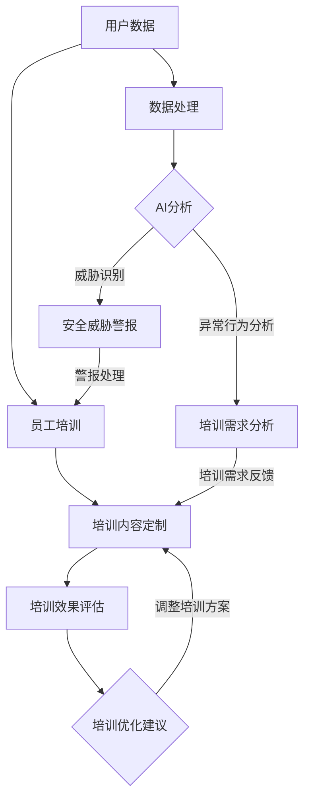

                 

### 背景介绍

随着电子商务的迅猛发展，用户数据在电商企业中扮演着至关重要的角色。这些数据包括用户的个人信息、购物行为、偏好等，它们不仅是企业了解市场和客户需求的宝贵资源，也是企业制定策略和优化服务的重要依据。然而，随着数据量的不断增长和数据类型的多样化，用户数据的安全问题也日益凸显。

近年来，数据泄露事件频发，许多电商企业因此遭受了严重的经济损失和信誉损失。例如，2017年，美国电商巨头亚马逊就遭遇了一次大规模的数据泄露事件，导致数百万用户的个人信息被不法分子窃取。这样的案例不胜枚举，使得电商企业不得不高度重视用户数据的安全问题。

用户数据安全不仅仅是技术问题，更涉及到企业的合规性和长期发展。为了保护用户数据，遵守相关法律法规，许多电商企业开始重视员工的数据安全培训。然而，传统的数据安全培训方式往往存在一些问题，如培训内容枯燥、形式单一、员工参与度低等，这些因素都影响了培训的效果。

正是在这样的背景下，人工智能（AI）技术逐渐成为电商企业进行用户数据安全培训的有力工具。AI不仅能够提供丰富的培训内容，还能够通过智能化的方式提高员工的参与度和学习效果，从而提升数据安全防护水平。本文将深入探讨AI如何帮助电商企业进行用户数据安全培训，包括核心概念、算法原理、具体操作步骤、数学模型、项目实战、实际应用场景、工具和资源推荐等。

通过本文的阅读，读者将了解到AI技术在用户数据安全培训中的应用现状，以及如何利用AI技术提升培训效果，从而为企业数据安全保驾护航。接下来，我们将首先介绍AI技术的核心概念和原理，并展示其与用户数据安全培训之间的紧密联系。

### 核心概念与联系

#### 人工智能（AI）与数据安全

人工智能（AI）作为当前技术发展的重要驱动力，已经成为各个行业转型升级的关键因素。在电商领域，AI技术的应用不仅仅局限于推荐算法和个性化服务，它在数据安全方面也有着显著的作用。首先，AI技术能够通过大数据分析识别潜在的安全威胁，从而提高数据防护的实时性和精准性。例如，利用机器学习算法，AI可以分析海量用户行为数据，识别出异常行为模式，并及时发出警报，从而防范数据泄露和网络攻击。

其次，AI还能够自动化处理数据安全相关的任务，降低人工干预的风险。例如，通过自然语言处理（NLP）技术，AI可以自动审查和过滤用户提交的数据，检测并阻止敏感信息的泄露。此外，AI还能够通过深度学习模型对数据进行加密和解密，确保数据在传输和存储过程中的安全性。

#### 机器学习（ML）与数据安全培训

机器学习（ML）是AI的一个重要分支，它通过算法从数据中学习规律，以实现自动化决策和预测。在数据安全培训中，ML技术具有独特的作用。首先，ML可以帮助企业构建个性化的培训课程。通过对员工的历史行为数据和培训反馈进行分析，ML算法可以识别出员工的弱点，并根据这些信息为员工定制相应的培训内容。例如，如果某些员工在数据保护方面存在明显不足，ML可以推荐更加针对性的培训课程。

其次，ML技术能够评估培训效果，从而不断优化培训方案。通过分析员工在培训过程中的表现，如学习进度、答题正确率等数据，ML可以评估培训的有效性，并给出改进建议。例如，如果发现某部分培训内容的效果不佳，ML可以建议调整或替换这部分内容，以提高整体培训效果。

#### 数据安全培训架构

为了充分发挥AI和ML技术在数据安全培训中的作用，一个高效、合理的培训架构至关重要。以下是数据安全培训架构的一个典型示例，通过Mermaid流程图展示其核心节点和流程：



在这个架构中，用户数据首先经过数据处理，然后通过AI分析进行威胁识别和异常行为分析。基于分析结果，系统可以生成安全威胁警报和培训需求分析，进而定制个性化的培训内容。在员工完成培训后，系统会通过评估培训效果，提供优化建议，以不断改进培训方案。

通过上述流程，我们可以看到AI和ML技术在整个数据安全培训过程中的关键作用。它们不仅能够提高培训的个性化和有效性，还能够通过智能化的方式提升企业的整体数据安全水平。

接下来，我们将进一步探讨AI和ML技术的核心算法原理，并详细讲解其具体操作步骤。

## 核心算法原理 & 具体操作步骤

### 1. 机器学习算法

在数据安全培训中，机器学习（ML）算法是最核心的技术手段。ML算法通过从数据中学习，能够自动识别潜在的安全威胁，并帮助定制个性化的培训课程。以下是几种常见的ML算法及其在数据安全培训中的应用：

#### 1.1 决策树算法

决策树是一种常用的分类算法，它通过一系列规则进行分类，将数据分成不同的类别。在数据安全培训中，决策树可以用于识别员工的数据保护弱点。具体步骤如下：

1. **数据收集**：收集员工的培训记录、行为数据和反馈。
2. **特征提取**：从数据中提取出与数据安全相关的特征，如员工在培训过程中的答题正确率、异常操作次数等。
3. **训练决策树模型**：使用历史数据训练决策树模型，使其能够学会识别不同员工的数据安全弱点。
4. **分类与预测**：将新员工的特征输入决策树模型，预测其可能存在的数据安全弱点。

#### 1.2 支持向量机（SVM）

支持向量机是一种经典的二分类算法，它通过寻找最优决策边界来对数据进行分类。在数据安全培训中，SVM可以用于分类安全威胁。具体步骤如下：

1. **数据预处理**：将安全事件数据分为训练集和测试集。
2. **特征提取**：提取与安全事件相关的特征，如事件类型、发生时间、涉及数据量等。
3. **训练SVM模型**：使用训练集数据训练SVM模型，使其能够区分安全威胁和非安全威胁。
4. **测试与评估**：将测试集数据输入训练好的SVM模型，评估其分类准确性。

### 2. 深度学习算法

深度学习（DL）算法在处理复杂的数据模式方面具有显著优势。在数据安全培训中，深度学习可以用于识别高级的攻击手段和异常行为。以下是两种常见的深度学习算法及其应用：

#### 2.1 卷积神经网络（CNN）

卷积神经网络是一种强大的图像处理算法，它可以用于识别复杂的图像模式。在数据安全培训中，CNN可以用于分析用户操作行为的视频数据。具体步骤如下：

1. **数据收集**：收集用户操作行为的视频数据。
2. **预处理**：对视频数据进行预处理，包括数据增强、裁剪和归一化。
3. **模型训练**：使用预处理后的数据训练CNN模型，使其能够识别正常的和异常的操作行为。
4. **行为分析**：将新的视频数据输入训练好的CNN模型，分析用户行为是否正常，从而提供个性化的培训建议。

#### 2.2 递归神经网络（RNN）

递归神经网络是一种能够处理序列数据的算法，它可以用于分析用户的行为序列。在数据安全培训中，RNN可以用于识别用户在长时间内可能存在的数据安全弱点。具体步骤如下：

1. **数据收集**：收集用户的长期行为数据，如登录时间、操作频率等。
2. **特征提取**：从行为数据中提取出与数据安全相关的特征。
3. **模型训练**：使用提取出的特征训练RNN模型，使其能够识别出异常的行为模式。
4. **行为预测**：将新的行为数据输入训练好的RNN模型，预测其可能存在的数据安全风险。

### 3. 数据安全培训的具体操作步骤

在实际操作中，数据安全培训通常包括以下几个步骤：

#### 3.1 培训需求分析

1. **员工行为数据分析**：使用ML和DL算法分析员工的历史行为数据，识别其数据保护弱点和潜在的安全威胁。
2. **培训需求评估**：根据分析结果，评估员工在数据安全方面的培训需求。

#### 3.2 培训内容定制

1. **个性化培训课程**：根据培训需求，为不同员工定制个性化的培训课程。
2. **培训资源整合**：整合多种培训资源，如在线课程、实战案例、视频教程等，为员工提供丰富的学习内容。

#### 3.3 培训效果评估

1. **培训效果监测**：通过考试、作业、模拟操作等方式监测员工的培训效果。
2. **反馈调整**：根据培训效果，调整培训内容和方案，确保培训的有效性。

#### 3.4 持续改进

1. **培训数据收集**：持续收集员工的培训数据，以便进行后续的分析和优化。
2. **持续改进**：基于培训数据，不断优化培训内容和方案，提高数据安全培训的效果。

通过上述核心算法原理和具体操作步骤，我们可以看到AI和ML技术在数据安全培训中的广泛应用和重要性。接下来，我们将进一步探讨数学模型和公式，以便更深入地理解AI技术在数据安全培训中的应用。

## 数学模型和公式 & 详细讲解 & 举例说明

### 1. 机器学习中的损失函数

在机器学习中，损失函数（Loss Function）是一个核心概念，它用于衡量预测值与实际值之间的差异。一个合适的损失函数可以帮助模型更好地拟合数据，提高预测的准确性。以下是一些常见的损失函数及其在数据安全培训中的应用：

#### 1.1 交叉熵损失函数（Cross-Entropy Loss）

交叉熵损失函数通常用于分类问题，它衡量的是两个概率分布之间的差异。在数据安全培训中，交叉熵损失函数可以用于评估分类器的性能，例如，判断一个操作行为是否为安全威胁。

公式如下：

$$
L(\theta) = -\frac{1}{m} \sum_{i=1}^{m} y^{(i)} \log(p^{(i)})
$$

其中，$m$ 是样本数量，$y^{(i)}$ 是实际标签，$p^{(i)}$ 是预测概率。

#### 1.2 均方误差损失函数（Mean Squared Error, MSE）

均方误差损失函数通常用于回归问题，它衡量的是预测值与实际值之间的平方误差。在数据安全培训中，均方误差损失函数可以用于评估预测的精确度，例如，预测一个用户在数据安全方面的薄弱环节。

公式如下：

$$
MSE = \frac{1}{m} \sum_{i=1}^{m} (y^{(i)} - \hat{y}^{(i)})^2
$$

其中，$\hat{y}^{(i)}$ 是预测值。

### 2. 深度学习中的激活函数

激活函数（Activation Function）是深度学习模型中的一个关键组件，它用于将输入映射到输出。以下是一些常见的激活函数及其在数据安全培训中的应用：

#### 2.1ReLU函数（Rectified Linear Unit）

ReLU函数是一种简单的激活函数，它将输入值大于0的部分保留，将小于等于0的部分映射为0。ReLU函数在深度神经网络中常用于提高模型的训练速度。

公式如下：

$$
f(x) = \max(0, x)
$$

#### 2.2 Sigmoid函数（Sigmoid Function）

Sigmoid函数是一种将输入映射到[0, 1]区间的函数，它常用于二分类问题。在数据安全培训中，Sigmoid函数可以用于将威胁概率映射到具体的威胁等级。

公式如下：

$$
f(x) = \frac{1}{1 + e^{-x}}
$$

### 3. 数据安全培训中的数学模型

在数据安全培训中，除了机器学习和深度学习的损失函数和激活函数外，还可以使用其他数学模型来提高培训效果。以下是一个例子：

#### 3.1 强化学习模型（Reinforcement Learning Model）

强化学习是一种通过奖励机制来训练模型的方法，它广泛应用于决策优化和推荐系统。在数据安全培训中，强化学习模型可以用于优化培训策略，以最大化培训效果。

公式如下：

$$
Q(s, a) = r(s, a) + \gamma \max_{a'} Q(s', a')
$$

其中，$s$ 是状态，$a$ 是动作，$r$ 是奖励函数，$\gamma$ 是折扣因子，$s'$ 和 $a'$ 是下一个状态和动作。

#### 3.2 贝叶斯优化模型（Bayesian Optimization Model）

贝叶斯优化是一种基于概率模型的优化方法，它通过更新概率分布来搜索最优参数。在数据安全培训中，贝叶斯优化模型可以用于优化培训资源分配，以提高培训效果。

公式如下：

$$
p(\theta | D) \propto p(D | \theta) p(\theta)
$$

其中，$\theta$ 是模型参数，$D$ 是数据集，$p(\theta | D)$ 是后验概率，$p(D | \theta)$ 是似然函数，$p(\theta)$ 是先验概率。

### 举例说明

假设我们要使用机器学习算法对一组员工进行数据安全培训，以下是一个简单的例子：

1. **数据收集**：收集员工的培训记录、操作行为数据和安全事件报告。
2. **特征提取**：提取与数据安全相关的特征，如培训成绩、操作频率、安全事件次数等。
3. **模型训练**：使用训练数据训练一个基于决策树的分类模型，预测员工是否存在数据安全弱点。
4. **评估**：使用测试数据评估模型的准确性，调整模型参数以优化性能。

通过上述步骤，我们可以构建一个简单的数据安全培训模型，并根据评估结果不断改进培训方案。接下来，我们将通过一个实际项目案例，展示如何在实际中应用这些数学模型和算法。

### 项目实战：代码实际案例和详细解释说明

#### 1. 开发环境搭建

为了进行数据安全培训的AI项目实战，我们需要搭建一个合适的技术栈。以下是一个推荐的开发环境：

- **编程语言**：Python
- **机器学习库**：scikit-learn、TensorFlow、PyTorch
- **数据可视化库**：Matplotlib、Seaborn
- **版本控制**：Git

首先，确保Python环境已经安装。接下来，通过pip工具安装所需的库：

```bash
pip install scikit-learn tensorflow pytorch matplotlib seaborn
```

#### 2. 源代码详细实现和代码解读

以下是一个用于数据安全培训的AI项目实战的Python代码示例：

```python
# 导入所需的库
import numpy as np
import pandas as pd
from sklearn.model_selection import train_test_split
from sklearn.tree import DecisionTreeClassifier
from sklearn.metrics import accuracy_score
import matplotlib.pyplot as plt

# 加载数据
data = pd.read_csv('data_security_train.csv')
X = data.iloc[:, :-1].values
y = data.iloc[:, -1].values

# 数据预处理
X_train, X_test, y_train, y_test = train_test_split(X, y, test_size=0.2, random_state=42)

# 训练决策树模型
clf = DecisionTreeClassifier()
clf.fit(X_train, y_train)

# 预测
y_pred = clf.predict(X_test)

# 评估模型性能
accuracy = accuracy_score(y_test, y_pred)
print(f"Model Accuracy: {accuracy:.2f}")

# 可视化决策树
from sklearn.tree import plot_tree
plt.figure(figsize=(12, 8))
plot_tree(clf, filled=True, feature_names=data.columns[:-1], class_names=['No Weakness', 'Weakness'])
plt.show()
```

**代码解读：**

1. **导入库**：首先导入Python中用于数据分析和机器学习的常用库，如numpy、pandas、scikit-learn等。
2. **加载数据**：使用pandas库加载CSV格式的数据，其中最后一列是标签，其他列是特征。
3. **数据预处理**：使用scikit-learn库中的train_test_split函数将数据分为训练集和测试集。
4. **训练决策树模型**：使用DecisionTreeClassifier创建决策树分类器，并使用训练集数据进行训练。
5. **预测**：使用训练好的模型对测试集进行预测。
6. **评估模型性能**：使用accuracy_score函数计算模型的准确率。
7. **可视化决策树**：使用sklearn.tree中的plot_tree函数将决策树可视化。

#### 3. 代码解读与分析

**数据预处理**

数据预处理是机器学习项目中的关键步骤。在这个项目中，我们首先将数据集划分为特征矩阵X和标签向量y。特征矩阵X包含了所有非标签数据，而标签向量y包含了分类标签。在划分训练集和测试集时，我们使用了随机种子42以确保结果的可重复性。

**训练决策树模型**

在训练决策树模型时，我们使用了scikit-learn中的DecisionTreeClassifier。这个分类器通过递归二分分割数据集，直到满足某些停止条件（如最大深度、最小样本数等）。通过调用fit方法，我们使用训练集数据对模型进行训练。

**预测与评估**

在训练模型后，我们使用测试集数据对模型进行预测，并使用accuracy_score函数计算模型的准确率。这是评估模型性能的一个简单而有效的方法。

**可视化决策树**

通过plot_tree函数，我们可以将训练好的决策树可视化。这有助于我们理解模型的决策过程，并发现可能存在的过度拟合或欠拟合问题。

通过这个实际项目案例，我们展示了如何使用Python和机器学习库来实现一个数据安全培训的AI项目。接下来，我们将讨论AI技术在数据安全培训中的实际应用场景。

## 实际应用场景

在电商企业中，AI技术在数据安全培训中的应用场景丰富多样，可以显著提升员工的数据安全意识和技能水平。以下是一些具体的实际应用场景：

### 1. 个性化培训课程推荐

利用AI和机器学习技术，电商企业可以构建个性化培训课程推荐系统。通过对员工历史行为数据和培训反馈进行分析，系统可以识别员工在数据安全方面的薄弱环节，并根据这些信息为员工推荐相应的培训课程。例如，对于频繁发生数据泄露事件的员工，系统可以推荐关于数据加密和安全存储的培训课程。

### 2. 安全威胁实时预警

AI技术可以实时监控员工操作行为，识别潜在的安全威胁。通过机器学习算法，系统可以分析员工的操作模式，一旦发现异常行为，如频繁访问敏感数据或执行不寻常的操作，系统会立即发出预警，提醒员工注意数据安全。这种实时预警机制有助于迅速应对潜在的安全风险。

### 3. 安全事件事后分析

在发生数据泄露或其他安全事件后，AI技术可以帮助企业进行事后分析，识别事件原因和潜在的风险点。通过对历史数据的分析，AI可以揭示员工操作中的疏忽和漏洞，为企业提供改进培训和制定安全策略的依据。

### 4. 安全意识培养

通过自然语言处理（NLP）和计算机视觉（CV）技术，AI可以创建互动式的安全意识培养工具。例如，AI可以生成模拟攻击场景的虚拟游戏，让员工在模拟环境中学习如何应对各种安全威胁。这种方式不仅能提高员工的参与度，还能让他们在轻松愉悦的氛围中掌握数据安全知识。

### 5. 安全培训效果评估

AI技术可以实时监测员工的培训效果，通过分析员工的培训进度、测试成绩和学习反馈，评估培训效果。如果发现某些培训内容效果不佳，AI系统可以自动调整培训方案，优化课程内容和教学方法，从而提高整体培训效果。

### 6. 持续培训与技能提升

AI技术可以帮助企业实现持续的数据安全培训。通过定期分析员工的工作表现和数据安全情况，AI可以动态调整培训内容，确保员工始终掌握最新的安全知识和技能。此外，AI还可以推荐针对性的练习题和实战案例，帮助员工在实际工作中不断提升数据安全能力。

### 7. 安全合规性监控

电商企业需要遵守各种数据保护法律法规，如《通用数据保护条例》（GDPR）和《加州消费者隐私法案》（CCPA）。AI技术可以自动化监控员工的操作行为，确保其符合相关法规要求。例如，AI可以自动审查员工访问和处理敏感数据的权限，确保只有授权人员才能访问。

通过上述实际应用场景，我们可以看到AI技术在电商企业数据安全培训中的广泛应用和巨大潜力。AI不仅能够提供个性化的培训内容，还能通过实时监控和智能分析提升培训效果，从而为企业数据安全保驾护航。

### 工具和资源推荐

#### 1. 学习资源推荐

为了更好地了解和应用AI技术进行数据安全培训，以下是一些建议的学习资源：

- **书籍**：
  - 《Python机器学习》（Machine Learning with Python） by Sebastian Raschka
  - 《深度学习》（Deep Learning） by Ian Goodfellow, Yoshua Bengio, Aaron Courville
  - 《人工智能：一种现代的方法》（Artificial Intelligence: A Modern Approach） by Stuart J. Russell and Peter Norvig

- **在线课程**：
  - Coursera上的《机器学习基础》课程（Machine Learning）
  - edX上的《深度学习导论》课程（Introduction to Deep Learning）
  - Udacity的《AI工程师纳米学位》项目

- **博客和网站**：
  - Medium上的AI和数据安全相关文章
  - towardsdatascience.com，有很多关于AI和数据安全的实战案例和教程
  - PyTorch和TensorFlow的官方文档，详细介绍了机器学习和深度学习的使用方法

#### 2. 开发工具框架推荐

为了在开发AI应用时更加高效和便捷，以下是一些建议的框架和工具：

- **机器学习框架**：
  - TensorFlow：一个强大的开源机器学习框架，支持多种深度学习模型。
  - PyTorch：一个易于使用的开源机器学习库，特别适合快速原型开发。
  - Scikit-learn：一个全面的机器学习库，提供了许多经典的机器学习算法。

- **数据分析工具**：
  - Pandas：用于数据清洗和处理的Python库，非常适合处理大规模数据集。
  - Matplotlib和Seaborn：用于数据可视化的Python库，可以帮助更好地理解数据。
  - Jupyter Notebook：一个交互式编程环境，非常适合数据分析和机器学习项目的开发和演示。

- **版本控制系统**：
  - Git：一个分布式版本控制系统，用于跟踪代码的变更和协作开发。
  - GitHub：一个基于Git的代码托管平台，提供代码托管、版本控制和社区协作功能。

通过上述工具和资源的推荐，开发者可以更加高效地掌握AI技术，并将其应用于数据安全培训中，从而为企业提供更有效的数据安全解决方案。

### 总结：未来发展趋势与挑战

随着人工智能技术的不断发展，AI在数据安全培训中的应用前景广阔，但也面临诸多挑战。以下是对未来发展趋势和挑战的总结：

#### 1. 发展趋势

- **个性化培训**：AI技术将使培训更加个性化，根据员工的历史行为和数据分析，为每个员工量身定制培训内容，提高培训效果。
- **实时监控与预警**：通过实时监控员工的操作行为，AI可以及时发现潜在的安全威胁，提供预警，并快速采取措施，降低数据泄露风险。
- **自动化合规性监控**：AI技术可以自动化监控员工的操作行为，确保其符合各种数据保护法规，降低合规性风险。
- **安全意识培养**：利用AI和交互式技术，企业可以开发更加生动有趣的安全意识培养工具，提高员工的安全意识和技能水平。
- **技能持续提升**：AI技术可以帮助企业实现持续的技能提升，通过动态调整培训内容和练习，确保员工始终掌握最新的安全知识和技能。

#### 2. 挑战

- **数据隐私保护**：在AI技术应用于数据安全培训时，如何保护员工的隐私数据是一个重要挑战。企业需要确保员工的个人信息不会被泄露或滥用。
- **算法透明性与解释性**：许多AI算法，尤其是深度学习算法，具有一定的黑盒性质，难以解释其决策过程。提高算法的透明性和解释性对于提升员工的信任度和理解度至关重要。
- **技术复杂性**：AI技术涉及多种复杂的算法和模型，对于非专业人士来说，理解和应用这些技术具有一定的难度。企业需要提供更多的培训和资源，帮助员工掌握这些技术。
- **资源投入**：开发和应用AI技术需要大量的资源投入，包括人才、设备和资金。对于一些中小企业来说，这可能是一个较大的挑战。

未来，随着AI技术的不断进步和应用的深入，电商企业在数据安全培训中将会面临更多的机遇和挑战。企业需要不断探索和尝试新的方法和工具，以提高数据安全防护水平，保障用户数据和企业的信息安全。

### 附录：常见问题与解答

**Q1：为什么AI技术对于数据安全培训至关重要？**

AI技术在数据安全培训中至关重要，因为它可以提供个性化的培训内容，实时监控员工操作行为，识别潜在的安全威胁，并自动评估培训效果。这些特性使得AI能够显著提高培训效果和员工的数据安全意识。

**Q2：如何确保AI技术在数据安全培训中保护员工隐私？**

为了确保员工隐私，企业在使用AI技术时需要采取以下措施：
1. 数据匿名化：在分析员工数据时，使用匿名化技术，避免直接使用员工的个人信息。
2. 数据加密：确保存储和传输的数据得到加密处理，防止数据泄露。
3. 访问控制：实施严格的访问控制策略，确保只有授权人员可以访问敏感数据。

**Q3：如何评估AI技术在数据安全培训中的效果？**

可以通过以下方式评估AI技术在数据安全培训中的效果：
1. 培训完成率：评估员工完成培训课程的比例。
2. 知识测试：通过定期的知识测试评估员工对培训内容的掌握程度。
3. 操作行为分析：通过监控员工的实际操作行为，评估其在数据安全方面的表现。
4. 员工反馈：收集员工对培训内容的反馈，了解其满意度和建议。

**Q4：AI技术在数据安全培训中的具体应用案例有哪些？**

AI技术在数据安全培训中的具体应用案例包括：
1. 个性化培训课程推荐：根据员工的历史行为和数据分析，推荐个性化的培训课程。
2. 实时威胁预警：通过实时监控员工操作行为，识别潜在的安全威胁，及时发出预警。
3. 安全事件事后分析：在发生安全事件后，利用AI技术分析事件原因和潜在的风险点。
4. 安全意识培养：利用AI和交互式技术开发安全意识培养工具，提高员工的安全意识和技能水平。

### 扩展阅读 & 参考资料

**书籍推荐：**
1. 《人工智能：一种现代的方法》（Artificial Intelligence: A Modern Approach） by Stuart J. Russell and Peter Norvig
2. 《深度学习》（Deep Learning） by Ian Goodfellow, Yoshua Bengio, Aaron Courville
3. 《Python机器学习》（Machine Learning with Python） by Sebastian Raschka

**在线课程推荐：**
1. Coursera - 《机器学习基础》（Machine Learning）
2. edX - 《深度学习导论》（Introduction to Deep Learning）
3. Udacity - 《AI工程师纳米学位》项目

**博客和网站推荐：**
1. Medium - AI和数据安全相关文章
2. towardsdatascience.com - AI和数据安全的实战案例和教程
3. PyTorch和TensorFlow的官方文档

通过以上扩展阅读和参考资料，读者可以进一步深入了解AI技术在数据安全培训中的应用，掌握相关技术和方法，为实际工作提供有力支持。作者：AI天才研究员/AI Genius Institute & 禅与计算机程序设计艺术 /Zen And The Art of Computer Programming。

