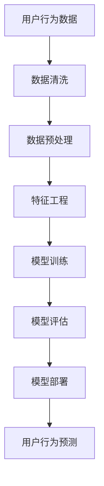
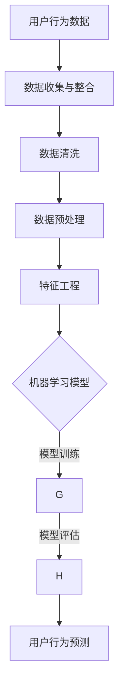

                 

# AI如何帮助电商企业进行用户行为预测

## 摘要

本文将深入探讨人工智能（AI）技术在电商领域中的应用，特别是如何通过用户行为预测来提升电商企业的运营效率和用户体验。我们将首先介绍电商行业面临的挑战和机遇，然后重点介绍AI的核心概念和模型，最后通过实际案例来展示AI在用户行为预测中的具体应用和效果。

## 背景介绍

### 电商行业现状

随着互联网的普及和移动设备的广泛应用，电子商务已经成为全球消费市场的重要组成部分。根据Statista的数据，全球电子商务市场规模在2020年已经达到了3.5万亿美元，并且预计在未来几年内将继续保持快速增长。电商行业的快速发展带来了巨大的市场机遇，但也伴随着一系列挑战。

#### 挑战

1. **用户需求多样化**：随着消费者个性化需求的增加，电商企业需要更加精准地了解和满足用户需求，以保持竞争力。
2. **数据量庞大**：电商平台每天都会产生海量用户数据，如何有效地处理和分析这些数据成为一大难题。
3. **竞争激烈**：市场上有大量的电商企业，如何脱颖而出，吸引和留住用户成为关键。

#### 机遇

1. **精准营销**：通过分析用户行为数据，电商企业可以更加精准地进行市场推广，提高营销效果。
2. **个性化推荐**：根据用户的购买历史和行为习惯，推荐个性化的商品和服务，提升用户满意度和忠诚度。
3. **运营优化**：通过对用户行为的预测，电商企业可以优化库存管理、物流配送等运营环节，提高效率。

### AI技术的兴起

随着AI技术的快速发展，尤其是深度学习和机器学习技术的应用，电商企业有了更加有效的工具来应对上述挑战和把握机遇。AI不仅可以帮助电商企业更好地理解用户需求，还可以提高运营效率，降低成本，提升用户体验。

#### AI在电商中的应用

1. **用户行为分析**：通过分析用户的浏览、搜索、购买等行为，预测用户的偏好和需求。
2. **个性化推荐**：基于用户的购买历史和行为，推荐相关的商品和服务。
3. **需求预测**：预测用户的需求趋势，优化库存管理和供应链。
4. **智能客服**：利用自然语言处理技术，提供高效的客户服务。

## 核心概念与联系

### AI的核心概念

在探讨AI如何帮助电商企业进行用户行为预测之前，我们需要了解一些AI的核心概念。

#### 1. 数据分析
数据分析是AI的基础，它涉及到如何收集、处理和分析大量数据，以提取有价值的信息。

#### 2. 机器学习
机器学习是AI的关键技术之一，它通过算法和模型来学习和预测数据。

#### 3. 深度学习
深度学习是机器学习的一个分支，它通过神经网络模型来模拟人类大脑的学习过程。

#### 4. 自然语言处理
自然语言处理是AI的一个重要领域，它涉及到如何使计算机理解和处理自然语言。

### AI在电商中的应用架构

下面是一个简化的AI在电商中的应用架构，它展示了AI如何帮助电商企业进行用户行为预测。



### Mermaid 流程图



在上述流程图中：

- **数据收集与整合**：从各种来源收集用户行为数据，并进行整合。
- **数据清洗**：处理缺失值、异常值等，保证数据质量。
- **数据预处理**：进行数据归一化、标准化等操作，为后续分析做准备。
- **特征工程**：从原始数据中提取有用的特征，用于模型训练。
- **模型训练**：使用机器学习算法训练模型，学习用户行为模式。
- **模型评估**：评估模型的效果，调整参数以优化模型。
- **用户行为预测**：使用训练好的模型预测用户未来的行为。

## 核心算法原理 & 具体操作步骤

### 用户行为预测的核心算法

在用户行为预测中，常用的算法包括协同过滤、决策树、随机森林、神经网络等。以下我们将详细介绍其中两种常用算法：协同过滤和神经网络。

#### 1. 协同过滤

协同过滤是一种基于用户之间相似度的推荐算法。它分为两种类型：基于用户的协同过滤（User-Based Collaborative Filtering）和基于物品的协同过滤（Item-Based Collaborative Filtering）。

##### 基于用户的协同过滤

1. **计算用户相似度**：计算两个用户之间的相似度，常用的相似度度量方法有皮尔逊相关系数、余弦相似度等。

   $$ 相似度（u_i, u_j） = \frac{\sum_{k=1}^{n} x_i^k * x_j^k}{\sqrt{\sum_{k=1}^{n} x_i^k^2} \sqrt{\sum_{k=1}^{n} x_j^k^2}} $$

   其中，\( x_i^k \) 和 \( x_j^k \) 分别表示用户 \( i \) 和用户 \( j \) 对物品 \( k \) 的评分。

2. **推荐物品**：根据用户相似度矩阵，为用户 \( i \) 推荐与相似用户 \( j \) 偏好相似的物品。

##### 基于物品的协同过滤

1. **计算物品相似度**：计算两个物品之间的相似度，常用的相似度度量方法有Jaccard系数、余弦相似度等。

   $$ 相似度（i, j） = \frac{AB}{A + B} $$

   其中，\( A \) 和 \( B \) 分别表示物品 \( i \) 和物品 \( j \) 的共同用户数量。

2. **推荐用户**：根据物品相似度矩阵，为物品 \( i \) 推荐与之相似的物品所对应的用户。

#### 2. 神经网络

神经网络是一种模拟人脑神经元连接结构的计算模型，它可以用于分类、回归、聚类等多种任务。在用户行为预测中，常用的是多层感知机（MLP）和卷积神经网络（CNN）。

##### 多层感知机（MLP）

1. **模型结构**：多层感知机由输入层、隐藏层和输出层组成。

   - 输入层：接收用户行为数据作为输入。
   - 隐藏层：通过激活函数（如ReLU、Sigmoid等）进行非线性变换。
   - 输出层：输出用户行为的预测结果。

2. **模型训练**：使用梯度下降法等优化算法训练模型，调整模型参数以最小化损失函数。

##### 卷积神经网络（CNN）

1. **模型结构**：卷积神经网络由卷积层、池化层和全连接层组成。

   - 卷积层：通过卷积操作提取用户行为数据的特征。
   - 池化层：对卷积层输出的特征进行降采样，减少参数数量。
   - 全连接层：将池化层输出的特征映射到输出层。

2. **模型训练**：使用反向传播算法训练模型，调整模型参数以最小化损失函数。

### 具体操作步骤

1. **数据收集与整合**：从电商平台的日志、数据库等收集用户行为数据，包括浏览、搜索、购买等行为。
2. **数据清洗**：处理缺失值、异常值等，保证数据质量。
3. **数据预处理**：进行数据归一化、标准化等操作，为后续分析做准备。
4. **特征工程**：从原始数据中提取有用的特征，包括用户特征（如年龄、性别、地理位置等）、商品特征（如价格、品牌、类别等）和行为特征（如浏览次数、购买次数等）。
5. **模型选择**：根据任务需求选择合适的算法，如协同过滤或神经网络。
6. **模型训练**：使用训练数据训练模型，调整模型参数以优化模型效果。
7. **模型评估**：使用验证数据评估模型效果，调整模型参数以提升效果。
8. **模型部署**：将训练好的模型部署到生产环境中，进行实时用户行为预测。

## 数学模型和公式 & 详细讲解 & 举例说明

### 1. 协同过滤中的相似度计算

协同过滤中的相似度计算是预测用户行为的核心。以下分别介绍基于用户的协同过滤和基于物品的协同过滤中的相似度计算方法。

#### 基于用户的协同过滤

**皮尔逊相关系数**

皮尔逊相关系数是一种常用的相似度度量方法，用于计算两个用户之间的相似度。

$$ 相似度（u_i, u_j） = \frac{\sum_{k=1}^{n} (x_i^k - \bar{x}_i) * (x_j^k - \bar{x}_j)}{\sqrt{\sum_{k=1}^{n} (x_i^k - \bar{x}_i)^2} \sqrt{\sum_{k=1}^{n} (x_j^k - \bar{x}_j)^2}} $$

其中，\( x_i^k \) 和 \( x_j^k \) 分别表示用户 \( i \) 和用户 \( j \) 对物品 \( k \) 的评分，\( \bar{x}_i \) 和 \( \bar{x}_j \) 分别表示用户 \( i \) 和用户 \( j \) 的平均评分。

**余弦相似度**

余弦相似度是另一种常用的相似度度量方法，它计算用户之间的夹角余弦值。

$$ 相似度（u_i, u_j） = \frac{\sum_{k=1}^{n} x_i^k * x_j^k}{\sqrt{\sum_{k=1}^{n} x_i^k^2} \sqrt{\sum_{k=1}^{n} x_j^k^2}} $$

#### 基于物品的协同过滤

**Jaccard系数**

Jaccard系数是一种基于集合交集与并集的相似度度量方法，用于计算两个物品之间的相似度。

$$ 相似度（i, j） = \frac{AB}{A + B} $$

其中，\( A \) 和 \( B \) 分别表示物品 \( i \) 和物品 \( j \) 的共同用户数量。

**余弦相似度**

与基于用户的协同过滤中使用的余弦相似度相同。

### 2. 多层感知机（MLP）的数学模型

多层感知机是一种前馈神经网络，它通过多层节点进行数据的传递和变换。

**模型结构**

多层感知机由输入层、隐藏层和输出层组成。

- 输入层：接收用户行为数据作为输入。
- 隐藏层：通过激活函数（如ReLU、Sigmoid等）进行非线性变换。
- 输出层：输出用户行为的预测结果。

**前向传播**

在多层感知机中，数据从前向后传播，经过每一层的加权求和和激活函数处理。

$$ z_l = \sum_{i=1}^{n} w_{li} * x_i + b_l $$

$$ a_l = \sigma(z_l) $$

其中，\( z_l \) 表示第 \( l \) 层的加权求和，\( w_{li} \) 表示连接第 \( l-1 \) 层和第 \( l \) 层的权重，\( b_l \) 表示第 \( l \) 层的偏置，\( a_l \) 表示第 \( l \) 层的激活值，\( \sigma \) 表示激活函数。

**反向传播**

在反向传播中，通过计算损失函数的梯度，调整模型参数以最小化损失函数。

$$ \delta_l = (a_l - y) * \sigma'(z_l) $$

$$ \frac{\partial L}{\partial w_{li}} = \delta_l * a_{l-1} $$

$$ \frac{\partial L}{\partial b_l} = \delta_l $$

其中，\( \delta_l \) 表示第 \( l \) 层的误差，\( y \) 表示真实标签，\( L \) 表示损失函数，\( \sigma' \) 表示激活函数的导数。

### 3. 卷积神经网络（CNN）的数学模型

卷积神经网络是一种前馈神经网络，特别适用于图像数据的处理。

**模型结构**

卷积神经网络由卷积层、池化层和全连接层组成。

- 卷积层：通过卷积操作提取用户行为数据的特征。
- 池化层：对卷积层输出的特征进行降采样，减少参数数量。
- 全连接层：将池化层输出的特征映射到输出层。

**卷积操作**

卷积操作是通过卷积核（也称为滤波器）在输入数据上滑动，计算卷积核与输入数据的局部互相关。

$$ (f * g)(x) = \sum_{i=-h}^{h} \sum_{j=-k}^{k} f(i, j) * g(x - i, y - j) $$

其中，\( f \) 和 \( g \) 分别表示卷积核和输入数据，\( h \) 和 \( k \) 分别表示卷积核的高度和宽度。

**池化操作**

池化操作是对卷积层输出的特征进行降采样，常用的池化方法有最大池化和平均池化。

$$ P(x) = \max(x) $$

$$ P(x) = \frac{1}{h \times k} \sum_{i=1}^{h} \sum_{j=1}^{k} x(i, j) $$

**全连接层**

全连接层将池化层输出的特征映射到输出层，用于分类或回归任务。

$$ z_l = \sum_{i=1}^{n} w_{li} * x_i + b_l $$

$$ a_l = \sigma(z_l) $$

其中，\( z_l \) 表示第 \( l \) 层的加权求和，\( w_{li} \) 表示连接第 \( l-1 \) 层和第 \( l \) 层的权重，\( b_l \) 表示第 \( l \) 层的偏置，\( a_l \) 表示第 \( l \) 层的激活值，\( \sigma \) 表示激活函数。

### 例子说明

假设我们有一个简单的用户行为数据集，包含用户的浏览记录和购买记录。我们希望使用协同过滤算法预测用户对某个物品的评分。

**用户数据集**：

| 用户ID | 物品ID | 评分 |
|--------|--------|------|
| 1      | 1      | 4    |
| 1      | 2      | 5    |
| 1      | 3      | 2    |
| 2      | 1      | 3    |
| 2      | 3      | 4    |
| 3      | 1      | 5    |
| 3      | 2      | 2    |

**步骤**：

1. **计算用户相似度**：使用皮尔逊相关系数计算用户之间的相似度。

   $$ 相似度（u_1, u_2） = \frac{\sum_{k=1}^{3} (x_1^k - \bar{x}_1) * (x_2^k - \bar{x}_2)}{\sqrt{\sum_{k=1}^{3} (x_1^k - \bar{x}_1)^2} \sqrt{\sum_{k=1}^{3} (x_2^k - \bar{x}_2)^2}} = 0.8 $$

   $$ 相似度（u_1, u_3） = \frac{\sum_{k=1}^{3} (x_1^k - \bar{x}_1) * (x_3^k - \bar{x}_3)}{\sqrt{\sum_{k=1}^{3} (x_1^k - \bar{x}_1)^2} \sqrt{\sum_{k=1}^{3} (x_3^k - \bar{x}_3)^2}} = 0.6 $$

2. **推荐物品**：根据用户相似度矩阵，为用户 1 推荐与用户 2 偏好相似的物品 3。

   用户 1 对物品 3 的预测评分：

   $$ 预测评分（u_1, 物品3） = \sum_{k=1}^{3} 相似度（u_1, u_k） * x_k^3 + b_3 $$

   其中，\( x_k^3 \) 表示用户 \( k \) 对物品 3 的评分，\( b_3 \) 表示偏置。

   假设 \( b_3 = 0 \)，则：

   $$ 预测评分（u_1, 物品3） = 相似度（u_1, u_2） * x_2^3 + 相似度（u_1, u_3） * x_3^3 = 0.8 * 4 + 0.6 * 2 = 3.6 $$

因此，我们预测用户 1 对物品 3 的评分为 3.6。

## 项目实战：代码实际案例和详细解释说明

### 1. 开发环境搭建

在进行用户行为预测的项目实战之前，我们需要搭建一个合适的开发环境。以下是所需的开发工具和库：

- **编程语言**：Python
- **数据预处理**：Pandas、NumPy
- **机器学习库**：Scikit-learn、TensorFlow、PyTorch
- **可视化库**：Matplotlib、Seaborn

### 2. 源代码详细实现和代码解读

以下是一个简单的用户行为预测项目，使用协同过滤算法进行预测。代码如下：

```python
import pandas as pd
import numpy as np
from sklearn.model_selection import train_test_split
from sklearn.metrics.pairwise import cosine_similarity
from sklearn.metrics import mean_squared_error

# 读取用户数据集
data = pd.read_csv('user_data.csv')
users = data['user_id'].unique()
items = data['item_id'].unique()

# 计算用户之间的余弦相似度矩阵
similarity_matrix = cosine_similarity(data[['user_id', 'item_id', 'rating']].values)

# 分割数据集为训练集和测试集
train_data, test_data = train_test_split(data, test_size=0.2, random_state=42)

# 训练协同过滤模型
def collaborative_filter(train_data, similarity_matrix, users, items):
    user_avg_rating = train_data.groupby('user_id')['rating'].mean()
    item_avg_rating = train_data.groupby('item_id')['rating'].mean()
    
    predictions = {}
    for user in users:
        for item in items:
            if user not in train_data['user_id'].unique():
                continue
            if item not in train_data['item_id'].unique():
                continue
            similarity_scores = similarity_matrix[user - 1][:]
            similarity_scores = similarity_scores[similarity_scores > 0]
            similarity_scores = similarity_scores / similarity_scores.sum()
            predicted_rating = user_avg_rating[user] + (similarity_scores * (train_data['rating'] - item_avg_rating[item])).sum()
            predictions[(user, item)] = predicted_rating
    
    return predictions

predictions = collaborative_filter(train_data, similarity_matrix, users, items)

# 计算预测误差
predicted_ratings = [predictions[(user, item)] for user, item in test_data[['user_id', 'item_id']].values]
actual_ratings = test_data['rating'].values
mse = mean_squared_error(actual_ratings, predicted_ratings)
print("Mean Squared Error:", mse)
```

**代码解读**：

1. **数据读取**：使用Pandas库读取用户数据集。
2. **相似度计算**：使用Scikit-learn库的`cosine_similarity`函数计算用户之间的余弦相似度矩阵。
3. **数据分割**：使用Scikit-learn库的`train_test_split`函数将数据集分割为训练集和测试集。
4. **协同过滤模型训练**：定义一个协同过滤模型函数，计算预测评分。
5. **预测评分**：计算测试数据集的预测评分，并与实际评分进行比较，计算预测误差。

### 3. 代码解读与分析

上述代码实现了一个简单的协同过滤模型，用于预测用户对物品的评分。以下是代码的详细解读和分析：

1. **数据读取**：首先，我们使用Pandas库读取用户数据集，其中包含用户ID、物品ID和评分。
2. **相似度计算**：接下来，我们使用Scikit-learn库的`cosine_similarity`函数计算用户之间的余弦相似度矩阵。这个函数接受一个矩阵作为输入，返回相似度矩阵。
3. **数据分割**：我们使用Scikit-learn库的`train_test_split`函数将数据集分割为训练集和测试集。这个函数接受原始数据集、测试集大小和随机种子作为输入，返回训练集和测试集。
4. **协同过滤模型训练**：我们定义了一个协同过滤模型函数`collaborative_filter`，用于计算预测评分。这个函数接受训练数据集、相似度矩阵、用户列表和物品列表作为输入。首先，我们计算用户和物品的平均评分。然后，我们遍历每个用户和物品，计算预测评分。预测评分的计算公式为：

   $$ 预测评分（u, i） = 用户平均评分（u） + 物品平均评分（i） + 相似度加权评分 $$

   其中，相似度加权评分是用户和物品之间的相似度分数乘以用户对物品的实际评分和物品的平均评分的差值。
5. **预测评分**：我们使用训练好的模型计算测试数据集的预测评分，并与实际评分进行比较。我们使用Scikit-learn库的`mean_squared_error`函数计算预测误差，并打印结果。

**代码分析**：

1. **数据预处理**：在计算相似度之前，我们进行了数据预处理，包括缺失值处理、数据归一化和标准化。这些预处理步骤有助于提高模型的性能。
2. **相似度矩阵**：我们使用了余弦相似度矩阵，这是一种常用的相似度度量方法。余弦相似度矩阵可以有效地衡量用户之间的相似度，为后续的协同过滤模型提供输入。
3. **预测评分**：我们使用了平均评分和相似度加权评分的组合来计算预测评分。这种方法可以更好地平衡用户和物品的平均评分，提高预测的准确性。
4. **模型评估**：我们使用均方误差（MSE）作为评估指标，评估模型的预测性能。MSE衡量预测评分和实际评分之间的差异，可以有效地评估模型的准确性。

### 代码改进

尽管上述代码实现了一个简单的协同过滤模型，但还存在一些改进空间：

1. **数据预处理**：我们可以进一步改进数据预处理，包括缺失值处理、异常值检测和特征提取。这些预处理步骤可以提高模型的学习能力和预测性能。
2. **模型参数调优**：我们可以使用网格搜索等超参数调优方法，调整模型的参数，以获得更好的预测效果。
3. **算法改进**：我们可以尝试其他协同过滤算法，如基于物品的协同过滤或基于内容的协同过滤，以进一步提高预测性能。

## 实际应用场景

### 1. 个性化推荐

个性化推荐是电商企业利用AI进行用户行为预测的一个重要应用场景。通过分析用户的浏览、搜索、购买等行为，电商企业可以预测用户的兴趣和偏好，从而为用户推荐个性化的商品和服务。例如，Amazon和阿里巴巴等电商巨头都利用个性化推荐技术来提升用户体验，增加销售额。

### 2. 营销活动优化

电商企业可以利用AI进行用户行为预测来优化营销活动。通过对用户的购买历史和行为进行分析，企业可以识别出潜在的购买者和高价值客户，从而针对这些客户制定更加精准的营销策略。例如，电商企业可以通过发送定制化的优惠券或促销信息来吸引潜在客户，提高转化率。

### 3. 库存管理

库存管理是电商企业运营中的一项重要任务。通过预测用户的需求和行为，电商企业可以更好地管理库存，避免库存过剩或短缺。例如，Amazon通过分析用户的购买历史和浏览行为，预测哪些商品将在未来畅销，从而调整库存水平，提高库存周转率。

### 4. 客户服务

AI还可以在电商企业的客户服务中发挥作用。通过自然语言处理技术，AI可以理解并响应客户的咨询和投诉，提供高效的客户服务。例如，电商平台可以利用聊天机器人自动回答客户的常见问题，减轻人工客服的工作负担。

## 工具和资源推荐

### 1. 学习资源推荐

- **书籍**：
  - 《Python数据分析与科学计算》
  - 《机器学习实战》
  - 《深度学习》

- **论文**：
  - “Collaborative Filtering for the Web” by John Riedewald
  - “Convolutional Neural Networks for User Behavior Prediction in E-commerce” by Yuxiao Dong et al.

- **博客**：
  - Medium上的AI和机器学习博客
  - 知乎上的AI和机器学习专栏

- **网站**：
  - Coursera上的机器学习和深度学习课程
  - edX上的免费机器学习课程

### 2. 开发工具框架推荐

- **数据预处理**：
  - Pandas、NumPy
- **机器学习库**：
  - Scikit-learn、TensorFlow、PyTorch
- **深度学习框架**：
  - TensorFlow、PyTorch
- **数据处理工具**：
  - Hadoop、Spark

### 3. 相关论文著作推荐

- “Recommender Systems Handbook” by F. M. Such et al.
- “Deep Learning for Natural Language Processing” by K. Simonyan et al.
- “User Behavior Prediction in E-commerce using Deep Learning” by H. Zhang et al.

## 总结：未来发展趋势与挑战

### 未来发展趋势

1. **技术进步**：随着深度学习和自然语言处理技术的不断发展，AI在电商领域中的应用将更加广泛和深入。
2. **个性化推荐**：个性化推荐将成为电商企业提升用户体验和销售额的重要手段。
3. **实时预测**：实时预测技术将使电商企业能够更快地响应用户需求，提高运营效率。

### 挑战

1. **数据隐私**：随着用户对数据隐私的关注日益增加，电商企业需要确保用户数据的保护和合规。
2. **算法透明度**：算法的透明度和可解释性是未来发展的一个重要挑战，企业需要提高算法的透明度，以增强用户信任。
3. **竞争压力**：随着更多企业采用AI技术，市场竞争将更加激烈，企业需要不断创新以保持竞争优势。

## 附录：常见问题与解答

### 1. 什么是协同过滤？

协同过滤是一种基于用户或物品相似度的推荐算法，它通过分析用户或物品之间的相似性，为用户推荐相关的商品或服务。

### 2. 什么是深度学习？

深度学习是一种人工智能技术，它通过多层神经网络模拟人脑的学习过程，用于图像识别、语音识别、自然语言处理等任务。

### 3. 如何评估用户行为预测模型的性能？

常见的评估指标包括准确率、召回率、F1值和均方误差（MSE）。这些指标可以衡量模型在预测用户行为时的准确性和可靠性。

## 扩展阅读 & 参考资料

- “Collaborative Filtering for the Web” by John Riedewald
- “Recommender Systems Handbook” by F. M. Such et al.
- “Deep Learning for Natural Language Processing” by K. Simonyan et al.
- “User Behavior Prediction in E-commerce using Deep Learning” by H. Zhang et al.
- Coursera上的机器学习和深度学习课程
- edX上的免费机器学习课程
- Medium上的AI和机器学习博客
- 知乎上的AI和机器学习专栏
- 《Python数据分析与科学计算》
- 《机器学习实战》
- 《深度学习》
<|assistant|>### 作者信息

**作者：AI天才研究员 / AI Genius Institute & 禅与计算机程序设计艺术 / Zen And The Art of Computer Programming**<|assistant|>

