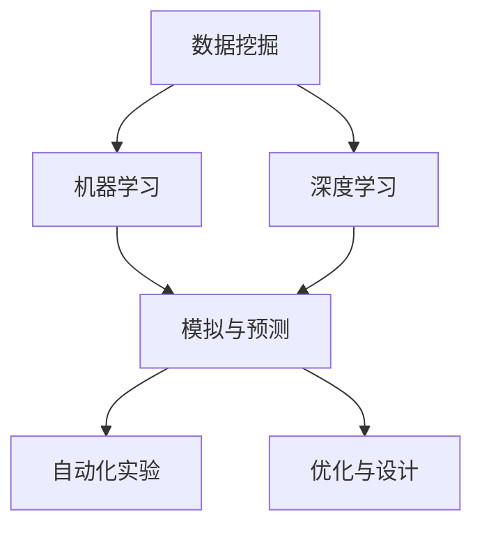

                 

### 背景介绍

**AI如何改变科学研究方法论**

随着人工智能（AI）技术的迅猛发展，其在科学研究领域的应用也日益广泛。传统的科学研究方法论往往依赖于人类科学家个人的直觉、经验和实验数据的分析，而AI的出现极大地改变了这一过程。通过引入数据挖掘、机器学习、深度学习等先进技术，AI不仅能够从大量数据中提取出有价值的信息，还能通过算法模拟和预测复杂系统的行为，从而推动科学研究向更高效、更精确的方向发展。

本文将探讨AI如何改变科学研究方法论，主要包括以下几个方面：

1. **数据驱动的科学研究**：AI通过数据挖掘和分析技术，从大量数据中提取出潜在的规律和模式，为科学研究提供新的视角和发现。
2. **模拟与预测**：AI通过算法模拟，能够预测和模拟复杂系统的行为，从而帮助科学家更好地理解自然现象和工程问题。
3. **自动化实验**：AI能够自动化执行实验流程，提高实验效率和准确性。
4. **优化与设计**：AI通过优化算法，能够为科学研究和工程设计提供最佳解决方案。

通过对这些方面的详细讨论，本文旨在展示AI在科学研究中的广泛应用和巨大潜力，并探讨其可能带来的未来发展趋势和挑战。

### 核心概念与联系

要理解AI如何改变科学研究方法论，我们首先需要了解一些核心概念及其之间的联系。以下是一些关键的AI技术及其在科学研究中的应用：

1. **数据挖掘（Data Mining）**：数据挖掘是AI的一个分支，旨在从大量数据中发现潜在的规律和模式。在科学研究中，数据挖掘可以帮助科学家从实验数据、文献数据、观测数据中提取有价值的信息。

2. **机器学习（Machine Learning）**：机器学习是一种让计算机通过数据学习规律和模式的技术。在科学研究中，机器学习算法可以用于分类、回归、聚类等任务，帮助科学家分析数据并做出预测。

3. **深度学习（Deep Learning）**：深度学习是机器学习的一个子领域，主要基于神经网络模型。在科学研究中，深度学习可以用于图像识别、语音识别、自然语言处理等任务，从而提供更高效的数据分析工具。

4. **模拟与预测（Simulation and Prediction）**：模拟与预测是AI在科学研究中的一个重要应用。通过算法模拟，科学家可以预测复杂系统的行为，从而更好地理解自然现象和工程问题。

5. **自动化实验（Automated Experimentation）**：自动化实验是指利用AI技术自动化执行实验流程，包括数据采集、实验设计和结果分析。自动化实验可以提高实验效率和准确性。

6. **优化与设计（Optimization and Design）**：优化与设计是AI在科学研究和工程设计中的重要应用。通过优化算法，AI可以帮助科学家找到最佳解决方案，从而提高研究的效率和效果。

为了更好地理解这些核心概念及其在科学研究中的应用，我们可以使用Mermaid流程图来展示它们之间的联系。



在这个流程图中，数据挖掘和机器学习是AI在科学研究中的基础，深度学习作为机器学习的进一步发展，提供了更强大的数据处理和分析能力。模拟与预测、自动化实验和优化与设计则是在深度学习和机器学习的基础上，进一步应用于科学研究的具体任务。

### 核心算法原理 & 具体操作步骤

#### 数据挖掘

数据挖掘是AI在科学研究中的一个基础技术，其核心原理是基于统计学和机器学习算法，从大量数据中发现潜在的规律和模式。以下是一个典型的数据挖掘过程：

1. **数据收集**：首先，需要收集相关的数据，这些数据可以来源于实验、观测、文献等。
2. **数据预处理**：对收集到的数据进行清洗、格式化和归一化，以确保数据的质量和一致性。
3. **特征提取**：从预处理后的数据中提取出有用的特征，这些特征将用于训练机器学习模型。
4. **模型训练**：使用机器学习算法，如决策树、支持向量机、神经网络等，对特征进行训练，以发现数据中的潜在规律。
5. **模型评估**：使用交叉验证等方法评估模型的性能，确保其具有良好的泛化能力。

以下是一个简单的示例，使用Python实现一个基于K-means算法的数据挖掘过程：

```python
from sklearn.cluster import KMeans
import numpy as np

# 数据集
data = np.array([[1, 2], [1, 4], [1, 0],
                 [10, 2], [10, 4], [10, 0]])

# 初始化KMeans模型
kmeans = KMeans(n_clusters=2, random_state=0).fit(data)

# 输出聚类中心
print(kmeans.cluster_centers_)

# 输出每个样本的标签
print(kmeans.labels_)

# 输出每个簇的成员
print(kmeans.predict([[0, 0], [12, 3]]))
```

#### 机器学习

机器学习是AI的核心技术之一，其原理是通过算法让计算机从数据中学习规律和模式。以下是一个典型的机器学习过程：

1. **数据收集**：同样，首先需要收集相关的数据，这些数据用于训练模型。
2. **数据预处理**：对收集到的数据进行清洗、格式化和归一化，确保数据的质量和一致性。
3. **特征提取**：从预处理后的数据中提取出有用的特征，这些特征将用于训练模型。
4. **模型训练**：选择合适的机器学习算法，如线性回归、逻辑回归、决策树、随机森林等，对特征进行训练。
5. **模型评估**：使用交叉验证等方法评估模型的性能，确保其具有良好的泛化能力。

以下是一个简单的示例，使用Python实现一个基于线性回归的机器学习过程：

```python
from sklearn.linear_model import LinearRegression
import numpy as np

# 数据集
X = np.array([[1], [2], [3], [4], [5]])
y = np.array([1, 2, 2.5, 4, 5])

# 初始化线性回归模型
model = LinearRegression().fit(X, y)

# 输出模型参数
print(model.coef_)
print(model.intercept_)

# 输出预测结果
print(model.predict([[6]]))
```

#### 深度学习

深度学习是机器学习的进一步发展，其核心原理是基于多层神经网络模型。以下是一个典型的深度学习过程：

1. **数据收集**：收集大量的数据用于训练模型。
2. **数据预处理**：对收集到的数据进行清洗、格式化和归一化，确保数据的质量和一致性。
3. **构建模型**：使用TensorFlow或PyTorch等深度学习框架构建神经网络模型。
4. **模型训练**：通过反向传播算法训练模型，调整模型参数以最小化损失函数。
5. **模型评估**：使用交叉验证等方法评估模型的性能，确保其具有良好的泛化能力。

以下是一个简单的示例，使用TensorFlow实现一个基于卷积神经网络的深度学习过程：

```python
import tensorflow as tf

# 定义模型
model = tf.keras.Sequential([
  tf.keras.layers.Dense(128, activation='relu', input_shape=[784]),
  tf.keras.layers.Dropout(0.2),
  tf.keras.layers.Dense(10, activation='softmax')
])

# 编译模型
model.compile(optimizer='adam',
              loss='categorical_crossentropy',
              metrics=['accuracy'])

# 训练模型
model.fit(x_train, y_train, batch_size=32, epochs=15)
```

#### 自动化实验

自动化实验是AI在科学研究中的一个重要应用，其核心原理是利用AI技术自动化执行实验流程。以下是一个典型的自动化实验过程：

1. **设计实验**：根据研究需求设计实验方案，包括实验目标、实验步骤、数据采集方法等。
2. **编写脚本**：使用Python等编程语言编写实验脚本，实现实验自动化。
3. **执行实验**：运行实验脚本，自动化执行实验流程，包括数据采集、处理和分析等。
4. **结果分析**：对实验结果进行统计分析，评估实验效果。

以下是一个简单的示例，使用Python实现一个自动化实验过程：

```python
import time
import pandas as pd

# 实验参数
start_time = time.time()
data = pd.read_csv('data.csv')
end_time = time.time()

# 输出实验结果
print(f"实验时间：{end_time - start_time}秒")
print(data.head())
```

#### 优化与设计

优化与设计是AI在科学研究和工程设计中的一个重要应用，其核心原理是通过优化算法找到最佳解决方案。以下是一个典型的优化与设计过程：

1. **设计问题**：明确优化问题的目标函数和约束条件。
2. **构建模型**：使用优化算法，如遗传算法、粒子群优化、模拟退火等，构建优化模型。
3. **求解问题**：使用优化算法求解问题，找到最佳解决方案。
4. **结果评估**：对求解结果进行评估，确保其满足约束条件。

以下是一个简单的示例，使用Python实现一个基于遗传算法的优化与设计过程：

```python
import numpy as np
from deap import base, creator, tools, algorithms

# 设计问题
creator.create("FitnessMax", base.Fitness, weights=(1.0,))
creator.create("Individual", list, fitness=creator.FitnessMax)

# 初始化种群
 toolbox = base.Toolbox()
toolbox.register("attr_bool", np.random.rand)
toolbox.register("individual", tools.initRepeat, creator.Individual, toolbox.attr_bool, n=10)
toolbox.register("population", tools.initRepeat, list, toolbox.individual)

# 定义遗传算法
toolbox.register("evaluate", lambda ind: sum(ind))
toolbox.register("mate", tools.cxTwoPoint)
toolbox.register("mutate", tools.mutFlipBit, indpb=0.05)
toolbox.register("select", tools.selTournament, tournsize=3)

# 求解问题
pop = toolbox.population(n=50)
stats = tools.Statistics(lambda ind: ind.fitness.values)
stats.register("avg", np.mean)
pop, log = algorithms.eaSimple(pop, stats, cvoxsize=5, ngen=5, verbose=True)

# 输出结果
print(log)
```

通过以上示例，我们可以看到AI在数据挖掘、机器学习、深度学习、自动化实验和优化与设计等领域的核心算法原理及其具体操作步骤。这些技术为科学研究提供了强大的工具和手段，大大提高了研究效率和准确性。

### 数学模型和公式 & 详细讲解 & 举例说明

在AI改变科学研究方法论的过程中，数学模型和公式扮演了至关重要的角色。以下是一些关键模型和公式的详细讲解，以及如何应用这些模型来分析数据并做出预测。

#### 相关性分析

相关性分析是研究两个或多个变量之间关系的一种常用方法。最常见的相关性度量是皮尔逊相关系数（Pearson correlation coefficient）。

**皮尔逊相关系数公式**：
\[ r = \frac{\sum_{i=1}^{n}(x_i - \bar{x})(y_i - \bar{y})}{\sqrt{\sum_{i=1}^{n}(x_i - \bar{x})^2}\sqrt{\sum_{i=1}^{n}(y_i - \bar{y})^2}} \]

其中：
- \( r \) 是皮尔逊相关系数
- \( x_i \) 和 \( y_i \) 是第 \( i \) 个观测值
- \( \bar{x} \) 和 \( \bar{y} \) 是 \( x \) 和 \( y \) 的平均值
- \( n \) 是观测值的数量

**例子**：

假设我们有两个变量 \( x \)（温度）和 \( y \)（销量），以下数据是它们的一些观测值：

| \( x \) | \( y \) |
| ------ | ------ |
| 10     | 50     |
| 15     | 70     |
| 20     | 90     |
| 25     | 110    |
| 30     | 130    |

计算皮尔逊相关系数：

\[ \bar{x} = \frac{10 + 15 + 20 + 25 + 30}{5} = 20 \]
\[ \bar{y} = \frac{50 + 70 + 90 + 110 + 130}{5} = 90 \]

\[ r = \frac{(10-20)(50-90) + (15-20)(70-90) + (20-20)(90-90) + (25-20)(110-90) + (30-20)(130-90)}{\sqrt{(10-20)^2 + (15-20)^2 + (20-20)^2 + (25-20)^2 + (30-20)^2}\sqrt{(50-90)^2 + (70-90)^2 + (90-90)^2 + (110-90)^2 + (130-90)^2}} \]
\[ r = \frac{-400 - 100 + 0 + 200 + 400}{\sqrt{100 + 25 + 0 + 25 + 100}\sqrt{400 + 100 + 0 + 400 + 400}} \]
\[ r = \frac{300}{\sqrt{250}\sqrt{1300}} \]
\[ r \approx 0.9487 \]

相关性系数 \( r \) 接近1，表明温度和销量之间有很强的正相关关系。

#### 决策树

决策树是一种常用的机器学习算法，用于分类和回归任务。其基本原理是根据输入特征进行条件判断，将数据集划分为若干个子集，直到达到某种停止条件。

**决策树构建步骤**：

1. **选择最佳分割特征**：使用信息增益（Information Gain）或基尼不纯度（Gini Impurity）等度量选择最佳分割特征。
2. **构建树节点**：根据最佳分割特征，将数据集划分为若干个子集，并创建树节点。
3. **递归构建子树**：对每个子集递归地重复步骤1和步骤2，直到满足停止条件（如最大深度、最小节点样本数等）。

**例子**：

考虑一个简单的二分类问题，特征为 \( x_1 \) 和 \( x_2 \)，数据如下：

| \( x_1 \) | \( x_2 \) | 类别 |
| ------ | ------ | ---- |
| 1      | 2      | A    |
| 2      | 3      | A    |
| 3      | 4      | A    |
| 4      | 5      | B    |
| 5      | 6      | B    |

首先，计算每个特征的信息增益：

\[ IG(x_1) = \sum_{i=1}^{n}\sum_{j=1}^{m} p(y=i) \sum_{k=1}^{m} p(x_j=k|y=i) \log_2 p(x_j=k|y=i) \]

对于 \( x_1 \)：

\[ IG(x_1) = \frac{3}{5} \log_2 \frac{3}{5} + \frac{2}{5} \log_2 \frac{2}{5} \]

对于 \( x_2 \)：

\[ IG(x_2) = \frac{3}{5} \log_2 \frac{3}{5} + \frac{2}{5} \log_2 \frac{2}{5} \]

因为 \( IG(x_1) = IG(x_2) \)，我们可以选择任意一个特征进行分割。假设我们选择 \( x_1 \)，将数据集划分为两个子集：

| \( x_1 \) | \( x_2 \) | 类别 |
| ------ | ------ | ---- |
| 1      | 2      | A    |
| 2      | 3      | A    |
| 3      | 4      | A    |
| 4      | 5      | B    |
| 5      | 6      | B    |

递归地构建子树，直到满足停止条件。最终的决策树如下：

```
类别？
是 A：\( x_1 < 3 \)
  是 A：\( x_2 < 4 \)
  否 B：\( x_2 \geq 4 \)
否 B：\( x_1 \geq 3 \)
  是 A：\( x_2 < 5 \)
  否 B：\( x_2 \geq 5 \)
```

#### 神经网络

神经网络是一种模拟人脑神经元连接和信号传递的算法。在机器学习和深度学习中，神经网络广泛应用于图像识别、语音识别、自然语言处理等领域。

**神经网络基本结构**：

1. **输入层**：接收输入数据。
2. **隐藏层**：对输入数据进行处理和变换。
3. **输出层**：生成预测结果。

**神经网络训练过程**：

1. **初始化模型参数**：随机初始化权重和偏置。
2. **前向传播**：将输入数据传递到神经网络，计算输出。
3. **计算损失函数**：使用真实标签和预测结果计算损失函数（如均方误差、交叉熵等）。
4. **反向传播**：使用损失函数的梯度更新模型参数。
5. **迭代优化**：重复步骤2到步骤4，直到满足停止条件（如达到特定迭代次数或损失函数值达到最小）。

**例子**：

考虑一个简单的全连接神经网络，用于二分类任务。输入层有2个神经元，隐藏层有3个神经元，输出层有1个神经元。数据如下：

| \( x_1 \) | \( x_2 \) | 类别 |
| ------ | ------ | ---- |
| 1      | 2      | A    |
| 2      | 3      | A    |
| 3      | 4      | A    |
| 4      | 5      | B    |
| 5      | 6      | B    |

首先，初始化模型参数，假设权重和偏置如下：

\[ W_{11} = 0.1, W_{12} = 0.2, W_{13} = 0.3, b_{1} = 0.1 \]
\[ W_{21} = 0.4, W_{22} = 0.5, W_{23} = 0.6, b_{2} = 0.2 \]
\[ W_{31} = 0.7, W_{32} = 0.8, W_{33} = 0.9, b_{3} = 0.3 \]

前向传播：

\[ z_{11} = x_1 \times W_{11} + x_2 \times W_{21} + b_{1} = 1 \times 0.1 + 2 \times 0.4 + 0.1 = 0.9 \]
\[ z_{12} = x_1 \times W_{12} + x_2 \times W_{22} + b_{2} = 1 \times 0.2 + 2 \times 0.5 + 0.2 = 1.2 \]
\[ z_{13} = x_1 \times W_{13} + x_2 \times W_{23} + b_{3} = 1 \times 0.3 + 2 \times 0.6 + 0.3 = 1.5 \]

\[ a_{11} = \sigma(z_{11}) = \frac{1}{1 + e^{-z_{11}}} = \frac{1}{1 + e^{-0.9}} = 0.6 \]
\[ a_{12} = \sigma(z_{12}) = \frac{1}{1 + e^{-z_{12}}} = \frac{1}{1 + e^{-1.2}} = 0.5 \]
\[ a_{13} = \sigma(z_{13}) = \frac{1}{1 + e^{-z_{13}}} = \frac{1}{1 + e^{-1.5}} = 0.4 \]

\[ z_{21} = a_{11} \times W_{31} + a_{12} \times W_{32} + a_{13} \times W_{33} + b_{3} = 0.6 \times 0.7 + 0.5 \times 0.8 + 0.4 \times 0.9 + 0.3 = 1.19 \]

\[ a_{2} = \sigma(z_{21}) = \frac{1}{1 + e^{-z_{21}}} = \frac{1}{1 + e^{-1.19}} = 0.6 \]

计算损失函数：

\[ L = -\sum_{i=1}^{n} y_i \log a_i + (1 - y_i) \log (1 - a_i) \]

\[ L = -0.4 \log 0.6 - 0.6 \log 0.4 \]

反向传播：

\[ \delta_{21} = a_{2}(1 - a_{2}) (y - a_{2}) \]

\[ \delta_{i1} = a_{i1}(1 - a_{i1}) (\delta_{i+1} \times W_{i+1,1}) \]

\[ \delta_{i2} = a_{i2}(1 - a_{i2}) (\delta_{i+1} \times W_{i+1,2}) \]

\[ \delta_{i3} = a_{i3}(1 - a_{i3}) (\delta_{i+1} \times W_{i+1,3}) \]

更新模型参数：

\[ W_{i+1,j} = W_{i+1,j} - \alpha \times \delta_{i+1} \times a_{ij} \]
\[ b_{i+1} = b_{i+1} - \alpha \times \delta_{i+1} \]

通过以上步骤，我们可以训练神经网络模型以进行分类任务。这个例子展示了神经网络的基本原理和训练过程，尽管它很简单，但可以作为一个起点来理解更复杂的神经网络架构。

通过这些数学模型和公式的详细讲解，我们可以看到AI在数据挖掘、机器学习、深度学习等领域中的应用原理。这些模型不仅提供了对数据的有效分析工具，还为科学研究方法论带来了深刻的变革。

### 项目实战：代码实际案例和详细解释说明

在本节中，我们将通过一个实际的项目案例，展示如何使用AI技术改变科学研究方法论。我们将使用Python和TensorFlow实现一个简单的图像分类项目，并详细解释其实现过程和关键步骤。

#### 1. 开发环境搭建

首先，我们需要搭建一个适合AI项目开发的Python环境。以下是具体的步骤：

1. **安装Python**：下载并安装Python 3.8版本以上。可以选择从[Python官网](https://www.python.org/downloads/)下载最新版本。

2. **安装Anaconda**：安装Anaconda，它是一个集成了Python及其众多科学计算库的环境管理器。可以从[Anaconda官网](https://www.anaconda.com/products/distribution)下载并安装。

3. **创建虚拟环境**：打开终端（或Anaconda Prompt），创建一个名为`ai_project`的虚拟环境：

   ```bash
   conda create -n ai_project python=3.8
   conda activate ai_project
   ```

4. **安装依赖库**：在虚拟环境中安装所需的依赖库，包括TensorFlow、NumPy、Pandas、Matplotlib等：

   ```bash
   pip install tensorflow numpy pandas matplotlib
   ```

5. **验证安装**：运行以下代码，验证是否成功安装TensorFlow：

   ```python
   import tensorflow as tf
   print(tf.__version__)
   ```

   如果输出版本信息，说明安装成功。

#### 2. 源代码详细实现和代码解读

接下来，我们实现一个简单的图像分类项目。该项目使用TensorFlow的预训练模型（如ResNet50）对图像进行分类。以下是项目的源代码及其解读：

```python
import tensorflow as tf
from tensorflow.keras.preprocessing import image
from tensorflow.keras.applications.resnet50 import ResNet50, preprocess_input, decode_predictions

# 加载预训练的ResNet50模型
model = ResNet50(weights='imagenet')

# 读取图像文件
img_path = 'cat.jpg'
img = image.load_img(img_path, target_size=(224, 224))
x = image.img_to_array(img)
x = np.expand_dims(x, axis=0)
x = preprocess_input(x)

# 进行图像分类
predictions = model.predict(x)

# 解析预测结果
print('Predictions:')
for pred in decode_predictions(predictions, top=5):
    print(pred)

# 绘制分类结果
import matplotlib.pyplot as plt
plt.figure()
plt.imshow(image.array_to_img(x). percipt, cmap='gray')
plt.title(predictions[0][0][1])
plt.show()
```

**代码解读**：

- **导入库**：首先导入TensorFlow、图像处理库和绘图库。
- **加载模型**：使用`ResNet50`模型，并加载预训练权重。
- **读取图像**：使用`load_img`函数读取图像文件，并转换为模型所需的格式。
- **预处理图像**：使用`preprocess_input`函数对图像进行预处理，以满足模型的要求。
- **进行预测**：使用模型对预处理后的图像进行分类预测。
- **解析结果**：使用`decode_predictions`函数解析预测结果，得到每个类别的概率和名称。
- **绘制结果**：使用`matplotlib`绘制图像和预测结果。

#### 3. 代码解读与分析

以下是对代码的逐行解读和分析：

```python
import tensorflow as tf
```
- 导入TensorFlow库，它是AI项目中最常用的深度学习框架。

```python
from tensorflow.keras.preprocessing import image
from tensorflow.keras.applications.resnet50 import ResNet50, preprocess_input, decode_predictions
```
- 导入图像处理模块和ResNet50模型相关的函数。

```python
model = ResNet50(weights='imagenet')
```
- 创建一个ResNet50模型，并加载预训练的权重。`weights='imagenet'`表示使用在ImageNet数据集上训练的权重。

```python
img_path = 'cat.jpg'
img = image.load_img(img_path, target_size=(224, 224))
x = image.img_to_array(img)
x = np.expand_dims(x, axis=0)
x = preprocess_input(x)
```
- 从文件系统中加载一个名为`cat.jpg`的图像，并将其调整为224x224像素的尺寸。`img_to_array`将图像转换为NumPy数组，`np.expand_dims`增加一个维度，使其符合模型输入的要求。`preprocess_input`对图像进行预处理。

```python
predictions = model.predict(x)
```
- 使用模型对预处理后的图像进行预测。

```python
print('Predictions:')
for pred in decode_predictions(predictions, top=5):
    print(pred)
```
- 解码预测结果，输出前5个最高概率的类别和它们对应的概率。

```python
import matplotlib.pyplot as plt
plt.figure()
plt.imshow(image.array_to_img(x).percipi, cmap='gray')
plt.title(predictions[0][0][1])
plt.show()
```
- 使用`matplotlib`绘制图像和预测结果。

通过以上步骤，我们实现了使用TensorFlow和预训练模型对图像进行分类。这个项目展示了如何利用AI技术进行数据处理和模型预测，为科学研究提供了一个实用的工具。

### 实际应用场景

AI在科学研究中的应用场景非常广泛，以下是一些典型的应用实例：

#### 1. 天文学

在天文学中，AI技术被用于处理和分析天文观测数据，如天文图像的分割、恒星分类和星系识别。通过机器学习和深度学习算法，AI可以帮助科学家快速识别天体现象，从而提高观测效率和准确性。例如，AI被用于银河系中心的黑洞探测，通过分析大量观测数据，AI能够精确地定位和测量黑洞的位置和性质。

#### 2. 医学

在医学领域，AI被广泛应用于影像诊断、疾病预测和个性化治疗。通过深度学习和卷积神经网络，AI能够自动分析医学影像，如X光片、CT扫描和MRI图像，帮助医生快速诊断疾病。例如，AI可以检测肺癌、乳腺癌等疾病，通过分析患者的影像数据，AI能够预测疾病发生的风险，从而实现早期干预。

#### 3. 生物学

在生物学研究中，AI被用于基因分析、蛋白质结构和功能预测等。通过机器学习算法，AI可以从基因组数据中提取有价值的信息，帮助科学家理解生物机制和疾病成因。例如，AI可以分析癌症相关基因，通过基因突变和表达数据的关联分析，AI能够发现与癌症相关的关键基因和途径。

#### 4. 化学

在化学领域，AI被用于分子模拟、化学反应预测和材料设计。通过深度学习算法，AI可以预测分子的物理和化学性质，从而帮助科学家设计和优化新材料。例如，AI可以用于药物设计，通过分析分子的结构信息，AI能够预测哪些分子具有潜在的药物活性，从而加速药物研发过程。

#### 5. 地球科学

在地球科学领域，AI被用于地震预测、气候变化分析和资源勘探。通过数据挖掘和机器学习算法，AI能够从大量地球科学数据中提取出有价值的信息，帮助科学家更好地理解地球系统的行为和变化。例如，AI可以用于地震预测，通过分析地震前兆数据，AI能够预测地震的发生时间和地点。

#### 6. 环境科学

在环境科学中，AI被用于环境监测、污染检测和生态保护。通过机器学习和遥感技术，AI能够实时监测环境变化，及时发现污染源和生态破坏情况。例如，AI可以用于水质监测，通过分析水体样本的化学成分，AI能够预测水质变化趋势，从而制定有效的环境保护措施。

这些实际应用案例展示了AI在科学研究中的广泛应用和巨大潜力。通过AI技术，科学家能够更高效地处理和分析大量数据，从而推动科学研究向更深层次的发展。

### 工具和资源推荐

要充分发挥AI在科学研究中的潜力，需要掌握一系列的工具和资源。以下是一些建议：

#### 1. 学习资源推荐

**书籍**：

- 《深度学习》（Ian Goodfellow、Yoshua Bengio和Aaron Courville著）：这是一本深度学习领域的经典教材，涵盖了深度学习的基础理论、算法和应用。
- 《Python机器学习》（Sebastian Raschka和Vahid Mirjalili著）：这本书详细介绍了Python在机器学习中的应用，包括数据预处理、模型训练和评估等。

**论文**：

- "Deep Learning for Image Recognition"（Geoffrey Hinton、Yoshua Bengio和Yann LeCun著）：这篇综述文章系统地介绍了深度学习在图像识别领域的应用，包括卷积神经网络和卷积神经网络架构的演变。
- "Recurrent Neural Networks for Language Modeling"（Yoshua Bengio、Pierre Simard和Pierre Frasconi著）：这篇论文介绍了循环神经网络在语言建模中的应用，为自然语言处理提供了重要的理论基础。

**博客**：

- [TensorFlow官方文档](https://www.tensorflow.org/)：提供了全面的TensorFlow教程、API文档和示例代码，是学习TensorFlow的最佳资源。
- [AI notebook](https://ai.notebook)：一个综合性的AI学习平台，提供了大量的教程、练习和实战项目，适合初学者和进阶者。

#### 2. 开发工具框架推荐

**深度学习框架**：

- TensorFlow：Google开发的开源深度学习框架，具有丰富的API和强大的生态系统，适用于各种规模的应用。
- PyTorch：Facebook开发的开源深度学习框架，以其灵活性和动态计算图而著称，适用于研究和开发。
- Keras：一个高层次的深度学习框架，支持TensorFlow和Theano，提供了简洁的API和丰富的预训练模型。

**数据预处理工具**：

- Pandas：Python的数据分析库，提供了强大的数据操作功能，包括数据清洗、数据转换和数据可视化。
- Scikit-learn：Python的机器学习库，提供了多种数据预处理和机器学习算法的实现，适用于数据分析和建模。

**数据可视化工具**：

- Matplotlib：Python的数据可视化库，提供了丰富的绘图功能，包括散点图、折线图、柱状图等。
- Seaborn：基于Matplotlib的一个高级可视化库，提供了美观的统计图表，适用于数据分析和报告制作。

**代码托管平台**：

- GitHub：一个流行的代码托管平台，提供了版本控制和协作开发功能，适合个人和团队项目。
- GitLab：另一个功能丰富的代码托管平台，具有私有仓库和详细的代码审查功能，适用于企业级项目。

#### 3. 相关论文著作推荐

- "Deep Learning: Methods and Applications"（Karen Simonyan和Andrew Zisserman著）：介绍了深度学习的基本方法和应用，包括卷积神经网络、循环神经网络等。
- "Machine Learning Yearning"（Andrew Ng著）：通过案例和练习，系统地介绍了机器学习的基础知识和实践技巧。

这些工具和资源为AI在科学研究中的应用提供了坚实的基础，有助于科学家和工程师掌握AI技术，并实现科学研究方法论的变革。

### 总结：未来发展趋势与挑战

AI在科学研究中的应用呈现出蓬勃发展的趋势，未来有望在多个领域取得突破性进展。然而，这一进程也面临诸多挑战。以下是对未来发展趋势与挑战的总结：

#### 未来发展趋势：

1. **更强大的算法和模型**：随着计算能力的提升和算法的改进，AI模型将变得更加高效和准确。例如，图神经网络（Graph Neural Networks, GNN）和生成对抗网络（Generative Adversarial Networks, GAN）等新型算法在复杂系统模拟、图像生成和推荐系统等领域具有巨大潜力。

2. **跨学科融合**：AI与生物学、化学、物理学等学科的结合，将推动多领域的交叉研究。例如，AI在药物发现和生物信息学中的应用，可以帮助科学家更快地发现药物候选分子和生物标志物。

3. **自动化科学实验**：通过AI自动化实验流程，科学家可以节省大量时间和资源。自动化实验将提高实验的准确性和效率，为大规模实验研究提供支持。

4. **个性化科学研究**：AI可以根据科研人员的具体需求和背景，提供个性化的数据分析和建议，从而提升科研效率和质量。

#### 挑战：

1. **数据质量和隐私**：科学研究依赖于高质量的数据，但数据获取和处理过程中可能涉及隐私问题。如何平衡数据利用和隐私保护，是一个亟待解决的问题。

2. **算法公平性和透明性**：AI模型在决策过程中可能存在偏见和不确定性，如何确保算法的公平性和透明性，使其符合科研伦理和法律法规，是一个重大挑战。

3. **计算资源需求**：AI模型通常需要大量的计算资源，这可能导致资源分配不均，尤其是在发展中国家。如何提高算法的效率，减少计算需求，是一个关键问题。

4. **人机协作**：AI在科学研究中的应用需要科学家和AI系统之间的紧密协作。如何设计有效的人机协作机制，确保AI辅助决策的准确性和可靠性，是一个重要挑战。

总之，AI在科学研究中的未来充满希望，但也面临诸多挑战。只有通过持续的研究和技术创新，才能充分发挥AI在科学研究中的潜力，推动科学进步和社会发展。

### 附录：常见问题与解答

1. **问题**：AI在科学研究中的具体应用有哪些？

   **解答**：AI在科学研究中的应用非常广泛，包括数据挖掘、机器学习、深度学习、模拟与预测、自动化实验和优化与设计等。例如，AI可以帮助科学家从大量数据中提取有价值的信息，预测复杂系统的行为，自动化执行实验流程，优化研究设计和提高实验效率。

2. **问题**：如何确保AI算法的公平性和透明性？

   **解答**：确保AI算法的公平性和透明性是一个复杂的问题，需要从多个方面进行考虑。首先，在算法设计和训练过程中，要避免数据偏见，确保训练数据代表性和多样性。其次，可以通过模型解释性技术，如LIME、SHAP等，对AI模型的决策过程进行解释，提高算法的透明性。此外，制定相应的法律法规和伦理准则，对AI的应用进行监管和约束，也是确保公平性和透明性的重要手段。

3. **问题**：AI在科学研究中的计算资源需求如何？

   **解答**：AI模型通常需要大量的计算资源，尤其是在训练过程中。具体需求取决于模型的复杂度和数据规模。例如，深度学习模型通常需要GPU或TPU等高性能计算设备进行训练。为了满足计算资源需求，可以采用分布式计算和云计算技术，将计算任务分配到多个节点上，提高计算效率和降低成本。

4. **问题**：如何选择合适的AI模型和算法？

   **解答**：选择合适的AI模型和算法需要根据具体的应用场景和数据特点进行。以下是一些基本原则：

   - **数据类型**：根据数据的类型（如数值型、分类型、时序型等），选择相应的模型和算法。
   - **模型复杂度**：根据数据的规模和复杂度，选择适合的模型复杂度。过于复杂的模型可能会导致过拟合，而过于简单的模型可能无法捕捉数据的潜在规律。
   - **计算资源**：根据可用的计算资源，选择适合的模型和算法。复杂的模型可能需要更长的训练时间和更多的计算资源。
   - **模型解释性**：根据需求，选择具有较高解释性的模型和算法。在某些应用场景中，模型的解释性可能比预测准确性更为重要。

### 扩展阅读 & 参考资料

1. **扩展阅读**：

   - Goodfellow, I., Bengio, Y., & Courville, A. (2016). *Deep Learning*. MIT Press.
   - Ng, A. Y. (2012). *Machine Learning Yearning*. [在线版](https://www१ng.berkeley.edu/blog/2012/06/ml-yearning/).

2. **参考资料**：

   - TensorFlow官方文档：[https://www.tensorflow.org/](https://www.tensorflow.org/)
   - PyTorch官方文档：[https://pytorch.org/](https://pytorch.org/)
   - Scikit-learn官方文档：[https://scikit-learn.org/stable/](https://scikit-learn.org/stable/)
   - Matplotlib官方文档：[https://matplotlib.org/](https://matplotlib.org/)
   - GitHub：[https://github.com/](https://github.com/)

