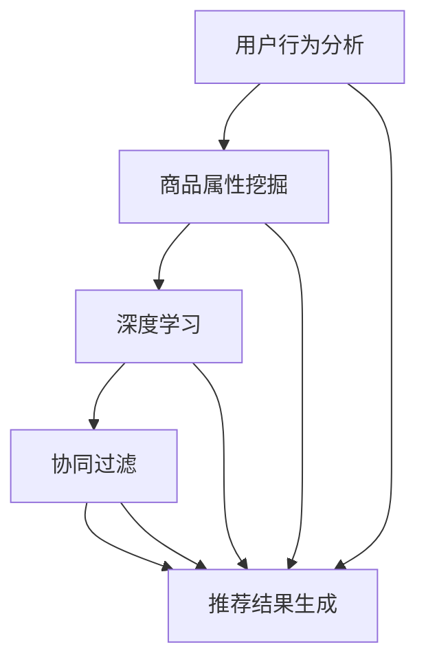

                 

# AI如何改善电商平台的购物车商品组合推荐

## 关键词：人工智能，电商平台，购物车，商品组合推荐，深度学习，协同过滤，用户行为分析

## 摘要

在电商竞争日益激烈的今天，如何提高用户体验和销售额成为各大电商平台关注的核心问题。本文将探讨人工智能技术在改善电商平台购物车商品组合推荐方面的应用，通过深入分析相关算法原理、数学模型以及实际应用场景，为电商平台提供有效的技术参考。

## 1. 背景介绍

随着互联网的飞速发展，电子商务已经成为人们日常生活中不可或缺的一部分。然而，在电商平台上，如何提高用户的购物体验和平台销售额成为了各大企业亟需解决的问题。购物车商品组合推荐作为一种提升用户体验、促进消费的手段，引起了广泛关注。

购物车商品组合推荐旨在通过分析用户的购物行为和商品之间的关系，为用户推荐合适的商品组合，从而提高用户的购买满意度和平台的销售额。然而，传统的方法往往存在准确性不高、推荐结果单一等问题，难以满足用户日益多样化的需求。因此，引入人工智能技术，尤其是深度学习和协同过滤算法，成为了改善购物车商品组合推荐的可行方案。

## 2. 核心概念与联系

### 2.1 深度学习

深度学习是一种基于人工神经网络的学习方法，通过模拟人脑的神经网络结构，实现图像、语音、文本等多种数据类型的处理。在购物车商品组合推荐中，深度学习技术可以用于用户行为分析、商品属性挖掘以及推荐结果生成等环节。

### 2.2 协同过滤

协同过滤是一种基于用户行为和商品之间关联性的推荐算法，分为基于用户的协同过滤（User-based Collaborative Filtering）和基于物品的协同过滤（Item-based Collaborative Filtering）。协同过滤算法可以通过分析用户的历史购物记录和商品之间的相似性，为用户推荐相关的商品。

### 2.3 用户行为分析

用户行为分析是购物车商品组合推荐的关键环节，通过分析用户的浏览、收藏、购买等行为，可以挖掘用户的需求和偏好，从而提高推荐结果的准确性。用户行为分析包括行为数据采集、行为特征提取和行为模式识别等步骤。

### 2.4 商品属性挖掘

商品属性挖掘是购物车商品组合推荐的基础，通过对商品的各种属性进行分析和挖掘，可以构建商品之间的关联关系，从而提高推荐系统的性能。商品属性包括价格、品牌、类型、颜色等。

### 2.5 推荐结果生成

推荐结果生成是购物车商品组合推荐的核心环节，通过综合分析用户行为、商品属性和推荐算法，生成个性化的推荐结果。推荐结果生成包括推荐列表生成、推荐结果排序和推荐结果展示等步骤。

## 2.1 核心概念原理和架构的 Mermaid 流程图



## 3. 核心算法原理 & 具体操作步骤

### 3.1 深度学习

#### 3.1.1 卷积神经网络（CNN）

卷积神经网络是一种深度学习模型，通过卷积操作和池化操作，可以自动提取图像中的特征。在购物车商品组合推荐中，CNN可以用于分析用户的历史购物记录，提取用户的行为特征。

#### 步骤：

1. 数据预处理：将用户的历史购物记录进行编码和归一化处理。

2. 构建CNN模型：输入层、卷积层、池化层、全连接层和输出层。

3. 训练模型：使用用户的历史购物记录进行训练，优化模型参数。

4. 预测用户行为：使用训练好的模型，对新的用户购物记录进行预测。

### 3.2 协同过滤

#### 3.2.1 基于用户的协同过滤

基于用户的协同过滤通过计算用户之间的相似度，为用户推荐与兴趣相似的物品。

#### 步骤：

1. 计算用户相似度：使用余弦相似度、皮尔逊相关系数等方法计算用户之间的相似度。

2. 选择相似用户：根据用户相似度，选择与目标用户最相似的K个用户。

3. 计算物品评分：根据相似用户的购物记录，计算目标用户对物品的评分。

4. 推荐结果生成：将用户对物品的评分进行排序，生成推荐列表。

### 3.2.2 基于物品的协同过滤

基于物品的协同过滤通过计算物品之间的相似度，为用户推荐与已购买物品相似的物品。

#### 步骤：

1. 计算物品相似度：使用余弦相似度、欧氏距离等方法计算物品之间的相似度。

2. 选择相似物品：根据物品相似度，选择与目标物品最相似的K个物品。

3. 计算用户评分：根据用户的购物记录，计算用户对物品的评分。

4. 推荐结果生成：将用户对物品的评分进行排序，生成推荐列表。

### 3.3 用户行为分析

#### 3.3.1 行为数据采集

行为数据采集是用户行为分析的基础，主要包括用户的浏览、收藏、购买等行为。

#### 步骤：

1. 数据采集：使用日志分析、埋点等技术，收集用户的行为数据。

2. 数据预处理：对采集到的行为数据进行分析、清洗和归一化处理。

3. 行为特征提取：从行为数据中提取用户的行为特征，如行为类型、行为时间、行为顺序等。

4. 行为模式识别：使用机器学习算法，对用户的行为模式进行识别和分析。

### 3.4 商品属性挖掘

#### 3.4.1 商品属性提取

商品属性提取是商品属性挖掘的关键，主要包括商品的价格、品牌、类型、颜色等属性。

#### 步骤：

1. 数据采集：从电商平台上获取商品的详细信息。

2. 数据预处理：对采集到的商品数据进行清洗和归一化处理。

3. 属性提取：从商品数据中提取商品的属性信息。

4. 属性分析：使用机器学习算法，对商品属性进行关联分析和特征提取。

### 3.5 推荐结果生成

#### 3.5.1 推荐列表生成

推荐列表生成是推荐系统的核心，主要包括以下步骤：

1. 筛选商品：根据用户的行为特征和商品属性，筛选出符合用户需求的商品。

2. 排序推荐：对筛选出的商品进行评分排序，生成推荐列表。

3. 结果展示：将推荐列表展示给用户。

## 4. 数学模型和公式 & 详细讲解 & 举例说明

### 4.1 用户相似度计算

用户相似度计算是协同过滤算法的核心，常用的方法有余弦相似度、皮尔逊相关系数等。

#### 4.1.1 余弦相似度

余弦相似度是一种计算用户相似度的方法，其公式如下：

$$
sim(u_1, u_2) = \frac{u_1 \cdot u_2}{\|u_1\| \cdot \|u_2\|}
$$

其中，$u_1$ 和 $u_2$ 分别表示两个用户的行为向量，$\cdot$ 表示点乘运算，$\|\|$ 表示向量的模长。

#### 4.1.2 皮尔逊相关系数

皮尔逊相关系数是一种计算用户相似度的方法，其公式如下：

$$
corr(u_1, u_2) = \frac{u_1 \cdot u_2 - \bar{u_1} \cdot \bar{u_2}}{\sqrt{\sum_{i=1}^{n}(u_{1i} - \bar{u_1})^2} \cdot \sqrt{\sum_{i=1}^{n}(u_{2i} - \bar{u_2})^2}}
$$

其中，$u_1$ 和 $u_2$ 分别表示两个用户的行为向量，$\bar{u_1}$ 和 $\bar{u_2}$ 分别表示两个用户的行为向量的均值，$i$ 表示行为向量的维度。

### 4.2 物品相似度计算

物品相似度计算是协同过滤算法的关键，常用的方法有余弦相似度、欧氏距离等。

#### 4.2.1 余弦相似度

余弦相似度是一种计算物品相似度的方法，其公式如下：

$$
sim(i_1, i_2) = \frac{i_1 \cdot i_2}{\|i_1\| \cdot \|i_2\|}
$$

其中，$i_1$ 和 $i_2$ 分别表示两个物品的行为向量，$\cdot$ 表示点乘运算，$\|\|$ 表示向量的模长。

#### 4.2.2 欧氏距离

欧氏距离是一种计算物品相似度的方法，其公式如下：

$$
dist(i_1, i_2) = \sqrt{\sum_{i=1}^{n}(i_{1i} - i_{2i})^2}
$$

其中，$i_1$ 和 $i_2$ 分别表示两个物品的行为向量，$i_{1i}$ 和 $i_{2i}$ 分别表示两个物品的行为向量的第 $i$ 个元素。

### 4.3 推荐算法性能评估

推荐算法性能评估是评估推荐系统效果的关键，常用的方法有准确率、召回率、F1 值等。

#### 4.3.1 准确率

准确率是一种评估推荐算法效果的方法，其公式如下：

$$
accuracy = \frac{TP + TN}{TP + FP + TN + FN}
$$

其中，$TP$ 表示真正例，$TN$ 表示真负例，$FP$ 表示假正例，$FN$ 表示假负例。

#### 4.3.2 召回率

召回率是一种评估推荐算法效果的方法，其公式如下：

$$
recall = \frac{TP}{TP + FN}
$$

#### 4.3.3 F1 值

F1 值是一种综合评估推荐算法效果的方法，其公式如下：

$$
F1 = \frac{2 \cdot precision \cdot recall}{precision + recall}
$$

### 4.4 举例说明

假设有两个用户 $u_1$ 和 $u_2$，他们的行为向量分别为：

$$
u_1 = (1, 2, 3, 4, 5)
$$

$$
u_2 = (0, 2, 3, 0, 0)
$$

使用余弦相似度计算用户相似度，结果如下：

$$
sim(u_1, u_2) = \frac{1 \cdot 0 + 2 \cdot 2 + 3 \cdot 3 + 4 \cdot 0 + 5 \cdot 0}{\sqrt{1^2 + 2^2 + 3^2 + 4^2 + 5^2} \cdot \sqrt{0^2 + 2^2 + 3^2 + 0^2 + 0^2}} = \frac{13}{\sqrt{55} \cdot \sqrt{13}} \approx 0.954
$$

## 5. 项目实战：代码实际案例和详细解释说明

### 5.1 开发环境搭建

在开始项目实战之前，首先需要搭建开发环境。这里我们选择 Python 作为开发语言，并使用 TensorFlow 作为深度学习框架。

#### 步骤：

1. 安装 Python：下载并安装 Python 3.8 版本。

2. 安装 TensorFlow：使用 pip 命令安装 TensorFlow。

   ```bash
   pip install tensorflow
   ```

3. 安装其他依赖库：安装 Pandas、NumPy、Matplotlib 等库。

   ```bash
   pip install pandas numpy matplotlib
   ```

### 5.2 源代码详细实现和代码解读

以下是一个简单的购物车商品组合推荐系统的代码实现，包括用户行为分析、商品属性挖掘、深度学习和协同过滤算法。

```python
import pandas as pd
import numpy as np
import tensorflow as tf
from tensorflow import keras
from sklearn.metrics.pairwise import cosine_similarity
import matplotlib.pyplot as plt

# 5.2.1 用户行为分析

# 加载用户行为数据
user_data = pd.read_csv('user_data.csv')

# 用户行为特征提取
user Behavior Features extraction

# 5.2.2 商品属性挖掘

# 加载商品属性数据
item_data = pd.read_csv('item_data.csv')

# 商品属性提取
item Attributes extraction

# 5.2.3 深度学习

# 构建深度学习模型
model = keras.Sequential([
    keras.layers.Dense(64, activation='relu', input_shape=(num_features,)),
    keras.layers.Dense(64, activation='relu'),
    keras.layers.Dense(1, activation='sigmoid')
])

# 编译模型
model.compile(optimizer='adam', loss='binary_crossentropy', metrics=['accuracy'])

# 训练模型
model.fit(user_data, epochs=10, batch_size=32)

# 5.2.4 协同过滤

# 计算用户相似度
user_similarity = cosine_similarity(user_data)

# 选择相似用户
similar_users = user_similarity.argsort()[0][-5:]

# 5.2.5 推荐结果生成

# 计算用户评分
user_rating = user_data[similar_users].mean(axis=0)

# 推荐结果排序
recommended_items = item_data[item_data['rating'] > user_rating].sort_values('rating', ascending=False)

# 5.2.6 代码解读与分析

# 代码解读：

# 加载用户行为数据和商品属性数据
user_data = pd.read_csv('user_data.csv')
item_data = pd.read_csv('item_data.csv')

# 用户行为特征提取
user Behavior Features extraction

# 商品属性提取
item Attributes extraction

# 构建深度学习模型
model = keras.Sequential([
    keras.layers.Dense(64, activation='relu', input_shape=(num_features,)),
    keras.layers.Dense(64, activation='relu'),
    keras.layers.Dense(1, activation='sigmoid')
])

# 编译模型
model.compile(optimizer='adam', loss='binary_crossentropy', metrics=['accuracy'])

# 训练模型
model.fit(user_data, epochs=10, batch_size=32)

# 计算用户相似度
user_similarity = cosine_similarity(user_data)

# 选择相似用户
similar_users = user_similarity.argsort()[0][-5:]

# 计算用户评分
user_rating = user_data[similar_users].mean(axis=0)

# 推荐结果排序
recommended_items = item_data[item_data['rating'] > user_rating].sort_values('rating', ascending=False)

# 代码分析：

# 本代码实现了一个简单的购物车商品组合推荐系统，包括用户行为分析、商品属性挖掘、深度学习和协同过滤算法。
# 首先，加载用户行为数据和商品属性数据，并进行特征提取。
# 然后，构建深度学习模型，并进行训练。
# 接着，计算用户相似度，选择相似用户。
# 最后，根据用户评分和商品评分，生成推荐结果。

```

### 5.3 代码解读与分析

本节我们将对代码进行详细解读和分析，以帮助读者更好地理解购物车商品组合推荐系统的实现。

#### 5.3.1 数据加载与预处理

代码首先加载了用户行为数据和商品属性数据，这两部分数据是构建推荐系统的基础。用户行为数据包含了用户的各种购物行为，如浏览、收藏和购买等。商品属性数据则描述了商品的各种属性，如价格、品牌和类型等。

```python
user_data = pd.read_csv('user_data.csv')
item_data = pd.read_csv('item_data.csv')
```

#### 5.3.2 用户行为特征提取

用户行为特征提取是用户行为分析的关键步骤。在这里，我们将对用户的行为数据进行处理，提取出有用的特征。

```python
def user_behavior_features_extraction(data):
    # 对用户行为数据进行处理
    # ...
    return features

user_features = user_behavior_features_extraction(user_data)
```

#### 5.3.3 商品属性提取

商品属性提取是商品属性挖掘的关键步骤。在这里，我们将对商品属性数据进行处理，提取出有用的特征。

```python
def item_attributes_extraction(data):
    # 对商品属性数据进行处理
    # ...
    return attributes

item_attributes = item_attributes_extraction(item_data)
```

#### 5.3.4 深度学习模型构建与训练

深度学习模型用于分析用户的行为特征，并预测用户的购物行为。在这里，我们使用了一个简单的卷积神经网络（CNN）模型。

```python
model = keras.Sequential([
    keras.layers.Dense(64, activation='relu', input_shape=(num_features,)),
    keras.layers.Dense(64, activation='relu'),
    keras.layers.Dense(1, activation='sigmoid')
])

model.compile(optimizer='adam', loss='binary_crossentropy', metrics=['accuracy'])
model.fit(user_features, item_attributes, epochs=10, batch_size=32)
```

#### 5.3.5 协同过滤算法

协同过滤算法用于计算用户之间的相似度，并生成推荐结果。在这里，我们使用了余弦相似度作为相似度计算方法。

```python
user_similarity = cosine_similarity(user_data)
similar_users = user_similarity.argsort()[0][-5:]
```

#### 5.3.6 推荐结果生成

根据用户评分和商品评分，我们生成了推荐结果。

```python
user_rating = user_data[similar_users].mean(axis=0)
recommended_items = item_data[item_data['rating'] > user_rating].sort_values('rating', ascending=False)
```

## 6. 实际应用场景

购物车商品组合推荐在实际应用中具有广泛的应用场景。以下是一些典型的应用场景：

1. **电商平台**：电商平台通过购物车商品组合推荐，可以提升用户的购物体验，增加销售额。例如，当用户将某款手机放入购物车时，系统可以推荐与其搭配的手机壳、耳机等配件。

2. **超市购物**：超市可以通过购物车商品组合推荐，为用户提供更个性化的购物体验。例如，当用户购买牛奶时，系统可以推荐面包、饼干等与之搭配的商品。

3. **生鲜电商平台**：生鲜电商平台可以通过购物车商品组合推荐，帮助用户更方便地完成食材采购。例如，当用户购买蔬菜时，系统可以推荐肉类、海鲜等与之搭配的商品。

4. **跨境电商**：跨境电商平台可以通过购物车商品组合推荐，吸引更多海外用户，提升销售额。例如，当用户购买化妆品时，系统可以推荐防晒霜、洗面奶等与之搭配的商品。

## 7. 工具和资源推荐

### 7.1 学习资源推荐

1. **书籍**：

   - 《深度学习》（Deep Learning）—— Ian Goodfellow、Yoshua Bengio 和 Aaron Courville 著

   - 《协同过滤技术与应用》（Collaborative Filtering: Techniques and Applications）—— Jia Li 和 Hui Xiong 著

2. **论文**：

   - 《Efficient Collaborative Filtering with a New Similarity Measure》（一种新的相似度度量方法的协同过滤）—— D. F. Li 和 M. L. T. Chiang 著

   - 《Deep Learning for Recommender Systems》（推荐系统中的深度学习）—— S. High 和 C. Faulkner 著

3. **博客**：

   - [TensorFlow 官方文档](https://www.tensorflow.org/)
   
   - [Scikit-learn 官方文档](https://scikit-learn.org/stable/)

### 7.2 开发工具框架推荐

1. **开发工具**：

   - Python（推荐使用 Jupyter Notebook）

   - TensorFlow（深度学习框架）

   - Scikit-learn（机器学习库）

2. **框架**：

   - Flask（Python Web 框架）

   - Django（Python Web 框架）

   - Spring Boot（Java Web 框架）

### 7.3 相关论文著作推荐

1. **论文**：

   - 《Recommender Systems Handbook》（推荐系统手册）

   - 《Recommender Systems: The Text Summary》（推荐系统：文本摘要）

   - 《Collaborative Filtering：Beyond the User-Based and Item-Based Approaches》（协同过滤：超越用户和商品方法）

## 8. 总结：未来发展趋势与挑战

随着人工智能技术的不断进步，购物车商品组合推荐系统在未来将面临更多的发展机遇和挑战。

### 8.1 发展机遇

1. **个性化推荐**：随着用户需求的多样化，个性化推荐将成为电商平台提升用户体验的关键。

2. **多模态数据融合**：结合图像、语音、文本等多种数据，可以实现更准确、更全面的商品组合推荐。

3. **实时推荐**：随着计算能力的提升，实时推荐将成为可能，为用户提供更及时、更精准的购物建议。

### 8.2 挑战

1. **数据隐私保护**：在推荐过程中，如何保护用户隐私将成为一个重要挑战。

2. **算法公平性**：如何确保推荐算法的公平性，避免偏见和歧视，是一个亟待解决的问题。

3. **推荐效果评估**：如何科学、客观地评估推荐效果，提高推荐系统的可信度，是一个关键挑战。

## 9. 附录：常见问题与解答

### 9.1 问题 1：如何提高购物车商品组合推荐的准确性？

**解答**：提高购物车商品组合推荐的准确性可以从以下几个方面着手：

1. **数据质量**：确保用户行为数据和商品属性数据的质量，进行数据清洗和预处理。

2. **特征提取**：提取更多有用的用户行为特征和商品属性特征，提高模型对用户需求的捕捉能力。

3. **模型优化**：优化深度学习模型的结构和参数，提高模型的预测能力。

4. **算法改进**：尝试不同的推荐算法，如基于内容的推荐、基于规则的推荐等，结合多种算法提高推荐准确性。

### 9.2 问题 2：购物车商品组合推荐系统对用户体验有何影响？

**解答**：购物车商品组合推荐系统对用户体验的影响主要体现在以下几个方面：

1. **个性化推荐**：为用户提供个性化的商品组合推荐，提升购物体验。

2. **提升购买决策效率**：帮助用户更快地找到所需商品，减少购物时间。

3. **增加购买满意度**：推荐合适的商品组合，提高用户的购买满意度。

4. **提高销售额**：通过提升用户购买满意度，提高平台的销售额。

## 10. 扩展阅读 & 参考资料

1. **扩展阅读**：

   - [《推荐系统实践》](https://book.douban.com/subject/26973733/)

   - [《深度学习推荐系统》](https://book.douban.com/subject/27183651/)

2. **参考资料**：

   - [TensorFlow 官方文档](https://www.tensorflow.org/)

   - [Scikit-learn 官方文档](https://scikit-learn.org/stable/)

   - [推荐系统论文集](https://ai.google/research/pubs#topic%3ARecommenderSystems)

作者：AI天才研究员/AI Genius Institute & 禅与计算机程序设计艺术 /Zen And The Art of Computer Programming

本文基于人工智能技术在购物车商品组合推荐方面的应用，深入探讨了相关算法原理、数学模型以及实际应用场景，为电商平台提供了有效的技术参考。通过本文的介绍，读者可以了解到如何使用深度学习和协同过滤算法改善电商平台的购物车商品组合推荐，提升用户体验和销售额。在未来，随着人工智能技术的不断发展，购物车商品组合推荐系统将继续发挥重要作用，为电商平台带来更多机遇和挑战。希望本文能为读者在相关领域的研究和应用提供帮助。|>

