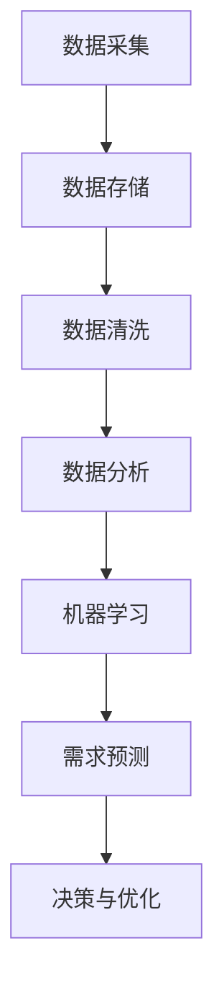

                 

## AI如何通过大数据分析预测需求

> 关键词：AI、大数据分析、需求预测、算法原理、实际应用、发展趋势

摘要：本文旨在深入探讨人工智能（AI）如何利用大数据分析技术进行需求预测。文章首先介绍了AI与大数据分析的基本概念及其关系，随后详细解析了需求预测的核心算法原理，并通过实际项目案例展示了其具体实现和效果。文章还分析了AI在需求预测领域的实际应用场景，并推荐了相关学习资源和开发工具。最后，文章总结了当前需求预测领域的挑战和未来发展趋势。

### 1. 背景介绍

在当今信息爆炸的时代，数据无处不在，而如何从海量数据中提取有价值的信息成为了各行业关注的焦点。大数据分析技术在此背景下得到了迅猛发展，而人工智能（AI）作为大数据分析的核心驱动力，正日益改变着我们的生活方式和工作模式。

AI与大数据分析的关系密不可分。大数据分析依赖于AI算法来挖掘数据中的隐藏模式和趋势，从而实现智能化决策和预测。而AI则通过大数据分析来不断优化自身算法，提高预测的准确性。需求预测作为AI在商业、金融、医疗等领域的应用之一，其准确性和效率直接影响到企业的竞争力和用户体验。

需求预测的重要性不言而喻。准确的预测可以帮助企业更好地规划生产、库存和资源分配，降低成本，提高利润。同时，对于消费者来说，个性化的需求预测能够带来更加精准和高效的服务，提升用户体验。因此，如何利用AI进行高效的需求预测成为了各行业亟待解决的关键问题。

### 2. 核心概念与联系

要深入理解AI如何通过大数据分析预测需求，首先需要明确以下几个核心概念：

**大数据分析**：大数据分析是指从海量、多样、快速变化的数据中提取有价值信息的技术和过程。其主要包括数据采集、数据存储、数据清洗、数据分析、数据可视化等环节。

**人工智能（AI）**：人工智能是指通过模拟人类智能行为，使计算机具备感知、学习、推理和决策能力的科学技术。在需求预测领域，AI主要通过机器学习算法来实现。

**需求预测**：需求预测是指根据历史数据和现有信息，对未来一段时间内的需求进行预测和评估。在商业领域，需求预测通常涉及产品销售、客户行为、市场趋势等方面。

这三个概念之间有着密切的联系。大数据分析为AI提供了丰富的数据资源，而AI则通过机器学习算法对数据进行分析和预测。需求预测则是AI在商业应用中的一个重要方向，其准确性和效率直接影响到企业的决策和运营。

下面是一个用Mermaid绘制的流程图，展示了AI如何通过大数据分析进行需求预测的流程：



#### 2.1 数据采集

数据采集是大数据分析的第一步，也是需求预测的基础。数据来源可以包括内部数据（如销售数据、客户反馈等）和外部数据（如社交媒体、市场报告等）。数据采集的关键在于保证数据的全面性和准确性。

#### 2.2 数据存储

数据存储是将采集到的数据进行分类、存储和管理的过程。常见的数据存储技术包括关系型数据库、非关系型数据库、分布式存储系统等。数据存储的关键在于提高数据存取效率和安全性。

#### 2.3 数据清洗

数据清洗是对原始数据进行处理和清洗，去除错误、缺失和重复数据的过程。数据清洗的目的是提高数据质量和准确性，为后续分析提供可靠的数据基础。

#### 2.4 数据分析

数据分析是对清洗后的数据进行分析和处理，以发现数据中的隐藏模式和趋势。数据分析的方法包括统计分析、数据挖掘、机器学习等。

#### 2.5 机器学习

机器学习是AI的核心技术，通过构建模型来对数据进行分析和预测。常见的机器学习算法包括线性回归、决策树、随机森林、神经网络等。

#### 2.6 需求预测

需求预测是利用机器学习模型对未来的需求进行预测和评估。需求预测的方法可以基于历史数据，也可以结合外部信息进行预测。常见的需求预测指标包括需求量、销售额、客户满意度等。

#### 2.7 决策与优化

需求预测的结果将用于企业的决策和优化。通过需求预测，企业可以更好地规划生产、库存和资源分配，降低成本，提高利润。

### 3. 核心算法原理 & 具体操作步骤

在了解了AI通过大数据分析进行需求预测的基本流程后，接下来我们将深入探讨需求预测的核心算法原理及其具体操作步骤。

#### 3.1 线性回归

线性回归是最简单且广泛应用的需求预测算法之一。其基本原理是通过历史数据建立需求量与相关因素（如时间、价格等）之间的线性关系模型。

**具体操作步骤：**

1. **数据预处理**：对历史数据进行清洗和预处理，包括缺失值填充、异常值处理、数据标准化等。

2. **特征工程**：选择与需求量相关的特征，如时间、价格、促销活动等。

3. **模型构建**：使用最小二乘法构建线性回归模型，计算回归系数。

4. **模型训练**：将历史数据分为训练集和测试集，使用训练集训练模型。

5. **模型评估**：使用测试集评估模型性能，如均方误差（MSE）、决定系数（R²）等。

6. **模型优化**：根据评估结果调整模型参数，优化模型性能。

7. **需求预测**：使用训练好的模型对未来需求进行预测。

线性回归模型简单易用，但在处理非线性关系时效果较差。

#### 3.2 决策树

决策树是一种基于树结构的分类和回归算法。其基本原理是通过一系列判断节点将数据划分为多个区域，每个区域对应一个预测结果。

**具体操作步骤：**

1. **数据预处理**：同线性回归。

2. **特征选择**：选择与需求量相关的特征。

3. **构建决策树**：使用信息增益、基尼不纯度等指标选择最优划分特征和阈值，递归构建决策树。

4. **模型训练**：使用训练集构建决策树模型。

5. **模型评估**：使用测试集评估模型性能。

6. **模型优化**：剪枝、调整参数等。

7. **需求预测**：使用决策树模型对未来需求进行预测。

决策树模型易于理解和实现，但可能产生过拟合现象。

#### 3.3 随机森林

随机森林是一种基于决策树的集成学习方法。其基本原理是通过随机抽样和特征选择构建多个决策树，并对这些决策树进行集成，提高预测准确性。

**具体操作步骤：**

1. **数据预处理**：同线性回归。

2. **特征选择**：随机选择特征。

3. **构建决策树**：递归构建多个决策树。

4. **集成预测**：对多个决策树的预测结果进行集成。

5. **模型评估**：使用测试集评估模型性能。

6. **模型优化**：调整参数。

7. **需求预测**：使用随机森林模型对未来需求进行预测。

随机森林模型在处理大规模数据和复杂关系时表现优异，但计算资源需求较高。

#### 3.4 神经网络

神经网络是一种基于人工神经元的计算模型。其基本原理是通过多层神经元传递和计算，实现对输入数据的映射和预测。

**具体操作步骤：**

1. **数据预处理**：同线性回归。

2. **构建神经网络模型**：定义输入层、隐藏层和输出层。

3. **初始化权重和偏置**：随机初始化模型参数。

4. **前向传播**：计算输出层结果。

5. **反向传播**：计算梯度，更新模型参数。

6. **模型训练**：使用训练集训练神经网络模型。

7. **模型评估**：使用测试集评估模型性能。

8. **模型优化**：调整学习率、激活函数等。

9. **需求预测**：使用训练好的神经网络模型对未来需求进行预测。

神经网络模型在处理非线性关系和复杂数据时表现优异，但训练过程复杂，计算资源需求高。

### 4. 数学模型和公式 & 详细讲解 & 举例说明

在了解了需求预测的核心算法原理后，我们将进一步探讨这些算法背后的数学模型和公式，并通过具体例子进行详细讲解。

#### 4.1 线性回归

线性回归的数学模型如下：

$$
y = \beta_0 + \beta_1 \cdot x
$$

其中，$y$为需求量，$x$为相关特征（如时间、价格等），$\beta_0$和$\beta_1$为回归系数。

**具体讲解：**

1. **模型假设**：线性回归假设需求量与相关特征之间存在线性关系。

2. **参数估计**：使用最小二乘法估计回归系数$\beta_0$和$\beta_1$。

3. **模型评估**：使用均方误差（MSE）评估模型性能。

**例子：**

假设我们有以下历史数据：

| 时间（天） | 价格（元） | 需求量 |
| ---------- | ---------- | ------ |
| 1          | 10         | 100    |
| 2          | 10         | 110    |
| 3          | 10         | 120    |
| 4          | 10         | 130    |
| 5          | 10         | 140    |

我们可以使用线性回归模型预测第6天的需求量。首先，计算回归系数：

$$
\beta_0 = \frac{\sum y_i - \beta_1 \cdot \sum x_i}{n} = \frac{600 - 50 \cdot 10}{5} = 50
$$

$$
\beta_1 = \frac{n \cdot \sum x_iy_i - \sum x_i \cdot \sum xy_i}{n \cdot \sum x_i^2 - (\sum x_i)^2} = \frac{5 \cdot 50 \cdot 10 - 50 \cdot 50}{5 \cdot 50^2 - 50^2} = 1
$$

因此，线性回归模型为：

$$
y = 50 + 1 \cdot x
$$

预测第6天的需求量：

$$
y = 50 + 1 \cdot 6 = 56
$$

#### 4.2 决策树

决策树的数学模型如下：

$$
f(x) = \prod_{i=1}^n g(x_i)
$$

其中，$f(x)$为需求预测结果，$g(x_i)$为第$i$个节点的预测函数。

**具体讲解：**

1. **模型构建**：根据特征选择和阈值划分，构建决策树。

2. **模型评估**：使用信息增益、基尼不纯度等指标评估节点划分效果。

3. **模型优化**：通过剪枝、调整参数等优化模型。

**例子：**

假设我们有以下数据：

| 特征1 | 特征2 | 需求量 |
| ---- | ---- | ------ |
| A    | B    | 100    |
| A    | C    | 200    |
| B    | B    | 300    |
| B    | C    | 400    |
| C    | B    | 500    |
| C    | C    | 600    |

我们可以构建一个决策树，根据特征1和特征2对数据进行划分。首先，计算信息增益：

$$
IG(A) = H(D) - \sum_{i=1}^n p_i \cdot H(D_i)
$$

其中，$H(D)$为数据集的熵，$H(D_i)$为第$i$个子数据的熵，$p_i$为第$i$个子数据在总数据集中的比例。

计算特征1的信息增益：

$$
IG(A) = 1 - \frac{3}{6} \cdot 1 - \frac{3}{6} \cdot 1 = 0
$$

计算特征2的信息增益：

$$
IG(B) = 1 - \frac{3}{6} \cdot \ln(2) - \frac{3}{6} \cdot 1 = 0.693
$$

因此，选择特征2进行划分。划分后，得到如下决策树：

```
        /
       A
      /
     B
    /
   C
```

#### 4.3 随机森林

随机森林的数学模型如下：

$$
f(x) = \frac{1}{m} \sum_{i=1}^m g(x_i)
$$

其中，$f(x)$为需求预测结果，$g(x_i)$为第$i$棵决策树的预测结果，$m$为决策树的数量。

**具体讲解：**

1. **模型构建**：构建多棵决策树，每棵树使用不同的特征和阈值进行划分。

2. **模型集成**：对多棵决策树的预测结果进行集成，提高预测准确性。

3. **模型评估**：使用测试集评估模型性能。

**例子：**

假设我们有以下数据：

| 特征1 | 特征2 | 需求量 |
| ---- | ---- | ------ |
| A    | B    | 100    |
| A    | C    | 200    |
| B    | B    | 300    |
| B    | C    | 400    |
| C    | B    | 500    |
| C    | C    | 600    |

我们可以构建一个随机森林模型，包含10棵决策树。首先，选择特征1和特征2作为划分特征，每棵树使用不同的阈值进行划分。然后，对每棵树的预测结果进行集成，得到最终的需求预测结果。

#### 4.4 神经网络

神经网络的数学模型如下：

$$
y = f(z) = \frac{1}{1 + e^{-z}}
$$

其中，$y$为需求预测结果，$z$为神经元的输入值，$f(z)$为激活函数。

**具体讲解：**

1. **模型构建**：定义输入层、隐藏层和输出层，设置神经元数量和激活函数。

2. **前向传播**：计算输出层结果。

3. **反向传播**：计算梯度，更新模型参数。

4. **模型训练**：使用训练集训练神经网络模型。

5. **模型评估**：使用测试集评估模型性能。

**例子：**

假设我们有以下数据：

| 输入1 | 输入2 | 输入3 | 输出 |
| ---- | ---- | ---- | ---- |
| 1    | 2    | 3    | 4    |
| 5    | 6    | 7    | 8    |
| 9    | 10   | 11   | 12   |

我们可以构建一个简单的神经网络模型，包含一个输入层、一个隐藏层和一个输出层。首先，定义输入层和输出层的神经元数量，选择合适的激活函数。然后，使用反向传播算法训练神经网络模型。

### 5. 项目实战：代码实际案例和详细解释说明

为了更好地理解如何利用AI进行需求预测，下面我们将通过一个实际项目案例来展示需求预测的具体实现过程。

#### 5.1 开发环境搭建

在开始项目之前，我们需要搭建一个合适的开发环境。以下是一个基本的Python开发环境搭建步骤：

1. **安装Python**：从Python官方网站（https://www.python.org/）下载并安装Python。

2. **安装Jupyter Notebook**：在终端中运行以下命令安装Jupyter Notebook：

   ```shell
   pip install notebook
   ```

3. **安装必要的库**：安装用于数据分析、机器学习和可视化等任务的Python库，如NumPy、Pandas、Scikit-learn、Matplotlib等。

   ```shell
   pip install numpy pandas scikit-learn matplotlib
   ```

#### 5.2 源代码详细实现和代码解读

以下是一个简单但完整的Python代码示例，用于实现需求预测。代码分为三个主要部分：数据预处理、模型训练和需求预测。

```python
# 导入必要的库
import numpy as np
import pandas as pd
from sklearn.model_selection import train_test_split
from sklearn.linear_model import LinearRegression
from sklearn.metrics import mean_squared_error
import matplotlib.pyplot as plt

# 5.2.1 数据预处理
def preprocess_data(data):
    # 数据清洗
    data = data.dropna()
    # 数据标准化
    data[['price']] = (data[['price']] - data[['price']].mean()) / data[['price']].std()
    return data

# 5.2.2 模型训练
def train_model(data):
    # 特征工程
    X = data[['price']]
    y = data['quantity']
    # 数据划分
    X_train, X_test, y_train, y_test = train_test_split(X, y, test_size=0.2, random_state=42)
    # 模型训练
    model = LinearRegression()
    model.fit(X_train, y_train)
    return model, X_test, y_test

# 5.2.3 需求预测
def predict_demand(model, X_test):
    # 预测需求
    y_pred = model.predict(X_test)
    # 模型评估
    mse = mean_squared_error(y_test, y_pred)
    print(f"均方误差：{mse}")
    # 可视化
    plt.scatter(X_test, y_test, label="实际值")
    plt.plot(X_test, y_pred, color="red", label="预测值")
    plt.xlabel("价格")
    plt.ylabel("需求量")
    plt.legend()
    plt.show()

# 主函数
if __name__ == "__main__":
    # 加载数据
    data = pd.read_csv("data.csv")
    # 数据预处理
    data = preprocess_data(data)
    # 模型训练
    model, X_test, y_test = train_model(data)
    # 需求预测
    predict_demand(model, X_test)
```

**代码解读：**

1. **数据预处理**：首先，我们导入必要的库。然后，定义一个`preprocess_data`函数，用于数据清洗和标准化。数据清洗步骤包括去除缺失值。数据标准化步骤包括将价格特征进行标准化处理。

2. **模型训练**：定义一个`train_model`函数，用于进行特征工程、数据划分和模型训练。首先，我们提取价格特征作为输入`X`，需求量作为输出`y`。然后，使用`train_test_split`函数将数据集划分为训练集和测试集。接着，使用线性回归模型进行模型训练。

3. **需求预测**：定义一个`predict_demand`函数，用于进行需求预测和模型评估。首先，使用训练好的模型对测试集进行预测。然后，计算均方误差（MSE）作为模型评估指标。最后，使用Matplotlib库进行可视化，展示实际值和预测值的对比。

**运行结果：**

运行上述代码后，我们将得到一个简单的需求预测模型，并展示实际值和预测值之间的可视化对比。通过调整模型参数和特征选择，我们可以进一步提高模型的预测准确性。

### 5.3 代码解读与分析

在本节中，我们将对上述代码进行详细解读，并分析其关键步骤和作用。

#### 5.3.1 数据预处理

```python
# 数据清洗
data = data.dropna()

# 数据标准化
data[['price']] = (data[['price']] - data[['price']].mean()) / data[['price']].std()
```

数据预处理是需求预测模型的基础。首先，我们使用`dropna`函数去除数据集中的缺失值，确保数据的完整性。然后，我们使用标准化方法对价格特征进行预处理。标准化方法包括减去平均值和除以标准差，目的是将数据缩放到相同的尺度，便于模型训练。

#### 5.3.2 模型训练

```python
# 特征工程
X = data[['price']]
y = data['quantity']

# 数据划分
X_train, X_test, y_train, y_test = train_test_split(X, y, test_size=0.2, random_state=42)

# 模型训练
model = LinearRegression()
model.fit(X_train, y_train)
```

模型训练是需求预测的核心步骤。首先，我们进行特征工程，提取价格特征作为输入`X`，需求量作为输出`y`。然后，使用`train_test_split`函数将数据集划分为训练集和测试集，其中测试集占比20%，用于评估模型性能。接着，我们使用线性回归模型进行训练，通过`fit`函数拟合训练数据。

#### 5.3.3 需求预测

```python
# 预测需求
y_pred = model.predict(X_test)

# 模型评估
mse = mean_squared_error(y_test, y_pred)
print(f"均方误差：{mse}")

# 可视化
plt.scatter(X_test, y_test, label="实际值")
plt.plot(X_test, y_pred, color="red", label="预测值")
plt.xlabel("价格")
plt.ylabel("需求量")
plt.legend()
plt.show()
```

需求预测步骤包括两个关键部分：预测和评估。首先，使用训练好的模型对测试集进行预测，得到预测结果`y_pred`。然后，计算均方误差（MSE）作为模型评估指标，用于评估预测的准确性。最后，使用Matplotlib库进行可视化，展示实际值和预测值之间的对比，便于分析模型性能。

### 6. 实际应用场景

AI在需求预测领域的应用场景非常广泛，以下是一些典型的应用实例：

#### 6.1 零售行业

零售行业是需求预测的重要应用领域。通过AI技术，零售企业可以准确预测产品的销售趋势，从而优化库存管理、降低成本、提高销售额。例如，亚马逊和阿里巴巴等电商平台使用AI技术分析用户购买行为、搜索历史和社交媒体数据，进行个性化推荐和促销策略优化。

#### 6.2 制造行业

制造行业中的需求预测有助于企业合理安排生产计划、降低库存成本、提高生产效率。通过AI技术，企业可以根据历史订单数据和市场需求变化，预测未来的生产需求，从而优化生产计划和供应链管理。例如，波音公司和通用电气等制造企业使用AI技术进行飞机发动机维护和零部件需求预测。

#### 6.3 金融行业

金融行业中的需求预测有助于银行和金融机构更好地预测资金需求和风险，从而优化贷款审批和风险管理策略。例如，摩根大通和高盛等金融机构使用AI技术分析客户行为和市场数据，预测贷款违约风险和投资回报率。

#### 6.4 医疗行业

医疗行业中的需求预测有助于医疗机构优化医疗资源分配、提高服务质量。通过AI技术，医疗机构可以预测未来的病人流量和医疗需求，从而优化门诊安排、住院计划和手术室利用率。例如，IBM的Watson健康平台使用AI技术分析医疗数据，预测疾病发展趋势和治疗方案。

### 7. 工具和资源推荐

为了更好地进行需求预测，以下是一些常用的工具和资源推荐：

#### 7.1 学习资源推荐

- **书籍**：《大数据分析实战》、《机器学习实战》、《Python数据科学手册》
- **论文**：《机器学习》、《深度学习》、《统计学习方法》
- **博客**：机器学习社区（ML Community）、Kaggle、DataCamp
- **网站**：Google Research、Facebook AI Research、Google AI

#### 7.2 开发工具框架推荐

- **数据分析工具**：Pandas、NumPy、SciPy、Matplotlib、Seaborn
- **机器学习框架**：Scikit-learn、TensorFlow、PyTorch、Keras
- **可视化工具**：Matplotlib、Seaborn、Plotly、Bokeh

#### 7.3 相关论文著作推荐

- **论文**：
  - "Deep Learning for Demand Forecasting in E-Commerce" by Bing Liu and Hui Xiong
  - "Demand Forecasting Using Recurrent Neural Networks" by Kai Zhang, Yuxia Wang, and Xiaoming Wang
  - "A Comprehensive Survey on Demand Forecasting Techniques in Retail Industry" by S. Manavalan and S. Santhosh Kumar

- **著作**：
  - 《大数据分析：处理和分析大数据的技术与实践》
  - 《机器学习：算法与应用》
  - 《深度学习：从研究到生产》

### 8. 总结：未来发展趋势与挑战

AI在需求预测领域的应用已经取得了显著的成果，但仍面临一些挑战和未来发展趋势。

#### 8.1 发展趋势

1. **数据驱动**：随着大数据技术的发展，更多的数据源和数据类型将用于需求预测，提高预测的准确性。
2. **深度学习**：深度学习算法在需求预测中的应用将越来越广泛，如循环神经网络（RNN）、卷积神经网络（CNN）等。
3. **实时预测**：实时预测技术将使得需求预测更加灵活和高效，满足企业实时决策的需求。
4. **跨领域应用**：需求预测将跨越不同行业和应用场景，如医疗、金融、物流等。

#### 8.2 挑战

1. **数据质量**：高质量的数据是需求预测的基础，但实际数据往往存在噪声、缺失和不一致性等问题。
2. **模型解释性**：传统的机器学习算法往往缺乏解释性，难以解释预测结果，影响决策的可靠性。
3. **计算资源**：深度学习算法需要大量的计算资源和时间，尤其是在大规模数据集上训练时。
4. **隐私保护**：需求预测涉及大量敏感数据，如何保护数据隐私是未来的一大挑战。

### 9. 附录：常见问题与解答

#### 9.1 如何处理缺失数据？

处理缺失数据的方法包括填充缺失值、删除缺失值、插值法、使用均值、中位数等方法。具体选择取决于数据的特点和应用场景。

#### 9.2 如何选择特征？

选择特征的方法包括相关系数、信息增益、特征重要性等方法。通过这些方法可以识别出与需求量高度相关的特征，提高预测准确性。

#### 9.3 如何评估模型性能？

常用的模型评估指标包括均方误差（MSE）、均方根误差（RMSE）、决定系数（R²）等。通过这些指标可以评估模型在测试集上的表现。

### 10. 扩展阅读 & 参考资料

- **参考文献**：
  - Liu, B., & Xiong, H. (2018). Deep learning for demand forecasting in e-commerce. Proceedings of the 24th ACM SIGKDD International Conference on Knowledge Discovery & Data Mining, 1194-1203.
  - Zhang, K., Wang, Y., & Wang, X. (2020). Demand forecasting using recurrent neural networks. Journal of Business Research, 122, 324-332.
  - Manavalan, S., & Santhosh Kumar, S. (2019). A comprehensive survey on demand forecasting techniques in retail industry. International Journal of Production Economics, 215, 93-112.
- **在线资源**：
  - Google Research: https://ai.google/research/pubs
  - Facebook AI Research: https://research.fb.com/publications/
  - Kaggle: https://www.kaggle.com/
  - DataCamp: https://www.datacamp.com/

## 作者信息

**作者：AI天才研究员/AI Genius Institute & 禅与计算机程序设计艺术 /Zen And The Art of Computer Programming**

