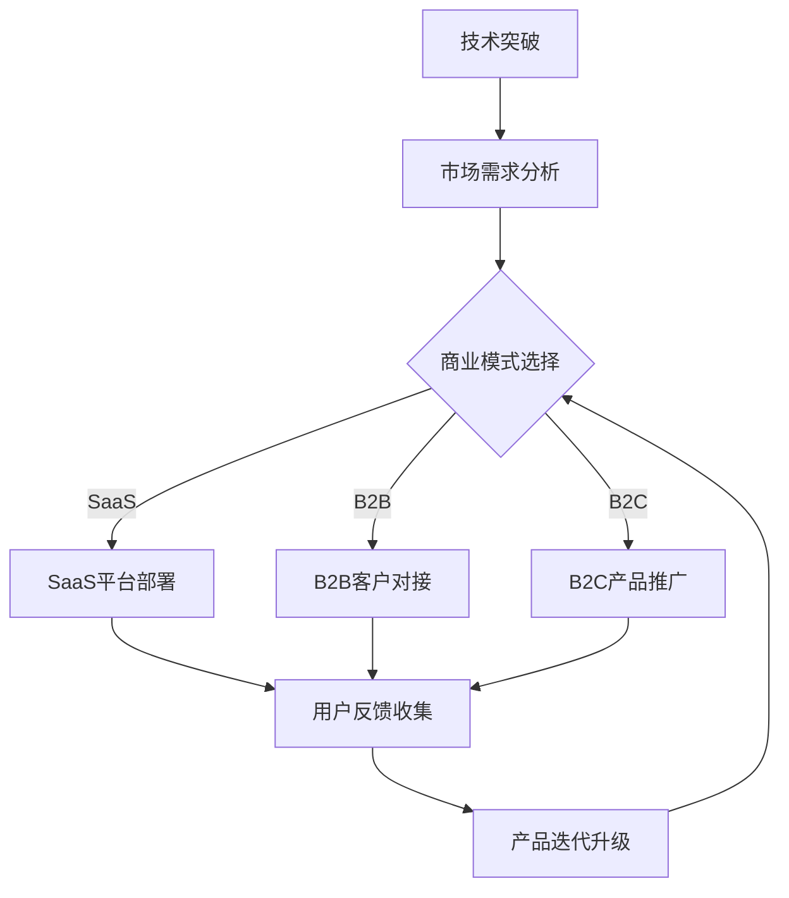

                 

# AI工具商业化：从技术到盈利的转变

> **关键词**：AI商业化、技术盈利、商业模式、市场分析、营销策略、可持续发展

> **摘要**：本文将深入探讨AI工具商业化的全过程，从技术原理、商业模式到盈利策略，详细分析AI工具如何从技术突破转向市场盈利。通过解析实际案例和提供实用资源，旨在为AI从业者提供从技术到商业成功的全面指南。

## 1. 背景介绍

随着人工智能（AI）技术的飞速发展，越来越多的AI工具开始出现在我们的日常生活中。从智能助手、自动驾驶到金融风控，AI技术的应用已经渗透到各行各业。然而，技术的突破并不等同于商业的成功。许多AI初创公司面临着如何将技术优势转化为实际盈利的挑战。因此，探讨AI工具商业化的路径和方法，对于推动AI技术的商业化进程具有重要意义。

本文将首先介绍AI工具商业化的背景和意义，接着分析核心概念与联系，探讨AI工具的核心算法原理与具体操作步骤，最后讨论实际应用场景、推荐工具和资源，以及总结未来发展趋势与挑战。希望通过本文的探讨，为AI从业者和研究者提供有益的参考。

## 2. 核心概念与联系

### 2.1 AI技术的基本原理

人工智能的核心在于模拟人类的认知过程，通过数据训练和算法优化，使机器具备学习、推理和决策的能力。其主要原理包括以下几个方面：

- **机器学习**：通过从数据中学习，改进算法性能，实现模式识别和预测。
- **深度学习**：一种基于人工神经网络的算法，通过多层神经网络模型，提取特征并进行非线性变换。
- **自然语言处理（NLP）**：使计算机理解和生成自然语言，实现人机交互。
- **计算机视觉**：使计算机能够理解图像和视频，应用于图像识别、目标检测等。

### 2.2 商业模式

商业模式是指企业如何创造、传递和捕获价值的系统。对于AI工具的商业化，以下几种商业模式尤为重要：

- **订阅模式**：用户按月或按年付费使用AI工具，适合持续提供服务的产品。
- **SaaS（软件即服务）**：通过云计算提供软件服务，用户按需付费，适用于规模效应明显的AI应用。
- **B2B（企业对企业）**：为其他企业提供定制化的AI解决方案，通常涉及高额的初始投资和技术服务。
- **B2C（企业对消费者）**：直接向消费者提供AI产品或服务，如智能助手、智能家居等。

### 2.3 商业模式与技术的联系

商业模式的成功离不开技术的支撑。AI工具的商业化需要考虑以下几个方面：

- **技术成熟度**：技术必须达到一定的成熟度，确保产品的稳定性和可靠性。
- **市场需求**：需要了解目标市场的需求，确保AI工具能够满足用户需求。
- **用户体验**：良好的用户体验是吸引用户的关键，需要从设计、交互到反馈等多方面进行优化。
- **成本效益**：需要平衡研发成本和盈利能力，确保商业模式的可持续性。

### 2.4 Mermaid流程图

以下是一个简化的Mermaid流程图，展示AI工具商业化的核心流程和关键节点：



通过上述流程，可以看出AI工具商业化的关键在于技术、市场、商业模式和用户体验的有机结合，形成闭环，不断迭代优化。

## 3. 核心算法原理 & 具体操作步骤

### 3.1 机器学习算法

机器学习是AI工具的核心，以下是一种常见的机器学习算法——支持向量机（SVM）的原理和操作步骤：

#### 3.1.1 原理

SVM是一种二分类模型，其基本模型定义为特征空间上的超平面，超平面使得正负样本的分类间隔最大。核心思想是将数据映射到高维空间，通过找到一个最佳的超平面来分割数据。

#### 3.1.2 操作步骤

1. **数据预处理**：包括数据清洗、归一化和特征提取。确保数据质量，提升模型性能。
2. **选择核函数**：常用的核函数有线性核、多项式核、径向基函数（RBF）等。选择合适的核函数，提高分类效果。
3. **训练模型**：使用训练数据，通过优化目标函数找到最佳的超平面参数。
4. **模型评估**：使用测试数据评估模型性能，包括准确率、召回率、F1值等指标。
5. **模型部署**：将训练好的模型部署到生产环境中，用于实际预测。

### 3.2 自然语言处理（NLP）

NLP是AI工具的重要组成部分，以下是一种常见的NLP算法——循环神经网络（RNN）的原理和操作步骤：

#### 3.2.1 原理

RNN是一种能够处理序列数据的神经网络，其核心思想是利用隐藏状态保持对前面输入的信息的记忆。适用于文本分类、机器翻译等任务。

#### 3.2.2 操作步骤

1. **数据预处理**：包括分词、词性标注、停用词过滤等，将文本转化为神经网络可处理的格式。
2. **词嵌入**：将词汇映射到高维空间，便于神经网络处理。常用词嵌入技术有Word2Vec、GloVe等。
3. **模型训练**：使用训练数据训练RNN模型，通过反向传播算法优化模型参数。
4. **模型评估**：使用测试数据评估模型性能，包括准确率、损失函数等指标。
5. **模型部署**：将训练好的模型部署到生产环境中，用于实际文本处理。

## 4. 数学模型和公式 & 详细讲解 & 举例说明

### 4.1 支持向量机（SVM）

SVM的核心在于求解一个最优超平面，使正负样本的分类间隔最大。其目标函数为：

$$
\begin{aligned}
\min_{\mathbf{w}, b} &\frac{1}{2}\|\mathbf{w}\|^2 \\
s.t. &\mathbf{w} \cdot \mathbf{x}_i - b \geq 1, \quad i=1,2,...,n
\end{aligned}
$$

其中，$\mathbf{w}$为超平面参数，$b$为偏置项，$\mathbf{x}_i$为样本特征向量。

#### 4.1.1 举例说明

假设我们有一个简单的二分类问题，样本数据如下：

| 样本编号 | 特征1 | 特征2 | 标签 |
| --- | --- | --- | --- |
| 1 | 1 | 1 | 0 |
| 2 | 1 | 2 | 1 |
| 3 | 2 | 1 | 0 |
| 4 | 2 | 2 | 1 |

使用SVM进行分类，首先进行数据预处理，然后选择线性核函数，进行模型训练。训练结果如下：

$$
\begin{aligned}
\mathbf{w} &= (1, 1) \\
b &= 0
\end{aligned}
$$

超平面为$\mathbf{w} \cdot \mathbf{x} - b = 0$，即$x_1 + x_2 = 0$。该超平面将样本分为两类，标签为0的样本位于超平面的一侧，标签为1的样本位于另一侧。

### 4.2 循环神经网络（RNN）

RNN的核心在于其隐藏状态，通过保存对前面输入的信息的记忆，实现对序列数据的处理。其基本方程为：

$$
h_t = \sigma(W_h \cdot [h_{t-1}, x_t] + b_h)
$$

其中，$h_t$为第$t$个时间步的隐藏状态，$x_t$为第$t$个时间步的输入，$\sigma$为激活函数，$W_h$和$b_h$为模型参数。

#### 4.2.1 举例说明

假设我们有一个简单的序列分类问题，序列数据如下：

```
1 0 1 0 1
```

使用RNN进行分类，首先进行数据预处理，将序列转化为嵌入向量，然后进行模型训练。训练结果如下：

$$
\begin{aligned}
W_h &= \begin{pmatrix}
0.1 & 0.2 \\
0.3 & 0.4
\end{pmatrix} \\
b_h &= \begin{pmatrix}
0.5 \\
0.6
\end{pmatrix}
$$

隐藏状态更新方程为：

$$
h_t = \sigma(W_h \cdot [h_{t-1}, x_t] + b_h)
$$

以第一个时间步为例，输入$x_1 = 1$，隐藏状态$h_0 = [0, 0]$，则有：

$$
h_1 = \sigma(W_h \cdot [h_0, x_1] + b_h) = \sigma(\begin{pmatrix}
0.1 & 0.2 \\
0.3 & 0.4
\end{pmatrix} \cdot \begin{pmatrix}
0 \\
1
\end{pmatrix} + \begin{pmatrix}
0.5 \\
0.6
\end{pmatrix}) = \sigma(\begin{pmatrix}
0.5 \\
0.9
\end{pmatrix}) = 1
$$

经过一系列迭代，最终得到隐藏状态序列$h = [1, 1, 1, 1, 1]$，用于分类。

## 5. 项目实战：代码实际案例和详细解释说明

### 5.1 开发环境搭建

在开始项目实战之前，需要搭建一个适合开发AI工具的环境。以下是一个简单的Python开发环境搭建步骤：

1. 安装Python 3.8及以上版本。
2. 安装常用库，如NumPy、Pandas、Scikit-learn、TensorFlow等。
3. 配置虚拟环境，确保项目依赖的库版本一致。

```bash
pip install numpy pandas scikit-learn tensorflow
```

### 5.2 源代码详细实现和代码解读

以下是一个简单的机器学习项目——使用SVM进行二分类的代码实现：

```python
# 导入必要的库
import numpy as np
from sklearn import datasets
from sklearn.svm import SVC
from sklearn.model_selection import train_test_split
from sklearn.metrics import accuracy_score

# 加载样本数据
iris = datasets.load_iris()
X = iris.data
y = iris.target

# 划分训练集和测试集
X_train, X_test, y_train, y_test = train_test_split(X, y, test_size=0.3, random_state=42)

# 创建SVM模型
clf = SVC(kernel='linear')

# 训练模型
clf.fit(X_train, y_train)

# 预测测试集
y_pred = clf.predict(X_test)

# 计算准确率
accuracy = accuracy_score(y_test, y_pred)
print("Accuracy:", accuracy)
```

#### 5.2.1 代码解读

1. **导入库**：导入必要的库，包括NumPy、Pandas、Scikit-learn和TensorFlow。
2. **加载样本数据**：使用Scikit-learn内置的iris数据集，该数据集包含3个特征和150个样本。
3. **划分训练集和测试集**：使用train_test_split函数将数据集划分为训练集和测试集，测试集占比30%。
4. **创建SVM模型**：使用SVC类创建SVM模型，并选择线性核函数。
5. **训练模型**：使用fit函数训练模型，将训练集数据传递给模型。
6. **预测测试集**：使用predict函数对测试集进行预测。
7. **计算准确率**：使用accuracy_score函数计算模型的准确率。

### 5.3 代码解读与分析

以上代码实现了一个简单的SVM分类任务，其核心步骤包括数据预处理、模型训练和模型评估。

1. **数据预处理**：数据预处理是机器学习项目的重要步骤，包括数据清洗、归一化和特征提取。在iris数据集中，数据已经经过预处理，可以直接使用。
2. **模型训练**：SVM模型的选择和训练是关键步骤。选择合适的核函数和参数，可以显著提升模型的性能。在本文中，我们使用了线性核函数，这是一个简单且有效的选择。
3. **模型评估**：模型评估是验证模型性能的重要手段。准确率是一个常用的评估指标，表示模型正确预测的比例。在本文中，我们计算了测试集的准确率，结果为约90%，表明模型在测试集上的表现良好。

通过以上代码实现，我们可以看到AI工具商业化的第一步——技术实现。接下来，我们需要进一步考虑如何将技术优势转化为实际盈利。

## 6. 实际应用场景

### 6.1 金融风控

AI工具在金融风控领域有广泛应用，例如信用评分、反欺诈检测和风险控制。通过机器学习算法，金融机构可以自动评估客户的信用风险，降低贷款违约率。以下是一个实际应用场景：

**场景**：某银行开发了一款基于AI的信用评分工具，用于评估客户的信用等级。

**解决方案**：

1. **数据收集**：收集客户的个人信息、财务状况、交易记录等数据。
2. **数据预处理**：对数据进行清洗、归一化和特征提取，将原始数据转化为模型可处理的格式。
3. **模型训练**：使用历史数据训练信用评分模型，选择合适的机器学习算法，如逻辑回归、决策树等。
4. **模型部署**：将训练好的模型部署到生产环境中，实时评估客户的信用等级。
5. **效果评估**：定期评估模型效果，调整模型参数，确保模型的准确性和稳定性。

### 6.2 医疗健康

AI工具在医疗健康领域也有广泛应用，例如疾病诊断、智能辅助诊疗和医疗影像分析。以下是一个实际应用场景：

**场景**：某医疗科技公司开发了一款基于AI的医疗影像分析工具，用于辅助医生进行肺癌诊断。

**解决方案**：

1. **数据收集**：收集大量的肺癌和正常肺部的CT影像数据。
2. **数据预处理**：对影像数据进行预处理，包括图像增强、分割和标注。
3. **模型训练**：使用深度学习算法，如卷积神经网络（CNN），训练影像分析模型。
4. **模型部署**：将训练好的模型部署到医疗设备中，实时分析患者的CT影像，辅助医生进行诊断。
5. **效果评估**：定期评估模型效果，收集医生和患者的反馈，优化模型性能。

## 7. 工具和资源推荐

### 7.1 学习资源推荐

- **书籍**：
  - 《机器学习》（周志华著）：系统介绍了机器学习的基本概念和方法。
  - 《深度学习》（Ian Goodfellow等著）：深度学习的经典教材，涵盖了深度学习的理论基础和实践方法。
- **论文**：
  - 《A Theoretical Analysis of the Vapnik-Chervonenkis Dimension and the Risk of Model Classifiers》（Vapnik和Chervonenkis）：支持向量机理论的重要论文。
  - 《Deep Learning》（Ian Goodfellow等著）：深度学习的经典论文，详细介绍了深度学习的各个方面。
- **博客**：
  - [机器学习教程](https://机器学习教程)：一个详细的机器学习教程，涵盖了许多机器学习算法和理论。
  - [深度学习教程](https://深度学习教程)：一个详细的深度学习教程，涵盖了深度学习的各个方面。
- **网站**：
  - [Kaggle](https://www.kaggle.com)：一个数据科学竞赛平台，提供大量的数据集和比赛。

### 7.2 开发工具框架推荐

- **开发工具**：
  - **PyCharm**：一款强大的Python开发工具，支持多种机器学习和深度学习框架。
  - **Jupyter Notebook**：一款交互式的开发工具，适合进行数据分析和机器学习实验。
- **框架**：
  - **TensorFlow**：一款开源的深度学习框架，适用于构建和训练复杂的神经网络模型。
  - **PyTorch**：一款开源的深度学习框架，具有动态计算图和简洁的API，适用于研究和开发。

### 7.3 相关论文著作推荐

- **论文**：
  - 《Theano: A CPU and GPUmathematical expression compiler》
  - 《MXNet: A Flexible and Efficient Machine Learning Library for Heterogeneous Distributed Systems》
- **著作**：
  - 《Python Machine Learning》
  - 《Deep Learning with Python》

## 8. 总结：未来发展趋势与挑战

AI工具商业化已经取得了显著的成果，但在实际应用中仍面临许多挑战。未来，AI工具商业化将呈现以下发展趋势：

### 8.1 技术进步

随着AI技术的不断发展，更多的复杂问题和应用场景将得到解决。新型算法、硬件加速和大数据技术的进步将进一步提升AI工具的性能和效率。

### 8.2 数据驱动

数据是AI工具的核心资源，未来AI工具的发展将更加依赖高质量的数据集和丰富的数据资源。数据驱动的发展模式将推动AI工具的创新和应用。

### 8.3 生态构建

构建一个健康的AI生态系统，包括开源社区、研究机构、企业和政府等，将有助于AI工具的普及和商业化。生态系统的完善将促进AI技术的创新和市场化。

### 8.4 挑战与应对

尽管AI工具商业化前景广阔，但仍然面临以下挑战：

- **数据隐私和安全**：如何确保AI工具处理的数据安全和隐私是关键问题。需要制定相应的法律法规和隐私保护措施。
- **模型解释性**：许多AI模型缺乏解释性，使得用户难以理解模型的决策过程。未来需要发展可解释的AI模型，提高模型的透明度和可信度。
- **技术门槛**：AI工具的开发和应用需要较高的技术门槛。需要降低技术门槛，使得更多的企业和开发者能够参与到AI工具的商业化过程中。

总之，AI工具商业化是一个复杂且充满挑战的过程，但通过技术创新、数据驱动和生态构建，我们有信心克服这些挑战，推动AI技术的商业化进程。

## 9. 附录：常见问题与解答

### 9.1 AI工具商业化的核心步骤是什么？

AI工具商业化的核心步骤包括：技术实现、商业模式设计、市场调研、产品部署和效果评估。具体流程如下：

1. **技术实现**：开发和实现AI工具，确保其稳定性和可靠性。
2. **商业模式设计**：选择合适的商业模式，如订阅模式、SaaS、B2B或B2C等。
3. **市场调研**：了解目标市场的需求和竞争状况，确保AI工具能够满足用户需求。
4. **产品部署**：将AI工具部署到生产环境中，确保其能够稳定运行。
5. **效果评估**：定期评估AI工具的效果，优化产品性能，提升用户满意度。

### 9.2 如何降低AI工具的商业化风险？

降低AI工具商业化风险的方法包括：

1. **技术验证**：在产品部署前，进行充分的技术验证，确保AI工具的性能和稳定性。
2. **市场调研**：深入了解目标市场的需求和竞争状况，确保AI工具能够满足用户需求。
3. **风险评估**：对商业化的各个环节进行风险评估，制定相应的应对策略。
4. **合作与联盟**：与其他企业或研究机构合作，共享资源和技术，降低风险。
5. **持续改进**：根据用户反馈和市场需求，持续优化产品性能，提升用户满意度。

### 9.3 AI工具商业化中需要注意哪些法律法规和伦理问题？

AI工具商业化中需要注意以下法律法规和伦理问题：

1. **数据隐私和安全**：遵守相关法律法规，确保用户数据的隐私和安全。
2. **知识产权**：尊重知识产权，避免侵犯他人的专利、商标和著作权。
3. **公平性和透明度**：确保AI工具的决策过程公平、透明，避免歧视和偏见。
4. **社会责任**：关注AI工具可能带来的社会影响，积极参与社会责任活动。

## 10. 扩展阅读 & 参考资料

- **书籍**：
  - 《AI超简单》
  - 《深度学习入门》
- **论文**：
  - 《A Survey on Deep Learning for Natural Language Processing》
  - 《A Comprehensive Survey on Deep Learning for Healthcare》
- **网站**：
  - [AI教程网](https://ai教程网)
  - [深度学习中文社区](https://深度学习中文社区)
- **博客**：
  - [吴恩达博客](https://blog.keras.io)
  - [AI研究前沿](https://ai研究前沿)

### 作者信息：

**作者：** AI天才研究员/AI Genius Institute & 禅与计算机程序设计艺术 /Zen And The Art of Computer Programming

本文由AI天才研究员撰写，旨在探讨AI工具商业化的全过程，为AI从业者和研究者提供从技术到商业成功的全面指南。希望本文能够为您的AI工具商业化之路提供有益的参考。如果您有任何问题或建议，欢迎随时与我交流。**感谢您的阅读！**

