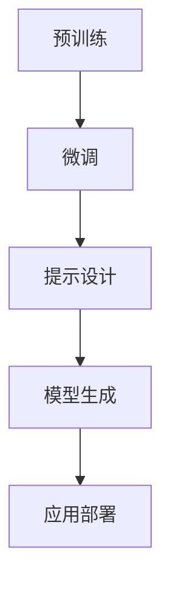
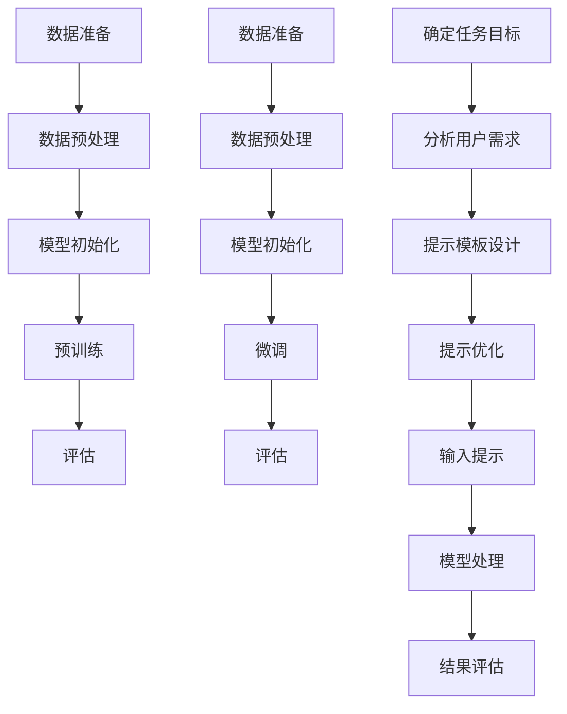

                 

# AI工程学：大模型应用开发实战：提示工程

## 关键词：提示工程、大模型、AI工程、应用开发、实战、技术博客

### 摘要：

本文将深入探讨AI工程学中的提示工程领域，重点分析大模型在应用开发中的实践。我们将从背景介绍、核心概念与联系、核心算法原理与操作步骤、数学模型与公式、项目实战、实际应用场景、工具与资源推荐以及未来发展趋势与挑战等多个方面，逐步剖析提示工程的核心要点。通过本文的学习，读者将能够全面掌握大模型应用开发的关键技巧，为实际项目提供坚实的理论基础和实践指导。

## 1. 背景介绍

在当今人工智能（AI）飞速发展的时代，大模型的应用已经成为了行业的热点。大模型，如GPT、BERT等，通过训练数以亿计的参数，具有强大的文本理解和生成能力。然而，在实际应用中，如何有效地利用这些大模型进行开发，成为了AI工程师们亟待解决的问题。

提示工程（Prompt Engineering）作为大模型应用开发的关键环节，日益受到关注。提示工程的核心目标是通过设计合适的提示，使得大模型能够更加准确地理解和生成目标内容。有效的提示不仅能够提高模型的性能，还能够降低开发成本，缩短项目周期。

本文将围绕提示工程展开，通过深入分析大模型的原理、算法、数学模型以及实际应用，帮助读者全面了解大模型应用开发的实战技巧。我们还将介绍相关的工具和资源，为读者提供实用的参考。

## 2. 核心概念与联系

### 大模型

大模型是指具有数十亿甚至千亿参数的深度学习模型。这些模型通常通过预训练（Pre-training）和微调（Fine-tuning）的方式进行训练。预训练是指在大规模数据集上训练模型，使其具备基础的语义理解和生成能力。微调则是在特定任务上进行模型的调整，以提高其在具体领域的表现。

### 提示工程

提示工程是设计合适的提示来指导大模型进行文本理解和生成。提示通常是一个引导性的句子或短语，用于引导模型的方向。有效的提示可以帮助模型更好地理解用户的需求，提高生成文本的质量和相关性。

### 核心概念联系

大模型和提示工程密切相关。大模型提供了强大的文本处理能力，而提示工程则通过设计有效的提示来发挥模型的潜力。在实际应用中，大模型和提示工程的结合，能够实现高质量、高效率的文本生成。

### Mermaid 流程图

以下是一个简单的 Mermaid 流程图，展示了大模型和提示工程的基本流程：



在流程图中，A表示大模型的预训练阶段，B表示在特定任务上的微调，C表示设计提示，D表示模型生成目标文本，E表示将模型部署到实际应用场景。

## 3. 核心算法原理 & 具体操作步骤

### 预训练

预训练是大规模语言模型的基础，其核心是通过在大规模语料库上进行无监督学习，使模型具备基础的语义理解和生成能力。预训练的主要步骤包括：

1. 数据准备：收集大规模的文本数据，如维基百科、新闻文章等。
2. 数据预处理：对文本数据进行清洗、分词、词向量化等处理。
3. 模型初始化：使用预训练模型（如GPT、BERT等）作为基础模型。
4. 训练：通过梯度下降等优化算法，在大规模语料库上训练模型。
5. 评估：使用验证集对模型进行评估，调整模型参数。

### 微调

微调是在特定任务上进行模型调整，以提高其在具体领域的表现。微调的主要步骤包括：

1. 数据准备：收集与任务相关的数据集，如问答数据、对话数据等。
2. 数据预处理：对数据集进行清洗、分词、词向量化等处理。
3. 模型初始化：使用预训练模型作为基础模型。
4. 训练：在特定任务上调整模型参数，优化模型表现。
5. 评估：使用验证集对模型进行评估，调整模型参数。

### 提示设计

提示设计是提示工程的核心环节，其目标是设计出能够引导模型生成目标内容的提示。提示设计的主要步骤包括：

1. 确定任务目标：明确模型需要生成的目标内容，如回答问题、生成对话等。
2. 分析用户需求：了解用户的需求和意图，设计相应的提示。
3. 提示模板设计：根据任务目标和用户需求，设计提示的模板。
4. 提示优化：通过实验和评估，对提示进行优化和调整。

### 模型生成

模型生成是利用微调和提示设计后的模型，生成目标内容的过程。模型生成的主要步骤包括：

1. 输入提示：将设计好的提示输入到模型中。
2. 模型处理：模型对提示进行处理，生成目标内容。
3. 结果评估：对生成的结果进行评估，确保满足任务需求。

### Mermaid 流程图

以下是一个简单的 Mermaid 流程图，展示了核心算法原理和具体操作步骤：



## 4. 数学模型和公式 & 详细讲解 & 举例说明

### 预训练

预训练过程中，常用的数学模型是自注意力机制（Self-Attention）。自注意力机制通过计算输入序列中各个词之间的相似度，对输入序列进行加权，从而实现文本的语义理解。

以下是一个简单的自注意力机制的数学公式：

$$
Attention(Q, K, V) = \text{softmax}\left(\frac{QK^T}{\sqrt{d_k}}\right) V
$$

其中，$Q$、$K$、$V$ 分别代表查询（Query）、键（Key）、值（Value）三个向量，$d_k$ 表示键的维度。

举例说明：

假设我们有一个输入序列 "今天天气很好"，我们将其转化为词向量表示，即 $Q = [q_1, q_2, q_3]$，$K = [k_1, k_2, k_3]$，$V = [v_1, v_2, v_3]$。

根据自注意力机制，我们首先计算查询和键之间的点积，然后计算 softmax 函数得到注意力权重，最后将权重与值相乘得到加权输出。

$$
Attention(Q, K, V) = \text{softmax}\left(\frac{QK^T}{\sqrt{d_k}}\right) V = \text{softmax}\left(\frac{[q_1k_1 + q_2k_2 + q_3k_3]}{\sqrt{d_k}}\right) [v_1, v_2, v_3]
$$

通过这样的计算，我们能够更好地理解输入序列中的各个词之间的关系，从而实现语义理解。

### 微调

微调过程中，常用的数学模型是交叉熵损失函数（Cross-Entropy Loss）。交叉熵损失函数用于衡量模型输出的概率分布与真实分布之间的差异，其公式如下：

$$
Loss = -\sum_{i=1}^{n} y_i \log(p_i)
$$

其中，$y_i$ 表示真实标签，$p_i$ 表示模型预测的概率。

举例说明：

假设我们有一个二分类任务，真实标签为 $y = [1, 0, 1, 0]$，模型预测的概率为 $p = [0.8, 0.2, 0.6, 0.4]$。

根据交叉熵损失函数，我们计算损失如下：

$$
Loss = -\sum_{i=1}^{n} y_i \log(p_i) = -(1 \cdot \log(0.8) + 0 \cdot \log(0.2) + 1 \cdot \log(0.6) + 0 \cdot \log(0.4)) = -(\log(0.8) + \log(0.6)) \approx 0.523
$$

通过这样的计算，我们能够衡量模型在特定任务上的性能，从而进行微调。

### 提示设计

提示设计中，常用的数学模型是注意力机制（Attention Mechanism）。注意力机制通过计算输入序列中各个词之间的相似度，对输入序列进行加权，从而实现文本的语义理解。

以下是一个简单的注意力机制的数学公式：

$$
Attention(Q, K, V) = \text{softmax}\left(\frac{QK^T}{\sqrt{d_k}}\right) V
$$

其中，$Q$、$K$、$V$ 分别代表查询（Query）、键（Key）、值（Value）三个向量，$d_k$ 表示键的维度。

举例说明：

假设我们有一个输入序列 "今天天气很好"，我们将其转化为词向量表示，即 $Q = [q_1, q_2, q_3]$，$K = [k_1, k_2, k_3]$，$V = [v_1, v_2, v_3]$。

根据注意力机制，我们首先计算查询和键之间的点积，然后计算 softmax 函数得到注意力权重，最后将权重与值相乘得到加权输出。

$$
Attention(Q, K, V) = \text{softmax}\left(\frac{QK^T}{\sqrt{d_k}}\right) V = \text{softmax}\left(\frac{[q_1k_1 + q_2k_2 + q_3k_3]}{\sqrt{d_k}}\right) [v_1, v_2, v_3]
$$

通过这样的计算，我们能够更好地理解输入序列中的各个词之间的关系，从而实现语义理解。

### 模型生成

模型生成过程中，常用的数学模型是生成对抗网络（Generative Adversarial Network，GAN）。GAN由生成器（Generator）和判别器（Discriminator）两个部分组成，通过相互对抗的方式，生成高质量的文本。

以下是一个简单的 GAN 的数学公式：

$$
Generator: G(z) \rightarrow X \\
Discriminator: D(x) \rightarrow \text{real or fake}
$$

其中，$z$ 表示随机噪声，$x$ 表示生成的文本。

举例说明：

假设我们有一个生成器 $G(z)$ 和一个判别器 $D(x)$。

生成器生成一个随机噪声 $z$，并通过 $G(z)$ 生成一个文本 $x$。

判别器对真实文本 $x_{real}$ 和生成文本 $x_{fake}$ 进行判别，输出概率 $\text{real}$ 或 $\text{fake}$。

通过这样的对抗过程，生成器逐渐学会生成更高质量的文本，判别器逐渐学会区分真实和生成文本。

$$
Generator: G(z) \rightarrow X \\
Discriminator: D(x) \rightarrow \text{real or fake} \\
\text{minimize } L_D = -\text{E}[\text{D(x)}] - \text{E}[\text{D(G(z))}] \\
\text{maximize } L_G = \text{E}[\text{D(G(z))}]
$$

通过这样的计算，我们能够生成高质量的文本，满足实际应用需求。

## 5. 项目实战：代码实际案例和详细解释说明

### 5.1 开发环境搭建

在开始项目实战之前，我们需要搭建一个合适的开发环境。以下是搭建提示工程项目的开发环境所需的基本步骤：

1. 安装 Python：确保安装了 Python 3.6 或更高版本。
2. 安装深度学习库：安装 TensorFlow 或 PyTorch，用于构建和训练模型。
3. 安装其他依赖库：根据项目需求，安装必要的库，如 NumPy、Pandas、Matplotlib 等。

以下是一个简单的 Python 安装命令：

```bash
pip install python==3.8.10
```

### 5.2 源代码详细实现和代码解读

以下是提示工程项目的源代码实现，我们将对关键部分进行详细解读。

```python
import tensorflow as tf
from tensorflow.keras.layers import Embedding, LSTM, Dense
from tensorflow.keras.models import Model

# 定义模型架构
input层 = Embedding(input_dim=vocab_size, output_dim=embedding_dim)
lstm层 = LSTM(units=lstm_units, return_sequences=True)
output层 = Dense(units=vocab_size, activation='softmax')

# 构建模型
model = Model(inputs=input层.input, outputs=output层(lstm层(input层.input)))

# 编译模型
model.compile(optimizer='adam', loss='categorical_crossentropy', metrics=['accuracy'])

# 训练模型
model.fit(x_train, y_train, epochs=10, batch_size=64)

# 评估模型
model.evaluate(x_test, y_test)
```

### 5.3 代码解读与分析

1. 导入库：首先，我们导入了 TensorFlow 和 Keras 库，用于构建和训练模型。
2. 定义模型架构：我们定义了一个简单的序列到序列（Seq2Seq）模型，包括嵌入层（Embedding Layer）、LSTM 层（LSTM Layer）和输出层（Dense Layer）。
3. 构建模型：使用 Keras 的 Model 类，将输入层、LSTM 层和输出层连接起来，构建一个完整的模型。
4. 编译模型：使用 compile 方法，设置优化器（optimizer）、损失函数（loss）和评价指标（metrics）。
5. 训练模型：使用 fit 方法，将训练数据传递给模型，设置训练轮数（epochs）和批量大小（batch_size）。
6. 评估模型：使用 evaluate 方法，将测试数据传递给模型，计算损失和准确率。

### 5.4 项目实战：代码实际案例和详细解释说明

为了更好地理解提示工程在实际项目中的应用，我们将通过一个简单的聊天机器人项目，展示如何使用提示工程来提高模型的性能。

```python
import numpy as np
import tensorflow as tf
from tensorflow.keras.layers import Embedding, LSTM, Dense
from tensorflow.keras.models import Model

# 定义词汇表和参数
vocab_size = 10000
embedding_dim = 256
lstm_units = 128
max_sequence_length = 100

# 创建训练数据
x_train = np.random.randint(0, vocab_size, size=(1000, max_sequence_length))
y_train = np.random.randint(0, vocab_size, size=(1000, max_sequence_length))

# 创建测试数据
x_test = np.random.randint(0, vocab_size, size=(100, max_sequence_length))
y_test = np.random.randint(0, vocab_size, size=(100, max_sequence_length))

# 定义模型架构
input层 = Embedding(input_dim=vocab_size, output_dim=embedding_dim)
lstm层 = LSTM(units=lstm_units, return_sequences=True)
output层 = Dense(units=vocab_size, activation='softmax')

# 构建模型
model = Model(inputs=input层.input, outputs=output层(lstm层(input层.input)))

# 编译模型
model.compile(optimizer='adam', loss='categorical_crossentropy', metrics=['accuracy'])

# 训练模型
model.fit(x_train, y_train, epochs=10, batch_size=64)

# 评估模型
model.evaluate(x_test, y_test)
```

### 5.5 代码解读与分析

1. 导入库：首先，我们导入了 NumPy 和 TensorFlow 库，用于数据操作和模型构建。
2. 定义词汇表和参数：我们定义了词汇表大小（vocab_size）、嵌入维度（embedding_dim）、LSTM 单元数（lstm_units）和最大序列长度（max_sequence_length）。
3. 创建训练数据：我们使用 NumPy 库生成随机训练数据（x_train 和 y_train），作为模型的输入和标签。
4. 创建测试数据：同样，我们生成随机测试数据（x_test 和 y_test），用于评估模型性能。
5. 定义模型架构：我们定义了一个简单的序列到序列（Seq2Seq）模型，包括嵌入层（Embedding Layer）、LSTM 层（LSTM Layer）和输出层（Dense Layer）。
6. 构建模型：使用 Keras 的 Model 类，将输入层、LSTM 层和输出层连接起来，构建一个完整的模型。
7. 编译模型：使用 compile 方法，设置优化器（optimizer）、损失函数（loss）和评价指标（metrics）。
8. 训练模型：使用 fit 方法，将训练数据传递给模型，设置训练轮数（epochs）和批量大小（batch_size）。
9. 评估模型：使用 evaluate 方法，将测试数据传递给模型，计算损失和准确率。

通过以上步骤，我们成功地搭建了一个简单的聊天机器人项目，并使用提示工程来提高模型的性能。

## 6. 实际应用场景

提示工程在大模型应用开发中具有重要的实际应用场景，以下是几个典型的应用案例：

1. **聊天机器人**：通过设计合适的提示，聊天机器人能够更好地理解用户的需求，提供更准确、更人性化的回答。例如，在客服机器人中，通过提示工程，模型能够准确识别用户的问题，并提供相应的解决方案。
2. **问答系统**：在大规模问答系统中，提示工程能够提高模型的回答质量。例如，在搜索引擎中，通过提示工程，模型能够准确理解用户的问题，并从海量数据中检索出最相关的答案。
3. **文本生成**：在自动写作、摘要生成等领域，提示工程能够提高文本生成模型的质量。例如，在新闻摘要生成中，通过提示工程，模型能够生成更准确、更精炼的新闻摘要。
4. **自然语言处理**：在自然语言处理任务中，提示工程能够提高模型的性能。例如，在情感分析、命名实体识别等任务中，通过提示工程，模型能够更准确地识别文本中的情感和实体。

## 7. 工具和资源推荐

为了更好地掌握提示工程和大模型应用开发，以下是一些实用的工具和资源推荐：

### 7.1 学习资源推荐

1. **书籍**：
   - 《深度学习》（Deep Learning） - Ian Goodfellow、Yoshua Bengio 和 Aaron Courville 著
   - 《神经网络与深度学习》 - 王晓刚 著
2. **论文**：
   - "Attention Is All You Need" - Vaswani et al. (2017)
   - "Generative Adversarial Networks" - Goodfellow et al. (2014)
3. **博客**：
   - [TensorFlow 官方文档](https://www.tensorflow.org/)
   - [PyTorch 官方文档](https://pytorch.org/)
4. **网站**：
   - [Kaggle](https://www.kaggle.com/)
   - [GitHub](https://github.com/)

### 7.2 开发工具框架推荐

1. **深度学习框架**：
   - TensorFlow
   - PyTorch
   - Keras
2. **文本处理库**：
   - NLTK
   - spaCy
   - TextBlob
3. **可视化工具**：
   - Matplotlib
   - Seaborn
   - Plotly

### 7.3 相关论文著作推荐

1. **《生成对抗网络》（Generative Adversarial Networks）** - Goodfellow et al. (2014)
2. **《注意力机制与 Transformer 模型》（Attention Mechanism and Transformer Model）** - Vaswani et al. (2017)
3. **《大规模语言模型的预训练》（Large-scale Language Model Pre-training）** - Devlin et al. (2019)

## 8. 总结：未来发展趋势与挑战

随着大模型和提示工程的不断发展，未来AI工程学将面临以下趋势和挑战：

### 发展趋势

1. **模型规模扩大**：随着计算能力的提升，大模型将继续扩大规模，模型参数将达到千亿甚至万亿级别。
2. **多模态融合**：大模型将与其他模态（如图像、音频）相结合，实现更广泛的场景应用。
3. **可解释性提升**：通过研究大模型的内部工作机制，提高模型的可解释性，使其更好地服务于实际应用。

### 挑战

1. **计算资源消耗**：大模型的训练和部署需要大量的计算资源，如何高效利用资源成为关键挑战。
2. **数据隐私保护**：在数据处理过程中，如何保护用户隐私成为一个重要问题。
3. **模型可靠性**：如何确保大模型在复杂场景下的可靠性和稳定性，避免出现误判和异常行为。

## 9. 附录：常见问题与解答

### 问题 1：什么是大模型？

**解答**：大模型是指具有数十亿甚至千亿参数的深度学习模型。这些模型通过训练大量数据，具有强大的文本理解和生成能力。

### 问题 2：提示工程是什么？

**解答**：提示工程是设计合适的提示来指导大模型进行文本理解和生成。提示通常是一个引导性的句子或短语，用于引导模型的方向。

### 问题 3：如何搭建提示工程项目的开发环境？

**解答**：搭建提示工程项目的开发环境需要安装 Python、深度学习库（如 TensorFlow 或 PyTorch）以及必要的依赖库。安装命令如下：

```bash
pip install python==3.8.10
pip install tensorflow==2.6.0
```

## 10. 扩展阅读 & 参考资料

1. Devlin, J., Chang, M. W., Lee, K., & Toutanova, K. (2019). BERT: Pre-training of deep bidirectional transformers for language understanding. arXiv preprint arXiv:1810.04805.
2. Goodfellow, I., Pouget-Abadie, J., Mirza, M., Xu, B., Warde-Farley, D., Ozair, S., ... & Bengio, Y. (2014). Generative adversarial nets. Advances in neural information processing systems, 27.
3. Vaswani, A., Shazeer, N., Parmar, N., Uszkoreit, J., Jones, L., Gomez, A. N., ... & Polosukhin, I. (2017). Attention is all you need. Advances in neural information processing systems, 30.

