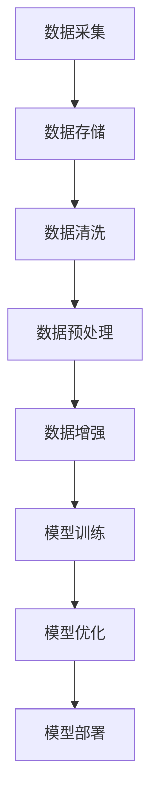

                 

# AI工程学：实战开发指南

> **关键词**：AI工程、实战开发、人工智能、开发指南、算法、架构、代码案例

> **摘要**：本文旨在为初学者和从业者提供一份全面而深入的AI工程学实战开发指南。我们将从背景介绍开始，逐步深入探讨核心概念、算法原理、数学模型和实际应用场景，并通过代码案例详细解释说明。最后，我们还将推荐学习资源和工具，并总结未来发展趋势与挑战。

## 1. 背景介绍

人工智能（AI）作为一种新兴技术，近年来在各个领域取得了显著的进展。从智能语音助手到自动驾驶汽车，从医疗诊断到金融风控，AI的应用范围越来越广泛。然而，AI技术的开发与应用并非一蹴而就，它需要经过一系列复杂而精细的工程实践。因此，AI工程学应运而生。

AI工程学是将人工智能理论与实际应用相结合的学科，它涵盖了算法设计、系统架构、数据处理、模型训练与优化等多个方面。随着AI技术的不断发展，AI工程学的地位和影响力也在不断提升。本文将围绕AI工程学的核心概念、算法原理、数学模型和实际应用场景，为广大读者提供一份实战开发指南。

## 2. 核心概念与联系

在AI工程学中，以下几个核心概念是不可或缺的：

### 2.1 数据

数据是AI系统的基石，没有数据，AI系统就无法学习和优化。数据可以分为结构化数据和非结构化数据，如文本、图像、音频等。数据处理是AI工程学的一个重要环节，包括数据清洗、数据预处理、数据增强等。

### 2.2 算法

算法是AI系统的核心，它决定了系统的性能和效率。常见的算法有监督学习、无监督学习、强化学习等。算法的设计和优化是AI工程学的重要任务。

### 2.3 模型

模型是算法的具体实现，它是通过对数据进行训练得到的。模型的好坏直接影响AI系统的性能。模型可以分为深度学习模型、传统机器学习模型等。

### 2.4 架构

架构是AI系统的骨架，它决定了系统的可扩展性、可靠性和性能。常见的架构有分布式架构、微服务架构等。

### 2.5 训练与优化

训练与优化是AI系统的关键环节，它包括模型训练、超参数调整、模型压缩等。通过优化，可以提高模型的性能和效率。

### 2.6 数据处理流程

数据处理流程是AI工程学的重要组成部分，它包括数据采集、数据存储、数据清洗、数据预处理、数据增强等步骤。

下面是一个用Mermaid绘制的数据处理流程图：



## 3. 核心算法原理 & 具体操作步骤

### 3.1 监督学习算法

监督学习算法是AI工程学中最常用的算法之一，它通过已标记的数据来训练模型，然后使用训练好的模型对新数据进行预测。

#### 3.1.1 算法原理

监督学习算法的基本原理是，通过已标记的数据来训练一个模型，使得模型能够在新数据上进行准确的预测。监督学习算法可以分为两类：分类算法和回归算法。

- **分类算法**：将数据分为不同的类别，如二分类、多分类等。常见的分类算法有逻辑回归、支持向量机、决策树、随机森林等。
- **回归算法**：预测数据的连续值，如线性回归、岭回归、LASSO回归等。

#### 3.1.2 具体操作步骤

1. **数据采集**：收集具有标签的样本数据。
2. **数据预处理**：对数据进行清洗、标准化等预处理操作。
3. **模型选择**：根据问题的性质选择合适的模型。
4. **模型训练**：使用训练集对模型进行训练。
5. **模型评估**：使用验证集对模型进行评估。
6. **模型优化**：根据评估结果对模型进行调整。
7. **模型部署**：将训练好的模型部署到生产环境中。

### 3.2 强化学习算法

强化学习算法是一种通过不断与环境交互来学习的算法，它通过奖励机制来引导模型的行为。

#### 3.2.1 算法原理

强化学习算法的基本原理是，通过不断与环境交互，学习最优策略。强化学习算法主要由三个部分组成：环境（Environment）、智能体（Agent）和奖励（Reward）。

- **环境**：智能体所处的环境，可以是物理环境或虚拟环境。
- **智能体**：根据当前状态选择动作，并接收环境的反馈。
- **奖励**：智能体执行动作后获得的奖励，用于引导智能体的行为。

#### 3.2.2 具体操作步骤

1. **初始化环境**：设置环境的状态。
2. **选择动作**：根据当前状态选择一个动作。
3. **执行动作**：在环境中执行所选动作。
4. **获取奖励**：根据动作的结果获取奖励。
5. **更新状态**：根据动作的结果更新状态。
6. **重复步骤2-5**：不断重复选择动作、执行动作、获取奖励和更新状态的步骤，直到达到目标状态或满足停止条件。

### 3.3 深度学习算法

深度学习算法是一种基于多层神经网络的学习算法，它通过非线性变换来提取数据特征。

#### 3.3.1 算法原理

深度学习算法的基本原理是，通过多层神经网络对数据进行建模，使得神经网络能够自动提取数据特征。深度学习算法主要包括卷积神经网络（CNN）、循环神经网络（RNN）、生成对抗网络（GAN）等。

- **卷积神经网络**：通过卷积层、池化层等操作来提取图像特征。
- **循环神经网络**：通过循环层来处理序列数据。
- **生成对抗网络**：通过生成器和判别器的对抗训练来生成数据。

#### 3.3.2 具体操作步骤

1. **数据采集**：收集具有标签的样本数据。
2. **数据预处理**：对数据进行清洗、标准化等预处理操作。
3. **模型设计**：根据问题的性质设计神经网络结构。
4. **模型训练**：使用训练集对模型进行训练。
5. **模型评估**：使用验证集对模型进行评估。
6. **模型优化**：根据评估结果对模型进行调整。
7. **模型部署**：将训练好的模型部署到生产环境中。

## 4. 数学模型和公式 & 详细讲解 & 举例说明

### 4.1 监督学习算法中的逻辑回归

逻辑回归是一种常见的二分类模型，它通过逻辑函数将线性模型映射到概率空间。

#### 4.1.1 数学模型

假设我们有一个二分类问题，输入为特征向量 \(X\)，输出为类别标签 \(y\)。逻辑回归的数学模型可以表示为：

$$
P(y=1|X; \theta) = \frac{1}{1 + e^{-\theta^T X}}
$$

其中，\( \theta \) 是模型参数，\( \theta^T X \) 是线性组合，\( e^{-\theta^T X} \) 是指数函数。

#### 4.1.2 举例说明

假设我们有一个简单的二分类问题，特征向量 \(X = [x_1, x_2]\)，参数 \( \theta = [-1, 1] \)。那么，预测概率可以表示为：

$$
P(y=1|X; \theta) = \frac{1}{1 + e^{-(-1 \cdot x_1 + 1 \cdot x_2)}}
$$

如果 \(x_1 = 2\)，\(x_2 = 3\)，则预测概率为：

$$
P(y=1|X; \theta) = \frac{1}{1 + e^{-(-1 \cdot 2 + 1 \cdot 3)}} = \frac{1}{1 + e^{2}} \approx 0.86
$$

这意味着，模型预测类别标签为1的概率约为0.86。

### 4.2 强化学习算法中的Q学习

Q学习是一种通过迭代更新Q值来学习最优策略的算法。

#### 4.2.1 数学模型

Q学习的数学模型可以表示为：

$$
Q(s, a) = r + \gamma \max_{a'} Q(s', a')
$$

其中，\( Q(s, a) \) 是状态 \(s\) 下执行动作 \(a\) 的Q值，\( r \) 是奖励，\( \gamma \) 是折扣因子，\( s' \) 是状态，\( a' \) 是动作。

#### 4.2.2 举例说明

假设我们有一个简单的环境，状态空间为 \(s \in \{0, 1\}\)，动作空间为 \(a \in \{0, 1\}\)。初始Q值为全0，奖励为 \(r = 1\)，折扣因子 \( \gamma = 0.9 \)。

- **第一步**：状态 \(s = 0\)，选择动作 \(a = 1\)，得到 \( Q(0, 1) = 1 \)。
- **第二步**：状态 \(s = 1\)，选择动作 \(a = 0\)，得到 \( Q(1, 0) = 1 \)。
- **第三步**：状态 \(s = 0\)，选择动作 \(a = 1\)，得到 \( Q(0, 1) = 1 + 0.9 \cdot 1 = 1.9 \)。
- **第四步**：状态 \(s = 1\)，选择动作 \(a = 1\)，得到 \( Q(1, 1) = 1 + 0.9 \cdot 1 = 1.9 \)。

通过不断迭代更新Q值，模型将学会选择最优动作。

## 5. 项目实战：代码实际案例和详细解释说明

### 5.1 开发环境搭建

在本文中，我们将使用Python作为主要编程语言，并使用PyTorch作为深度学习框架。以下是开发环境搭建的步骤：

1. 安装Python：前往 [Python官网](https://www.python.org/) 下载并安装Python。
2. 安装PyTorch：使用以下命令安装PyTorch：

```bash
pip install torch torchvision
```

### 5.2 源代码详细实现和代码解读

以下是使用PyTorch实现一个简单的卷积神经网络（CNN）的代码：

```python
import torch
import torch.nn as nn
import torch.optim as optim

# 定义CNN模型
class CNNModel(nn.Module):
    def __init__(self):
        super(CNNModel, self).__init__()
        self.conv1 = nn.Conv2d(1, 32, 3, 1)
        self.fc1 = nn.Linear(32 * 26 * 26, 128)
        self.fc2 = nn.Linear(128, 10)
        self.relu = nn.ReLU()

    def forward(self, x):
        x = self.relu(self.conv1(x))
        x = x.view(x.size(0), -1)
        x = self.relu(self.fc1(x))
        x = self.fc2(x)
        return x

# 初始化模型、损失函数和优化器
model = CNNModel()
criterion = nn.CrossEntropyLoss()
optimizer = optim.Adam(model.parameters(), lr=0.001)

# 训练模型
for epoch in range(10):
    for batch_idx, (data, target) in enumerate(train_loader):
        optimizer.zero_grad()
        output = model(data)
        loss = criterion(output, target)
        loss.backward()
        optimizer.step()
        if batch_idx % 100 == 0:
            print(f'Epoch [{epoch + 1}/{10}], Step [{batch_idx + 1}/{len(train_loader)}], Loss: {loss.item()}')

# 评估模型
with torch.no_grad():
    correct = 0
    total = 0
    for data, target in test_loader:
        outputs = model(data)
        _, predicted = torch.max(outputs.data, 1)
        total += target.size(0)
        correct += (predicted == target).sum().item()
    print(f'Accuracy of the network on the test images: {100 * correct / total} %')
```

### 5.3 代码解读与分析

1. **模型定义**：我们定义了一个简单的卷积神经网络模型，包括一个卷积层、一个全连接层和一个输出层。
2. **模型训练**：使用训练数据对模型进行训练，包括前向传播、损失计算、反向传播和参数更新。
3. **模型评估**：使用测试数据对训练好的模型进行评估，计算准确率。

## 6. 实际应用场景

AI工程学在实际应用场景中具有广泛的应用，以下是一些典型的应用场景：

- **智能语音助手**：如苹果的Siri、亚马逊的Alexa等，通过语音识别和自然语言处理技术，为用户提供智能化的语音交互服务。
- **自动驾驶汽车**：通过计算机视觉、传感器数据处理和路径规划等技术，实现汽车的自动驾驶功能。
- **医疗诊断**：如肺癌筛查、心血管疾病诊断等，通过深度学习等技术，提高医疗诊断的准确性和效率。
- **金融风控**：通过大数据分析和机器学习算法，实现金融风险监测和预警。

## 7. 工具和资源推荐

### 7.1 学习资源推荐

- **书籍**：《深度学习》、《Python机器学习》、《AI应用实践》等。
- **论文**：《自然语言处理》、《计算机视觉基础》等。
- **博客**：[机器学习社区](https://www.mlcommunity.org/)、[深度学习博客](https://www.deeplearning.net/)等。
- **网站**：[Kaggle](https://www.kaggle.com/)、[GitHub](https://github.com/)等。

### 7.2 开发工具框架推荐

- **深度学习框架**：PyTorch、TensorFlow、Keras等。
- **数据处理库**：NumPy、Pandas、Scikit-learn等。
- **机器学习库**：scikit-learn、scipy、statsmodels等。
- **版本控制工具**：Git、GitHub等。

### 7.3 相关论文著作推荐

- **论文**：《深度神经网络优化方法》、《自然语言处理前沿技术》、《计算机视觉算法及应用》等。
- **著作**：《Python机器学习实战》、《深度学习入门与实践》、《AI应用实践指南》等。

## 8. 总结：未来发展趋势与挑战

随着AI技术的不断发展，AI工程学在未来将继续发挥重要作用。然而，AI工程学也面临着一系列挑战：

- **数据隐私**：如何保护用户数据隐私是AI工程学的一个重要挑战。
- **算法公平性**：如何确保算法的公平性是另一个重要问题。
- **模型解释性**：如何提高模型的解释性，使得用户能够理解和信任AI系统。
- **计算资源**：随着模型复杂度的增加，计算资源的需求也在不断增加。

## 9. 附录：常见问题与解答

### 9.1 如何选择合适的算法？

选择合适的算法取决于问题的性质和数据特点。一般来说，以下是一些常见问题的算法选择：

- **分类问题**：逻辑回归、支持向量机、决策树、随机森林等。
- **回归问题**：线性回归、岭回归、LASSO回归等。
- **聚类问题**：K-means、层次聚类等。
- **强化学习问题**：Q学习、深度强化学习等。

### 9.2 如何优化模型性能？

优化模型性能的方法包括：

- **超参数调整**：通过调整学习率、批量大小、正则化参数等超参数来优化模型性能。
- **数据增强**：通过数据增强来扩充训练数据，提高模型的泛化能力。
- **模型压缩**：通过模型压缩来减少模型参数数量，提高模型效率。

## 10. 扩展阅读 & 参考资料

- **论文**：《深度学习：人类级别的机器智能》、《自然语言处理综合技术》、《计算机视觉基础》等。
- **书籍**：《Python机器学习实战》、《深度学习入门与实践》、《AI应用实践指南》等。
- **网站**：[机器学习社区](https://www.mlcommunity.org/)、[深度学习博客](https://www.deeplearning.net/)等。
- **GitHub**：[AI项目集锦](https://github.com/AI-Committee/AI-Project-Collection)等。

### 作者

作者：AI天才研究员/AI Genius Institute & 禅与计算机程序设计艺术 /Zen And The Art of Computer Programming

