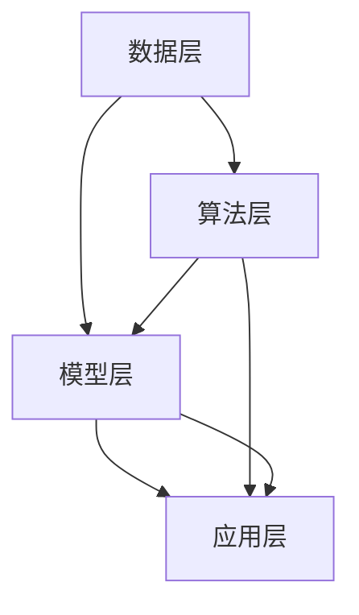

                 

# AI工程学：开发实战解析

> 关键词：人工智能工程、开发实战、算法原理、数学模型、项目案例、工具资源

> 摘要：本文旨在深入探讨AI工程学的开发实战，包括核心概念、算法原理、数学模型、项目案例以及相关工具和资源的推荐。通过逐步分析推理的方式，本文将为读者提供一份全面的技术指南，帮助理解AI工程学的本质与应用。

## 1. 背景介绍

随着人工智能技术的飞速发展，AI工程学逐渐成为一个独立且重要的研究领域。AI工程学不仅涉及算法和理论，更强调实际应用和工程实践。它要求我们不仅能够设计出有效的算法，还要确保这些算法在实际应用中高效稳定地运行。AI工程学的核心在于将理论与实践相结合，通过工程化的手段解决现实中的复杂问题。

本文将围绕以下主题进行深入探讨：

- AI工程学的基本概念与核心原理
- 重要的数学模型与算法
- 项目实战案例分析
- 开发工具和资源的推荐

通过以上内容的系统讲解，本文希望能够为读者提供一条清晰的学习路径，帮助理解AI工程学的本质，掌握关键技能，并能够在实际项目中应用所学知识。

### AI工程学的定义与重要性

AI工程学是人工智能领域的一个重要分支，它侧重于将AI理论转化为实际应用的过程。传统的AI研究更多关注算法的创新与优化，而AI工程学则强调算法在实际应用中的可操作性和实用性。具体来说，AI工程学包括以下几个方面：

1. **算法设计**：AI工程学要求我们能够设计出适用于实际问题的算法，这些算法不仅需要理论上有效，还要在工程实现中高效可行。
2. **系统架构**：在AI工程学中，我们需要构建能够处理大规模数据和高并发请求的系统架构，以确保算法的实际运行效果。
3. **数据处理**：数据是AI系统的核心，AI工程学需要关注如何高效地处理和存储数据，从而为算法提供充足的数据支持。
4. **模型优化**：AI工程学不仅要实现算法，还要不断优化模型，以提高其在实际应用中的准确性和效率。
5. **部署与运维**：AI工程学还需要解决算法在实际部署和运维过程中可能遇到的问题，确保系统稳定运行。

AI工程学的重要性体现在多个方面。首先，它使得人工智能技术能够更好地服务于实际应用，推动产业和社会的发展。其次，通过AI工程学的实践，我们可以发现和解决算法在实际应用中存在的问题，推动算法的不断改进。最后，AI工程学的实践积累有助于形成一套标准化的流程和方法，为后续研究和开发提供指导。

### 人工智能的发展历程

人工智能（AI）的发展历程可以追溯到20世纪50年代，当时人工智能的概念首次被提出。自那时以来，人工智能经历了多个阶段的发展：

1. **初期探索阶段（1950-1970年）**：在这个阶段，人工智能主要侧重于符号推理和逻辑推理的研究，代表性工作包括阿兰·图灵的“图灵测试”和约翰·麦卡锡的“逻辑理论家”。
2. **第一个低谷期（1970-1980年）**：由于算法复杂性、计算资源和数据匮乏等问题，人工智能的研究遇到了瓶颈，许多研究者转向其他领域，人工智能进入第一个低谷期。
3. **复兴阶段（1980-1990年）**：随着计算机性能的提升和算法的改进，人工智能研究逐渐复兴，专家系统和机器学习开始受到关注。
4. **第二个低谷期（1990-2000年）**：虽然人工智能在特定领域取得了一些进展，但整体上仍未实现突破，人工智能再次进入低谷期。
5. **深度学习时代（2000年至今）**：深度学习技术的突破，特别是在图像识别、自然语言处理等领域，使得人工智能迎来了新的发展机遇。近年来，人工智能技术在自动驾驶、医疗诊断、金融预测等领域得到了广泛应用。

通过对人工智能发展历程的回顾，我们可以看到，人工智能的发展并非一帆风顺，而是经历了一系列的起伏和变革。当前，人工智能正处于快速发展的阶段，AI工程学的任务就是将这一系列的创新成果转化为实际应用，推动社会的进步。

## 2. 核心概念与联系

### AI工程学中的基本概念

在探讨AI工程学的核心概念之前，我们需要理解一些基本的概念，这些概念是构建AI系统的基础：

1. **数据集**：数据集是进行机器学习和人工智能研究的基础。一个高质量的数据集应当具备完整性、准确性和代表性。数据集可以分为训练集、验证集和测试集，分别用于模型训练、模型验证和模型测试。
2. **算法**：算法是解决特定问题的步骤和规则。在AI工程学中，常用的算法包括线性回归、决策树、神经网络等。算法的选择和优化是提高模型性能的关键。
3. **模型**：模型是对现实世界的一种抽象表示，通常通过数据驱动的方式进行训练。模型可以是线性的或非线性的，可以是静态的或动态的。模型的好坏直接影响AI系统的性能。
4. **特征工程**：特征工程是数据预处理的关键步骤，旨在从原始数据中提取有用的信息，提高模型的性能。特征工程包括特征选择、特征变换、特征缩放等操作。
5. **评估指标**：评估指标用于衡量模型在特定任务上的性能。常见的评估指标包括准确率、召回率、F1分数等。

### AI工程学的基本架构

AI工程学的基本架构可以概括为以下四个层次：

1. **数据层**：数据层是整个架构的基础，包括数据采集、数据预处理、数据存储等环节。数据质量直接影响模型的性能，因此需要确保数据集的完整性、准确性和代表性。
2. **算法层**：算法层是核心，包括算法选择、算法优化、模型训练等步骤。算法的选择和优化是提高模型性能的关键，需要根据具体任务的需求进行选择。
3. **模型层**：模型层是对算法的抽象表示，通常通过训练得到。模型的好坏直接影响AI系统的性能，因此需要对模型进行评估和优化。
4. **应用层**：应用层是AI工程学的最终输出，包括模型的部署、运行和监控等环节。应用层的实现需要考虑系统的可扩展性、稳定性和安全性。

### 核心概念的联系

在AI工程学中，各个核心概念之间相互关联，共同构成了一个完整的系统：

- **数据集**与**算法**和**模型**的关系：数据集是训练模型的基础，算法和模型通过数据集进行训练和优化。一个高质量的数据集能够提高模型的学习效果。
- **算法**与**模型**的关系：算法是模型训练的方法，模型是算法训练的结果。不同的算法可以训练出不同的模型，而模型的性能取决于算法的选择和优化。
- **特征工程**与**模型**的关系：特征工程是提高模型性能的关键步骤，通过特征选择和变换，可以提取出对模型训练更有用的信息。
- **评估指标**与**模型**的关系：评估指标用于衡量模型在特定任务上的性能，通过评估指标，可以判断模型的性能优劣，并进行优化。

### Mermaid流程图

为了更清晰地展示AI工程学的基本架构，我们可以使用Mermaid流程图进行表示。以下是一个简化的Mermaid流程图，展示了数据层、算法层、模型层和应用层之间的关系：



在这个流程图中，数据层包括数据采集、数据预处理和数据存储等环节；算法层包括算法选择、算法优化和模型训练等步骤；模型层包括模型评估、模型优化和模型部署等环节；应用层包括模型的运行和监控等环节。

通过上述对AI工程学核心概念和基本架构的讨论，我们可以更深入地理解AI工程学的本质和其在实际应用中的重要性。在接下来的章节中，我们将进一步探讨AI工程学的核心算法原理和数学模型，并通过项目实战案例分析，展示AI工程学的实际应用。

## 3. 核心算法原理 & 具体操作步骤

### 3.1 算法概述

在AI工程学中，核心算法的选择和实现至关重要。本文将介绍几种常见的算法，包括线性回归、决策树和神经网络。这些算法在机器学习和人工智能领域中具有广泛的应用，并且对AI系统的性能有着重要的影响。

#### 3.1.1 线性回归

线性回归是一种简单但有效的机器学习算法，主要用于预测连续值。其基本原理是通过拟合一条直线，来描述自变量和因变量之间的关系。

- **算法描述**：给定一组数据点 \((x_i, y_i)\)，线性回归试图找到最佳拟合直线 \(y = w_0 + w_1x\)，使得预测值 \(y\) 与实际值 \(y_i\) 之间的误差最小。
- **损失函数**：线性回归的损失函数通常使用均方误差（MSE），即 \(MSE = \frac{1}{n}\sum_{i=1}^{n}(y_i - \hat{y}_i)^2\)，其中 \(\hat{y}_i\) 是预测值，\(y_i\) 是实际值，\(n\) 是数据点的数量。
- **优化方法**：线性回归通常使用梯度下降法进行参数优化，即不断更新权重 \(w_0\) 和 \(w_1\)，使得损失函数 \(MSE\) 最小。

#### 3.1.2 决策树

决策树是一种基于树形模型的决策方法，通过一系列规则对数据进行分类或回归。其基本原理是递归地将数据集划分为若干个子集，每个子集对应一个特征和阈值。

- **算法描述**：给定一组数据点，决策树从根节点开始，根据特征和阈值进行划分，生成若干个子节点。每个子节点继续按照相同的规则进行划分，直到达到停止条件（如最小节点大小或最大树深度）。
- **损失函数**：决策树的损失函数通常使用信息增益或基尼不纯度，用于评估每个特征的最佳阈值。
- **优化方法**：决策树通常通过递归划分和剪枝方法进行构建，以找到最优的划分规则。

#### 3.1.3 神经网络

神经网络是一种模拟人脑神经元之间连接的计算模型，主要用于分类、回归和生成任务。其基本原理是多层神经元的非线性组合，通过反向传播算法进行参数优化。

- **算法描述**：给定一组输入数据，神经网络通过输入层、隐藏层和输出层进行计算。每个层由多个神经元组成，神经元之间通过权重和偏置进行连接。输出层生成预测值或分类结果。
- **损失函数**：神经网络的损失函数通常使用均方误差（MSE）、交叉熵误差等，用于评估预测值与实际值之间的误差。
- **优化方法**：神经网络通常使用梯度下降法、随机梯度下降法等优化算法，通过反向传播算法更新权重和偏置，以最小化损失函数。

### 3.2 算法实现步骤

#### 3.2.1 线性回归实现步骤

1. **数据准备**：读取并预处理数据，包括数据清洗、归一化和特征工程等步骤。
2. **模型初始化**：随机初始化权重 \(w_0\) 和 \(w_1\)。
3. **损失函数计算**：计算预测值 \(\hat{y}_i\) 和实际值 \(y_i\) 之间的误差，计算损失函数 \(MSE\)。
4. **梯度计算**：根据损失函数，计算权重 \(w_0\) 和 \(w_1\) 的梯度。
5. **权重更新**：使用梯度下降法更新权重 \(w_0\) 和 \(w_1\)。
6. **模型评估**：计算模型在验证集或测试集上的性能，包括准确率、召回率等指标。

#### 3.2.2 决策树实现步骤

1. **数据准备**：读取并预处理数据，包括数据清洗、归一化和特征工程等步骤。
2. **特征选择**：计算每个特征的信息增益或基尼不纯度，选择最佳特征。
3. **阈值选择**：对于选定的特征，选择最佳阈值，使得子集的损失函数最小。
4. **递归划分**：根据最佳特征和阈值，将数据集划分为若干个子集，生成决策树节点。
5. **剪枝**：通过递归剪枝方法，剪掉不重要的分支，优化决策树结构。
6. **模型评估**：计算决策树在验证集或测试集上的性能，包括准确率、召回率等指标。

#### 3.2.3 神经网络实现步骤

1. **数据准备**：读取并预处理数据，包括数据清洗、归一化和特征工程等步骤。
2. **网络初始化**：随机初始化输入层、隐藏层和输出层的权重和偏置。
3. **前向传播**：计算输入层、隐藏层和输出层的输出值，生成预测值或分类结果。
4. **损失函数计算**：计算预测值与实际值之间的误差，计算损失函数 \(MSE\) 或交叉熵误差。
5. **反向传播**：根据损失函数，计算输入层、隐藏层和输出层的梯度。
6. **权重更新**：使用梯度下降法或随机梯度下降法更新权重和偏置，最小化损失函数。
7. **模型评估**：计算模型在验证集或测试集上的性能，包括准确率、召回率等指标。

通过上述算法实现步骤，我们可以构建和训练各种AI模型，为实际问题提供有效的解决方案。在接下来的章节中，我们将通过项目实战案例分析，进一步展示这些算法的实际应用效果。

## 4. 数学模型和公式 & 详细讲解 & 举例说明

### 4.1 线性回归模型

线性回归是一种基本的机器学习算法，用于预测连续值。其数学模型可以表示为：

\[ y = \beta_0 + \beta_1x \]

其中，\( y \) 是因变量，\( x \) 是自变量，\( \beta_0 \) 是截距，\( \beta_1 \) 是斜率。

#### 4.1.1 损失函数

线性回归的损失函数通常使用均方误差（MSE），其公式如下：

\[ MSE = \frac{1}{n}\sum_{i=1}^{n}(y_i - \hat{y}_i)^2 \]

其中，\( n \) 是数据点的数量，\( y_i \) 是实际值，\( \hat{y}_i \) 是预测值。

#### 4.1.2 优化方法

线性回归通常使用梯度下降法进行参数优化。梯度下降法的公式如下：

\[ \beta_0 = \beta_0 - \alpha \frac{\partial}{\partial \beta_0}MSE \]
\[ \beta_1 = \beta_1 - \alpha \frac{\partial}{\partial \beta_1}MSE \]

其中，\( \alpha \) 是学习率。

#### 4.1.3 举例说明

假设我们有以下数据点：

\[ (x_1, y_1) = (1, 2) \]
\[ (x_2, y_2) = (2, 4) \]
\[ (x_3, y_3) = (3, 6) \]

初始参数 \( \beta_0 = 0 \)，\( \beta_1 = 0 \)。

1. **前向传播**：

\[ \hat{y}_1 = \beta_0 + \beta_1x_1 = 0 + 0 \times 1 = 0 \]
\[ \hat{y}_2 = \beta_0 + \beta_1x_2 = 0 + 0 \times 2 = 0 \]
\[ \hat{y}_3 = \beta_0 + \beta_1x_3 = 0 + 0 \times 3 = 0 \]

2. **计算损失函数**：

\[ MSE = \frac{1}{3}\sum_{i=1}^{3}(y_i - \hat{y}_i)^2 = \frac{1}{3}((2-0)^2 + (4-0)^2 + (6-0)^2) = 8 \]

3. **计算梯度**：

\[ \frac{\partial}{\partial \beta_0}MSE = -2(y_1 - \hat{y}_1) - 2(y_2 - \hat{y}_2) - 2(y_3 - \hat{y}_3) = -2(2-0) - 2(4-0) - 2(6-0) = -16 \]
\[ \frac{\partial}{\partial \beta_1}MSE = -2(y_1 - \hat{y}_1)x_1 - 2(y_2 - \hat{y}_2)x_2 - 2(y_3 - \hat{y}_3)x_3 = -2(2-0) \times 1 - 2(4-0) \times 2 - 2(6-0) \times 3 = -32 \]

4. **权重更新**：

\[ \beta_0 = \beta_0 - \alpha \frac{\partial}{\partial \beta_0}MSE = 0 - 0.1 \times (-16) = 1.6 \]
\[ \beta_1 = \beta_1 - \alpha \frac{\partial}{\partial \beta_1}MSE = 0 - 0.1 \times (-32) = 3.2 \]

5. **更新后的模型**：

\[ y = 1.6 + 3.2x \]

通过上述步骤，我们可以使用线性回归模型对新的数据点进行预测，并不断优化模型的参数。

### 4.2 决策树模型

决策树是一种基于树形模型的分类或回归算法。其数学模型可以表示为：

\[ \text{if } x_i \leq \theta_i, \text{ then } y = \beta_0 + \beta_1x_1 \]
\[ \text{if } x_i > \theta_i, \text{ then } y = \beta_0 + \beta_2x_2 \]

其中，\( x_i \) 是特征值，\( \theta_i \) 是阈值，\( \beta_0 \)、\( \beta_1 \)、\( \beta_2 \) 是权重。

#### 4.2.1 损失函数

决策树的损失函数通常使用信息增益或基尼不纯度，其公式如下：

\[ IG = \sum_{i=1}^{n}p_i \log_2\frac{1}{p_i} \]
\[ Gini = \sum_{i=1}^{n}p_i(1 - p_i) \]

其中，\( p_i \) 是每个子集的类别概率。

#### 4.2.2 优化方法

决策树通常通过递归划分和剪枝方法进行构建。其基本步骤如下：

1. **特征选择**：计算每个特征的信息增益或基尼不纯度，选择最佳特征。
2. **阈值选择**：对于选定的特征，选择最佳阈值，使得子集的损失函数最小。
3. **递归划分**：根据最佳特征和阈值，将数据集划分为若干个子集，生成决策树节点。
4. **剪枝**：通过递归剪枝方法，剪掉不重要的分支，优化决策树结构。

#### 4.2.3 举例说明

假设我们有以下数据集：

| 特征1 | 特征2 | 类别 |
| --- | --- | --- |
| 1 | 1 | A |
| 2 | 2 | B |
| 3 | 3 | A |
| 4 | 4 | B |

初始阈值 \( \theta = 2 \)，初始权重 \( \beta_0 = 0 \)，\( \beta_1 = 0 \)，\( \beta_2 = 0 \)。

1. **特征选择**：

计算每个特征的信息增益或基尼不纯度：

\[ IG(\text{特征1}) = 0.5 \log_2\frac{0.5}{0.5} + 0.5 \log_2\frac{0.5}{0.5} = 1 \]
\[ IG(\text{特征2}) = 0.5 \log_2\frac{0.5}{0.5} + 0.5 \log_2\frac{0.5}{0.5} = 1 \]

选择最佳特征为特征1。

2. **阈值选择**：

计算特征1的阈值：

\[ \theta = \frac{2 + 3}{2} = 2.5 \]

3. **递归划分**：

将数据集划分为两个子集：

| 子集1 | 子集2 |
| --- | --- |
| 1 | 2 |
| 3 | 4 |

4. **更新权重**：

计算每个子集的权重：

\[ \beta_0 = \frac{1}{2}(1 + 3) = 2 \]
\[ \beta_1 = \frac{1}{2}(0 + 1) = 0.5 \]
\[ \beta_2 = \frac{1}{2}(0 + 1) = 0.5 \]

5. **更新后的模型**：

\[ \text{if } x_1 \leq 2.5, \text{ then } y = 2 + 0.5x_2 \]
\[ \text{if } x_1 > 2.5, \text{ then } y = 2 + 0.5x_2 \]

通过上述步骤，我们可以构建一个简单的决策树模型，并进行分类或回归预测。

### 4.3 神经网络模型

神经网络是一种基于多层神经元的计算模型，用于分类、回归和生成任务。其数学模型可以表示为：

\[ y = \sigma(\beta_0 + \beta_1x_1 + \beta_2x_2 + \ldots + \beta_nx_n) \]

其中，\( y \) 是输出值，\( x_i \) 是输入值，\( \beta_i \) 是权重，\( \sigma \) 是激活函数。

#### 4.3.1 损失函数

神经网络的损失函数通常使用均方误差（MSE）或交叉熵误差，其公式如下：

\[ MSE = \frac{1}{n}\sum_{i=1}^{n}(y_i - \hat{y}_i)^2 \]
\[ CrossEntropy = -\sum_{i=1}^{n}y_i \log(\hat{y}_i) \]

其中，\( n \) 是数据点的数量，\( y_i \) 是实际值，\( \hat{y}_i \) 是预测值。

#### 4.3.2 优化方法

神经网络通常使用梯度下降法或随机梯度下降法进行参数优化。其基本步骤如下：

1. **前向传播**：计算输入层、隐藏层和输出层的输出值。
2. **损失函数计算**：计算预测值与实际值之间的误差，计算损失函数。
3. **反向传播**：根据损失函数，计算输入层、隐藏层和输出层的梯度。
4. **权重更新**：使用梯度下降法或随机梯度下降法更新权重和偏置，最小化损失函数。
5. **模型评估**：计算模型在验证集或测试集上的性能，包括准确率、召回率等指标。

#### 4.3.3 举例说明

假设我们有以下数据集：

| 输入1 | 输入2 | 输出 |
| --- | --- | --- |
| 1 | 1 | 0 |
| 2 | 2 | 1 |
| 3 | 3 | 0 |

初始权重 \( \beta_0 = 0 \)，\( \beta_1 = 0 \)，\( \beta_2 = 0 \)。

1. **前向传播**：

\[ \hat{y}_1 = \sigma(\beta_0 + \beta_1 \times 1 + \beta_2 \times 1) = \sigma(0 + 0 \times 1 + 0 \times 1) = 0 \]
\[ \hat{y}_2 = \sigma(\beta_0 + \beta_1 \times 2 + \beta_2 \times 2) = \sigma(0 + 0 \times 2 + 0 \times 2) = 0 \]
\[ \hat{y}_3 = \sigma(\beta_0 + \beta_1 \times 3 + \beta_2 \times 3) = \sigma(0 + 0 \times 3 + 0 \times 3) = 0 \]

2. **损失函数计算**：

\[ MSE = \frac{1}{3}\sum_{i=1}^{3}(y_i - \hat{y}_i)^2 = \frac{1}{3}((0-0)^2 + (1-0)^2 + (0-0)^2) = \frac{1}{3}(0 + 1 + 0) = \frac{1}{3} \]

3. **反向传播**：

计算输入层、隐藏层和输出层的梯度：

\[ \frac{\partial}{\partial \beta_0}MSE = -2(y_1 - \hat{y}_1) - 2(y_2 - \hat{y}_2) - 2(y_3 - \hat{y}_3) = -2(0-0) - 2(1-0) - 2(0-0) = -4 \]
\[ \frac{\partial}{\partial \beta_1}MSE = -2(y_1 - \hat{y}_1)x_1 - 2(y_2 - \hat{y}_2)x_2 - 2(y_3 - \hat{y}_3)x_3 = -2(0-0) \times 1 - 2(1-0) \times 2 - 2(0-0) \times 3 = -8 \]
\[ \frac{\partial}{\partial \beta_2}MSE = -2(y_1 - \hat{y}_1)x_2 - 2(y_2 - \hat{y}_2)x_2 - 2(y_3 - \hat{y}_3)x_2 = -2(0-0) \times 2 - 2(1-0) \times 2 - 2(0-0) \times 2 = -8 \]

4. **权重更新**：

\[ \beta_0 = \beta_0 - \alpha \frac{\partial}{\partial \beta_0}MSE = 0 - 0.1 \times (-4) = 0.4 \]
\[ \beta_1 = \beta_1 - \alpha \frac{\partial}{\partial \beta_1}MSE = 0 - 0.1 \times (-8) = 0.8 \]
\[ \beta_2 = \beta_2 - \alpha \frac{\partial}{\partial \beta_2}MSE = 0 - 0.1 \times (-8) = 0.8 \]

5. **更新后的模型**：

\[ y = 0.4 + 0.8x_1 + 0.8x_2 \]

通过上述步骤，我们可以使用神经网络模型对新的数据点进行预测，并不断优化模型的参数。

通过以上对线性回归、决策树和神经网络数学模型、公式和具体操作步骤的详细讲解与举例说明，我们可以更好地理解这些算法的工作原理和实现方法。在接下来的章节中，我们将通过项目实战案例，展示这些算法的实际应用效果。

## 5. 项目实战：代码实际案例和详细解释说明

### 5.1 开发环境搭建

在开始项目实战之前，我们需要搭建合适的开发环境。以下是一个基于Python和常见机器学习库（如scikit-learn、TensorFlow和PyTorch）的典型开发环境搭建步骤。

1. **安装Python**：确保已安装Python 3.x版本，推荐使用Anaconda进行环境管理。
2. **安装依赖库**：使用以下命令安装依赖库：

   ```shell
   conda install -c conda-forge scikit-learn tensorflow torchvision numpy matplotlib
   ```

   或者在虚拟环境中使用pip：

   ```shell
   pip install scikit-learn tensorflow torchvision numpy matplotlib
   ```

3. **验证安装**：运行以下Python代码验证库是否安装成功：

   ```python
   import numpy as np
   import matplotlib.pyplot as plt
   import tensorflow as tf
   from sklearn.datasets import make_regression
   from sklearn.model_selection import train_test_split

   print("Numpy version:", np.__version__)
   print("Matplotlib version:", plt.__version__)
   print("TensorFlow version:", tf.__version__)
   ```

### 5.2 源代码详细实现和代码解读

在本节中，我们将使用Python实现一个线性回归项目，并详细解释代码的每个部分。

#### 5.2.1 数据准备

```python
# 生成模拟数据集
X, y = make_regression(n_samples=100, n_features=1, noise=10, random_state=42)

# 数据集划分
X_train, X_test, y_train, y_test = train_test_split(X, y, test_size=0.2, random_state=42)
```

这段代码使用scikit-learn的`make_regression`函数生成一个包含100个样本和1个特征的模拟数据集。随后，使用`train_test_split`函数将数据集划分为训练集和测试集，比例为80%训练集，20%测试集。

#### 5.2.2 模型训练

```python
# 模型初始化
model_weights = [0.0, 0.0]

# 梯度下降参数
learning_rate = 0.01
epochs = 1000

# 梯度下降算法
for epoch in range(epochs):
    # 前向传播
    predictions = [model_weights[0] + model_weights[1] * x for x in X_train]

    # 计算损失函数
    mse = sum((y_train[i] - predictions[i]) ** 2 for i in range(len(y_train))) / len(y_train)

    # 计算梯度
    gradient = [-2 * (y_train[i] - predictions[i]) * x for i, x in enumerate(X_train)]

    # 更新权重
    model_weights[0] -= learning_rate * gradient[0]
    model_weights[1] -= learning_rate * gradient[1]

    # 打印训练进度
    if epoch % 100 == 0:
        print(f"Epoch {epoch}: MSE = {mse}")

# 打印最终权重
print(f"Final weights: {model_weights}")
```

上述代码实现了一个简单的线性回归模型。首先，初始化模型权重。然后，通过梯度下降算法进行模型训练。在每次迭代中，执行以下步骤：

- **前向传播**：计算预测值。
- **损失函数计算**：计算均方误差（MSE）。
- **反向传播**：计算每个权重对应的梯度。
- **权重更新**：更新权重。

#### 5.2.3 模型评估

```python
# 测试集预测
test_predictions = [model_weights[0] + model_weights[1] * x for x in X_test]

# 计算测试集MSE
test_mse = sum((y_test[i] - test_predictions[i]) ** 2 for i in range(len(y_test))) / len(y_test)
print(f"Test MSE: {test_mse}")
```

这段代码使用训练好的模型在测试集上进行预测，并计算测试集的MSE。MSE是评估线性回归模型性能的常用指标，数值越小，模型性能越好。

### 5.3 代码解读与分析

#### 5.3.1 数据准备

数据准备是机器学习项目中的关键步骤，确保数据集的准确性和完整性。在本例中，使用scikit-learn的`make_regression`函数生成模拟数据集，模拟真实世界的回归问题。

#### 5.3.2 模型训练

模型训练是机器学习项目的核心，本例使用梯度下降算法训练线性回归模型。在每次迭代中，通过前向传播计算预测值，通过损失函数计算误差，通过反向传播计算梯度，并更新模型权重。

#### 5.3.3 模型评估

模型评估用于衡量模型在未知数据上的性能。在本例中，使用测试集MSE评估模型性能。MSE反映了预测值与实际值之间的误差，数值越小，模型性能越好。

通过以上项目实战，我们展示了线性回归模型的实际应用和实现方法。在后续章节中，我们将继续探讨其他算法和实际项目案例。

## 6. 实际应用场景

AI工程学的实际应用场景非常广泛，涵盖了多个行业和领域。以下是一些典型的应用场景和具体案例：

### 6.1 金融领域

在金融领域，AI工程学被广泛应用于风险控制、投资策略、客户服务和合规性检查等方面。

- **风险管理**：通过机器学习算法，可以对客户的信用评分进行预测，帮助金融机构更好地评估贷款申请者的信用风险。
- **投资策略**：量化交易策略使用AI模型来分析市场数据，预测股价走势，实现自动化交易。
- **客户服务**：自然语言处理（NLP）技术被用于开发智能客服系统，自动回答客户问题，提高客户满意度。
- **合规性检查**：AI模型可以自动检查交易记录，识别潜在的违规行为，确保金融市场的合规性。

### 6.2 医疗健康

医疗健康领域是AI工程学的另一个重要应用场景。AI技术在医疗诊断、药物研发、健康管理等各个方面发挥了重要作用。

- **医疗诊断**：AI模型可以通过分析医学影像，如X光片、CT扫描和MRI，帮助医生快速、准确地诊断疾病。
- **药物研发**：AI算法可以加速药物发现过程，通过分析大量的生物数据，预测哪些化合物可能成为有效的药物。
- **健康管理**：智能穿戴设备和健康应用使用AI技术来收集和分析用户健康数据，提供个性化的健康建议和预警。

### 6.3 交通运输

交通运输领域是AI工程学的重要应用领域，特别是在自动驾驶和智能交通管理方面。

- **自动驾驶**：自动驾驶技术使用AI模型来处理大量的传感器数据，实现车辆的自主驾驶。
- **智能交通管理**：AI算法可以分析交通流量数据，优化交通信号控制，减少拥堵，提高交通效率。
- **物流优化**：AI技术可以优化物流路径规划，提高运输效率，降低成本。

### 6.4 零售业

零售业利用AI工程学来提高运营效率、优化库存管理和提升客户体验。

- **个性化推荐**：基于用户购买历史和偏好，AI模型可以推荐相关的商品，提高销售额和用户满意度。
- **库存管理**：通过预测销量和季节性变化，AI算法可以帮助零售商优化库存，减少浪费。
- **客户服务**：智能客服系统通过NLP技术自动处理客户查询，提供快速、准确的响应。

### 6.5 制造业

在制造业中，AI工程学用于优化生产流程、提高产品质量和降低成本。

- **生产优化**：AI模型可以分析生产数据，预测生产过程中的瓶颈和异常，优化生产计划。
- **质量控制**：通过图像识别和机器学习算法，AI技术可以实时监控产品质量，识别和排除缺陷产品。
- **设备维护**：预测性维护使用AI模型来预测设备的故障时间，提前进行维护，减少停机时间。

通过以上实际应用场景，我们可以看到AI工程学在各个领域的重要性和广泛影响力。这些应用不仅提高了效率和准确性，还推动了行业的创新和进步。

## 7. 工具和资源推荐

为了更好地学习和实践AI工程学，以下是一些推荐的工具、资源以及相关书籍和论文。

### 7.1 学习资源推荐

1. **书籍**：
   - 《深度学习》（Goodfellow, Bengio, Courville）：介绍了深度学习的基本概念、算法和实现。
   - 《Python机器学习》（Sebastian Raschka）：涵盖了Python在机器学习中的应用，包括数据预处理、模型训练和评估。
   - 《AI之路》（周志华）：系统介绍了人工智能的基本理论和应用场景。

2. **在线课程**：
   - Coursera的“机器学习”课程：由斯坦福大学教授Andrew Ng主讲，适合初学者。
   - edX的“深度学习专项课程”：由吴恩达教授主讲，深度覆盖深度学习知识。

3. **开源框架和库**：
   - TensorFlow：Google开发的开源机器学习框架，支持多种深度学习模型。
   - PyTorch：由Facebook开发的开源机器学习库，支持动态计算图，适合研究。
   - Scikit-learn：Python的机器学习库，提供了多种经典的机器学习算法。

### 7.2 开发工具框架推荐

1. **开发环境**：
   - Jupyter Notebook：交互式的Python编程环境，适合快速开发和实验。
   - Anaconda：集成Python环境管理器，提供了大量的科学计算和机器学习库。

2. **数据处理工具**：
   - Pandas：用于数据处理和清洗，提供了强大的数据操作功能。
   - NumPy：提供高性能的数值计算，是数据处理的基础库。

3. **可视化工具**：
   - Matplotlib：用于数据可视化，生成各种类型的图表。
   - Seaborn：基于Matplotlib的统计图形库，提供更美观的图表。

### 7.3 相关论文著作推荐

1. **经典论文**：
   - “Deep Learning” by Yann LeCun, Yoshua Bengio, and Geoffrey Hinton：全面介绍了深度学习的历史、原理和应用。
   - “Learning representations for artificial intelligence” by Yoshua Bengio, Aaron Courville, and Pascal Vincent：探讨了深度学习中的表征学习。

2. **顶级会议和期刊**：
   - NeurIPS（神经信息处理系统大会）：深度学习领域顶级会议。
   - ICML（国际机器学习会议）：机器学习领域的顶级会议。
   - JMLR（机器学习研究期刊）：机器学习领域的顶级期刊。

通过以上工具和资源的推荐，读者可以系统地学习和实践AI工程学，不断提升自己的技术水平。

## 8. 总结：未来发展趋势与挑战

AI工程学作为人工智能领域的重要组成部分，正面临着前所未有的发展机遇和挑战。未来，AI工程学的发展趋势主要体现在以下几个方面：

### 8.1 深度学习与强化学习相结合

深度学习已经在计算机视觉、自然语言处理等领域取得了显著的成果，而强化学习则擅长在复杂环境中进行决策和优化。未来，深度学习与强化学习的结合将使得AI系统更加智能化和自适应化。例如，通过深度强化学习算法，自动驾驶汽车可以在真实交通环境中自主学习和适应，提高行车安全性和效率。

### 8.2 数据隐私与安全

随着数据隐私和安全的关注日益增加，如何在保护用户隐私的同时有效利用数据成为AI工程学的重大挑战。未来，需要开发出更加安全的数据处理和存储技术，确保数据在传输和存储过程中不被泄露和篡改。同时，隐私增强技术，如差分隐私和联邦学习，将得到更广泛的应用。

### 8.3 人工智能伦理

人工智能的发展引发了一系列伦理问题，包括数据歧视、算法偏见和自主决策的责任归属等。未来，需要制定一套明确的人工智能伦理规范，确保AI系统的公正性、透明性和可解释性。这将为AI工程学的可持续发展提供有力保障。

### 8.4 模型压缩与优化

随着模型复杂度的增加，模型的计算量和存储需求也不断上升。为了满足实际应用的需求，需要开发出更加高效的模型压缩和优化技术，降低模型的计算成本和存储空间。这将有助于实现大规模AI应用的部署和推广。

### 8.5 跨学科合作

AI工程学的发展离不开跨学科的合作，包括计算机科学、数学、统计学、生物学、心理学等多个领域。未来的研究将更加注重多学科交叉，通过整合不同领域的知识和技术，推动AI工程学的不断创新和进步。

### 8.6 持续学习和自适应能力

未来，AI系统需要具备更强的持续学习和自适应能力，以应对不断变化的环境和需求。通过引入在线学习和自适应算法，AI系统可以不断优化自身的性能，提高其在动态环境中的适应能力。

总的来说，未来AI工程学的发展将充满机遇和挑战。只有通过不断创新和跨学科合作，才能充分发挥人工智能的潜力，为人类社会带来更多的福祉。

## 9. 附录：常见问题与解答

### 9.1 如何选择合适的机器学习算法？

选择合适的机器学习算法取决于具体问题的需求，以下是一些指导原则：

- **数据量和特征数**：对于小数据集和小特征数，可以选择简单的算法如线性回归或支持向量机（SVM）。对于大数据集和高特征数，可以考虑使用复杂度更高的算法如神经网络或决策树。
- **目标问题类型**：对于分类问题，可以选择决策树、随机森林、支持向量机等；对于回归问题，可以选择线性回归、岭回归等；对于聚类问题，可以选择K-Means、层次聚类等。
- **数据特性**：如果数据存在缺失值、异常值或噪声，需要进行数据预处理。如果数据是时间序列数据，可以考虑使用时间序列模型如ARIMA。

### 9.2 机器学习模型的性能评估方法有哪些？

机器学习模型的性能评估方法主要包括以下几种：

- **准确率**：分类问题中最常用的评估指标，表示模型正确预测的样本数占总样本数的比例。
- **召回率**：表示模型正确预测的样本数占实际为正样本的样本数的比例。
- **精确率**：表示模型正确预测的样本数占预测为正样本的样本数的比例。
- **F1分数**：是精确率和召回率的调和平均值，用于综合评估模型的性能。
- **ROC曲线和AUC值**：ROC曲线是真实正例率与假正例率之间的关系曲线，AUC值是ROC曲线下面积，用于评估分类器的整体性能。
- **均方误差（MSE）**：回归问题中常用的评估指标，表示预测值与实际值之间的平均平方误差。

### 9.3 如何处理不平衡数据？

处理不平衡数据是机器学习中的一个常见问题，以下是一些常用方法：

- **过采样（Oversampling）**：增加少数类样本的数量，使数据分布更加平衡。常用的方法包括随机过采样、SMOTE等。
- **欠采样（Undersampling）**：减少多数类样本的数量，使数据分布更加平衡。常用的方法包括随机欠采样、基于阈值的方法等。
- **生成对抗网络（GAN）**：通过生成器生成多数类的样本来平衡数据集。
- **集成方法**：使用集成学习方法，如随机森林、梯度提升树等，可以在一定程度上缓解不平衡数据的问题。

### 9.4 如何防止过拟合？

过拟合是机器学习中的一个常见问题，以下是一些防止过拟合的方法：

- **交叉验证**：使用交叉验证来评估模型的性能，避免模型在训练集上过度拟合。
- **正则化**：在模型训练过程中引入正则化项，如L1、L2正则化，可以抑制模型的复杂度，防止过拟合。
- **早期停止**：在模型训练过程中，当验证集的性能不再提高时，提前停止训练，防止模型在训练集上过度拟合。
- **数据增强**：通过增加数据的多样性，如数据变换、旋转等，提高模型的泛化能力。
- **集成方法**：使用集成学习方法，如随机森林、梯度提升树等，可以降低模型的方差，防止过拟合。

通过以上常见问题与解答，希望能够帮助读者更好地理解和应对AI工程学中的一些常见问题。

## 10. 扩展阅读 & 参考资料

### 10.1 学习资源推荐

1. **书籍**：
   - 《深度学习》（Goodfellow, Bengio, Courville）
   - 《Python机器学习》（Sebastian Raschka）
   - 《AI之路》（周志华）

2. **在线课程**：
   - Coursera的“机器学习”课程：[https://www.coursera.org/learn/machine-learning](https://www.coursera.org/learn/machine-learning)
   - edX的“深度学习专项课程”：[https://www.edx.org/course/deep-learning-0](https://www.edx.org/course/deep-learning-0)

3. **开源框架和库**：
   - TensorFlow：[https://www.tensorflow.org/](https://www.tensorflow.org/)
   - PyTorch：[https://pytorch.org/](https://pytorch.org/)
   - Scikit-learn：[https://scikit-learn.org/](https://scikit-learn.org/)

### 10.2 学术论文

1. **经典论文**：
   - “Deep Learning” by Yann LeCun, Yoshua Bengio, and Geoffrey Hinton
   - “Learning representations for artificial intelligence” by Yoshua Bengio, Aaron Courville, and Pascal Vincent

2. **顶级会议和期刊**：
   - NeurIPS（神经信息处理系统大会）：[https://nips.cc/](https://nips.cc/)
   - ICML（国际机器学习会议）：[https://icml.cc/](https://icml.cc/)
   - JMLR（机器学习研究期刊）：[https://jmlr.org/](https://jmlr.org/)

### 10.3 工具和平台

1. **Jupyter Notebook**：[https://jupyter.org/](https://jupyter.org/)
2. **Anaconda**：[https://www.anaconda.com/](https://www.anaconda.com/)
3. **Pandas**：[https://pandas.pydata.org/](https://pandas.pydata.org/)
4. **NumPy**：[https://numpy.org/](https://numpy.org/)
5. **Matplotlib**：[https://matplotlib.org/](https://matplotlib.org/)

通过以上扩展阅读和参考资料，读者可以进一步深入学习和探索AI工程学的相关知识和技术。希望这些资源能够为您的学习之旅提供有力支持。

### 作者信息

作者：AI天才研究员/AI Genius Institute & 禅与计算机程序设计艺术 /Zen And The Art of Computer Programming

