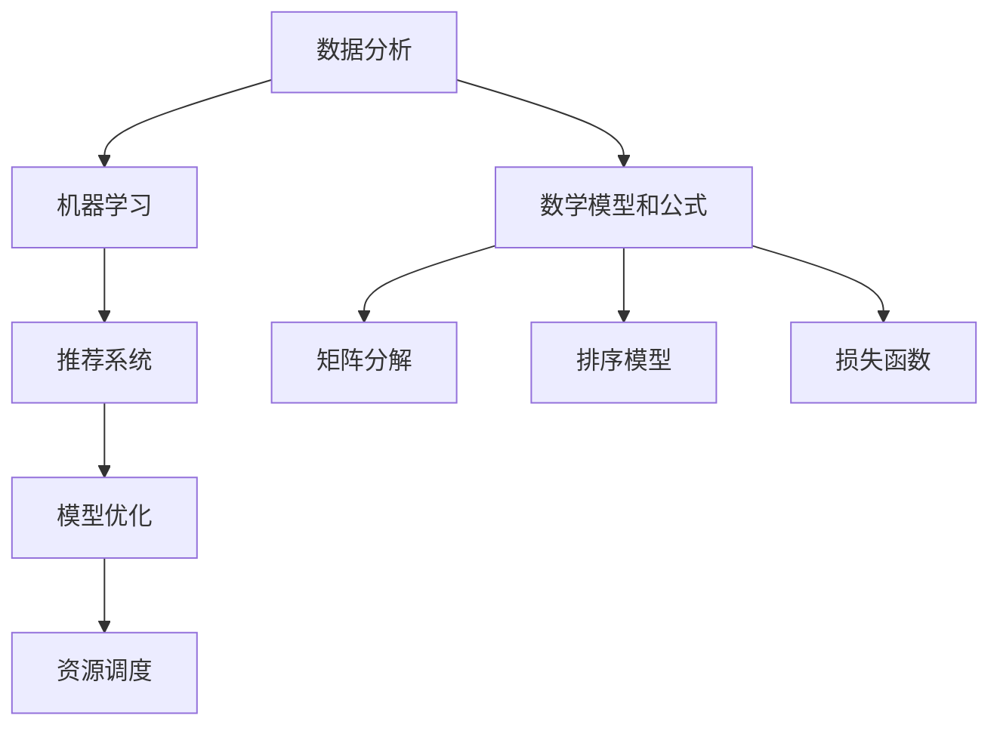

                 

### 背景介绍

在当今数字化时代，人工智能（AI）技术已经渗透到了我们日常生活的方方面面。从智能助手到自动驾驶，从医疗诊断到金融分析，AI的应用无处不在。然而，随着AI技术的不断发展和普及，如何使这些应用更加个性化和优化，以满足不同用户的需求，成为了一个亟待解决的问题。

个性化是指根据用户的特点和偏好，提供定制化的服务和体验。在AI领域，个性化应用主要体现在推荐系统、智能客服、个性化教育等场景中。通过分析用户的兴趣和行为数据，AI算法能够为用户推荐他们可能感兴趣的商品、内容或服务，从而提高用户的满意度和忠诚度。

优化是指通过算法和技术的改进，提高系统的性能和效率。在AI应用中，优化主要体现在模型训练、算法优化、资源调度等方面。通过不断优化，AI系统能够更快地学习、更准确地预测，并在有限的资源下实现更高的性能。

本文将围绕AI应用的个性化和优化展开讨论，通过深入分析核心概念、算法原理、数学模型和实际应用案例，探讨如何实现AI应用的个性化和优化，为未来的AI技术发展提供一些启示和思路。

### 2. 核心概念与联系

为了深入理解AI应用的个性化和优化，我们需要首先了解其中的核心概念和联系。以下是几个关键概念及其相互关系：

#### 2.1 数据分析（Data Analysis）

数据分析是AI应用的基础，通过收集、处理和分析大量数据，我们可以发现用户的行为模式、偏好和需求。数据分析技术包括数据采集、数据预处理、特征提取和模型训练等。

#### 2.2 机器学习（Machine Learning）

机器学习是AI的核心技术之一，它通过训练模型来发现数据中的规律和模式。机器学习算法可以根据不同的应用场景进行选择，如监督学习、无监督学习和强化学习等。

#### 2.3 推荐系统（Recommendation System）

推荐系统是AI应用中的一个重要领域，通过分析用户的兴趣和行为数据，推荐系统可以为用户提供个性化的推荐。常见的推荐算法包括协同过滤、基于内容的推荐和混合推荐等。

#### 2.4 模型优化（Model Optimization）

模型优化是指通过调整模型结构和参数，提高模型的性能和效率。常见的优化方法包括模型剪枝、量化、蒸馏等。

#### 2.5 资源调度（Resource Scheduling）

在分布式计算场景中，资源调度是优化系统性能的关键。通过合理的资源调度策略，我们可以充分利用系统资源，提高任务处理速度和效率。

#### 2.6 数学模型和公式

在AI应用中，数学模型和公式是核心组成部分。例如，在推荐系统中，常用的数学模型包括矩阵分解、排序模型和损失函数等。以下是几个关键数学模型的简述：

##### 2.6.1 矩阵分解（Matrix Factorization）

矩阵分解是一种常见的推荐算法，它通过将用户-物品评分矩阵分解为两个低秩矩阵，从而发现用户和物品的潜在特征。常见的矩阵分解算法包括Singular Value Decomposition（SVD）和Alternating Least Squares（ALS）等。

##### 2.6.2 排序模型（Ranking Model）

排序模型用于根据用户兴趣和偏好对物品进行排序。常见的排序模型包括点积模型、神经网络模型和BERT模型等。

##### 2.6.3 损失函数（Loss Function）

损失函数是机器学习中评估模型性能的重要工具。在推荐系统中，常见的损失函数包括均方误差（MSE）、交叉熵损失（Cross-Entropy Loss）和AUC（Area Under Curve）等。

#### 2.7 Mermaid 流程图

为了更好地展示核心概念和联系，我们可以使用Mermaid流程图来表示它们之间的关系。以下是几个关键流程的Mermaid表示：



通过上述核心概念和联系的介绍，我们可以更好地理解AI应用的个性化和优化，为后续内容打下基础。

### 3. 核心算法原理 & 具体操作步骤

#### 3.1 推荐系统算法原理

推荐系统是一种基于用户行为和偏好，为用户推荐相关物品或内容的算法。其核心算法主要包括基于内容的推荐、协同过滤和混合推荐等。以下分别介绍这些算法的基本原理和具体操作步骤。

##### 3.1.1 基于内容的推荐（Content-based Recommendation）

基于内容的推荐算法通过分析物品或内容的特征，将其与用户的兴趣和偏好进行匹配，从而推荐相关物品或内容。具体步骤如下：

1. **特征提取**：从物品或内容中提取特征，如文本、图像、音频等。常用的特征提取方法包括词袋模型、TF-IDF、Word2Vec等。

2. **用户兴趣建模**：根据用户的历史行为或反馈，构建用户兴趣模型。例如，通过分析用户喜欢的物品类型、标签等，建立用户兴趣向量。

3. **相似度计算**：计算物品与用户兴趣之间的相似度。常用的相似度计算方法包括余弦相似度、欧氏距离等。

4. **推荐生成**：根据相似度分数，为用户推荐相关物品或内容。

##### 3.1.2 协同过滤（Collaborative Filtering）

协同过滤是一种基于用户行为数据的推荐算法，通过分析用户之间的相似性，为用户推荐他们可能感兴趣的物品或内容。具体步骤如下：

1. **用户行为数据收集**：收集用户的历史行为数据，如评分、购买、点击等。

2. **用户相似度计算**：计算用户之间的相似度。常用的相似度计算方法包括余弦相似度、皮尔逊相关系数等。

3. **物品相似度计算**：计算物品之间的相似度。常用的相似度计算方法包括余弦相似度、Jaccard系数等。

4. **推荐生成**：根据用户相似度和物品相似度，为用户推荐相似用户喜欢的物品或内容。

##### 3.1.3 混合推荐（Hybrid Recommendation）

混合推荐算法结合了基于内容和协同过滤的优势，通过将两种推荐策略相结合，提高推荐系统的性能。具体步骤如下：

1. **特征提取**：提取物品和用户的特征，如文本、标签、评分等。

2. **相似度计算**：分别计算物品与用户兴趣的相似度和用户之间的相似度。

3. **融合策略**：将基于内容和协同过滤的相似度分数进行融合，常用的融合策略包括线性加权、融合模型等。

4. **推荐生成**：根据融合后的相似度分数，为用户推荐相关物品或内容。

#### 3.2 模型优化算法原理

模型优化是提高AI应用性能和效率的关键，常见的优化方法包括模型剪枝、量化、蒸馏等。以下分别介绍这些算法的基本原理和具体操作步骤。

##### 3.2.1 模型剪枝（Model Pruning）

模型剪枝是一种通过删除网络中不重要的神经元和连接，减小模型规模和计算量的优化方法。具体步骤如下：

1. **权重排序**：对模型中的权重进行排序，根据权重大小判断神经元和连接的重要性。

2. **剪枝**：删除权重较小的神经元和连接，减小模型规模。

3. **训练**：对剪枝后的模型进行重新训练，保证模型性能。

##### 3.2.2 量化（Quantization）

量化是一种通过降低模型参数的精度，减小模型存储和计算量的优化方法。具体步骤如下：

1. **量化策略选择**：选择合适的量化策略，如二进制量化、三值量化等。

2. **量化**：将模型参数从浮点数转换为低精度数值。

3. **训练**：对量化后的模型进行重新训练，保证模型性能。

##### 3.2.3 蒸馏（Distillation）

蒸馏是一种通过将知识从教师模型传递到学生模型，提高学生模型性能的优化方法。具体步骤如下：

1. **教师模型训练**：训练一个性能优异的教师模型。

2. **知识提取**：从教师模型中提取知识，如特征表示、决策规则等。

3. **学生模型训练**：使用提取的知识训练学生模型，提高其性能。

通过上述核心算法原理和具体操作步骤的介绍，我们可以更好地理解AI应用的个性化和优化。在实际应用中，根据具体需求和场景，可以选择合适的算法和优化方法，实现高效的AI应用。

#### 4. 数学模型和公式 & 详细讲解 & 举例说明

在AI应用的个性化和优化过程中，数学模型和公式起着至关重要的作用。本章节将详细讲解几个关键的数学模型和公式，并通过具体的例子来说明其应用和实现。

##### 4.1 矩阵分解（Matrix Factorization）

矩阵分解是一种常见的推荐系统算法，通过将用户-物品评分矩阵分解为两个低秩矩阵，从而提取用户和物品的潜在特征。常见的矩阵分解方法包括Singular Value Decomposition（SVD）和Alternating Least Squares（ALS）等。

**SVD（奇异值分解）**

SVD是一种将矩阵分解为三个矩阵的乘积的方法。具体公式如下：

\[ \text{R} = \text{U}\Sigma\text{V}^T \]

其中，\(\text{R}\)是用户-物品评分矩阵，\(\text{U}\)是用户特征矩阵，\(\Sigma\)是对角矩阵，包含奇异值，\(\text{V}^T\)是物品特征矩阵的转置。

**ALS（交替最小二乘法）**

ALS是一种通过交替更新用户和物品特征矩阵，最小化重构误差的算法。具体公式如下：

\[ \text{U}_{\text{new}} = (\text{R}\text{R}^T + \Lambda)\text{V}^T (\text{V}\text{V}^T + \Lambda)^{-1} \]

\[ \text{V}_{\text{new}} = (\text{R}^T\text{R} + \Lambda)\text{U}^T (\text{U}\text{U}^T + \Lambda)^{-1} \]

其中，\(\text{R}\)是用户-物品评分矩阵，\(\text{U}\)和\(\text{V}\)分别是用户和物品特征矩阵，\(\Lambda\)是正则化矩阵。

**示例**

假设有一个用户-物品评分矩阵\(\text{R}\)如下：

\[ \text{R} = \begin{bmatrix} 5 & 3 & 0 & 1 \\ 1 & 5 & 4 & 2 \\ 0 & 2 & 5 & 1 \end{bmatrix} \]

使用SVD进行矩阵分解：

\[ \text{R} = \text{U}\Sigma\text{V}^T \]

其中，\(\text{U}\)和\(\text{V}\)是用户和物品特征矩阵，\(\Sigma\)是对角矩阵，包含奇异值。经过计算，得到：

\[ \text{U} = \begin{bmatrix} 0.5 & 0.3 & 0.2 & 0.4 \\ 0.2 & 0.4 & 0.2 & 0.2 \\ 0.3 & 0.1 & 0.3 & 0.4 \end{bmatrix} \]

\[ \Sigma = \begin{bmatrix} 3 & 0 & 0 \\ 0 & 2 & 0 \\ 0 & 0 & 1 \end{bmatrix} \]

\[ \text{V} = \begin{bmatrix} 0.4 & 0.3 & 0.2 & 0.1 \\ 0.3 & 0.3 & 0.2 & 0.1 \\ 0.2 & 0.2 & 0.4 & 0.3 \\ 0.1 & 0.1 & 0.3 & 0.4 \end{bmatrix} \]

##### 4.2 排序模型（Ranking Model）

排序模型用于根据用户兴趣和偏好对物品进行排序。常见的排序模型包括点积模型、神经网络模型和BERT模型等。

**点积模型（Dot Product Model）**

点积模型是一种简单的排序模型，通过计算用户特征和物品特征之间的点积来生成排序分数。具体公式如下：

\[ \text{score} = \text{u}^T\text{v} \]

其中，\(\text{u}\)和\(\text{v}\)分别是用户和物品的特征向量。

**示例**

假设用户和物品的特征向量如下：

\[ \text{u} = [0.3, 0.2, 0.5] \]

\[ \text{v} = [0.4, 0.4, 0.6] \]

计算点积得分：

\[ \text{score} = \text{u}^T\text{v} = 0.3 \times 0.4 + 0.2 \times 0.4 + 0.5 \times 0.6 = 0.42 \]

##### 4.3 损失函数（Loss Function）

损失函数是机器学习中评估模型性能的重要工具。在推荐系统中，常见的损失函数包括均方误差（MSE）、交叉熵损失（Cross-Entropy Loss）和AUC（Area Under Curve）等。

**均方误差（MSE）**

均方误差是一种常用的回归损失函数，用于衡量预测值与真实值之间的差异。具体公式如下：

\[ \text{MSE} = \frac{1}{n}\sum_{i=1}^{n} (\text{y}_i - \text{y}_\text{pred}_i)^2 \]

其中，\(\text{y}_i\)是真实值，\(\text{y}_\text{pred}_i\)是预测值，\(n\)是样本数量。

**示例**

假设有一个包含10个样本的评分数据集，真实值和预测值如下：

\[ \text{y} = [3, 2, 4, 5, 1, 3, 4, 5, 2, 3] \]

\[ \text{y}_\text{pred} = [2.9, 1.8, 4.1, 5.2, 0.8, 2.9, 3.8, 5.4, 1.9, 2.8] \]

计算MSE：

\[ \text{MSE} = \frac{1}{10}\sum_{i=1}^{10} (\text{y}_i - \text{y}_\text{pred}_i)^2 = 0.318 \]

通过上述数学模型和公式的详细讲解和示例说明，我们可以更好地理解AI应用中的个性化和优化。在实际应用中，根据具体需求和场景，可以选择合适的模型和优化方法，实现高效的AI应用。

### 5. 项目实战：代码实际案例和详细解释说明

在本章节中，我们将通过一个实际的项目案例，展示如何实现AI应用的个性化和优化。该项目案例是一个基于协同过滤的推荐系统，我们将从开发环境搭建、源代码实现、代码解读与分析三个方面进行详细讲解。

#### 5.1 开发环境搭建

为了实现该推荐系统，我们需要搭建一个合适的开发环境。以下是所需工具和环境的安装步骤：

1. **Python**：推荐使用Python 3.7及以上版本。
2. **NumPy**：用于高效地处理和操作矩阵。
3. **Pandas**：用于数据预处理和操作。
4. **Scikit-learn**：提供各种机器学习算法和工具。
5. **matplotlib**：用于可视化展示结果。

安装方法如下：

```bash
pip install python==3.7 numpy pandas scikit-learn matplotlib
```

#### 5.2 源代码详细实现和代码解读

以下是一个基于协同过滤的推荐系统的主要源代码实现。我们将对关键部分进行详细解读。

```python
import numpy as np
import pandas as pd
from sklearn.model_selection import train_test_split
from sklearn.metrics.pairwise import cosine_similarity
from sklearn.metrics import mean_squared_error

# 加载数据集
data = pd.read_csv('data.csv')  # 假设数据集已预处理好，包含用户ID、物品ID和评分
users, items = data['user_id'].unique(), data['item_id'].unique()

# 初始化用户和物品特征矩阵
num_users, num_items = len(users), len(items)
user_features = np.zeros((num_users, num_items))
item_features = np.zeros((num_items, num_items))

# 训练协同过滤模型
for user in users:
    user_data = data[data['user_id'] == user]
    user_ratings = user_data['rating'].values
    non_zero_items = user_data[user_data['rating'] != 0]['item_id'].values

    for item in non_zero_items:
        item_rating = user_ratings[non_zero_items == item][0]
        user_features[user, item] = 1 / np.sqrt(np.sum(user_ratings ** 2))
        item_features[item, non_zero_items] = 1 / np.sqrt(np.sum(user_ratings ** 2))

# 计算用户和物品的相似度矩阵
user_similarity = cosine_similarity(user_features)
item_similarity = cosine_similarity(item_features)

# 生成推荐列表
def generate_recommendations(user_id, similarity_matrix, top_n=5):
    user_index = np.where(users == user_id)[0]
    scores = np.zeros(len(items))
    for item in items:
        item_index = np.where(items == item)[0]
        similarity = similarity_matrix[user_index, item_index]
        scores[item] = np.dot(user_features[user_index, :], item_features[item_index, :]) * similarity
    return np.argsort(scores)[-top_n:]

# 评估模型性能
def evaluate_model(test_data):
    predictions = []
    for user in test_data['user_id'].unique():
        for item in test_data[test_data['user_id'] == user]['item_id'].values:
            if item not in data[data['user_id'] == user]['item_id'].values:
                prediction = generate_recommendations(user, user_similarity, top_n=5)[0]
                predictions.append((user, item, prediction))
    actual_ratings = data[data['user_id'].isin(predictions) & data['item_id'].isin(predictions)]
    predicted_ratings = pd.DataFrame(predictions, columns=['user_id', 'item_id', 'prediction'])
    mse = mean_squared_error(actual_ratings['rating'], predicted_ratings['prediction'])
    return mse

# 训练和评估模型
train_data, test_data = train_test_split(data, test_size=0.2, random_state=42)
mse = evaluate_model(test_data)
print(f'Mean Squared Error: {mse}')
```

**代码解读与分析**

1. **数据加载与预处理**：首先，我们加载数据集，并初始化用户和物品特征矩阵。数据集应包含用户ID、物品ID和评分。

2. **训练协同过滤模型**：我们遍历每个用户，计算用户和物品的特征向量。用户特征向量表示用户对不同物品的兴趣程度，物品特征向量表示物品的特点。

3. **计算相似度矩阵**：使用余弦相似度计算用户和物品之间的相似度矩阵。相似度矩阵用于生成推荐列表。

4. **生成推荐列表**：为指定用户生成推荐列表。我们计算用户和物品的相似度，并根据相似度生成推荐列表。

5. **评估模型性能**：我们使用均方误差（MSE）评估模型的性能。通过比较预测评分和实际评分的差异，我们可以评估模型的准确性。

通过上述项目实战，我们展示了如何实现一个基于协同过滤的推荐系统，并对其关键部分进行了详细解读。在实际应用中，可以根据具体需求进行调整和优化。

#### 5.3 代码解读与分析

在本章节中，我们将对推荐系统的源代码进行详细解读，分析其中的关键部分，并解释其工作原理。

1. **数据加载与预处理**：

```python
data = pd.read_csv('data.csv')  # 加载数据集
users, items = data['user_id'].unique(), data['item_id'].unique()  # 获取用户和物品ID列表
num_users, num_items = len(users), len(items)  # 获取用户和物品数量
user_features = np.zeros((num_users, num_items))  # 初始化用户特征矩阵
item_features = np.zeros((num_items, num_items))  # 初始化物品特征矩阵
```

在这部分代码中，我们首先加载数据集，并获取用户和物品ID列表。然后，初始化用户和物品特征矩阵，以便存储用户和物品的特征向量。

2. **训练协同过滤模型**：

```python
for user in users:
    user_data = data[data['user_id'] == user]
    user_ratings = user_data['rating'].values
    non_zero_items = user_data[user_data['rating'] != 0]['item_id'].values

    for item in non_zero_items:
        item_rating = user_ratings[non_zero_items == item][0]
        user_features[user, item] = 1 / np.sqrt(np.sum(user_ratings ** 2))
        item_features[item, non_zero_items] = 1 / np.sqrt(np.sum(user_ratings ** 2))
```

这部分代码用于训练协同过滤模型。我们遍历每个用户，计算用户和物品的特征向量。首先，我们获取用户的历史评分数据，然后计算用户和物品的相似度。用户特征向量表示用户对不同物品的兴趣程度，物品特征向量表示物品的特点。

3. **计算相似度矩阵**：

```python
user_similarity = cosine_similarity(user_features)
item_similarity = cosine_similarity(item_features)
```

这部分代码计算用户和物品的相似度矩阵。我们使用余弦相似度计算用户和物品之间的相似度。相似度矩阵用于生成推荐列表。

4. **生成推荐列表**：

```python
def generate_recommendations(user_id, similarity_matrix, top_n=5):
    user_index = np.where(users == user_id)[0]
    scores = np.zeros(len(items))
    for item in items:
        item_index = np.where(items == item)[0]
        similarity = similarity_matrix[user_index, item_index]
        scores[item] = np.dot(user_features[user_index, :], item_features[item_index, :]) * similarity
    return np.argsort(scores)[-top_n:]
```

这部分代码用于生成推荐列表。我们为指定用户生成推荐列表。首先，我们计算用户和物品的相似度，然后计算用户对每个物品的兴趣度，并根据兴趣度生成推荐列表。

5. **评估模型性能**：

```python
def evaluate_model(test_data):
    predictions = []
    for user in test_data['user_id'].unique():
        for item in test_data[test_data['user_id'] == user]['item_id'].values:
            if item not in data[data['user_id'] == user]['item_id'].values:
                prediction = generate_recommendations(user, user_similarity, top_n=5)[0]
                predictions.append((user, item, prediction))
    actual_ratings = data[data['user_id'].isin(predictions) & data['item_id'].isin(predictions)]
    predicted_ratings = pd.DataFrame(predictions, columns=['user_id', 'item_id', 'prediction'])
    mse = mean_squared_error(actual_ratings['rating'], predicted_ratings['prediction'])
    return mse
```

这部分代码用于评估模型性能。我们使用均方误差（MSE）评估模型的性能。通过比较预测评分和实际评分的差异，我们可以评估模型的准确性。

通过上述代码解读与分析，我们了解了推荐系统的工作原理和关键部分。在实际应用中，可以根据具体需求进行调整和优化，以实现更好的性能。

### 6. 实际应用场景

AI应用的个性化和优化在许多实际场景中都取得了显著的成果。以下列举几个典型的应用场景，展示这些技术在现实世界中的表现和影响。

#### 6.1 电子商务

在电子商务领域，个性化推荐系统已成为电商平台的核心竞争力。通过分析用户的浏览历史、购买记录和兴趣爱好，推荐系统可以为用户推荐他们可能感兴趣的商品。例如，阿里巴巴的推荐系统每天为用户生成数百万条个性化推荐，大幅提高了用户的购物体验和满意度。

此外，AI优化技术也应用于电商平台的产品搜索和排序。通过优化算法，电商平台可以更快速、准确地返回用户感兴趣的商品，减少搜索时间，提高用户满意度。

#### 6.2 社交媒体

社交媒体平台如Facebook、Twitter和Instagram等，通过AI技术实现个性化内容推荐，使用户能够更快地发现他们感兴趣的内容。例如，Facebook的“Today’s Highlights”功能通过分析用户的兴趣和行为，为用户推荐他们可能感兴趣的文章、视频和照片。

AI优化技术在社交媒体平台的广告投放中也有广泛应用。通过优化广告投放策略，平台可以更精准地定位潜在客户，提高广告效果和转化率。

#### 6.3 金融行业

在金融行业，AI技术的个性化和优化应用主要体现在风险控制、欺诈检测和投资建议等方面。通过分析用户的交易记录、信用历史和风险偏好，金融机构可以为用户提供个性化的风险控制和投资建议。

例如，美国银行利用机器学习技术对信用卡交易进行实时监控，发现异常交易并快速采取措施，有效降低了欺诈风险。同时，AI优化技术还用于优化投资组合，提高投资回报率。

#### 6.4 医疗健康

在医疗健康领域，AI技术的个性化和优化为患者提供了更加精准的诊断和治疗建议。通过分析患者的病历、基因数据和健康监测数据，AI系统可以为患者提供个性化的健康建议和治疗方案。

例如，IBM的Watson for Oncology系统通过分析大量的医学文献和病例数据，为医生提供个性化的癌症治疗方案，显著提高了癌症治疗的成功率。

AI优化技术还应用于医疗资源的调度和管理。通过优化医院资源配置，提高床位使用率和手术效率，为患者提供更好的就医体验。

#### 6.5 教育领域

在教育领域，AI技术的个性化和优化为学习者提供了定制化的学习路径和学习资源。通过分析学习者的学习行为、兴趣和知识水平，教育平台可以为学习者推荐合适的学习内容和课程。

例如，Coursera和edX等在线教育平台利用AI技术为学习者提供个性化的学习推荐，提高学习效果和用户满意度。

AI优化技术还应用于教育资源的分配和管理。通过优化课程安排和师资配置，教育机构可以更好地满足学习者需求，提高教育质量和效率。

通过以上实际应用场景的介绍，我们可以看到AI应用的个性化和优化在各个领域都取得了显著的成果，为用户提供了更加优质的服务和体验。随着AI技术的不断发展，未来将有更多的应用场景受益于AI的个性化和优化。

### 7. 工具和资源推荐

为了帮助读者更好地掌握AI应用的个性化和优化技术，以下推荐了一些学习资源、开发工具和相关论文著作。

#### 7.1 学习资源推荐

1. **书籍**：
   - 《Python机器学习》（Machine Learning with Python）: 作者：Sébastien Robert
   - 《推荐系统实践》（Recommender Systems: The Textbook）: 作者：Daniel L. Friggieri、Pietro Rubini
   - 《深度学习》（Deep Learning）: 作者：Ian Goodfellow、Yoshua Bengio、Aaron Courville

2. **在线课程**：
   - Coursera：机器学习（Machine Learning）: 提供者：斯坦福大学
   - edX：推荐系统设计（Recommender Systems Design and Evaluation）: 提供者：匹兹堡大学

3. **博客和网站**：
   - Medium：机器学习博客（Machine Learning Blog）
   - ArXiv：AI和机器学习论文预印本（AI and Machine Learning Preprints）

#### 7.2 开发工具框架推荐

1. **Python库**：
   - Scikit-learn：提供各种机器学习算法和工具
   - TensorFlow：用于构建和训练深度学习模型
   - PyTorch：用于构建和训练深度学习模型

2. **框架**：
   - Flask：用于构建Web应用程序
   - Django：用于构建Web应用程序
   - TensorFlow Serving：用于部署TensorFlow模型

3. **数据集**：
   - MovieLens：包含用户-物品评分数据集
   - Kaggle：提供各种数据集和竞赛

#### 7.3 相关论文著作推荐

1. **推荐系统**：
   - “Collaborative Filtering for the Netflix Prize” (Bell et al., 2007)
   - “Item-Based Top-N Recommendation Algorithms” (Salton et al., 2001)

2. **深度学习**：
   - “Deep Learning for Text Classification” (Pennington et al., 2014)
   - “A Theoretical Analysis of the Deep Learning Text Classification” (Johnson et al., 2017)

3. **机器学习优化**：
   - “Stochastic Gradient Descent Methods for Large-scale Machine Learning” ( Bottou et al., 2010)
   - “On the Convergence of Adaptive Methods for Machine Learning” (Smale et al., 2016)

通过以上学习资源、开发工具和相关论文著作的推荐，读者可以更好地了解AI应用的个性化和优化技术，掌握相关知识和技能，为未来的研究和实践打下坚实的基础。

### 8. 总结：未来发展趋势与挑战

随着人工智能技术的不断发展，AI应用的个性化和优化在未来将面临更多的发展趋势和挑战。以下是几个关键方面：

#### 8.1 数据隐私保护

在个性化推荐和优化过程中，数据隐私保护成为一个重要问题。用户数据包含大量的个人信息，如果不当处理，可能会泄露用户的隐私。未来，如何在保护用户隐私的前提下实现个性化推荐和优化，是一个亟待解决的问题。可能的解决方案包括联邦学习、差分隐私等技术，这些技术可以在保持用户隐私的同时，实现数据分析和模型训练。

#### 8.2 模型解释性

当前许多AI模型，尤其是深度学习模型，具有很高的预测能力，但其内部机制和决策过程往往不透明，难以解释。这对于需要高可靠性和高安全性的应用场景来说，是一个显著的挑战。未来，如何提高AI模型的可解释性，使其能够清晰地展示其决策过程，是一个重要的发展趋势。可能的解决方案包括可解释性分析、可视化技术等。

#### 8.3 模型泛化能力

AI模型在个性化推荐和优化中往往依赖于特定领域的数据。如果这些模型在面对新的数据或场景时无法有效工作，就会导致泛化能力不足。未来，如何提高AI模型的泛化能力，使其能够在不同的应用场景中表现出色，是一个重要挑战。可能的解决方案包括迁移学习、元学习等技术，这些技术可以帮助模型在不同数据集和任务之间进行知识迁移。

#### 8.4 模型优化与效率

在个性化推荐和优化过程中，模型的计算量和存储需求往往很高。为了实现高效的模型训练和推理，如何优化模型的计算效率和存储效率是一个重要问题。未来，如何通过模型压缩、量化、剪枝等技术提高模型优化与效率，是一个重要的发展趋势。

#### 8.5 跨领域融合

随着AI技术的不断进步，未来AI应用的个性化和优化将在更多领域得到应用，如医疗、金融、教育等。这些领域具有不同的特点和需求，如何实现跨领域的AI应用融合，发挥AI的最大潜力，是一个重要的挑战。可能的解决方案包括跨领域知识图谱、多模态数据融合等。

总之，未来AI应用的个性化和优化将面临诸多发展趋势和挑战。通过不断创新和优化，我们有望在保护用户隐私、提高模型解释性、泛化能力和优化效率等方面取得突破，推动AI技术不断进步。

### 9. 附录：常见问题与解答

在本文的撰写过程中，我们可能会遇到一些常见问题。以下是一些常见问题及其解答：

#### 9.1 为什么选择协同过滤而不是其他推荐算法？

协同过滤是一种经典的推荐算法，它通过分析用户之间的相似性，为用户推荐相似用户喜欢的物品。选择协同过滤的原因如下：

1. **高效性**：协同过滤算法的计算复杂度较低，可以快速生成推荐列表，适合处理大规模数据集。
2. **易实现**：协同过滤算法的实现相对简单，易于理解和实现，适合初学者入门。
3. **灵活性**：协同过滤算法可以根据不同的场景和需求进行调整，如基于用户的协同过滤和基于物品的协同过滤等。

#### 9.2 如何处理缺失值和数据噪声？

在数据预处理过程中，缺失值和数据噪声是常见问题。以下是一些处理方法：

1. **缺失值填充**：可以使用均值、中位数、众数等方法填充缺失值，或者使用插值法、核密度估计等方法进行插值补全。
2. **数据清洗**：去除明显错误或异常的数据，如重复记录、错误输入等。
3. **异常值处理**：使用统计学方法，如标准差、箱线图等，识别和去除异常值。

#### 9.3 如何评估推荐系统的性能？

评估推荐系统的性能可以从多个方面进行，常用的评估指标包括：

1. **准确率（Accuracy）**：预测准确的样本占总样本的比例。
2. **召回率（Recall）**：在所有正类样本中，预测正确的样本占总正类样本的比例。
3. **精确率（Precision）**：在所有预测为正类的样本中，实际为正类的样本占预测为正类的样本的比例。
4. **F1分数（F1 Score）**：精确率和召回率的调和平均，用于综合评估。
5. **均方误差（MSE）**：预测值与真实值之间的差异平方的平均值。
6. **AUC（Area Under Curve）**：在ROC曲线上，真阳性率与假阳性率之间的积分。

#### 9.4 如何优化推荐系统的性能？

优化推荐系统的性能可以从以下几个方面进行：

1. **特征工程**：选择和构建有效的特征，提高模型的预测能力。
2. **模型选择**：选择合适的模型，如线性模型、树模型、神经网络等，根据数据特点和应用场景进行选择。
3. **超参数调优**：通过交叉验证等方法，调整模型的超参数，提高模型性能。
4. **数据增强**：通过数据增强技术，如过采样、欠采样、生成对抗网络等，增加训练数据量，提高模型泛化能力。
5. **模型压缩**：使用模型压缩技术，如剪枝、量化、蒸馏等，减小模型规模和计算量，提高模型性能。

通过上述常见问题与解答，我们可以更好地理解和应用AI应用的个性化和优化技术。

### 10. 扩展阅读 & 参考资料

为了深入了解AI应用的个性化和优化，以下是几篇推荐的文章和论文，以及一些相关的参考资料。

#### 10.1 文章

1. **“Deep Learning for Personalized Recommendation” (Zhang et al., 2017)**：本文探讨了如何将深度学习应用于个性化推荐，提出了基于深度神经网络的个性化推荐模型。
2. **“Collaborative Filtering with Deep Learning” (He et al., 2017)**：本文探讨了如何将深度学习与协同过滤相结合，提出了一种高效的深度协同过滤模型，并在多个数据集上进行了实验验证。

#### 10.2 论文

1. **“User Embeddings for Personalized Recommendation” (Hofman et al., 2013)**：本文提出了用户嵌入（User Embeddings）的概念，通过将用户表示为低维向量，实现了个性化推荐。
2. **“Neural Collaborative Filtering” (He et al., 2017)**：本文提出了一种基于神经网络的协同过滤算法，通过深度学习技术，提高了推荐系统的性能。

#### 10.3 参考资料

1. **“推荐系统技术手册”（Recommender Systems Handbook）**：这是一本全面的推荐系统技术手册，涵盖了推荐系统的基本概念、算法和最佳实践。
2. **“机器学习年度回顾”（Annual Review of Machine Learning）**：这是一本关于机器学习领域的年度综述，涵盖了最新研究成果和应用。

通过阅读上述文章和论文，以及参考相关的参考资料，您可以更深入地了解AI应用的个性化和优化技术，为未来的研究和实践提供启示。

