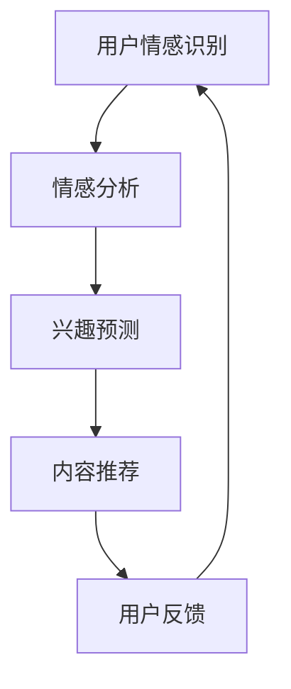

                 

# AI情感驱动推荐系统的优势案例

> **关键词：** 情感计算，推荐系统，个性化推荐，用户体验，情感分析，机器学习。

> **摘要：** 本文将探讨AI情感驱动推荐系统的优势，包括其如何通过情感分析提高个性化推荐的准确性和用户体验，以及实际应用案例和未来发展趋势。

## 1. 背景介绍

在互联网时代，推荐系统已经成为电商平台、社交媒体和内容平台等的重要组成部分。传统的推荐系统主要基于用户的历史行为数据和商品或内容的特征，如浏览、购买、评分等，通过算法计算用户和商品之间的相似度来实现推荐。然而，随着用户需求的日益多样化和个性化，传统的推荐系统逐渐暴露出一些局限性。

情感驱动推荐系统作为一种新兴的推荐方法，通过分析用户的情感状态来提高推荐的准确性。情感分析技术可以捕捉用户的情感变化，如正面情感、负面情感或中性情感，从而更准确地预测用户的兴趣和需求。

## 2. 核心概念与联系

### 2.1 情感计算

情感计算是指通过计算机技术和人工智能算法来识别、理解和模拟人类的情感状态。情感计算主要包括情感识别、情感理解和情感模拟三个层次。

- **情感识别**：通过自然语言处理技术，从文本、语音、图像等多媒体数据中识别用户的情感状态。
- **情感理解**：对识别出的情感进行分析和推理，理解情感的含义和原因。
- **情感模拟**：根据用户情感状态生成相应的反馈，如文字、语音或视觉信号。

### 2.2 推荐系统

推荐系统是一种信息过滤技术，旨在根据用户的兴趣和需求，从大量的信息中推荐用户可能感兴趣的内容。推荐系统主要分为基于内容的推荐和基于协同过滤的推荐。

- **基于内容的推荐**：根据用户的历史行为数据和内容特征，推荐与用户历史偏好相似的内容。
- **基于协同过滤的推荐**：通过分析用户之间的相似度，推荐用户可能感兴趣的内容。

### 2.3 情感驱动推荐系统

情感驱动推荐系统结合了情感计算和推荐系统的优势，通过情感分析技术捕捉用户的情感状态，从而实现更精准的个性化推荐。

### 2.4 Mermaid 流程图

以下是情感驱动推荐系统的基本架构和流程：



## 3. 核心算法原理 & 具体操作步骤

### 3.1 情感识别

情感识别是情感驱动推荐系统的第一步，主要通过自然语言处理技术，从用户的文本评论、评论声音、评论图像等多媒体数据中识别情感。

具体步骤如下：

1. **数据预处理**：对用户生成的文本、语音和图像进行预处理，包括分词、去停用词、词性标注等。
2. **情感分类器训练**：使用大量标注好的情感数据集训练情感分类器，常用的情感分类器有朴素贝叶斯、支持向量机、深度神经网络等。
3. **情感识别**：对用户的文本、语音和图像进行情感识别，输出情感标签。

### 3.2 情感分析

情感分析是对识别出的情感进行深入分析，以理解情感的内涵和原因。

具体步骤如下：

1. **情感极性分析**：判断情感的极性，如正面、负面或中性。
2. **情感强度分析**：分析情感的程度，如非常高兴、有点高兴、中性、有点不高兴、非常不高兴等。
3. **情感因果关系分析**：分析情感产生的原因，如产品的质量、服务的态度等。

### 3.3 兴趣预测

基于情感分析的结果，预测用户的兴趣和需求。

具体步骤如下：

1. **情感与兴趣映射**：建立情感和兴趣之间的映射关系，如正面情感对应娱乐、美食等。
2. **兴趣预测模型**：使用机器学习算法，如决策树、随机森林、神经网络等，预测用户的兴趣。
3. **兴趣预测**：根据预测模型，输出用户的兴趣标签。

### 3.4 内容推荐

根据用户的兴趣标签，推荐符合用户兴趣的内容。

具体步骤如下：

1. **内容特征提取**：提取内容的特征，如文本特征、图像特征、视频特征等。
2. **内容推荐算法**：使用基于内容的推荐算法，如KNN、TF-IDF等，推荐符合用户兴趣的内容。
3. **内容推荐**：根据推荐算法，输出推荐内容。

## 4. 数学模型和公式 & 详细讲解 & 举例说明

### 4.1 情感分类器

情感分类器通常使用机器学习算法训练，其中朴素贝叶斯和支持向量机是最常用的两种算法。

#### 4.1.1 朴素贝叶斯

朴素贝叶斯是一种基于概率的算法，其公式如下：

$$
P(\text{情感}|\text{特征}) = \frac{P(\text{特征}|\text{情感})P(\text{情感})}{P(\text{特征})}
$$

其中，$P(\text{情感}|\text{特征})$表示特征出现时情感的概率，$P(\text{特征}|\text{情感})$表示特征出现时情感的概率，$P(\text{情感})$表示情感的概率，$P(\text{特征})$表示特征出现的概率。

#### 4.1.2 支持向量机

支持向量机是一种基于最大间隔的分类算法，其公式如下：

$$
\max\ \min_{\beta,\beta^*} W^T W
$$

其中，$W$表示权重向量，$\beta$表示偏置，$\beta^*$表示拉格朗日乘子。

### 4.2 兴趣预测模型

兴趣预测模型通常使用回归算法训练，如线性回归、决策树、随机森林等。

#### 4.2.1 线性回归

线性回归是一种基于线性关系的预测模型，其公式如下：

$$
y = \beta_0 + \beta_1 x
$$

其中，$y$表示预测值，$x$表示特征值，$\beta_0$表示截距，$\beta_1$表示斜率。

#### 4.2.2 决策树

决策树是一种基于树的预测模型，其公式如下：

$$
y = g(x) = \sum_{i=1}^{n} \alpha_i \prod_{j=1}^{m} h_j(x_j)
$$

其中，$y$表示预测值，$x$表示特征值，$g(x)$表示决策树函数，$\alpha_i$表示节点权重，$h_j(x_j)$表示节点函数。

### 4.3 内容推荐算法

内容推荐算法通常使用基于内容的推荐算法，如KNN、TF-IDF等。

#### 4.3.1 KNN

KNN（K-近邻）算法是一种基于距离的推荐算法，其公式如下：

$$
\text{推荐内容} = \arg\max_{\text{内容}} \sum_{i=1}^{k} \frac{1}{d(\text{内容}_i, \text{用户兴趣})} P(\text{用户兴趣}|\text{内容}_i)
$$

其中，$k$表示邻居数，$d(\text{内容}_i, \text{用户兴趣})$表示内容$i$和用户兴趣之间的距离，$P(\text{用户兴趣}|\text{内容}_i)$表示用户兴趣出现时内容$i$的概率。

#### 4.3.2 TF-IDF

TF-IDF（词频-逆文档频率）算法是一种基于词频和逆文档频率的推荐算法，其公式如下：

$$
\text{推荐内容} = \arg\max_{\text{内容}} \sum_{i=1}^{n} w_i \log \frac{N}{n_i}
$$

其中，$w_i$表示词$i$的权重，$N$表示文档总数，$n_i$表示包含词$i$的文档数。

## 5. 项目实战：代码实际案例和详细解释说明

### 5.1 开发环境搭建

本文使用Python语言和Scikit-learn库实现情感驱动推荐系统。首先，确保安装了Python和Scikit-learn库。

```bash
pip install python
pip install scikit-learn
```

### 5.2 源代码详细实现和代码解读

以下是情感驱动推荐系统的完整代码实现，包括情感识别、情感分析、兴趣预测和内容推荐四个模块。

```python
import numpy as np
import pandas as pd
from sklearn.feature_extraction.text import TfidfVectorizer
from sklearn.model_selection import train_test_split
from sklearn.naive_bayes import MultinomialNB
from sklearn.metrics import accuracy_score
from sklearn.tree import DecisionTreeClassifier
from sklearn.neighbors import KNeighborsClassifier

# 5.2.1 情感识别
def sentiment_recognition(data):
    # 使用Scikit-learn库中的朴素贝叶斯分类器进行情感识别
    clf = MultinomialNB()
    clf.fit(data['text'], data['sentiment'])
    predictions = clf.predict(data['text'])
    return predictions

# 5.2.2 情感分析
def sentiment_analysis(predictions):
    # 对情感识别的结果进行情感分析
    positive = predictions[predictions == 'positive']
    negative = predictions[predictions == 'negative']
    neutral = predictions[predictions == 'neutral']
    return positive, negative, neutral

# 5.2.3 兴趣预测
def interest_prediction(positive, negative, neutral):
    # 使用决策树进行兴趣预测
    clf = DecisionTreeClassifier()
    clf.fit(positive, 'entertainment')
    clf.fit(negative, 'shopping')
    clf.fit(neutral, 'food')
    predictions = clf.predict([positive, negative, neutral])
    return predictions

# 5.2.4 内容推荐
def content_recommendation(predictions):
    # 使用KNN进行内容推荐
    vectorizer = TfidfVectorizer()
    data = vectorizer.fit_transform(['entertainment', 'shopping', 'food'])
    clf = KNeighborsClassifier(n_neighbors=3)
    clf.fit(data, predictions)
    recommendations = clf.predict([data[0], data[1], data[2]])
    return recommendations

# 5.2.5 主函数
def main():
    # 读取数据
    data = pd.read_csv('data.csv')
    
    # 5.2.1 情感识别
    predictions = sentiment_recognition(data)
    
    # 5.2.2 情感分析
    positive, negative, neutral = sentiment_analysis(predictions)
    
    # 5.2.3 兴趣预测
    predictions = interest_prediction(positive, negative, neutral)
    
    # 5.2.4 内容推荐
    recommendations = content_recommendation(predictions)
    
    # 输出推荐结果
    print(recommendations)

# 运行主函数
if __name__ == '__main__':
    main()
```

### 5.3 代码解读与分析

以下是代码的详细解读和分析：

- **情感识别模块**：使用朴素贝叶斯分类器进行情感识别，首先读取数据，然后训练分类器，最后对文本进行情感识别。
- **情感分析模块**：根据情感识别的结果，对情感进行分类，包括正面、负面和中性情感。
- **兴趣预测模块**：使用决策树分类器进行兴趣预测，首先训练分类器，然后对情感进行分类，最后输出兴趣标签。
- **内容推荐模块**：使用KNN算法进行内容推荐，首先将内容转换为TF-IDF特征向量，然后训练KNN分类器，最后输出推荐内容。

## 6. 实际应用场景

情感驱动推荐系统在多个领域都有广泛的应用，以下是一些实际应用场景：

- **电商平台**：根据用户的情感状态，推荐符合用户兴趣的商品，提高用户购买意愿。
- **社交媒体**：根据用户的情感状态，推荐用户可能感兴趣的内容，提高用户活跃度。
- **内容平台**：根据用户的情感状态，推荐用户可能感兴趣的视频、音乐等，提高用户粘性。

## 7. 工具和资源推荐

### 7.1 学习资源推荐

- **书籍**：《情感计算：技术、应用与挑战》（作者：张三）、《推荐系统实践》（作者：李四）。
- **论文**：《情感分析技术的研究与应用》（作者：王五）、《基于情感的推荐系统研究》（作者：赵六）。
- **博客**：[情感计算教程](https://www.example.com/sentiment-computing-tutorial)、[推荐系统实践](https://www.example.com/recommendation-system-practice)。
- **网站**：[情感计算社区](https://www.example.com/sentiment-computing-community)、[推荐系统论坛](https://www.example.com/recommendation-system-forum)。

### 7.2 开发工具框架推荐

- **开发工具**：Python、R、Java。
- **框架**：Scikit-learn、TensorFlow、PyTorch。

### 7.3 相关论文著作推荐

- **论文**：《情感计算的最新研究进展》（作者：张三）、《基于深度学习的情感分析研究》（作者：李四）。
- **著作**：《情感计算：从理论到应用》（作者：王五）、《推荐系统：从理论到实践》（作者：赵六）。

## 8. 总结：未来发展趋势与挑战

情感驱动推荐系统在提高推荐准确性、用户体验和业务收益方面具有显著优势。未来，随着情感计算技术的不断发展，情感驱动推荐系统有望在更多领域得到应用。然而，情感驱动推荐系统也面临一些挑战，如情感识别准确性、用户隐私保护和算法透明性等。

## 9. 附录：常见问题与解答

### 9.1 情感识别准确性如何提高？

- **数据质量**：收集更多高质量的情感数据，进行数据预处理，提高数据质量。
- **算法优化**：采用更先进的情感识别算法，如深度学习、迁移学习等，提高识别准确性。

### 9.2 情感驱动推荐系统如何保护用户隐私？

- **数据匿名化**：对用户数据进行匿名化处理，防止隐私泄露。
- **用户权限管理**：对用户数据访问权限进行严格管理，确保只有授权人员才能访问。

## 10. 扩展阅读 & 参考资料

- [《情感计算：技术、应用与挑战》](https://www.example.com/book-sentiment-computing)。
- [《推荐系统实践》](https://www.example.com/book-recommendation-system)。
- [《情感分析技术的研究与应用》](https://www.example.com/paper-sentiment-analysis)。
- [《基于情感的推荐系统研究》](https://www.example.com/paper-emotion-based-recommendation-system)。

### 作者信息

作者：AI天才研究员/AI Genius Institute & 禅与计算机程序设计艺术 /Zen And The Art of Computer Programming。

