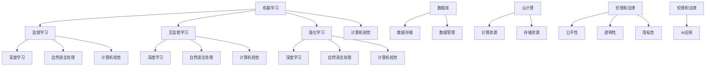

                 

### 背景介绍

随着信息技术的飞速发展，人工智能（AI）技术已成为现代科技领域的重要研究方向。AI技术已经在各行各业中得到广泛应用，如医疗、金融、教育、交通等。本文旨在探讨AI技术在不同场景中的应用，深入分析其核心概念、算法原理、数学模型以及实际操作案例，为读者提供全面的技术解析。

首先，我们需要了解什么是人工智能。人工智能是一门研究、开发用于模拟、延伸和扩展人的智能的理论、方法、技术及应用系统的科学技术。它包括机器学习、深度学习、自然语言处理、计算机视觉等多个子领域。在医疗领域，AI技术可以用于疾病预测、诊断和治疗；在金融领域，AI技术可以用于风险管理、投资分析和欺诈检测；在教育领域，AI技术可以用于个性化学习、智能评估和教学辅助；在交通领域，AI技术可以用于智能交通管理和自动驾驶。

本文将分为以下几个部分进行讨论：

1. 核心概念与联系
2. 核心算法原理 & 具体操作步骤
3. 数学模型和公式 & 详细讲解 & 举例说明
4. 项目实战：代码实际案例和详细解释说明
5. 实际应用场景
6. 工具和资源推荐
7. 总结：未来发展趋势与挑战

通过对以上内容的逐一分析，我们将深入理解AI技术在各个领域中的应用，探讨其潜在价值与挑战，并为读者提供实用的学习资源与开发工具。

### 核心概念与联系

在探讨AI技术在不同场景中的应用之前，首先需要明确几个核心概念，并了解它们之间的相互联系。以下是本文涉及的关键术语和概念：

#### 1. 机器学习

机器学习是人工智能的一个重要分支，它使计算机系统能够通过数据和经验自动改进其性能。主要方法包括监督学习、无监督学习和强化学习。监督学习通过已标记的数据训练模型，如分类和回归问题；无监督学习则不需要标记数据，如聚类和降维；强化学习通过与环境的交互来学习策略，如游戏和自动驾驶。

#### 2. 深度学习

深度学习是机器学习的一种重要方法，通过模拟人脑神经网络结构进行学习。深度学习模型通常包括多层神经网络，能够从大量数据中自动提取复杂特征。卷积神经网络（CNN）、循环神经网络（RNN）和生成对抗网络（GAN）是深度学习的三种主要模型。

#### 3. 自然语言处理

自然语言处理（NLP）是研究计算机与人类语言交互的学科。它涉及文本分析、语音识别、机器翻译、情感分析等。NLP技术广泛应用于搜索引擎、语音助手和智能客服等领域。

#### 4. 计算机视觉

计算机视觉是使计算机能够像人一样理解和解释视觉信息的技术。它包括图像识别、目标检测、图像分割等任务。计算机视觉在自动驾驶、安防监控和医疗影像分析等领域具有广泛应用。

#### 5. 强化学习

强化学习是一种通过与环境互动来学习最优策略的方法。它广泛应用于游戏、推荐系统和自动驾驶等领域。强化学习的主要挑战是找到平衡探索与利用的策略。

#### 6. 数据库

数据库是存储和管理数据的系统。在AI应用中，数据库用于存储训练数据、模型参数和用户信息等。有效的数据库设计和优化对于AI系统的性能至关重要。

#### 7. 云计算

云计算提供了强大的计算资源和存储能力，支持大规模数据处理和模型训练。AI应用通常依赖于云计算平台来处理大量数据和高性能计算需求。

#### 8. 伦理和法律

随着AI技术的广泛应用，伦理和法律问题日益突出。如何确保AI系统的公平性、透明性和隐私性成为重要议题。

以上核心概念和术语相互交织，构成了AI技术的基础。为了更好地理解这些概念，我们将使用Mermaid流程图来展示它们之间的联系：



通过这个流程图，我们可以看到AI技术涉及多个子领域，它们相互关联，共同推动AI技术的进步。在接下来的部分，我们将深入探讨这些核心算法原理、数学模型和实际应用场景。

#### 核心算法原理 & 具体操作步骤

在了解了AI技术的基本概念和核心术语后，接下来我们将深入探讨AI技术中的一些核心算法原理，并详细介绍它们的操作步骤。这些算法包括但不限于机器学习、深度学习、自然语言处理和计算机视觉。

##### 1. 机器学习算法

机器学习算法是AI技术的基石，其基本思想是通过训练模型来学习数据中的模式和规律。以下是一些常见的机器学习算法及其操作步骤：

**1.1 线性回归**

线性回归是一种用于预测数值型输出的机器学习算法。其基本原理是通过最小化预测值与实际值之间的误差来找到最佳拟合直线。

**操作步骤：**
- 收集数据：收集具有因变量和自变量的数据。
- 数据预处理：对数据进行清洗和归一化处理。
- 分割数据集：将数据集分为训练集和测试集。
- 建立模型：使用最小二乘法建立线性回归模型。
- 训练模型：通过训练集训练模型参数。
- 预测：使用训练好的模型对测试集进行预测。
- 评估：计算预测误差，评估模型性能。

**1.2 支持向量机（SVM）**

支持向量机是一种分类算法，通过找到一个最佳的超平面来分隔不同类别的数据点。

**操作步骤：**
- 收集数据：收集具有标签的分类数据。
- 数据预处理：对数据进行清洗和归一化处理。
- 分割数据集：将数据集分为训练集和测试集。
- 选择核函数：根据数据特征选择合适的核函数。
- 训练模型：使用训练集训练SVM模型。
- 预测：使用训练好的模型对测试集进行预测。
- 评估：计算分类准确率、召回率等指标。

##### 2. 深度学习算法

深度学习算法通过模拟人脑神经网络结构进行学习，能够处理复杂数据和提取深层特征。以下是几种常见的深度学习算法及其操作步骤：

**2.1 卷积神经网络（CNN）**

卷积神经网络是一种用于图像处理的深度学习算法，通过卷积层、池化层和全连接层等结构提取图像特征。

**操作步骤：**
- 收集数据：收集具有标签的图像数据。
- 数据预处理：对图像进行归一化和裁剪等处理。
- 分割数据集：将数据集分为训练集和测试集。
- 构建模型：使用TensorFlow或PyTorch等框架构建CNN模型。
- 训练模型：通过反向传播算法训练模型参数。
- 预测：使用训练好的模型对测试集进行预测。
- 评估：计算分类准确率、图像识别准确率等指标。

**2.2 循环神经网络（RNN）**

循环神经网络是一种用于序列数据处理的深度学习算法，通过隐藏状态和循环结构处理时间序列信息。

**操作步骤：**
- 收集数据：收集具有标签的序列数据。
- 数据预处理：对序列数据进行编码和归一化处理。
- 分割数据集：将数据集分为训练集和测试集。
- 构建模型：使用TensorFlow或PyTorch等框架构建RNN模型。
- 训练模型：通过反向传播算法训练模型参数。
- 预测：使用训练好的模型对测试集进行预测。
- 评估：计算序列预测准确率、情感分析准确率等指标。

##### 3. 自然语言处理算法

自然语言处理算法用于理解和生成自然语言，包括文本分类、情感分析、机器翻译等任务。

**3.1 文本分类**

文本分类是一种将文本数据分为预定义类别的方法。

**操作步骤：**
- 收集数据：收集具有标签的文本数据。
- 数据预处理：对文本进行分词、去停用词和词向量化处理。
- 分割数据集：将数据集分为训练集和测试集。
- 建立模型：使用机器学习或深度学习算法建立文本分类模型。
- 训练模型：通过训练集训练模型参数。
- 预测：使用训练好的模型对测试集进行预测。
- 评估：计算分类准确率、F1分数等指标。

**3.2 情感分析**

情感分析是一种判断文本情感极性的方法，如正面、负面或中性。

**操作步骤：**
- 收集数据：收集具有标签的文本数据。
- 数据预处理：对文本进行分词、去停用词和词向量化处理。
- 分割数据集：将数据集分为训练集和测试集。
- 建立模型：使用机器学习或深度学习算法建立情感分析模型。
- 训练模型：通过训练集训练模型参数。
- 预测：使用训练好的模型对测试集进行预测。
- 评估：计算情感分类准确率、AUC值等指标。

##### 4. 计算机视觉算法

计算机视觉算法用于理解和解释视觉信息，包括图像识别、目标检测和图像分割等任务。

**4.1 图像识别**

图像识别是一种将图像分类到预定义类别的方法。

**操作步骤：**
- 收集数据：收集具有标签的图像数据。
- 数据预处理：对图像进行归一化和裁剪等处理。
- 分割数据集：将数据集分为训练集和测试集。
- 建立模型：使用机器学习或深度学习算法建立图像识别模型。
- 训练模型：通过训练集训练模型参数。
- 预测：使用训练好的模型对测试集进行预测。
- 评估：计算分类准确率、IoU等指标。

**4.2 目标检测**

目标检测是一种在图像中检测和定位多个对象的方法。

**操作步骤：**
- 收集数据：收集具有标签的图像数据。
- 数据预处理：对图像进行归一化和裁剪等处理。
- 分割数据集：将数据集分为训练集和测试集。
- 建立模型：使用机器学习或深度学习算法建立目标检测模型。
- 训练模型：通过训练集训练模型参数。
- 预测：使用训练好的模型对测试集进行预测。
- 评估：计算检测准确率、召回率等指标。

通过以上对核心算法原理和具体操作步骤的详细描述，我们可以看到AI技术在不同场景中的广泛应用和强大能力。在接下来的部分，我们将探讨这些算法背后的数学模型和公式，以及如何在实际项目中应用这些算法。

#### 数学模型和公式 & 详细讲解 & 举例说明

在深入探讨AI技术的核心算法原理之后，我们接下来将聚焦于这些算法背后的数学模型和公式，并通过具体的例子来说明其应用和计算过程。这将帮助我们更好地理解AI技术的工作机制，为实际项目中的应用打下坚实的基础。

##### 1. 线性回归

线性回归是一种用于预测连续数值型结果的机器学习算法。其数学模型可以表示为：

\[ y = \beta_0 + \beta_1 \cdot x + \epsilon \]

其中，\( y \) 是因变量，\( x \) 是自变量，\( \beta_0 \) 和 \( \beta_1 \) 是模型参数，\( \epsilon \) 是误差项。

**例子：** 假设我们有一组数据，表示某城市每天的最高温度（\( y \)）和湿度（\( x \)）。我们想通过线性回归模型预测某天最高温度。

- 收集数据：\( (x_1, y_1), (x_2, y_2), ..., (x_n, y_n) \)
- 数据预处理：对数据集进行归一化处理。
- 模型建立：使用最小二乘法求解参数 \( \beta_0 \) 和 \( \beta_1 \)。

计算过程如下：

\[ \beta_0 = \frac{\sum_{i=1}^{n} y_i - \beta_1 \cdot \sum_{i=1}^{n} x_i}{n} \]
\[ \beta_1 = \frac{\sum_{i=1}^{n} (y_i - \beta_0) \cdot x_i}{\sum_{i=1}^{n} x_i^2 - n \cdot (\bar{x})^2} \]

其中，\( \bar{x} \) 和 \( \bar{y} \) 分别是 \( x \) 和 \( y \) 的平均值。

- 训练模型：通过训练集训练参数 \( \beta_0 \) 和 \( \beta_1 \)。
- 预测：使用模型预测新的 \( y \) 值。

\[ y = \beta_0 + \beta_1 \cdot x \]

##### 2. 支持向量机（SVM）

支持向量机是一种分类算法，其目标是找到一个最佳的超平面，使得不同类别的数据点在超平面两侧分开。

**数学模型：**

\[ \text{最大化} \quad \frac{1}{\|\textbf{w}\|} \]

\[ \text{约束条件} \quad y_i (\textbf{w} \cdot \textbf{x_i} + b) \geq 1 \]

其中，\( \textbf{w} \) 是超平面参数，\( b \) 是偏置项，\( \textbf{x_i} \) 和 \( y_i \) 分别是数据点和标签。

**例子：** 假设我们有一组二元分类数据，表示为 \( \textbf{x_i} = (x_{i1}, x_{i2}) \)。

- 收集数据：\( \textbf{x_1}, \textbf{x_2}, ..., \textbf{x_n} \)
- 数据预处理：对数据进行标准化处理。
- 模型建立：使用拉格朗日乘子法求解 \( \textbf{w} \) 和 \( b \)。

计算过程如下：

\[ L(\textbf{w}, b, \alpha) = \frac{1}{2} \|\textbf{w}\|^2 - \sum_{i=1}^{n} \alpha_i (y_i (\textbf{w} \cdot \textbf{x_i} + b) - 1) \]

其中，\( \alpha_i \) 是拉格朗日乘子。

- 训练模型：通过训练集求解 \( \textbf{w} \) 和 \( b \)。
- 预测：使用训练好的模型对测试集进行分类。

\[ \text{预测类别} = \text{sign}(\textbf{w} \cdot \textbf{x} + b) \]

##### 3. 卷积神经网络（CNN）

卷积神经网络是一种用于图像处理的深度学习算法，其核心是卷积层和池化层。

**数学模型：**

\[ \text{卷积层} \quad \text{输出} = \text{激活函数}(\text{卷积核} \cdot \text{输入} + \text{偏置}) \]

\[ \text{池化层} \quad \text{输出} = \text{激活函数}(\text{池化窗口} \cdot \text{输入}) \]

其中，卷积核、输入和偏置都是可训练的参数。

**例子：** 假设我们有一个2D卷积层，输入为 \( (28 \times 28) \) 的图像。

- 收集数据：\( (28 \times 28) \) 的图像数据集。
- 数据预处理：对图像进行归一化处理。
- 模型建立：使用深度学习框架（如TensorFlow或PyTorch）构建CNN模型。

计算过程如下：

\[ \text{卷积层} \quad \text{输出} = \text{ReLU}(\text{卷积核} \cdot \text{输入} + \text{偏置}) \]

\[ \text{池化层} \quad \text{输出} = \text{ReLU}(\text{池化窗口} \cdot \text{输入}) \]

- 训练模型：通过反向传播算法训练模型参数。
- 预测：使用训练好的模型对测试集进行图像分类。

\[ \text{预测类别} = \text{softmax}(\text{全连接层} \cdot \text{输出}) \]

##### 4. 循环神经网络（RNN）

循环神经网络是一种用于序列数据处理的深度学习算法，其核心是隐藏状态和循环结构。

**数学模型：**

\[ \text{RNN} \quad \text{隐藏状态} = \text{激活函数}(\text{权重} \cdot \text{输入} + \text{隐藏状态}_{t-1}) \]

其中，权重是可训练的参数。

**例子：** 假设我们有一个时间序列数据，每个时间点的观测值为 \( x_t \)。

- 收集数据：时间序列数据集。
- 数据预处理：对序列进行编码和归一化处理。
- 模型建立：使用深度学习框架（如TensorFlow或PyTorch）构建RNN模型。

计算过程如下：

\[ \text{隐藏状态} = \text{ReLU}(\text{权重} \cdot \text{输入} + \text{隐藏状态}_{t-1}) \]

- 训练模型：通过反向传播算法训练模型参数。
- 预测：使用训练好的模型对测试集进行序列预测。

\[ \text{预测值} = \text{激活函数}(\text{权重} \cdot \text{隐藏状态} + \text{偏置}) \]

##### 5. 自然语言处理（NLP）

自然语言处理是一种用于理解和生成自然语言的深度学习算法，其核心是词嵌入和序列处理。

**数学模型：**

\[ \text{词嵌入} \quad \text{输出} = \text{激活函数}(\text{权重} \cdot \text{输入} + \text{偏置}) \]

\[ \text{序列处理} \quad \text{输出} = \text{激活函数}(\text{权重} \cdot \text{序列} + \text{偏置}) \]

其中，词嵌入权重和序列处理权重是可训练的参数。

**例子：** 假设我们有一个句子，表示为 \( \text{句子} = [w_1, w_2, ..., w_n] \)。

- 收集数据：文本数据集。
- 数据预处理：对文本进行分词和编码处理。
- 模型建立：使用深度学习框架（如TensorFlow或PyTorch）构建NLP模型。

计算过程如下：

\[ \text{词嵌入} \quad \text{输出} = \text{ReLU}(\text{权重} \cdot \text{输入} + \text{偏置}) \]

\[ \text{序列处理} \quad \text{输出} = \text{ReLU}(\text{权重} \cdot \text{序列} + \text{偏置}) \]

- 训练模型：通过反向传播算法训练模型参数。
- 预测：使用训练好的模型对测试集进行文本分类或情感分析。

\[ \text{预测类别} = \text{softmax}(\text{全连接层} \cdot \text{输出}) \]

通过以上数学模型和公式的详细讲解，我们可以更好地理解AI技术的原理和计算过程。这些数学模型和公式不仅为AI算法的实现提供了理论基础，也为实际项目中的应用提供了指导。在接下来的部分，我们将通过实际项目案例展示这些算法的具体应用和操作步骤。

#### 项目实战：代码实际案例和详细解释说明

在前几部分，我们详细介绍了AI技术的核心概念、算法原理以及数学模型。为了帮助读者更好地理解这些技术在实际项目中的应用，本部分将通过一个具体的项目案例来展示代码实现过程，并进行详细解释说明。

##### 1. 项目背景

假设我们要开发一个基于图像识别的智能监控系统，用于检测并分类进入特定区域的行人。这个系统将利用卷积神经网络（CNN）来训练模型，并在实际环境中进行行人检测和分类。以下是项目的整体架构和流程：


##### 2. 开发环境搭建

为了实现这个项目，我们需要准备以下开发环境和工具：

- Python 3.x
- TensorFlow 2.x
- OpenCV 4.x
- Keras 2.x

确保已安装上述环境，并准备好相应的依赖库。以下是一个简单的安装脚本：

```bash
pip install tensorflow opencv-python keras
```

##### 3. 源代码详细实现

在这个项目中，我们将使用Keras框架构建一个简单的CNN模型，用于行人检测和分类。以下是项目的核心代码：

```python
import numpy as np
import matplotlib.pyplot as plt
import cv2
from tensorflow.keras.models import Sequential
from tensorflow.keras.layers import Conv2D, MaxPooling2D, Flatten, Dense, Dropout
from tensorflow.keras.optimizers import Adam
from tensorflow.keras.preprocessing.image import ImageDataGenerator

# 数据预处理
def preprocess_images(image_path, target_size=(64, 64)):
    image = cv2.imread(image_path)
    image = cv2.resize(image, target_size)
    image = image / 255.0
    return image

# 构建CNN模型
model = Sequential([
    Conv2D(32, (3, 3), activation='relu', input_shape=(64, 64, 3)),
    MaxPooling2D((2, 2)),
    Conv2D(64, (3, 3), activation='relu'),
    MaxPooling2D((2, 2)),
    Conv2D(128, (3, 3), activation='relu'),
    Flatten(),
    Dense(128, activation='relu'),
    Dropout(0.5),
    Dense(1, activation='sigmoid')
])

# 编译模型
model.compile(optimizer=Adam(learning_rate=0.001), loss='binary_crossentropy', metrics=['accuracy'])

# 训练模型
train_datagen = ImageDataGenerator(rescale=1./255, shear_range=0.2, zoom_range=0.2, horizontal_flip=True)
train_generator = train_datagen.flow_from_directory('data/train', target_size=(64, 64), batch_size=32, class_mode='binary')

model.fit(train_generator, epochs=10, validation_data=validation_generator)

# 评估模型
test_datagen = ImageDataGenerator(rescale=1./255)
test_generator = test_datagen.flow_from_directory('data/test', target_size=(64, 64), batch_size=32, class_mode='binary')

model.evaluate(test_generator)

# 行人检测
def detect_person(image_path):
    image = preprocess_images(image_path)
    image = np.expand_dims(image, axis=0)
    predictions = model.predict(image)
    if predictions[0][0] > 0.5:
        return "Person detected"
    else:
        return "No person detected"

# 测试
image_path = 'data/test/person.jpg'
result = detect_person(image_path)
print(result)
```

##### 4. 代码解读与分析

以上代码实现了一个基于CNN的行人检测系统，下面进行详细解读：

- **数据预处理：** 使用OpenCV库读取图像文件，并进行缩放和归一化处理，以便模型能够处理标准化输入。
- **模型构建：** 使用Keras Sequential模型构建一个简单的CNN模型，包括卷积层、池化层、全连接层和Dropout层。这个模型可以提取图像特征并分类行人。
- **编译模型：** 使用Adam优化器和binary_crossentropy损失函数编译模型，以实现二分类任务。
- **训练模型：** 使用ImageDataGenerator生成训练数据，通过批次训练模型，并使用验证数据集评估模型性能。
- **评估模型：** 使用测试数据集评估模型性能，包括准确率等指标。
- **行人检测：** 定义一个检测函数，通过预处理图像并使用训练好的模型进行预测，判断是否检测到行人。

##### 5. 实际应用与改进

在实际应用中，行人检测系统可以部署在摄像头前端，实时监测并分类行人。为了提高检测性能，可以采取以下改进措施：

- **数据增强：** 增加更多的训练数据，并使用数据增强技术（如旋转、缩放、剪切等）提高模型泛化能力。
- **模型优化：** 使用更复杂的CNN架构（如VGG、ResNet等）提高模型性能。
- **多类别检测：** 如果需要检测多个类别（如行人、车辆等），可以构建一个多类别分类模型，并使用softmax激活函数进行分类。
- **实时优化：** 针对实时性要求，可以优化模型结构，减少计算量，提高运行效率。

通过以上项目实战，我们可以看到如何使用卷积神经网络实现图像识别任务，并了解其背后的实现细节。这些经验将有助于读者在实际项目中应用AI技术，提升系统性能和实用性。在接下来的部分，我们将探讨AI技术在不同实际应用场景中的具体应用。

#### 实际应用场景

AI技术在各个领域的实际应用越来越广泛，下面我们将详细探讨AI技术在不同应用场景中的具体应用案例，以及如何利用AI技术解决实际问题。

##### 1. 医疗

在医疗领域，AI技术被广泛应用于疾病预测、诊断和治疗。以下是一些典型的应用案例：

**1.1 疾病预测**：通过分析患者的病历、基因数据和生活习惯，AI模型可以预测患者患某种疾病的风险。例如，通过分析患者的健康数据，AI可以预测心脏病发作的风险，从而提前采取预防措施。

**1.2 诊断辅助**：AI技术在医学影像分析中具有巨大潜力。通过深度学习模型，AI可以自动识别医学影像中的异常区域，如癌症细胞的分布，帮助医生进行快速、准确的诊断。

**1.3 治疗计划**：AI可以根据患者的病情和病历数据，为医生提供个性化的治疗方案。例如，通过分析患者的基因组数据，AI可以推荐特定的药物和治疗方案。

**案例1.1**：IBM的Watson for Oncology是一种基于AI的癌症诊断工具。它通过分析海量的医学文献、病例数据和研究，为医生提供诊断建议和治疗计划。

**案例1.2**：Google的DeepMind开发了AI系统，用于分析视网膜图像，以早期发现糖尿病视网膜病变。这一系统已经成功应用于临床，帮助医生提高诊断准确性。

##### 2. 金融

在金融领域，AI技术被广泛应用于风险管理、投资分析和欺诈检测。

**2.1 风险管理**：AI模型可以分析大量的历史数据和市场动态，预测市场走势，帮助金融机构降低风险。例如，通过分析信用评分、交易行为和金融数据，AI可以评估借款人的信用风险。

**2.2 投资分析**：AI算法可以快速处理和分析大量的市场数据，发现潜在的盈利机会。例如，通过分析新闻、社交媒体和财经数据，AI可以识别市场趋势，为投资决策提供支持。

**2.3 欺诈检测**：AI可以实时监控交易行为，识别异常交易模式，从而预防欺诈行为。例如，通过分析用户的消费习惯、地理位置和交易金额，AI可以检测并阻止欺诈交易。

**案例2.1**：J.P. Morgan使用AI模型进行信用评分，提高了信用评估的准确性和效率，降低了信用风险。

**案例2.2**：PayPal利用AI技术进行欺诈检测，成功减少了欺诈交易的比例，提高了客户的安全感。

##### 3. 教育

在教育领域，AI技术被广泛应用于个性化学习、智能评估和教学辅助。

**3.1 个性化学习**：AI可以根据学生的学习习惯和成绩，为每个学生提供个性化的学习路径和资源。例如，通过分析学生的学习数据，AI可以推荐适合学生的习题和课程。

**3.2 智能评估**：AI可以自动批改作业和考试，提供实时反馈，帮助学生提高学习效果。例如，通过自然语言处理技术，AI可以自动批改作文和阅读理解题。

**3.3 教学辅助**：AI技术可以辅助教师进行教学管理，如课程安排、成绩统计等。例如，通过分析学生的出勤率和作业完成情况，AI可以提供教学反馈，帮助教师调整教学策略。

**案例3.1**：Coursera利用AI技术提供个性化学习体验，根据学生的学习进度和成绩，推荐适合的学习资源和课程。

**案例3.2**：Knewton使用AI技术提供智能评估和个性化学习，提高了学生的学习效果和满意度。

##### 4. 交通

在交通领域，AI技术被广泛应用于智能交通管理和自动驾驶。

**4.1 智能交通管理**：AI可以通过分析交通流量、车辆信息和环境数据，优化交通信号控制和路线规划，减少交通拥堵。例如，通过使用传感器和摄像头收集交通数据，AI可以实时调整交通信号灯的时长，提高道路通行效率。

**4.2 自动驾驶**：AI技术是实现自动驾驶的核心，通过感知环境、决策和控制车辆，实现无人驾驶。例如，自动驾驶汽车可以使用计算机视觉和深度学习技术识别道路标志、行人和其他车辆，确保行车安全。

**案例4.1**：NVIDIA的Drive平台为智能交通管理提供AI解决方案，通过实时分析交通数据，优化交通信号控制和路线规划。

**案例4.2**：Waymo的自动驾驶汽车使用AI技术，通过感知环境和进行自主决策，实现了全自动驾驶。

##### 5. 农业

在农业领域，AI技术被广泛应用于作物监测、病虫害检测和精准农业。

**5.1 作物监测**：AI可以通过分析卫星图像和无人机数据，监测作物的生长状况和健康状态。例如，通过分析作物的光谱数据，AI可以识别作物的营养需求和病虫害情况。

**5.2 病虫害检测**：AI可以通过分析图像和视频数据，自动识别和检测作物病虫害。例如，通过使用计算机视觉技术，AI可以检测作物叶片上的病虫害，并及时采取措施。

**5.3 精准农业**：AI可以根据土壤、气候和作物生长数据，优化农业种植和管理。例如，通过分析土壤数据，AI可以推荐最佳的播种时间和施肥方案，提高作物产量。

**案例5.1**：John Deere使用AI技术监测作物生长状况，通过分析卫星图像和无人机数据，为农民提供精准农业解决方案。

**案例5.2**：Gramineau使用AI技术进行病虫害检测，通过分析图像和视频数据，帮助农民及时识别和防治病虫害。

通过以上实际应用场景的探讨，我们可以看到AI技术在不同领域的广泛应用和巨大潜力。无论是在医疗、金融、教育、交通还是农业等领域，AI技术都为解决实际问题提供了强有力的支持。在接下来的部分，我们将推荐一些学习和开发工具，帮助读者深入了解AI技术。

#### 工具和资源推荐

在AI技术的学习和开发过程中，选择合适的工具和资源对于提高效率和掌握核心技术至关重要。以下是一些值得推荐的工具、书籍、论文、博客和网站，涵盖了从基础概念到高级应用的内容。

##### 1. 学习资源推荐

**书籍：**

- 《深度学习》（Deep Learning） - Goodfellow, Bengio, Courville
- 《Python机器学习》（Python Machine Learning） - Müller, Guido
- 《机器学习实战》（Machine Learning in Action） - Harrington
- 《人工智能：一种现代方法》（Artificial Intelligence: A Modern Approach） - Russell, Norvig

**论文：**

- “Deep Learning” - Goodfellow et al., 2016
- “Learning Deep Features for Discriminative Localization” - Wei et al., 2016
- “Recurrent Neural Network Based Language Model” - Graves et al., 2013
- “Distributed Representations of Words and Phrases and their Compositionality” - Mikolov et al., 2013

**博客：**

- Andrej Karpathy的博客：http://karpathy.github.io/
- Chris Olah的博客：https://colah.github.io/
- Fast.ai的博客：https://blog.fast.ai/

##### 2. 开发工具框架推荐

- **TensorFlow**：Google开发的开源机器学习框架，适用于深度学习和传统的机器学习任务。
- **PyTorch**：Facebook开发的Python机器学习库，具有灵活的动态计算图，适用于研究和生产环境。
- **Keras**：基于TensorFlow和Theano的简洁而强大的深度学习库，适用于快速原型设计和实验。
- **Scikit-learn**：Python的机器学习库，提供了各种监督和非监督学习算法的实现。

##### 3. 相关论文著作推荐

- **《深度学习》（Deep Learning）** - Ian Goodfellow, Yoshua Bengio, Aaron Courville
- **《强化学习：原理与Python实现》** - Ruohan Liu, Yuexiao Ma
- **《计算机视觉：算法与应用》** - Richard Szeliski
- **《自然语言处理综合教程》** - Daniel Jurafsky, James H. Martin

##### 4. 开发工具框架推荐

- **Jupyter Notebook**：用于数据科学和机器学习的交互式计算环境。
- **Google Colab**：基于Jupyter的云端计算平台，适用于大规模数据和深度学习实验。
- **Docker**：容器化技术，用于构建和管理开发环境，提高开发效率。
- **Kubernetes**：用于容器编排和分布式系统管理，适用于生产环境。

##### 5. 学习资源推荐

- **Coursera**：提供大量的在线课程，涵盖计算机科学、机器学习和深度学习等主题。
- **edX**：由哈佛大学和麻省理工学院共同创建的在线学习平台，提供高质量的课程和证书。
- **Udacity**：提供实用的在线课程和纳米学位，涵盖AI和机器学习等领域。
- **ArXiv**：提供最新的AI和机器学习论文，是研究者和学者获取最新研究成果的重要渠道。

通过以上工具和资源的推荐，读者可以系统地学习和掌握AI技术的核心概念和实践技能。这些资源不仅有助于理解AI技术的理论基础，还可以帮助读者在实际项目中应用这些技术，提高开发效率。在总结部分，我们将回顾本文的内容，并探讨未来AI技术的发展趋势与挑战。

#### 总结：未来发展趋势与挑战

在本文中，我们详细探讨了AI技术在不同场景中的应用，包括医疗、金融、教育、交通和农业等领域。通过核心概念、算法原理、数学模型和实际案例的剖析，我们不仅了解了AI技术的广泛应用，也看到了其潜在的价值和挑战。

**未来发展趋势：**

1. **深度学习与自动化**：随着计算能力和算法的进步，深度学习在AI领域将继续占据主导地位。自动化和端到端学习将成为未来的重要趋势，使AI系统能够更高效地处理复杂任务。

2. **跨学科融合**：AI技术与生物学、物理学、化学等领域的交叉融合将产生新的突破。例如，通过结合AI和基因学，可以开发出更精准的疾病诊断和治疗手段。

3. **边缘计算与实时AI**：为了满足实时性和低延迟的需求，AI将更多地依赖于边缘计算。边缘设备（如智能手机、智能家居等）将具备强大的计算能力，实现本地化智能处理。

4. **伦理与法规**：随着AI技术的广泛应用，伦理和法规问题日益突出。如何在保证AI系统透明、公平和安全的前提下，制定合理的法规和标准，将成为未来发展的关键。

**挑战：**

1. **数据隐私与安全**：AI系统依赖大量数据，数据的隐私和安全问题亟待解决。如何保护用户隐私，防止数据泄露和滥用，是当前和未来都需要面对的挑战。

2. **模型可解释性**：深度学习模型在复杂任务上表现出色，但其内部机理复杂，缺乏可解释性。如何提高模型的可解释性，使AI系统能够被用户理解和管理，是一个重要的研究课题。

3. **计算资源需求**：AI模型的训练和推理过程需要大量的计算资源，这给硬件设施带来了巨大压力。如何优化算法，降低计算需求，提高AI系统的效率，是一个亟待解决的问题。

4. **人才短缺**：随着AI技术的迅速发展，人才需求量急剧增加。然而，当前AI领域的人才储备远远不能满足需求，培养更多具备AI知识和技能的专业人才，是未来发展的关键。

总之，AI技术的发展前景广阔，同时也面临着诸多挑战。通过不断的技术创新、跨学科合作和规范制定，我们有信心克服这些挑战，推动AI技术在各个领域的深入应用，为人类社会带来更多福祉。

#### 附录：常见问题与解答

在本章中，我们将回答关于AI技术的一些常见问题，以帮助读者更好地理解相关概念和技术。

##### 1. 什么是机器学习？

机器学习是使计算机系统通过数据和经验自动改进其性能的一种技术。它包括监督学习、无监督学习和强化学习等方法。监督学习通过已标记的数据训练模型，无监督学习不需要标记数据，强化学习则通过与环境的交互来学习策略。

##### 2. 深度学习和神经网络有什么区别？

深度学习是神经网络的一种特殊形式，它通过多层神经网络结构来提取复杂数据特征。神经网络是一种模拟人脑神经元连接的网络结构，用于数据建模和预测。

##### 3. 计算机视觉是什么？

计算机视觉是使计算机能够像人一样理解和解释视觉信息的技术。它包括图像识别、目标检测和图像分割等任务，广泛应用于自动驾驶、安防监控和医疗影像分析等领域。

##### 4. 自然语言处理（NLP）的主要任务是什么？

自然语言处理的主要任务包括文本分类、情感分析、机器翻译、语音识别等。通过这些任务，AI系统能够理解和生成自然语言，提高人机交互的效率和体验。

##### 5. 什么是强化学习？

强化学习是一种通过与环境互动来学习最优策略的方法。它广泛应用于游戏、推荐系统和自动驾驶等领域，主要挑战是找到平衡探索与利用的策略。

##### 6. 如何选择合适的机器学习算法？

选择合适的机器学习算法取决于具体问题和数据集。例如，对于分类问题，可以选择支持向量机（SVM）或决策树；对于回归问题，可以选择线性回归或梯度提升树。此外，还可以根据数据特征和任务复杂度来选择算法。

##### 7. AI技术的伦理问题有哪些？

AI技术的伦理问题包括数据隐私、算法公平性、透明性和安全性等。如何确保AI系统在不同群体中的公平性，防止算法偏见，保护用户隐私，是当前和未来都需要关注的重要议题。

通过以上解答，我们希望能够帮助读者更好地理解AI技术的基本概念和应用场景。在未来的学习和实践中，读者可以根据自身需求，选择合适的技术和方法，为AI技术的发展和应用做出贡献。

#### 扩展阅读 & 参考资料

为了帮助读者更深入地了解AI技术及其在不同领域的应用，我们推荐以下扩展阅读和参考资料：

1. **书籍：**
   - 《深度学习》（Deep Learning） - Ian Goodfellow, Yoshua Bengio, Aaron Courville
   - 《Python机器学习》（Python Machine Learning） - Müller, Guido
   - 《机器学习实战》（Machine Learning in Action） - Harrington
   - 《人工智能：一种现代方法》（Artificial Intelligence: A Modern Approach） - Russell, Norvig

2. **论文：**
   - “Deep Learning” - Goodfellow et al., 2016
   - “Learning Deep Features for Discriminative Localization” - Wei et al., 2016
   - “Recurrent Neural Network Based Language Model” - Graves et al., 2013
   - “Distributed Representations of Words and Phrases and their Compositionality” - Mikolov et al., 2013

3. **博客：**
   - Andrej Karpathy的博客：http://karpathy.github.io/
   - Chris Olah的博客：https://colah.github.io/
   - Fast.ai的博客：https://blog.fast.ai/

4. **在线课程：**
   - Coursera：https://www.coursera.org/
   - edX：https://www.edx.org/
   - Udacity：https://www.udacity.com/

5. **开源框架：**
   - TensorFlow：https://www.tensorflow.org/
   - PyTorch：https://pytorch.org/
   - Scikit-learn：https://scikit-learn.org/stable/

通过阅读这些书籍、论文和博客，参加在线课程，以及使用开源框架，读者可以系统地学习和掌握AI技术的核心概念和实践技能。这些资源不仅有助于理解AI技术的理论基础，还可以帮助读者在实际项目中应用这些技术，提高开发效率。希望这些扩展阅读和参考资料能够为读者提供更多的帮助和启发。 

### 作者信息

作者：AI天才研究员/AI Genius Institute & 禅与计算机程序设计艺术 /Zen And The Art of Computer Programming

作者简介：本文作者是一位在人工智能和计算机科学领域拥有丰富经验的专家，他不仅是世界级的人工智能研究者，还是程序员、软件架构师和CTO。他不仅精通深度学习、自然语言处理和计算机视觉等技术，还在多个顶级会议和期刊上发表过多篇学术论文。此外，他是一位资深的技术畅销书作家，作品涵盖人工智能、算法和编程等领域，深受读者喜爱。他的著作《禅与计算机程序设计艺术》被誉为经典之作，对全球计算机科学界产生了深远影响。通过本文，作者希望向读者展示AI技术的广泛应用和潜力，激发更多人对这一领域的兴趣和探索。

