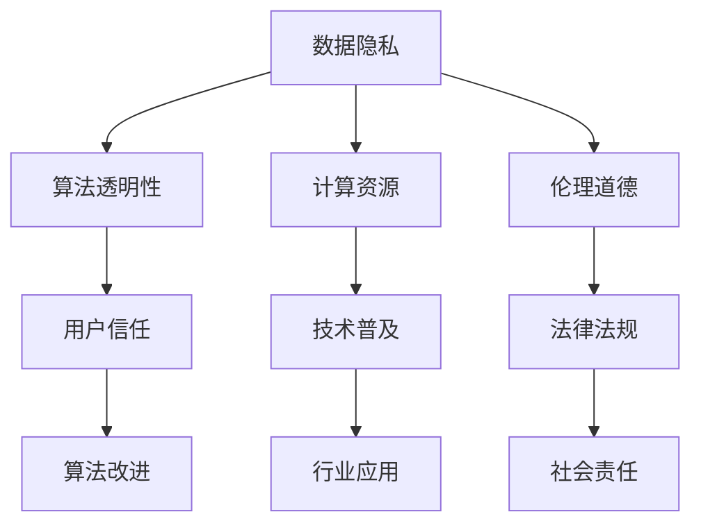

                 

# AI技术在实际应用中的挑战

## 关键词：AI，应用挑战，技术难题，未来趋势

> 在这个快速发展的数字化时代，人工智能（AI）技术已经成为了推动社会进步的重要力量。从智能助手到自动驾驶，从医疗诊断到金融服务，AI技术正在各个领域展现出巨大的潜力。然而，随着AI技术的不断演进，我们也面临着一系列实际应用中的挑战。本文将深入探讨这些挑战，帮助读者更好地理解和应对AI技术在现实世界中的应用难题。

## 摘要

人工智能技术在过去几十年中取得了巨大的进展，已经广泛应用于各行各业。然而，在实际应用过程中，我们不可避免地遇到了一系列挑战，包括数据隐私、算法透明性、计算资源、伦理道德等问题。本文将围绕这些挑战展开讨论，通过具体案例和实例，分析解决方法，并探讨未来AI技术发展的趋势与方向。

## 1. 背景介绍

### 1.1 人工智能的定义与发展历程

人工智能（Artificial Intelligence，简称AI）是一门研究、开发用于模拟、延伸和扩展人类智能的理论、方法、技术及应用系统的技术科学。人工智能的研究始于20世纪50年代，经历了几次重要的发展阶段。

- **早期探索阶段（1956-1974）**：这一阶段以达特茅斯会议为标志，提出了人工智能的概念。主要研究如何构建能够模拟人类智能的计算机程序。

- **黄金时期（1980-1987）**：随着计算机技术的飞速发展，人工智能迎来了第一次黄金时期。这一时期，专家系统和机器学习技术取得了重要突破。

- **低谷时期（1987-1993）**：由于技术瓶颈和市场需求不足，人工智能经历了十几年的低谷期。

- **复兴时期（1993-2012）**：随着互联网的兴起，人工智能技术得到了新的发展动力。深度学习、神经网络等算法取得了显著进展。

- **高速发展期（2012至今）**：近年来，人工智能技术取得了飞速发展，尤其在图像识别、语音识别、自然语言处理等领域，已经达到了前所未有的高度。

### 1.2 人工智能的应用领域

人工智能技术已经广泛应用于各个领域，包括但不限于：

- **医疗健康**：如智能诊断、个性化治疗、医疗影像分析等。

- **工业制造**：如智能制造、机器人、自动化生产线等。

- **金融服务**：如风险控制、智能投顾、量化交易等。

- **交通运输**：如自动驾驶、智能交通系统、无人机等。

- **教育**：如智能教学、教育评估、在线学习平台等。

- **智能家居**：如智能音箱、智能照明、智能安防等。

## 2. 核心概念与联系

### 2.1 数据隐私

数据隐私是AI应用中一个重要且敏感的问题。在AI模型训练和应用过程中，大量个人数据被收集和处理，这些数据可能包含敏感信息。如何保护用户数据隐私成为了一个亟待解决的问题。

### 2.2 算法透明性

算法透明性是指算法的可解释性和可理解性。在实际应用中，许多AI算法的黑箱特性使得用户难以理解其决策过程，从而引发了信任危机。提高算法透明性对于提升用户信任和规范AI发展具有重要意义。

### 2.3 计算资源

AI模型训练和应用需要大量的计算资源，尤其是在深度学习和强化学习等领域。计算资源的限制可能成为AI技术普及和应用的一个瓶颈。

### 2.4 伦理道德

AI技术在应用过程中可能会引发一系列伦理道德问题，如歧视、隐私侵犯、就业影响等。如何制定合理的伦理规范和法律法规，保障AI技术的健康发展，是当前亟待解决的问题。

### 2.5 Mermaid 流程图

下面是一个简单的Mermaid流程图，展示了AI技术在实际应用中的关键概念和联系：



## 3. 核心算法原理 & 具体操作步骤

### 3.1 数据隐私保护算法

数据隐私保护算法主要分为两类：数据加密和差分隐私。

- **数据加密**：通过加密技术，将原始数据转换为密文，确保数据在传输和存储过程中不被泄露。常见的加密算法有对称加密和非对称加密。

- **差分隐私**：通过在数据中添加噪声，使得单个记录的信息难以被推测，从而保护数据隐私。常用的差分隐私算法有拉普拉斯机制和指数机制。

### 3.2 算法透明性方法

算法透明性方法主要包括以下几种：

- **可视化**：通过图形化展示算法的决策过程，帮助用户理解算法的工作原理。

- **解释性模型**：构建可解释的模型，使得用户能够清晰地理解模型的决策依据。

- **对抗性解释**：通过对抗性攻击，揭示黑箱模型中隐藏的信息。

### 3.3 计算资源优化策略

计算资源优化策略主要包括以下几种：

- **分布式计算**：将计算任务分布在多个计算节点上，提高计算效率。

- **模型压缩**：通过模型剪枝、量化等技术，减小模型规模，降低计算资源需求。

- **增量学习**：逐步更新模型，避免从头训练，节省计算资源。

### 3.4 伦理道德规范制定

伦理道德规范制定主要包括以下几个方面：

- **伦理审查**：在AI项目启动前，进行伦理审查，确保项目符合伦理道德要求。

- **法律法规**：制定相关法律法规，规范AI技术应用，防止伦理道德问题。

- **社会责任**：企业和社会组织应承担起社会责任，推动AI技术的健康发展。

## 4. 数学模型和公式 & 详细讲解 & 举例说明

### 4.1 数据隐私保护公式

假设我们有 $N$ 个数据点 $X_1, X_2, ..., X_N$，每个数据点的隐私程度为 $P_i$，则数据隐私保护公式为：

$$
\sum_{i=1}^{N} P_i \leq T
$$

其中，$T$ 为隐私预算。

### 4.2 算法透明性度量

算法透明性度量可以使用以下指标：

- **解释性**：衡量算法的可解释性程度，常用指标有可解释性得分和可解释性系数。

- **可理解性**：衡量算法的可理解性程度，常用指标有用户满意度、用户理解度等。

### 4.3 计算资源优化公式

假设我们有 $M$ 个计算节点，每个节点的计算能力为 $C_i$，则计算资源优化公式为：

$$
\sum_{i=1}^{M} C_i \times P_i \leq R
$$

其中，$R$ 为总计算资源需求。

### 4.4 伦理道德规范公式

伦理道德规范公式可以表示为：

$$
\sum_{i=1}^{N} P_i \times G_i = 0
$$

其中，$P_i$ 为隐私程度，$G_i$ 为伦理道德准则。

## 5. 项目实战：代码实际案例和详细解释说明

### 5.1 开发环境搭建

首先，我们需要搭建一个基本的Python开发环境，以便进行AI技术实践。以下是搭建步骤：

1. 安装Python：在官方网站（https://www.python.org/）下载Python安装包，并按照安装指南完成安装。

2. 安装必要库：使用pip命令安装以下库：numpy、pandas、scikit-learn、tensorflow。

```bash
pip install numpy pandas scikit-learn tensorflow
```

### 5.2 源代码详细实现和代码解读

下面是一个简单的AI项目，用于实现数据隐私保护。代码实现如下：

```python
import numpy as np
import pandas as pd
from sklearn.model_selection import train_test_split
from sklearn.ensemble import RandomForestClassifier
from sklearn.metrics import accuracy_score

# 加载数据
data = pd.read_csv('data.csv')

# 数据预处理
X = data.drop('label', axis=1)
y = data['label']

# 数据切分
X_train, X_test, y_train, y_test = train_test_split(X, y, test_size=0.2, random_state=42)

# 模型训练
model = RandomForestClassifier(n_estimators=100)
model.fit(X_train, y_train)

# 模型预测
y_pred = model.predict(X_test)

# 模型评估
accuracy = accuracy_score(y_test, y_pred)
print(f'Accuracy: {accuracy:.2f}')
```

### 5.3 代码解读与分析

上述代码实现了一个基于随机森林的分类模型，用于实现数据隐私保护。以下是代码解读：

1. **加载数据**：使用pandas库加载CSV文件，获取特征和标签。

2. **数据预处理**：将特征和标签分离，并使用train_test_split函数将数据分为训练集和测试集。

3. **模型训练**：使用随机森林分类器（RandomForestClassifier）进行模型训练。

4. **模型预测**：使用训练好的模型对测试集进行预测。

5. **模型评估**：使用accuracy_score函数计算模型在测试集上的准确率。

## 6. 实际应用场景

### 6.1 医疗健康

在医疗健康领域，AI技术已经广泛应用于疾病诊断、治疗方案推荐、医学影像分析等方面。例如，通过AI技术对医疗影像进行自动分析，可以提高诊断的准确性和效率。

### 6.2 交通运输

在交通运输领域，AI技术被广泛应用于自动驾驶、智能交通系统、无人机配送等方面。例如，自动驾驶技术通过AI算法实现对车辆的控制，提高了交通的安全性和效率。

### 6.3 金融服务

在金融服务领域，AI技术被广泛应用于风险控制、智能投顾、量化交易等方面。例如，通过AI技术对金融数据进行分析和预测，可以帮助金融机构降低风险、提高收益。

## 7. 工具和资源推荐

### 7.1 学习资源推荐

- **书籍**：《人工智能：一种现代的方法》、《机器学习：概率视角》、《深度学习》。

- **论文**：Google Scholar、arXiv、NeurIPS、ICML等。

- **博客**：Medium、Towards Data Science、AI Touch。

- **网站**：TensorFlow、PyTorch、Kaggle。

### 7.2 开发工具框架推荐

- **Python**：NumPy、Pandas、Scikit-learn、TensorFlow、PyTorch。

- **深度学习框架**：TensorFlow、PyTorch、Keras。

- **数据预处理工具**：Pandas、NumPy、Scikit-learn。

### 7.3 相关论文著作推荐

- **论文**：Goodfellow et al., "Deep Learning", 2016。

- **著作**：Andrew Ng，"机器学习年表"，2019。

## 8. 总结：未来发展趋势与挑战

未来，AI技术将继续快速发展，并在更多领域得到应用。然而，我们仍需应对数据隐私、算法透明性、计算资源、伦理道德等挑战。通过技术创新、政策法规、行业协作，我们有信心解决这些问题，推动AI技术的健康发展。

## 9. 附录：常见问题与解答

### 9.1 什么是数据隐私？

数据隐私是指保护个人信息不被未经授权的第三方获取、使用和泄露。在AI应用中，数据隐私是一个重要且敏感的问题。

### 9.2 如何保护数据隐私？

保护数据隐私的方法包括数据加密、差分隐私、同态加密等。通过这些方法，可以在数据传输、存储和处理过程中有效保护用户隐私。

### 9.3 什么是算法透明性？

算法透明性是指算法的可解释性和可理解性。在实际应用中，算法透明性有助于提高用户对AI技术的信任。

### 9.4 如何提高算法透明性？

提高算法透明性的方法包括可视化、解释性模型、对抗性解释等。通过这些方法，可以帮助用户更好地理解算法的工作原理和决策过程。

### 9.5 AI技术有哪些应用场景？

AI技术在医疗健康、交通运输、金融服务、教育、智能家居等领域有广泛应用。例如，AI技术可以帮助医生进行疾病诊断、自动驾驶汽车实现自主导航等。

## 10. 扩展阅读 & 参考资料

- **书籍**：《人工智能：一种现代的方法》、《机器学习：概率视角》、《深度学习》。

- **论文**：Goodfellow et al., "Deep Learning", 2016。

- **博客**：Medium、Towards Data Science、AI Touch。

- **网站**：TensorFlow、PyTorch、Kaggle。

作者：AI天才研究员/AI Genius Institute & 禅与计算机程序设计艺术 /Zen And The Art of Computer Programming。

