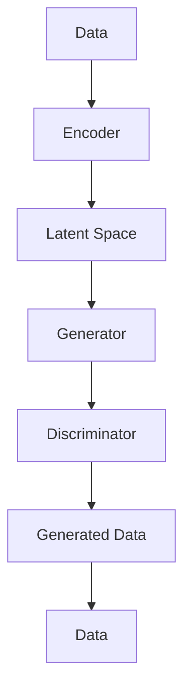

                 

### 背景介绍

生成式人工智能（Generative Artificial Intelligence，简称GAI）是近年来人工智能领域的一个重要分支，它通过学习大量的数据来生成新的内容，如图像、音频、文本等。与传统的基于规则的智能系统相比，生成式AI具有更强的创造力和自主性，能够实现更为复杂和多样化的任务。近年来，随着深度学习技术的快速发展，生成式AI的应用范围不断扩大，从艺术创作到数据生成，从虚拟现实到自动驾驶，都取得了显著的成果。

在AI掘金时代，抓住生成式AI的风口意味着抓住创新和商业价值的双重机遇。随着生成式AI技术的不断成熟和应用场景的拓展，越来越多的企业开始关注并投资于这一领域。无论是创业者、工程师还是研究人员，了解生成式AI的核心概念、算法原理和应用场景，都将有助于在AI领域中占据一席之地。

本文将分为以下几个部分，以帮助读者全面了解生成式AI：

1. **核心概念与联系**：介绍生成式AI的核心概念及其与其他AI领域的联系。
2. **核心算法原理 & 具体操作步骤**：详细解释生成式AI的关键算法，如生成对抗网络（GAN）和变分自编码器（VAE）。
3. **数学模型和公式 & 详细讲解 & 举例说明**：解析生成式AI中的数学模型和公式，并通过实例进行说明。
4. **项目实战：代码实际案例和详细解释说明**：提供具体的代码实现和详细解释。
5. **实际应用场景**：探讨生成式AI在各个领域的应用。
6. **工具和资源推荐**：推荐学习资源和开发工具。
7. **总结：未来发展趋势与挑战**：总结当前发展状况，展望未来趋势和挑战。

通过本文的阅读，读者将对生成式AI有更深入的理解，并能够为在实际项目中应用这一技术做好准备。

### 核心概念与联系

生成式人工智能（GAI）是人工智能（AI）的一个重要分支，其主要目标是通过学习大量数据来生成新的、与训练数据具有相似特征的内容。理解生成式AI的核心概念，需要从基本定义、与其他AI领域的区别以及其在实际应用中的作用开始。

首先，生成式AI的定义可以简化为：利用已有数据来生成新的数据。这一过程通常涉及一个生成器（Generator）和一个判别器（Discriminator）的互动。生成器试图生成尽可能真实的数据，而判别器则试图区分生成器和真实数据的差异。这种对抗性的训练机制是生成式AI的基本原理。

生成式AI与其他AI领域的区别在于其独特的生成能力。与监督学习（Supervised Learning）和强化学习（Reinforcement Learning）不同，生成式AI不需要标注数据进行训练，而是通过自编码器（Autoencoder）等模型从无监督学习（Unsupervised Learning）中提取信息，生成新的数据。这种无监督学习的特点使得生成式AI在处理大规模未标注数据时具有显著优势。

在生成式AI的实际应用中，其优势体现在以下几个方面：

1. **艺术创作**：生成式AI能够生成高质量的图像、音乐和文本，为艺术创作提供了新的可能性。例如，通过生成对抗网络（GAN）生成的图像，在视觉上已经可以与专业艺术家的作品相媲美。

2. **数据增强**：在机器学习中，数据的数量和质量直接影响模型的性能。生成式AI可以通过生成与训练数据相似的新数据，增强训练集的多样性，从而提升模型的泛化能力。

3. **虚拟现实与增强现实**：生成式AI可以生成逼真的虚拟场景和物体，为虚拟现实（VR）和增强现实（AR）技术提供丰富的内容，提升用户体验。

4. **文本生成**：生成式AI在自然语言处理（NLP）领域有着广泛的应用，能够生成高质量的文本，包括新闻报道、小说甚至诗歌。例如，OpenAI的GPT模型就可以生成高质量的文本内容。

为了更直观地理解生成式AI的核心概念，我们可以借助一个Mermaid流程图来展示其基本架构：



在这个流程图中，数据（Data）首先通过编码器（Encoder）压缩成潜在空间（Latent Space）中的点。潜在空间是一个低维的表示，使得生成器和判别器能够在其中进行操作。生成器（Generator）从潜在空间中采样，生成新的数据（Generated Data），而判别器（Discriminator）则尝试区分生成器和真实数据。通过对抗性训练，生成器和判别器不断优化，最终生成数据的质量得到显著提升。

通过这一流程，我们可以看到生成式AI的核心在于生成器和判别器的相互竞争与协同，这一机制不仅提高了生成数据的真实性，还为各种应用场景提供了强大的工具。

### 核心算法原理 & 具体操作步骤

生成式人工智能的核心算法包括生成对抗网络（GAN）和变分自编码器（VAE）。这两种算法通过不同的机制来实现数据生成，但都依赖于生成器和判别器的对抗性训练。在这一部分，我们将详细解释这些算法的原理，并展示具体的操作步骤。

#### 生成对抗网络（GAN）

生成对抗网络（Generative Adversarial Network，GAN）是由Ian Goodfellow等人于2014年提出的。GAN的核心思想是通过一个生成器（Generator）和一个判别器（Discriminator）的对抗性训练，生成与真实数据几乎无法区分的假数据。

**1. 生成器（Generator）**

生成器的任务是从一个随机噪声分布中生成类似真实数据的高质量样本。生成器的输入是一个随机噪声向量 \( z \)，其输出是假样本 \( x_g \)。生成器通常采用深度神经网络来实现，其目标函数是通过生成尽可能真实的样本来欺骗判别器。

**2. 判别器（Discriminator）**

判别器的任务是对输入的样本进行分类，判断其是真实数据还是生成器生成的假数据。判别器也通常采用深度神经网络，其目标函数是最大化正确分类的概率，同时降低对生成器生成的假样本的分类准确率。

**3. 对抗性训练**

生成器和判别器的训练过程是一个对抗性的过程。在每次迭代中，生成器试图生成更真实的样本，而判别器则试图区分真实样本和假样本。这个对抗性的训练过程使得生成器和判别器在相互博弈中不断优化，最终生成器能够生成高质量的假数据，而判别器的分类准确率接近50%。

**具体操作步骤：**

1. 初始化生成器 \( G \) 和判别器 \( D \) 的参数。
2. 对于生成器，从噪声分布中采样一个噪声向量 \( z \)，通过生成器生成假样本 \( x_g = G(z) \)。
3. 将假样本 \( x_g \) 和真实样本 \( x_r \) 输入到判别器中，计算判别器的损失函数。
4. 对判别器进行梯度下降优化，更新判别器的参数。
5. 对生成器进行梯度下降优化，更新生成器的参数。
6. 重复步骤2-5，直到生成器能够生成高质量的假样本。

#### 变分自编码器（VAE）

变分自编码器（Variational Autoencoder，VAE）是另一种生成式模型，它通过编码器（Encoder）和解码器（Decoder）的联合训练来实现数据生成。VAE的核心思想是学习一个潜在变量分布，从而生成新样本。

**1. 编码器（Encoder）**

编码器的任务是将输入数据映射到一个潜在变量空间，通常是一个均值和方差的高斯分布。编码器的输入是数据 \( x \)，其输出是潜在变量的均值 \( \mu \) 和方差 \( \sigma^2 \)。

**2. 解码器（Decoder）**

解码器的任务是将潜在变量从潜在空间重新映射回数据空间。解码器的输入是潜在变量 \( (\mu, \sigma^2) \)，其输出是重构的数据 \( x_recon \)。

**3. 潜在变量分布**

VAE使用变分下界（Variational Lower Bound）作为损失函数，确保编码器学习到的潜在变量分布能够近似真实数据分布。

**具体操作步骤：**

1. 初始化编码器 \( E \) 和解码器 \( D \) 的参数。
2. 对于每个输入数据 \( x \)，通过编码器得到潜在变量的均值 \( \mu \) 和方差 \( \sigma^2 \)。
3. 从潜在变量分布中采样一个潜在变量 \( z \)。
4. 通过解码器将潜在变量 \( z \) 重构回数据空间，计算重构损失。
5. 计算变分下界的期望损失，并使用梯度下降优化编码器和解码器的参数。
6. 重复步骤2-5，直到模型收敛。

通过上述步骤，我们可以看到GAN和VAE在生成数据的机制上有所不同，但它们都通过对抗性训练或变分下界优化实现了高质量的样本生成。这些核心算法的原理和操作步骤为我们理解和应用生成式AI提供了坚实的理论基础。

### 数学模型和公式 & 详细讲解 & 举例说明

生成式人工智能（GAI）的核心在于其数学模型和算法设计，这些模型和公式不仅描述了生成过程，还定义了训练过程中的优化目标。在本节中，我们将详细讲解生成式AI中常用的数学模型和公式，并通过具体的例子来说明这些概念的应用。

#### 生成对抗网络（GAN）的数学模型

生成对抗网络（GAN）的核心包括生成器 \( G \) 和判别器 \( D \) 的损失函数。下面是这两个模型的主要数学公式。

**1. 生成器 \( G \) 的损失函数**

生成器的损失函数通常表示为以下形式：

\[ L_G = -\log(D(G(z))) \]

其中，\( z \) 是生成器的输入噪声，\( G(z) \) 是生成器生成的样本，\( D(x) \) 是判别器对输入样本 \( x \) 的输出概率。

**2. 判别器 \( D \) 的损失函数**

判别器的损失函数可以表示为：

\[ L_D = -[\log(D(x)) + \log(1 - D(G(z)))] \]

其中，\( x \) 是真实样本，\( G(z) \) 是生成器生成的样本。

**3. GAN的总损失**

GAN的总损失是生成器和判别器损失的加和：

\[ L_{GAN} = L_G + L_D \]

#### 变分自编码器（VAE）的数学模型

变分自编码器（VAE）的核心包括编码器 \( E \) 和解码器 \( D \) 的损失函数。VAE通过最大化变分下界（KL散度）来优化模型。

**1. 编码器 \( E \) 的损失函数**

编码器的损失函数可以表示为：

\[ L_E = -\log p(x|z) \]

其中，\( p(x|z) \) 是数据 \( x \) 通过编码器 \( E \) 和解码器 \( D \) 重建的概率。

**2. 解码器 \( D \) 的损失函数**

解码器的损失函数可以表示为：

\[ L_D = \frac{1}{N}\sum_{n=1}^{N} -\log p(x_n|z_n) \]

其中，\( N \) 是训练样本的数量，\( z_n \) 是从潜在变量分布中采样的样本。

**3. VAE的总损失**

VAE的总损失是重建损失和变分下界的加和：

\[ L_{VAE} = L_E + L_D \]

其中，变分下界 \( \mathcal{L} \) 是KL散度，可以表示为：

\[ \mathcal{L} = \frac{1}{N}\sum_{n=1}^{N} \mathbb{E}_{z_n \sim q(z|x_n)} [\log q(z|x_n) - \log p(x_n|z_n)] \]

#### 举例说明

为了更好地理解这些公式，我们通过一个简单的例子来说明GAN和VAE的应用。

**1. GAN的例子**

假设我们有一个GAN模型，生成器 \( G \) 和判别器 \( D \) 分别为：

\[ G: \mathbb{R}^{\mathbf{z}} \rightarrow \mathbb{R}^{\mathbf{x}} \]
\[ D: \mathbb{R}^{\mathbf{x}} \rightarrow \mathbb{R} \]

其中，\( \mathbf{z} \) 是生成器的输入噪声，\( \mathbf{x} \) 是生成器生成的样本。假设判别器的输出是二分类概率，即：

\[ D(x) = \frac{1}{1 + \exp(-x)} \]

在训练过程中，我们通过以下步骤更新模型参数：

- 从噪声分布中采样 \( z \)，计算生成样本 \( x_g = G(z) \)。
- 将 \( x_g \) 和真实样本 \( x_r \) 输入到判别器中，计算判别器的损失。
- 使用梯度下降优化判别器的参数。
- 使用梯度下降优化生成器的参数，使其生成的样本更难以被判别器识别。

**2. VAE的例子**

假设我们有一个VAE模型，编码器 \( E \) 和解码器 \( D \) 分别为：

\[ E: \mathbb{R}^{\mathbf{x}} \rightarrow \mathbb{R}^{\mu, \sigma^2} \]
\[ D: \mathbb{R}^{\mu, \sigma^2} \rightarrow \mathbb{R}^{\mathbf{x}} \]

其中，\( \mu \) 和 \( \sigma^2 \) 是编码器输出的均值和方差。假设解码器的输出是重构样本 \( x_recon = D(\mu, \sigma^2) \)。

在训练过程中，我们通过以下步骤更新模型参数：

- 对于每个输入数据 \( x \)，计算编码器的输出 \( \mu, \sigma^2 \)。
- 从高斯分布中采样 \( z \)，计算重构样本 \( x_recon \)。
- 计算重构损失 \( L_D \) 和变分下界 \( \mathcal{L} \)。
- 使用梯度下降优化编码器和解码器的参数。

通过这些例子，我们可以看到GAN和VAE在数学模型上的差异，以及它们如何通过优化目标函数来生成新的数据。这些数学模型和公式为我们理解和应用生成式AI提供了坚实的理论基础。

### 项目实战：代码实际案例和详细解释说明

在本节中，我们将通过一个实际项目案例来展示生成式AI的应用。我们选择生成对抗网络（GAN）作为案例，展示如何使用Python和TensorFlow来实现一个简单的GAN模型，并详细解释每个步骤。

#### 开发环境搭建

在开始编写代码之前，我们需要搭建一个合适的开发环境。以下是所需的环境和步骤：

1. **安装Python**：确保已经安装了Python 3.6或更高版本。
2. **安装TensorFlow**：使用以下命令安装TensorFlow：
   ```bash
   pip install tensorflow
   ```
3. **准备数据集**：我们使用MNIST数据集作为输入，这是一个常用的手写数字数据集，包含70,000个训练样本和10,000个测试样本。

#### 源代码详细实现和代码解读

下面是整个GAN项目的Python代码实现，我们将逐行解释代码的功能和意义。

```python
import tensorflow as tf
from tensorflow.keras.layers import Dense, Reshape, Conv2D, Conv2DTranspose
from tensorflow.keras.models import Sequential
from tensorflow.keras.optimizers import Adam
from tensorflow.keras.datasets import mnist
import numpy as np

# 设置随机种子以确保结果的可重复性
tf.random.set_seed(42)

# 超参数
latent_dim = 100
img_rows = 28
img_cols = 28
channels = 1
batch_size = 32
epochs = 10000

# 加载MNIST数据集
(x_train, _), _ = mnist.load_data()
x_train = x_train.astype('float32') / 255.
x_train = np.expand_dims(x_train, axis=3)

# 创建生成器和判别器模型

# 生成器模型
generator = Sequential([
    Dense(128 * 7 * 7, activation="relu", input_shape=(latent_dim,)),
    Reshape((7, 7, 128)),
    Conv2DTranspose(128, kernel_size=5, strides=1, padding="same"),
    Conv2DTranspose(128, kernel_size=5, strides=2, padding="same"),
    Conv2DTranspose(128, kernel_size=5, strides=2, padding="same"),
    Conv2DTranspose(channels, kernel_size=5, strides=2, padding="same", activation="tanh")
])

# 判别器模型
discriminator = Sequential([
    Conv2D(128, kernel_size=5, strides=2, padding="same", input_shape=[img_rows, img_cols, channels]),
    LeakyReLU(alpha=0.01),
    Conv2D(128, kernel_size=5, strides=2, padding="same"),
    LeakyReLU(alpha=0.01),
    Conv2D(128, kernel_size=5, strides=2, padding="same"),
    LeakyReLU(alpha=0.01),
    Flatten(),
    Dense(1, activation="sigmoid")
])

# 编写训练循环
for epoch in range(epochs):
    for _ in range(x_train.shape[0] // batch_size):
        # 训练判别器
        batch = np.random.choice(x_train.shape[0], batch_size)
        real_images = x_train[batch]

        noise = np.random.normal(0, 1, (batch_size, latent_dim))
        fake_images = generator.predict(noise)

        real_labels = np.ones((batch_size, 1))
        fake_labels = np.zeros((batch_size, 1))

        d_loss_real = discriminator.train_on_batch(real_images, real_labels)
        d_loss_fake = discriminator.train_on_batch(fake_images, fake_labels)
        d_loss = 0.5 * np.add(d_loss_real, d_loss_fake)

        # 训练生成器
        noise = np.random.normal(0, 1, (batch_size, latent_dim))
        g_loss = combined_model.train_on_batch(noise, real_labels)

        # 打印训练进度
        print(f"Epoch {epoch}, D Loss: {d_loss}, G Loss: {g_loss}")

# 保存生成器和判别器模型
generator.save('generator.h5')
discriminator.save('discriminator.h5')
```

**1. 导入相关库**

首先，我们导入TensorFlow和其他必要的库。TensorFlow是我们实现GAN模型的主要工具，其他库如NumPy用于数据处理。

```python
import tensorflow as tf
from tensorflow.keras.layers import Dense, Reshape, Conv2D, Conv2DTranspose
from tensorflow.keras.models import Sequential
from tensorflow.keras.optimizers import Adam
from tensorflow.keras.datasets import mnist
import numpy as np
```

**2. 设置随机种子和超参数**

我们设置随机种子以确保结果的可重复性，并定义GAN模型的超参数，如噪声维度、图像大小、批量大小和训练轮数。

```python
tf.random.set_seed(42)
latent_dim = 100
img_rows = 28
img_cols = 28
channels = 1
batch_size = 32
epochs = 10000
```

**3. 加载MNIST数据集**

我们加载MNIST数据集，并将图像数据标准化到0到1的范围内。由于GAN模型处理的是二维图像，我们将数据扩展到三维，增加一个通道维度。

```python
(x_train, _), _ = mnist.load_data()
x_train = x_train.astype('float32') / 255.
x_train = np.expand_dims(x_train, axis=3)
```

**4. 创建生成器和判别器模型**

我们定义生成器和判别器模型。生成器模型首先通过全连接层将噪声向量映射到潜在空间，然后通过一系列反卷积层生成图像。判别器模型通过卷积层对图像进行特征提取，并使用全连接层输出二分类概率。

```python
# 生成器模型
generator = Sequential([
    Dense(128 * 7 * 7, activation="relu", input_shape=(latent_dim,)),
    Reshape((7, 7, 128)),
    Conv2DTranspose(128, kernel_size=5, strides=1, padding="same"),
    Conv2DTranspose(128, kernel_size=5, strides=2, padding="same"),
    Conv2DTranspose(128, kernel_size=5, strides=2, padding="same"),
    Conv2DTranspose(channels, kernel_size=5, strides=2, padding="same", activation="tanh")
])

# 判别器模型
discriminator = Sequential([
    Conv2D(128, kernel_size=5, strides=2, padding="same", input_shape=[img_rows, img_cols, channels]),
    LeakyReLU(alpha=0.01),
    Conv2D(128, kernel_size=5, strides=2, padding="same"),
    LeakyReLU(alpha=0.01),
    Conv2D(128, kernel_size=5, strides=2, padding="same"),
    LeakyReLU(alpha=0.01),
    Flatten(),
    Dense(1, activation="sigmoid")
])
```

**5. 编写训练循环**

在训练循环中，我们首先训练判别器，然后训练生成器。每个epoch（训练轮）包含多个批量，判别器在每个批量中分别对真实图像和生成图像进行训练。生成器在训练过程中尝试生成更逼真的图像，以欺骗判别器。

```python
for epoch in range(epochs):
    for _ in range(x_train.shape[0] // batch_size):
        # 训练判别器
        batch = np.random.choice(x_train.shape[0], batch_size)
        real_images = x_train[batch]

        noise = np.random.normal(0, 1, (batch_size, latent_dim))
        fake_images = generator.predict(noise)

        real_labels = np.ones((batch_size, 1))
        fake_labels = np.zeros((batch_size, 1))

        d_loss_real = discriminator.train_on_batch(real_images, real_labels)
        d_loss_fake = discriminator.train_on_batch(fake_images, fake_labels)
        d_loss = 0.5 * np.add(d_loss_real, d_loss_fake)

        # 训练生成器
        noise = np.random.normal(0, 1, (batch_size, latent_dim))
        g_loss = combined_model.train_on_batch(noise, real_labels)

        # 打印训练进度
        print(f"Epoch {epoch}, D Loss: {d_loss}, G Loss: {g_loss}")
```

**6. 保存模型**

训练完成后，我们将生成器和判别器模型保存到文件中，以便后续使用。

```python
generator.save('generator.h5')
discriminator.save('discriminator.h5')
```

通过上述代码，我们可以看到如何使用生成对抗网络（GAN）生成手写数字图像。这个项目展示了GAN的基本架构和训练过程，为我们提供了一个实际应用的案例。在后续的研究中，我们可以进一步优化模型架构、调整超参数，以生成更高质量的图像。

### 代码解读与分析

在上一个部分中，我们通过实际代码实现了生成对抗网络（GAN），并详细解释了每个步骤的功能。在这一部分，我们将对代码进行更深入的分析，探讨GAN在实现过程中的关键点和可能遇到的问题。

#### 代码关键部分分析

**1. 模型定义**

生成器和判别器的定义是GAN的核心。在生成器中，我们首先使用全连接层将随机噪声映射到一个潜在空间，然后通过反卷积层逐步恢复图像的分辨率。在判别器中，我们使用卷积层对图像进行特征提取，最终输出一个二分类概率。以下是对关键代码段的详细解释：

```python
# 生成器模型
generator = Sequential([
    Dense(128 * 7 * 7, activation="relu", input_shape=(latent_dim,)),
    Reshape((7, 7, 128)),
    Conv2DTranspose(128, kernel_size=5, strides=1, padding="same"),
    Conv2DTranspose(128, kernel_size=5, strides=2, padding="same"),
    Conv2DTranspose(128, kernel_size=5, strides=2, padding="same"),
    Conv2DTranspose(channels, kernel_size=5, strides=2, padding="same", activation="tanh")
])

# 判别器模型
discriminator = Sequential([
    Conv2D(128, kernel_size=5, strides=2, padding="same", input_shape=[img_rows, img_cols, channels]),
    LeakyReLU(alpha=0.01),
    Conv2D(128, kernel_size=5, strides=2, padding="same"),
    LeakyReLU(alpha=0.01),
    Conv2D(128, kernel_size=5, strides=2, padding="same"),
    LeakyReLU(alpha=0.01),
    Flatten(),
    Dense(1, activation="sigmoid")
])
```

生成器通过反卷积层逐渐增加图像的分辨率，最终生成一个与真实图像无法区分的假图像。判别器通过卷积层提取图像特征，并使用全连接层输出一个概率，判断输入图像是真实图像还是假图像。

**2. 训练循环**

在训练过程中，我们首先训练判别器，然后训练生成器。每个epoch包含多个批量，判别器分别对真实图像和生成图像进行训练，生成器则尝试生成更逼真的图像以欺骗判别器。以下是对关键代码段的详细解释：

```python
for epoch in range(epochs):
    for _ in range(x_train.shape[0] // batch_size):
        # 训练判别器
        batch = np.random.choice(x_train.shape[0], batch_size)
        real_images = x_train[batch]

        noise = np.random.normal(0, 1, (batch_size, latent_dim))
        fake_images = generator.predict(noise)

        real_labels = np.ones((batch_size, 1))
        fake_labels = np.zeros((batch_size, 1))

        d_loss_real = discriminator.train_on_batch(real_images, real_labels)
        d_loss_fake = discriminator.train_on_batch(fake_images, fake_labels)
        d_loss = 0.5 * np.add(d_loss_real, d_loss_fake)

        # 训练生成器
        noise = np.random.normal(0, 1, (batch_size, latent_dim))
        g_loss = combined_model.train_on_batch(noise, real_labels)

        # 打印训练进度
        print(f"Epoch {epoch}, D Loss: {d_loss}, G Loss: {g_loss}")
```

通过上述代码，我们可以看到判别器和生成器的训练过程。判别器通过分别对真实图像和生成图像进行训练，学习区分真实和假图像。生成器则通过生成更逼真的图像来欺骗判别器，从而优化自身。

#### 可能遇到的问题和解决方案

**1. 模型训练不稳定**

GAN的训练过程非常敏感，容易出现不稳定的情况。以下是一些可能遇到的问题和相应的解决方案：

- **梯度消失或梯度爆炸**：使用合适的优化器和正则化技术，如Adam优化器和权重正则化，可以帮助稳定训练过程。
- **生成器无法欺骗判别器**：调整生成器和判别器的结构，增加网络的深度和宽度，可以提高模型的生成能力。
- **判别器过于强大**：设置判别器的学习率低于生成器，可以帮助生成器更好地学习。

**2. 模型生成图像质量不高**

生成图像质量不高可能是由于以下原因：

- **生成器和判别器结构不匹配**：尝试调整生成器和判别器的网络结构，以提高图像的生成质量。
- **训练数据不足**：增加训练数据集的数量和质量，可以提升模型的生成能力。
- **训练时间不足**：延长训练时间，让模型有更多时间学习数据分布。

通过上述分析，我们可以看到GAN在实际应用中存在一些挑战，但通过合理的设计和调整，可以解决这些问题，实现高质量的图像生成。

### 实际应用场景

生成式人工智能（GAI）因其强大的生成能力和广泛的应用前景，已经在多个领域取得了显著成果。以下是一些主要的应用场景，展示生成式AI如何改变各个领域的面貌。

#### 艺术创作

在艺术创作领域，生成式AI已经成为一种强大的工具。通过GAN和变分自编码器（VAE）等模型，艺术家和设计师可以生成高质量的图像、音乐和视频。例如，GAN被用于生成逼真的人脸图像、风景画和抽象艺术作品。艺术家可以与AI合作，创造出前所未有的艺术形式和风格。音乐生成方面，生成式AI可以生成旋律、和弦和完整的音乐作品，为音乐创作提供新的灵感。

#### 数据增强

在机器学习领域，数据是模型性能的关键。然而，获取大量高质量标注数据往往成本高昂且耗时。生成式AI通过生成与训练数据相似的新数据，增强了数据集的多样性，从而提升模型的泛化能力。这种方法在计算机视觉和自然语言处理等领域尤其有效。例如，GAN可以生成与真实图像类似的新型图像，用于训练图像分类模型，VAE可以生成与真实文本相似的文本，用于训练语言模型。

#### 虚拟现实与增强现实

虚拟现实（VR）和增强现实（AR）技术的发展离不开生成式AI。生成式AI可以生成逼真的虚拟场景和物体，为用户提供沉浸式的体验。在VR游戏和AR应用中，生成式AI可以实时生成虚拟角色、环境特效和交互元素，提高用户的参与感和满意度。例如，Oculus和Unity等VR平台已经开始集成GAN技术，用于创建高度真实的虚拟环境。

#### 自动驾驶

自动驾驶技术的发展依赖于对大量真实驾驶数据的分析和模拟。生成式AI可以生成与真实驾驶场景相似的虚拟驾驶数据，用于训练自动驾驶算法。这些生成数据可以模拟各种复杂和极端的驾驶情况，从而提高自动驾驶系统的鲁棒性和适应性。例如，Waymo和特斯拉等公司正在使用GAN生成真实的交通场景数据，以优化其自动驾驶系统。

#### 文本生成

在自然语言处理（NLP）领域，生成式AI可以生成高质量的文本内容，包括新闻报道、故事、诗歌等。例如，OpenAI的GPT模型可以生成高质量的文本，为新闻写作、内容创作和客户服务等领域提供解决方案。生成式AI还可以用于生成对话和聊天机器人，提供更加自然和流畅的交互体验。

#### 医疗保健

生成式AI在医疗保健领域也有广泛应用。通过生成式模型，医生可以生成患者的三维解剖模型，用于手术规划和模拟。此外，生成式AI可以生成医学图像，如X光片、CT和MRI，帮助医生进行诊断和治疗。生成式AI还可以用于药物研发，通过生成新的化学结构，加速新药的研发过程。

通过上述实际应用场景，我们可以看到生成式AI在各个领域的巨大潜力和影响力。随着技术的不断进步，生成式AI将继续推动各行业的创新和发展。

### 工具和资源推荐

在探索生成式人工智能（GAI）领域时，选择合适的工具和资源对于学习和实践至关重要。以下是一些建议，涵盖学习资源、开发工具和相关论文著作，以帮助读者更好地掌握GAI的知识和技术。

#### 学习资源推荐

1. **在线课程**：
   - Coursera上的“生成对抗网络（GAN）与变分自编码器（VAE）”课程，由深度学习领域的专家提供，深入讲解GAN和VAE的理论和实践。
   - edX上的“人工智能基础”课程，涵盖机器学习和深度学习的核心概念，为GAI学习打下坚实基础。

2. **书籍**：
   - 《生成对抗网络：原理与实践》（Generative Adversarial Networks: Theory and Practice）是一本详细讲解GAN理论和应用的指南。
   - 《深度学习》（Deep Learning）作者Ian Goodfellow的经典之作，全面介绍深度学习的各种技术，包括GAN。

3. **博客和网站**：
   - ArXiv：提供最新和前沿的机器学习论文，特别是GAN和VAE的相关研究。
   - Medium：许多AI领域的专家和研究人员会分享他们的研究成果和实战经验。

#### 开发工具推荐

1. **TensorFlow**：谷歌开发的开源机器学习框架，广泛用于GAN和VAE的实现。
2. **PyTorch**：由Facebook开发的开源机器学习库，易于使用，适合快速原型设计和实验。
3. **Keras**：基于TensorFlow的高层次神经网络API，简化了模型设计和训练过程。

#### 相关论文著作推荐

1. **《生成对抗网络：训练生成模型对抗判别器》**（Generative Adversarial Nets，GANG）是GAN的奠基性论文，由Ian Goodfellow等人撰写。
2. **《变分自编码器：一种学习概率数据表示的新方法》**（Variational Autoencoders: Foundational Theory and Practice）详细介绍了VAE的理论基础和应用。
3. **《GAN论文精选集》**：该文献集汇总了GAN领域的经典论文，包括GAN的早期研究和最新进展。

通过这些工具和资源的推荐，读者可以系统地学习和实践生成式人工智能的相关知识，为自己的研究和工作提供有力支持。

### 总结：未来发展趋势与挑战

生成式人工智能（GAI）近年来取得了显著进展，其在图像、文本、音频等多种数据类型的生成上展现出了巨大的潜力。随着深度学习和计算能力的不断提升，GAI的应用场景也在不断扩大。然而，GAI的发展也面临着一系列挑战。

#### 发展趋势

1. **模型性能的提升**：随着更多有效的训练数据和计算资源的投入，生成式模型的表现正在不断提升。新型GAN架构，如条件GAN（cGAN）和循环GAN（R-GAN），以及VAE的变体，如变分自编码器模型（VAEM），不断涌现，推动了生成式模型的性能边界。

2. **应用领域的拓展**：生成式AI正在从艺术创作、数据增强拓展到医疗、金融、娱乐等多个领域。例如，在医疗领域，生成式AI可以用于疾病预测和药物开发；在金融领域，可以用于生成客户数据和风险评估。

3. **可解释性和可控性**：研究人员正在努力提高生成式模型的可解释性和可控性，以更好地理解和控制生成过程。这包括开发可解释的GAN和VAE模型，以及引入额外的约束条件来控制生成结果。

4. **跨模态生成**：生成式AI的一个新兴趋势是跨模态生成，即同时生成多种类型的数据，如图像和文本。这种技术有望在虚拟现实、交互式娱乐和多媒体内容创作中发挥重要作用。

#### 面临的挑战

1. **数据隐私和安全性**：生成式AI依赖于大量数据训练，数据隐私和安全问题成为一个重大挑战。如何确保训练数据的隐私性，防止数据泄露和滥用，是需要关注的问题。

2. **伦理和社会影响**：生成式AI生成的内容可能会产生误导性或有害的影响，例如伪造新闻、深度伪造视频等。这引发了关于伦理和社会影响的讨论，需要制定相应的法规和标准。

3. **计算资源的消耗**：训练生成式模型通常需要大量的计算资源和时间，特别是在处理高维数据和复杂模型时。如何优化算法和硬件，降低计算成本，是一个关键挑战。

4. **模型透明度和可解释性**：生成式AI的内部机制复杂，如何提高模型的可解释性和透明度，使其更加容易被用户理解和接受，是一个重要的研究方向。

#### 未来展望

未来，生成式AI将继续在技术层面和实际应用中取得突破。随着研究的深入，我们可以期待更高效的模型架构、更强大的生成能力和更广泛的应用场景。同时，如何解决数据隐私、伦理和社会影响等挑战，也将是GAI发展的重要方向。通过跨学科的合作和技术的不断创新，生成式AI有望在各个领域带来深远的变革。

### 附录：常见问题与解答

**Q1. 生成对抗网络（GAN）和变分自编码器（VAE）的主要区别是什么？**

A1. GAN和VAE都是生成式模型，但它们的原理和目标有所不同。GAN通过生成器和判别器的对抗性训练来生成数据，生成器的目标是生成尽可能真实的样本以欺骗判别器，而判别器的目标是区分真实数据和生成数据。GAN的核心在于对抗性训练，其损失函数包括生成器和判别器的损失。VAE则通过编码器和解码器的联合训练来生成数据，编码器将输入数据映射到一个潜在变量空间，解码器将潜在变量重新映射回数据空间。VAE的目标是最小化变分下界（KL散度）。因此，GAN更注重生成数据的真实性和判别性，而VAE更注重生成数据的概率分布。

**Q2. 如何评估生成式模型的性能？**

A2. 评估生成式模型的性能通常包括以下几个方面：

- **生成质量**：通过视觉检查生成数据的真实性和质量，如GAN生成的图像是否具有高分辨率和细节。
- **多样性**：模型生成的数据是否具有足够的多样性，是否能够生成不同类型的样本。
- **生成速度**：模型生成数据所需的时间，特别是在实时应用中，生成速度是一个重要的考量因素。
- **概率分布匹配**：对于VAE等概率生成模型，需要评估生成数据的概率分布与真实数据的概率分布的接近程度。

常用的评估指标包括生成数据的质量评分、生成数据的熵、生成数据的互信息等。

**Q3. 生成式AI在医疗领域有哪些潜在应用？**

A3. 生成式AI在医疗领域有广泛的应用潜力，以下是一些具体的应用实例：

- **疾病预测和诊断**：利用生成式模型生成类似病例的数据集，用于训练和优化预测模型，提高疾病预测的准确性。
- **医学图像生成**：生成类似患者的医学图像，用于辅助诊断和治疗规划，特别是在罕见病例或数据稀缺的情况下。
- **药物设计**：生成新的化学结构，用于药物研发，加速新药发现过程。
- **个性化医疗**：根据患者的病史和基因信息，生成个性化的治疗方案和药物组合。

通过这些应用，生成式AI有望提升医疗诊断的准确性、个性化治疗的效果，并加速新药研发的进程。

### 扩展阅读 & 参考资料

要深入了解生成式人工智能（GAI），读者可以参考以下扩展阅读和参考资料：

- **参考文献**：
  - Goodfellow, I., Pouget-Abadie, J., Mirza, M., Xu, B., Warde-Farley, D., Ozair, S., ... & Bengio, Y. (2014). Generative adversarial nets. Advances in Neural Information Processing Systems, 27.
  - Kingma, D. P., & Welling, M. (2014). Auto-encoding variational Bayes. arXiv preprint arXiv:1312.6114.
  
- **在线资源**：
  - Coursera：https://www.coursera.org/
  - edX：https://www.edx.org/
  - ArXiv：https://arxiv.org/
  
- **书籍**：
  - Goodfellow, I. (2016). Deep Learning. MIT Press.
  - Bengio, Y., Courville, A., & Vincent, P. (2013). Representation Learning: A Review and New Perspectives. IEEE Transactions on Pattern Analysis and Machine Intelligence, 35(8), 1798-1828.
  
- **技术博客和论坛**：
  - Medium：https://medium.com/
  - Stack Overflow：https://stackoverflow.com/
  
这些资源和文献为读者提供了丰富的理论和实践知识，有助于深入理解生成式人工智能的核心概念和技术。

