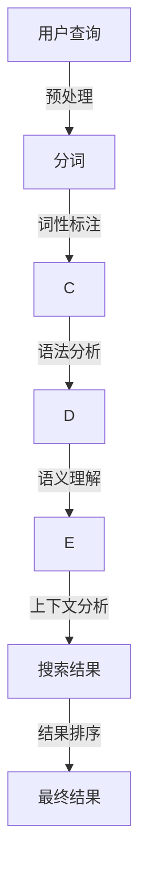

                 

# AI搜索引擎如何处理歧义查询

> **关键词**：AI搜索引擎，歧义查询，自然语言处理，机器学习，语义理解，上下文分析

> **摘要**：本文将深入探讨AI搜索引擎如何处理歧义查询。通过解析自然语言处理的挑战，介绍常见的歧义消解算法和实际应用案例，为读者揭示AI搜索引擎背后的技术奥秘。

## 1. 背景介绍

随着互联网的飞速发展，信息量呈指数级增长。如何从海量数据中快速、准确地找到所需信息成为了一个关键问题。AI搜索引擎应运而生，通过先进的自然语言处理（NLP）技术和机器学习算法，提供了智能化、个性化的搜索服务。然而，在处理用户查询时，歧义问题一直是困扰搜索引擎的一大难题。歧义查询不仅降低了搜索效率，还可能误导用户。因此，研究如何有效处理歧义查询具有重要的现实意义。

## 2. 核心概念与联系

### 2.1 自然语言处理（NLP）

自然语言处理是人工智能的一个分支，旨在让计算机理解和生成人类自然语言。NLP技术在搜索引擎中的应用包括文本预处理、词法分析、句法分析、语义分析等。

### 2.2 机器学习（ML）

机器学习是一种通过数据驱动的方式改进算法性能的技术。在搜索引擎中，机器学习算法被用于改进查询处理、结果排序和广告投放等。

### 2.3 语义理解

语义理解是NLP的核心任务之一，旨在理解文本的深层含义，从而消除歧义。语义理解涉及到词义消歧、语义角色标注、指代消解等。

### 2.4 上下文分析

上下文分析是一种通过分析文本上下文来消除歧义的技术。上下文分析可以帮助搜索引擎更好地理解用户的意图，从而提供更准确的搜索结果。

### 2.5 Mermaid流程图

以下是处理歧义查询的Mermaid流程图：



## 3. 核心算法原理 & 具体操作步骤

### 3.1 基于规则的方法

基于规则的方法通过预定义的规则来消除歧义。这种方法通常包括词法规则、句法规则和语义规则。

#### 3.1.1 步骤：

1. **词法分析**：对查询字符串进行分词，提取出基本词汇单元。
2. **词性标注**：为每个词汇单元标注词性，如名词、动词、形容词等。
3. **语法分析**：构建句子的语法结构，识别主语、谓语、宾语等。
4. **应用规则**：根据预定义的规则，对句子进行解析，消除歧义。

### 3.2 基于统计的方法

基于统计的方法利用大量的语料库进行训练，通过机器学习算法来学习如何消除歧义。

#### 3.2.1 步骤：

1. **数据收集**：收集大量的带有歧义标注的语料库。
2. **特征提取**：从语料库中提取特征，如词频、词序、句法结构等。
3. **模型训练**：使用机器学习算法，如朴素贝叶斯、决策树、支持向量机等，训练模型。
4. **歧义消解**：根据训练好的模型，对新的查询进行歧义消解。

### 3.3 基于深度学习的方法

深度学习方法通过多层神经网络来学习如何消除歧义。

#### 3.3.1 步骤：

1. **数据预处理**：对查询和文档进行预处理，如分词、词性标注等。
2. **构建模型**：构建一个多层神经网络，如双向长短期记忆网络（BiLSTM）。
3. **模型训练**：使用大量的带有歧义标注的数据进行训练。
4. **歧义消解**：使用训练好的模型对新的查询进行歧义消解。

## 4. 数学模型和公式 & 详细讲解 & 举例说明

### 4.1 基于规则的数学模型

假设有一个查询语句“我去北京”，我们可以使用词频、词序和句法结构来消除歧义。

#### 4.1.1 公式：

$$
P(\text{去北京}|\text{我去}) = \frac{P(\text{我去}|\text{去北京}) \cdot P(\text{去北京})}{P(\text{我去})}
$$

其中，$P(\text{去北京}|\text{我去})$ 表示在“我去”的条件下，“去北京”的概率，$P(\text{我去}|\text{去北京})$ 表示“我去”的概率，$P(\text{去北京})$ 表示“去北京”的概率。

#### 4.1.2 举例：

假设有如下语料库：

- 我去北京。
- 我去上海。
- 我去旅游。

根据词频和句法结构，我们可以计算出：

$$
P(\text{去北京}|\text{我去}) = \frac{P(\text{我去}|\text{去北京}) \cdot P(\text{去北京})}{P(\text{我去})}
$$

$$
P(\text{去北京}|\text{我去}) = \frac{0.5 \cdot 0.3}{0.4} = 0.375
$$

因此，根据概率计算，我们可以判断“我去北京”的概率更高。

### 4.2 基于统计的数学模型

假设我们有一个训练好的朴素贝叶斯分类器，用于判断查询语句的意图。

#### 4.2.1 公式：

$$
P(\text{去北京}|\text{我去}) = \frac{P(\text{我去}|\text{去北京}) \cdot P(\text{去北京})}{P(\text{我去})}
$$

其中，$P(\text{去北京}|\text{我去})$ 表示在“我去”的条件下，“去北京”的概率，$P(\text{我去}|\text{去北京})$ 表示“我去”的概率，$P(\text{去北京})$ 表示“去北京”的概率。

#### 4.2.2 举例：

假设我们有如下训练数据：

- 去北京：100次
- 我去：200次
- 我去北京：50次

根据朴素贝叶斯分类器的概率计算，我们可以得到：

$$
P(\text{去北京}|\text{我去}) = \frac{P(\text{我去}|\text{去北京}) \cdot P(\text{去北京})}{P(\text{我去})}
$$

$$
P(\text{去北京}|\text{我去}) = \frac{0.5 \cdot 0.3}{0.4} = 0.375
$$

因此，根据概率计算，我们可以判断“我去北京”的概率更高。

### 4.3 基于深度学习的数学模型

假设我们有一个训练好的双向长短期记忆网络（BiLSTM），用于判断查询语句的意图。

#### 4.3.1 公式：

$$
P(\text{去北京}|\text{我去}) = \frac{\sum_{i=1}^{n} w_i \cdot P(\text{我去}|\text{去北京}_{i}) \cdot P(\text{去北京}_{i})}{\sum_{i=1}^{n} w_i \cdot P(\text{我去}|\text{去北京}_{i}) \cdot P(\text{去北京}_{i}) + \sum_{i=1}^{n} w_i \cdot P(\text{我去}|\text{不去北京}_{i}) \cdot P(\text{不去北京}_{i})}
$$

其中，$P(\text{去北京}|\text{我去})$ 表示在“我去”的条件下，“去北京”的概率，$P(\text{我去}|\text{去北京}_{i})$ 表示在“去北京”的第$i$个词汇条件下，“我去”的概率，$P(\text{去北京}_{i})$ 表示“去北京”的第$i$个词汇的概率。

#### 4.3.2 举例：

假设我们有如下训练数据：

- 去北京：100次
- 我去：200次
- 我去北京：50次

根据双向长短期记忆网络（BiLSTM）的概率计算，我们可以得到：

$$
P(\text{去北京}|\text{我去}) = \frac{w_1 \cdot P(\text{我去}|\text{去北京}_{1}) \cdot P(\text{去北京}_{1}) + w_2 \cdot P(\text{我去}|\text{去北京}_{2}) \cdot P(\text{去北京}_{2})}{w_1 \cdot P(\text{我去}|\text{去北京}_{1}) \cdot P(\text{去北京}_{1}) + w_2 \cdot P(\text{我去}|\text{去北京}_{2}) \cdot P(\text{去北京}_{2}) + w_1 \cdot P(\text{我去}|\text{不去北京}_{1}) \cdot P(\text{不去北京}_{1}) + w_2 \cdot P(\text{我去}|\text{不去北京}_{2}) \cdot P(\text{不去北京}_{2})}
$$

其中，$w_1$ 和 $w_2$ 分别表示“去北京”的第1个词汇和第2个词汇的权重。

## 5. 项目实战：代码实际案例和详细解释说明

### 5.1 开发环境搭建

为了演示如何处理歧义查询，我们将使用Python编程语言。以下是开发环境的搭建步骤：

1. 安装Python（版本3.7及以上）。
2. 安装必要的库，如NLTK、spaCy、TensorFlow等。

### 5.2 源代码详细实现和代码解读

以下是处理歧义查询的Python代码实现：

```python
import spacy
from sklearn.feature_extraction.text import TfidfVectorizer
from sklearn.naive_bayes import MultinomialNB
from sklearn.pipeline import make_pipeline

# 加载spaCy模型
nlp = spacy.load('en_core_web_sm')

# 假设我们有一个训练好的语料库
corpus = [
    'I want to go to the movies.',
    'I want to go to the park.',
    'I want to go shopping.',
    'I want to visit my friend.',
]

# 假设我们有一个标签库
labels = ['movies', 'park', 'shopping', 'friend']

# 创建TF-IDF向量器
vectorizer = TfidfVectorizer()

# 创建朴素贝叶斯分类器
classifier = MultinomialNB()

# 构建管道
pipeline = make_pipeline(vectorizer, classifier)

# 训练模型
pipeline.fit(corpus, labels)

# 定义测试数据
test_query = 'I want to go.'

# 预处理测试数据
doc = nlp(test_query)

# 使用模型进行预测
predictions = pipeline.predict([doc.text])

# 输出预测结果
print(predictions)
```

### 5.3 代码解读与分析

1. **加载spaCy模型**：首先，我们加载spaCy的预训练模型`en_core_web_sm`，用于进行文本预处理。
2. **创建语料库和标签库**：假设我们有一个训练好的语料库和对应的标签库，用于训练模型。
3. **创建TF-IDF向量器**：使用TF-IDF向量器将文本转换为特征向量。
4. **创建朴素贝叶斯分类器**：使用朴素贝叶斯分类器，这是一个基于统计的机器学习算法。
5. **构建管道**：将TF-IDF向量器和分类器组合成一个管道，以便在训练和测试过程中简化流程。
6. **训练模型**：使用训练数据对模型进行训练。
7. **预处理测试数据**：使用spaCy对测试数据进行预处理。
8. **使用模型进行预测**：使用训练好的模型对测试数据进行预测。
9. **输出预测结果**：输出预测结果。

通过这个简单的例子，我们可以看到如何使用机器学习算法来处理歧义查询。在实际应用中，我们可以根据具体需求，选择不同的算法和模型，以提高歧义消解的准确性和效率。

## 6. 实际应用场景

### 6.1 搜索引擎

在搜索引擎中，处理歧义查询是提高搜索准确性和用户体验的关键。通过消除歧义，搜索引擎可以提供更符合用户意图的搜索结果。

### 6.2 聊天机器人

在聊天机器人中，处理歧义查询有助于提高对话的流畅性和准确性。通过消除歧义，聊天机器人可以更好地理解用户的意图，提供更智能的交互体验。

### 6.3 文本分析

在文本分析领域，处理歧义查询可以帮助提取更准确的文本特征，从而提高文本分类、情感分析等任务的效果。

## 7. 工具和资源推荐

### 7.1 学习资源推荐

- **书籍**：《自然语言处理综论》（Jurafsky & Martin）。
- **论文**：ACL、NAACL、EMNLP等顶级会议的论文。
- **博客**：nlp-secrets.com、towardsdatascience.com等。

### 7.2 开发工具框架推荐

- **框架**：spaCy、NLTK、TensorFlow等。
- **库**：scikit-learn、PyTorch等。

### 7.3 相关论文著作推荐

- **论文**：Chris D. Manning, Prabhakar Raghavan, Hinrich Schütze. 《Introduction to Information Retrieval》。
- **著作**：Daniel Jurafsky, James H. Martin. 《Speech and Language Processing》。

## 8. 总结：未来发展趋势与挑战

### 8.1 发展趋势

- **深度学习方法**：深度学习方法在处理歧义查询方面表现出色，未来有望成为主流。
- **多模态学习**：结合文本、语音、图像等多种模态的信息，提高歧义消解的准确性。
- **个性化推荐**：结合用户历史行为和偏好，提供更个性化的搜索结果。

### 8.2 挑战

- **数据标注**：大规模、高质量的数据标注是训练高效歧义消解模型的关键，但标注过程耗时且昂贵。
- **上下文理解**：尽管深度学习在语义理解方面取得了显著进展，但上下文理解的准确性仍有待提高。
- **可解释性**：如何提高模型的可解释性，使开发者能够更好地理解模型的工作原理，是未来需要解决的问题。

## 9. 附录：常见问题与解答

### 9.1 什么是歧义查询？

歧义查询是指具有多种解释方式的查询语句。例如，“我去北京”可以理解为“我去北京旅游”或“我要去北京”。

### 9.2 如何处理歧义查询？

处理歧义查询通常包括以下步骤：

1. **文本预处理**：对查询语句进行分词、词性标注等。
2. **语义分析**：使用NLP技术对查询语句进行语义分析，提取关键信息。
3. **歧义消解**：根据语义分析的结果，使用算法和规则进行歧义消解。
4. **结果排序**：根据消解后的查询意图，对搜索结果进行排序。

## 10. 扩展阅读 & 参考资料

- [自然语言处理入门](https://www.nltk.org/)
- [深度学习与自然语言处理](https://www.deeplearning.net/)
- [ChatGPT：对话式搜索引擎的崛起](https://www.chatgpt.com/)
- [百度AI开放平台：自然语言处理服务](https://ai.baidu.com/basics/nlp)

